## Korea Equity Strategy

Update on the de-leveraging process in Korea

While the fundamentals of the Korea market remain on solid ground (despite some concerns – see below), an intense period of de-leveraging has driven equity prices lower. The KOSPI index is now down a sizable -28% from the peak on 22 June in a highly volatile move. What was triggered by routine fundamental concerns and rotational flow, was amplified by leveraged ETFs, and in recent days increasingly has the hallmarks of hedge fund positioning unwind (especially given the -30% Price Momentum factor drawdown). The rapid pace of gains in the Korea market over the past year made it an inevitable destination of leverage - from retail investors, equity L/S hedge funds as well as macro funds - compounding these gains. As we have noted for the past 6-7 weeks now (see here, here), some of the side effects of this growth have been the elevated volatility and forced foreign selling - producing a self-correcting mechanism. In the near term, our focus remains on the extent of normalization in these conditions (we estimate leveraged ETF unwind to be 75% through and equity H/F de-leveraging >50% through). Stepping back, though, our view remains that the fundamental strength in the market remains good for several years ahead (a combination of global AI spend, security/resilience spend, wealth effect across corporates/households/government and structural governance improvements), meaning that the market should be able to overcome positioning unwinds and persevere with the positive trend. We remain OW Korea in our regional allocations and our 12m-out base case KOSPI target remains 12,500.

\- Extent of leverage “normalization”: Of all the leverage channels in Korea, we see (1) futures & options largely an institutional market with limited signs of speculative excess, and (2) retail leverage via margin and bank loans as relatively modest (down a lot in KOSDAQ though). The issues around (3) swap capacity (globally rising funding costs compounded by Korea-specific capital constraints and concentration issues) and (4) volatility from outstanding leveraged ETFs – both remain but have materially eased (tactically, because the market is lower, and structurally, because the underlying issues are being addressed). We estimate leveraged ETF unwind to be 75% through (to an acceptable level of ~$18bn) and equity H/F deleveraging more than 50% through (assuming L/S ratios reach the upper end of 2025’s range).

\- Leveraged ETFs: Leveraged ETFs with Korea underlyings grew to $50bn in AUM (mostly due to the growth of the market) by late June. Relative to its market size, this was 4x larger than the US and led to very pronounced volatility (and forced de-leveraging on down-days) - the VKOSPI to VIX ratio is sill closer to 5x vs the usual 1x. Not only does this detract from vol-sensitive inflows, but it makes vol-based risk-management harder for asset managers and securities companies. Over Jun and July we have seen this excessive volatility compound the modest AI jitters seen elsewhere in global AI hardware stocks. Similar to previous deleveraging of leveraged products (Nikkei in 2015, Nasdaq in 2022, Oil in 2020, and most famously - even if somewhat differently - the inverse VIX products in 2018), this period of volatility has shrunk leveraged ETFs with Korea underlyings now to $26bn. With new regulations aimed at keeping tighter checks on the growth of this space (minimum deposit requirement raised to KRW30mn from KRW10mn from

Equity Macro Research

Mixo Das AC (852) 2800-0511  
mixo.das@JPM.com  
JPM Securities (Asia Pacific) Limited/ JPM Broking (Hong Kong) Limited

Stanley Yang  
(82-2) 758-5712  
stanley.yang@JPM.com  
JPM Securities (Far East) Limited, Seoul Branch

Rajiv Batra  
(65) 6882-8151  
rajiv.j.batra@JPM.com  
JPM Securities Singapore Private Limited

Joy Wang  
(852) 2800-2322  
joy.y.wang@JPM.com  
JPM Securities (Asia Pacific) Limited/ JPM Broking (Hong Kong) Limited

See page 8 for analyst certification and important disclosures, including non-US analyst disclosures.

Aug 5 $^{th}$ , only cash will be recognized as the initial margin from Aug 19 $^{th}$ , new listings of single-stock levered ETF products are temporarily halted, minimum trading unit for single-stock leveraged products will be raised from 1 share to 20 shares starting in Nov), further moderation in size is likely ahead.

\- HF leverage and swap capacity: Swap capacity limits (for investors to access Korea equities via brokers) have been tightening for a while - faced with rapidly rising interest from global equity and macro investors (gross and net exposure towards Korea in the JPM Prime book have risen rapidly since April). This is partly a global story, where higher demand for financing (due to growth in markets and shift in AUM mix to higher leveraged entities) and tightening regulations having driven funding rates higher. It is also partly a Korea story, given the higher capital needed to match higher trading volumes (6-7x over the past year) and difficulty in managing concentration risks of investors unanimously preferring positions in the memory space. With the decline in market size and underperformance of memory names, though, this capacity tightness has eased substantially (a full normalization is still some distance away as brokers and investors work through these constraints). Similarly, in the present de-leveraging process, L/S ratios in the JPM Prime book have declined from highs of $>5.5\mathrm{x}$ to now $<4\mathrm{x}$ .

\- Retail leverage and margins: Margin balances have declined somewhat from a high of >$25bn to ~$21bn now. Notably, most of the declines and margin calls have been in smaller-cap KOSDAQ market, and not in KOSPI. But at $21bn, this is just 0.5% of equity market cap (vs 1.9% of market cap in the US and 2.8% in China A-shares). In addition, unlike leveraged ETFs that undergo a process of forced de-leveraging on any spot price declines, margin lending comes with buffers and discretion. Korean retail investors still have ample equity gains, cash balances, higher incomes and overseas assets to tap into to absorb any margin calls should they want to keep the position. We are thus less concerned about margin calls and de-leveraging through this channel becoming a systemic problem.

\- Record foreign outflows are slowing: There has been >$110bn of foreign outflows from Korea YTD - which would handily break the record of annual outflows from any market in Asia. The two memory names had become so large that they started to hit mandate limits for EM investors - which we estimated to be affecting roughly 10% of the foreign ownership in both stocks in 2Q. This forced investors to sell on rallies. Indeed, ~90% of YTD foreign outflows from Korea come from the memory names alone. This selling pressure has eased tactically as Korea (and particularly the memory names) has underperformed, meaning that the two heavyweights are now only 7.5% and 5.7% weights in MSCI EM (vs 9.5% and 8.3% in late June).

\- Fundamentals: We remain bullish on the AI cycle and related fundamentals. Earnings growth rate in Korea will slow from the scorching pace of 2026, but the question in Korea now is less about growth and more about sustainability (how much visibility can we have about higher earnings levels). While monetization at the model layer is being questioned again (with very positive reception to open-source models), at the hyperscaler layer the rental economics for data centers remain very positive. This means that hyperscalers should keep spending up. All our indicators on this are currently green across model capability, funding availability and rental rates. And external risks (like regulation, recession, etc.) don’t look imminent. Memory demand has been questioned recently with reported technological and process breakthroughs reducing memory demand – but we are yet to see this in reality. And in terms of supply, the supply of memory equity should not be conflated with supply of physical memory. Outside of AI, there are earnings tailwinds from growth in a variety of (AI-adjacent and other) Industrials, potential wealth-effect boost to Financials and Consumer, and ongoing (if incremental) valuation tailwinds from the governance reforms (which will likely come back to prominence later this year).

Figure 1: KOSPI index has declined $-29\%$ from the peak of 22 Jun  
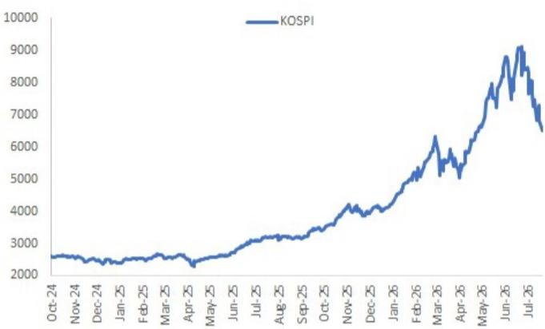  
Source: Bloomberg Finance L.P., JPM Equity Macro Research.

Figure 2: Bringing the index RSI to lowest levels since the start of this rally post Liberation Day in 2025  
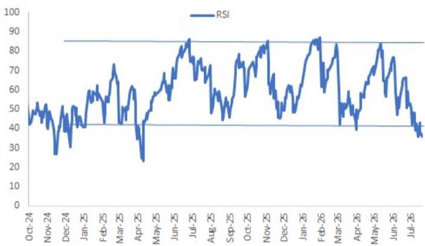  
Source: Bloomberg Finance L.P., JPM Equity Macro Research.

Figure 3: Korea is still the best performing market in the region YTD in USD terms  
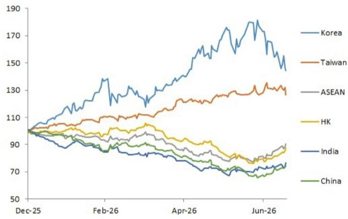  
Source: Bloomberg Finance L.P., JPM Equity Macro Research.

Figure 4: KOSPI has largely been a reflection of memory upside in recent months  
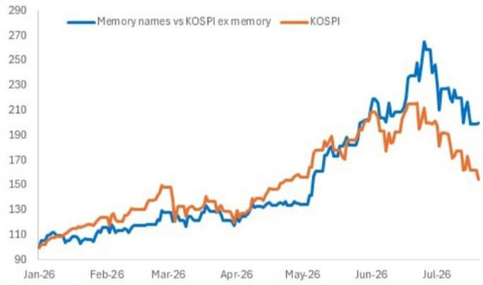  
Source: Bloomberg Finance L.P., JPM Equity Macro Research.

Figure 5: Margin balances and leveraged products are the primary channels for retail investors to access leveraged upside - in Korea margin balances are very acceptable, but leveraged ETFs outstanding are still large

<table><tr><td>$bn</td><td>Market cap</td><td>Margin balances</td><td>% of Mcap</td><td>Leveraged ETFs outstanding</td><td>% of Mcap</td></tr><tr><td>US</td><td>80000</td><td>1502</td><td>1.9%</td><td>250</td><td>0.3%</td></tr><tr><td>Korea</td><td>4000</td><td>21</td><td>0.5%</td><td>26</td><td>0.7%</td></tr><tr><td>Japan</td><td>8800</td><td>43</td><td>0.5%</td><td>5</td><td>0.1%</td></tr><tr><td>China A</td><td>15000</td><td>422</td><td>2.8%</td><td>1</td><td>0.0%</td></tr><tr><td>Taiwan</td><td>5000</td><td>19</td><td>0.4%</td><td>8</td><td>0.2%</td></tr></table>

Source: Bloomberg Finance L.P., FINRA, KOFIA, JPX, JPM Equity Macro Research.

Figure 6: For retail investors, margin leverage is not too high (and falling vs market cap)  
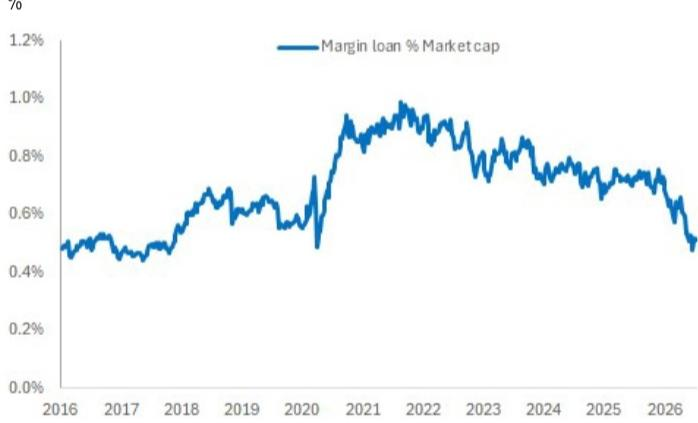  
Source: Bloomberg Finance L.P., JPM Equity Macro Research.

Figure 8: In terms of leveraged ETFs, their AUM has declined from highs of $50bn to now $26bn  
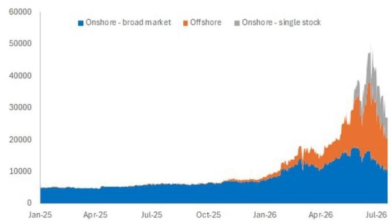

Figure 7: Similarly there is little evidence at the aggregate level that Korean households are borrowing from banks to invest in equities loans to households %y-y. Data as of April 2026  
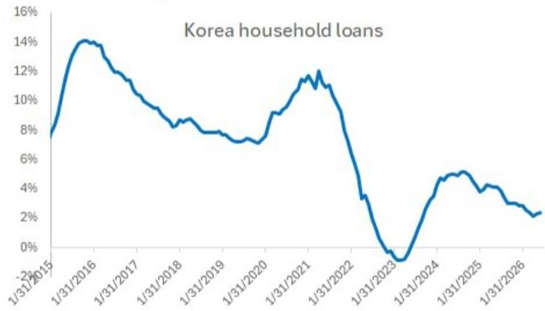  
Source: Bloomberg Finance L.P., JPM Equity Macro Research.  
Source: Bloomberg Finance L.P., JPM Equity Macro Research.

Figure 9: To be sure, much of this is simply due to the decline in the market, as flows have continued to actually be positive
cumulative inflows, USD mn  
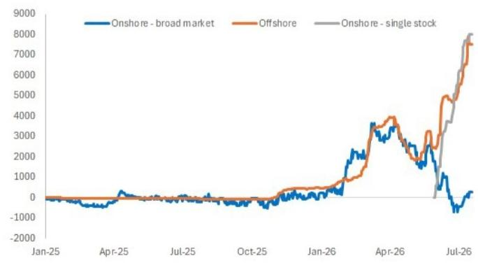  
Source: Bloomberg Finance L.P., JPM Equity Macro Research.

Figure 10: Largely as a result of leveraged ETF hedging, volatility in Korea has notably disconnected from volatility elsewhere - and yet to normalize  
X  
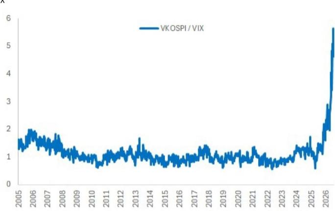  
Source: Bloomberg Finance L.P., JPM Equity Macro Research.

Figure 12: Separately, Korean equities have seen >$110bn of outflows YTD, but most of this is due to mandate constraints for LOs on owning large-caps

cumulative flow, $mn, KRX data

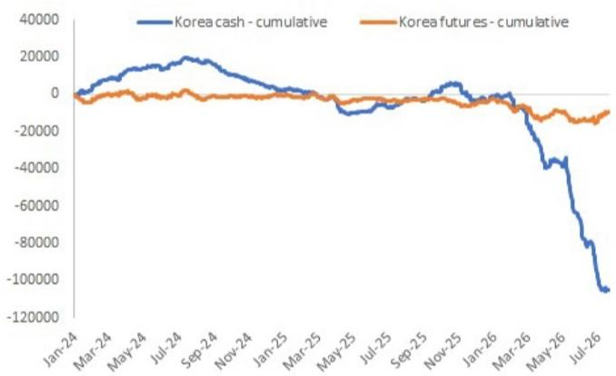  
Source: Bloomberg Finance L.P., JPM Equity Macro Research.  
Figure 11: The open interest of single stock futures (implementation channel of the leveraged ETFs) has started to decline now USD mn  
cumulative flow, $mn

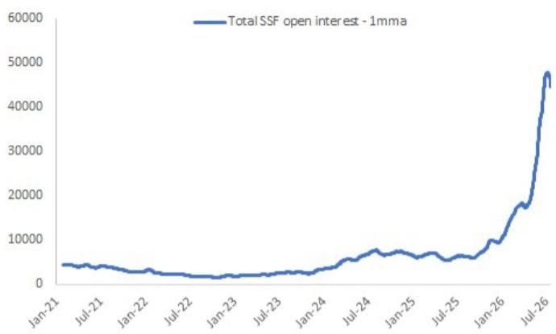  
Source: Bloomberg Finance L.P., JPM Equity Macro Research.

Figure 13: Indeed, $90\%$ of the outflow is from the two memory names. The decline in EM index weights of these stocks has substantially slowed outflows

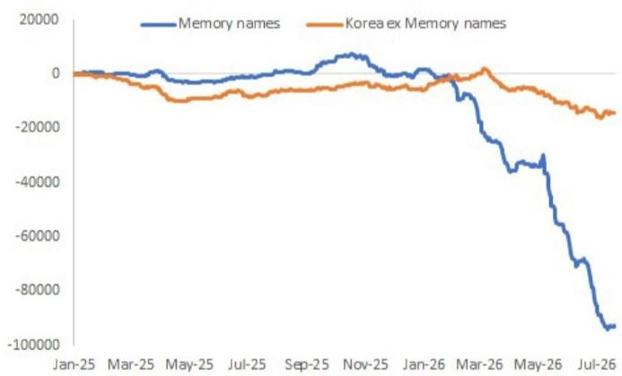  
Source: Bloomberg Finance L.P., JPM Equity Macro Research.

Figure 18: Price momentum factor has seen a deep drawdown in recent weeks - similar to US, Japan etc indicative performance of L/S quintiles

Figure 14: L/S ratios for hedge funds in the JPM Prime book has declined from highs, but not fully normalized  
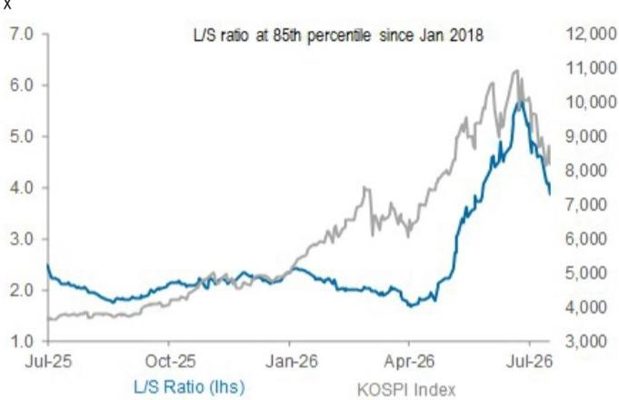  
Source: Bloomberg Finance L.P., JPM Positioning Intelligence.

Figure 15: EM LO investors have become more UW Korea YTD as mandate constraints bite  
weightings relative to the MSCI benchmark and net OW/UW  
  
Source: Bloomberg Finance L.P., EPFR, MSCI, JPM Equity Macro Research.

Figure 16: Retail investors have been the main buyers of Korean equities - sentiment about equities and leverage is still strong KRW bn, KRX data  
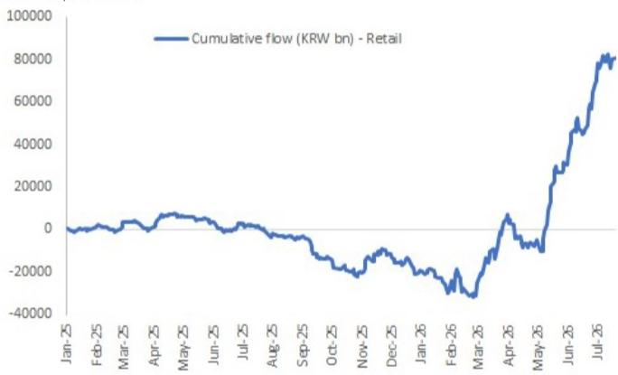  
Source: Bloomberg Finance L.P., JPM Equity Macro Research.

Figure 17: Since the beginning of June, most purchased overseas stocks by Korean retail investors include several leveraged products $bn  
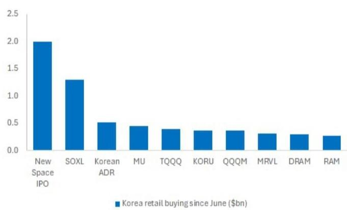  
Source: Bloomberg Finance L.P., JPM Equity Macro Research.

<table><tr><td></td><td>Px Momentum</td><td>EPS revision</td><td>Growth</td><td>Quality</td><td>Value</td><td>Low Vol</td></tr><tr><td>Week ending 03-Jul</td><td>-10.8%</td><td>-4.9%</td><td>-0.8%</td><td>3.3%</td><td>0.9%</td><td>8.7%</td></tr><tr><td>Week ending 10-Jul</td><td>-7.9%</td><td>-3.1%</td><td>-2.1%</td><td>0.8%</td><td>5.6%</td><td>7.9%</td></tr><tr><td>Week ending 17-Jul</td><td>-6.3%</td><td>-3.0%</td><td>0.6%</td><td>1.9%</td><td>1.3%</td><td>7.0%</td></tr><tr><td>Week ending 24-Jul</td><td>-1.7%</td><td>0.4%</td><td>-1.0%</td><td>-0.2%</td><td>1.3%</td><td>3.4%</td></tr></table>

Figure 19: Momentum crowding is now starting to come off  
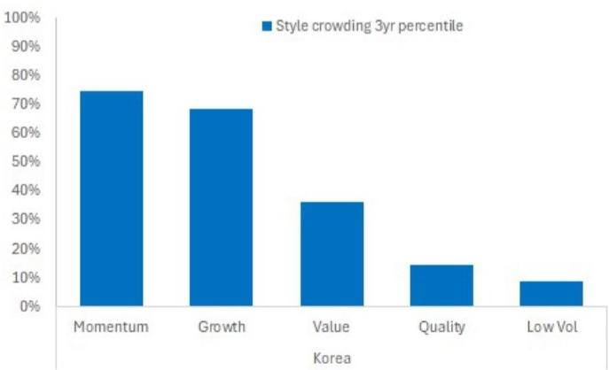  
Source: Bloomberg Finance L.P., JPM Equity Macro Research.

Figure 20: Drawdown in Price Momentum factor still leaves strong YTD performance

indicative performance of L/S quintile - log scale

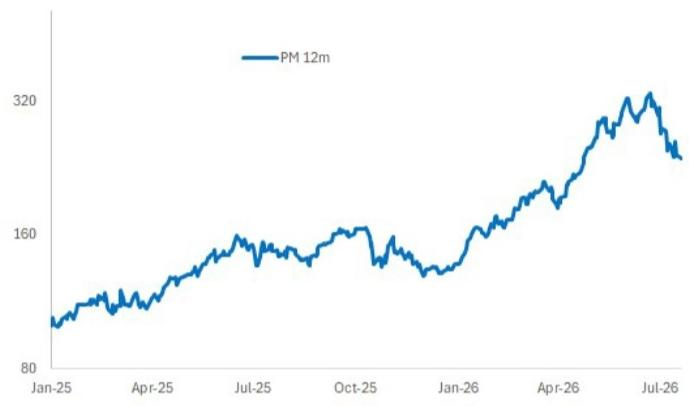  
Source: Bloomberg Finance L.P., JPM Equity Macro Research.

Figure 21: 3Q tends to be reasonably strong seasonally for Price Momentum factor performance in Korea - 4Q is more challenging Average performance over past five years  
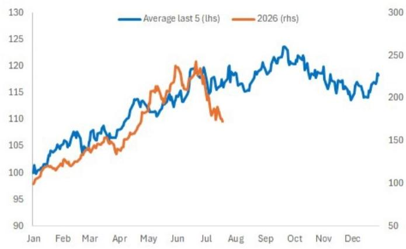  
Source: Bloomberg Finance L.P., JPM Equity Macro Research.

Figure 22: Korea sector EPS revisions remain strong as earnings get underway

<table><tr><td rowspan="2"></td><td colspan="3">2026 EPS</td><td colspan="3">2027 EPS</td></tr><tr><td>1m</td><td>3m</td><td>6m</td><td>1m</td><td>3m</td><td>6m</td></tr><tr><td>Market</td><td>7.8%</td><td>35.5%</td><td>143.4%</td><td>12.2%</td><td>53.7%</td><td>199.8%</td></tr><tr><td>Tech</td><td>8.5%</td><td>42.2%</td><td>215.5%</td><td>13.1%</td><td>63.1%</td><td>303.3%</td></tr><tr><td>Financials</td><td>1.7%</td><td>5.7%</td><td>9.8%</td><td>2.3%</td><td>6.5%</td><td>11.1%</td></tr><tr><td>Industrials</td><td>11.8%</td><td>42.6%</td><td>91.0%</td><td>18.1%</td><td>59.4%</td><td>108.6%</td></tr><tr><td>Discretionary</td><td>0.5%</td><td>-4.5%</td><td>-8.9%</td><td>0.8%</td><td>-3.3%</td><td>-6.8%</td></tr><tr><td>Materials</td><td>-5.8%</td><td>-9.0%</td><td>-13.9%</td><td>-2.3%</td><td>-1.2%</td><td>1.4%</td></tr><tr><td>Staples</td><td>3.0%</td><td>7.5%</td><td>11.7%</td><td>3.2%</td><td>8.2%</td><td>12.8%</td></tr><tr><td>Healthcare</td><td>0.6%</td><td>-3.2%</td><td>1.6%</td><td>0.9%</td><td>-6.3%</td><td>-3.0%</td></tr><tr><td>Comm Serv</td><td>-0.9%</td><td>-5.4%</td><td>-10.0%</td><td>-0.2%</td><td>0.1%</td><td>-4.5%</td></tr><tr><td>Energy</td><td>-4.5%</td><td>92.5%</td><td>127.7%</td><td>1.0%</td><td>34.2%</td><td>52.6%</td></tr></table>

Source: Refinitiv, JPM Equity Macro Research.

Analyst Certification: The Research Analyst(s) denoted by an “AC” on the cover of this report certifies (or, where multiple Research Analysts are primarily responsible for this report, the Research Analyst denoted by an “AC” on the cover or within the document individually certifies, with respect to each security or issuer that the Research Analyst covers in this research) that: (1) all of the views expressed in this report accurately reflect the Research Analyst’s personal views about any and all of the subject securities or issuers; and (2) no part of any of the Research Analyst's compensation was, is, or will be directly or indirectly related to the specific recommendations or views expressed by the Research Analyst(s) in this report. For all Korea-based Research Analysts listed on the front cover, if applicable, they also certify, as per KOFIA requirements, that the Research Analyst’s analysis was made in good faith and that the views reflect the Research Analyst’s own opinion, without undue influence or intervention.

All authors named within this report are Research Analysts who produce independent research unless otherwise specified. In Europe, Sector Specialists (Sales and Trading) may be shown on this report as contacts but are not authors of the report or part of the Research Department.

## Important Disclosures

Company-Specific Disclosures: JPM does and seeks to do business with companies covered in its research reports. As a result, investors should be aware that the firm may have a conflict of interest that could affect the objectivity of this report. Investors should consider this report as only a single factor in making their investment decision. Important disclosures, including price charts and credit opinion history tables (if applicable), are available for compendium reports and all JPM-covered companies, and certain non-covered companies, by visiting https://www.jpmm.com/research/disclosures, calling 1-800-477-0406, or e-mailing research.disclosure.inquiries@JPM.com with your request.

## Explanation of Equity Research Ratings, Designations and Analyst(s) Coverage Universe:

JPM uses the following rating system: Overweight (over the duration of the price target indicated in this report, we expect this stock will outperform the average total return of the stocks in the Research Analyst's, or the Research Analyst's team's, coverage universe); Neutral (over the duration of the price target indicated in this report, we expect this stock will perform in line with the average total return of the stocks in the Research Analyst's, or the Research Analyst's team's, coverage universe); and Underweight (over the duration of the price target indicated in this report, we expect this stock will underperform the average total return of the stocks in the Research Analyst's, or the Research Analyst's team's, coverage universe. NR is Not Rated. In this case, JPM has removed the rating and, if applicable, the price target, for this stock because of either a lack of a sufficient fundamental basis or for legal, regulatory or policy reasons. The previous rating and, if applicable, the price target, no longer should be relied upon. An NR designation is not a recommendation or a rating. Some stocks under coverage have a rating but no price target; in these cases, we expect the stock will outperform/perform in line/underperform the average total return of the stocks in the Research Analyst's, or the Research Analyst's team's, coverage universe of the relevant duration of the region. In our Asia (ex-Australia and ex-India) and U.K. small- and mid-cap Equity Research, each stock's expected total return is compared to the expected total return of a benchmark country market index, not to those Research Analysts' coverage universe. If it does not appear in the Important Disclosures section of this report, the certifying Research Analyst's coverage universe can be found on JPM's Research website, https://www.JPMmarkets.com.

JPM Equity Research Ratings Distribution, as of July 04, 2026

<table><tr><td></td><td>Overweight (buy)</td><td>Neutral (hold)</td><td>Underweight (sell)</td></tr><tr><td>JPM Global Equity Research Coverage*</td><td>53%</td><td>36%</td><td>12%</td></tr><tr><td>IB clients**</td><td>83%</td><td>80%</td><td>73%</td></tr><tr><td>JPMS Equity Research Coverage*</td><td>51%</td><td>37%</td><td>12%</td></tr><tr><td>IB clients**</td><td>95%</td><td>92%</td><td>87%</td></tr></table>

\*Please note that the percentages may not add to 100% because of rounding.

\*\*Percentage of subject companies within each of the "buy," "hold" and "sell" categories for which JPM has provided investment banking services within the previous 12 months.

For purposes of FINRA ratings distribution rules only, our Overweight rating falls into a buy rating category; our Neutral rating falls into a hold rating category; and our Underweight rating falls into a sell rating category. Please note that stocks with an NR designation are not included in the table above. This information is current as of the end of the most recent calendar quarter.

Equity Valuation and Risks: For valuation methodology and risks associated with covered companies or price targets for covered companies, please see the most recent company-specific research report at http://www.JPMmarkets.com, contact the primary analyst or your JPM representative, or email research.disclosure.inquiries@JPM.com. For material information about the proprietary models used, please see the Summary of Financials in company-specific research reports and the Company Tearsheets, which are available to download on the company pages of our client website, http://www.JPMmarkets.com. This report also sets out within it the material underlying assumptions used.

## History of Investment Recommendations:

A history of JPM investment recommendations disseminated during the preceding 12 months can be accessed on the Research & Commentary page of http://www.JPMmarkets.com where you can also search by analyst name, sector or financial instrument.

Analysts' Compensation: The research analysts responsible for the preparation of this report receive compensation based upon various factors, including the quality and accuracy of research, client feedback, competitive factors, and overall firm revenues.

Registration of non-US Analysts: Unless otherwise noted, the non-US analysts listed on the front of this report are employees of non-US affiliates of JPM Securities LLC, may not be registered as research analysts under FINRA rules, may not be associated persons of JPM Securities LLC, and may not be subject to FINRA Rule 2241 or 2242 restrictions on communications with covered companies, public appearances, and trading securities held by a research analyst account.

## Other Disclosures

JPM is a marketing name for investment banking businesses of JPM Chase & Co. and its subsidiaries and affiliates worldwide.

UK MIFID FICC research unbundling exemption: UK clients should refer to UK MIFID Research Unbundling exemption for details of JPM's implementation of the FICC research exemption and guidance on relevant FICC research categorisation.

All research material made available to clients are simultaneously available on our client website, JPM Markets, unless specifically permitted by relevant laws. Not all research content is redistributed, e-mailed or made available to third-party aggregators. For all research material available on a particular stock, please contact your sales representative.

Any long form nomenclature for references to China; Hong Kong; Taiwan; and Macau within this research material are Mainland China; Hong Kong SAR (China); Taiwan (China); and Macau SAR (China).

JPM may, from time to time, write on issuers or securities targeted by economic or financial sanctions imposed or administered by the governmental authorities of the U.S., EU, UK or other relevant jurisdictions (Sanctioned Securities). Nothing in this report is intended to be read or construed as encouraging, facilitating, promoting or otherwise approving investment or dealing in such Sanctioned Securities. Clients should be aware of their own legal and compliance obligations when making investment decisions.

Any digital or crypto assets discussed in this research report are subject to a rapidly changing regulatory landscape. For relevant regulatory advisories on crypto assets, including bitcoin and ether, please see https://www.JPM.com/disclosures/cryptoasset-disclosure.

The author(s) of this research report may not be licensed to carry on regulated activities in your jurisdiction and, if not licensed, do not hold themselves out as being able to do so.

Exchange-Traded Funds (ETFs): JPM Securities LLC (“JPMS”) acts as authorized participant for substantially all U.S.-listed ETFs. To the extent that any ETFs are mentioned in this report, JPMS may earn commissions and transaction-based compensation in connection with the distribution of those ETF shares and may earn fees for performing other trade-related services, such as securities lending to short sellers of the ETF shares. JPMS may also perform services for the ETFs themselves, including acting as a broker or dealer to the ETFs. In addition, affiliates of JPMS may perform services for the ETFs, including trust, custodial, administration, lending, index calculation and/or maintenance and other services.

Options and Futures related research: If the information contained herein regards options- or futures-related research, such information is available only to persons who have received the proper options or futures risk disclosure documents. Please contact your JPM Representative or visit https://www.theocc.com/components/docs/riskstoc.pdf for a copy of the Option Clearing Corporation's Characteristics and Risks of Standardized Options or

https://www.finra.org/sites/default/files/2020-08/Security\_Futures\_Risk\_Disclosure\_Statement\_2020.pdf for a copy of the Security Futures Risk Disclosure Statement.

Changes to Interbank Offered Rates (IBORs) and other benchmark rates: Certain interest rate benchmarks are, or may in the future become, subject to ongoing international, national and other regulatory guidance, reform and proposals for reform. For more information, please consult: https://www.JPM.com/global/disclosures/interbank\_offered\_rates

Private Bank Clients: Where you are receiving research as a client of the private banking businesses offered by JPM Chase & Co. and its subsidiaries (“JPM Private Bank”), research is provided to you by JPM Private Bank and not by any other division of JPM, including, but not limited to, the JPM Corporate and Investment Bank and its Global Research division.

Legal entity responsible for the production and distribution of research: The legal entity identified below the name of the Reg AC Research Analyst who authored this material is the legal entity responsible for the production of this research. Where multiple Reg AC Research Analysts authored this material with different legal entities identified below their names, these legal entities are jointly responsible for the production of this research. Where more than one legal entity is listed under an analyst's name, the first legal entity is responsible for the production unless stated otherwise. Research Analysts from various JPM affiliates may have contributed to the production of this material but may not be licensed to carry out regulated activities in your jurisdiction (and do not hold themselves out as being able to do so). Unless otherwise stated below in the legal entity disclosures, this material has been distributed by the legal entity responsible for production, or where more than one legal entity is listed under the analyst's name, the first legal entity will be responsible for distribution. If you have any queries, please contact the relevant Research Analyst in your jurisdiction or the entity in your jurisdiction that has distributed this research material.

Legal Entities Disclosures and Country-/Region-Specific Disclosures:

Argentina: JPM Chase Bank N.A Sucursal Buenos Aires is regulated by Banco Central de la República Argentina ("BCRA"- Central Bank of Argentina) and Comisión Nacional de Valores ("CNV"- Argentinian Securities Commission - ALYC y AN Integral N°51).

Australia: JPM Securities Australia Limited ("JPMSAL") (ABN 61 003 245 234/AFS Licence No: 238066) is regulated by the Australian Securities and Investments Commission and is a Market Participant of ASX Limited, a Clearing and Settlement Participant of ASX Clear Pty Limited and a Clearing Participant of ASX Clear (Futures) Pty Limited. This material is issued and distributed in Australia by or on behalf of JPMSAL only to "wholesale clients" (as defined in section 761G of the Corporations Act 2001). A list of all financial products covered can be found by visiting https://www.jpmm.com/research/disclosures. JPM seeks to cover companies of relevance to the domestic and international investor base across all Global Industry Classification Standard (GICS) sectors, as well as across a range of market capitalisation sizes. If applicable, in the course of conducting public side due diligence on the subject company(ies), the Research Analyst team may at times perform such diligence through corporate engagements such as site visits, discussions with company representatives, management presentations, etc. Research issued by JPMSAL has been prepared in accordance with JPM Australia's Research Independence Policy which can be found at the following link: JPM Australia - Research Independence Policy.

Brazil: Banco JPM S.A. is regulated by the Comissao de Valores Mobiliarios (CVM) and by the Central Bank of Brazil. Ombudsman JPM: 0800-7700847 / 0800-7700810 (For Hearing Impaired) / ouvidoria.jp.morgan@jpmchase.com.

Canada: JPM Securities Canada Inc. is a registered investment dealer, regulated by the Canadian Investment Regulatory Organization and the Ontario Securities Commission and is the participating member on Canadian exchanges. This material is distributed in Canada by or on behalf of JPM Securities Canada Inc.

Chile: Inversiones JPM Limitada is an unregulated entity incorporated in Chile.

China: JPM Securities (China) Company Limited has been approved by CSRC to conduct the securities investment consultancy business.

Colombia: Banco JPM Colombia S.A. is supervised by the Superintendencia Financiera de Colombia (SFC). Any reference in this material to products or services offered abroad by entities other than the Bank in Colombia is included exclusively for descriptive purposes. Such references do not constitute, and should not be construed as, promotional activity or the provision of financial products or services within Colombian territory, as defined under applicable Colombian regulation.

Dubai International Financial Centre (DIFC): JPM Chase Bank, N.A., Dubai Branch is regulated by the Dubai Financial Services Authority (DFSA) and its registered address is Dubai International Financial Centre - The Gate, West Wing, Level 3 and 9 PO Box 506551, Dubai, UAE. This material has been distributed by JPM Chase Bank, N.A., Dubai Branch to persons regarded as professional clients or market counterparties as defined under the DFSA rules.

European Economic Area (EEA): Unless specified to the contrary, research is distributed in the EEA by JPM SE (“JPM SE”), which is authorised as a credit institution by the Federal Financial Supervisory Authority (Bundesanstalt für Finanzdienstleistungsaufsicht, BaFin) and jointly supervised by the BaFin, the German Central Bank (Deutsche Bundesbank) and the European Central Bank (ECB). JPM SE is a company headquartered in Frankfurt with registered address at TaunusTurm, Taunustor 1, Frankfurt am Main, 60310, Germany. The material has been distributed in the EEA to persons regarded as professional investors (or equivalent) pursuant to Art. 4 para. 1 no. 10 and Annex II of MiFID II and its
