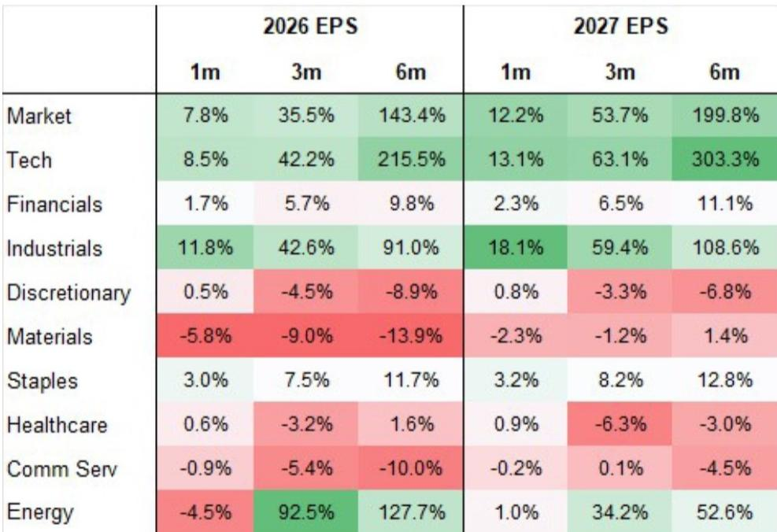
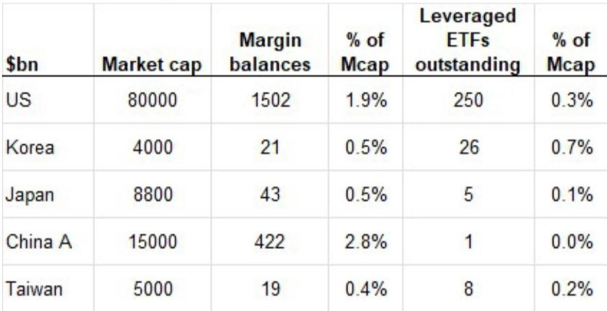
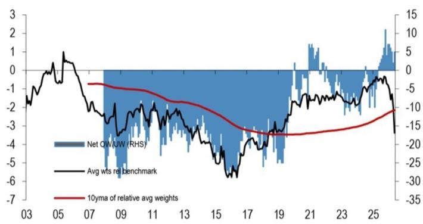

# 韩国市场调整：去杠杆事件，而非基本面转折——这对观察者意味着什么

KOSPI指数自6月22日高点回落28%，表面看幅度较大，但结构上与盈利衰退前的熊市有本质区别。此次调整由常规基本面担忧和资金轮动触发，随后被杠杆ETF放大，近期更呈现对冲基金仓位调整的特征——仅价格动量因子就经历了约30%的回撤。然而，底层盈利轨迹保持完整，2026年每股盈利修正在过去一个月仍为正7.8%，三个月为正35.5%。对于机构观察者而言，问题不在于韩国市场是否出现问题，而在于去杠杆进程是否已足够充分，以及哪些杠杆渠道仍存在剩余风险。

答案是：此次调整是过度持仓的自我修正机制，而非对韩国多年基本面叙事的否定。杠杆ETF资产管理规模已从500亿美元缩减至260亿美元，去化约完成75%。对冲基金杠杆率（以主经纪商账簿的多空比率衡量）已从5.5倍以上降至4倍以下，超过一半的去杠杆进程已完成。散户保证金余额为210亿美元，仅占市值的0.5%——远低于美国的1.9%或中国A股的2.8%。这些机制的组合意味着，强制卖出主要是持仓事件，而非流动性危机或基本面恶化。12个月基准情景下KOSPI目标仍为12,500点，暗示当前水平存在显著上行空间，而市场在维持盈利修正为正的同时吸收这一去化过程，本身就是结构韧性的信号。

这一时刻的战略重要性在于，杠杆来源的风险特征、正常化阶段以及对不同类型观察者的影响并不统一。区分强制去杠杆、自主去杠杆和结构性容量约束的框架，对于判断风险已过何处、风险仍存何处至关重要。

## 杠杆ETF已承受调整主要冲击，但剩余波动风险仍高于正常水平

韩国杠杆ETF市场在6月底资产管理规模增长至500亿美元，相对于市值的规模约为美国同类市场的四倍。这造成了机械性脆弱性：在任何下跌日，杠杆ETF的对冲操作会强制追加卖出，放大跌幅并产生与全球权益风险脱节的波动率飙升。VKOSPI与VIX的比率通常徘徊在1倍左右，一度接近5倍。这不仅抑制了对波动敏感的流入，还显著增加了在韩国市场运营的资产管理公司和证券公司的风险管理难度。

去化过程显著。杠杆ETF资产管理规模已降至260亿美元，新的监管措施将加速正常化。从8月开始，杠杆产品的最低保证金要求将从1000万韩元提高至3000万韩元，仅接受现金作为初始保证金，单一股票杠杆ETF的新上市被暂时暂停，到11月单一股票杠杆产品的最低交易单位将从1股增加至20股。这些结构性变化将限制该渠道的再杠杆化，即使市场复苏也是如此。

对观察者的启示是，杠杆ETF渠道已不再是尾部风险的主要来源，但波动率尚未正常化。VKOSPI与VIX的比率仍处于高位，在恢复到接近历史1倍关系之前，市场对下行冲击的敏感度将高于其基本面状况所应有的水平。对于纯多头观察者而言，这创造了战术性机会：随着ETF去化完成，韩国权益中隐含的波动率溢价可能压缩，从而在盈利增长之外提供额外回报来源。对于对冲基金而言，该渠道的正常化消除了一个关键的机械性卖出压力来源，该压力此前放大了动量驱动的回撤。

## 对冲基金去杠杆已过半，但互换容量约束是结构性瓶颈

对冲基金渠道是此次调整的重要放大器，但其机制与杠杆ETF渠道不同，需要单独评估。主经纪商账簿的多空比率自4月以来迅速上升，原因是全球权益和宏观基金因回报集中在存储板块而增加了对韩国的总敞口和净敞口。当市场转向时，这些比率从5.5倍以上降至4倍以下，约占预期正常化的50%以上。

然而，更持久的约束是互换容量。经纪商在全球范围内面临融资成本上升，但韩国特有的维度更为突出。过去一年，韩国权益的交易量增长了六到七倍，需要证券公司配置更多资本。同时，观察者几乎一致将头寸集中在存储领域，造成了经纪商在其风险限额内难以管理的集中度风险。随着市场下跌和存储股表现不佳，这种容量紧张已大幅缓解，但互换容量的完全正常化仍有一段距离。

战略启示是，即使当前去杠杆周期结束，外国观察者增加韩国敞口的能力可能受到经纪商资产负债表的约束，而非基本面信念的约束。这是一个结构性转变，而非周期性转变。对于大型机构观察者而言，这意味着建立或调整韩国敞口将需要比以往周期更多的提前规划和与主经纪商的关系管理。对于整个市场而言，这表明下一轮外国资金流入将比2025年初看到的快速积累更为渐进，并且可能伴随着更高的波动性，因为容量约束与集中持仓相互作用。

## 散户杠杆并非某些人担心的系统性风险，但其构成值得关注

由于保证金追缴的高关注度以及韩国散户在市场动态中的历史角色，散户渠道吸引了大量关注。然而，数据讲述了一个更为细致的故事。保证金余额已从超过250亿美元的峰值下降至约210亿美元，但这仅占权益市值的0.5%——按国际和历史标准均处于低位。下跌和保证金追缴集中在KOSDAQ市场，而非KOSPI，且规模可控。

更重要的是，韩国散户杠杆具有强制去杠杆渠道所缺乏的缓冲。与杠杆ETF不同（后者在任何现货价格下跌时都会自动卖出），保证金贷款具有自主性和抵押缓冲。韩国散户观察者仍持有早期上涨带来的可观权益收益，拥有现金余额、更高收入以及海外资产，如果选择维持头寸，这些都可以用于满足保证金追缴。因此，系统性散户去杠杆事件的风险较低。

然而，值得关注的是散户敞口的构成。韩国散户观察者在此次调整中一直是韩国权益的主要买家，自6月以来的海外股票购买包括若干杠杆产品。这表明散户观察者并非被动持有者，而是积极使用杠杆来表达对市场的看法。虽然当前规模可控，但在单一观察者群体中结合杠杆ETF敞口和保证金借款，会产生监管机构正在密切关注的反馈循环。新的监管措施旨在防止这一循环变得危险，并且似乎正在产生预期效果。

## 创纪录的外国资金流出正在放缓，原因是授权约束缓解，而非信念动摇

年初至今超过1100亿美元的外国资金流出这一标题数字是前所未有的——这将打破亚洲任何市场年度资金流出的纪录。但这些流出的构成完全改变了其解读。约90%的流出仅来自两只存储股，驱动因素并非基本面信念丧失，而是机械性的授权约束。这两只股票规模增长如此之大，以至于开始触及新兴市场观察者的头寸限制，迫使其在反弹时卖出以保持在基准相对风险参数之内。

机制很简单。随着这两只存储股在MSCI新兴市场指数中的权重分别升至9.5%和8.3%，具有单一名称集中度限制的纯多头新兴市场基金被迫减少头寸。这种卖出并非对这些公司或韩国市场的否定；而是投资组合构建的必要性。报告估计，第二季度两只股票中约10%的外国持股受到此约束的影响。

好消息是，这种压力正在缓解。随着韩国市场表现相对落后且存储股下跌，它们在MSCI新兴市场指数中的权重已分别降至7.5%和5.7%。授权约束变得不那么严格，这意味着强制卖出可能会进一步放缓。对于一直在等待外国资金流出叙事耗尽的观察者而言，数据表明这一压力的峰值已经过去。剩余的外国卖出可能更多是自主性的，而非机械性的，这对市场而言是更健康的动态。

## 通过去杠杆周期进行布局的决策框架

不同的杠杆渠道处于不同的正常化阶段，它们对不同类型观察者的影响也不同。一个用于应对当前环境的结构化框架可以围绕三个问题构建：杠杆渠道是强制性的还是自主性的？正常化是周期性的还是结构性的？每个渠道对市场的剩余风险是什么？

对于杠杆ETF，答案很明确：去化约完成75%，监管变化是结构性的，剩余风险正在下降但尚未归零。波动率比率仍处于高位，这意味着杠杆ETF的对冲操作仍可能放大短期波动。对于战术交易者而言，这创造了利用波动率或布局VKOSPI与VIX价差正常化的机会。对于纯多头观察者而言，关键启示是来自该渠道的机械性卖出压力已基本过去，监管框架将防止6月极端情况重演。

对于对冲基金杠杆，正常化已过半，但互换容量约束是结构性的，即使在当前去杠杆结束后仍将持续。这意味着市场快速吸收大量资金流入的能力减弱，进而表明下一轮反弹可能比2025年初看到的更为渐进且波动更大。对于全球宏观和权益多空基金而言，启示是建立韩国敞口将需要比以往周期更多的耐心和更谨慎的执行。

对于散户杠杆，风险较低且缓冲充足。保证金渠道并非系统性风险来源，监管对杠杆产品的关注是适当的。这里的剩余风险是行为性的而非机械性的：如果市场进一步下跌且散户情绪急剧转变，保证金贷款的自主性仍可能产生额外卖出。但这是二阶风险，而非主要风险。

对于外国资金流出，授权驱动的卖出正在放缓，韩国的基本面案例仍然成立。科技、工业和金融板块的盈利修正数据强劲，人工智能资本支出周期没有放缓迹象。需要关注的关键风险并非资金流出本身，而是外国观察者回归的速度。鉴于互换容量约束和杠杆ETF渠道挥之不去的波动性，外国资金流入的回归可能是渐进的，而非突然的。

总体结论是，此次调整是一个持仓事件，而非基本面转折。导致回调的杠杆渠道要么已基本正常化，要么正在正常化过程中，监管应对也积极主动。市场的基本面驱动因素——全球人工智能支出、安全与韧性投资、企业和家庭的财富效应、以及结构性治理改善——仍然存在，并可能在去杠杆周期完成时重新发挥作用。对于具有12个月视野的观察者而言，当前水平代表进入一个市场的切入点，该市场的盈利轨迹仍然强劲为正，且估值已通过机械性而非基本面的调整得到重置。

*仅供参考。部分内容可能基于源材料通过AI辅助生成、翻译、总结或编辑，可能存在遗漏或错误。请独立核实。本文不构成专业建议。*

仅供参考。部分内容可能基于源材料通过AI辅助生成、翻译、总结或编辑，可能存在遗漏或错误。请独立核实。本文不构成专业建议。

