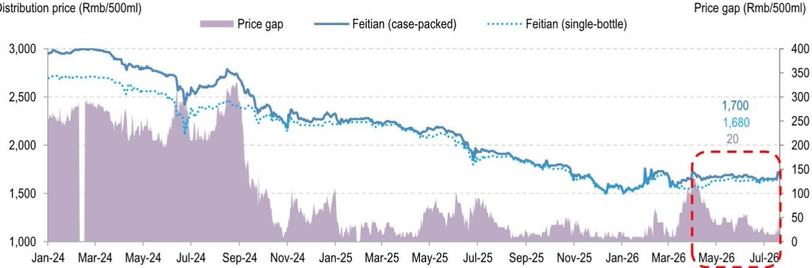
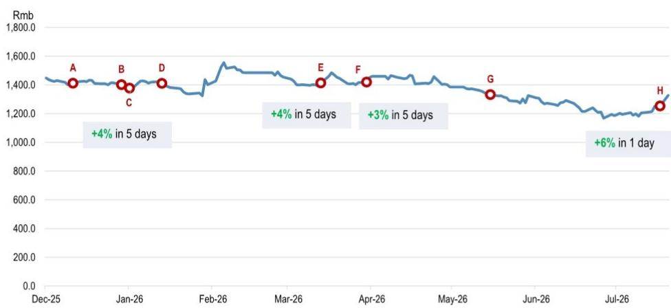
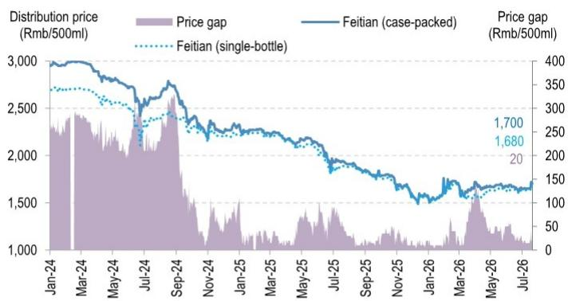
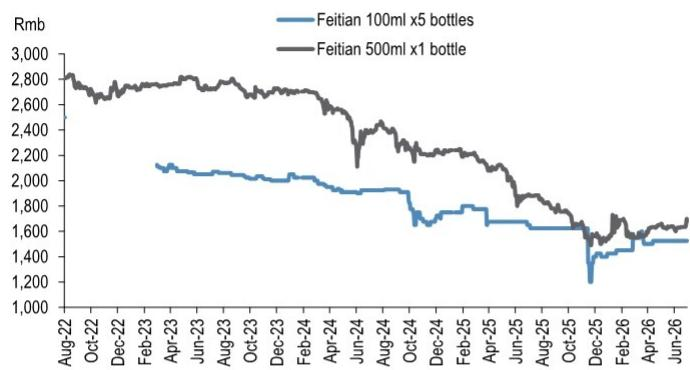

本材料不面向中国大陆读者分发，亦不构成在中国境内提供证券投资咨询服务。未经JPM书面同意，不得转载、出售或重新分发本材料或其任何部分。

# 贵州茅台

# 2026年第二次提价及其影响

事件：贵州茅台于上周末宣布上调飞天茅台53%vol 500ml（2026年款）价格，自2026年7月18日起执行。出厂价从每瓶1269元上调至1369元（+100元/+7.9%），i茅台自营零售价也从每瓶1539元上调至1639元（+100元/+6.5%）。这是2026年内的第二次提价，此前3月30日已宣布出厂价上调100元/8.5%，i茅台价格上调40元/+2.7%（详见我们此前报告）。

- 定价能力显现。茅台在淡季第二次提价，这一反向操作凸显了其对供需动态的卓越掌控和定价自主权。新定价与当前分销水平基本一致，体现了经过校准的“随行就市”策略。鉴于飞天茅台在旧价格下于i茅台平台持续售罄，我们认为这是一个结构性信号，表明渐进、持续的提价趋势可能延续。茅台的定价能力得益于严格的产量控制和直销渠道的持续建设。信号明确：在主动管理供应的能力支撑下，定价将以审慎、稳定的步调推进。

- 价值链连锁反应。此次提价将从2026年第三季度起提升茅台利润率，同时随着老酒年份同步重估上行，也将提升陈年库存的内在价值。值得注意的是，本次提价为对称调整（出厂价与i茅台价格均上调100元），而3月份的调整为非对称调整（出厂价上调幅度大于自营零售价）。价格调整节奏似乎也在加快；因此，囤货行为更多涉及市场时机把握和承受更高波动性——难度更大、风险更高、吸引力下降。这或可抑制投机行为，改善库存健康度，并支撑更多由消费而非交易驱动的需求。

- 对行业及其他白酒品牌的影响。飞天茅台的分销价格从（公告前7月17日的）1660元提升至（7月20日的）1700元。公告后首个交易日，茅台股价上涨6%，五粮液、泸州老窖、汾酒、洋河涨幅在3%-6%之间。作为行业龙头，飞天是白酒定价的锚：实践中，其他酒厂通常只有在飞天提价后才能获得重新定价的空间。如果锚定价格有真实需求支撑，也将降低次高端品类再次面临连锁降价压力的风险。尽管如此，这是必要但非充分条件——上周末，五粮液和泸州老窖的分销价格并未随茅台同步上涨。我们认为，其他品牌需要更多时间来消化库存、重建定价能力并重新加速增长，因为整体需求仍显温和。

## 中性

600519.SS, 600519 CH  
价格（2026年7月20日）：1327.50元  
目标价（2027年6月）：1420.00元

## 消费行业

Jessie Xu AC  
(852) 2800-8590  
jessie.j.xu@JPM.com  
JPM证券（亚太）有限公司/ JPM经纪（香港）有限公司

Sylvia Hu  
(86-21) 6106-6284  
sylvia.hu@JPM.com  
SAC注册编号：S1730526010001  
JPM证券（中国）有限公司

图1：近期提价后，飞天（整箱）与单瓶价差显著收窄。分销价格（元/500ml）  
  
来源：每日酒价，JPM。

图2：茅台年初至今股价表现及直销改革关键事件（详见下表）  
  
来源：彭博财经有限合伙，JPM。

表1：茅台——2025年底以来直销改革关键事件

<table><tr><td></td><td>日期</td><td>事件</td></tr><tr><td>A</td><td>2025年12月11日</td><td>茅台召开经销商会议，宣布支持经销商信心的措施。茅台计划削减2026年非标茅台配额：彩釉珍品/生肖/15年/1L分别削减100%/50%/30%/30%。</td></tr><tr><td>B</td><td>2025年12月28日</td><td>茅台召开年度经销商大会，旨在实施市场化改革：（1）市场化定价策略。（2）直销转型；扩大客户基础。（3）更好服务：简化线上购买，深化与经销商的合作并合理分享利润。</td></tr><tr><td>C</td><td>2026年1月1日</td><td>飞天茅台53%vol 500ml在直销渠道i茅台首发。</td></tr><tr><td>D</td><td>2026年1月13日</td><td>宣布更详细的市场化改革：（1）从传统“直销+分销”模式向“直销+分销+寄售”模式过渡。（2）市场化定价体系：公布i茅台多个SKU零售价，包括飞天茅台53%vol 500ml（2026版）每瓶1499元。</td></tr><tr><td>E</td><td>2026年3月13日</td><td>针对非标茅台产品引入寄售模式，包括茅台15年、精品、生肖（经典/礼盒装）、古越飞天，以及飞天53%vol（1L/200ml/100ml/50ml）特殊SKU。经销商需提交申请并支付保证金，所有产品须通过i茅台以官方零售价销售，经销商将获得5%销售佣金。</td></tr><tr><td>F</td><td>2026年3月30日</td><td>宣布自2026年3月31日起，将飞天茅台53%vol 500ml（2026年）出厂价从1169元上调至1269元，直销零售价从1499元上调至1539元。</td></tr><tr><td>G</td><td>2026年5月16日</td><td>宣布上调以下产品零售价：（1）茅台15年53%vol 500ml从4199元至4279元；（2）茅台精品53%vol 500ml从2299元至2359元；（3）茅台生肖53%vol 500ml从2499元至2699元；（4）飞天1L 53%vol 500ml从2989元至3119元。</td></tr><tr><td>H</td><td>2026年7月17日</td><td>宣布自2026年7月18日起，将飞天茅台53%vol 500ml（2026年）出厂价从1269元上调至1369元，直销零售价从1539元上调至1639元。</td></tr></table>

来源：公司数据，JPM。

图3：整箱与单瓶飞天茅台分销价格  
  
注：最新数据截至2026年7月20日。
来源：每日酒价，JPM。

图4：100ml飞天与500ml飞天分销价格  
  
注：最新数据截至2026年7月20日。
来源：每日酒价，JPM。

# 研究观点、估值与风险

贵州茅台（中性；目标价：1420.00元）

## 研究观点

我们对茅台持中性观点。茅台正引领白酒行业从周期性收缩向企稳的关键转变。其直销转型扩大了大众高端市场覆盖，提升了定价透明度，并强化了品牌价值。在当前宏观环境温和、中国消费必需品平均市盈率约15倍的背景下，当前估值似乎合理。可持续的估值重估可能需要：1）直销持续取得进展（下一个关键需求窗口：中秋国庆假期）；2）家庭财富复苏的更明确证据，特别是与房地产和权益市场相关的方面。

## 估值

我们对2027年6月的目标价1420元基于20倍2027年预期市盈率，低于茅台20年历史均值24倍的一个标准差。随着库存水平消化和需求逐步企稳，我们预计茅台将在2026-2027年间经历均值回归。然而，随着茅台演变为高端消费品牌而非纯粹奢侈品，在宏观环境偏弱的情况下，重估至24倍市盈率似乎不太可能。尽管如此，该品牌的文化相关性和社会信号价值在几代人之间依然强劲。茅台仍是宴会、庆典及其他重要场合的明确首选；因此，我们认为其相对于行业平均水平的溢价应得以维持。

## 评级与目标价风险

我们评级和目标价的下行风险包括：1）由于监管收紧或消费放缓，高端白酒市场需求低于预期；2）飞天出厂价上调慢于预期；3）白酒税率可能上调；4）地方政府对大型国企施加的社会责任负担。

上行风险包括：1）直销进一步渗透；2）家庭财富复苏强于预期，刺激高端需求；3）高端白酒消费支出复苏。

分析师认证：本报告封面标注“AC”的研究分析师（或当多位研究分析师主要负责本报告时，封面或文件内标注“AC”的研究分析师就其在本研究中涵盖的每个证券或发行人单独认证）证明：（1）本报告中表达的所有观点准确反映了研究分析师对任何及所有主题证券或发行人的个人观点；（2）研究分析师薪酬的任何部分过去、现在或将来均未直接或间接地与本研究报告中研究分析师提出的具体建议或观点相关。对于封面列出的所有韩国研究分析师（如适用），他们还根据KOFIA要求证明，研究分析师的分析是本着诚信原则进行的，且观点反映了研究分析师自身的意见，没有受到不当影响或干预。

除非另有说明，本报告中列出的所有作者均为独立撰写研究报告的研究分析师。在欧洲，行业专家（销售与交易）可能作为联系人出现在本报告中，但并非报告作者或研究部门成员。

## 重要披露

• 做市商/流动性提供者：JPM是贵州茅台或相关实体金融工具的做市商和/或流动性提供者。

- 债务头寸：JPM可能持有贵州茅台或相关实体（如有）的债务证券头寸。

公司特定披露：JPM与其研究报告所覆盖的公司开展业务并寻求开展业务。因此，读者应注意，该公司可能存在利益冲突，可能影响本报告的客观性。读者应将本报告视为其做出投资决策的单一因素。重要披露，包括价格图表和信用意见历史表（如适用），可通过访问https://www.jpmm.com/research/disclosures、致电1-800-477-0406或发送电子邮件至research.disclosure.inquiries@JPM.com获取，适用于汇编报告及所有JPM覆盖的公司及某些未覆盖的公司。

贵州茅台（600519.SS, 600519 CH）价格图表  

<table><tr><td>日期</td><td>评级</td><td>价格（元）</td><td>目标价（元）</td></tr><tr><td>2023年10月26日</td><td>超配</td><td>1677.50</td><td>2,000</td></tr><tr><td>2024年8月11日</td><td>超配</td><td>1436.80</td><td>1,800</td></tr><tr><td>2025年4月3日</td><td>超配</td><td>1549.02</td><td>1,950</td></tr><tr><td>2025年8月13日</td><td>超配</td><td>1437.04</td><td>1,930</td></tr><tr><td>2026年5月29日</td><td>中性</td><td>1275.98</td><td>1,420</td></tr></table>

来源：彭博财经有限合伙，JPM；价格数据已根据股票分割和股息进行调整。
首次覆盖日期：2015年11月15日。所有股价均为前一交易日收盘价。

图表显示JPM对该股票的持续覆盖；当前分析师可能并非在整个期间内都覆盖该股票。JPM评级或名称：OW = 超配，N = 中性，UW = 低配，NR = 未评级

## 股票研究评级、名称及分析师覆盖范围说明：

JPM使用以下评级体系：超配（在本报告所示目标价期间内，我们预期该股票将跑赢研究分析师或其团队覆盖范围内股票的平均总回报）；中性（在本报告所示目标价期间内，我们预期该股票将与研究分析师或其团队覆盖范围内股票的平均总回报表现一致）；低配（在本报告所示目标价期间内，我们预期该股票将跑输研究分析师或其团队覆盖范围内股票的平均总回报）。NR为未评级。在此情况下，JPM已因缺乏充分基本面依据或法律、监管或政策原因而移除该股票的评级及（如适用）目标价。不应再依赖先前的评级及（如适用）目标价。NR名称并非推荐或评级。部分覆盖股票有评级但无目标价；在此情况下，我们预期该股票将跑赢/表现一致/跑输研究分析师或其团队在相关区域期间内覆盖范围内股票的平均总回报。在我们的亚洲（除澳大利亚和印度外）及英国中小盘股票研究中，每只股票的预期总回报是与基准国家市场指数的预期总回报进行比较，而非与研究分析师的覆盖范围进行比较。如果本报告的重要披露部分未显示，认证研究分析师的覆盖范围可在JPM网站https://www.JPMmarkets.com上找到。

覆盖范围：Xu, Jessie：百威亚太（1876.HK）、华润饮料 - H（2460.HK）、茶姬（CHA）、中国飞鹤有限公司（6186.HK）、中国蒙牛乳业（2319.HK）、华润啤酒（0291）（0291.HK）、东鹏饮料 - A（605499.SS）、东鹏饮料 - H（9980.HK）、古茗 - H（1364.HK）、海天味业 - A（603288.SS）、内蒙古伊利 - A（600887.SS）、贵州茅台 - A（600519.SS）、瑞幸咖啡（LKNCY）、泸州老窖 - A（000568.SZ）、名创优品 - ADR（MNSO）、名创优品 - H（9896.HK）、蜜雪集团 - H（2097.HK）、农夫山泉 - H（9633.HK）、泡泡玛特 - H（9992.HK）、青岛啤酒 - A（600600.SS）、青岛啤酒 - H（0168.HK）、万洲国际（0288）（0288.HK）、五粮液 - A（000858.SZ）、洋河 - A（002304.SZ）、百胜中国控股有限公司（YUMC）

## JPM股票研究评级分布，截至2026年7月4日

<table><tr><td></td><td>超配（买入）</td><td>中性（持有）</td><td>低配（卖出）</td></tr><tr><td>JPM全球股票研究覆盖*</td><td>53%</td><td>36%</td><td>12%</td></tr><tr><td>投行客户**</td><td>83%</td><td>80%</td><td>73%</td></tr><tr><td>JPM证券股票研究覆盖*</td><td>51%</td><td>37%</td><td>12%</td></tr><tr><td>投行客户**</td><td>95%</td><td>92%</td><td>87%</td></tr></table>

\*请注意，由于四舍五入，百分比可能未加总至100%。

\*\*JPM在过去12个月内提供投资银行服务的“买入”、“持有”和“卖出”类别中各主题公司的百分比。

仅就FINRA评级分布规则而言，我们的超配评级属于报告评级类别；中性评级属于持有评级类别；低配评级属于报告评级类别。请注意，标有NR的股票不包含在上述表格中。此信息截至最近一个日历季度末。

股票估值与风险：有关覆盖公司或目标公司的估值方法和风险，请参阅http://www.JPMmarkets.com上最新的公司特定研究报告，联系主要分析师或您的JPM代表，或发送电子邮件至research.disclosure.inquiries@JPM.com。有关所用专有模型的重要信息，请参阅公司特定研究报告中的财务摘要和公司概况表，这些可在我们客户网站http://www.JPMmarkets.com的公司页面上下载。本报告还阐述了其中使用的重要基本假设。

## 研究交流历史：

过去12个月内JPM交流的历史可通过http://www.JPMmarkets.com的研究与评论页面访问，您也可以按分析师姓名、行业或金融工具进行搜索。

分析师薪酬：负责编制本报告的研究分析师的薪酬基于多种因素，包括研究的质量和准确性、客户反馈、竞争因素以及公司整体收入。

非美国分析师注册：除非另有说明，本报告封面列出的非美国分析师是非美国JPM证券有限责任公司关联公司的员工，可能未根据FINRA规则注册为研究分析师，可能不是JPM证券有限责任公司的关联人士，并且可能不受FINRA规则2241或2242关于与覆盖公司沟通、公开露面以及研究分析师账户持有证券交易限制的约束。

## 其他披露

JPM是JPM公司及其全球子公司和关联公司投资银行业务的营销名称。

英国MiFID FICC研究分拆豁免：英国客户应参阅英国MiFID研究分拆豁免，了解JPM实施FICC研究豁免的详细信息以及相关FICC研究分类的指导。

除非相关法律特别允许，所有向客户提供的研究材料均同时在我们的客户网站JPM市场上提供。并非所有研究内容都会重新分发、通过电子邮件发送或提供给第三方聚合商。有关特定股票的所有可用研究材料，请联系您的销售代表。

本研究材料中对中国的任何长格式引用为：中国大陆；香港特别行政区（中国）；台湾（中国）；澳门特别行政区（中国）。

JPM可能不时撰写关于受美国、欧盟、英国或其他相关司法管辖区政府当局实施或管理的经济或金融制裁所针对的发行人或证券（受制裁证券）的文章。本报告中的任何内容均无意被解读为鼓励、促进、推动或以其他方式批准对受制裁证券的投资或交易。客户在做出投资决策时应了解自己的法律和合规义务。

本研究报告中讨论的任何数字或加密资产均受快速变化的监管环境影响。有关加密资产（包括比特币和以太坊）的相关监管建议，请参阅https://www.JPM.com/disclosures/cryptoasset-disclosure。

本研究报告的作者可能未获许可在您的司法管辖区开展受监管活动，如果未获许可，则不会声称自己能够这样做。

交易所交易基金（ETF）：JPM证券有限责任公司（“JPMS”）充当几乎所有美国上市ETF的授权参与者。如果本报告中提及任何ETF，JPMS可能因分销这些ETF股份而赚取佣金和基于交易的补偿，并可能因执行其他与交易相关的服务（例如向ETF股份的空头卖家提供证券借贷）而赚取费用。JPMS还可能为ETF本身提供服务，包括担任ETF的经纪商或交易商。此外，JPMS的关联公司可能为ETF提供服务，包括信托、托管、管理、借贷、指数计算和/或维护及其他服务。

期权和期货相关研究：如果本文所含信息涉及期权或期货相关研究，则该信息仅提供给已收到适当期权或期货风险披露文件的人士。请联系您的JPM代表或访问https://www.theocc.com/components/docs/riskstoc.pdf获取期权清算公司的标准化期权的特征和风险副本，或访问https://www.finra.org/sites/default/files/2020-08/Security\_Futures\_Risk\_Disclosure\_Statement\_2020.pdf获取证券期货风险披露声明副本。

银行间同业拆借利率（IBOR）及其他基准利率的变更：某些利率基准正在或可能在未来受到持续的国际、国内及其他监管指导、改革和改革建议的影响。更多信息，请查阅：https://www.JPM.com/global/disclosures/interbank\_offered\_rates

私人银行客户：如果您作为JPM公司及其子公司（“JPM私人银行”）提供的私人银行业务的客户接收研究，则研究由JPM私人银行提供给您，而非JPM任何其他部门，包括但不限于JPM企业与投资银行及其全球研究部门。

负责制作和分发研究的法律实体：在Reg AC研究分析师姓名下方标识的法律实体是负责制作本研究的法律实体。如果多位Reg AC研究分析师撰写了本材料，且其姓名下方标识了不同的法律实体，则这些法律实体共同负责制作本研究。如果分析师姓名下列出多个法律实体，则除非另有说明，第一个法律实体负责制作。来自不同JPM关联公司的研究分析师可能为本材料的制作做出了贡献，但可能未获许可在您的司法管辖区开展受监管活动（并且不会声称自己能够这样做）。除非下文法律实体披露中另有说明，本材料已由负责制作的法律实体分发，或者如果分析师姓名下列出多个法律实体，则第一个法律实体负责分发。如果您有任何疑问，请联系您所在司法管辖区的相关研究分析师或分发本研究材料的实体。

## 法律实体披露及国家/地区特定披露：

阿根廷：JPM银行布宜诺斯艾利斯分行受阿根廷共和国中央银行（BCRA）和阿根廷国家证券委员会（CNV - ALYC y AN Integral N°51）监管。

澳大利亚：JPM证券澳大利亚有限公司（“JPMSAL”）（ABN 61 003 245 234/AFS牌照号：238066）受澳大利亚证券和投资委员会监管，是ASX有限公司的市场参与者、ASX Clear Pty Limited的清算和结算参与者以及ASX Clear（Futures）Pty Limited的清算参与者。本材料由JPMSAL或其代表在澳大利亚仅向“批发客户”（定义见《2001年公司法》第761G条）发行和分发。所有涵盖金融产品的清单可通过访问https://www.jpmm.com/research/disclosures获取。JPM力求覆盖所有全球行业分类标准（GICS）板块中与国内外读者基础相关的公司，以及各种市值规模的公司。如适用，在对主题公司进行公开尽职调查的过程中，研究分析师团队可能有时通过公司访问、与公司代表讨论、管理层演示等方式进行此类尽职调查。JPMSAL发布的研究已根据JPM澳大利亚研究独立性政策编制，该政策可在以下链接找到：JPM澳大利亚 - 研究独立性政策。

巴西：JPM银行S.A.受巴西证券委员会（CVM）和巴西中央银行监管。JPM监察员：0800-7700847 / 0800-7700810（听障人士专用）/ ouvidoria.jp.morgan@jpmchase.com。

加拿大：JPM证券加拿大有限公司是一家注册投资交易商，受加拿大投资监管组织和安大略省证券委员会监管，并且是加拿大交易所的参与会员。本材料由JPM证券加拿大有限公司或其代表在加拿大分发。

智利：JPM投资有限公司是一家在智利注册的非监管实体。

中国：JPM证券（中国）有限公司已获中国证监会批准开展证券投资咨询业务。

哥伦比亚：JPM银行哥伦比亚S.A.受哥伦比亚金融监管局（SFC）监管。本材料中提及由哥伦比亚境外实体提供的产品或服务的任何引用仅用于描述目的。此类引用不构成且不应被解释为在哥伦比亚境内进行促销活动或提供金融产品或服务，定义见适用的哥伦比亚法规。

迪拜国际金融中心（DIFC）：JPM银行，N.A.，迪拜分行受迪拜金融服务管理局（DFSA）监管，其注册地址为迪拜国际金融中心 - The Gate，西翼，3层和9层，邮政信箱506551，迪拜，阿联酋。本材料由JPM银行，N.A.，迪拜分行向根据DFSA规则被视为专业客户或市场对手方的人士分发。

欧洲经济区（EEA）：除非另有说明，研究由JPMSE（“JPM SE”）在EEA分发，JPM SE是一家由联邦金融监管局（BaFin）授权并由BaFin、德国中央银行（德意志联邦银行）和欧洲中央银行（ECB）共同监管的信贷机构。JPM SE总部位于法兰克福，注册地址为TaunusTurm, Taunustor 1, Frankfurt am Main, 60310, Germany。本材料已在EEA向根据MiFID II第4条第1款第10项及附件二及其在各自母国的实施被视为专业读者（或同等）的人士（“EEA专业读者”）分发。非EEA专业读者不得依赖或依据本材料行事。本材料涉及的任何投资或投资活动仅面向EEA相关人士，并将仅与EEA相关人士进行。

香港：JPM证券（亚太）有限公司（CE编号AAJ321）受香港金融管理局和香港证券及期货事务监察委员会监管，JPM经纪（香港）有限公司（CE编号AAB027）受香港证券及期货事务监察委员会监管。JPM银行，N.A.，香港分行（CE编号AAL996）受香港金融管理局和证券及期货事务监察委员会监管，根据美国法律组织，承担有限责任。如果本材料的分发在香港是受监管活动，则本材料由JPM证券（亚太）有限公司和/或JPM经纪（香港）有限公司在香港分发。

印度：JPM印度私人有限公司（公司识别号 - U67120MH1992FTC068724），注册办事处位于JPM大厦，C.S.T.路旁，Kalina，Santacruz - East，孟买 – 400098，在印度证券交易委员会（SEBI）注册为“研究分析师”，注册号INH000001873。JPM印度私人有限公司还在SEBI注册为印度国家证券交易所和孟买证券交易所的会员（SEBI注册号 – INZ000239730）以及商人银行家（SEBI注册号 - MB/INM000002970）。电话：91-22-6157 3000，传真：91-22-6157 3990，网站：http://www.jpmipl.com。JPM银行，N.A. - 孟买分行获得印度储备银行（RBI）许可（许可证号53/许可证号BY.4/94；SEBI - IN/CUS/014/ CDSL : IN-DP-CDSL-444-2008/ IN-DP-NSDL-285-2008/ INBI00000984/ INE231311239）作为印度的一家持牌商业银行，这是其主要许可证，允许其在印度开展银行业务以及印度银行分行允许从事的其他活动。对于非本地研究材料，本材料不由JPM印度私人有限公司在印度分发。合规官：Ashutosh Sharma；ashutosh.j.sharma@jpmchase.com；+912261575002。投诉官：Ramprasadh K，jpmipl.research.feedback@JPM.com；+912261573000。SEBI的注册和NISM的认证绝不保证中介机构的业绩或向读者提供任何回报保证。请访问条款和条件以及最重要的条款和条件（MITC）。年度合规审计报告可在http://www.jpmipl.com/#research获取。

印度尼西亚：PTJPM证券印度尼西亚是印度尼西亚证券交易所的会员，并受金融服务管理局（OJK）注册和监管。

韩国：JPM证券（远东）有限公司首尔分行是韩国交易所（KRX）的会员。JPM银行，N.A.，首尔分行获许可为外国银行（JPM银行，N.A.）在韩国的分行。两个实体均受金融服务委员会（FSC）和金融监督院（FSS）监管。对于非宏观研究材料，该材料由JPM证券（远东）有限公司首尔分行在韩国分发。

日本：JPM证券日本有限公司和JPM银行，N.A.，东京分行受日本金融厅监管。

马来西亚：本材料由JPM证券（马来西亚）有限公司（18146-X）在马来西亚发行和分发，该公司是马来西亚证券交易所的参与组织，并持有马来西亚证券委员会颁发的资本市场服务牌照。

墨西哥：JPM证券行S.A. de C.V.，JPM金融集团是墨西哥证券交易所（“Bolsa Mexicana de Valores”）和机构证券交易所（“Bolsa Institucional de Valores”）的会员，并获授权由国家银行和证券委员会（“Comisión Nacional Bancaria y de Valores”）作为经纪交易商行事。

新西兰：本材料由JPMSAL在新西兰仅向“批发客户”（定义见《2013年金融市场行为法》）发行和分发。JPMSAL根据《2008年金融服务提供商（注册和争议解决）法》注册为金融服务提供商。

菲律宾：JPM证券菲律宾有限公司是菲律宾证券交易所的交易参与者，以及菲律宾证券清算公司和菲律宾读者保护基金的会员。它受证券交易委员会监管。

新加坡：本材料由JPM证券新加坡私人有限公司（JPMSS）[MDDI (P) 057/08/2025 及公司注册号：199405335R] 和/或JPM银行，N.A.，新加坡分行（JPMCB Singapore）在新加坡发行和分发，两者均受新加坡金融管理局监管。JPMSS是新加坡交易所证券交易有限公司的会员。本材料仅向符合《证券及期货法》（第289章）第4A条定义的认可读者、专家读者和机构读者在新加坡发行和分发。本材料无意向任何零售读者或不符合上述“认可读者”、“专家读者”或“机构读者”定义的其他读者发行或分发。新加坡的接收者应就本材料引起或与之相关的任何事宜联系JPMSS或JPMCB Singapore。

南非：JPM股票南非有限公司和JPM银行，N.A.，约翰内斯堡分行是约翰内斯堡证券交易所的会员，并受金融服务行为监管局（FSCA）监管。

台湾：JPM证券（台湾）有限公司是台湾证券交易所的参与者（公司型）并受台湾证券期货局监管。与股权证券相关的材料由JPM证券（台湾）有限公司在台湾发行和分发，受限于许可证范围及适用的台湾法律法规。如果JPM证券（台湾）有限公司制作关于未在台湾证券交易所或台北交易所上市的证券（“非台湾上市证券”）的研究材料，这些材料不应构成适用台湾法规下的证券推荐，并且为免生疑问，JPM证券（台湾）有限公司不就非台湾上市证券担任经纪商。根据《证券商受托买卖有价证券推介客户买卖有价证券作业规范》（及其修订或补充）第7-1条第2款和/或其他适用法律法规，请注意，除非本材料“重要披露”中另有说明，本材料的接收者不得从事与本材料相关的任何可能产生利益冲突的活动。

泰国：本材料由JPM证券（泰国）有限公司在泰国发行和分发，该公司是泰国证券交易所的会员，并受财政部和证券交易委员会监管。注册地址为548 One City Center Building, 50th Floor, Ploenchit Road, Lymphini, Pathum Wan, Bangkok 10330。

英国：研究由JPM证券有限公司（“JPMS plc”）在英国制作，该公司是伦敦证券交易所的会员，并受审慎监管局授权及受金融行为监管局和审慎监管局监管；或由JPM市场有限公司（“JPMML Ltd”）制作，该公司受金融行为监管局授权和监管。除非另有说明，本材料由JPMS plc在英国分发，并且仅针对英国境内的以下人士：（a）具有投资相关事务专业经验的人士，属于《2000年金融服务和市场法（金融促销）令2005》（“FPO”）第19(5)条范围；（b）FPO第49条所述人士（高净值公司、非法人协会或合伙企业、高价值信托的受托人等）；或（c）可以合法接收此通讯的任何其他人士；所有此类人士均称为“英国相关人士”。非英国相关人士不得依据或依赖本材料行事。本材料涉及的任何投资或投资活动仅面向英国相关人士，并将仅与英国相关人士进行。JPMEMEA关于预防和避免与研究制作相关的利益冲突政策的描述可在以下链接找到：JPMEMEA - 研究独立性政策。

美国：JPM证券有限责任公司（“JPMS”）是纽约证券交易所、FINRA、SIPC和NFA的会员。JPM银行，N.A.是FDIC的会员。非美国关联公司发布的材料由JPMS在美国分发，JPMS对其内容承担责任。

一般信息：可根据要求提供更多信息。本材料中的信息来自被认为可靠的来源。尽管已采取一切合理谨慎措施确风险自担材料中陈述的事实准确，且其中包含的预测、意见和预期公平合理，但JPM公司或其关联公司和/或子公司（统称“JPM”）对所提供材料的完整性或准确性不作任何陈述或保证，但有关JPM和研究分析师参与作为材料主题的发行人的披露除外。因此，不应依赖本材料所含信息的准确性、公平性或完整性。由于计算、调整、翻译成不同语言和/或当地监管限制（如适用），本材料中可能存在某些数据差异和/或内容有限。这些差异不应影响对材料中可能讨论的主题公司的整体分析、观点和/或建议。人工智能工具可能已用于本材料的准备，包括协助数据分析、模式识别和研究材料的内容起草。JPM对因使用本材料或其内容而产生的任何损失不承担任何责任，并且JPM及其各自的董事、高级职员或员工均不对本文件的内容承担任何责任，但相关司法管辖区的监管机构或该监管制度可能施加的责任和义务除外。本材料中包含的意见、预测或预测仅代表JPM截至材料日期的当前意见或判断，因此如有更改，恕不另行通知。可能会根据公司特定发展或公告、市场状况或任何其他公开信息提供关于公司/行业的定期更新。无法保证未来结果或事件与任何此类意见、预测或预测一致，这些意见、预测或预测仅代表一种可能的结果。此外，此类意见、预测或预测受某些未经验证的风险、不确定性和假设的影响，未来的实际结果或事件可能存在重大差异。本材料中提及的任何投资的价值或收入可能会波动和/或受汇率变化的影响。除非另有说明，所有定价均为所讨论证券的市场收盘价指示性价格。过往表现并不预示未来结果。因此，读者可能收回少于最初投资的金额。本材料不构成购买或出售任何金融工具的要约或招揽。本文中的意见和建议未考虑个别客户的情况、目标或需求，也不构成对特定客户推荐特定证券、金融工具或策略。本材料可能包含对结构性证券、期权、期货和其他衍生品的看法。这些是复杂的工具，可能涉及高风险，并且可能仅适合能够理解并承担相关风险的成熟读者。本材料的接收者必须就本文提及的任何证券或金融工具做出自己的独立决定，并应寻求其认为必要的独立财务、法律、税务或其他顾问的建议。JPM可能基于研究分析师的观点和研究作为主体进行交易，也可能以其自身账户或客户账户进行与本材料所持观点不一致的交易，并且JPM没有义务确保此类其他通讯被本材料的任何接收者知晓。JPM内部的其他人员，包括策略师、销售人员和其他研究分析师，可能持有与本材料所持观点不一致的观点。未参与本材料编制的JPM员工可能持有本材料提及的证券（或此类证券的衍生品）并可能以与本材料讨论的方式不同的方式进行交易。本材料在任何司法管辖区均不构成对任何发行人、其产品或服务或其证券的广告或营销。

保密与安全通知：此传输可能包含根据适用法律享有特权、保密、法律特权且/或免于披露的信息。如果您不是预期的接收者，特此通知您，披露、复制、分发或使用本文所含信息（包括任何依赖）是严格禁止的。尽管此传输及其任何附件被认为不含任何可能影响接收和打开它的任何计算机系统的病毒或其他缺陷，但接收者有责任确保其无病毒，JPM公司及其子公司和关联公司（如适用）对因使用而产生的任何损失或损害不承担任何责任。如果您错误地收到此传输，请立即联系发件人并完全销毁该材料，无论是电子版还是硬拷贝格式。此消息受电子监控：https://www.JPM.com/disclosures/email

MSCI：本文中的某些信息（“信息”）经MSCI Inc.、其关联公司和信息提供商（“MSCI”）©2026许可复制。未经适当许可，不得复制或传播该信息。MSCI对该信息不作任何明示或暗示的保证（包括适销性或适用性），并在法律允许的范围内免除所有责任。任何信息均不构成研究交流，除非是MSCI ESG Research的任何适用信息。另请参阅msci.com/disclaimer

Sustainalytics：本文中包含的某些信息、数据、分析和意见经Sustainalytics许可复制，并且：（1）包含Sustainalytics的专有信息；（2）除非特别授权，不得复制或重新分发；（3）不构成研究交流或对任何产品或项目的认可；（
