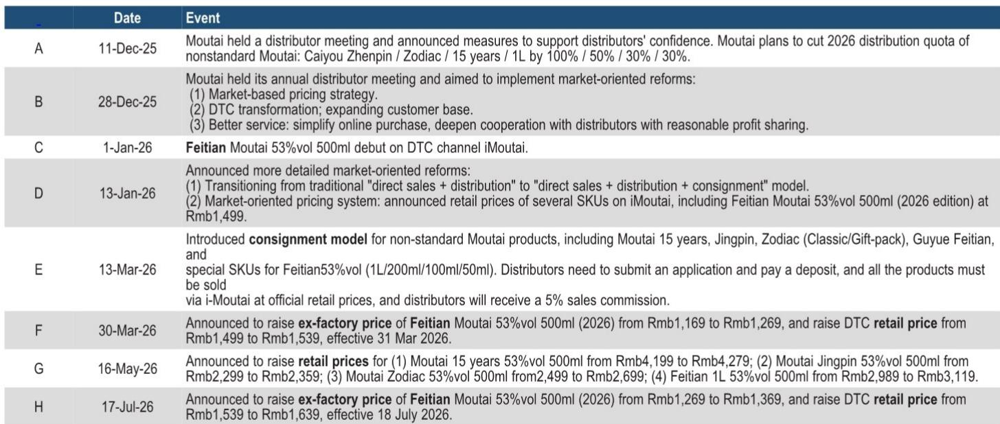
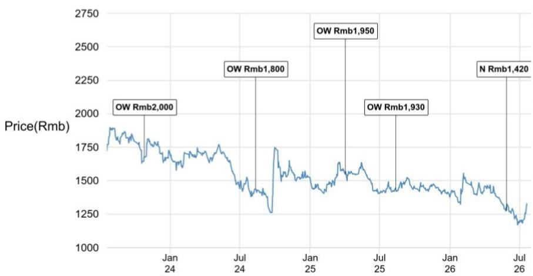

# Moutai’s Second Price Adjustment in Six Months Signals a Structural Shift in Baijiu Pricing—and a Test for the Entire Sector

On July 17, 2026, Kweichow Moutai announced its second ex-factory price adjustment for Feitian Moutai in less than four months, raising the wholesale price by RMB 100 to RMB 1,369 per bottle and the iMoutai retail price by the same absolute amount to RMB 1,639. The move came during the traditional off-season, a period when most baijiu brands avoid price adjustments for fear of disrupting fragile demand. That Moutai chose this moment to act—and to act with a symmetric, calibrated increase—reveals something far more significant than a simple pricing update. It signals that the company believes it has rebuilt enough control over its distribution chain to normalize gradual, predictable price increases as a recurring feature of its business model.

This is not a one-off adjustment. It is the second step in what appears to be a deliberate strategy of measured increments, supported by disciplined volume management and an increasingly dominant direct-to-consumer channel. For observers, the question is no longer whether Moutai can raise prices. It is whether the rest of the baijiu sector can follow—and what that means for the industry’s competitive dynamics over the next 12 to 18 months.

The report from a global research institution makes clear that the implications extend well beyond Moutai’s own margins. The price adjustment ripples through the value chain, alters speculative incentives, and resets the pricing anchor for the entire baijiu category. But it also exposes a gap: other premium brands did not see their distribution prices rise in tandem over the weekend following the announcement. That divergence is the most important strategic signal in the data.

## The Second Adjustment Confirms That Moutai Has Regained Pricing Autonomy Through Structural, Not Cyclical, Means

The first price increase in March 2026 was asymmetric—the ex-factory price rose by 8.5 percent while the iMoutai retail price rose by only 2.7 percent. That structure reflected a cautious approach: Moutai was testing whether it could push wholesale prices higher without compressing its own DTC margin or alienating consumers. The July increase, by contrast, was symmetric. Both the ex-factory and iMoutai prices rose by exactly RMB 100. That symmetry is a declaration of confidence. It means Moutai now believes its DTC channel can absorb the full pass-through of the wholesale increase without losing traffic or volume.

The data supports this confidence. Feitian Moutai has been consistently selling out on iMoutai even at the previous price point of RMB 1,539. The distribution price for case-packed Feitian improved from RMB 1,660 on July 17 to RMB 1,700 on July 20, suggesting that the market immediately accepted the new baseline. More importantly, the price gap between case-packed and single-bottle Feitian has narrowed significantly after the recent adjustments, as shown in the report’s Figure 1. That narrowing implies reduced arbitrage opportunities and less speculative trading—a sign that the distribution chain is becoming healthier, not more distorted.

What makes this pricing power structural rather than cyclical is the parallel build-out of Moutai’s DTC reform, which has been accelerating since late 2025. The company has moved from a traditional “direct sales plus distribution” model to a tripartite structure that adds consignment. Under the consignment model, introduced in March 2026, distributors must submit applications, pay deposits, and offer non-standard products through iMoutai at official retail prices in exchange for a 5 percent commission. This effectively gives Moutai real-time visibility into inventory and pricing across the entire chain. The result is that the company can now raise prices without fearing that distributors will undercut the official price through gray-market channels. The DTC transformation has turned Moutai from a price taker in its own secondary market into a price setter.

## Faster Price Cadence and Symmetric Adjustments Discourage Speculation and Improve Inventory Health

One of the most underappreciated consequences of the July adjustment is its impact on speculative behavior. When price increases are infrequent and asymmetric, they create predictable windows for hoarding. Distributors and observers anticipate ahead of expected adjustments, creating artificial scarcity and inflating distribution prices. That dynamic has historically been a source of volatility for Moutai and a headache for management trying to ensure that demand reflects real consumption.

The July adjustment changes this calculus. Price increases are now coming at a faster cadence—two adjustments in less than four months, compared to the previous pattern of one every several years. And the symmetric structure means that both wholesale and retail prices move in lockstep, leaving less room for intermediaries to profit from the spread. As the report notes, hoarding becomes more about timing the market and absorbing higher volatility—harder, riskier, and less appealing. This may discourage speculative behavior, improve inventory health, and support more demand driven by consumption rather than trading.

The data in Figure 3 of the report supports this interpretation. The distribution price of case-packed Feitian has stabilized around RMB 1,700, while single-bottle prices have converged closer to that level. The narrowing spread suggests that the secondary market is becoming less fragmented and less prone to speculative spikes. For a company that has long struggled with the tension between its official price and the market price, this convergence is an operational victory. It means that the official price is becoming the effective price—not just a reference point that is routinely ignored.

## The Anchor Price Has Moved, but Other Baijiu Brands Face a Longer and More Uncertain Path to Repricing

The most important strategic implication of Moutai’s price adjustment is its role as the anchor for the entire baijiu category. In practice, other distilleries typically gain room to reprice only after Feitian moves up. The logic is straightforward: Feitian is the benchmark for premium baijiu, and its price sets the ceiling for what consumers are willing to pay for other brands. When Feitian rises, it creates headroom for Wuliangye, Luzhou Laojiao, and others to follow.

The market’s immediate reaction was consistent with this logic. Moutai’s share price rose 6 percent on the first trading day after the announcement, while Wuliangye, Luzhou Laojiao, Fen Wine, and Yanghe gained between 3 and 6 percent. The sector clearly interpreted the adjustment as a positive signal for pricing power across the board.

But the distribution price data tells a more nuanced story. Over the weekend following the announcement, the distribution prices of Wuliangye and Luzhou Laojiao did not rise in tandem with Moutai. That is a critical divergence. It suggests that the anchor effect is real but not automatic. Other brands will need more time to work through inventory, rebuild their own pricing power, and re-accelerate growth. The report explicitly states that overall demand remains moderate, and that the price adjustment is a necessary but not sufficient condition for a broader sector recovery.

This creates a strategic dilemma for those observing baijiu companies other than Moutai. If Moutai’s price increase is absorbed by the market and leads to higher distribution prices for other brands over the next few months, then the entire sector benefits. But if the increase proves to be an isolated event—if Wuliangye and Luzhou Laojiao are unable to pass through their own price increases because demand is too weak—then the gap between Moutai and the rest of the sector will widen. Moutai will become even more dominant, and the second-tier brands will face continued margin pressure.

## A Framework for Observation: Three Conditions That Will Determine Whether the Sector Follows Moutai

For those trying to assess the implications of this price adjustment, the key question is not whether Moutai can sustain its pricing power. The evidence strongly suggests it can. The question is whether the broader baijiu sector can follow, and under what conditions. Based on the report’s analysis, three conditions will determine the answer.

First, inventory levels at other distilleries must clear before they can attempt their own price increases. The report notes that other brands need more time to work through inventory. If Wuliangye or Luzhou Laojiao try to raise prices while distributors are still sitting on old stock, the increase will not stick. Observers should monitor distribution price trends for these brands over the next two to three months as a leading indicator. If distribution prices start to converge upward, it will signal that inventory is clearing and that the sector is ready for a coordinated repricing.

Second, the DTC channel must continue to absorb Feitian volume without creating excess supply. Moutai’s pricing power depends on its ability to control the flow of product to market. The consignment model and the iMoutai platform give it unprecedented visibility and control. But if demand softens unexpectedly—particularly during the upcoming Mid-Autumn Festival and National Day holidays, which are the next key demand windows—the company may be forced to slow its price cadence. A pause in price increases would not be a disaster, but it would signal that the structural transformation is not yet complete.

Third, household wealth must recover enough to support premium consumption. The report’s valuation section explicitly states that a sustainable re-rating for Moutai requires clearer evidence of a household wealth recovery, particularly linked to property and equity markets. This is the most exogenous and unpredictable variable. If consumers feel wealthier, they will spend more on premium baijiu, and the entire sector will benefit. If they do not, even Moutai’s pricing power may hit a ceiling.

## The Bottom Line for the Sector

Moutai’s second price adjustment in 2026 is a landmark event for the baijiu industry. It demonstrates that the company has successfully rebuilt its pricing autonomy through a combination of DTC transformation, disciplined volume management, and calibrated price increases. The symmetric structure of the adjustment and the faster cadence suggest that Moutai is normalizing price increases as a recurring feature of its business model, rather than a rare event.

For the rest of the sector, the implications are positive but conditional. The anchor price has moved, creating headroom for other brands to reprice. But the distribution price data from the weekend after the announcement shows that other brands have not yet followed. The sector’s recovery depends on inventory clearing, continued DTC traction, and a recovery in household wealth. Until those conditions are met, Moutai will remain the only baijiu company with clear, structural pricing power—and the rest of the sector will be playing catch-up.

*For informational purposes only. Portions may be generated, translated, summarized, or edited with AI assistance based on source materials and may contain omissions or errors. Please verify independently. This is not professional advice.*

For informational purposes only. Portions may be generated, translated, summarized, or edited with AI assistance based on source materials and may contain omissions or errors. Please verify independently. This is not professional advice.

