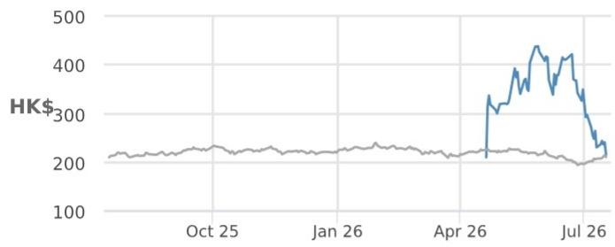

## Victory Giant Technology - H

## 近期关注点，但产能优势仍是关键区分因素；维持增持

近期市场关注点集中在VGT在Vera Rubin项目中的初始份额分配以及Kyber项目的时间表——但我们认为市场过度关注这些不确定性，而忽略了未来两到三年市场份额的关键决定因素。我们认为，高质量的制造能力，而非初始份额分配，将最终决定供应商在AI PCB项目中的份额。虽然Kyber仍在测试中，且更高的PCB复杂度带来挑战，但我们认为，若Kyber延迟，NVDA当前世代产品的强劲需求以及Google项目份额的扩大，应能部分抵消对VGT的影响。我们下调2027年6月目标价至500港元以反映这些短期因素，但认为近期的回调已充分反映此类风险，提供了具有吸引力的风险回报特征。

- 初始Rubin分配不决定长期市场份额。我们的供应链调研显示，Vera Rubin PCB的量产进度略低于我们此前的预期，而整体机架推出进度基本保持不变。尽管VGT的初始份额分配看起来低于上一代，但我们不认为这是结构性的份额流失。随着产量提升，供应商的分配应越来越取决于产能支持。鉴于其持续的产能扩张，我们预计VGT将在未来几个季度的大批量生产中重新获得份额。

- Kyber仍在向量产准备阶段推进。我们的研究显示，Kyber机架（NLV144）目前正在多条技术路径下进行测试，因为复杂的PCB架构和更高的性能目标提高了材料选择、制造工艺和系统级组装的门槛。如果Kyber商业化所需时间超出预期，我们认为对VGT的盈利影响应能被NVDA当前世代的强劲需求以及Google项目带来的增量收入（伴随份额扩大）部分抵消。

- 近期短期因素已充分反映。我们下调2026-2028年盈利预测5-13%，以反映今年计划中的PCB项目爬坡略晚于预期，以及Kyber可能延迟推出的潜在影响。相应地，我们将2027年6月目标价下调至500港元，基于22倍未来12个月滚动市盈率（此前为24倍，考虑了爬坡不确定性）。在近期股价从5月28日高点回调（-51%，而恒生科技指数为-5%）之后，我们认为市场对这些短期因素反应过度。我们将此次回调视为积累机会，并预计2026年下半年的盈利加速增长将成为催化剂。维持增持。

## 增持

2476.HK, 2476 HK

价格（2026年7月17日）：215.00港元

▼ 目标价（2027年6月）：500.00港元
此前（2027年6月）：600.00港元

## 中国

Cherry Liu AC  
(86-21) 6106-6200  
ye.liu@JPM.com  
SAC注册编号：S1730521090001

(86-21) 6106 6359  
billy.feng@JPM.com  
SAC注册编号：S1730520030005

Ri Xu  
(86-21) 6106 6318  
ri.xu@jpmchase.com  
SAC注册编号：S1730522100001  
JPM证券（中国）有限公司

<table><tr><td colspan="4">主要变化（财年截至12月）</td></tr><tr><td></td><td>此前</td><td>当前</td><td>变化</td></tr><tr><td>调整后每股收益 - 2026E（人民币）</td><td>9.20</td><td>8.18</td><td>-11.2%</td></tr><tr><td>调整后每股收益 - 2027E（人民币）</td><td>17.55</td><td>16.61</td><td>-5.3%</td></tr></table>

风格暴露

<table><tr><td rowspan="2">量化因子</td><td rowspan="2">当前百分位排名</td><td colspan="4">历史百分位排名（1=最高）</td></tr><tr><td>6个月</td><td>1年</td><td>3年</td><td>5年</td></tr><tr><td>价值</td><td>7</td><td>1</td><td>1</td><td></td><td></td></tr><tr><td>成长</td><td>2</td><td></td><td></td><td></td><td></td></tr><tr><td colspan="6">动量</td></tr><tr><td>质量</td><td>12</td><td>28</td><td>29</td><td></td><td></td></tr><tr><td>低波动</td><td>100</td><td></td><td></td><td></td><td></td></tr></table>

价格表现  

— 2476.HK 价格（港元） 恒生指数（基准调整）

<table><tr><td></td><td>年初至今</td><td>1个月</td><td>3个月</td><td>12个月</td></tr><tr><td>相对</td><td>-</td><td>-47.6%</td><td>-</td><td>-</td></tr><tr><td>相对</td><td>-</td><td>-48.6%</td><td>-</td><td>-</td></tr></table>

<table><tr><td colspan="2">公司数据</td></tr><tr><td>流通股数（百万）</td><td>983</td></tr><tr><td>52周区间（港元）</td><td>475.00-209.80</td></tr><tr><td>市值（百万美元）</td><td>26,951</td></tr><tr><td>汇率</td><td>7.84</td></tr><tr><td>自由流通比例（%）</td><td>67.4%</td></tr><tr><td>3个月日均成交量（百万股）</td><td>-</td></tr><tr><td>3个月日均成交额（百万美元）</td><td>-</td></tr><tr><td>波动率（90天）</td><td>135</td></tr><tr><td>指数</td><td>恒生指数</td></tr><tr><td>彭博分析师评级（买入 | 持有 | 卖出）</td><td>-</td></tr></table>

<table><tr><td colspan="5">关键指标（财年截至12月）</td></tr><tr><td>人民币百万元</td><td>FY25A</td><td>FY26E</td><td>FY27E</td><td>FY28E</td></tr><tr><td>财务预测</td><td></td><td></td><td></td><td></td></tr><tr><td>营业收入</td><td>19,292</td><td>31,372</td><td>59,932</td><td>79,112</td></tr><tr><td>调整后息税前利润</td><td>5,164</td><td>9,655</td><td>19,415</td><td>26,506</td></tr><tr><td>调整后息税折旧摊销前利润</td><td>6,118</td><td>10,812</td><td>20,868</td><td>28,097</td></tr><tr><td>调整后净利润</td><td>4,312</td><td>8,035</td><td>16,328</td><td>22,334</td></tr><tr><td>调整后每股收益</td><td>4.95</td><td>8.18</td><td>16.61</td><td>22.72</td></tr><tr><td>彭博每股收益</td><td>-</td><td>-</td><td>-</td><td>-</td></tr><tr><td>经营活动现金流</td><td>4,620</td><td>9,895</td><td>18,837</td><td>25,192</td></tr><tr><td>公司自由现金流</td><td>(2,014)</td><td>(8,548)</td><td>3,005</td><td>12,872</td></tr><tr><td>利润率与增长</td><td></td><td></td><td></td><td></td></tr><tr><td>营业收入同比增长（%）</td><td>79.8%</td><td>62.6%</td><td>91.0%</td><td>32.0%</td></tr><tr><td>息税前利润率</td><td>26.8%</td><td>30.8%</td><td>32.4%</td><td>33.5%</td></tr><tr><td>息税前利润同比增长（%）</td><td>262.3%</td><td>87.0%</td><td>101.1%</td><td>36.5%</td></tr><tr><td>息税折旧摊销前利润率</td><td>31.7%</td><td>34.5%</td><td>34.8%</td><td>35.5%</td></tr><tr><td>息税折旧摊销前利润同比增长（%）</td><td>178.3%</td><td>76.7%</td><td>93.0%</td><td>34.6%</td></tr><tr><td>净利润率</td><td>22.4%</td><td>25.6%</td><td>27.2%</td><td>28.2%</td></tr><tr><td>调整后每股收益增长</td><td>270.2%</td><td>65.0%</td><td>103.2%</td><td>36.8%</td></tr><tr><td>比率</td><td></td><td></td><td></td><td></td></tr><tr><td>调整后税率</td><td>14.1%</td><td>15.0%</td><td>15.0%</td><td>15.1%</td></tr><tr><td>利息覆盖倍数</td><td>42.9</td><td>53.8</td><td>102.2</td><td>137.2</td></tr><tr><td>净债务/权益</td><td>0.2</td><td>NM</td><td>NM</td><td>NM</td></tr><tr><td>净债务/息税折旧摊销前利润</td><td>0.5</td><td>NM</td><td>NM</td><td>NM</td></tr><tr><td>净资产回报表现</td><td>33.8%</td><td>26.8%</td><td>32.5%</td><td>33.9%</td></tr><tr><td>估值</td><td></td><td></td><td></td><td></td></tr><tr><td>公司自由现金流回报表现</td><td>(1.2%)</td><td>(4.7%)</td><td>1.6%</td><td>7.0%</td></tr><tr><td>股息回报表现</td><td>0.2%</td><td>0.7%</td><td>1.3%</td><td>2.7%</td></tr><tr><td>企业价值/营业收入</td><td>9.6</td><td>5.6</td><td>2.9</td><td>2.1</td></tr><tr><td>企业价值/息税折旧摊销前利润</td><td>30.3</td><td>16.3</td><td>8.5</td><td>6.0</td></tr><tr><td>调整后市盈率</td><td>37.5</td><td>22.7</td><td>11.2</td><td>8.2</td></tr></table>

## 投资论点摘要与估值

## 投资论点

VGT-H是一家全球领先的高端PCB制造商，在AI和高性能计算领域拥有第一的市场份额。我们认为，强劲的AI需求、持续的PCB单机价值增长以及规格升级，将使高性能计算持续推动全球PCB市场扩张。我们认为VGT是这一强劲AI PCB周期中的关键受益者。尽管近期面临新项目爬坡和Kyber不确定性的挑战，但我们相信VGT行业领先的技术和加速的产能扩张将有助于维护其份额并推动持续的盈利增长。我们预测2025-2028年盈利复合年增长率为73%，并预计2026年下半年的盈利加速增长将成为股价催化剂。维持增持。

## 估值

我们对2027年6月的目标价500港元基于22倍未来12个月滚动市盈率；这较其A股同业2027年平均水平低约15%（与年初至今恒生AH股溢价指数所显示的H/A平均折价基本一致），并与全球同业平均水平相当。

表1：盈利预测调整

<table><tr><td rowspan="2">（人民币百万元）</td><td colspan="3">新预测</td><td colspan="3">旧预测</td><td colspan="3">变化</td></tr><tr><td>2026E</td><td>2027E</td><td>2028E</td><td>2026E</td><td>2027E</td><td>2028E</td><td>2026E</td><td>2027E</td><td>2028E</td></tr><tr><td>营业收入</td><td>31,372</td><td>59,932</td><td>79,112</td><td>35,450</td><td>59,955</td><td>84,226</td><td>-12%</td><td>0%</td><td>-6%</td></tr><tr><td>毛利润</td><td>11,876</td><td>23,727</td><td>31,624</td><td>13,570</td><td>24,737</td><td>35,794</td><td>-12%</td><td>-4%</td><td>-12%</td></tr><tr><td>毛利率</td><td>37.9%</td><td>39.6%</td><td>40.0%</td><td>38.3%</td><td>41.3%</td><td>42.5%</td><td>-0.4ppt</td><td>-1.7ppt</td><td>-2.5ppt</td></tr><tr><td>营业利润</td><td>9,500</td><td>19,182</td><td>26,239</td><td>10,690</td><td>20,291</td><td>30,102</td><td>-11%</td><td>-5.5%</td><td>-12.8%</td></tr><tr><td>营业利润率</td><td>30.3%</td><td>32.0%</td><td>33.2%</td><td>30.2%</td><td>33.8%</td><td>35.7%</td><td>0.1ppt</td><td>-1.8ppt</td><td>-2.6ppt</td></tr><tr><td>净利润</td><td>8,035</td><td>16,328</td><td>22,334</td><td>9,045</td><td>17,249</td><td>25,611</td><td>-11%</td><td>-5%</td><td>-13%</td></tr><tr><td>净利润率</td><td>25.6%</td><td>27.2%</td><td>28.2%</td><td>25.5%</td><td>28.8%</td><td>30.4%</td><td>0.1ppt</td><td>-1.5ppt</td><td>-2.2ppt</td></tr></table>

来源：JPM预测。

表2：季度盈利预测

<table><tr><td>（人民币百万元）</td><td>1Q25</td><td>2Q25</td><td>3Q25</td><td>4Q25</td><td>1Q26</td><td>2Q26E</td><td>3Q26E</td><td>4Q26E</td></tr><tr><td>营业收入</td><td>4,312</td><td>4,719</td><td>5,086</td><td>5,175</td><td>5,519</td><td>6,514</td><td>8,861</td><td>10,478</td></tr><tr><td>同比增长</td><td>80%</td><td>92%</td><td>79%</td><td>71%</td><td>28%</td><td>38%</td><td>74%</td><td>102%</td></tr><tr><td>毛利润</td><td>1,439</td><td>1,832</td><td>1,790</td><td>1,734</td><td>1,902</td><td>2,281</td><td>3,308</td><td>4,385</td></tr><tr><td>毛利率</td><td>33.4%</td><td>38.8%</td><td>35.2%</td><td>33.5%</td><td>34.5%</td><td>35.0%</td><td>37.3%</td><td>41.9%</td></tr><tr><td>净利润</td><td>921</td><td>1,222</td><td>1,102</td><td>1,067</td><td>1,288</td><td>1,537</td><td>2,214</td><td>2,995</td></tr><tr><td>同比增长</td><td>339%</td><td>390%</td><td>261%</td><td>174%</td><td>40%</td><td>26%</td><td>101%</td><td>181%</td></tr></table>

来源：JPM预测，VGT-A季度/半年度/年度报告。

表3：VGT估值比较

<table><tr><td>代码</td><td>公司名称</td><td>价格（本币）</td><td>市值（百万美元）</td><td>市盈率 2026E</td><td>市盈率 2027E</td><td>市净率 2026E</td><td>市净率 2027E</td><td>净资产回报表现 2026E</td><td>净资产回报表现 2027E</td><td>25-27E 盈利复合年增长率</td></tr><tr><td>2476.HK</td><td>VGT-H*</td><td>215.0</td><td>34,111</td><td>22.8</td><td>11.2</td><td>8.0</td><td>5.0</td><td>19%</td><td>29%</td><td>95%</td></tr><tr><td colspan="11">A股同业</td></tr><tr><td>300476.SZ</td><td>VGT-A</td><td>241.5</td><td>34,111</td><td>26.2</td><td>14.1</td><td>6.2</td><td>4.7</td><td>30%</td><td>37%</td><td>85%</td></tr><tr><td>002916.SZ</td><td>深南电路</td><td>334.0</td><td>33,564</td><td>45.6</td><td>31.0</td><td>11.0</td><td>8.1</td><td>27%</td><td>30%</td><td>53%</td></tr><tr><td>002463.SZ</td><td>沪电股份</td><td>127.8</td><td>36,282</td><td>42.8</td><td>26.4</td><td>9.6</td><td>7.3</td><td>30%</td><td>34%</td><td>66%</td></tr><tr><td>688183.SH</td><td>生益电子</td><td>113.5</td><td>14,024</td><td>35.8</td><td>24.0</td><td>11.9</td><td>8.3</td><td>39%</td><td>41%</td><td>57%</td></tr><tr><td>600183.SH</td><td>生益科技</td><td>132.3</td><td>47,406</td><td>53.7</td><td>36.4</td><td>15.1</td><td>11.8</td><td>31%</td><td>39%</td><td>63%</td></tr><tr><td>603228.SH</td><td>景旺电子</td><td>71.7</td><td>10,433</td><td>36.7</td><td>23.0</td><td>5.0</td><td>4.2</td><td>14%</td><td>19%</td><td>49%</td></tr><tr><td>002938.SZ</td><td>鹏鼎控股</td><td>93.9</td><td>32,101</td><td>42.7</td><td>29.8</td><td>6.0</td><td>5.3</td><td>14%</td><td>19%</td><td>34%</td></tr><tr><td>001389.SZ</td><td>广合科技</td><td>176.1</td><td>11,766</td><td>37.2</td><td>21.6</td><td>8.5</td><td>5.6</td><td>34%</td><td>35%</td><td>87%</td></tr><tr><td></td><td>平均</td><td></td><td></td><td>40.1</td><td>25.8</td><td>9.2</td><td>6.9</td><td>27%</td><td>32%</td><td>62%</td></tr><tr><td colspan="11">全球同业</td></tr><tr><td>3037.TW</td><td>欣兴电子 *</td><td>794.0</td><td>39,020</td><td>52.9</td><td>29.8</td><td>10.1</td><td>8.2</td><td>21%</td><td>30%</td><td>147%</td></tr><tr><td>2383.TW</td><td>台光电子*</td><td>4,495.0</td><td>49,818</td><td>42.3</td><td>22.2</td><td>22.3</td><td>13.2</td><td>62%</td><td>75%</td><td>123%</td></tr><tr><td>1888.HK</td><td>建滔集团</td><td>42.0</td><td>16,874</td><td>21.2</td><td>16.0</td><td>7.1</td><td>6.0</td><td>32%</td><td>34%</td><td>93%</td></tr><tr><td>2368.TW</td><td>金像电子</td><td>927.0</td><td>14,825</td><td>23.5</td><td>14.5</td><td>9.8</td><td>7.5</td><td>51%</td><td>59%</td><td>83%</td></tr><tr><td>4958.TW</td><td>臻鼎科技</td><td>521.0</td><td>17,869</td><td>35.3</td><td>20.3</td><td>3.7</td><td>3.5</td><td>11%</td><td>17%</td><td>85%</td></tr><tr><td>3044.TW</td><td>健鼎科技*</td><td>397.5</td><td>6,462</td><td>14.0</td><td>10.5</td><td>3.3</td><td>2.9</td><td>25%</td><td>29%</td><td>39%</td></tr><tr><td>2313.TW</td><td>华通电脑</td><td>212.0</td><td>7,815</td><td>24.9</td><td>14.5</td><td>4.1</td><td>3.6</td><td>17%</td><td>26%</td><td>58%</td></tr><tr><td>007660.KS</td><td>ISU Petasys*</td><td>91,900.0</td><td>4,557</td><td>23.8</td><td>14.5</td><td>6.7</td><td>4.6</td><td>32%</td><td>38%</td><td>70%</td></tr><tr><td>平均</td><td></td><td></td><td></td><td>29.7</td><td>17.8</td><td>8.4</td><td>6.2</td><td>31%</td><td>38%</td><td>87%</td></tr></table>

来源：JPM预测（标有*；欣兴电子、台光电子和健鼎科技由Jerry Tsai覆盖；ISU Petasys由Sangsik Lee和Jay Kwon覆盖），彭博金融有限合伙企业预测。数据截至2026年7月17日。

## 投资论点、估值与风险

胜利精密（惠州）有限公司 - H（增持；目标价：500.00港元）

## 投资论点

VGT-H是一家全球领先的高端PCB制造商，在AI和高性能计算领域拥有第一的市场份额。我们认为，强劲的AI需求、持续的PCB单机价值增长以及规格升级，将使高性能计算持续推动全球PCB市场扩张。我们认为VGT是这一强劲AI PCB周期中的关键受益者。尽管近期面临新项目爬坡和Kyber不确定性的挑战，但我们相信VGT行业领先的技术和加速的产能扩张将有助于维护其份额并推动持续的盈利增长。我们预测2025-2028年盈利复合年增长率为73%，并预计2026年下半年的盈利加速增长将成为股价催化剂。维持增持。

## 估值

我们对2027年6月的目标价500港元基于22倍未来12个月滚动市盈率；这较其A股同业2027年平均水平低约15%（与年初至今恒生AH股溢价指数所显示的H/A平均折价基本一致），并与全球同业平均水平相当。

## 评级与目标价风险

主要下行风险包括：（1）产能扩张期间的利润率或执行不确定性；（2）激烈竞争中的潜在市场份额流失；（3）原材料价格波动和供应链风险；（4）地缘政治紧张局势。

胜利精密 - H：财务摘要

<table><tr><td>利润表</td><td>FY24A</td><td>FY25A</td><td>FY26E</td><td>FY27E</td><td>FY28E</td></tr><tr><td>营业收入</td><td>10,731</td><td>19,292</td><td>31,372</td><td>59,932</td><td>79,112</td></tr><tr><td>营业成本</td><td>(8,293)</td><td>(12,497)</td><td>(19,496)</td><td>(36,204)</td><td>(47,488)</td></tr><tr><td>毛利润</td><td>2,439</td><td>6,795</td><td>11,876</td><td>23,727</td><td>31,624</td></tr><tr><td>销售、一般及管理费用</td><td>(658)</td><td>(821)</td><td>(1,050)</td><td>(1,825)</td><td>(1,954)</td></tr><tr><td>调整后息税折旧摊销前利润</td><td>2,198</td><td>6,118</td><td>10,812</td><td>20,868</td><td>28,097</td></tr><tr><td>折旧与摊销</td><td>(773)</td><td>(954)</td><td>(1,157)</td><td>(1,453)</td><td>(1,591)</td></tr><tr><td>调整后息税前利润</td><td>1,425</td><td>5,164</td><td>9,655</td><td>19,415</td><td>26,506</td></tr><tr><td>净利息</td><td>(114)</td><td>(142)</td><td>(201)</td><td>(204)</td><td>(205)</td></tr><tr><td>调整后税前利润</td><td>1,312</td><td>5,022</td><td>9,454</td><td>19,211</td><td>26,301</td></tr><tr><td>所得税</td><td>(157)</td><td>(710)</td><td>(1,419)</td><td>(2,883)</td><td>(3,967)</td></tr><tr><td>少数股东权益</td><td>0</td><td>0</td><td>0</td><td>0</td><td>0</td></tr><tr><td>调整后净利润</td><td>1,154</td><td>4,312</td><td>8,035</td><td>16,328</td><td>22,334</td></tr><tr><td>报告每股收益</td><td>1.34</td><td>4.95</td><td>8.18</td><td>16.61</td><td>22.72</td></tr><tr><td>调整后每股收益</td><td>1.34</td><td>4.95</td><td>8.18</td><td>16.61</td><td>22.72</td></tr><tr><td>每股股息</td><td>0.30</td><td>0.44</td><td>1.32</td><td>2.45</td><td>4.98</td></tr><tr><td>派息率</td><td>22.6%</td><td>8.8%</td><td>16.1%</td><td>14.8%</td><td>21.9%</td></tr><tr><td>流通股数</td><td>863</td><td>870</td><td>983</td><td>983</td><td>983</td></tr><tr><td>资产负债表</td><td>FY24A</td><td>FY25A</td><td>FY26E</td><td>FY27E</td><td>FY28E</td></tr><tr><td>现金及现金等价物</td><td>1,662</td><td>3,280</td><td>14,843</td><td>15,018</td><td>22,575</td></tr><tr><td>应收账款</td><td>4,272</td><td>6,561</td><td>12,305</td><td>18,802</td><td>24,149</td></tr><tr><td>存货</td><td>2,045</td><td>3,162</td><td>5,521</td><td>9,259</td><td>11,722</td></tr><tr><td>其他流动资产</td><td>6,402</td><td>10,097</td><td>18,483</td><td>29,065</td><td>37,195</td></tr><tr><td>流动资产</td><td>8,080</td><td>13,514</td><td>33,826</td><td>44,583</td><td>60,270</td></tr><tr><td>物业、厂房及设备</td><td>7,477</td><td>12,876</td><td>27,890</td><td>40,998</td><td>49,901</td></tr><tr><td>长期投资</td><td>1,116</td><td>2,854</td><td>2,854</td><td>2,854</td><td>2,854</td></tr><tr><td>其他非流动资产</td><td>1,575</td><td>6,603</td><td>7,232</td><td>7,688</td><td>8,123</td></tr><tr><td>总资产</td><td>19,175</td><td>35,244</td><td>72,920</td><td>98,476</td><td>125,309</td></tr><tr><td>短期借款</td><td>1,908</td><td>2,474</td><td>4,110</td><td>4,110</td><td>4,110</td></tr><tr><td>应付款项</td><td>5,473</td><td>11,144</td><td>19,070</td><td>30,225</td><td>39,155</td></tr><tr><td>其他短期负债</td><td>155</td><td>429</td><td>997</td><td>1,481</td><td>1,948</td></tr><tr><td>流动负债</td><td>7,537</td><td>14,047</td><td>24,177</td><td>35,815</td><td>45,213</td></tr><tr><td>长期债务</td><td>2,310</td><td>3,867</td><td>4,823</td><td>4,823</td><td>4,823</td></tr><tr><td>其他长期负债</td><td>2,711</td><td>4,580</td><td>5,472</td><td>5,472</td><td>5,472</td
