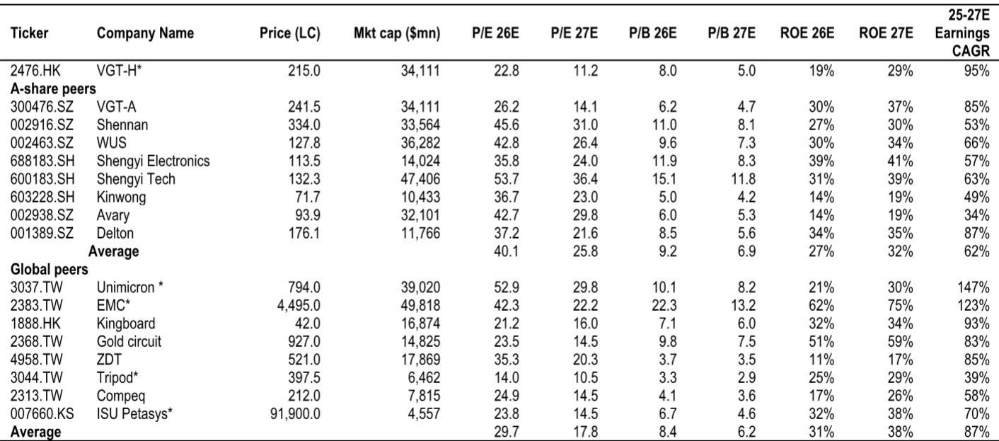
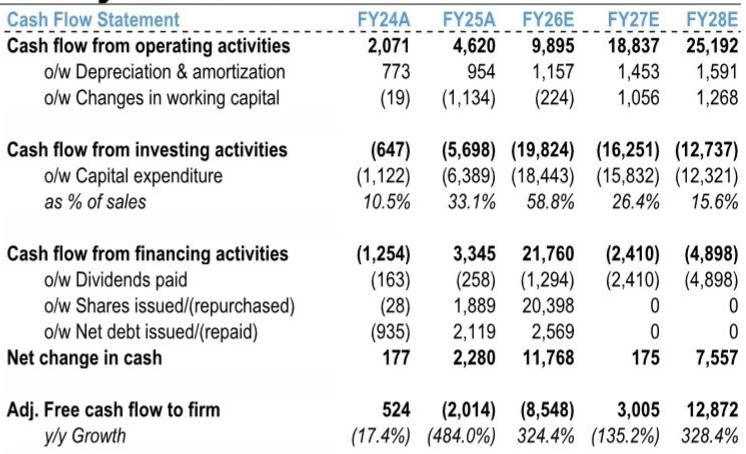
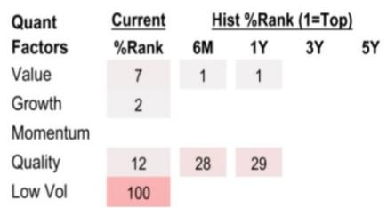

# 研究笔记：AI PCB产能规模与供应商长期份额的关系

市场对AI PCB供应商的讨论，近期集中在两个变量上：Vera Rubin项目的初期份额分配，以及Kyber机架的量产时间表。一份覆盖Victory Giant Technology-H的研究报告提出一个更根本的判断——决定供应商在未来两三年内钱包份额的关键因素，是高质量制造产能，而非初期份额分配。这一视角将市场注意力从短期博弈拉回到产业竞争的本质。

报告通过供应链核查发现，Vera Rubin的PCB量产进度略低于此前预期，但整体机架rollout节奏大致不变。VGT在该项目中的初期份额看起来低于上一代产品，但报告不认为这是结构性份额流失。随着生产规模扩大，供应商的分配将越来越依赖产能支撑能力。VGT仍在持续扩产，报告预计其将在未来几个季度的大批量生产中重新获得份额。

> **KC评论：** 初期份额低不等于最终份额低。在PCB这类重资产、高认证壁垒的行业，产能扩张速度和良率爬坡能力，往往比第一轮分配更能决定长期地位。这一逻辑也适用于其他AI硬件供应链环节。

Kyber机架（NLV144）目前仍在多条技术路径下测试。复杂PCB架构和更高性能目标，对材料选择、制造工艺和系统级组装都提出了更高要求。如果Kyber商业化耗时超出预期，报告认为对VGT的盈利影响将被部分抵消——来自当前代际产品的需求更强，同时谷歌项目的增量收入以及份额扩张也会形成缓冲。

报告将2026-2028年盈利预测下调5%至13%，主要反映今年部分PCB项目爬坡略晚于预期，以及Kyber可能延迟的影响。对应22倍12个月滚动市盈率（此前为24倍），下调幅度考虑了爬坡不确定性。但报告同时指出，从5月28日高点至今，VGT报价已回调51%，而同期恒生科技指数仅下跌5%，市场对短期逆风的反应已经过度。

## 1. 产能规模而非初期份额决定长期钱包份额

报告的供应链核查显示，Vera Rubin PCB量产进度略低于预期，但整体机架rollout节奏基本保持不变。VGT在该项目的初期份额分配低于上一代产品，但报告认为这并非结构性份额流失。随着生产规模扩大，供应商分配将越来越依赖产能支撑能力。VGT仍在持续扩产，报告预计其将在未来几个季度的大批量生产中重新获得份额。

这一判断的核心逻辑是：AI PCB项目具有高认证壁垒和重资产特征，初期分配更多反映客户对供应商现有产能的即时评估，而长期分配则取决于供应商能否在量产阶段提供足够产能和良率支持。VGT在AI和高性能计算PCB领域已占据全球第一的市场份额，其持续扩张的产能将成为维持这一地位的基础。

## 2. Kyber延迟的盈利影响可被其他项目部分对冲

Kyber机架（NLV144）目前仍在多条技术路径下测试。复杂PCB架构和更高性能目标，对材料选择、制造工艺和系统级组装都提出了更高要求。报告认为，如果Kyber商业化耗时超出预期，对VGT的盈利影响将被部分抵消——来自当前代际产品的需求更强，同时谷歌项目的增量收入以及份额扩张也会形成缓冲。

报告对2026-2028年盈利预测的下调，主要反映今年部分PCB项目爬坡略晚于预期，以及Kyber可能延迟的影响。但2025-2028年盈利复合增长率仍预计为73%，且报告预期2026年下半年盈利增长将加速，成为报价催化剂。

## 3. 报价回调已过度反映短期不确定性

从5月28日高点至今，VGT报价已回调51%，而同期恒生科技指数仅下跌5%。报告认为市场对短期逆风的反应已经过度。对应22倍12个月滚动市盈率，这一估值水平比可比公司2027年平均市盈率低约15%，与全球可比公司平均水平持平。

> **KC评论：** 51%的回调幅度与5-13%的盈利预测下调幅度之间存在明显落差。市场对Kyber不确定性和初期份额分配的担忧，可能已经超出了这些因素对基本面实际影响的量级。但这一判断成立的前提是，VGT的产能扩张和良率爬坡能够按计划推进。

## 4. 盈利增长加速的时点决定估值修复节奏

报告预计2026年下半年盈利增长将加速，成为报价催化剂。从季度盈利估算来看，2026年第三季度和第四季度的收入同比增速预计分别为74%和102%，净利润同比增速分别为101%和181%。这一加速增长主要来自Vera Rubin项目的量产爬坡，以及谷歌项目的增量贡献。

如果Kyber项目延迟，这一加速时点可能后移。但报告认为，当前代际产品的需求强度足以在过渡期内提供支撑。VGT的产能扩张节奏和良率爬坡速度，将是决定这一判断能否兑现的关键变量。

For informational purposes only. Portions may be generated,translated,summarized,or edited with AI assistance based on source materials and may contain omissions or errors. Please verify independently. This is not investment,legal,tax,accounting,or other professional advice.

For informational purposes only. Portions may be generated,translated,summarized,or edited with AI assistance based on source materials and may contain omissions or errors. Please verify independently. This is not investment,legal,tax,accounting,or other professional advice.

