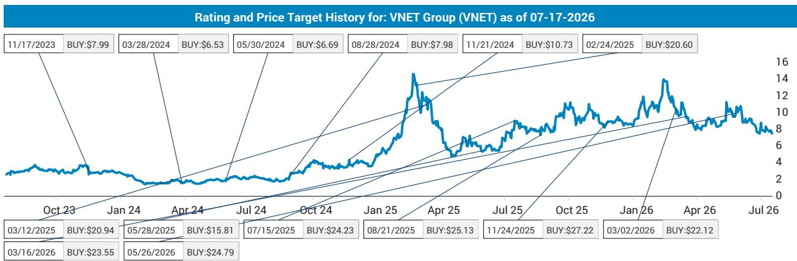
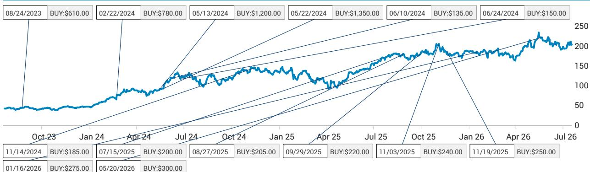
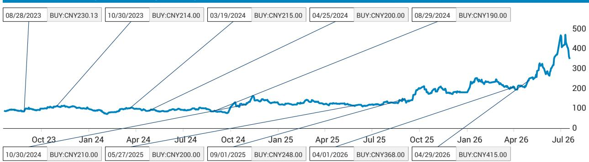

# 中国AI战略从雄心转向务实——这为观察者提供了清晰的研究框架

在2026年世界人工智能大会上，国家领导人的首次出席传递了比仪式性亮相更为深远的信息。这确认了中国AI战略不再追求与美国在模型层面逐一对标。相反，中国已确立双轨路径：通过开源出口构建面向新兴市场的AI生态系统，同时大力投入半导体自主能力建设。这一战略逻辑具有内在一致性，其研究启示也相当明确且集中。计算硬件，而非前沿模型，才是价值汇聚的核心领域。

大会揭示了一个微妙但重要的调整。机器人仍占据约25%的展区面积，但人形机器人演示数量明显减少。轮式机器人因成本更低、商业化路径更清晰而成为主流。这并非AI雄心的退却，而是认识到价值实现路径需通过基础设施与工业应用，而非炫目的消费级机器人或某个在所有基准上超越GPT的单一基础模型。对于观察者而言，信号清晰：中国AI建设中的受益方将是半导体设备制造商、晶圆代工厂和数据中心运营商，而非最智能的大语言模型开发者。

## 中国将AI作为地缘工具输出，开源模式牺牲短期变现

WAIC上最重大的战略决策是中国将开源AI作为其“一带一路”扩展的支柱。通过向新兴市场免费提供模型，中国同时实现两个目标：首先，形成对中国计算基础设施和绿色能源出口的依赖，锁定其半导体和数据中心产业的长期需求；其次，对美国的闭源模型形成直接定价压力，后者现在必须与一个免费的替代品竞争——据报告称，该替代品在智能水平上仅落后前沿约5%。例如，月之暗面的Kimi 3与Anthropic的Fable 5差距很小，在价格敏感市场的多数应用场景中已具备功能竞争力。

然而，权衡在于开源模型本身更难直接变现。没有中国AI公司能产生与美国同行相当的授权费用。利润将来自下游：运行推理的芯片、承载工作负载的数据中心，以及为模型训练提供标注和数据的基础设施。这正是报告将半导体资本支出确定为最高确信度研究主题的原因。美国的回应可以预见：更严格的出口管制以防止芯片转移，以及在先进美国模型中强制加入反蒸馏功能，防止中国玩家逆向工程专有能力。观察者应预期这种监管升级将加速而非减缓中国对本土晶圆代工能力的投入。

## 超级节点架构与3D DRAM堆叠揭示中国应对HBM限制的硬件方案

华为Atlas 950 SuperPoD展示了定义中国当前硬件现实的工程权衡。通过使用低功耗光模块连接1024颗昇腾950 GPU，该系统提供2 EFLOPs算力和107.52 TB/s内存带宽——在原始吞吐量上超越英伟达Vera Rubin NVL72。但其功耗为1.7兆瓦，是Rubin NVL72的7.4倍。这并非执行缺陷，而是一种有意为之的架构选择，优先考虑互连密度和内存带宽而非能效，原因正是中国无法获得来自美国盟友供应商的最先进HBM堆叠。

3D DRAM堆叠作为中国替代方案的出现，是报告中最被低估的进展。两家中国GPU厂商正通过混合键合技术将四层DDR5直接堆叠在GPU上，目标内存带宽超过20 TB/s——与HBM4相当。这些GPU本身基于14纳米节点，意味着它们在原始计算密度上会落后。但对于受内存带宽而非计算能力约束的智能体AI推理工作负载，这种架构可能出人意料地有效。供应链影响具体明确：长鑫存储将供应DDR5，中国封测厂商负责堆叠，中芯国际生产逻辑芯片。晶圆代工能力——无论是逻辑还是内存——是整个战略的约束瓶颈。这就是报告将中微公司和中芯国际列为重点关注对象的原因——它们是瓶颈的赋能者。

## 数据基础设施成为国家支持重点，中国在AI发展下一阶段获得结构性优势

美国长期主导AI数据收集，但随着公开文本数据趋于枯竭，这一优势正在减弱。剩余的高价值数据是专有的、企业级的，且标注成本高昂。中国较早认识到这一约束。继2022年“数据作为生产要素”政策之后，政府于2023年10月成立了专门的国家数据局。今年，预计将设立一家中央国有企业，专门促进跨行业高质量数据集的收集、标注和交易。

这是一个观察者不应低估的结构性优势。中国雇佣本地专业人员验证和贡献数据集的成本相对于美国仍具有竞争力。政府强制跨行业数据共享的能力，加上其资助集中式数据基础设施的意愿，形成了飞轮效应：更多数据带来更好模型，更好模型吸引更多用户，更多用户产生更多数据。美国没有类似的制度机制。对观察者而言，这意味着中国AI公司可能比缩小计算差距更快地缩小数据差距，而数据基础设施提供商——不仅仅是硬件厂商——值得关注。

## 智能体AI产品从模型智能转向驾驭能力，中国在两方面展开竞争

报告做出了一个在硬件新闻中容易被忽略的关键区分：对于提供强大的智能体性能，驾驭能力与模型智能同样重要。中国AI玩家已展示了具有复杂上下文管理、子智能体编排、工具调用、护栏和反馈循环管理能力的智能体产品。这些并非理论能力，而是直接与美国智能体框架竞争的在途产品。

这一点之所以重要，是因为AI的商业价值正从原始模型质量转向在生产中编排模型的系统。一个智能水平低5%但集成到更优智能体驾驭框架中的模型，其表现将超过缺乏编排的更智能模型。中国的开源战略放大了这一优势。新兴市场的开发者可以获取中国模型，将其与中国智能体框架结合，并在中国云基础设施上部署——全部无需授权费用。生态系统的粘性并非来自模型本身，而是来自集成的技术栈。

## AI智能手机面临结构性阻力，不太可能颠覆基于云计算的现状

一家中国AI玩家展示了一款自研AI智能手机，由小型端侧大语言模型而非传统操作系统驱动，但内核仍是安卓。报告暗示OpenAI可能走类似路径。但分析持怀疑态度，且理由充分。用户体验与基于云的服务没有足够差异化。生态系统面临根本性的采用问题：主要互联网平台可能出于安全原因或保护自身生态系统而屏蔽该设备的API。硬件供应链带来额外挑战，包括高内存价格和有限的议价能力。

对观察者而言，这是一个关于技术演示与商业可行性之间差距的警示故事。智能手机形态对功耗、散热和内存施加了云计算推理所不面临的严格限制。除非端侧模型能提供质的不同的体验——而不仅仅是稍快的响应时间——否则AI智能手机的经济性相对于云基础设施仍将缺乏吸引力。

## 观察者的决策框架：三个问题判断中国AI建设的参与机会

WAIC上显现的战略转变转化为一系列清晰的问题，观察者应就任何声称参与中国AI主题的公司提出。

第一，该公司受益于半导体资本支出，还是模型变现？报告证据强烈倾向于前者。晶圆代工能力是约束瓶颈。设备制造商和代工厂商将看到需求，无论哪个模型在开源竞赛中胜出。相比之下，模型开发者面临结构性挑战的变现环境，因为开源是必然选择。

第二，公司的技术定位是面向推理还是训练？训练需求将仍集中在少数前沿实验室。推理需求，尤其是智能体推理，将随每次部署而扩展。中国的3D DRAM堆叠策略明确针对推理工作负载优化。服务于推理基础设施层——数据中心、光互连、内存——的公司拥有更广阔的可寻址市场。

第三，公司的竞争优势是否依赖于获取受限的美国技术？如果是，监管风险是根本性的。中国的整个硬件战略都是基于美国出口管制将收紧的假设而制定的应对方案。已经构建了替代方案的公司，如国产光模块或混合键合DRAM堆叠，比那些依赖持续获取美国供应链的公司处于更有利位置。

机器人仍是一个大主题，但从人形机器人向轮式机器人的转变降低了技术风险并加速了商业化时间表。报告认为，考虑到计算、内存、热管理、灵巧手和减速器方面的挑战，人形机器人可能还需五年时间，这一观点较为务实。轮式机器人面临的这些约束都不那么严重。对观察者而言，对人形机器人的务实淡化是一个积极信号：意味着该领域正从科学项目走向商业产品。

2026年WAIC的总体研究结论是，中国的AI战略现已具体、有资金支持，并得到最高级别的国家协调支持。回报路径贯穿硬件和基础设施，而非前沿模型突破。半导体设备、晶圆代工能力、数据中心运营商和数据基础设施提供商是结构性受益方。模型开发者和消费级AI硬件面临不确定的变现前景。在上海展现的务实精神并非雄心的退却，而是认识到建设AI经济的基础设施比押注任何单一模型主导市场是更可靠的研究主题。

*仅供参考。部分内容可能基于源材料通过AI辅助生成、翻译、摘要或编辑，可能存在遗漏或错误。请独立核实。本文不构成任何专业建议。*

仅供参考。部分内容可能基于源材料通过AI辅助生成、翻译、摘要或编辑，可能存在遗漏或错误。请独立核实。本文不构成任何专业建议。

