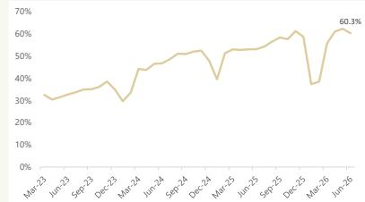
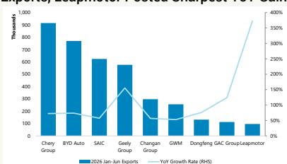
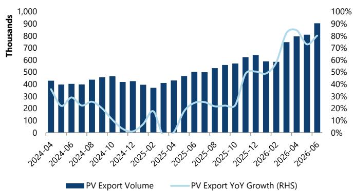
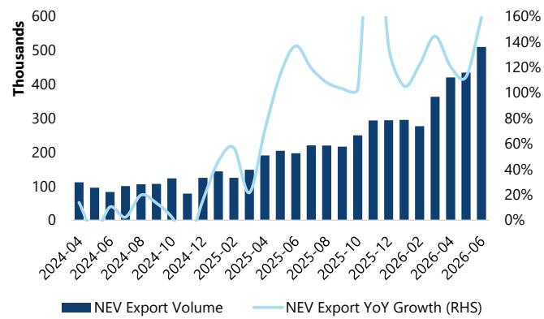

2026年1-6月出口同比增速（右轴）

## 中国新能源汽车月度图表：夏季的平稳期

6月份国内需求保持平稳，乘用车批发和零售销量同比分别下降6%和23%，新能源汽车渗透率较5月高点有所回落。出口仍是主要亮点，同比增长80%至90.5万辆的历史新高，奇瑞、比亚迪、吉利和上汽集团领跑，中国品牌继续扩大海外市场份额。价格方面存在一定调整，零售均价环比下降2%至17万元，中国品牌新能源汽车价格同比下降9%。详情如下。

## 新能源汽车保险渗透率回落至60.3%。

\- 乘用车批发量达240万辆（同比下降5.6%，环比增长6.6%），出口（同比增长80%至90.45万辆）保持强劲势头。零售量为166万辆（同比下降23%，环比增长13%）。

\- 新能源汽车乘用车批发量为152万辆，同比增长21.3%，环比增长9.8%。国内新能源汽车保险渗透率回落至60.3%（低于5月创纪录的62.3%）；纯电动汽车为41.6%，插电式混合动力汽车为18.7%。

\- 市场份额方面，零跑、吉利和蔚来在2026年上半年均表现较好，市场份额同比分别提升1.3、1.2和1.2个百分点。零跑表现突出，2026年上半年零售量同比增长45%（6月同比增长73%至7万辆），蔚来也加速增长（2026年上半年同比增长68%；6月同比增长88%至4.1万辆）。比亚迪市场份额有所变化（2026年上半年同比下降38%），而大多数合资/豪华品牌（福特、本田、梅赛德斯6月均下降30%以上）表现相对一般。

## 出口仍是亮点。

\- 6月份乘用车出口再创新高，达90.45万辆（同比增长80%，环比增长12%）。奇瑞、比亚迪、吉利和上汽集团继续主导，合计约占出货总量的67%。吉利是明显赢家，在2026年上半年出口激增213%后，出口份额同比扩大5.8个百分点，而上汽集团份额下降1.5个百分点。

\- 各地区市场份额增长较为广泛。中国品牌在欧洲乘用车市场占有率达9.1%，在新能源汽车市场占有率达19.7%，其中奇瑞（年初至今增长1.1个百分点）和比亚迪（增长0.8个百分点）领涨。东南亚市场回升至15.4%的份额（新能源汽车占56%），而拉丁美洲仍是渗透最深的市场，份额为16.3%，新能源汽车销售占比约87%。在这两个地区，奇瑞、比亚迪和吉利仍是主要的份额增长者。

零售均价回落至17万元（环比下降2%，同比持平），因产品组合支撑减弱。纯电动汽车均价环比微升1%，而燃油车下降3%。中国品牌新能源汽车均价环比下降2%，同比下降9%（价格竞争仍在持续），中国品牌燃油车均价也环比下降2%。豪华车保持平稳（环比下降2%，梅赛德斯-奔驰下降7%，宝马下降6%，奥迪下降2%），合资品牌环比下降3%。在高端新能源汽车中，价格分化进一步扩大：蔚来（环比上涨15%，达到44.3万元）、问界（上涨19%）、坦克（上涨1%）和特斯拉（上涨4%）价格有所回升，而理想汽车（下降1%）、极氪（下降1%）和小米（下降2%）则有所走弱。

新车型。第409批工信部目录显示，各厂商正协同向合资和豪华品牌仍占据的细分市场发起冲击。小米首款增程式电动车（N90/N70）以领先同级的纯电续航和旋转座椅、平地板内饰对标理想汽车和问界；理想i9定价约45万元，提供MEGA级空间；吉利战舰700和奇瑞iCAR V25开辟了20万元以下的方盒子SUV赛道，对标哈弗H9和本田CR-V；比亚迪更新了其产品线顶端（新款唐、腾势Z9S）以及入门级海鸥。趋势一致：更大的车身尺寸、更长的插电混动/增程式电动续航里程，以及持续对现有品牌形成压力的定价策略。

调整北汽蓝谷目标价：我们修订了2026/2027财年的预测，以反映自主品牌业务毛利率的改善。然而，我们2026-2027财年的销量预测仍低于市场预期，我们认为整体乘用车市场明年将继续面临一定挑战。鉴于汽车板块在2026年年初至今的估值调整，我们将目标价下调至4.5元，基于0.7倍2026财年预期市销率，与板块平均估值倍数一致。维持持有评级。

<table><tr><td colspan="3">主要覆盖标的包括：</td></tr><tr><td>代码</td><td>评级</td><td>目标价</td></tr><tr><td>600733 CH</td><td>持有</td><td>4.50元</td></tr></table>

主要调整包括：

<table><tr><td>代码</td><td>评级</td><td>目标价</td></tr><tr><td>600733 CH</td><td>持有</td><td>↓ 4.50元（前值8.40元）</td></tr></table>

图表1 - 2026年6月中国新能源汽车月度保险销售渗透率达60.3%  
  
来源：ThinkerCar，JEF

图表2 - 奇瑞和比亚迪领跑中国2026年上半年乘用车出口，零跑同比增幅最大  
  
来源：Marklines，JEF

图表3 - 2026年上半年出口（+72%）和新能源汽车（+7%）抵消了国内需求的调整（-24%）

<table><tr><td></td><td colspan="2">2026年1-6月累计</td><td colspan="3">2026年6月单月</td></tr><tr><td>指标</td><td>销量（百万）</td><td>同比</td><td>销量（百万）</td><td>同比</td><td>环比</td></tr><tr><td colspan="6">汽车总批发</td></tr><tr><td>总批发</td><td>15.016</td><td>-4.0%</td><td>2.810</td><td>-3.2%</td><td>6.9%</td></tr><tr><td>其中：新能源汽车</td><td>7.445</td><td>7.4%</td><td>1.643</td><td>23.6%</td><td>9.8%</td></tr><tr><td>其中：燃油车</td><td>7.571</td><td>-13.1%</td><td>1.167</td><td>-25.9%</td><td>3.0%</td></tr><tr><td colspan="6">乘用车批发</td></tr><tr><td>乘用车合计</td><td>12.719</td><td>-6.0%</td><td>2.402</td><td>-5.3%</td><td>6.6%</td></tr><tr><td>其中：新能源汽车</td><td>6.896</td><td>5.6%</td><td>1.517</td><td>21.3%</td><td>9.8%</td></tr><tr><td>其中：燃油车</td><td>5.823</td><td>-16.7%</td><td>0.885</td><td>-31.1%</td><td>1.5%</td></tr><tr><td>国内（批发-出口）</td><td>8.287</td><td>-24.3%</td><td>1.497</td><td>-26.4%</td><td>3.7%</td></tr><tr><td>新能源汽车国内</td><td>4.597</td><td>-16.8%</td><td>1.007</td><td>-4.5%</td><td>6.3%</td></tr><tr><td>燃油车国内</td><td>3.690</td><td>-32.0%</td><td>0.490</td><td>-49.9%</td><td>-1.3%</td></tr><tr><td>出口（乘用车）</td><td>4.432</td><td>72.0%</td><td>0.905</td><td>80.2%</td><td>11.7%</td></tr><tr><td>新能源汽车出口</td><td>2.300</td><td>128.0%</td><td>0.510</td><td>159.3%</td><td>17.3%</td></tr><tr><td>燃油车出口</td><td>2.133</td><td>36.0%</td><td>0.394</td><td>29.3%</td><td>5.3%</td></tr><tr><td colspan="6">商用车批发</td></tr><tr><td>卡车合计</td><td>2.018</td><td>8.7%</td><td>0.347</td><td>9.7%</td><td>7.3%</td></tr><tr><td>重卡</td><td>0.661</td><td>22.6%</td><td>0.117</td><td>19.2%</td><td>6.5%</td></tr><tr><td>轻卡</td><td>1.046</td><td>1.0%</td><td>0.185</td><td>9.9%</td><td>7.5%</td></tr><tr><td>中卡</td><td>0.075</td><td>25.3%</td><td>0.013</td><td>30.4%</td><td>-2.0%</td></tr><tr><td>微卡</td><td>0.237</td><td>6.7%</td><td>0.032</td><td>-19.2%</td><td>12.9%</td></tr><tr><td>客车合计</td><td>0.278</td><td>5.0%</td><td>0.062</td><td>16.6%</td><td>16.4%</td></tr></table>

来源：中汽协，CBIRC，JEF

雷肖依 \* | 股票分析师

852 3767 1126 | xiaoyi.lei@JEF.com

王亚伦 \* | 股票分析师

+852 3767 1121 | aaron.wang@JEF.com

Philippe Houchois ^ | 股票分析师

44 (0) 20 7029 8983 | philippe.houchois@JEF.com

Vanessa Jeffriess ‡ | 股票分析师
44 (0)20 7548 4123 | vjeffriess@JEF.com

Owen Paterson ‡ | 股票分析师
+44 (0)20 7548 4745 | opaterson@JEF.com

## 调整摘要

<table><tr><td colspan="4"></td><td colspan="3">每股收益预测</td><td colspan="3">市盈率</td></tr><tr><td>公司</td><td>评级</td><td>现价^</td><td>目标价</td><td>2025</td><td>2026</td><td>2027</td><td>2025</td><td>2026</td><td>2027</td></tr><tr><td rowspan="2">北汽蓝谷 600733 CH</td><td rowspan="2">持有</td><td rowspan="2">4.62元</td><td>4.50元</td><td>-0.82元</td><td>-0.56元</td><td>-0.28元</td><td rowspan="2">不适用</td><td rowspan="2">不适用</td><td rowspan="2">不适用</td></tr><tr><td>↓ -46%</td><td>↑ +5%</td><td>↑ +22%</td><td>↑ +55%</td></tr><tr><td>前值</td><td></td><td></td><td>8.40元</td><td>-0.86元</td><td>-0.71元</td><td>-0.63元</td><td></td><td></td><td></td></tr></table>

^除非另有说明，否则为前一交易日收盘价。

## 目录

出口销售 5
销量 14
每周新订单 17
价格 18
新车型 19
库存 20
成本 21
北汽蓝谷 (600733 CH) 22

图表4 - 中国汽车市场 - 2026年6月月度销量及累计数据摘要

<table><tr><td colspan="4">2026年1-6月累计总销量</td><td colspan="3">2026年1-6月累计出口</td><td colspan="3">2026年1-6月累计零售</td></tr><tr><td>车企</td><td>累计销量</td><td>同比</td><td>环比</td><td>累计出口</td><td>同比</td><td>环比</td><td>累计零售</td><td>同比</td><td>环比</td></tr><tr><td>比亚迪</td><td>1,808,511</td><td>-15.7%</td><td>28.7%</td><td>769,330</td><td>73.6%</td><td>28.6%</td><td>974,344</td><td>-37.7%</td><td>12.9%</td></tr><tr><td>奇瑞集团</td><td>1,279,172</td><td>6.75%</td><td>23.23%</td><td>914,859</td><td>72.47%</td><td>25.37%</td><td>431,191</td><td>-30.88%</td><td>17.90%</td></tr><tr><td>吉利+极氪</td><td>1,676,725</td><td>3.3%</td><td>20.9%</td><td>576,232</td><td>155.3%</td><td>27.5%</td><td>958,221</td><td>-11.2%</td><td>3.9%</td></tr><tr><td>长城汽车</td><td>583,358</td><td>2.39%</td><td>22.72%</td><td>256,000</td><td>52.77%</td><td>26.32%</td><td>265,229</td><td>-14.53%</td><td>11.98%</td></tr><tr><td>上汽集团</td><td>1,987,273</td><td>-0.5%</td><td>23.8%</td><td>623,780</td><td>57.2%</td><td>24.1%</td><td>163,618</td><td>29.7%</td><td>31.2%</td></tr><tr><td>零跑</td><td>356,487</td><td>60.82%</td><td>35.49%</td><td>96,294</td><td>372.61%</td><td>27.89%</td><td>258,719</td><td>44.86%</td><td>11.38%</td></tr><tr><td>蔚来</td><td>191,123</td><td>67.4%</td><td>27.0%</td><td>不适用</td><td>—</td><td>—</td><td>195,860</td><td>67.6%</td><td>16.3%</td></tr><tr><td>赛力斯集团</td><td>190,032</td><td>-0.1%</td><td>22.8%</td><td>17,420</td><td>48.6%</td><td>20.5%</td><td>161,399</td><td>1.0%</td><td>-15.1%</td></tr><tr><td>理想汽车</td><td>193,472</td><td>-5.1%</td><td>19.0%</td><td>不适用</td><td>—</td><td>—</td><td>191,361</td><td>-8.1%</td><td>-5.8%</td></tr><tr><td>小鹏</td><td>165,977</td><td>-15.83%</td><td>31.88%</td><td>31,599</td><td>68.97%</td><td>31.30%</td><td>133,590</td><td>-25.74%</td><td>24.26%</td></tr><tr><td>小米汽车</td><td>185,055</td><td>17.2%</td><td>23.1%</td><td>不适用</td><td>—</td><td>—</td><td>186,189</td><td>17.7%</td><td>5.6%</td></tr></table>

来源：中汽协，CBIRC，JEF

图表5 - 中国汽车市场 - 2026年上半年 vs. 2025年

<table><tr><td colspan="3">2026年1-6月累计</td><td colspan="3">2026年6月单月</td></tr><tr><td>指标</td><td>销量（百万）</td><td>同比</td><td>销量（百万）</td><td>同比</td><td>环比</td></tr><tr><td colspan="6">汽车总批发</td></tr><tr><td>总批发</td><td>15.016</td><td>-4.0%</td><td>2.810</td><td>-3.2%</td><td>6.9%</td></tr><tr><td>其中：新能源汽车</td><td>7.445</td><td>7.4%</td><td>1.643</td><td>23.6%</td><td>9.8%</td></tr><tr><td>其中：燃油车</td><td>7.571</td><td>-13.1%</td><td>1.167</td><td>-25.9%</td><td>3.0%</td></tr><tr><td colspan="6">乘用车批发</td></tr><tr><td>乘用车合计</td><td>12.719</td><td>-6.0%</td><td>2.402</td><td>-5.3%</td><td>6.6%</td></tr><tr><td>其中：新能源汽车</td><td>6.896</td><td>5.6%</td><td>1.517</td><td>21.3%</td><td>9.8%</td></tr><tr><td>其中：燃油车</td><td>5.823</td><td>-16.7%</td><td>0.885</td><td>-31.1%</td><td>1.5%</td></tr><tr><td>国内（批发-出口）</td><td>8.287</td><td>-24.3%</td><td>1.497</td><td>-26.4%</td><td>3.7%</td></tr><tr><td>新能源汽车国内</td><td>4.597</td><td>-16.8%</td><td>1.007</td><td>-4.5%</td><td>6.3%</td></tr><tr><td>燃油车国内</td><td>3.690</td><td>-32.0%</td><td>0.490</td><td>-49.9%</td><td>-1.3%</td></tr><tr><td>出口（乘用车）</td><td>4.432</td><td>72.0%</td><td>0.905</td><td>80.2%</td><td>11.7%</td></tr><tr><td>新能源汽车出口</td><td>2.300</td><td>128.0%</td><td>0.510</td><td>159.3%</td><td>17.3%</td></tr><tr><td>燃油车出口</td><td>2.133</td><td>36.0%</td><td>0.394</td><td>29.3%</td><td>5.3%</td></tr><tr><td colspan="6">商用车批发</td></tr><tr><td>卡车合计</td><td>2.018</td><td>8.7%</td><td>0.347</td><td>9.7%</td><td>7.3%</td></tr><tr><td>重卡</td><td>0.661</td><td>22.6%</td><td>0.117</td><td>19.2%</td><td>6.5%</td></tr><tr><td>轻卡</td><td>1.046</td><td>1.0%</td><td>0.185</td><td>9.9%</td><td>7.5%</td></tr><tr><td>中卡</td><td>0.075</td><td>25.3%</td><td>0.013</td><td>30.4%</td><td>-2.0%</td></tr><tr><td>微卡</td><td>0.237</td><td>6.7%</td><td>0.032</td><td>-19.2%</td><td>12.9%</td></tr><tr><td>客车合计</td><td>0.278</td><td>5.0%</td><td>0.062</td><td>16.6%</td><td>16.4%</td></tr></table>

来源：中汽协，CBIRC，JEF

## 出口销售

图表6 - 乘用车出口同比增长80%至90.45万辆  
  
来源：中汽协，JEF

图表7 - 新能源汽车出口同比增长113%至43.47万辆  
  
来源：中汽协，JEF

图表8 - 主要国内品牌出口量

<table><tr><td>车企</td><td>25年1月</td><td>25年2月</td><td>25年3月</td><td>25年4月</td><td>25年5月</td><td>25年6月</td><td>25年7月</td><td>25年8月</td><td>25年9月</td><td>25年10月</td><td>25年11月</td><td>25年12月</td><td>2025年</td><td>26年1月</td><td>26年2月</td><td>26年3月</td><td>26年4月</td><td>26年5月</td><td>26年6月</td><td>同比</td><td>环比</td><td>6个月同比变化</td></tr><tr><td>上汽</td><td>54,449</td><td>53,740</td><td>64,620</td><td>69,251</td><td>80,055</td><td>74,712</td><td>64,861</td><td>74,087</td><td>83,186</td><td>80,179</td><td>87,181</td><td>84,272</td><td>870,793</td><td>89,353</td><td>84,328</td><td>102,477</td><td>115,799</td><td>110,700</td><td>121,123</td><td>62.1%</td><td>9.4%</td><td>57.2%</td></tr><tr><td>奇瑞</td><td>78,481</td><td>84,711</td><td>83,529</td><td>84,220</td><td>97,030</td><td>102,472</td><td>115,379</td><td>123,624</td><td>131,507</td><td>120,598</td><td>131,940</td><td>140,786</td><td>1,294,277</td><td>116,985</td><td>116,829</td><td>146,030</td><td>172,114</td><td>177,742</td><td>185,159</td><td>80.7%</td><td>4.2%</td><td>72.5%</td></tr><tr><td>特斯拉</td><td>29,535</td><td>3,911</td><td>4,701</td><td>29,728</td><td>23,074</td><td>10,115</td><td>27,269</td><td>26,040</td><td>19,287</td><td>35,491</td><td>13,555</td><td>3,328</td><td>226,034</td><td>50,644</td><td>20,393</td><td>29,563</td><td>53,522</td><td>38,701</td><td>36,171</td><td>257.6%</td><td>-6.5%</td><td>126.6%</td></tr><tr><td>长城</td><td>23,871</td><td>25,805</td><td>26,641</td><td>27,837</td><td>28,525</td><td>34,896</td><td>35,831</td><td>39,875</td><td>44,832</td><td>51,690</td><td>50,775</td><td>51,704</td><td>442,282</td><td>34,612</td><td>36,947</td><td>40,897</td><td>45,015</td><td>45,188</td><td>53,341</td><td>52.9%</td><td>18.0%</td><td>52.8%</td></tr><tr><td>吉利</td><td>27,354</td><td>25,552</td><td>37,047</td><td>24,133</td><td>30,017</td><td>40,011</td><td>35,272</td><td>36,077</td><td>40,665</td><td>41,568</td><td>42,091</td><td>40,310</td><td>430,097</td><td>76,168</td><td>78,017</td><td>98,423</td><td>99,596</td><td>99,762</td><td>124,266</td><td>210.6%</td><td>24.6%</td><td>213.0%</td></tr><tr><td>长安</td><td>47,023</td><td>34,821</td><td>31,172</td><td>23,694</td><td>23,883</td><td>29,033</td><td>31,725</td><td>35,172</td><td>38,827</td><td>32,828</td><td>28,462</td><td>16,825</td><td>373,465</td><td>24,305</td><td>45,278</td><td>70,216</td><td>49,253</td><td>46,388</td><td>61,735</td><td>112.6%</td><td>33.1%</td><td>56.7%</td></tr><tr><td>比亚迪</td><td>66,336</td><td>67,025</td><td>67,307</td><td>72,405</td><td>84,068</td><td>85,957</td><td>78,364</td><td>79,603</td><td>69,258</td><td>80,108</td><td>128,067</td><td>131,637</td><td>1,010,135</td><td>96,859</td><td>98,706</td><td>116,882</td><td>130,042</td><td>155,944</td><td>170,897</td><td>98.8%</td><td>9.6%</td><td>73.6%</td></tr><tr><td>江淮</td><td>9,010</td><td>8,794</td><td>9,229</td><td>9,745</td><td>11,201</td><td>6,753</td><td>8,079</td><td>13,712</td><td>11,130</td><td>9,428</td><td>11,515</td><td>8,661</td><td>117,257</td><td>5,270</td><td>4,317</td><td>6,843</td><td>7,944</td><td>5,670</td><td>9,846</td><td>45.8%</td><td>73.7%</td><td>-27.1%</td></tr><tr><td>广汽</td><td>3,186</td><td>4,742</td><td>12,788</td><td>7,572</td><td>8,539</td><td>13,391</td><td>10,389</td><td>8,349</td><td>12,594</td><td>12,869</td><td>17,286</td><td>13,451</td><td>135,156</td><td>13,324</td><td>17,024</td><td>26,852</td><td>17,653</td><td>16,372</td><td>21,149</td><td>57.9%</td><td>29.2%</td><td>123.8%</td></tr><tr><td>一汽</td><td>6,300</td><td>4,271</td><td>4,926</td><td>5,506</td><td>5,501</td><td>9,255</td><td>3,308</td><td>3,524</td><td>4,254</td><td>4,474</td><td>7,284</td><td>10,217</td><td>68,820</td><td>2,386</td><td>2,822</td><td>6,212</td><td>11,051</td><td>5,868</td><td>10,306</td><td>11.4%</td><td>75.6%</td><td>8.1%</td></tr><tr><td>其他</td><td>49,855</td><td>57,227</td><td>68,433</td><td>76,944</td><td>75,866</td><td>95,273</td><td>88,976</td><td>92,834</td><td>103,897</td><td>102,173</td><td>105,439</td><td>140,075</td><td>1,056,992</td><td>78,981</td><td>80,861</td><td>104,104</td><td>93,528</td><td>107,108</td><td>110,516</td><td>16.0%</td><td>3.2%</td><td>35.8%</td></tr><tr><td>合计</td><td>395,400</td><td>370,599</td><td>410,393</td><td>431,035</td><td>467,759</td><td>501,868</td><td>499,453</td><td>532,897</td><td>559,637</td><td>571,406</td><td>623,595</td><td>641,266</td><td>6,005,308</td><td>588,887</td><td>585,522</td><td>748,499</td><td>795,517</td><td>809,443</td><td>904,509</td><td>80.2%</td><td>11.7%</td><td>72.0%</td></tr></table>

来源：Marklines，JEF

图表9 - 主要国内品牌出口市场份额

<table><tr><td>车企</td><td>25年1月</td><td>25年2月</td><td>25年3月</td><td>25年4月</td><td>25年5月</td><td>25年6月</td><td>25年7月</td><td>25年8月</td><td>25年9月</td><td>25年10月</td><td>25年11月</td><td>25年12月</td><td>2025年</td><td>26年1月</td><td>26年2月</td><td>26年3月</td><td>26年4月</td><td>26年5月</td><td>26年6月</td><td>同比</td><td>环比</td><td>6个月同比变化</td></tr><tr><td>上汽</td><td>13.8%</td><td>14.5%</td><td>15.7%</td><td>16.1%</td><td>17.1%</td><td>14.9%</td><td>13.0
