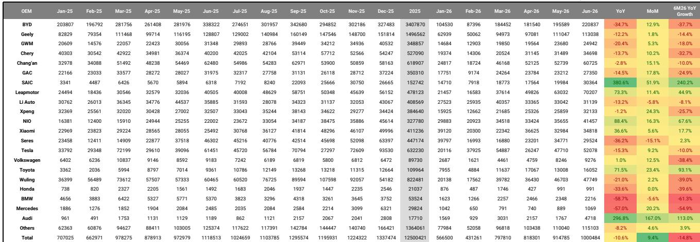
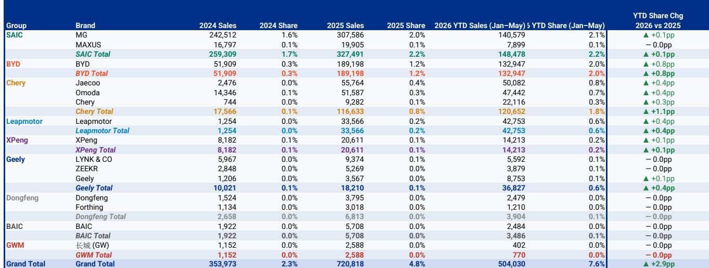
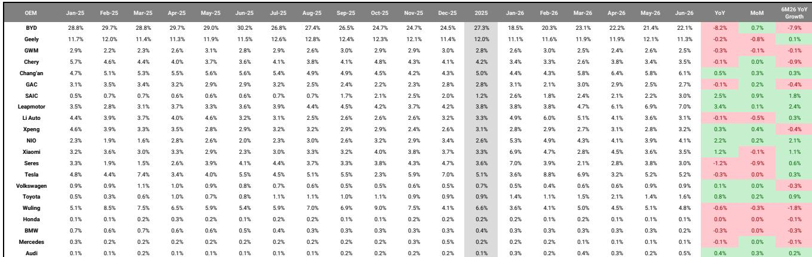

# 中国汽车市场的双重现实：国内竞争格局与全球拓展路径

2026年6月，中国乘用车出口量同比增长80%，达到创纪录的90.45万辆，同期国内零售销量同比下降23%。这并非暂时的分化，而是同一行业内部两种完全不同的竞争态势的结构性分离。一个市场是价格竞争激烈、定价能力持续减弱、传统品牌份额流失的领域；另一个则是出口引擎，中国制造商正以加速的态势从现有竞争者手中夺取市场，其中新能源汽车出口量单月同比增长159%。

这些数据要求我们进行战略性的重新审视。2026年上半年，国内乘用车批发量同比下降6%，同期国内市场收缩24%。然而，行业总批发量仅下降4%，原因是出口填补了缺口。出口在乘用车总产量中的占比已升至决定单个主机厂增长或萎缩的关键点。对于任何关注中国汽车行业的研究者或管理者而言，问题已不再是如何仅在国内市场竞争，而是如何构建一个能够承受国内利润压缩同时捕捉海外增长机会的业务模式。

最具启示性的数据点并非相对的出口纪录，而是赢家的构成。吉利2026年上半年出口量激增213%，其在中国总出口中的份额同比扩大5.8个百分点。零跑同期出口量同比增长373%，尽管基数较小。与此同时，作为历史上中国最大的出口商之一，上汽的出口份额下降了1.5个百分点。模式清晰可见：出口机会并非普涨的浪潮，它本身就是一个竞争舞台，产品定位、区域战略和品牌执行决定了结果，正如国内市场一样。

## 国内新能源汽车渗透率暂时见顶，但潜在竞争压力未减

2026年6月，新能源汽车保险渗透率回落至60.3%，低于5月创纪录的62.3%。这一放缓反映了季节性疲软和国内需求的整体变化，并非电动化趋势的结构性逆转。纯电动汽车渗透率为41.6%，插电式混合动力汽车为18.7%，按全球标准仍处于较高水平。重要的战略观察是，渗透率已达到一个水平，进一步的提升将越来越多地来自在电动化进程较慢的细分市场中替代传统内燃机汽车，而非来自首次购买电动汽车的用户。

这就是定价环境依然严峻的原因。6月平均零售价格降至17万元人民币，环比下降2%，同比持平，但这一总体数据掩盖了一个关键的分化。中国品牌新能源汽车平均零售价格同比下降9%，而中国品牌内燃机汽车平均零售价格环比下降2%。价格竞争并非暂时的促销周期，而是产能过剩、中端产品同质化以及中国主机厂在萎缩的国内市场中捍卫或扩大市场份额的战略要求的结构性结果。这一动态中的输家是合资品牌和豪华品牌，它们的平均零售价格全面下降：奔驰环比下降7%，宝马下降6%，奥迪下降2%。

然而，高端新能源汽车内部的分化表明，定价能力并未消亡。蔚来实现平均零售价格环比增长15%，达到44.3万元人民币，问界增长19%，特斯拉增长4%。相比之下，理想、极氪和小米的平均零售价格均有所下降。差异并非仅由细分市场或价格点决定，它反映了品牌定位、产品差异化以及在快速商品化的市场中维持高端叙事的能力。对于任何在中国运营的主机厂而言，国内市场现在要求一个二元选择：在大众市场以成本和规模竞争，或者投资于可防御的高端身份。中间地带正在被挤压。

## 出口已成为主要销量杠杆，但区域赢家与国内赢家不同

出口故事并非单一模式。中国品牌在欧洲乘用车市场占据9.1%的份额，在欧洲新能源汽车市场占据19.7%的份额，奇瑞和比亚迪引领份额增长。在东南亚，中国品牌整体份额恢复至15.4%，新能源汽车份额达56%。拉丁美洲仍是最深入的市场，整体份额为16.3%，约87%的新能源汽车销售来自中国品牌。奇瑞、比亚迪和吉利是这三个区域的主要份额增长者。

这种地理广度很重要，因为它减少了对任何单一监管或贸易体系的依赖。欧洲或美国关税升级的风险是真实存在的，但出口目的地的多样化意味着没有单一政策变化能够阻止这一势头。更重要的战略问题是，哪些主机厂正在建设本地基础设施、分销网络和服务能力，以在最初的低成本出口浪潮之后维持这些收益。吉利2026年上半年213%的出口增长表明它正在这样做，而上汽的相对下滑则暗示其未能使出口战略适应新的竞争格局。

数据还显示，新能源汽车出口增长速度远超内燃机汽车。2026年6月，新能源汽车出口量同比增长159%，而内燃机汽车为29%。这不仅仅反映了全球电动汽车需求，也反映了中国主机厂在电动化动力系统方面拥有真正的产品优势，尤其是在性价比细分市场，而它们在高端内燃机汽车领域尚未具备这一优势。因此，出口增长是自我强化的：随着规模扩大，单位成本下降，产品在更多市场中变得更具竞争力。

## 新车型产品线瞄准合资与豪华品牌的剩余阵地

第409批工信部目录（列出新批准生产的车型）揭示了一次协调一致的战略推进，目标直指合资品牌和豪华品牌历来主导的细分市场。小米的首款增程式电动汽车N90/N70，直接对标理想和问界，提供同级领先的纯电续航里程，以及旋转座椅和平坦地板的内饰设计，表明其关注点在于乘客体验而不仅仅是动力系统规格。理想i9，定价约45万元人民币，将MEGA级别的内部空间带入更低的价格区间。吉利的战船700和奇瑞的iCAR V25开辟了20万元人民币以下的方盒子SUV赛道，瞄准哈弗H9和本田CR-V。比亚迪正在更新其产品线顶端，推出新款唐和腾势Z9S，同时以海鸥更新入门级产品。

所有这些新车型的共同主线是一致的：更大的车身尺寸、插电式混合动力和增程式平台上更长的纯电续航里程，以及低于现有竞争产品的定价。战略意图并非渐进式的市场份额增长，而是系统性地消除合资品牌和传统豪华品牌所依赖的价格和功能溢价。每当中国主机厂在先前受保护的细分市场推出一款新车型，定价底线就会下降，功能期望就会上升。

第二个层面的影响是，国内市场至少在未来18至24个月内将继续面临利润压缩，直到最弱的现有竞争者退出或重组。无法在成本、功能配置或电动化速度上与中国主机厂匹敌的合资品牌将继续失去份额，数据已经显示了这一点。福特、本田和奔驰6月零售销量同比均下降超过30%。新车型产品线确保这种压力将加剧，而非缓解。

## 评估当前环境下中国汽车公司的分析框架

关注者和从业者需要一个能够解释市场双速性质的框架。以下三个问题应指导对任何中国汽车主机厂或其供应商的评估。

首先，公司的出口敞口及其维持能力如何？出口增长是主要的销量驱动力，但并非所有出口增长都同等重要。关键指标是出口量增长相对于行业平均水平、出口目的地的多样性以及销售背后的本地基础设施投资。主要向单一区域出口或依赖第三方分销商而非自有网络的公司，承担着更多的监管和执行风险。吉利和奇瑞在多元化和基础设施方面得分较高。上汽份额下降则暗示结构性挑战。

其次，公司能否捍卫其国内定价，还是陷入了大众市场商品化周期？数据显示，具有真正差异化优势的高端品牌，如蔚来和问界，即使在价格竞争激烈的市场中也能提高平均零售价格。主要依靠价格竞争的大众市场品牌，随着新车型产品线在每个细分市场增加产能，其利润率将进一步压缩。区别不在于相对价格点，而在于品牌是否拥有消费者愿意为之付费的可防御定位。

第三，公司的产品线是否瞄准现有竞争者薄弱或仍然强大的细分市场？最具吸引力的机会在于合资品牌仍占据显著份额但缺乏有竞争力的电动化产品的细分市场。方盒子SUV细分市场、大型家庭车细分市场和高端增程式细分市场都受到当前新车型目录的冲击。率先在这些细分市场推出有竞争力产品的公司将获得不成比例的份额。在内燃机汽车领域捍卫传统地位的公司将继续失去份额。

该分析框架并非静态。随着出口市场成熟和国内整合加速，这些因素的相对重要性将发生变化。但在未来12至18个月内，出口增长引擎与国内竞争格局之间的分离将定义哪些公司创造价值，哪些公司面临挑战。

---

*仅供参考。部分内容可能基于源材料通过AI辅助生成、翻译、总结或编辑，可能存在遗漏或错误。请独立核实。本文不构成专业建议。*

仅供参考。部分内容可能基于源材料通过AI辅助生成、翻译、总结或编辑，可能存在遗漏或错误。请独立核实。本文不构成专业建议。

