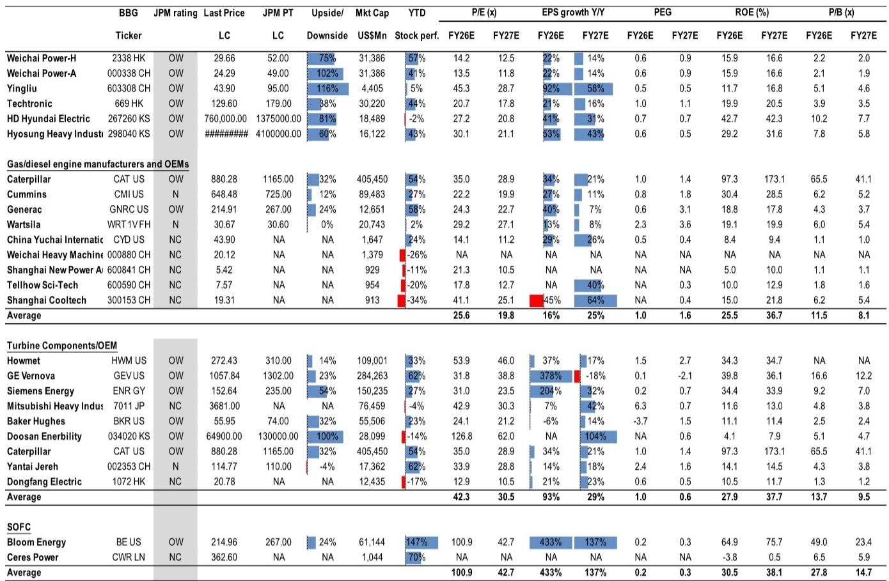
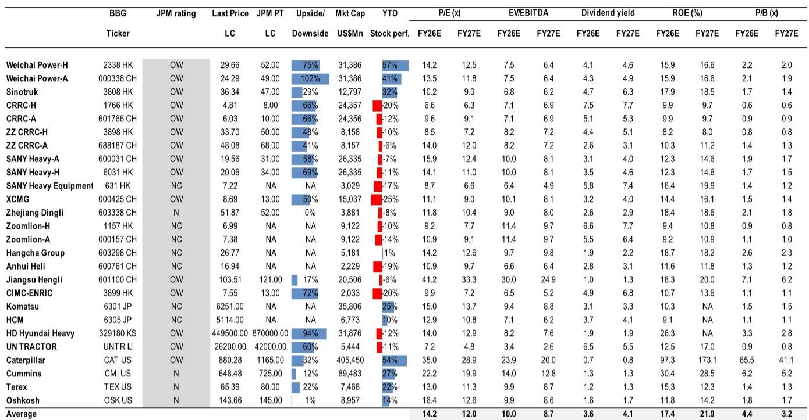
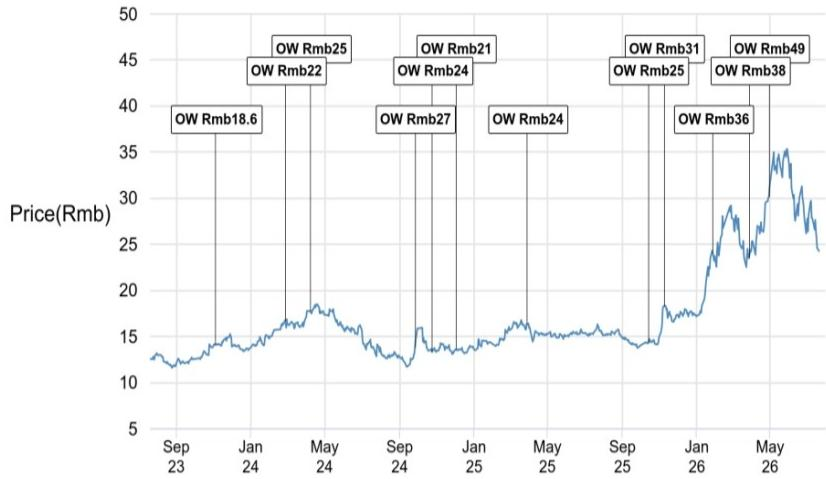

# 关于AIDC产能过剩的讨论为时过早：潍柴动力的执行力和市场地位在回调后值得关注

潍柴动力的报价从5月初的高点回调了约20-25%，同期表现落后于MSCI中国指数。这一回调源于两方面的市场关注：一是对2026年上半年交付可能不及预期的担忧，二是关于表后（BTM）电源解决方案周期是否面临产能过剩的讨论。然而，全球行业分析以及潍柴自身的执行轨迹均指向相反方向。与一位覆盖西门子的资深欧洲资本品分析师的交流进一步印证，产能过剩的担忧是2030年之后的问题，而非近期风险。与此同时，潍柴管理层确认其美国燃气发动机认证按计划推进，订单管道依然强劲，且随着产品组合向更高价值的燃气发动机转移，利润率正在改善。以约12倍2027财年预期收益和4%股息率计算，该公司的报价所反映的风险，恰恰是数据表明被夸大的那些。

此次回调的时间点值得注意，因为它恰逢潍柴战略进展加速而非恶化的时期。用于AIDC市场的2.5MW燃气发动机已于6月底正式推出，美国EPA认证正在进行中，预计8月完成。首批出货将紧随其后。公司已开始直接与美国主要数据中心客户接洽，并部署了包括直销和合作在内的灵活市场策略。这不是一家等待市场找上门来的公司，而是一家已做好准备，在美国持续供应紧张为有能力的供应商创造机会时，抓住增量需求的公司。母公司2026年上半年的业绩强化了这一信息：集团营收首次突破2000亿元人民币，同比增长22%，其中数据中心产品收入同比增长140%。这些数字并非来自面临需求饱和的企业。

## 全球AIDC周期被结构性低估，产能过剩担忧是情绪驱动的干扰

关于产能过剩讨论最深刻的视角并非来自针对中国的分析，而是来自对数据中心电力需求和供应动态的全球评估。认为BTM电力市场将走向供应过剩的观点，与基础数据不符。美国数据中心电力需求正以约22%的复合年增长率增长，供需缺口依然巨大。去年，约55GW的产能交付，对应约100GW的新订单。今年，新订单预计将达到110-120GW，而交付量约为64-65GW。订单积压正在扩大而非收缩，这一动态支撑了领先供应商的定价能力。真正产能过剩（即供应在现行价格下结构性超过需求）的风险，是2030年之后才需考虑的问题。未来几年，该周期将受需求约束，而非供应约束。

这一需求背后的结构性驱动力是数据中心架构的根本性转变。机架功率密度，历史上约为10kW，在目前的设计中已升至50kW，并且到本十年末，轨迹指向600kW或更高。这一转变造成了硬件瓶颈和急剧上升的电力需求，迫使超大规模企业重新思考资本支出规划和电力采购策略。美国数据中心电力容量的长期目标为320GW——相当于当前美国电力消耗的近三分之一——这支撑了电力设备多年的需求周期。欧洲设备公司已报告了强劲的数据中心相关订单势头，基本面表现超过了市场定价。当前像潍柴这样的公司报价回调，反映的是情绪重置，而非基本面转折。

## 潍柴AIDC执行进展顺利，燃气发动机推动利润率扩张，进入美国市场路径清晰

公司2026年AIDC出货指引为3500-4000台，管理层已重申这一轨迹。上半年交付符合预期，下半年将加速，并得到强劲订单管道的支持。柴油备用发动机短期内仍是销量支柱，但利润故事越来越多地围绕燃气发动机展开。燃气发动机的毛利率为40-50%，而柴油备用发动机为35-40%，并且它们已从领先的云客户那里获得了重要的2027年订单。2.5MW燃气发动机已成为主流数据中心解决方案，5.5MW型号计划从2027年起扩大规模。

进入美国市场正按计划进行。2.5MW燃气发动机于6月底推出，美国环保署的认证过程预计需要两到三个月。认证完成后，首批出货将开始。潍柴已开始直接与美国主要数据中心客户接洽，其灵活的市场策略——结合直销与合作——使公司能够在美国供应限制持续存在的情况下抓住增量需求。公司与Generac的整理版柴油合作伙伴关系支持了利润获取和售后市场变现，随着装机基数的增长，经常性服务收入有望成为利润池中更大的一部分。

产能扩张的步伐反映了管理层对需求可见性的信心。公司有望在2027年底前达到8000-10000台AIDC相关产能，并拥有可同时支持柴油和燃气产品的柔性生产线。SOFC产能也在提升，计划2026年达到30MW，2027年达到200MW，管理层表示如果市场需求允许，愿意加速投资。这种制造灵活性是一种竞争优势：它使潍柴能够快速响应客户需求和市场机会的变化，同时其以国内为主的供应链在成本和服务方面优于全球同行。

## 利润率故事由产品组合、规模和售后市场潜力驱动，而非周期性定价

潍柴研究案例中最被低估的要素之一是其利润率的轨迹。综合利润率正在改善，并非因为紧张市场中的周期性定价能力，而是因为产品组合在结构上向更高利润的燃气发动机转移，并且规模效应降低了单位成本。柴油备用发动机的毛利率维持在35-40%，而燃气发动机的毛利率为40-50%。随着燃气发动机在AIDC总收入中占比增大，综合利润率将继续上升。

SOFC在未来几年预计不会成为重要的利润贡献者，但技术路径是清晰的：管理层认为在100MW产量时达到盈亏平衡，规模化后毛利率潜力可达30-40%或更高。售后市场机会同样重要。管理层目标是服务及零部件占生命周期价值的20-30%，随着柴油和燃气发动机装机基数的增长，这一经常性收入流将成为利润池中更大、更可预测的部分。组合驱动的利润率扩张、规模效益和售后市场增长相结合，创造了一条比市场当前定价更持久的利润率轨迹。

母公司2026年上半年的业绩提供了额外证据，表明利润率纪律已融入组织。潍柴集团报告营收增长从2025年的14%加速至22%，所有主要运营指标均创历史新高。电力和能源收入同比增长30%，数据中心产品收入同比增长140%。发动机市场份额在核心领域均有所提升，出口组合改善，新能源业务正在获得动力。管理层重申了集团层面全年4000亿元人民币的营收目标。虽然上市实体与母公司之间的具体划分未披露，但潍柴动力的营收通常约占集团总额的65%，上市公司的盈利轨迹仍是整体集团表现的关键解读。

## 评估当前水平下潍柴的决策框架

对于权衡当前回调是机会还是价值陷阱的观察者而言，三个问题定义了分析框架。

首先，AIDC需求周期是否持久？来自全球供需数据、订单积压以及数据中心架构结构性转变的证据表明，答案是肯定的。美国数据中心电力需求以22%的复合年增长率增长，供应远落后于订单，产能过剩风险是2030年之后的问题。该周期由超大规模企业多年期的资本支出承诺驱动，而非投机性库存建设。这个问题的答案是肯定的。

其次，潍柴在该周期中是否处于有利位置？公司拥有清晰的产品路线图，柴油发动机支撑近期销量，燃气发动机推动利润率扩张。它有一条可信的进入美国市场的路径，认证正在进行，直接客户接洽已经开始。它拥有灵活的制造能力，到2027年底可扩展至8000-10000台。它拥有国内供应链带来的成本优势和产品组合带来的利润率优势。这个问题的答案也是肯定的。

第三，市场在当前水平定价了什么？以约12倍2027财年预期收益和4%股息率计算，该报价正在定价显著的增速放缓以及利润率压缩。市场隐含的预期是，AIDC出货量将大幅低于指引，利润率将回归均值，且美国市场准入将面临挑战。然而，这些假设中的每一个都与现有证据相矛盾。如果潍柴实现其指引，并且利润率继续改善，那么基于2027财年收益的15倍和18倍目标估值，分别对应约80%和75%的上行空间。这一上行空间得到以下因素的支持：比市场预期更具韧性的交付表现、结构性而非周期性的利润率纪律，以及远超当前周期的多年增长跑道。这个问题的答案是，市场正在定价一个数据不支持的情景。

2026年上半年业绩预览强化了这一框架。潍柴第二季度和上半年利润预计同比增长12-15%，得益于广泛的行业势头。上半年挖掘机销量同比增长26%，装载机销量增长27%，重型卡车销量增长21%。市场预期较为温和，存在业绩超预期的空间，尤其是在利润率方面。母公司的业绩已表明，基础业务比报价所反映的更为强劲。

此次回调在价格与基本面之间制造了脱节。关于产能过剩的讨论为时过早。执行进展顺利。利润率轨迹正在改善。估值具有吸引力。决策框架指向一个结论：对于能够透过短期噪音看到结构性增长故事的观察者而言，当前的入场点值得关注。

*仅供参考。部分内容可能基于源材料通过AI辅助生成、翻译、总结或编辑，可能存在遗漏或错误。请独立核实。本文不构成任何专业建议。*

仅供参考。部分内容可能基于源材料通过AI辅助生成、翻译、总结或编辑，可能存在遗漏或错误。请独立核实。本文不构成任何专业建议。

