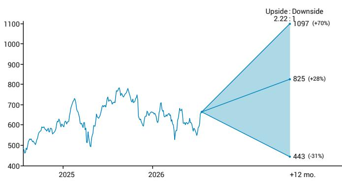
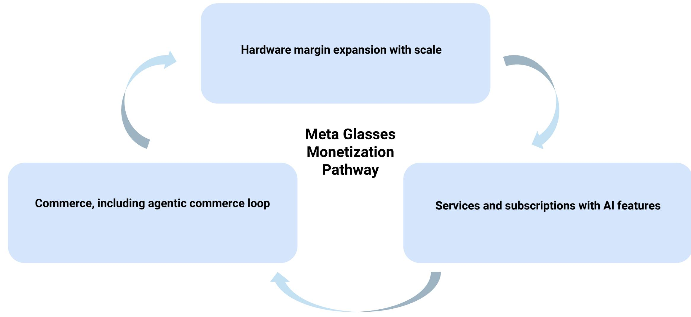
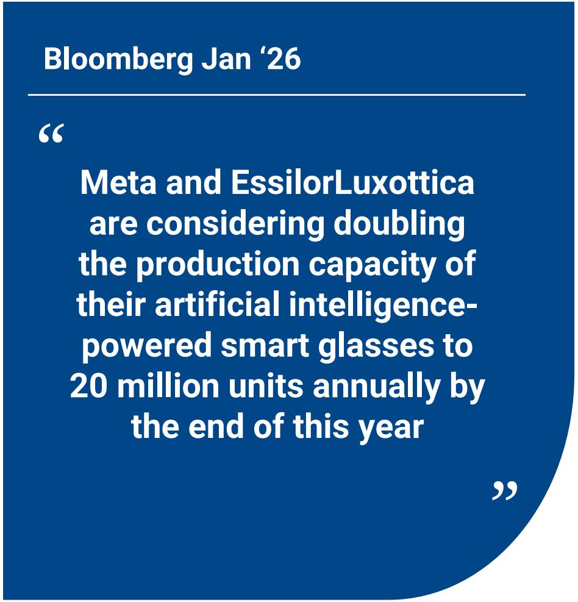
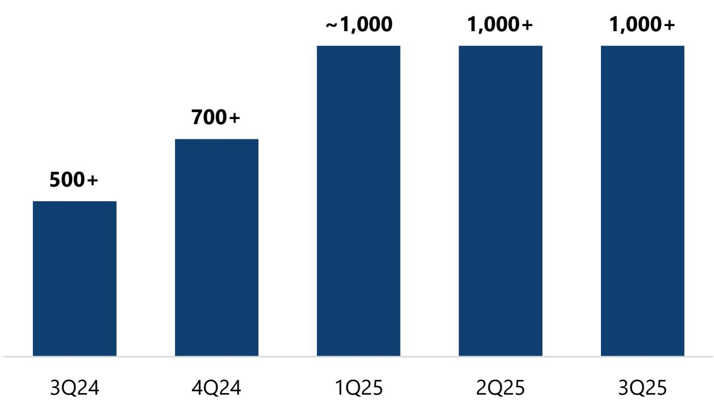
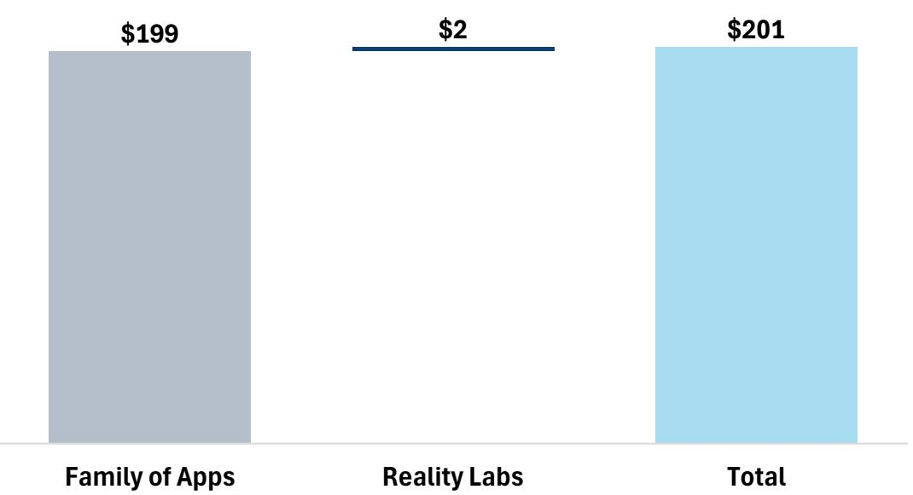
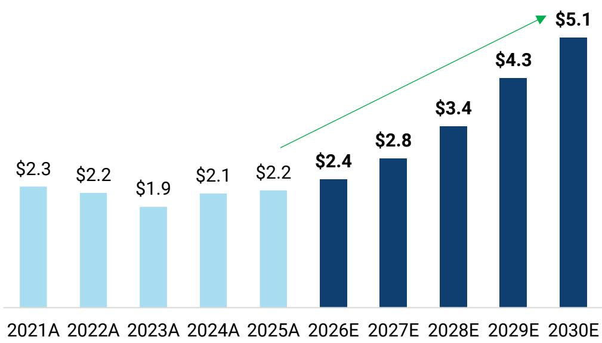

Source: JEF

## Vision Mini Dive: When AI Moves to the Face

Our team purchased and tested three different models of Meta's AI glasses and came away impressed. Camera quality, seamless setup, and a normal-glasses form factor stood out. While we see areas to improve, META has a first-mover advantage as the only player currently shipping at scale. Assuming Apple-watch-like adoption at an average selling price (ASP) of \$400, we estimate a \$14B-\$18B hardware revenue opportunity within the next few years, and see a long-term growth vector not yet reflected in current valuations.

What are Meta glasses? Meta's AI glasses are screen-light, voice-first wearables with an integrated camera and open-ear audio, all tied to the Meta AI app as the central console layer. They enable hands-free, voice-commanded AI assistance across daily tasks. We purchased 3 models: the Ray-Ban Meta Gen2 (\$379), the Oakley Meta (\$499), and the Ray-Ban Display with Neural Band (\$799). We put them to work across sports, communication, and productivity, and came away pleasantly surprised by how naturally they integrate into daily routines.

Our view. Our base-case scenario analysis implies a \~\$14B-\$18B hardware revenue opportunity (\~35-45M units at Apple Watch-like adoption), with additional upside from higher-value AI subscriptions, advertising, and commerce monetization over time. We believe the near-term impact centers on engagement and MAU expansion: Meta AI MAUs have reached \~1B, daily glasses users are tripling year-over-year, and 7M+ units sold in '25 with EssilorLuxottica reportedly doubling production capacity to 20M in '26. Longer term, the bigger prize is commerce: if agentic AI shifts from browsing to delegation, AI glasses could capture user intent at the point of discovery, moving Meta closer to the transaction.

Pros: 1) Camera quality is strong for a wearable, photos are easy to capture and sync seamlessly to your phone via the Meta AI app. 2) Open-ear audio is a standout, preserving situational awareness while delivering music, calls, and notifications without earbuds. Spotify integration is near-instant. 3) The form factor blends in: Oakley's sport-first design is comfortable during active use (skiing, golfing) and hard to realize they were AI-powered glasses. 4) Setup takes \~10 mins, the charging case is grab-and-go, and media sync is intuitive. 5) For outdoor sports, the glasses effectively replace the need for a GoPro, earbuds, and phone camera in a single device. The all-in-one utility is real, and critically, the product feels natural.

Cons: 1) Video quality still has room for improvement, and speaker volume doesn't get loud enough, with some distortion at higher levels. 2) The "Hey Meta" voice activation can be socially awkward in public and voice recognition is inconsistent at times. 3) Battery life is decent but not yet great for all-day heavy users. 4) Slight weight increase vs. normal sunglasses, and a real learning curve to integrating the glasses into daily habits. 5) EU launch delayed by supply constraints and regulatory hurdles around AI, always-on cameras, and privacy compliance. The product is still maturing for sustained, all-day mainstream use.

<table><tr><td>FY (Dec)</td><td>2024A</td><td>2025A</td><td>2026E</td><td>2027E</td></tr><tr><td>Rev. (MM)</td><td>164,500.0</td><td>200,965.0</td><td>252,509.0</td><td>300,384.0</td></tr><tr><td>Cons. Rev.</td><td>-</td><td>199,452.0</td><td>236,125.0</td><td>274,824.0</td></tr><tr><td>Cons. EPS-GAAP</td><td>-</td><td>23.09</td><td>29.59</td><td>33.25</td></tr><tr><td>EPS-GAAP</td><td>23.92</td><td>23.49</td><td>29.61</td><td>35.65</td></tr></table>

COMPANY UPDATE

<table><tr><td>RATING</td><td>BUY</td></tr><tr><td>PRICE</td><td>$646.01^</td></tr><tr><td>PRICE TARGET | % TO PT</td><td>$825.00 | +28%</td></tr><tr><td>52W HIGH-LOW</td><td>$796.25 - $520.26</td></tr><tr><td>FLOAT (%) | ADV MM (USD)</td><td>85.4% | 13,023.89</td></tr><tr><td>MARKET CAP</td><td>$1.7T</td></tr><tr><td>TICKER</td><td>META</td></tr></table>

^Prior trading day's closing price unless otherwise noted.

<table><tr><td>FY (Dec)</td><td colspan="2">CHANGE TO JEFe</td><td colspan="2">JEF vs CONS</td></tr><tr><td></td><td>2026</td><td>2027</td><td>2026</td><td>2027</td></tr><tr><td>REV</td><td>NA</td><td>NA</td><td>+7%</td><td>+9%</td></tr><tr><td>EPS</td><td>NA</td><td>NA</td><td>NA</td><td>NA</td></tr></table>

Chart 1 - Hypothetical Illustration: AI Glasses Could Be the Next Interface For Agentic Commerce  
  
Source: JEF

Exhibit 1 - META AI Glasses Are a Multi-Billion-Dollar Opportunity

<table><tr><td>Units (M) / ASP ($)</td><td>$300</td><td>$350</td><td>$400</td><td>$450</td><td>$500</td><td>$550</td><td>$600</td><td>$650</td></tr><tr><td>20M</td><td>$6.0</td><td>$7.0</td><td>$8.0</td><td>$9.0</td><td>$10.0</td><td>$11.0</td><td>$12.0</td><td>$13.0</td></tr><tr><td>25M</td><td>$7.5</td><td>$8.8</td><td>$10.0</td><td>$11.3</td><td>$12.5</td><td>$13.8</td><td>$15.0</td><td>$16.3</td></tr><tr><td>35M</td><td>$10.5</td><td>$12.3</td><td>$14.0</td><td>$15.8</td><td>$17.5</td><td>$19.3</td><td>$21.0</td><td>$22.8</td></tr><tr><td>45M</td><td>$13.5</td><td>$15.8</td><td>$18.0</td><td>$20.3</td><td>$22.5</td><td>$24.8</td><td>$27.0</td><td>$29.3</td></tr><tr><td>55M</td><td>$16.5</td><td>$19.3</td><td>$22.0</td><td>$24.8</td><td>$27.5</td><td>$30.3</td><td>$33.0</td><td>$35.8</td></tr><tr><td>65M</td><td>$19.5</td><td>$22.8</td><td>$26.0</td><td>$29.3</td><td>$32.5</td><td>$35.8</td><td>$39.0</td><td>$42.3</td></tr><tr><td>75M</td><td>$22.5</td><td>$26.3</td><td>$30.0</td><td>$33.8</td><td>$37.5</td><td>$41.3</td><td>$45.0</td><td>$48.8</td></tr><tr><td>85M</td><td>$25.5</td><td>$29.8</td><td>$34.0</td><td>$38.3</td><td>$42.5</td><td>$46.8</td><td>$51.0</td><td>$55.3</td></tr></table>

ASP= Average selling price

Brent Thill \* | Equity Analyst  
+1 (415) 229-1559 | bthill@JEF.com  
James Heaney \* | Equity Analyst  
+1 (212) 336-1171 | jheaney@JEF.com  
Maximilian Joseph \* | Equity Associate  
+1 (212) 778-8926 | mjoseph1@JEF.com  
ShengQi Lin \* | Equity Associate  
+1 (212) 778-8504 | slin4@JEF.com

## The Long View: Meta Platforms

## Investment Thesis

\- META connects 3.5B+ people around the world to 10MM+ advertisers with best-in-class data and targeting capabilities delivering high-quality and relevant advertising to a loyal user base.

\- META will continue to innovate on the advertising front, driving higher monetization across its various platforms.

\- High-ROI eCommerce advertising products on Facebook and Instagram increase ad spend across the platform.

\- New AI products could drive improved performance for advertisers.

Risk/Reward - 12 Month View  

## Base Case, \$825, +28%

\- New ad dollars are pouring into mobile ad campaigns, and META is the primary beneficiary of that trend

\- Deep engagement at Instagram, Messenger, and WhatsApp suggests robust growth going forward as monetization ramps

• Facebook Reality Labs investments will be heavy and should weigh on near-term profit margins

• 2027E EPS: \$35.65; Target Multiple: \~23x; PT \$825

## Upside Scenario, \$1097, +70%

\- Leadership in virtual reality and the Metaverse position META well for the next decade of growth

\- Messenger, and WhatsApp monetization occurs faster than expected

\- Instagram's new features (ex: IG Reels) make the service stickier and drive new ad units and additional ad budgets

\- Deepening ties to eCommerce and bottom-funnel ads

• 2027E EPS: \$42.18; Target Multiple: \~26x; PT \$1,097

## Downside Scenario, \$443, -31%

\- Expenses ramp faster than expected due to AI Metaverse investments

\- Ad-targeting headwinds due to regulation (i.e. GDPR, CCPA) and platform changes (Google Chrome, iOS)

\- Users churn off to other social services

• 2027E EPS: \$26.84; Target Multiple: \~17x; PT \$443

## Sustainability Matters

Top Material Issue(s): 1) Customer Privacy: Risk management for personal information they are in possession of. This is a top issue for social media companies like META, which collect and rely on user data to provide targeted advertisements. 2) Data Security: Risks associated with collection, use, retention, and disposal of confidential information. Internet companies like META have amassed large amounts of user data which could be used in harmful ways if exposed.

Company Target(s): 1) Net-zero emissions across value chain and becoming water positive by 2030. 2) 50% reduction in carbon impact of workplace operations by '30 on a per-headcount basis from a 2019 base year. 3) Increasing the representation of all people of color in leadership positions in the US by 30% by '25.

Qs to Mgmt: 1) What is META doing to ensure it meets its 2030 goal of net-zero emissions while pursuing its AI initiatives? 2) What types of user data does META collect and use to provide targeted advertisements? 3) What processes does META have to protect its users' data?

## Catalysts

\- High-ROI eCommerce ad products scale across the platform

\- WhatsApp/Messenger monetization

\- Reels becomes a more material revenue driver

\- Announcement around Metaverse investments

Link to Sector Note: ESG Sector Deep Dive: Internet Media & Services

## JEF

Internet / AI

## META Vision Mini Dive: When AI Moves to the Face

Brent Thill

415.229.1559

bthill@JEF.com

JULY 2026

## Meta AI Glasses Signal a New Consumer AI Surface

## 1

## Meta AI glasses are emerging as the first scaled, screen-light AI interface

\- Screen-light, voice-first AI glasses with camera and audio tied with Meta AI as the central console layer

\- Early use cases based on our experiences have proven to be frictionless

## Pros: High-quality camera and audio enable daily use with low social friction

## 2

\- All-in-one, low-friction utility combines camera, open-ear audio, and voice into a single wearable

\- Comfortable, socially acceptable design enables repeat use, especially in active, hands-busy moments

\- Fast setup and seamless phone sync reduce time-to-value, increasing the likelihood of repeat use early in the adoption curve

## 3

## Areas of improvement: Still maturing for all-day use

• Video, speakers, and battery life remain good-enough but not yet all-day, which can limit extended use cases

• Voice activation and learning curve introduce some friction, and may slow the transition from novelty to habit for some users

\- Potential privacy and regulatory overhang in international markets

## Our view: Pleasantly surprised, Meta AI glasses represent a long-dated growth vector not yet priced in

## 4

• We believe Meta has the first-mover advantage as the only player shipping AI glasses at scale today vs. peer products still underway

\- Near-term impact remains in engagement and MAU, but we see multiple monetization pathways across hardware, services, & commerce in the long term

\- Our base case scenario implies that AI glasses could be worth \~\$14-18B in revenue opportunity, assuming Apple-watch-like adoption

## SECTION I What Are Meta's AI Glasses

## Zuck Believes AI Glasses Are the Next Cognitive Advantage

I mean I personally think that just like I wear contact lenses, I feel like if I didn't have my vision corrected, I'd be sort of at a cognitive disadvantage going through the world. And I think in the future, if you don't have glasses that have AI or some way to interact with AI, I think you're kind of similar probably be at a pretty significant cognitive disadvantage compared to other people who you're working with or competing against.

Mark Zuckerberg, 2Q25 Earnings Call

## Meta Is Expanding Its AI Glasses Lineup Across Brands and Price Tiers

The new Meta-branded models open the category at a lower price point, widening access and driving higher unit growth.

<table><tr><td>Model</td><td>Brand</td><td>Segment</td><td>Status</td><td>Starting Price (USD)</td></tr><tr><td>Adventurer</td><td>Meta</td><td>Entry-level AI</td><td>New – Jun 2026</td><td>$299</td></tr><tr><td>Fury</td><td>Meta</td><td>Entry-level AI</td><td>New – Jun 2026</td><td>$299</td></tr><tr><td>Starfire</td><td>Meta</td><td>Fashion (Kylie Jenner)</td><td>New – Jun 2026</td><td>$399</td></tr><tr><td>Ray-Ban Meta (Gen 2)</td><td>Ray-Ban</td><td>Core AI flagship</td><td>Available</td><td>$379</td></tr><tr><td>Oakley Meta HSTN</td><td>Oakley</td><td>Sport / performance</td><td>Available</td><td>$399</td></tr><tr><td>Oakley Meta Vanguard</td><td>Oakley</td><td>Sport / performance</td><td>Available</td><td>$499</td></tr><tr><td>Ray-Ban Meta Neural Display</td><td>Ray-Ban</td><td>Premium, in-lens display</td><td>Available</td><td>$799</td></tr></table>

## With the Meta AI App Unifying Device Control Across a Growing AI Ecosystem

• Device set up + pairing hub. The app is the primary way to pair and manage Meta glasses, including onboarding and device management

• Media sync & app integration. Imports and offloads photos & videos captured on the glasses to the phone, and supports sharing workflows. Can be connected to various other apps (e.g. Spotify)

\- Conversation continuity. Keeps track of all started conversations, including those started with the glasses, from the app's history area

Meta AI app is the single hub for 1) glasses device management + media pipeline and 2) Meta AI assistant experiences (history/discover/creation), tightening ecosystem lock-in

## Meta Is Currently Leading the Pack in the AI/Smart Glasses Market

Meta's AI/Smart Glasses Competitors

<table><tr><td>Snapchat</td><td>Google</td><td>Apple</td></tr><tr><td>Product name: SPECS AR GlassesUse cases: AR experiences, spatial utility, and AI AssistanceFeatures:More compute-heavyWeigh more than Meta’s glassesPricing: $2,195 (expected to ship in fall)</td><td>Product name: Android XR Intelligent EyewearUse cases: Navigation/translation; real-time/world context powered by Gemini AI assistantFeatures (two types):#1 Audio only#2 Display-equipped glasses planned after audio-only versionPricing: TBD (expected Fall 2026 launch)Partnerships: Warby Parker and Gentle Monster</td><td>Product name: N50 (codename)Use cases: everyday activitiesFeatures:Expected Siri-powered voice interactionsVisual intelligencePricing: TBD (&#x27;27 expected launch)</td></tr></table>

## We See A Multi-Billion Dollar Hardware Revenue Opportunity...

META AI Glasses Revenue Opportunity Scenario Analysis (in \$B)

<table><tr><td>Units (M) \ ASP ($)</td><td>$300</td><td>$350</td><td>$400</td><td>$450</td><td>$500</td><td>$550</td><td>$600</td><td>$650</td></tr><tr><td>20M</td><td>$6.0</td><td>$7.0</td><td>$8.0</td><td>$9.0</td><td>$10.0</td><td>$11.0</td><td>$12.0</td><td>$13.0</td></tr><tr><td>25M</td><td>$7.5</td><td>$8.8</td><td>$10.0</td><td>$11.3</td><td>$12.5</td><td>$13.8</td><td>$15.0</td><td>$16.3</td></tr><tr><td>35M</td><td>$10.5</td><td>$12.3</td><td>$14.0</td><td>$15.8</td><td>$17.5</td><td>$19.3</td><td>$21.0</td><td>$22.8</td></tr><tr><td>45M</td><td>$13.5</td><td>$15.8</td><td>$18.0</td><td>$20.3</td><td>$22.5</td><td>$24.8</td><td>$27.0</td><td>$29.3</td></tr><tr><td>55M</td><td>$16.5</td><td>$19.3</td><td>$22.0</td><td>$24.8</td><td>$27.5</td><td>$30.3</td><td>$33.0</td><td>$35.8</td></tr><tr><td>65M</td><td>$19.5</td><td>$22.8</td><td>$26.0</td><td>$29.3</td><td>$32.5</td><td>$35.8</td><td>$39.0</td><td>$42.3</td></tr><tr><td>75M</td><td>$22.5</td><td>$26.3</td><td>$30.0</td><td>$33.8</td><td>$37.5</td><td>$41.3</td><td>$45.0</td><td>$48.8</td></tr><tr><td>85M</td><td>$25.5</td><td>$29.8</td><td>$34.0</td><td>$38.3</td><td>$42.5</td><td>$46.8</td><td>$51.0</td><td>$55.3</td></tr></table>

## Bear Case

\- Not a must-have / proper form factor. AI glasses don't break out of niche; utility doesn't justify the friction so adoption stays limited.

• Economics pressured by competition. Apple and others enter aggressively, forcing subsidies and compressing hardware ASPs and margins.

\- Sub-Apple-Watch trajectory. Annual units settle below the Apple Watch curve; revenue contribution stays modest.

## Base Case

\- Adoption in line with Apple Watch. Glasses become a useful companion device, running \~35-45M units per year or \~\$14B to \$18B+ in hardware revenue opportunity.

• Real but bounded franchise. Hardware revenue scales steadily; Meta builds a durable wearable business without redefining the category.

\- Apple Watch as the comp. Units, ASP, and attach rate track the watch playbook rather than the smartphone one.

## Bull Case

\- More persuasive than Apple Watch. Form factor and AI use cases drive faster, deeper consumer pull than the wrist wearable did.

\- \~30% penetration of the iPhone install base. Implies \~75M units annually, a step-change above Apple Watch run-rate.

\- Platform ownership, not just hardware. Glasses become Meta's AI engagement layer and a strategic successor to the smartphone interface.

## ... With Additional Long-Term Upside From Premium Subscriptions, Advertising, & Commerce

## SECTION II What We Learned From 5 Months of Usage

## Use Case #1: Sports (Oakley)

## With Oakley's sport-first design, the product is already demonstrating potential as an all-in-one replacement

## In-Action

## • Skiing

\- Hands-free photos/video

\- Apps integration - Spotify playback

\- Ambient awareness without earbuds, and voice control even with gloves, enabling users to ditch the GoPro, and earbuds.

## Why it's a hero

• Job-to-be-done: capture + listen + call without pulling phone

\- Feature proof: camera + open-ear audio + voice controls + easy sync

\- Why sticky: convenience + unique angle + “doesn’t look techy” (blends in)

## Use Case #2: Communication

## Seamless, hands-free communication in real time that feels natural

## In-Action

## • Voice-activated messaging and calls via Meta AI

\- Users can place calls and send/respond messages/calls using voice, keeping hands and eyes free

\- Incoming calls and notifications are read aloud

\- Audio-first design can assist users who prefer, or rely on, voice interaction over visual interfaces

\- Useful for multitasking, when phone access is limited

## Why it's a hero

## • Turns AI glasses into a daily communication surface

• Voice-only interaction enables faster, simpler communication in the moment

## - Broadens the addressable user base

• Voice-first design benefits users in hands-busy scenarios and those who prefer audio interaction

## Use Case #3: Productivity (Emerging)

## Glasses enable AI grounded in physical context

## In-Action

• Identifying an object, location, or sign and getting instant context

• Real-time translation or explanation of what the user is seeing

\- Step-by-step guidance while hands are occupied (navigation, setup, instructions)

\- Lightweight “what should I do next?” prompts in motion (travel, errands, on-site tasks)

## Why it's a hero

\- Introduces a new AI interaction surface beyond chat and feeds

\- Lays groundwork for agentic behavior (e.g. observe an object, decide on action items, assist in execution through voice command)

\- Increases daily touchpoints with Meta AI without requiring deliberate engagement

## Pros: High Quality Camera & Audio for Daily Use With Low Social Friction Supports Future Adoption Growth

<table><tr><td>1. Camera Quality</td><td>• Photos are good quality and easy to capture</td></tr><tr><td>2. Audio</td><td>• Open-ear listening preserves situational awareness, so you can enjoy music while still engaging with people• All-in-one utility: music + camera/video in one device reduces the need for separate earbuds + phone use</td></tr><tr><td>3. Ergonomic / Comfort</td><td>• Oakley form factor is “good” and not awkward/heavy, even during active use• Looks like normal sunglasses (low social friction); Perceived build/optical quality is strong, “better than some competing glasses,” and would buy them as normal outdoor sunglasses</td></tr><tr><td>4. Onboarding / Setup</td><td>• Setup is quick (10 minutes) and straightforward• Charging case is easy, making the product more “grab-and-go”• Photo/video sync to phone is very seamless and intuitive</td></tr></table>

## Cons: Performance Gaps With Video, Speakers, & Battery Life

<table><tr><td>1. Video Quality</td><td>Video still has room for improvement</td></tr><tr><td>2. Meta Callouts</td><td>“Hey Meta” callouts can be socially awkward in public</td></tr><tr><td>3. Speaker Volume</td><td>Speakers don’t get loud enough (don’t go to 11)Some distortion at higher volumes</td></tr><tr><td>4. Weight Increase</td><td>Slight weight increase vs normal sunglasses (even if not super noticeable) may matter for some all-day wearers</td></tr><tr><td>5. Battery Life</td><td>Decent, but not amazing; not yet a “day-long no-worries” story for heavy usage</td></tr><tr><td>6. Learning Curve</td><td>There is a learning curve to get comfortable and integrate into daily habitsVoice recognition/activation is inconsistent at times</td></tr></table>

## Ray-Ban Display + Neural Band: Early But Promising

Product remains early and somewhat finicky, but the long-term potential for AI-native wearables as a cognitive interface is clear

Signs of Promise

<table><tr><td>1. Cognitive Advantage</td><td>Certain prompts showed glimpses of real “cognitive advantage” as AI models and hardware improveOver the next 3-5 years, continued improvements could shift the product from novelty to daily workflow tool</td></tr><tr><td>2. Enterprise Use Cases</td><td>Promising applications: learning at work, real-time prompting, teleprompter, meeting assistance, contextual searchAbility to capture and harness human-to-human context over time</td></tr><tr><td>3. User Reception</td><td>More positive than prior VR demos; Meta may be moving closer to a mainstream-resonant form factorConsensus: impressive and fun, but not yet useful enough for daily reliance across age groups</td></tr></table>

<table><tr><td colspan="2">Current Limitations</td></tr><tr><td>1. Hardware / Comfort</td><td>• Glasses felt more flimsy and less comfortable than other pairs tested• Neural Band not always seamless; band + glasses pairing still somewhat finicky</td></tr><tr><td>2. Display / Battery</td><td>• AR display useful at times but can become distracting; needs context-aware activation (appear only when needed)• Battery life ~5/10; remains a key limitation for extended daily use</td></tr><tr><td>3. Cost / Adoption</td><td>• Cost difficult to justify in current form; meaningful learning curve for most users• Some use cases may require broader societal acceptance around always-on cameras and AI in live interactions</td></tr></table>

Our view: Not yet a necessity, but a tangible glimpse into how AI-native wearables could evolve. The direction of travel is compelling, if Meta continues improving hardware and pairs it with stronger AI models, glasses could become a meaningful cognitive interface over time.

## SECTION III Implications for META

## Early Commentary Suggests Rising Momentum

"Demand is still outpacing our ability to build them, but I'm hopeful that we'll be able to meet that demand soon"

"Ray-Ban Meta AI glasses have tripled in sales in the last year. The people who have them are using them a lot"

"Meta's 2025 AI glasses lineup has seen strong early demand, with Ray-Ban and Oakley models selling well on improved battery, cameras, and AI features, while the new display glasses sold out within 48 hours"

"Our AI glasses continue to perform well with the number of people using them daily tripling year-over-year. This continues to be one of the fastest-growing categories of consumer electronics ever"

2Q24

3Q24

1Q25

"Demand for the glasses continues to be very strong. The new Clear edition that we released at Connect sold out almost immediately and has been trading online for over \$1,000"

2Q25

3Q25

"Ray-Ban Meta glasses are seeing accelerating sales, with upcoming Oakley Meta HSTNs adding longer battery life and improved cameras, while Meta AI usage and retention continue to rise"

4Q25

"Sales of our glasses more than tripled last year, and we think that they're some of the fastest-growing consumer electronics in history"

1Q26

Just to give you an idea, and I think this is an interesting data point, if we just look at the Ray-Ban Meta, which is obviously the most important product that we have, when we look at the revenue of the Ray-Ban Meta, the penetration of Rx is in excess of 30% already.

CEO of EssilorLuxottica 1Q26

In 2025, we sold more than 7 million units of AI-glasses, posting exponential growth, driven by the strength of our iconic brands, Ray-Ban and Oakley, across all geographies and channels

CEO of EssilorLuxottica 4Q25

## Partner Echoes the Demand Signal, Considering Doubling Capacity to Meet It

Bloomberg Jan '26

Meta and EssilorLuxottica are considering doubling the production capacity of their artificial intelligence-powered smart glasses to 20 million units annually by the end of this year

Relationship between EssilorLuxottica and Meta...I can't get into the detail of that exclusivity, but it's a very successful collaboration between two companies

The other thing that you have to bear in mind with respect to our own retail is that, typically, the space that it's made available in our own stores for 3P brands, it's anywhere between 5% to 10%. So, remember, if there is something entering into that space, there is something else that is going to go out

## CFO of EssilorLuxottica 1Q26

## We Believe AI Glasses Introduce a Potential New MAU Growth Vector

META AI MAU (Monthly Active Users) in Millions

## AI Glasses Reframe the Reality Labs Narrative

While Reality Labs revenue remains metaverse-led today, AI glasses introduce a new, more scalable distribution vector. Glasses shift Reality Labs from a hardware-heavy immersion bet toward daily-use AI engagement bet

I expect Reality Labs losses this year to be similar to last year, and this will likely be the peak as we start to gradually reduce our losses going forward while continuing to execute on our vision - Mark Zuckerberg, 4Q25 Earnings Call

META CY25 Revenue (\$B)  
  
Reality Labs Total FY Revenue (\$B)

  
Source: JEF, Company Data, Visible Alpha

## Meta One Launch Signals the Subscription Lever Is Now Live

Meta is quietly rolling out Meta One, its first consumer subscription across apps and glasses, marking a meaningful step toward turning the services monetization opportunity from thesis to reality

∞

Meta One
SUBSCRIPTION

## What Launched

\- Meta One / Meta One Premium now gradually rolling out across Instagram, Facebook, and WhatsApp

\- Premium plan unlocks expanded AI access, Conversation Focus, and premium device support on AI glasses

## Why It Matters

\- First tangible evidence that Meta is beginning to monetize consumer AI services through subscriptions

• Recurring revenue layered on top of hardware has the potential to improve LTV and deepen ecosystem lock-in

\- Ties premium AI features to daily glasses usage, reinforcing engagement and retention

## What We're Watching

\- Pricing, tiering, and attach rate as rollout broadens beyond early markets

\- Whether premium AI features drive measurable MAU and retention uplift

\- Read-through to ARPU as subscription scales across the installed base

## AI Glasses Could Be the Next Interface That Powers Agentic Commerce

If agentic commerce shifts from browsing to delegation, AI glasses could move Meta closer to the point of transaction, not just influence. While early, we view Meta AI glasses to be an additional beneficiary with the rise of agentic commerce.

Hypothetical Illustration  
  
"Hey Meta, I like that shirt—where can I get it?"

\- Always-on, real-world context. Glasses capture visual, spatial, and situational signals, critical inputs for agents to act, not just respond

\- Clear user intent. Person physically looking at the product

\- Natural voice interaction. "Hey Meta..." anchored to glasses use and delegates the task, search, compare, buy, without breaking flow; seamless action layer

\- Agentic action shown. Product ID > availability > order placed

• End-state. transaction completed, not just discovery

## What We See: The Path to an Always-On AI Companion

Meta AI glasses represent the next interface shift—embedding AI seamlessly into daily life through context, vision, and voice.

## Health & Coaching

• Real-time guidance during workouts, mental coaching, and relaxation tailored to the moment

## Lifestyle & Learning

• Interactive cooking, on-the-fly instruction, and ambient assistance without screens

## Productivity

\- Hands-free task management and digital assistance while multitasking

## Commerce

• See-to-buy experiences: identify products in the real world and instantly purchase via AI

## Always- Available Assistant

\- “Hey Meta” becomes a continuous companion, not a discrete app interaction

## Smart Glasses Remain a Global Platform Opportunity
