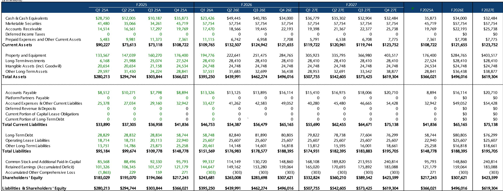
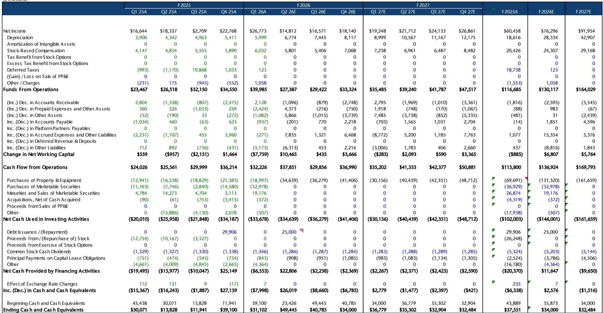
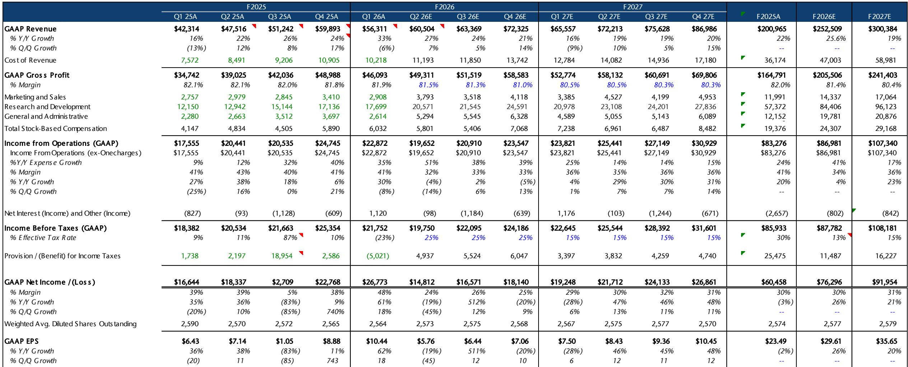

# JEF：MetaAI眼镜硬件与AI及近期数据观察

JEF的分析师团队在自购并实际佩戴三款Meta AI眼镜五个月后，给出了一个明确的判断：这款产品正在成为第一个规模化出货的、屏幕轻量化的AI交互界面。报告认为，Meta在这一品类中拥有先发优势，而市场尚未将这一长期增长变量纳入定价。

分析师以Apple Watch的采用曲线作为参照，假设平均售价400美元，推算出Meta AI眼镜在未来几年内可创造约140亿至180亿美元的硬件收入机会。这个数字尚未计入更高价值的AI订阅、广告和电商变现。报告特别指出，如果代理型AI从“浏览”转向“委托”，AI眼镜可能在用户发现需求的瞬间捕获意图，将Meta推得更靠近交易环节。

## 1. 产品体验：相机与开放式音频成为日常使用的核心支撑

JEF团队购买了Ray-Ban Meta Gen2（379美元）、Oakley Meta（499美元）和带神经环带的Ray-Ban Display（799美元）三款产品，在运动、通讯和生产力场景中进行了实测。

报告认为，相机质量在可穿戴设备中表现突出，照片拍摄和同步到手机的过程流畅。开放式音频是另一个亮点——用户可以在不佩戴耳塞的情况下保持对环境的感知，同时收听音乐、通话和通知。Spotify的集成几乎是即时的。在户外运动场景中，这副眼镜可以替代GoPro、耳塞和手机相机，实现单一设备的多功能整合。

外形设计是团队反复强调的优势。Oakley的运动款在滑雪、高尔夫等场景中佩戴舒适，且外观与普通运动眼镜无异，不易被识别为AI设备。整个设置过程大约需要10分钟，充电盒即取即用。

> **KC评论：** 这里的关键不是硬件参数本身，而是“低社交摩擦”这个条件。过去几年智能眼镜未能普及，核心障碍不是技术，而是佩戴者在公共场合的违和感。Meta通过Ray-Ban和Oakley的品牌授权，实际上绕过了这个心理门槛。报告没有明说，但这一策略可能是Meta相比苹果和谷歌最大的隐性壁垒。

## 2. 仍需改进的环节：视频质量与全天候使用体验

报告也坦诚列出了当前产品的不足。视频质量仍有提升空间，扬声器音量不够大，在较高音量下会出现失真。“Hey Meta”语音唤醒在公共场合可能带来社交尴尬，语音识别的稳定性也不一致。电池续航对全天重度用户来说尚不够用。

此外，产品重量相比普通太阳镜略有增加，用户需要一定学习曲线才能将眼镜融入日常习惯。欧盟市场的推出因供应链限制和AI监管、常开摄像头及隐私合规问题而延迟。报告认为，这款产品仍在走向全天候主流使用的成熟过程中。

## 3. 收入机会的测算逻辑与三种情景

JEF的测算基于一个核心参照系：Apple Watch的采用曲线。在基准情景下，AI眼镜的年销量可达3500万至4500万副，对应140亿至180亿美元的硬件收入。这个数字来自一个8x8的敏感性矩阵，覆盖2000万至8500万台的出货区间和300至650美元的售价区间。

报告同时给出了三种情景。悲观情景下，AI眼镜未能突破小众定位，年销量低于Apple Watch曲线，收入贡献有限。基准情景下，眼镜成为有用的伴侣设备，硬件收入稳步增长，但不会重新定义品类。乐观情景下，AI眼镜的形态和用例比Apple Watch更具说服力，达到iPhone用户基数约30%的渗透率，对应约7500万台的年出货量。

> **KC评论：** 选择Apple Watch作为参照系是一个值得注意的框架选择。Apple Watch用了近十年才达到年出货量约3000万至4000万台的规模。Meta AI眼镜在2025年已售出超过700万台，且EssilorLuxottica计划在2026年将产能弹性较高至2000万台。如果这个增速持续，基准情景的假设可能偏保守。但报告没有展开的是：Apple Watch的换机周期和眼镜完全不同，后者作为时尚配件的更新频率可能更快，也可能更慢。

## 4. 长期价值不在硬件，而在意图捕获

报告将长期价值锚定在电商变现上。如果代理型AI从用户主动搜索转向系统代为决策，AI眼镜作为“发现时刻”的入口，其战略意义将远超硬件本身。Meta AI的月活跃用户已接近10亿，眼镜用户的日活跃量同比增长两倍。这些数字指向一个方向：Meta正在将AI眼镜定位为下一个用户交互层，而非单纯的硬件业务。

当前竞争格局中，Snap的AR眼镜定价2195美元，预计2026年秋季发货；Google的Android XR智能眼镜计划2026年秋季推出，先做音频版，再推带显示器的版本；苹果的N50项目预计2027年推出。Meta是目前相对少见一个以规模化出货的玩家。

For informational purposes only. Portions may be generated,translated,summarized,or edited with AI assistance based on source materials and may contain omissions or errors. Please verify independently. This is not investment,legal,tax,accounting,or other professional advice.

For informational purposes only. Portions may be generated,translated,summarized,or edited with AI assistance based on source materials and may contain omissions or errors. Please verify independently. This is not investment,legal,tax,accounting,or other professional advice.

