# Global | Washington Strategy

July 20, 2026

## China's Tech Leadership: Our 10 Best Charts

Kimi K3 sharpens focus on China's tech rise, a theme we've flagged since 2025 (here, here & here). This note shares our 10 best charts. Key themes: 1) 9 of top 10 research institutions Chinese; 2) ~47% of top papers vs. US ~9%; 3) R&D passed US; 4) #1 in patents; 5) DeepSeek tops OpenRouter; 6) import reliance falling; 7) leads defense tech; 8) ~12x US clean tech capex; 9) near-peer in AI, biotech, semis, space, quantum; 10) #2 gov't space spender.

We view Chinese tech disruption as structural, not cyclical. Telecoms, autos, and AI mark early innings. We encourage observers to assess the impact on Western equities and consider direct China tech exposure.

1) China Leads the World's Highest-Impact Research Institutions. The Nature Index 2026 ranks nine Chinese institutions in the global top 10, with CAS at #1 and Zhejiang University displacing Harvard as the top academic institution.

Nature Index: 2026 Research Leaders

<table><tr><td>Position</td><td>Institution</td><td>Country</td></tr><tr><td>1</td><td>Chinese Academy of Sciences (CAS)</td><td>China</td></tr><tr><td>2</td><td>Zhejiang University (ZJU)</td><td>China</td></tr><tr><td>3</td><td>Harvard University</td><td>US</td></tr><tr><td>4</td><td>Tsinghua University</td><td>China</td></tr><tr><td>5</td><td>Shanghai Jiao Tong University (SJTU)</td><td>China</td></tr><tr><td>6</td><td>University of Science and Technology of China (USTC)</td><td>China</td></tr><tr><td>7</td><td>Peking University (China)</td><td>China</td></tr><tr><td>8</td><td>University of Chinese Academy of Sciences (UCAS)</td><td>China</td></tr><tr><td>9</td><td>Nanjing University (NJU)</td><td>China</td></tr><tr><td>10</td><td>Sichuan University (SCU)</td><td>China</td></tr></table>

Source: The Nature Index; JEF.

2) China Has Overtaken the U.S. in High-Impact Research Across Critical Technologies. ASPI's Critical Technology Tracker shows China's share of top-10% most-cited publications rose from ~5% in 2005 to ~47% in 2025, while the U.S. share fell from ~40% to ~9%.

Publication rates for top 10% of publications (Percent)

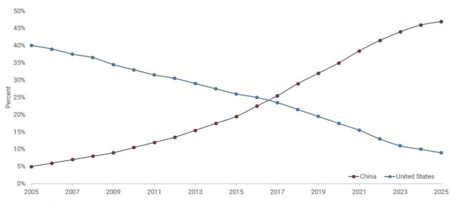  
Source: Australian Strategic Policy Institute

Aniket Shah, PhD \* | Head of Sust. & Transition Strategy
+1 (212) 323-3976 | ashah14@JEF.com
Yujin Kim \* | Sust. & Transition Strategy Associate
+1 (212) 778-8314 | ykim4@JEF.com
Luke Sussams ^ | Sust. & Transition Strategist
44 (0)20 7548 4404 | lsussams@JEF.com
Charles Boakye, CFA \* | Sust. & Transition Strategist
+1 (212) 336-6649 | cboakye@JEF.com
Jacqueline Murdock ^ | Sust. & Transition Strategy Associate
+44 (0)20 7548 4165 | jmurdock@JEF.com
Amani Mahmood ^ | Sust. & Transition Strategy Associate
+44 (0)20 7548 5332 | amahmood@JEF.com
Ana Zotovic ‡ | Sust. & Transition Strategy Associate
+1 (416) 847 7399 | azotovic@JEF.com

3) China Has Overtaken the U.S. in Gross R&D Spending on a PPP Basis. ITIF estimates China's PPP-adjusted R&D expenditure reached ~$1030bn in 2024, edging past the U.S. at ~$1010bn. China's real R&D spending has grown >12% annually since 2004-over 3x the U.S. pace.

Gross R&D expenditure, PPP-adjusted ($bn)

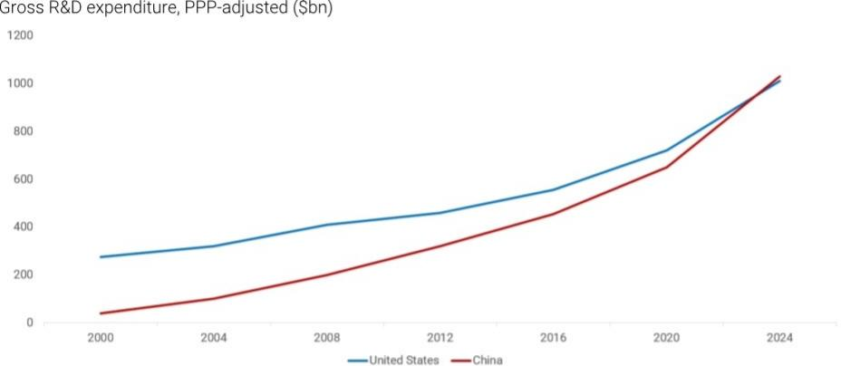  
Source: OECD, Information Technology and Innovation Foundation.

4) China Files More Patents Than the Rest of the Top 10 Combined. WIPO data show China filed 1.80 million patent applications in 2024–3.6x the U.S. (503K), 4.3x Japan (421K), and more than the next nine countries combined.

Number of Patent Applications, 2024

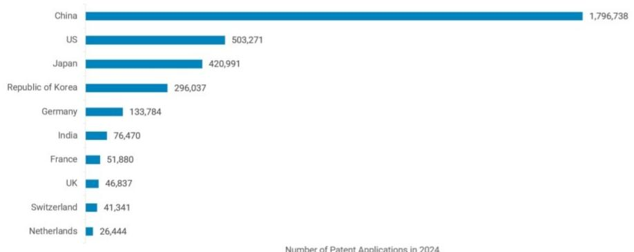  
Source: World Intellectual Property Organization  
Number of Patent Applications in 2024

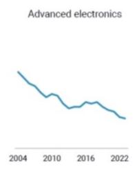  
Normalized Token Usage, May 2025 – July 2026  
Share of Key Sectors Where China Imports Twice as Much as It Exports (Percent)

5) DeepSeek Overtakes U.S. Frontier Labs in Usage on OpenRouter. DeepSeek's normalized token volume on OpenRouter rose from near-zero in early 2025 to ~8,600 by July 2026, surpassing U.S. frontier models.

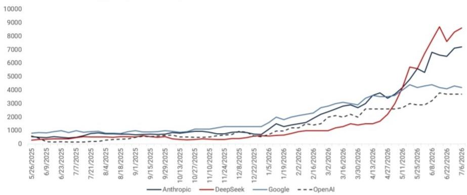  
Source: OpenRouter; JEF.

6) China Is Rapidly Closing Import Dependence in Strategic Sectors. Rhodium data show the share of subsectors where China imports 2x+ what it exports has collapsed across eight strategic industries since 2004—including aerospace, advanced electronics, robotics, and power.

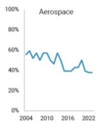

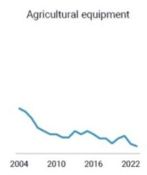  
Biotech and medical devices

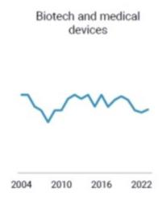  
Advanced electronics

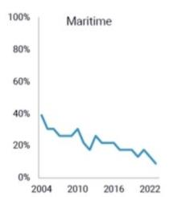  
Source: ICT, Comtrade, Rhodium Group.

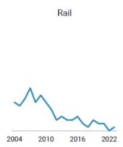

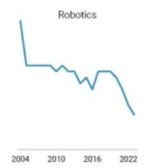

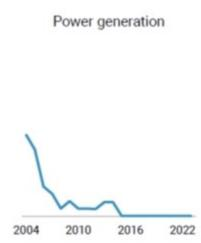

7) China Leads the U.S. in Research Across Nearly Every Key Defense Technology. ASPI data show China outpaces the U.S. in global research share across 18 defense-critical fields, including hypersonics, quantum computing, autonomous undersea vehicles, drone, and electronic warfare.

Research share across a range of key defense technologies (U.S. vs. China)

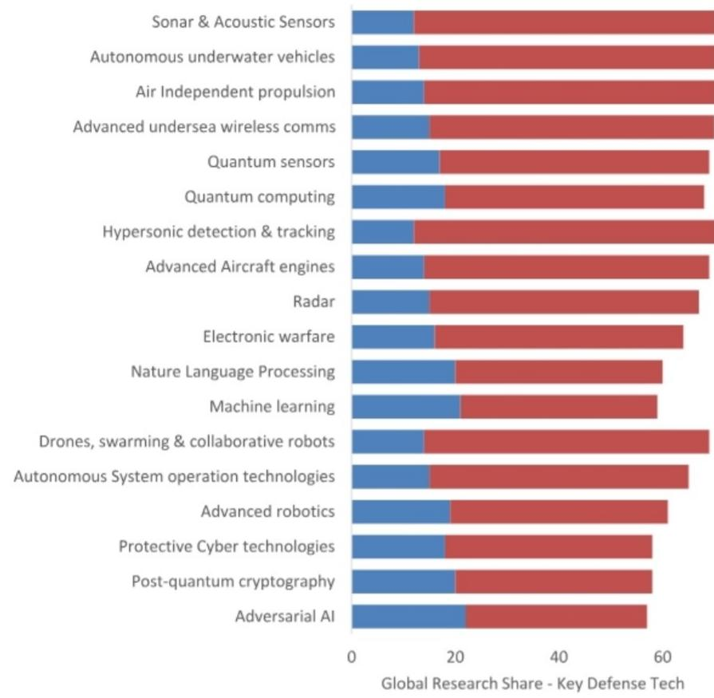  
United States China  
Source: Australian Strategic Policy Institute

8) China Dominates Clean Tech Factory Investment. BloombergNEF data show Mainland China's clean tech factory capex reached ~$104bn in 2025e vs. ~$9bn in the U.S.—a ~12x gap. Chinese investment has averaged ~$95bn/year since 2023, while U.S. spend remains in the single-digit billions through 2027e.

Clean Tech Factory Investment by Geography

  
Source: BloombergNEF; JEF.

9) China Is the Only Serious Challenger to U.S. Tech Power Across All Five Frontier Sectors. The Belfer Center's 2025 Critical and Emerging Technologies Index scores the U.S. at ~84 and China at ~65 across AI, biotech, semiconductors, space, and quantum—far ahead of Europe (~42) and Japan (~24).

Critical and Emerging Technologies Index, 2025  
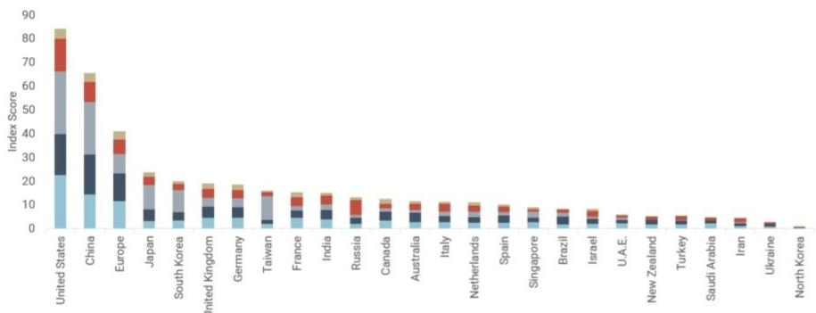  
AI Biotechnology Semiconductors Space Quantum  
Source: Critical and Emerging Technology Index, Belfer Center for Science and International Affairs

10) China Is Now the World's #2 Government Space Spender, Well Ahead of Europe and Russia. Novaspace data show China's 2024 government space spending reached ~$19.9bn—second only to the U.S. ($79.7bn) and roughly 3x Japan ($6.8bn), the EU/ESA bloc (~$6.7bn), and Russia (~$4.0bn). China is now the only credible near-peer in state-backed space capacity.

World government expenditures for space programs, 2024 (total: $135bn)

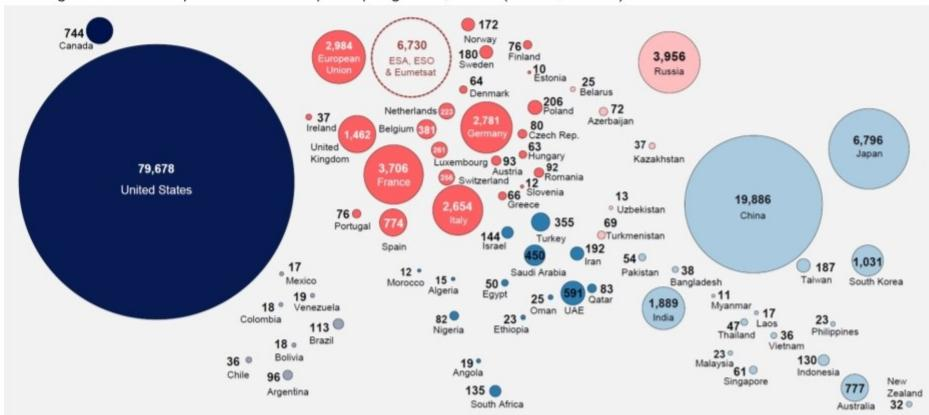  
Source: Novaspace

## Our Featured Research

• The Biggest Underappreciated Story of Our Time: China's Tech Prowess

• US–China 2026: Strategic Stability, Structural Rivalry

• US-China Tech Rivalry – Quantum

• US-China Tech Rivalry – Healthcare and Biotech

• US-China Tech Rivalry – Energy

• The Race of Our Lives Begins w/ Genesis Mission

• China's Tech Leadership: Is It Unstoppable?

See our 40+ related research inside.

## Our Related Research

1. An Overlooked Area of China's Industrial Policy: Food Supply Chains | REPLAY

2. US-China Tech Rivalry: Tracking National Power Industries & Companies

3. EU Policy Trip: Tougher on China, But European Preference Will Be Costly

4. Top 5 Takeaways: China Energy Outlook with Dr. Michal Meidan, OIES

5. China's Next-Generation Industrial Policy w/ Rhodium Group (RHG) | REPLAY

6. 6 Charts Explaining Europe's Exposure to China

7. US China Tech Rivalry – Strategic Industries of Tomorrow & Current Market Cap

8. U.S.-China 2026: Strategic Stability, Structural Rivalry

9. US-China Tech Rivalry – Who Will Win the Global Quantum Computing Race? | RECAP

10. Expert Call Recap: China Energy Outlook

11. The Investor Guide to China's Five-Year Plan: How it Works, Themes & Baskets

12. Implications of China's New Five-Year Plan for Global Tech Investors |REPLAY

13. Understanding China's Economy in the Context of the Five-Year Plan | RECAP

14. Mineral War: China's Quest for Weapons of Mineral Distribution | RECAP

15. REPLAY-US-China 2026: The Technological Race, Geopolitics & Market Implications

16. Venezuela: Implications for China's Energy & US Tech Rivalry | Recap

17. REPLAY-US-China Tech Rivalry: Healthcare and Biotech

18. [WATCH] Data Over Vibes: A Practical Toolkit in Tracking US China Tech Rivalry

19. Data Over Vibes – A Practical Toolkit in Tracking US China Tech Rivalry

20. US-China Tech Rivalry – Energy for Industrialization & Compute | Recap

21. US-China Tech Rivalry: The Race of Our Lives Begins w/ Genesis Mission

22. US-China Tech Rivalry: Has China Commercialized Molten Salt Reactors | Recap

23. Will China's Transition Slow – The Electrotech Revolution w/ Kingsmill Bond

24. China's Tech Leadership: Is It Unstoppable + What Are the Implications? | Recap

25. Recap—Trump-Xi Fallout? What's Next for US-China Trade

26. [REPLAY] Non-Consensus Views & Insights on AI, China, Labour Economics & More

27. The Biggest Underappreciated Story of Our Time: China's Tech Prowess

28. Limited Progress & Lingering Questions: Rethinking EU-China Engagement

29. Made in China 2025 w/ RAND China & Rhodium Group

30. [WATCH] Decoding China's Industrial Policies

31. [WATCH] China Virtual Summit: Geopolitical Rivalry & Strategic Priorities

32. China Shock 2.0 & The Energy Transition

33. [REPLAY] THE DOWNLOAD: AI Taking Over Jobs, US-China, US Supreme Court

34. DEEP DIVE Geopolitics That Matters – US-China via 40+ Key Data Points

35. US Companies Remain Cautious on the US-China Trade Outlook

36. China Policy Uncertainty Matches US for the First Time Since Feb 2025

37. [REPLAY] Impacts of the US-China Trade War, with JEF China Economist

38. China Signals Willingness to Negotiate: 6 Messages from the PRC

39. Recap – US-China Export Controls and Stock Market Implications

40. Recap—US-China Tariff Policy: How It Works & What To Expect | Washington Series

41. Where's the Debate #96: EU-China EV Probe May Have Implications for Green Deal

42. Beyond GDP Expert Recap – China's Gross Ecosystem Product (GEP)

43. Expert Recaps: A Carbon Markets Overview and Deeper Look into China's ETS

44. Where's the Debate? #21 China's Net-Zero Ambitions

## Analyst Certification:

I, Aniket Shah, PhD, certify that all of the views expressed in this research report accurately reflect my personal views about the subject security(ies) and subject company(ies). I also certify that no part of my compensation was, is, or will be, directly or indirectly, related to the specific recommendations or views expressed in this research report.

I, Yujin Kim, certify that all of the views expressed in this research report accurately reflect my personal views about the subject security(ies) and subject company(ies). I also certify that no part of my compensation was, is, or will be, directly or indirectly, related to the specific recommendations or views expressed in this research report.

I, Luke Sussams, certify that all of the views expressed in this research report accurately reflect my personal views about the subject security(ies) and subject company(ies). I also certify that no part of my compensation was, is, or will be, directly or indirectly, related to the specific recommendations or views expressed in this research report.

I, Charles Boakye, CFA, certify that all of the views expressed in this research report accurately reflect my personal views about the subject security(ies) and subject company(ies). I also certify that no part of my compensation was, is, or will be, directly or indirectly, related to the specific recommendations or views expressed in this research report.

I, Jacqueline Murdock, certify that all of the views expressed in this research report accurately reflect my personal views about the subject security(ies) and subject company(ies). I also certify that no part of my compensation was, is, or will be, directly or indirectly, related to the specific recommendations or views expressed in this research report.

I, Amani Mahmood, certify that all of the views expressed in this research report accurately reflect my personal views about the subject security(ies) and subject company(ies). I also certify that no part of my compensation was, is, or will be, directly or indirectly, related to the specific recommendations or views expressed in this research report.

I, Ana Zotovic, certify that all of the views expressed in this research report accurately reflect my personal views about the subject security(ies) and subject company(ies). I also certify that no part of my compensation was, is, or will be, directly or indirectly, related to the specific recommendations or views expressed in this research report.

Registration of non-US analysts: Luke Sussams is employed by JEF International Limited, a non-US affiliate of JEF LLC and is not registered/qualified as a research analyst with FINRA. This analyst(s) may not be an associated person of JEF LLC, a FINRA member firm, and therefore may not be subject to the FINRA Rule 2241 and restrictions on communications with a subject company, public appearances and trading securities held by a research analyst.

Registration of non-US analysts: Jacqueline Murdock is employed by JEF International Limited, a non-US affiliate of JEF LLC and is not registered/qualified as a research analyst with FINRA. This analyst(s) may not be an associated person of JEF LLC, a FINRA member firm, and therefore may not be subject to the FINRA Rule 2241 and restrictions on communications with a subject company, public appearances and trading securities held by a research analyst.

Registration of non-US analysts: Amani Mahmood is employed by JEF International Limited, a non-US affiliate of JEF LLC and is not registered/qualified as a research analyst with FINRA. This analyst(s) may not be an associated person of JEF LLC, a FINRA member firm, and therefore may not be subject to the FINRA Rule 2241 and restrictions on communications with a subject company, public appearances and trading securities held by a research analyst.

Registration of non-US analysts: Ana Zotovic is employed by JEF Securities, Inc., a non-US affiliate of JEF LLC and is not registered/qualified as a research analyst with FINRA. This analyst(s) may not be an associated person of JEF LLC, a FINRA member firm, and therefore may not be subject to the FINRA Rule 2241 and restrictions on communications with a subject company, public appearances and trading securities held by a research analyst.

As is the case with all JEF employees, the analyst(s) responsible for the coverage of the financial instruments discussed in this report receives compensation based in part on the overall performance of the firm, including investment banking income. We seek to update our research as appropriate, but various regulations may prevent us from doing so. Aside from certain industry reports published on a periodic basis, the large majority of reports are published at irregular intervals as appropriate in the analyst's judgement.

## Investment Recommendation Record

## (Article 3(1)e and Article 7 of MAR)

Recommendation Published July 19, 2026 21:41 P.M.  
Recommendation Distributed July 20, 2026 4:30 A.M.

## Company Specific Disclosures

Aniket Shah, PhD is not an Equity Research Analyst; and accordingly, is not subject to the analyst independence requirements in FINRA's equity research rule, Rule 2241. Any content authored by this person or the Sustainability & Transition Strategy team is not Equity Research. References to Equity Research content in this document, if any, are contributed by JEF Equity Research Analysts and identified as such.
\*\*\*

Yujin Kim is not an Equity Research Analyst; and accordingly, is not subject to the analyst independence requirements in FINRA's equity research rule, Rule 2241. Any content authored by this person or the Sustainability & Transition Strategy team is not Equity Research. References to Equity Research content in this document, if any, are contributed by JEF Equity Research Analysts and identified as such.

Luke Sussams is not an Equity Research Analyst; and accordingly, is not subject to the analyst independence requirements in FINRA's equity research rule, Rule 2241. Any content authored by this person or the Sustainability & Transition Strategy team is not Equity Research. References to Equity Research content in this document, if any, are contributed by JEF Equity Research Analysts and identified as such.

Charles Boakye, CFA is not an Equity Research Analyst; and accordingly, is not subject to the analyst independence requirements in FINRA's equity research rule, Rule 2241. Any content authored by this person or the Sustainability & Transition Strategy team is not Equity Research. References to Equity Research content in this document, if any, are contributed by JEF Equity Research Analysts and identified as such.
\*\*\*

Jacqueline Murdock is not an Equity Research Analyst; and accordingly, is not subject to the analyst independence requirements in FINRA's equity research rule, Rule 2241. Any content authored by this person or the Sustainability & Transition Strategy team is not Equity Research. References to Equity Research content in this document, if any, are contributed by JEF Equity Research Analysts and identified as such.

Ana Zotovic is not an Equity Research Analyst; and accordingly, is not subject to the analyst independence requirements in FINRA's equity research rule, Rule 2241. Any content authored by this person or the Sustainability & Transition Strategy team is not Equity Research. References to Equity Research content in this document, if any, are contributed by JEF Equity Research Analysts and identified as such.

## Explanation of JEF Ratings

Buy - Describes securities that we expect to provide a total return (price appreciation plus yield) of $15\%$ or more within a 12-month period.

Hold - Describes securities that we expect to provide a total return (price appreciation plus yield) of plus $15\%$ or minus $10\%$ within a 12-month period.

Underperform - Describes securities that we expect to provide a total return (price appreciation plus yield) of minus $10\%$ or less within a 12-month period.

The expected total return (price appreciation plus yield) for Buy rated securities with an average security price consistently below \$10 is 20% or more within a 12-month period as these companies are typically more volatile than the overall stock market. For Hold rated securities with an average security price consistently below \$10, the expected total return (price appreciation plus yield) is plus or minus 20% within a 12-month period. For Underperform rated securities with an average security price consistently below \$10, the expected total return (price appreciation plus yield) is minus 20% or less within a 12-month period.

NR - The investment rating and price target have been temporarily suspended. Such suspensions are in compliance with applicable regulations and/or JEF policies.

CS - Coverage Suspended. JEF has suspended coverage of this company.

NC - Not covered. JEF does not cover this company.

Restricted - Describes issuers where, in conjunction with JEF engagement in certain transactions, company policy or applicable securities regulations prohibit certain types of communications, including investment recommendations.

Monitor - Describes securities whose company fundamentals and financials are being monitored, and for which no financial projections or opinions on the investment merits of the company are provided.

## Valuation Methodology

JEF' methodology for assigning ratings may include the following: market capitalization, maturity, growth/value, volatility and expected total return over the next 12 months. The price targets are based on several methodologies, which may include, but are not restricted to, analyses of market risk, growth rate, revenue stream, discounted cash flow (DCF), EBITDA, EPS, cash flow (CF), free cash flow (FCF), EV/EBITDA, P/E, PE/growth, P/CF, P/FCF, premium (discount)/average group EV/EBITDA, premium (discount)/average group P/E, sum of the parts, net asset value, dividend returns, and return on equity (ROE) over the next 12 months. JEF Franchise Picks

JEF Franchise Picks include stock selections from among the best stock ideas from our equity analysts over a 12 month period. Stock selection is based on fundamental analysis and may take into account other factors such as analyst conviction, differentiated analysis, a favorable risk/reward ratio and investment themes that JEF analysts are recommending. JEF Franchise Picks will include only Buy rated stocks and the number can vary depending on analyst recommendations for inclusion. Stocks will be added as new opportunities arise and removed when the reason for inclusion changes, the stock has met its desired return, if it is no longer rated Buy and/or if it triggers a stop loss. Stocks having 120 day volatility in the bottom quartile of S&P stocks will continue to have a 15% stop loss, and the remainder will have a 20% stop. Franchise Picks are not intended to represent a recommended portfolio of stocks and is not sector based, but we may note where we believe a Pick falls within an investment style such as growth or value.

## Risks which may impede the achievement of our Price Target

This report was prepared for general circulation and does not provide investment recommendations specific to individual investors. As such, the financial instruments discussed in this report may not be suitable for all investors and investors must make their own investment decisions based upon their specific investment objectives and financial situation utilizing their own financial advisors as they deem necessary. Past performance of the financial instruments recommended in this report should not be taken as an indication or guarantee of future results. The price, value of, and income from, any of the financial instruments mentioned in this report can rise as well as fall and may be affected by changes in economic, financial and political factors. If a financial instrument is denominated in a currency other than the investor's home currency, a change in exchange rates may adversely affect the price of, value of, or income derived from the financial instrument described in this report. To the extent prices are shown in non-US currency, please note that our local currency price targets are based on a currency conversion using an exchange rate as of the prior trading day (unless otherwise noted). Should there be fluctuations in the exchange rate after this date, that will affect the non-US target prices and should no longer be relied upon. In addition, investors in securities such as ADRs, whose values are affected by the currency of the underlying security, effectively assume currency risk.

<table><tr><td colspan="3">Distribution of Ratings</td><td colspan="2">IB Serv./Past12 Mos.</td><td colspan="2">JIL Mkt Serv./Past12 Mos.</td></tr><tr><td></td><td>Count</td><td>Percent</td><td>Count</td><td>Percent</td><td>Count</td><td>Percent</td></tr><tr><td>BUY</td><td>2238</td><td>62.64%</td><td>387</td><td>17.29%</td><td>110</td><td>4.92%</td></tr><tr><td>HOLD</td><td>1174</td><td>32.86%</td><td>94</td><td>8.01%</td><td>15</td><td>1.28%</td></tr><tr><td>UNDERPERFORM</td><td>161</td><td>4.51%</td><td>0</td><td>0.00%</td><td>0</td><td>0.00%</td></tr></table>

## Other Important Disclosure

## Other Important Disclosures

JEF does business and seeks to do business with companies covered in its research reports, and expects to receive or intends to seek compensation for investment banking services among other activities from such companies. As a result, investors should be aware that JEF may have a conflict of interest that could affect the objectivity of this report. Investors should consider this report as only a single factor in making their investment decision.

JEF Equity Research refers to research reports produced by analysts employed by one of the following JEF Financial Group Inc. ("JEF") companies: United States: JEF LLC which is an SEC registered broker-dealer and a member of FINRA (and distributed by JEF Services, LLC, an SEC registered Investment Adviser, to clients paying separately for such research).

Canada: JEF Securities Inc., which is an investment dealer registered in each of the thirteen Canadian jurisdictions and a dealer member of the Canadian Investment Regulatory Organization, including research reports produced jointly by JEF Securities Inc. and another JEF entity (and distributed by JEF Securities Inc.).

Where JEF Securities Inc. distributes research reports produced by JEF LLC, JEF International Limited, JEF Japan Company Limited, or JEF India Private Limited, you are advised that each of JEF LLC, JEF International Limited, JEF Japan Company Limited, and JEF India Private Limited operates as a dealer in your jurisdiction under an exemption from the dealer registration requirements contained in National Instrument 31-103 Registration Requirements, Exemptions and Ongoing Registrant Obligations and, as such, each of JEF LLC, JEF International Limited, JEF Japan Company Limited, and JEF India Private Limited is not required to be and is not a registered dealer or adviser in your jurisdiction. You are advised that where JEF LLC or JEF International Limited prepared this research report, it was not prepared in accordance with Canadian disclosure requirements relating to research reports in Canada.

United Kingdom: JEF International Limited, which is authorized and regulated by the Financial Conduct Authority; registered in England and Wales No. 1978621; registered office: 100 Bishopsgate, London EC2N 4JL; telephone +44 (0)20 7029 8000; facsimile +44 (0)20 7029 8010.

Germany: JEF GmbH, which is authorized and regulated by the Bundesanstalt fuer Finanzdienstleistungsaufsicht, BaFin-ID: 10150151; registered office: Bockenheimer Landstr. 24, 60323 Frankfurt a.M., Germany; telephone: +49 (0) 69 719 1870

Hong Kong: JEF Hong Kong Limited, which is licensed by the Securities and Futures Commission of Hong Kong with CE number ATS546; located at Level 26, Two International Finance Center, 8 Finance Street, Central, Hong Kong; telephone: +852 3743 8000.

Singapore: JEF Singapore Limited, which is licensed by the Monetary Authority of Singapore; located at 10 Collyer Quay #41-01, Ocean Financial Centre, Singapore 049315, telephone: +65 6551 3950.

Japan: JEF Japan Company Limited, which is a securities company registered by the Financial Services Agency of Japan and is a member of the Japan Securities Dealers Association; located at Tokyo Midtown Hibiya 30F Hibiya Mitsui Tower, 1-1-2 Yuraku-cho, Chiyoda-ku, Tokyo 100-0006; telephone +813 5251 6100; facsimile +813 5251 6101.

India: JEF India Private Limited (CIN - U74140MH2007PTC200509), licensed by the Securities and Exchange Board of India for: Stock Broker (NSE & BSE) INZ000243033, Research Analyst INH000000701 and Merchant Banker INM000011443, located at Level 16, Express Towers, Nariman Point, Mumbai 400 021, India; Tel +91 22 4356 6000. Compliance Officer name: Sanjay Pai, Tel No: +91 22 42246150, Email: spai@JEF.com, Grievance officer name: Sanjay Pai, Tel no. +91 22 42246150, Email: compliance\_india@JEF.com. Registration granted by SEBI and certification from NISM in no way guarantee performance of the intermediary or provide any assurance of returns to investors.

Australia: JEF (Australia) Pty Limited (ACN 623 059 898), which holds an Australian financial services license (AFSL 504712) and is located at Level 20, 60 Martin Place, Sydney NSW 2000; telephone +61 2 9364 2800.

Dubai: JEF International Limited, Dubai branch, which is licensed by the Dubai Financial Services Authority (DFSA Reference Number F007325); registered office Unit L31-06, L31-07, Level 31, ICD Brookfield Pace, DIFC, PO Box 121208, Dubai, UAE.

This report was prepared by personnel who are associated with JEF (JEF Securities Inc., JEF International Limited, JEF GmbH, JEF Hong Kong Limited, JEF Singapore Limited, JEF Japan Company Limited, JEF India Private Limited), and JEF (Australia) Pty Ltd; or by personnel who are associated with both JEF LLC and JEF Services LLC ("JRS"). JEF LLC is a US registered broker-dealer and is affiliated with JRS, which is a US registered investment adviser. JRS does not create tailored or personalized research and all research provided by JRS is impersonal. If you are paying separately for this research, it is being provided to you by JRS. Otherwise, it is being provided by JEF LLC. JEF LLC, JRS, and their affiliates are collectively referred to below as "JEF". JEF may seek to do business with companies covered in this research report. As a result, investors should be aware that JEF may have a conflict of interest that could affect the objectivity of this report. Investors should consider this report as only one of many factors in making their investment decisions. Specific conflict of interest and other disclosures that are required by FINRA, the Canadian Investment Regulatory Organization and other rules are set forth in this disclosure section.

If you are receiving this report from a non-US JEF entity, please note the following: Unless prohibited by the provisions of Regulation S of the U.S. Securities Act of 1933, as amended, this material is distributed in the United States by JEF LLC, which accepts responsibility for its contents in accordance with the provisions of Rule 15a-6 under the US Securities Exchange Act of 1934, as amended. Transactions by or on behalf of any US person may only be effected through JEF LLC. In the United Kingdom and European Economic Area this report is issued and/or approved for distribution by JEF International Limited ("JIL") and/or JEF GmbH and is intended for use only by persons who have, or have been assessed as having, suitable professional experience and expertise, or by persons to whom it can be otherwise lawfully distributed. JEF LLC, JIL, JEF GmbH and their affiliates, may make a market or provide liquidity in the financial instruments referred to in this report; and where they do make a market, such activity is disclosed specifically in this report under "company specific disclosures".

For Canadian investors, this material is intended for use only by professional or institutional investors. None of the investments or investment services mentioned or described herein is available to other persons or to anyone in Canada who is not a "permitted client" as defined by National Instrument 31-103 Registration Requirements, Exemptions and Ongoing Registrant Obligations, as applicable. This research report is a general discussion of the merits and risks of a security or securities only, and is not in any way meant to be tailored to the needs and circumstances of any recipient. The information contained herein is not, and under no circumstances is to be construed as, an offer to sell securities described herein, or solicitation of an offer to buy securities described herein, in Canada or any province or territory thereof. Any offer or sale of the securities described herein in Canada will be made only under an exemption from the requirements to file a prospectus with the relevant Canadian securities regulators, if applicable, and only by a dealer properly registered under applicable securities laws or, alternatively, pursuant to an exemption from the dealer registration requirement in the relevant province or territory of Canada in which such offer or sale is made. The information contained herein is under no circumstances to be construed as investment advice in any province or territory of Canada and is not tailored to the needs of the recipient. To the extent that the information contained herein references securities of an issuer incorporated, formed or created under the laws of Canada or a province or territory of Canada, any trades in such securities must be conducted through a dealer registered in Canada. No securities commission or similar regulatory authority in Canada has reviewed or in any way passed judgment upon this research report, the information contained herein or the merits of the securities described herein, and any representation to the contrary is an offence.

In Singapore, JEF Singapore Limited ("JSL") is regulated by the Monetary Authority of Singapore. For investors in the Republic of Singapore, where this material is prepared and issued by a JEF affiliate outside of Singapore, it is distributed by JSL pursuant to Regulation 32C of the Financial Advisers Regulations. The material contained in this document is intended solely for accredited, expert or institutional investors, as defined under the Securities and Futures Act 2001 (Singapore). If there are any matters arising from, or in connection with this material, please contact JSL, located at 80 Raffles Place #15-20, UOB Plaza 2, Singapore 048624, telephone: +65 6551 3950. In Dubai, this material is issued and distributed by JEF International Limited, Dubai branch
