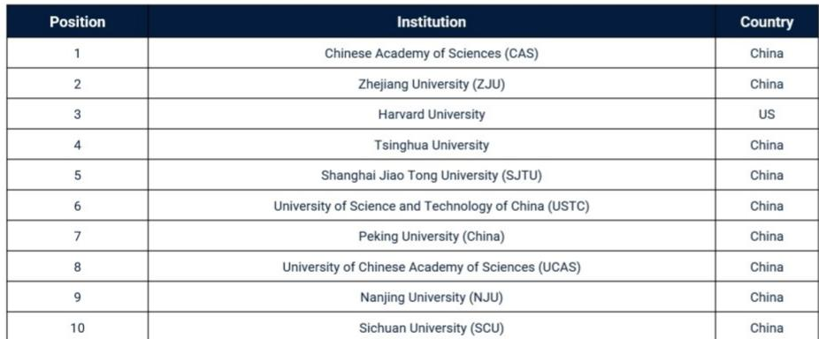
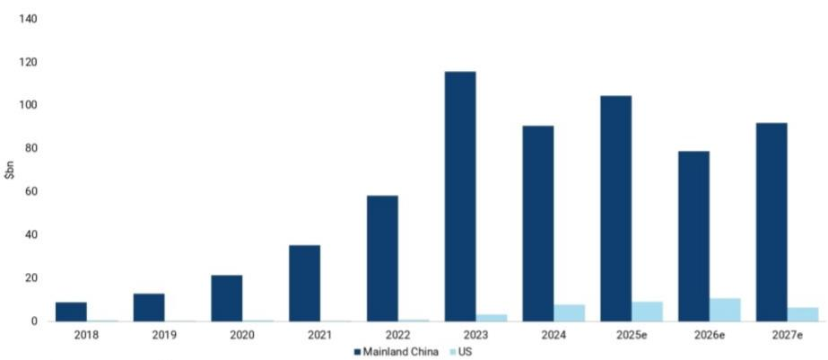

# JEF：研究主题与行业变化观察

一份来自JEF的专题报告，以十张数据图表为核心，系统梳理了中国在科技领域从研究产出到产业研究的多个维度变化。报告的核心判断是：中国科技能力的提升是结构性转变，而非周期性波动。这一判断并非基于单一指标，而是由研究机构排名、高影响力论文份额、研发支出、专利申请、前沿模型使用量、进口依赖度、国防技术、清洁技术研究、前沿领域竞争力和太空支出等十个独立证据共同支撑。

报告发布于2026年7月，正值市场对中国科技公司关注度上升的时期。JEF团队自2025年起持续追踪这一主题，此次以图表集形式呈现了最新的数据节点。

## 1. 高影响力研究机构排名与论文份额出现结构性变化

《自然指数2026》显示，全球前十高影响力研究机构中，九家来自中国。中国科学院位居榜首，浙江大学取代哈佛大学成为全球排名最高的学术机构。这一排名变化并非短期波动，而是反映了中国研究机构在基础科学产出上的持续积累。

在论文质量维度，澳大利亚战略政策研究所（ASPI）的追踪数据显示，中国在高被引论文（前10%）中的全球份额从2005年的约5%上升至2025年的约47%，同期美国份额从约40%下降至约9%。报告指出，这一变化覆盖了多个关键技术领域。

> **KC评论：** 论文份额的交叉点发生在2019年前后，但此后差距持续扩大。47%对9%的对比，意味着在高影响力研究这一维度，中国已经形成了数量级的领先。对于关注基础研究对产业转化影响的读者，这一趋势的持续性比单一年份数据更重要。

## 2. 研发支出与专利数量反映投入规模差异

信息技术与创新产品会（ITIF）的估算显示，按购买力平价调整后，中国2024年研发总支出约为10300亿美元，略高于美国的约10100亿美元。自2004年以来，中国实际研发支出年均增速超过12%，是美国同期增速的三倍以上。

专利申请方面，世界知识产权组织（WIPO）数据显示，2024年中国提交了180万件专利申请，是美国的3.6倍，也超过了其后九个国家的总和。报告认为，专利数量与研发支出的同步增长，构成了中国科技能力提升的投入端基础。

## 3. 前沿技术应用与产业自主化取得进展

在AI模型使用层面，OpenRouter平台的标准化token数据显示，DeepSeek的用量从2025年初接近于零增长至2026年7月的约8600，超过了美国前沿模型。这一数据反映的是实际使用量，而非模型性能排名。

产业自主化方面，荣鼎咨询（Rhodium Group）的数据显示，自2004年以来，中国在航空航天、先进电子、机器人和电力等八个战略行业中，进口额超过出口额两倍以上的子行业占比大幅下降。报告认为，这表明中国正在快速缩小对关键领域的进口依赖。

在国防技术领域，ASPI数据显示，中国在超高音速、量子计算、自主水下航行器、无人机和电子战等18个国防关键技术领域的全球研究份额均超过美国。

## 4. 清洁技术研究与前沿领域竞争格局

彭博新能源研究（BNEF）数据显示，2025年中国大陆清洁技术工厂资本支出预计约为1040亿美元，美国约为90亿美元，差距约为12倍。自2023年以来，中国年均清洁技术研究约为950亿美元，而美国至2027年的预测支出仍维持在数十亿美元量级。

贝尔弗中心（Belfer Center）2025年关键与新兴技术指数显示，美国综合得分约为84，中国约为65，欧洲约为42，日本约为24。报告认为，在人工智能、生物技术、半导体、太空和量子计算五个前沿领域，中国是相对少见接近美国水平的竞争者。

太空支出方面，Novaspace数据显示，2024年中国政府太空项目支出约为199亿美元，仅次于美国的797亿美元，约为日本、欧盟/欧空局和俄罗斯各自支出的三倍。

报告最后指出，电信、汽车和人工智能领域只是中国科技能力外溢的早期阶段，建议读者评估这一趋势对西方公司的影响，并考虑直接配置中国科技资产。

For informational purposes only. Portions may be generated,translated,summarized,or edited with AI assistance based on source materials and may contain omissions or errors. Please verify independently. This is not investment,legal,tax,accounting,or other professional advice.

For informational purposes only. Portions may be generated,translated,summarized,or edited with AI assistance based on source materials and may contain omissions or errors. Please verify independently. This is not investment,legal,tax,accounting,or other professional advice.

