## 7 Takeaways Post K3 Release: Connect The Dots on Models, Cloud & Applications

Highlights (1) Moonshot AI: K3 is far from reaching upper limit in intelligence. ARR has fastest growth the next day; (2) More T-parameters China models (e.g. Qwen3.8, 2.4T) to come; (3) Updates from Zhipu and Stepfun; (4) Compute is focus on recent financing /KC Preview (link); (5)Token Expenditure Index remains soft; (6) Video models landscape do not see notable change;(7) Tencent's WorkBuddy gains traction; (8) Reaffirm positive view on BABA's full stack capabilities

In this report, we provide readers with data points on model pricing by companies, pricing comparison between China and US, model intelligence from Artificial Analysis, token consumption in OpenRouter, Token Expenditure Index trends and other industry data for analysis.

Closing the gap amid competition. Observers are interested to see K3 (link) achieved new intelligence milestone and ranked at top positions in different metrics. According to Arena (Exhibit 5). This is the first time China takes the lead over US models in Frontend Code Arena vs early 2025 (DeepSeek-R1 is the last Chinese models came close with US models). Feedback is more about the closing of intelligence gap and anticipate more Chinese models (Exhibit 2) having T-parameter in coming months. Balance between intelligence and good to use amid supply constraints For Chinese models is expected.

Moonshot AI: Still far from the upper limit in model intelligence. ARR reached the fastest growth rate the next day. According to STAR Market Daily, President Mr.Zhang highlights (1) Scaling Law is valid. K3 is not the most intelligent model despite a big advancement is made vs K2.6; (2) It is still early to talk about the upper bound of model intelligence; (3) ARR experienced the fastest growth rate the next day post K3 release.

Latest strategies from Zhipu and Stepfun on industry trends. (1) Zhipu: (a) Scaling Law continues to accelerate across data, environment, RL and infra. (b) GLM-5.2 has less parameters vs K3. It can exceed K3 capabilities when scale to latter's level. Please refer to page 2 for details; (2) Stepfun: During WAIC (a) agents become the atomic unit of productivity; (b) integration between AI and terminals is the next focus; (c) AI coding exceeds human; (d) Agent-to-Agent is the next internet

Compute is the focus on recent financing by AI Lab and Kingsoft Cloud Preview. Recent financing of AI Lab (link) (1) DeepSeek (USD7bn, Jun-26); (2) Zhipu (USD4bn, Jul-26 and (3) MiniMax (USD2bn, Jul-26). We view new funding can strengthen respective computing needs amid surging demand. For Kingsoft Cloud, we adjust our revenue slightly in 2Q, factoring in the supply constraints issues with capex spending happened more in Jun vs Apr/May (link)

Token expenditure trends reflect highly cost efficient model is important. According to Silicon Data LLM Token Expenditure Index (Exhibit 4), the index continues to remain soft and ranged between 1.56 to 1.61 the week of 12 Jul (vs 1.63 to 1.65 the week of 5 Jul), vs 2.04 on 31 May. Based on Artificial Analysis, China models are highly cost-efficient vs US models and API cost is a fraction vs US models (Exhibit 3). We look into (1) Blended price vs Intelligence by models (Exhibit 1). The recent industry trends from US /China tech companies show the debate on Tokenmaxxing vs token spending means cost efficient models become increasing important in Coding and Agentic AI.

Video generation model landscape does not see to have notable change. According to Kimi's co-founder Mr. Zhou Xinyu, the current focus is model intelligence and video generation model

Exhibit 1 - Artificial Analysis Intelligence Index vs Blended Price  
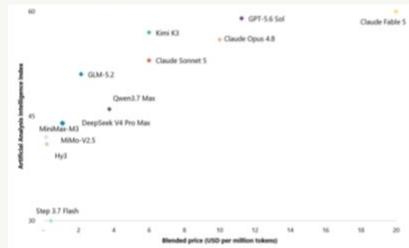  
Source: Artificial Analysis, JEF

Exhibit 2 - Total parameters for different flagship models

<table><tr><td>Models</td><td>Total parameters</td></tr><tr><td>Kimi-3</td><td>2.8T</td></tr><tr><td>DeepSeek-V4-Pro</td><td>1.6T</td></tr><tr><td>Qwen3.7 Max</td><td>1.2T</td></tr><tr><td>GLM-5.2</td><td>744B</td></tr><tr><td>MiniMax M3</td><td>428B</td></tr><tr><td>Hy3</td><td>295B</td></tr></table>

Source: JEF

Exhibit 3 - Blended prices for China models vs US models (2Q26)  
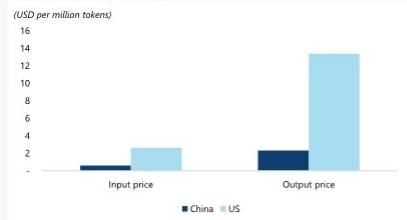  
Source: Artificial Analysis, JEF

Exhibit 4 - Silicon Data LLM Token Expenditure Index  
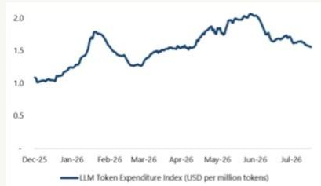  
Source: Bloomberg, JEF

Exhibit 5 - Weekly token consumption over the past 12 months as of 13 Jul (tn)  
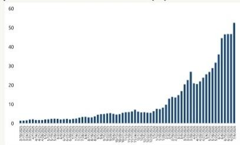  
Source: OpenRouter, JEF

Thomas Chong \* | Equity Analyst 852 3743 8016 | thomas.chong@JEF.com

Zoey Zong \* | Equity Analyst 852 3743 8163 | zoey.zong@JEF.com

is not top priority at the moment. According to Volcano Engine Conference (link) in Jun, it released Seedance 2.5 and considers video

Continued overleaf ...

generation represents over half of MaaS revenue (link). On the other hand, Kling raised new financing be used for business expansion, daily operations, working capital, team development and others (link)

Tencent's WorkBuddy is gaining traction. On application side, we expect Tencent's WorkBuddy continues to gain traction. According to Analysys (link), it highlights operating metrics for WorkBuddy in the segment (Mar-26). These include (1) number of desktop monthly visits reached 8.85m; (2) WorkBuddy is ahead of Trae (ByteDance), QClaw (Tencent) and Qoder Work (BABA). On the other hand, BABA releases Meoo (diverse AI enterprise apps) during WAIC. For Baidu, it highlights a number of AI showcases such as Baidu Drive, Baidu Wenku and Xiaodu during WAIC (link). On the other hand, Kingsoft Office held AI Productivity Conference last week and released AI products Lingxi Professional and WPS AI Hub (link)

What's next to be anticipated? These include (1) With model iterations happen in less than 3 months, we expect upcoming models for Qwen (Qwen 3.8, 2.4T), MiniMax (M3 Pro), Zhipu (GLM) and Tencent (Hy4) are to be anticipated. For BABA, it highlights Qwen3.8 is open weight model (total parameters 2.4T) which will be released in near term. Its Qwen3.8-Max-Preview model is available in Token Plan, Qoder and Qoder Work. It is also available in PC and mobile of Qianwen; (2) a number of companies are expected to achieve over USD1bn ARR in 2026 or early 2027: (a) BABA; (b) Zhipu; (c) MiniMax; (d) Kling; (e) Volcano Engine. We expect Kimi ARR is to be watched out post release of K3. We view BABA to stand out on its full stack of capabilities with models, cloud, chips and applications.

## Zhipu: Key Takeaways from Conference Call

\- Scaling Law continues to accelerate. This can be seen in breakthrough made by OpenAI and Anthropic heading towards AGI.

\- Thoughts on K3. (1) K3 is successful in scaling and close to global frontier models; (2) GLM-5.2 has less parameters vs K3 (Exhibit 6). It expects to exceed K3 capabilities when it scales to K3 level

\- GLM series. (1) Feb-26: GLM-5 vs GLM-4 series. It doubles no of parameters with pre-training of 30T tokens and adopts DSA architecture; (2) Apr-26/Jun-26: released GLM5.1/5.2 version. (a) GLM5.1 emphasizes on long horizon tasks; (b) GLM-5.2 extends to 1M context length and handles complicated coding work; (c) next version GLM-5.3 will have minor iterations and better coding experience; (d) next model series will have new architecture with bigger scale while maintain cost efficiencies

\- Multiple areas in scaling. These include (1) data; (2) environment; (3) RL (Reinforcement Learning); (4) Infra. On data, it covers pre-training/mid-training and SWE scaling can automatically create coding agent environment. On RL, the use of SAO technology drives better accuracy vs GRPO optimization in particular long horizon tasks. On Infra, (a) ZCube vs Clos: it lowers cost by 33% and throughout by 15%; (b) LayerSplit: reduce KV Cache and increase throughput by 132%; (c) prefill-decode separation; (d) DSA+IndexShare enhances efficiency

\- Touch High. On top of new models, other areas include (1) LLM-driven autonomous agent system (AAS) and (2) Recursive self-improvement (RSI)

Exhibit 6 - Comparison between GLM-5.2 vs K3

<table><tr><td></td><td>GLM-5.2</td><td>Kimi K3</td></tr><tr><td>Total no of parameters</td><td>744B</td><td>2.8T</td></tr><tr><td>Activated parameters</td><td>40B, 8/256 experts</td><td>16/896 experts</td></tr><tr><td>Training Tokens</td><td>30T+ tokens</td><td>na</td></tr><tr><td>Contexts</td><td>1M: texts</td><td>1M: multimodal</td></tr><tr><td>Core architecture</td><td>DSA + Index Share</td><td>KDA + AttnRes + Stable LatentMoE</td></tr><tr><td>API price (cache/input/output)</td><td>RMB2/8/28 USD0.26/1.4/4.4</td><td>RMB2/20/100 USD0.3/3.0/15.0</td></tr><tr><td>Open source</td><td>Release weights under MIT</td><td>Release open weights on 27 Jul</td></tr><tr><td>Deployment</td><td>8 cards</td><td>64+ supernode</td></tr><tr><td>Speed</td><td>Average 60 TPS High Speed 450 TPS</td><td>Average 20 TPS</td></tr></table>

Source: Company, JEF

Exhibit 7 - Frontend Code Arena: US vs China  
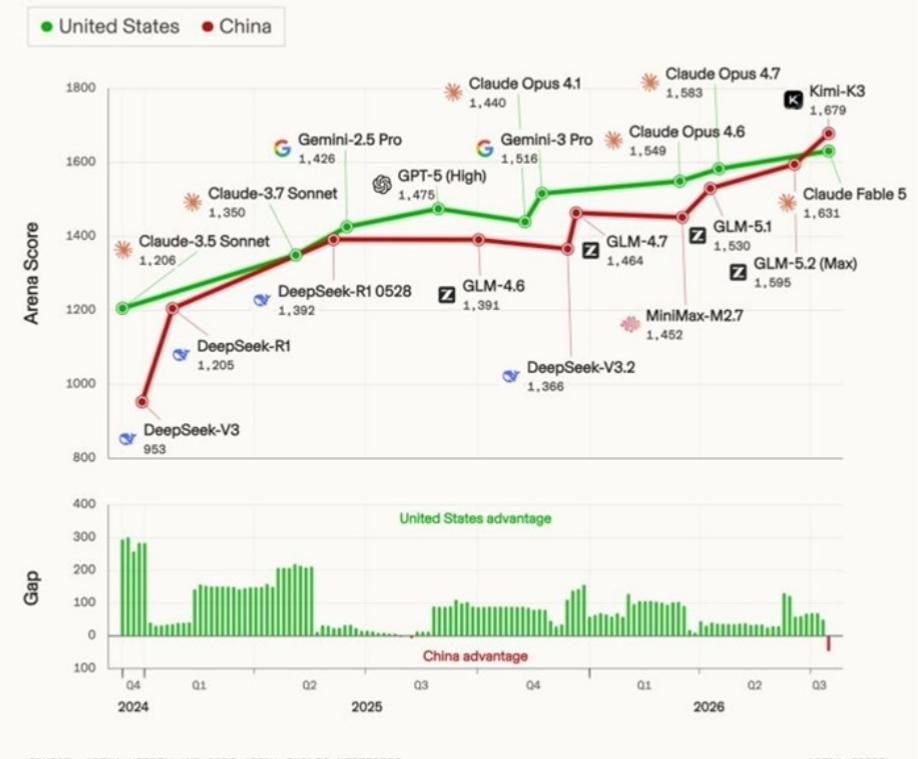  
SOURCE: ARENA WEBDEV AND CODE ARENA PUBLIC HISTORIES  
Source: Arena, JEF

Based on Artificial Analysis, China models DeepSeek, Qwen, Kimi, MiniMax and Zhipu are closing the gap with US models in terms of intelligence. China models are highly cost-efficient on Mixture of Experts (MoE) architecture, linear attention, and MFU (Model Flog Utilization). According to 2026 Stanford AI Index Report (Apr-26), the top US model leads Chinese models by 2.7%. Separately, Anthropic (1503), xAI (1495), Google (1494), OpenAI (1481), Alibaba (1449) and DeepSeek (1424) occupy the top tier of Arena Elo ratings as of Mar-26.

China models are narrowing the gap with US models in terms of intelligence. On Input/Output API, China large models are highly efficient vs US models.

Exhibit 8 - Artificial Analysis Intelligence Index

Artificial Analysis Intelligence Index

Artificial Analysis Intelligence Index v4.1 incorporates 9 evaluations: GDPval-AA v2, $\tau^3$ -Banking, Terminal-Bench v2.1, SciCode, Humanity's Last Exam, GPQA Diamond, CritPt, AA-Omniscience, AA-LCR

Artificial Analysis

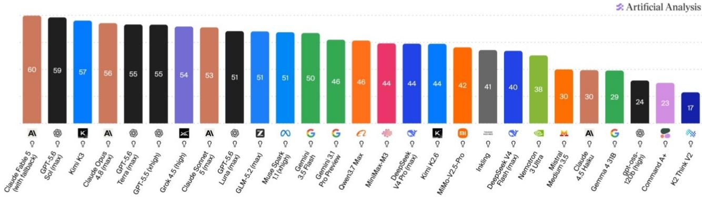  
Reasoning models are indicated by a lightbulb icon  
Source: Artificial Analysis, JEF

Exhibit 9 - Coding Cost Per Task Assessment: K3 vs Global Peers  
Kimi Code Bench V2 · Score vs Cost per Task  
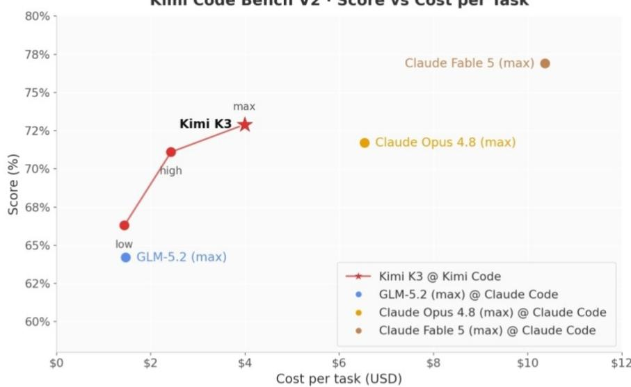  
Source: Moonshot AI, JEF

Exhibit 10 - Browsing Cost Per Task Assessment: K3 vs Global Peers  
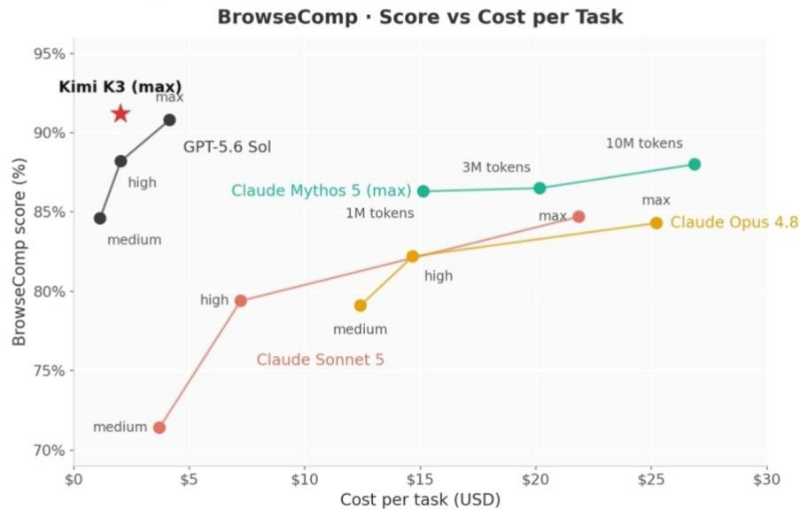  
Source: Moonshot AI, JEF

## Model Input/Output Price By Companies

Exhibit 11 - DeepSeek: Input price  
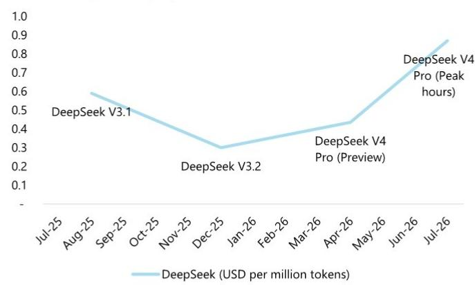  
Source: Artificial Analysis, JEF

Exhibit 12 - DeepSeek: Output price  
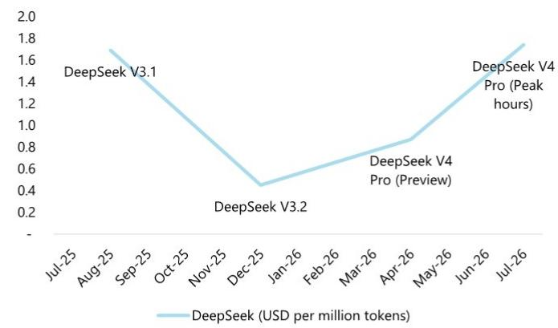  
Exhibit 13 - Kimi: Input price  
Source: Artificial Analysis, JEF

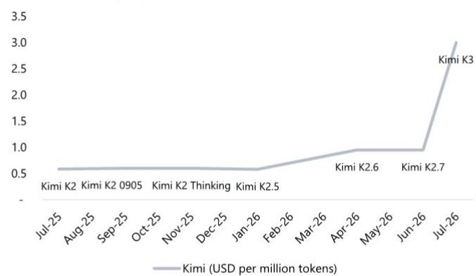  
Source: Artificial Analysis, JEF

Exhibit 14 - Kimi: Output price  
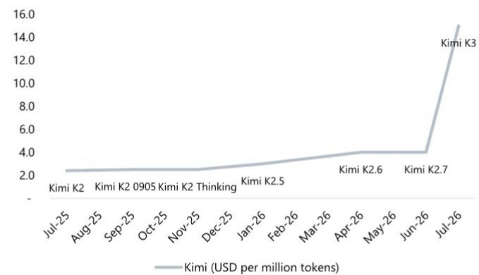  
Source: Artificial Analysis, JEF

Exhibit 15 - Zhipu: Input price  
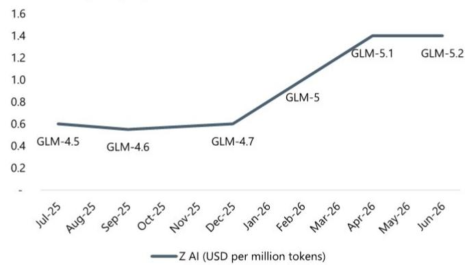  
Source: Artificial Analysis, JEF

Note: API price is the same across all context lengths in GLM-5.2 vs tiered pricing in GLM-5.1  
Exhibit 16 - Zhipu: Output price  
  
Source: Artificial Analysis, JEF  
Note: API price is the same across all context lengths in GLM-5.2 vs tiered pricing in GLM-5.1

Exhibit 17 - Qwen: Input price  
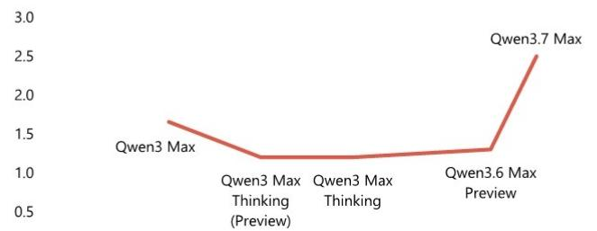

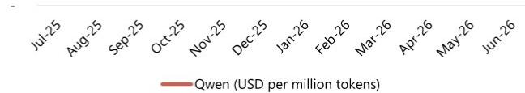  
Source: Artificial Analysis, JEF

Exhibit 18 - Qwen: Output price  
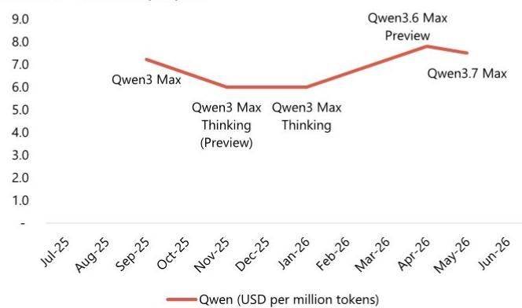  
Source: Artificial Analysis, JEF

Exhibit 19 - MiniMax: Input price  
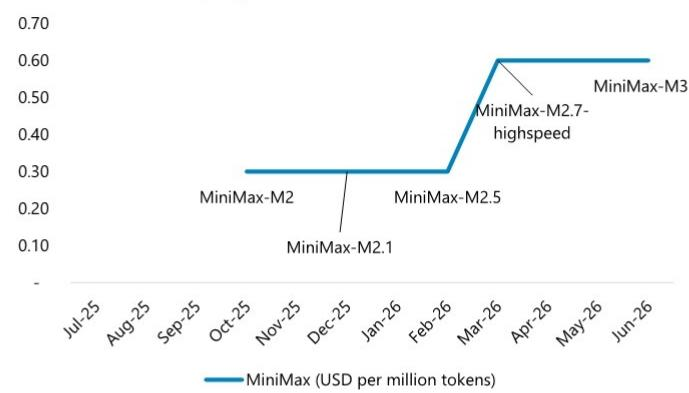  
Source: Artificial Analysis, JEF
Note: > 512k input tokens for MiniMax-M3

Exhibit 20 - MiniMax: Output price  
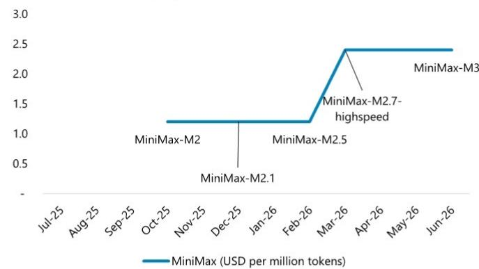  
Source: Artificial Analysis, JEF  
Note: >512k input tokens for MiniMax-M3

Source: Artificial Analysis, JEF
Note: 32k < Input tokens <= 128k

Exhibit 21 - Doubao Seed: Input price  
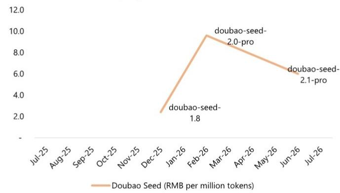  
Source: Company, JEF  
Note: 128k < input tokens <= 256k for doubao-seed-2.0-pro, doubao-seed-1.8

Exhibit 22 - Doubao Seed: Output price  
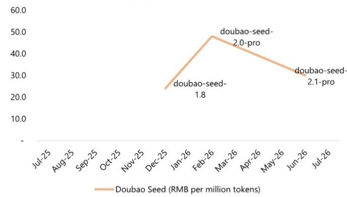  
Source: Company, JEF  
Note: 128k < input tokens <= 256k for doubao-seed-2.0-pro, doubao-seed-1.8

Exhibit 23 - Xiaomi: Input price  
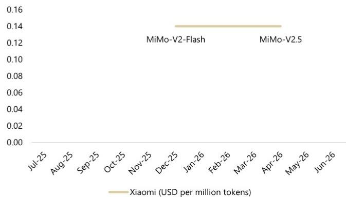  
Source: Artificial Analysis, JEF

Exhibit 24 - Xiaomi: Output price  
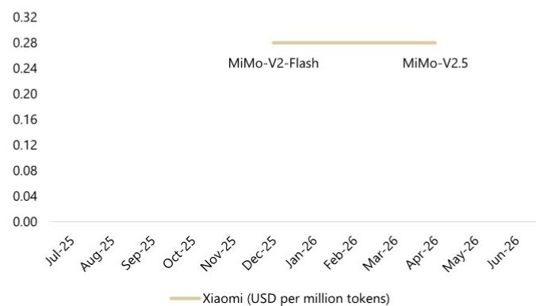  
Exhibit 25 - Tencent: Input price  
Source: Artificial Analysis, JEF

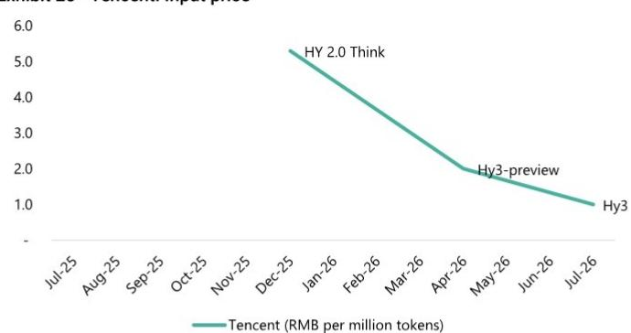  
Source: Company, JEF

Exhibit 26 - Tencent: Output price  
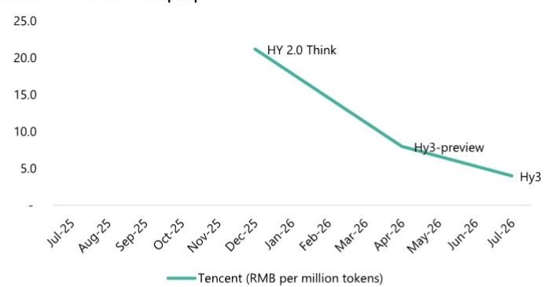

Exhibit 27 - Baidu: Input price  
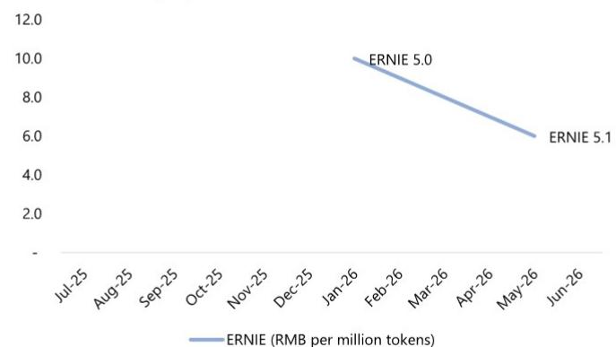  
Source: Company, JEF

Exhibit 28 - Baidu: Output price  
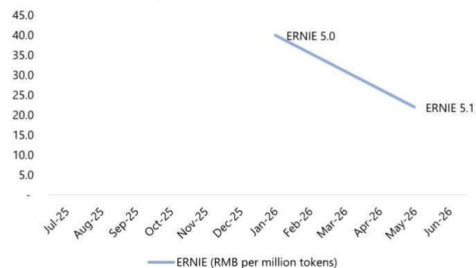  
Source: Artificial Analysis, JEF
Note: 32k < Input tokens <= 128k

Exhibit 29 - StepFun: Input price  
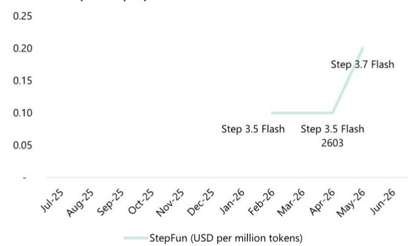  
Source: Artificial Analysis, JEF

Exhibit 30 - StepFun: Output price  
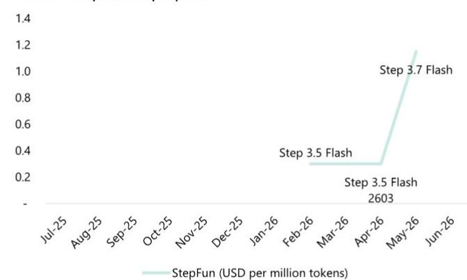  
Source: Artificial Analysis, JEF

Exhibit 31 - OpenAI: Input price  
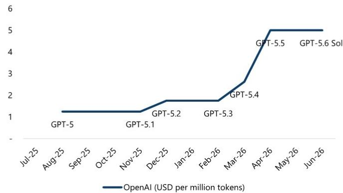  
Source: Artificial Analysis, JEF

Exhibit 32 - OpenAI: Output price  
  
Source: Artificial Analysis, JEF

Exhibit 33 - Anthropic Claude Opus: Input price  
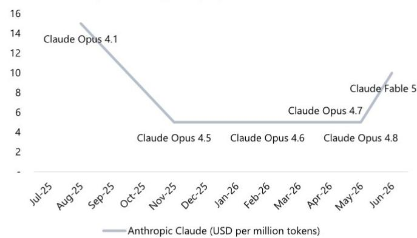  
Source: Artificial Analysis, JEF

Exhibit 34 - Anthropic Claude Opus: Output price  
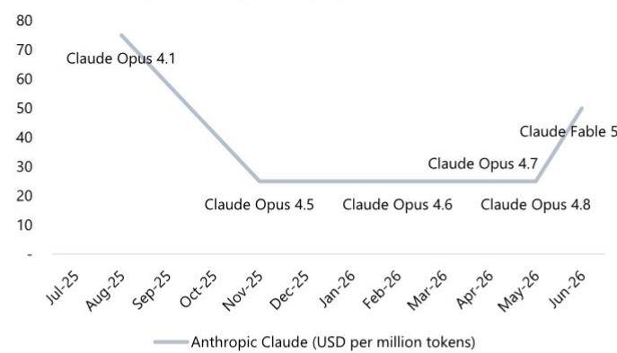  
Source: Artificial Analysis, JEF

Exhibit 35 - Anthropic Claude Sonnet: Input price  
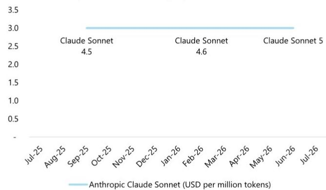  
Source: Artificial Analysis, JEF

Exhibit 36 - Anthropic Claude Sonnet: Output price  
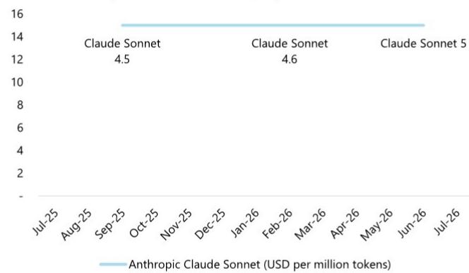  
Source: Artificial Analysis, JEF

We would like to thank Fiona Fan, employee of Evalueserve Inc., for providing research support services to our preparation of this report. We would like to thank Han Wang, employee of Evalueserve Inc., for providing research support services to our preparation of this report. We would like to thank Erica Qiu, employee of Evalueserve Inc., for providing research support services to our preparation of this report.

## Company Valuation/Risks

For Important Disclosure information on companies recommended in this report, please visit our website at https://avatar.bluematrix.com/sellside/Disclosures.action or call 212.284.2300.

## Analyst Certification:

I, Thomas Chong, certify that all of the views expressed in this research report accurately reflect my personal views about the subject security(ies) and subject company(ies). I also certify that no part of my compensation was, is, or will be, directly or indirectly, related to the specific recommendations or views expressed in this research report.

I, Zoey Zong, certify that all of the views expressed in this research report accurately reflect my personal views about the subject security(ies) and subject company(ies). I also certify that no part of my compensation was, is, or will be, directly or indirectly, related to the specific recommendations or views expressed in this research report.

Registration of non-US analysts: Thomas Chong is employed by JEF Hong Kong Limited, a non-US affiliate of JEF LLC and is not registered/qualified as a research analyst with FINRA. This analyst(s) may not be an associated person of JEF LLC, a FINRA member firm, and therefore may not be subject to the FINRA Rule 2241 and restrictions on communications with a subject company, public appearances and trading securities held by a research analyst.

Registration of non-US analysts: Zoey Zong is employed by JEF Hong Kong Limited, a non-US affiliate of JEF LLC and is not registered/qualified as a research analyst with FINRA. This analyst(s) may not be an associated person of JEF LLC, a FINRA member firm, and therefore may not be subject to the FINRA Rule 2241 and restrictions on communications with a subject company, public appearances and trading securities held by a research analyst. As is the case with all JEF employees, the analyst(s) responsible for the coverage of the financial instruments discussed in this report receives compensation based in part on the overall performance of the firm, including investment banking income. We seek to update our research as appropriate, but various regulations may prevent us from doing so. Aside from certain industry reports published on a periodic basis, the large majority of reports are published at irregular intervals as appropriate in the analyst's judgement.

## Investment Recommendation Record

## (Article 3(1)e and Article 7 of MAR)

Recommendation Published July 19, 2026 16:18 P.M.

Recommendation Distributed July 19, 2026 16:18 P.M.

## Company Specific Disclosures

Within the past twelve months, Kuaishou Technology has been a client of JEF Financial Group Inc., its affiliates or subsidiaries and investment banking services are being or have been provided.

JEF Financial Group Inc., its affiliates or subsidiaries is acting as a manager or co-manager in the underwriting or placement of securities for Kuaishou Technology or one of its affiliates.

Within the past 12 months, JEF Financial Group Inc., its affiliates or subsidiaries has received compensation from investment banking services from Kuaishou Technology.

JEF International Ltd, its affiliates or subsidiaries has, or had, within the past 12 months an agreement to provide investment services to Kuaishou Technology.

For Important Disclosure information on companies recommended in this report, please visit our website at https://javatar.bluematrix.com/sellside/Disclosures.action or call 212.284.2300.

## Explanation of JEF Ratings

Buy - Describes securities that we expect to provide a total return (price appreciation plus yield) of 15% or more within a 12-month period.

Hold - Describes securities that we expect to provide a total return (price appreciation plus yield) of plus 15% or minus 10% within a 12-month period.

Underperform - Describes securities that we expect to provide a total return (price appreciation plus yield) of minus 10% or less within a 12-month period. The expected total return (price appreciation plus yield) for Buy rated securities with an average security price consistently below \$10 is 20% or more within a 12-month period as these companies are typically more volatile than the overall stock market. For Hold rated securities with an average security price consistently below \$10, the expected total return (price appreciation plus yield) is plus or minus 20% within a 12-month period. For Underperform rated securities with an average security price consistently below \$10, the expected total return (price appreciation plus yield) is minus 20% or less within a 12-month period.

NR - The investment rating and price target have been temporarily suspended. Such suspensions are in compliance with applicable regulations and/or JEF policies.

CS - Coverage Suspended. JEF has suspended coverage of this company.

NC - Not covered. JEF does not cover this company.

Restricted - Describes issuers where, in conjunction with JEF engagement in certain transactions, company policy or applicable securities regulations prohibit certain types of communications, including investment recommendations.

Monitor - Describes securities whose company fundamentals and financials are being monitored, and for which no financial projections or opinions on the investment merits of the company are provided.

## Valuation Methodology

JEF' methodology for assigning ratings may include the following: market capitalization, maturity, growth/value, volatility and expected total return over the next 12 months. The price targets are based on several methodologies, which may include, but are not restricted to, analyses of market risk, growth rate, revenue stream, discounted cash flow (DCF), EBITDA, EPS, cash flow (CF), free cash flow (FCF), EV/EBITDA, P/E, PE/growth, P/CF, P/FCF, premium (discount)/average group EV/EBITDA, premium (discount)/average group P/E, sum of the parts, net asset value, dividend returns, and return on equity (ROE) over the next 12 months.

## JEF Franchise Picks

JEF Franchise Picks include stock selections from among the best stock ideas from our equity analysts over a 12 month period. Stock selection is based on fundamental analysis and may take into account other factors such as analyst conviction, differentiated analysis, a favorable risk/reward ratio and investment themes that JEF analysts are recommending. JEF Franchise Picks will include only Buy rated stocks and the number can vary depending on analyst recommendations for inclusion. Stocks will be added as new opportunities arise and removed when the reason for inclusion changes, the stock has met its desired return, if it is no longer rated Buy and/or if it triggers a stop loss. Stocks having 120 day volatility in the bottom quartile of S&P stocks will continue to have a 15% stop loss, and the remainder will have a 20% stop. Franchise Picks are not intended to represent a recommended portfolio of stocks and is not sector based, but we may note where we believe a Pick falls within an investment style such as growth or value.

## Risks which may impede the achievement of our Price Target

This report was prepared for general circulation and does not provide investment recommendations specific to individual investors. As such, the financial instruments discussed in this report may not be suitable for all investors and investors must make their own investment decisions based upon their specific investment objectives and financial situation utilizing their own financial advisors as they deem necessary. Past performance of the financial instruments recommended in this report should not be taken as an indication or guarantee of future results. The price, value of, and income from, any of the financial instruments mentioned in this report can rise as well as fall and may be affected by changes in economic, financial and political factors. If a financial instrument is denominated in a currency other than the investor's home currency, a change in exchange rates may adversely affect the price of, value of, or income derived from the financial instrument described in this report. To the extent prices are shown in non-US currency, please note that our local currency price targets are based on a currency conversion using an exchange rate as of the prior trading day (unless otherwise noted). Should there be fluctuations in the exchange rate after this date, that will affect the non-US target prices and should no longer be relied upon. In addition, investors in securities such as ADRs, whose values are affected by the currency of the underlying security, effectively assume currency risk.

## Other Companies Mentioned in This Report

• Alibaba Group Holding Limited (BABA: \$114.97, BUY)

• Baidu Inc. (BIDU: \$107.24, BUY)

• Kingsoft Cloud (KC: \$9.54, BUY)

• Kuaishou Technology (1024 HK: HK\$43.28, BUY)

• Meitu Inc (1357 HK: HK\$3.96, BUY)

\- MiniMax Group Inc. (100 HK: HK\$216.00, BUY)

• Tencent Holdings Ltd. (700 HK: HK\$461.60, BUY)

• Xiaomi Corporation (1810 HK: HK\$26.88, UNDERPERFORM)

<table><tr><td colspan="3">Distribution of Ratings</td><td colspan="2">IB Serv./Past12 Mos.</td><td colspan="2">JIL Mkt Serv./Past12 Mos.</td></tr><tr><td></td><td>Count</td><td>Percent</td><td>Count</td><td>Percent</td><td>Count</td><td>Percent</td></tr><tr><td>BUY</td><td>2237</td><td>62.63%</td><td>387</td><td>17.30%</td><td>110</td><td>4.92%</td></tr><tr><td>HOLD</td><td>1173</td><td>32.84%</td><td>94</td><td>8.01%</td><td>15</td><td>1.28%</td></tr><tr><td>UNDERPERFORM</td><td>162</td><td>4.54%</td><td>0</td><td>0.00%</td><td>0</td><td>0.00%</td></tr></table>

## Other Important Disclosure

## Other Important Disclosures

JEF does business and seeks to do business with companies covered in its research reports, and expects to receive or intends to seek compensation for investment banking services among other activities from such companies. As a result, investors should be aware that JEF may have a conflict of interest that could affect the objectivity of this report. Investors should consider this report as only a single factor in making their investment decision.

JEF Equity Research refers to research reports produced by analysts employed by one of the following JEF Financial Group Inc. ("JEF") companies:

United States: JEF LLC which is an SEC registered broker-dealer and a member of FINRA (and distributed by JEF Services, LLC, an SEC registered Investment Adviser, to clients paying separately for such research).

Canada: JEF Securities Inc., which is an investment dealer registered in each of the thirteen Canadian jurisdictions and a dealer member of the Canadian Investment Regulatory Organization, including research reports produced jointly by JEF Securities Inc. and another JEF entity (and distributed by JEF Securities Inc.).

Where JEF Securities Inc. distributes research reports produced by JEF LLC, JEF International Limited, JEF Japan Company Limited, or JEF India Private Limited, you are advised that each of JEF LLC, JEF International Limited, JEF Japan Company Limited, and JEF India Private Limited operates as a dealer in your jurisdiction under an exemption from the dealer registration requirements contained in National Instrument 31-103 Registration Requirements, Exemptions and Ongoing Registrant Obligations and, as such, each of JEF LLC, JEF International Limited, JEF Japan Company Limited, and JEF India Private Limited is not required to be and is not a registered dealer or adviser in your jurisdiction. You are advised that where JEF LLC or JEF International Limited prepared this research report, it was not prepared in accordance with Canadian disclosure requirements relating to research reports in Canada.

United Kingdom: JEF International Limited, which is authorized and regulated by the Financial Conduct Authority; registered in England and Wales No. 1978621; registered office: 100 Bishopsgate, London EC2N 4JL; telephone +44 (0)20 7029 8000; facsimile +44 (0)20 7029 8010.

Germany: JEF GmbH, which is authorized and regulated by the Bundesanstalt fuer Finanzdienstleistungsaufsicht, BaFin-ID: 10150151; registered office: Bockenheimer Landstr. 24, 60323 Frankfurt a.M., Germany; telephone: +49 (0) 69 719 1870

Hong Kong: JEF Hong Kong Limited, which is licensed by the Securities and Futures Commission of Hong Kong with CE number ATS546; located at Level 26, Two International Finance Center, 8 Finance Street, Central, Hong Kong; telephone: +852 3743 8000.

Singapore: JEF Singapore Limited, which is licensed by the Monetary Authority of Singapore; located at 10 Collyer Quay #41-01, Ocean Financial Centre, Singapore 049315, telephone: +65 6551 3950.

Japan: JEF Japan Company Limited, which is a securities company registered by the Financial Services Agency of Japan and is a member of the Japan Securities Dealers Association; located at Tokyo Midtown Hibiya 30F Hibiya Mitsui Tower, 1-1-2 Yuraku-cho, Chiyoda-ku, Tokyo 100-0006; telephone +813 5251 6100; facsimile +813 5251 6101.

India: JEF India Private Limited (CIN - U74140MH2007PTC200509), licensed by the Securities and Exchange Board of India for: Stock Broker (NSE & BSE) INZ000243033, Research Analyst INH000000701 and Merchant Banker INM000011443, located at Level 16, Express Towers, Nariman Point, Mumbai 400 021, India; Tel +91 22 4356 6000. Compliance Officer name: Sanjay Pai, Tel No: +91 22 42246150, Email: spai@JEF.com, Grievance officer name: Sanjay Pai, Tel no. +91 22 42246150, Email: compliance\_india@JEF.com. Registration granted by SEBI and certification from NISM in no way guarantee performance of the intermediary or provide any assurance of returns to investors.

Australia: JEF (Australia) Pty Limited (ACN
