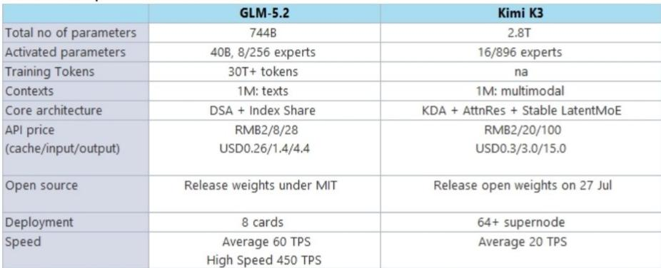

# JEF：中国大模型K3发布后智能与成本效率变化

月之暗面发布K3模型后，JEF在一份最新研报中系统梳理了中国大模型行业的关键变化。核心判断是：中国模型不仅在智能层面首次在部分基准上领先美国模型，而且在成本效率上保持显著优势，这一组合正在改变市场对国内AI产业链的定价逻辑。

K3在Frontend Code Arena中首次让中国模型在编码能力上领先美国模型。根据Arena数据，这是自2025年初DeepSeek-R1之后，中国模型再次接近甚至超越美国前沿模型的表现。月之暗面总裁张先生明确表示，Scaling Law仍然有效，K3远未达到模型智能的上限，发布次日ARR创下最快增速。

> **KC评论：** K3的2.8T参数规模并非终点。报告列举了即将发布的Qwen3.8（2.4T参数）、MiniMax M3 Pro、Zhipu GLM和腾讯Hy4等后续模型，这意味着未来几个月中国大模型的参数竞赛和智能迭代节奏不会变化。

## 1. 模型智能差距缩小但成本效率差距依然显著

根据Artificial Analysis的智能指数，中国模型在DeepSeek、Qwen、Kimi、MiniMax和Zhipu等厂商推动下，正在缩小与美国模型在智能层面的差距。2026年斯坦福AI指数报告显示，美国顶尖模型领先中国模型仅2.7%。在Arena Elo评分中，Anthropic、xAI、Google、OpenAI、阿里巴巴和DeepSeek占据第一梯队。

但在API成本端，中国模型展现出压倒性优势。JEF的对比数据显示，中国模型的混合价格仅为美国模型的几分之一。这一成本效率主要来自MoE架构、线性注意力和MFU优化。报告认为，在编码和Agentic AI场景中，成本效率模型正变得越来越重要。

## 2. Token支出指数持续走弱反映行业对成本敏感

一个值得关注的指标是硅数LLM Token支出指数。截至7月12日当周，该指数维持在1.56至1.61区间，低于7月5日当周的1.63至1.65，更远低于5月31日的2.04。Token消费总量在OpenRouter平台上过去12个月呈现波动，但近期并未出现爆发式增长。

这一数据与模型迭代速度形成对比。报告认为，Tokenmaxxing与token spending之间的讨论表明，在编码和Agentic AI场景中，成本效率模型的重要性正在上升。中国模型在成本端的优势，可能成为其获取市场份额的关键变量。

## 3. 融资重心转向算力，多家公司有望冲击10亿美元ARR

近期AI实验室的融资动态显示，算力成为资金配置的核心方向。DeepSeek完成70亿美元融资（2026年6月），智谱完成40亿美元融资（2026年7月），MiniMax完成20亿美元融资（2026年7月）。JEF认为，新融资可以在需求激增背景下强化各自的算力需求。

报告预期，多家公司有望在2026年或2027年初实现超过10亿美元的ARR，包括阿里巴巴、智谱、MiniMax、Kling和火山引擎。月之暗面的ARR在K3发布后的表现值得关注。在应用层面，腾讯的WorkBuddy正在获得市场关注，2026年3月桌面月访问量达到885万，领先于字节跳动的Trae、腾讯的QClaw和阿里巴巴的Qoder Work。

## 4. 智谱的Scaling策略与K3的差异化路径

智谱在电话会议中透露了其模型迭代策略。GLM-5.2的参数规模为744B，远小于K3的2.8T，但智谱认为当GLM-5.2扩展到K3的规模时，可以超越K3的能力。这一判断基于智谱在数据、环境、强化学习和基础设施四个方向的Scaling加速。

在基础设施层面，智谱的ZCube相比Clos降低33%成本并提升15%吞吐量，LayerSplit减少KV Cache并提升132%吞吐量。这些优化意味着，中国模型厂商正在通过工程创新来弥补参数规模上的差距，而非单纯堆叠算力。

> **KC评论：** 智谱GLM-5.2的API定价（输入2元/百万token，输出28元/百万token）显著低于K3（输入20元/百万token，输出100元/百万token），而部署仅需8张卡。这提示市场，模型竞争正在从单一智能指标转向“智能-成本-部署效率”的多维博弈。

## 5. 视频生成模型格局未变，应用层竞争加速

月之暗面联合创始人周新宇表示，当前焦点仍是模型智能，视频生成模型并非首要任务。火山引擎在6月发布了Seedance 2.5，认为视频生成占MaaS收入的一半以上。Kling则完成了新一轮融资，用于业务扩张和日常运营。

在应用端，阿里巴巴在WAIC期间发布了Meoo（多元化AI企业应用），百度展示了百度网盘、百度文库和小度等AI应用。金山办公上周举办了AI生产力大会，发布了灵犀专业版和WPS AI Hub。这些动作表明，模型层的竞争正在向应用层传导，但视频生成领域尚未出现格局性变化。

For informational purposes only. Portions may be generated,translated,summarized,or edited with AI assistance based on source materials and may contain omissions or errors. Please verify independently. This is not investment,legal,tax,accounting,or other professional advice.

For informational purposes only. Portions may be generated,translated,summarized,or edited with AI assistance based on source materials and may contain omissions or errors. Please verify independently. This is not investment,legal,tax,accounting,or other professional advice.

