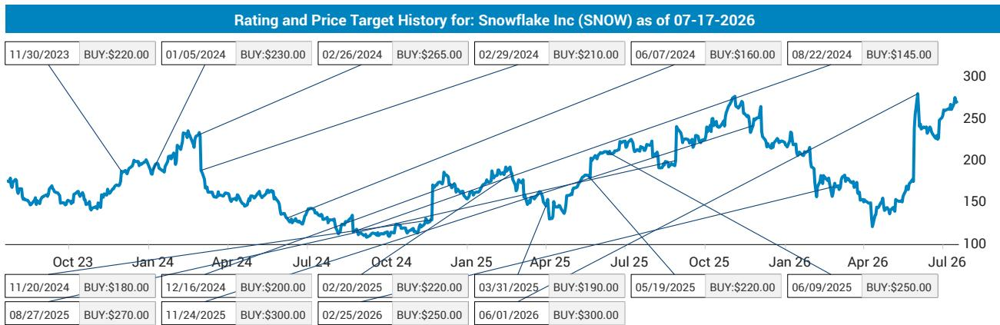
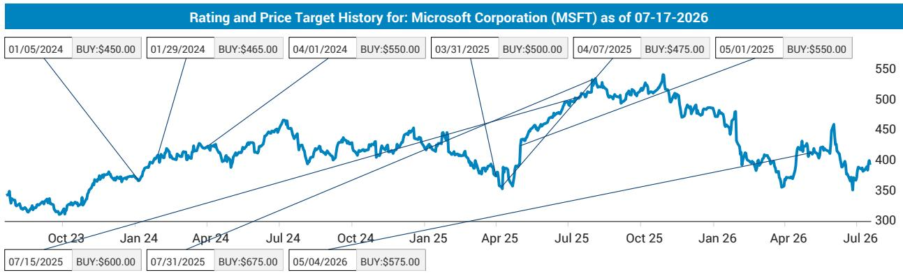
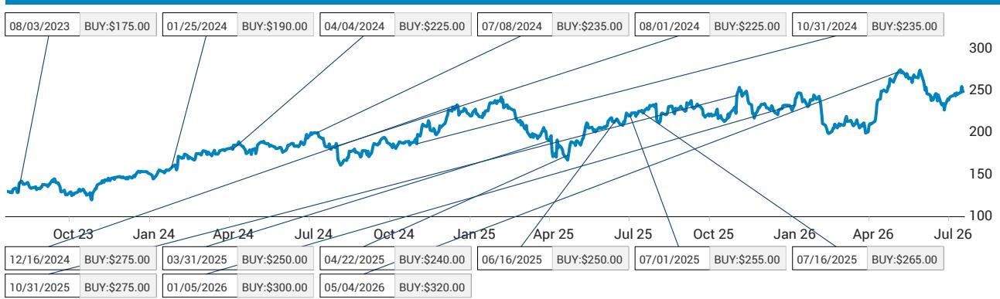

# Databricks 1880亿美元融资：数据云领域的价值信号

本季度企业软件领域最值得关注的事件，并非产品发布或财报表现，而是一笔私募市场的估值：Databricks正在以1880亿美元估值融资30亿美元，较2025年12月的1340亿美元估值提升了40%。这不仅仅是一次资本运作，更是对整个数据云生态系统的定价信号，直接挑战了市场当前对Snowflake的估值折价。

截至2026年中，Databricks的年化经常性收入约69亿美元，同比增长约80%（含大语言模型变现），核心业务增长约65%。相比之下，Snowflake在约55亿美元的可比收入基础上增长32%。增长差距确实存在，但估值差距已超出基本面所能解释的范围。

以1880亿美元隐含估值计算，假设Databricks在FY26至FY28期间以65%的复合增长率增长，其估值倍数约为FY28预期收入的17倍。Snowflake目前企业价值约1000亿美元，对应FY28收入约13倍。计算很简单：如果Snowflake获得即使折价后的15倍估值，其隐含企业价值将约为1150亿美元，对应股价约310美元，较当前水平有约15%的上行空间。问题不在于Snowflake是否值得更高估值，而在于市场是否会认识到数据云需求的上升浪潮将同时提升两家公司，当前的折价是一种异常现象。

本报告认为，Snowflake是Databricks私募市场验证的主要公开市场受益者。这一判断基于三个相互关联的支柱：GPU驱动的需求激增正在拉动整个类别向上、使两家公司都成为AI分析竞赛赢家的竞争动态，以及一个让观察者能够精确评估机会的决策框架。

## GPU容量紧张是企业AI需求的信号，验证了整个数据云类别

Databricks首席执行官明确表示，此次融资是由于多个地区的GPU容量接近耗尽。该公司“几乎耗尽了亚洲的GPU容量，且日本、韩国、美国和印度等国家的需求正在上升”。这不是一个局部问题，而是企业AI工作负载扩展速度超过基础设施供给能力的系统性信号。Databricks需要大量额外GPU，这一需求促成了30亿美元的融资，这向观察者传递了一个关键信息：AI驱动的数据分析需求并非假设，而是真实、全球性的，并且正在给供给带来压力。

对Snowflake而言，这是一个积极信号。GPU短缺并非Databricks独有，它反映了更广泛的企业对在大语言模型和AI增强数据平台上运行分析工作负载的需求。Snowflake自身的AI驱动产品，包括CoCo和CoWork，正在获得市场认可，早期采用指标正在上升。当双头垄断中的市场领导者因客户需求超出容量而融资购买GPU时，第二家公司同样受益于这一长期趋势。上升浪潮的比喻在此并非陈词滥调，而是一个结构性现实。Databricks和Snowflake都处于最佳位置，帮助组织理解其业务数据并应用AI更快、更高效地运行分析工作负载。GPU紧张证实了整体势头正在增强，而非仅针对某一供应商。

这对Snowflake估值的影响是直接的。如果市场认为Databricks的增长源于独特的、不可复制的优势，那么这种传导效应会减弱。但GPU短缺是供给侧的约束，而非需求侧的差异化因素。它表明整个类别都面临容量限制，这意味着Snowflake的增长轨迹很可能受益于同样的潜在需求激增。当前约4倍收入倍数的估值折价（13倍对17倍）并未反映这一共同趋势。

## AI原生分析产品正在重塑竞争格局，Snowflake和Databricks都在蚕食Palantir的市场

数据云领域最被低估的动态是AI原生分析正在侵入传统上由专业平台占据的领域。Databricks的Genie产品增加了企业上下文层和知识图谱，直接挑战Palantir的核心价值主张。Snowflake的CoCo和CoWork则从不同的架构起点做着同样的事情。结果是，两家领先的数据分析供应商正在使Palantir的竞争环境变得更加艰难，而非彼此之间。

这是一个关键细节。传统叙事将Databricks和Snowflake视为零和博弈中的直接竞争对手。数据表明并非如此。两家公司都在大力投资AI驱动分析，并且都看到了市场认可。Databricks的Genie Ontology提供了语义层，将企业数据组织成知识图谱，这一能力长期以来是Palantir的差异化优势。Snowflake的CoCo和CoWork产品旨在实现自然语言查询和协作数据工作，这些功能同样侵入了Palantir的领域。竞争压力是不对称的：数据云双头垄断正在向Palantir的利基市场扩张，而非彼此消耗。

对于Snowflake的观察者而言，这是一个积极的结构性发展。这意味着随着AI原生功能吸引原本需要专业平台的工作负载，总可寻址市场正在扩大。这也意味着Snowflake与Databricks之间的竞争强度虽然是真实的，但并非塑造市场的主导力量。主导力量是向AI增强数据分析的长期转变，两家公司都在乘着这波浪潮。Snowflake相对于Databricks的估值折价因此并非竞争劣势的反映，而是公开市场对增长可持续性的怀疑，这种怀疑在私募市场并不存在。

## 评估Snowflake机会的决策框架：三个汇聚信号支持估值扩张

观察者需要一种结构化的方式来评估Databricks融资事件是孤立数据点还是持续重估的开始。以下框架将关键信号综合成一个决策矩阵。

**信号一：私募市场估值下限。** Databricks的1880亿美元估值意味着在65%复合增长率下，FY28预期收入的17倍估值。即使Snowflake的同比增长率约为Databricks的一半，公开市场仍应用了约4倍的折价（13倍对17倍），这无法完全由增长差异解释。较低增长的合理折价可能是2-3倍，而非4倍。私募市场实际上为整个类别的估值倍数设定了下限，而Snowflake的交易价格远低于此。

**信号二：GPU需求验证。** Databricks需要专门为购买GPU融资，且多个地区的GPU容量已耗尽，这证实了企业AI需求是供给受限而非需求受限。这是对整个类别的宏观验证。Snowflake的消费模式意味着，随着企业扩展AI工作负载，Snowflake的收入将同步增长。GPU紧张是未来消费增长的领先指标。

**信号三：AI产品采用拐点。** Databricks的Genie和Snowflake的CoCo/CoWork都在获得市场认可，早期采用指标正在上升。这不是一个推测性的产品线故事，而是已证明的产品市场契合正在转化为使用量。对Snowflake而言，CoCo的自然语言查询和CoWork的协作分析相结合，创造了一个粘性平台，加深了企业的依赖。在Snowflake上运行的AI工作负载越多，转换成本越高，净留存率也越强，目前为126%，而Databricks为140%。

这三个信号的综合得出一个清晰结论：当前的估值折价是一种错误定价，随着市场吸收Databricks融资的影响，这种折价很可能会得到修正。FY28收入的15倍估值（仍低于Databricks的隐含倍数）将仅部分缩小差距。

## 消费模式为增长减速提供了自然对冲，使估值扩张论点更具防御性

关于Snowflake的一个持续担忧是其消费模式，这比传统SaaS订阅模式带来的收入可见性更低。这是一个合理的风险，但在当前环境下也是一种结构性优势。当企业AI需求激增时，消费模式比订阅模式更直接地捕捉上行空间。Snowflake无需重新谈判合同即可从使用量增加中受益。随着客户运行更多查询、训练更多模型、处理更多数据，收入会自动增长。

这一动态在GPU驱动的需求激增背景下尤为相关。扩展AI基础设施的企业也在生成更多数据、运行更多分析工作负载、消耗更多计算资源。Snowflake的平台是这一循环的自然受益者。消费模式意味着Snowflake的收入增长与企业AI采用之间存在直接的因果关系，而不仅仅是相关性。

此外，126%的净留存率表明现有客户正在显著扩大支出。这不是一个流失或收缩的客户群，而是一个正在加深承诺的客户群。高净留存率与消费模式的结合创造了一种复合效应，这在静态远期估值倍数中并未完全体现。随着现有客户基础的增长和消费的扩大，收入轨迹变得更加可预测，而非更不可预测。可见性担忧是一种过时的叙事，并未反映当前企业AI采用加速的现实。

对估值扩张论点的启示是下行风险有限。即使Snowflake的增长减速超出预期，消费模式也确保了收入基础具有粘性且正在扩大。FY28收入的9倍估值（下行情景）意味着股价约180美元，较当前水平下跌约33%。这是一个有意义的下行空间，但并非灾难性结果。风险回报的不对称性有利于上行情景，尤其是在私募市场验证的背景下。

## 对企业采购者的战略启示：数据云双头垄断正在巩固地位，采购决策应反映这一现实

对于企业技术采购者而言，Databricks的融资和Snowflake的估值折价除了投资组合构建之外，还具有实际意义。数据云市场正在围绕两个主导平台整合，GPU容量限制可能会加速这一整合。正在评估数据分析平台的企业应认识到，竞争格局正在收窄而非扩大。

Databricks和Snowflake正在开发的AI原生功能正在创造一种功能护城河，小型竞争对手难以复制。数据湖仓架构、知识图谱和自然语言界面的结合需要大量基础设施和AI研究投入。Databricks正在融资30亿美元用于此类投入。Snowflake也在大力投入研发，FY25研发支出占收入的24.3%。在这一领域竞争所需的资本正在升级，结果是双头垄断格局可能在可预见的未来持续。

对于正在做出采购决策的企业，这有两个启示。首先，小型数据分析供应商的长期可行性日益不确定。GPU军备竞赛和AI功能竞赛正在创造有利于规模的门槛。其次，随着两家平台嵌入深度集成到企业工作流中的AI原生功能，Databricks与Snowflake之间的转换成本正在上升。选择某一平台的企业正在做出长期承诺，决策应基于架构契合度而非短期定价考虑。

战略要点是，数据云正在成为基础设施层，而不仅仅是应用层。Databricks和Snowflake都在将自己定位为企业AI的操作系统，估值倍数反映了这一雄心。Snowflake当前相对于Databricks的折价是一个暂时异常，随着市场认识到其地位的相似性，这一折价很可能会缩小。GPU紧张、AI产品拐点和私募市场验证都指向同一方向。上升浪潮是真实的，Snowflake是随之上升的船只之一。

*仅供参考。部分内容可能基于源材料通过AI辅助生成、翻译、总结或编辑，可能存在遗漏或错误。请独立验证。本文不构成专业建议。*

仅供参考。部分内容可能基于源材料通过AI辅助生成、翻译、总结或编辑，可能存在遗漏或错误。请独立验证。本文不构成专业建议。

