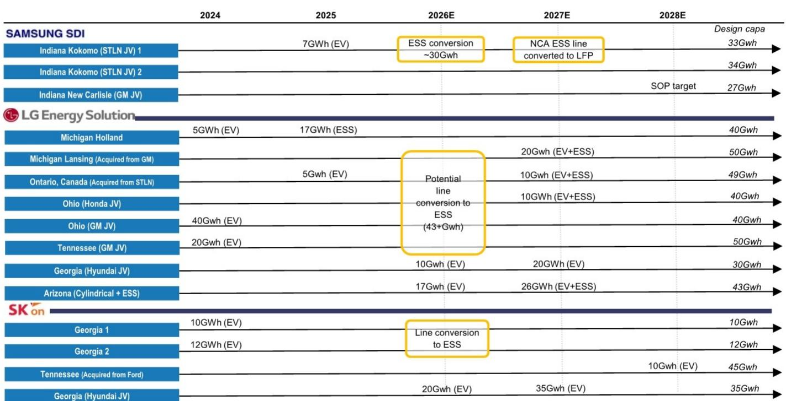
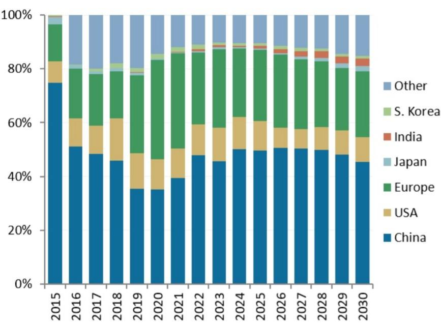

# 韩国电池制造商面临三重竞争格局：电动汽车增长分化，新需求方向浮现

全球电池产业已不再是单一的增长叙事。对于韩国电池制造商——LG新能源、三星SDI和SK On——竞争格局已分化为三个截然不同的领域，每个领域都有各自的需求驱动因素、监管框架和竞争动态。电动汽车市场曾是其单一的增长引擎，如今正成为一个成熟且区域分化的业务。与此同时，两个新的需求前沿——与人工智能基础设施相关的储能系统以及人形机器人——正以截然不同的时间线和结构性优势浮现。韩国电池制造商面临一项战略要务：他们必须同时应对中国企业在电动汽车领域的竞争，将闲置产能转向储能系统以抓住美国政策保护下的市场机会，并尽早布局机器人电池业务，该业务到本世纪中叶可能达到与汽车业务相当的规模。

形势至关重要。根据报告估算，全球纯电动汽车销售渗透率预计将从2025年的约15%上升到2030年的超过40%，但这一总体数字掩盖了关键的分化。在中国，纯电动汽车渗透率已超过30%且仍在加速。在欧洲，尽管近期目标有所放宽，监管要求仍在支撑增长。然而，在美国，联邦电动汽车税收抵免政策到期后，纯电动汽车销售面临较大压力，同比增速转负，混合动力汽车更受消费者青睐。韩国电池制造商曾基于电动汽车需求持续增长的预期建设美国产能，如今却发现自身在一个已发生变化的市场中过度暴露。将电动汽车生产线转换为储能系统，既是战术上的必要之举，也是一项可能在未来十年重新定义其业务组合的战略押注。

## 美国电动汽车市场变化促使韩国电池制造商重新审视其最大制造布局

韩国电池制造商近期面临的最具干扰性的变化，是联邦电动汽车税收抵免到期后美国纯电动汽车销售的明显放缓。报告中的美国月度纯电动汽车销售数据显示了一个清晰的转折点：2024年初强劲的增长率在2025年末转为负值，并持续低迷至2026年中。渗透率曾稳步攀升至约10%，现已停滞。更值得注意的是，混合动力汽车销售激增，吸收了原本可能流向纯电动汽车的需求。这并非暂时现象；它反映了美国消费者经济结构的变化，即7500美元补贴的取消扩大了纯电动汽车与混合动力汽车之间的总拥有成本差距。

这一放缓对韩国制造商而言正值脆弱时刻。LG新能源、三星SDI和SK On已共同在美国的超级工厂产能上投资了数百亿美元，其中大部分是与通用汽车、福特、Stellantis、现代和本田等汽车制造商合资建设。报告对主要客户销售的追踪显示，作为LG新能源关键销量驱动力的通用汽车基于Ultium平台的电动汽车销售波动较大且低于初期预期。由SK On供货的福特电动汽车销售同样未达预期。结果是已安装产能与利用率之间存在显著差距，鉴于电池制造的高固定成本特性，这一问题侵蚀了盈利能力。

报告中记录的战略应对措施是大规模将闲置的电动汽车生产线转换为储能系统制造。三星SDI计划将其印第安纳州科科莫的合资生产线从电动汽车转换为储能系统，转移约30吉瓦时的产能。LG新能源正在将其密歇根州霍兰德的工厂从5吉瓦时的电动汽车产出改造为17吉瓦时的储能系统产出，并收购了通用汽车和福特在密歇根州和安大略省的前工厂用于混合动力电动汽车-储能系统生产。SK On也在改造其佐治亚州的生产线。总体而言，报告估算显示，最初指定用于美国电动汽车生产的超过100吉瓦时产能正在或将被重新导向储能系统。这并非边际调整；而是一次根本性的资本与生产战略重新配置。

## 储能系统成为政策保护下由人工智能驱动的增长引擎

转向储能系统不仅是防御性举措；它得益于美国独特的有利政策环境，该环境明确使中国竞争者处于不利地位。报告强调了两个为韩国电池制造商创造受保护市场的机制。首先，针对独立储能系统的投资税收抵免仍然有效，为满足国内含量要求的储能系统项目提供30%的抵免。其次，第45X条先进制造生产税收抵免包含一项非外国关注实体含量要求，该要求随时间逐步提高，到2029年达到80%。这意味着韩国制造商在美国使用排除中国组件的供应链生产的储能系统电芯和模组，有资格获得中国竞争对手无法获得的重大生产税收抵免。

这一等式的需求侧同样引人注目。报告估算，仅2025年美国储能系统电芯需求就增长了约57吉瓦时，并预计到2030年将达到279吉瓦时。驱动因素不仅是电网规模的可再生能源存储，还有来自人工智能数据中心激增的电力需求。建设人工智能训练和推理基础设施的超大规模企业需要大规模、可靠且波动性最小的电力，而电池存储是与可再生能源发电共址的关键赋能技术。这创造了一个比汽车行业周期性更弱、受消费者补贴风险影响更小的需求特征。

根据报告中的模型，美国储能系统电芯的供需平衡显示市场在2028年前将趋紧，韩国制造商有望抓住增量产能。将电动汽车生产线转换为储能系统在运营上是合理的，因为底层电芯化学和制造工艺相似，尤其是磷酸铁锂和镍钴铝化学体系。三星SDI将其科科莫的镍钴铝储能系统生产线转换为磷酸铁锂的计划，进一步说明了制造商如何根据终端市场需求变化在不同化学体系之间切换。报告明确指出的关键风险在于执行：转换生产线并非一蹴而就，任何在改造或认证上的延迟都可能让中国竞争对手通过替代渠道获得立足点。

## 中国电池制造商正在欧洲抢占市场份额，而韩国企业份额下滑

欧洲的竞争格局与美国形成鲜明对比。当韩国电池制造商在美国转向储能系统时，他们在欧洲电动汽车电池市场正被中国制造商夺走份额。报告的市场份额数据显示，自2024年以来，韩国电池制造商在欧洲的合计份额持续下降，而宁德时代和比亚迪等中国企业则扩大了存在。这并非周期性波动；它反映了竞争优势的结构性转变。

中国电池制造商受益于较低的原材料成本、更整合的供应链以及激进的定价策略。报告的正极成本趋势分析显示，锂、镍、钴等关键原材料价格已显著下降，这使所有制造商受益，但那些以有利条件锁定长期供应协议的中国生产商获益更大。更重要的是，中国制造商在磷酸铁锂化学体系上实现了成本领先，随着汽车制造商寻求提供更实惠的电动汽车，该体系在欧洲市场的份额正在增长。历史上在镍钴锰和镍钴铝化学体系上实力较强的韩国制造商，如今正竞相开发有竞争力的磷酸铁锂产品，但他们处于追赶状态。

战略含义令人不安。在欧洲，韩国电池制造商正面临中国成本优势与欧洲汽车制造商对本地化和有竞争力定价要求的两面夹击。报告关于欧洲纯电动汽车销售的数据显示，同比增速强劲，尤其是在北欧和中欧，因此市场并未萎缩。但韩国制造商并未抓住其应有的增长份额。如果成本竞争力没有显著提升或缺乏差异化的技术优势，他们在欧洲的地位将继续下滑。这使得美国储能系统转向作为利润避风港更为关键，但也提出了一个长期问题：韩国制造商能否维持所需的研发投入，以在三个地区同时在汽车和储能系统领域竞争？

## 人形机器人代表一个世纪级的机遇，需要当下开始投入

报告最具前瞻性的论点是，人形机器人将在本世纪中叶成为最大的电池需求驱动力，预计到2050年总可寻址市场规模达7.5万亿美元，保有量达10亿台。人形机器人的电池需求预计到2030年达到2吉瓦时，2040年达到120吉瓦时，2050年达到650吉瓦时，每台设备需要2-4千瓦时的电池容量。这些数字在短期内较小，但在二十年内将累积到非凡的规模。

这一机遇对韩国电池制造商的战略意义在于价值链的性质。报告描绘了一系列涵盖机器人全栈的合作伙伴关系，从软件到硬件再到驱动。韩国制造商已通过与机器人公司的关系以及在高能量密度、高可靠性电池电芯方面的现有专长，嵌入这一生态系统。人形机器人需要轻量化、安全且能在长工作周期内持续输出功率的电池——这些规格与韩国制造商擅长的优质镍钴锰和镍钴铝化学体系高度契合。

关键洞察在于，人形机器人市场不会由主导汽车电池的同类大宗商品规模、低成本制造来服务。其性能要求更高，产量更小，且对可靠性的支付意愿更强。这为在先进化学体系和品质控制方面拥有深厚专长、而非仅靠成本竞争的制造商创造了天然竞争优势。韩国电池制造商有机会在中国竞争对手扩大其优质产品规模之前，在这一新兴市场建立主导地位。

挑战在于时间线。报告的预测显示，人形机器人的实质性电池需求要到2030年代才会显现，这意味着当前在研发、试验线和客户合作伙伴关系上的投入，在数年内不会产生显著收入。这需要一定程度的战略耐心，而在核心电动汽车业务面临利润压力时，这种耐心难以维持。成功的制造商将是那些能够用储能系统和精选电动汽车合同的利润来补贴机器人电池开发，同时保持技术优势的企业——当机器人市场迎来拐点时，这一优势将至关重要。

## 韩国电池制造商的决策框架：按区域、化学体系和终端市场分配产能

报告的数据为韩国电池制造商如何从地理、化学体系和终端市场三个维度分配资源，提供了一个结构化的决策框架。

在地理上，明确的优先事项是美国，政策保护和人工智能驱动的储能系统需求创造了最有利的利润池。欧洲需要防御性策略：维持现有客户关系，有选择地投资磷酸铁锂产能，接受较低的市场份额，而不是与中国竞争对手进行无法取胜的价格战。鉴于地缘政治紧张局势和本土企业的主导地位，中国市场对韩国制造商而言实际上已关闭，因此不应在此进行有意义的投资。

在化学体系上，决策更为微妙。磷酸铁锂在中国和欧洲的大众市场电动汽车领域占据优势，但利润率较低，属于大宗商品业务。韩国制造商应仅在必要时聚焦磷酸铁锂以留住关键汽车制造商客户，而应优先将镍钴锰和镍钴铝用于储能系统和高端电动汽车，在这些领域其技术优势可转化为定价能力。人形机器人机遇几乎肯定需要下一代化学体系，如固态或高硅负极，这证明了即使没有近期收入，持续进行研发投入的合理性。

在终端市场上，分配正变得更加清晰。面向美国市场的电动汽车电池生产应限制在与已承诺的原始设备制造商合作伙伴关系相匹配的现实需求水平，任何过剩产能都应转换为储能系统。储能系统生产应积极扩张，利用非外国关注实体政策的有利条件和人工智能数据中心的结构性需求。人形机器人应被视为风险投资式的投入：规模小、风险高，但具有不对称的上行潜力。最有效地执行这一分类管理的制造商，将从当前的转型期脱颖而出，拥有更强的利润率和更多元化的收入基础。

不作为的风险在数据中显而易见。韩国电池制造商在欧洲的市场份额已在下降。他们在美国的电动汽车工厂利用率不足。他们的中国竞争对手正在积极投资磷酸铁锂和下一代化学体系。报告对全球电动汽车电池总可寻址市场的预测显示持续增长，但增长的分布正从韩国制造商历来较强的领域转移。战略重新定位的窗口现已打开，但不会无限期保持开放。那些能够转换产能、重新分配研发资源并致力于储能系统和机器人机遇的制造商，将定义该行业的未来十年。

仅供参考。部分内容可能基于源材料通过人工智能辅助生成、翻译、总结或编辑，可能存在遗漏或错误。请独立核实。本文不构成任何专业建议。

