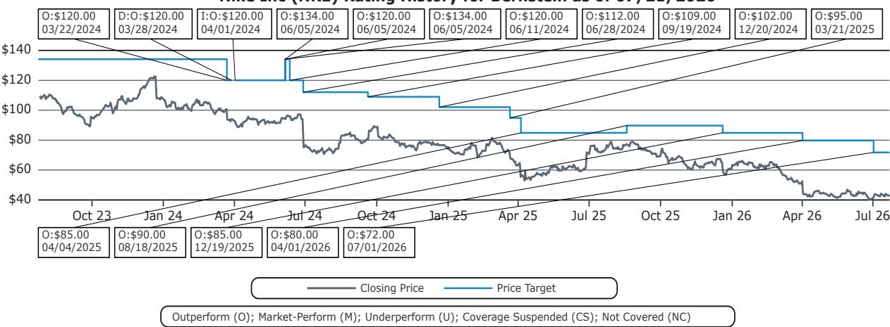
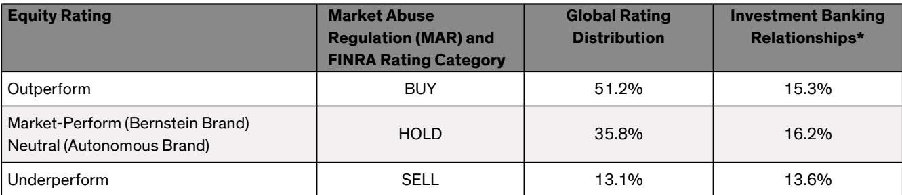

# Nike调整中国分销渠道：从批发线上到品牌直营的战略转型

Nike已通知其两大中国分销合作伙伴——滔搏运动和宝胜国际，将从2027年1月起停止通过其线上店铺销售产品。滔搏运动披露，Nike线上渠道约占其中国营收的22%；宝胜国际的该比例约为15%。两家公司将继续通过其线下门店网络分销Nike产品。这并非一次小规模的战术调整，而是对现有收入来源的有意重构。

Nike大中华区副总裁兼总经理Cathy Sparks表示，当前市场已变得过于“碎片化和杂乱”。她的目标并非减少消费者触达，而是降低碎片化程度、强化消费者体验。Nike官方线上店铺——包括Nike.com及其在天猫、京东和抖音的旗舰店——将不受影响。信息很明确：Nike希望在中国拥有与客户的数字化直接关系，并愿意为此牺牲批发线上销量。

受此调整影响，Nike预计2027财年上半年中国区业务将以两位数幅度下降。考虑到中国区占Nike总业务的12%，这意味着未来几个季度整体营收将面临约2至3个百分点的短期影响。对于一家正在努力恢复增长和品牌热度的公司而言，这是可预见的成本。但从战略逻辑看，长期回报——更清晰的定价、更强的品牌资产以及直接面向消费者的数字生态——可能足以弥补这一短期代价。

这一举措代表了Nike对待其最大增长市场的方式发生了根本性转变。这不是对需求疲软的反应，而是主动选择重构中国渠道架构，即使这意味着短期内压缩报表收入。

## Nike以批发线上销量换取定价、品牌呈现和消费者数据的掌控权

Nike中国业务的核心矛盾在于，通过分销商运营的线上店铺产生了大量低质量、促销驱动的线上销售。这些渠道侵蚀了全价销售、稀释了品牌认知，并造成了一个碎片化的数字环境，使Nike的产品叙事难以保持一致。通过切断对滔搏运动和宝胜国际的线上供货，Nike实际上是在移除其中国数字商务中的中间环节。

机制很简单。目前，Nike以批发价向分销商销售库存，分销商再通过自己的线上店铺进行销售。这些分销商有动力快速清库存，通常通过打折方式。这种打折直接与Nike自己的全价数字渠道竞争。通过切断这一供应，Nike迫使所有线上需求流向其自控店铺——Nike.com、天猫旗舰店、京东旗舰店和抖音旗舰店。Nike设定价格、控制呈现方式并获取消费者数据。

代价是即时的收入压缩。批发收入在向分销商发货时确认，而直接面向消费者的收入在向终端客户销售时确认。即使终端需求保持不变，收入的确认时点也会发生变化。更重要的是，Nike正在有意识地减少流入线上渠道的商品数量，以消除打折行为。以更高的全价实现更低的销量，是明确的目标。

对观察者而言，这意味着Nike的中国收入结构将随时间推移向利润率更高的直接面向消费者销售倾斜。批发利润率在结构上低于直营利润率。随着Nike用自有数字销售取代分销商线上销售，中国业务的毛利率状况应会改善——前提是Nike能够维持或扩大通过自有渠道实现的全价销售相对量。风险在于，如果消费者不转向官方店铺，Nike可能完全失去这部分销量。

## 短期收入影响可控，但利润表现取决于全价销售转化率

相关分析显示，Nike预计2027财年上半年中国区业务将以两位数幅度下降，这意味着对公司整体营收约2至3个百分点的压力。对于一家仍在努力稳定北美业务并重建市场信心的公司而言，这确实是一个显著影响。但这一幅度需要放在具体背景中理解。

收入下降并非需求问题，而是渠道重构问题。Nike选择向批发线上渠道投放更少的库存。从批发线消失的收入，将随着消费者购买行为的转变，逐步被直营收入部分或完全替代。关键变量是转化率——Nike能通过自有数字店铺以全价捕获多少流失的分销商线上销量。

如果Nike能以全价捕获80%的销量，收入影响将远小于仅捕获50%且需打折的情况。利润影响则更为有利，因为直营毛利率通常比批发毛利率高出10至15个百分点。一个规模较小但利润率更高的收入基础，可以产生可比甚至更高的相对毛利润。

风险在于执行。Nike的自有数字店铺必须能够处理增量需求。消费者体验必须无缝衔接。Nike还必须抵制利用自有渠道进行促销清货的诱惑，否则将重蹈它试图解决的碎片化问题。公司公开表态显示其理解这一风险。Cathy Sparks明确将此举描述为强化消费者体验，而不仅仅是减少触达。

## 这一举措为评估Nike中国复苏提供了清晰的观察框架

观察Nike中国渠道重构可从四个维度入手：收入结构变化、利润率走势、合作伙伴稳定性以及竞争反应。

第一，收入结构。随着批发线上销量下降，Nike中国收入中直营占比将上升。问题在于，中国总收入在初期压缩后能否稳定。如果直营增长能在四至六个季度内抵消批发下降，则重构成功。如果直营增长停滞，Nike将永久性地缩小其在中国的可触达市场。

第二，利润率走势。中国直营毛利率在结构上高于批发毛利率。随着结构变化，即使收入持平，Nike中国业务利润率也应扩大。利润率扩大的幅度取决于Nike在自有渠道上开展多少促销活动。如果Nike保持全价纪律，利润率扩大可能显著。如果Nike诉诸打折以推动直营销量，利润率收益将被削弱。

第三，合作伙伴稳定性。滔搏运动和宝胜国际将继续通过线下门店分销Nike产品。它们的线上收入损失是真实的，但两家公司均表示影响可控。滔搏运动CEO将其描述为短期压力，将创造更健康的生态。宝胜国际则认为利润影响不显著。两家合作伙伴公开表示支持，表明Nike妥善处理了合作关系。风险在于，更依赖线上销售的小型分销商可能面临更大冲击，甚至退出Nike生态。

第四，竞争反应。阿迪达斯、安踏和李宁等竞争对手将密切关注这一转变。如果Nike直营增长加速，竞争对手可能效仿，引发中国更广泛的行业向品牌自有数字渠道转型。如果Nike受挫，竞争对手将有机会抢占Nike放弃的批发线上销量。竞争动态将在实施开始后六至十二个月变得更加清晰。

## 长期战略逻辑合理，但执行风险集中在消费者迁移和竞争反应

支持Nike此举的最有力论据是，它使公司的渠道结构与品牌战略保持一致。Nike希望在中国成为一个以运动为主导的优质品牌。优质品牌不会在碎片化、促销驱动的分销环境中蓬勃发展。通过将线上销售整合到自有店铺，Nike可以呈现一致的品牌形象、讲述更丰富的产品故事，并建立支持忠诚度和终身价值的直接消费者关系。

该战略最薄弱的环节是假设中国消费者会无缝地从分销商店铺迁移到Nike官方渠道。中国消费者是高度成熟的数字购物者。他们使用多个平台、跨店铺比价，并对促销敏感。如果Nike官方渠道不提供有竞争力的定价、配送速度或产品组合，消费者可能会将支出转向竞争品牌，而非迁移到Nike的数字生态。

二级风险在于，Nike的直营渠道可能成为促销活动的主要场所，在不同层面重现碎片化问题。如果Nike为了弥补批发线上销量损失而在其天猫旗舰店大量投放打折产品，品牌损害将与其试图解决的问题类似。区别在于Nike将拥有数据和利润，但消费者对折扣驱动品牌的认知将持续存在。

一份全球投行报告维持的估值暗示，市场相信中国区重构最终将增强Nike的盈利能力。短期影响是真实的，但利润率和品牌控制的改善应会随时间累积。

## 未来四个季度的三个可观察节点

观察Nike中国渠道重构是否顺利，可关注三个节点。

第一，中国收入稳定速度。如果中国收入在初期下降后两个季度内稳定，表明直营迁移速度快于预期。如果下降持续超过三个季度，则表明Nike正在向竞争对手流失销量，或消费者未向官方渠道迁移。

第二，中国毛利率走势。如果重构后两至三个季度内中国毛利率扩大200至300个基点，则确认结构向直营转变正在改善盈利能力。如果毛利率持平或下降，则表明Nike正在利用促销推动直营销量，这将削弱战略合理性。

第三，合作伙伴行为。如果滔搏运动和宝胜国际维持或增加线下门店订单，表明线下渠道保持健康。如果它们减少整体Nike订单，则表明线上调整正在损害更广泛的合作关系。

这三个节点提供了一个清晰、数据驱动的框架，用于评估Nike中国战略是否有效。逻辑很简单：Nike接受短期收入代价，以换取长期利润率和品牌收益。证据将在未来四个季度的财务报告中显现。

*仅供参考。部分内容可能基于源材料通过AI辅助生成、翻译、摘要或编辑，可能存在遗漏或错误。请独立核实。本文不构成任何专业建议。*

仅供参考。部分内容可能基于源材料通过AI辅助生成、翻译、摘要或编辑，可能存在遗漏或错误。请独立核实。本文不构成任何专业建议。

