# China CDMO

## China CDMO: 多肽CDMO研究系列之一——供给侧领先企业在规模、成本与技术广度上的差异化优势

  
Rebecca Liang, Ph.D.  
+852 2123 2656  
rebecca.liang@bernsteinsg.com

Ellie Li

+852 2123 2621

ellie.li@bernsteinsg.com

本报告是CDMO系列研究的第一篇。我们从多肽行业的供给侧回顾开始。后续报告将探讨GLP-1驱动的需求增长、多肽市场规模测算以及长期供需平衡。

**一个日益由规模化平台主导的分散化行业。** 多肽CDMO格局涵盖三大群体：多元化的CRDMO——赛默飞和药明康德等，专业多肽领导者——Bachem、PolyPeptide、CordenPharma，以及众多新兴供应商。历史上，多肽外包由具备深厚生产专长的专业公司主导，但代谢类多肽的快速增长日益青睐能够大规模部署资金和产能的供应商。中国CRDMO是GLP-1热潮的主要受益者。前四大多肽CDMO的收入从2021年的约10亿美元扩大到2025年的30亿美元。药明康德的TIDES业务从1.2亿美元增长至17亿美元，市场份额从11%提升至54%，而凯莱英的多肽业务在较小的基数上于2025年加速增长至124%。相比之下，Bachem和PolyPeptide的增长较为温和，分别为中个位数和十几个百分点，因为市场增长日益集中于大规模代谢类多肽项目。

**成本结构差异显著。** 尽管处于同一价值链，多肽CDMO之间的盈利能力差异很大。药明康德在2025年实现了约47%的毛利率和37%的息税前利润率，处于行业领先水平，而Bachem（已在西方多肽企业中领先）的息税前利润率约为22%，PolyPeptide和EuroAPI则接近盈亏平衡。造成这种经济差异的一个主要因素是规模。产能披露很少，我们更倾向于以公吨为单位的多肽产量而非反应器体积来衡量生产规模。药明康德仍是明确的行业领导者，2025年多肽产量估计为58公吨，但其下行业分散在多个层级：Corden和凯莱英处于10-20吨区间，而Bachem、PolyPeptide及其他中国多肽专业公司通常在1-10吨区间。众多区域性供应商的年产能仍低于1吨。

**技术和效率是超越产能的进一步差异化因素。** 基础多肽能力，如环肽和订书肽，现已广泛适用于大多数领先供应商。差异化日益来自偶联技术、可持续性和执行速度。药明康德和凯莱英在多肽-寡核苷酸、放射性核素及其他先进偶联物方面提供最广泛的技术组合，而药明康德和Bachem在工艺效率和废物减少方面似乎领先。中国参与者通常也比西方同行提供更短的多肽IND到NDA时间线，这加强了它们在多肽创新扩展到日益复杂模式时的竞争地位。

## BERNSTEIN 代码表

<table><tr><td rowspan="2"></td><td colspan="4">2026年7月22日</td><td>TTM</td><td colspan="4">报告EPS</td><td colspan="3">报告P/E (x)</td></tr><tr><td colspan="2"></td><td rowspan="2">收盘价</td><td rowspan="2">目标价</td><td rowspan="2">相对表现</td><td rowspan="2">货币</td><td rowspan="2">2025A</td><td rowspan="2">2026E</td><td rowspan="2">2027E</td><td rowspan="2">2025A</td><td rowspan="2">2026E</td><td rowspan="2">2027E</td></tr><tr><td>代码</td><td>评级</td><td>货币</td></tr><tr><td>002821.CH (凯莱英)</td><td>O</td><td>CNY</td><td>164.28</td><td>198.00</td><td>29.7%</td><td>CNY</td><td>3.16</td><td>4.04</td><td>6.07</td><td>22.5%</td><td>38.6%</td><td>56.5%</td></tr><tr><td>603259.CH (药明康德)</td><td>O</td><td>CNY</td><td>125.90</td><td>168.00</td><td>19.8%</td><td>CNY</td><td>6.72</td><td>6.36</td><td>7.37</td><td>40.1%</td><td>4.8%</td><td>16.9%</td></tr><tr><td>2269.HK (药明生物)</td><td>M</td><td>HKD</td><td>38.84</td><td>42.00</td><td>5.2%</td><td>CNY</td><td>1.22</td><td>1.54</td><td>1.85</td><td>31.8</td><td>25.3</td><td>21.0</td></tr><tr><td>6821.HK (凯莱英)</td><td>O</td><td>HKD</td><td>118.90</td><td>157.00</td><td>(7.4)%</td><td>CNY</td><td>3.16</td><td>4.04</td><td>6.07</td><td>32.5</td><td>25.4</td><td>16.9</td></tr><tr><td>2359.HK (药明康德)</td><td>O</td><td>HKD</td><td>156.70</td><td>204.00</td><td>38.3%</td><td>CNY</td><td>6.72</td><td>6.36</td><td>7.37</td><td>20.1</td><td>21.3</td><td>18.3</td></tr><tr><td>ASIAX</td><td></td><td></td><td>1,909.09</td><td></td><td></td><td></td><td></td><td></td><td></td><td></td><td></td><td></td></tr></table>

O - 跑赢大市, M - 与大市同步, U - 跑输大市, NR - 未评级, CS - 暂停覆盖

002821.CH, 603259.CH 估值为报告EPS复合年增长率；

来源：彭博，Bernstein估计与分析。

## 研究启示

我们给予药明康德和凯莱英"跑赢大市"评级；药明生物"与大市同步"评级。

## 多肽CDMO概述

## 格局：一个由少数规模化领导者锚定的分散化行业

多肽CDMO行业仍然高度分散，但参与者可根据规模和战略重点大致分为三类。第一类包括大型多元化CRDMO，企业收入超过10亿美元，包括赛默飞（由Eve Burstein覆盖）、药明康德、EuroAPI（由Justin Smith覆盖）和凯莱英。虽然多肽通常只占其更广泛服务组合的一部分，但这些公司受益于全球客户渠道、整合的开发到商业化平台以及雄厚的资金资源。

其次是专业多肽CDMO，主要专注于多肽及相关模式如寡核苷酸。关键参与者包括Bachem（未覆盖）、PolyPeptide Group（未覆盖）和CordenPharma（私营，未覆盖），每家公司的多肽相关收入在1-10亿美元区间。它们以悠久历史、多肽特定专长和监管记录为特色，使其成为创新药公司的首选合作伙伴。历史上，它们通过专业生产专长主导了多肽外包。然而，代谢类多肽的快速扩张日益吸引了能够大规模部署资金的大型CRDMO的竞争。

最后，较小的CDMO和拥有多肽生产业务的制药/生物技术公司包括众多参与者。中国的一些公司（九州药业、博腾股份和普洛药业，均未覆盖）正在扩大其在原料药和中间体CDMO方面的多肽业务，并迅速增加产能（图表1）。

## 收入与市场份额演变：药明康德（以及紧随其后的凯莱英）的崛起

竞争格局在过去五年发生了显著变化。在领先的多肽CDMO中，合并收入从2021年的约10亿美元扩大到2025年的30亿美元，主要受GLP-1和其他代谢类多肽需求的推动。药明康德是最大的受益者，TIDES收入从2021年的约1.2亿美元增至2025年的17亿美元，复合增长率超过70%，推动市场份额从11%提升至54%（图表4）。2020年代初期早期和积极的产能投资使该公司能够捕获行业增长中不成比例的份额。

相比之下，传统多肽专业公司的增长较为温和。Bachem的多肽收入从2023年的7.16亿美元增至2025年的8.62亿美元，而PolyPeptide从3.65亿美元增至4.44亿美元，两者均以个位数至十几位数的速度增长。尽管两者仍是具有强大技术能力的领先供应商，但随着行业增长日益集中于大规模代谢类多肽，它们的市场份额逐渐被稀释。与此同时，凯莱英在2025年的收入仍较小，为1.52亿美元，但正进入快速增长阶段，2025年收入增长加速至124%（图表5）。随着新建多肽产能的爬坡，凯莱英是另一个未来潜在的市场份额获得者。总体而言，近年来的行业增长主要由中国CRDMO引领，而西方专业多肽CDMO尽管持续扩张，但增长较慢。

图表1：全球领先多肽CDMO的财务与运营指标

<table><tr><td rowspan="2">公司名称</td><td rowspan="2">公司类型</td><td colspan="4">财务指标</td><td colspan="3">运营指标</td></tr><tr><td>2025年总收入（百万美元）</td><td>2025年资本支出/销售额</td><td>2025年ROIC</td><td>2026年收入增长3%</td><td>最新多肽产能</td><td>2025年多肽项目数</td><td>核心合成方法</td></tr><tr><td>药明康德</td><td>大型多元化C(R)DMO</td><td>6,818（集团）；1,705（TIDES）</td><td>12%</td><td>38%</td><td>18% - 22%（集团）40%（TIDES）</td><td>100kL SPPS；2025年估计产量58吨</td><td>472（D&M）</td><td>SPPS</td></tr><tr><td>凯莱英</td><td>大型多元化C(R)DMO</td><td>1,001（集团）；154（多肽）</td><td>19%</td><td>10%</td><td>19% - 22%（集团）</td><td>45kL SPPS；2026年69kL</td><td>52</td><td>SPPS</td></tr><tr><td>Corden Pharma</td><td>大型多元化C(R)DMO</td><td>1,094（集团）；约6002（多肽）</td><td></td><td></td><td></td><td>>17kL SPPS；2028年目标>42kL</td><td></td><td>SPPS + LPPS + 混合</td></tr><tr><td>EUROAPI Active Solutions for Health</td><td>大型多元化C(R)DMO</td><td>972（集团）；71（大分子）</td><td>9%</td><td>0%</td><td>下降10%</td><td>2025年法兰克福工厂约500kg</td><td>约20-30个大分子项目4</td><td>SPPS</td></tr><tr><td>BACHEM</td><td>专业TIDES CDMO</td><td>862</td><td>47%</td><td>6%</td><td>35% - 45%</td><td>全球6个多肽生产基地</td><td>152（化学、生产和控制）</td><td>SPPS</td></tr><tr><td>PolyPeptide GROUP</td><td>专业TIDES CDMO</td><td>447（集团）；252（代谢类）</td><td>28%</td><td>1%</td><td>20% - 25%</td><td>全球6个多肽生产基地</td><td>47（37个临床+10个商业）</td><td>SPPS</td></tr><tr><td>MT</td><td>专业TIDES CRDMO</td><td>86</td><td>23%</td><td>27.8%（2025年香港IPO）</td><td></td><td>>1吨原料药生产</td><td>1,614（328个CDMO，9个NCE GLP-1）</td><td>SPPS + LPPS + 混合</td></tr><tr><td>SINOPEP诺泰生物</td><td>其他1</td><td>291（集团）；72（CDMO）</td><td>70%</td><td>5.5%</td><td></td><td>64.7kL SPPS；2025年第二季度6.2吨</td><td></td><td>SPPS</td></tr><tr><td>圣诺生物</td><td>其他1</td><td>111（集团）；17（CDMO）</td><td>26%</td><td>8.8%</td><td></td><td>2025年第四季度2.5吨；目标10吨</td><td>40+（20+个临床+3个商业）</td><td>SPPS</td></tr></table>

注：1. 其他代表较小的CDMO或拥有多肽CDMO业务的制药/生物技术公司；2. BernE假设Corden多肽业务占总收入的60%；3. 公司指引；4. BernE基于其2022年披露
来源：公司披露，Bernstein分析与估计

图表2：按业务重点划分的全球多肽CDMO市场格局  
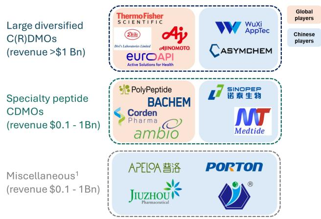  
注：1. 代表较小的CDMO或拥有多肽CDMO业务的制药/生物技术公司；Ambio于2026年被Corden收购  
来源：公司披露，Bernstein分析  
图表3：赛默飞和药明康德锚定参与多肽的CDMO格局，共同占据三分之二的市场  
参与多肽的领先CDMO市场份额

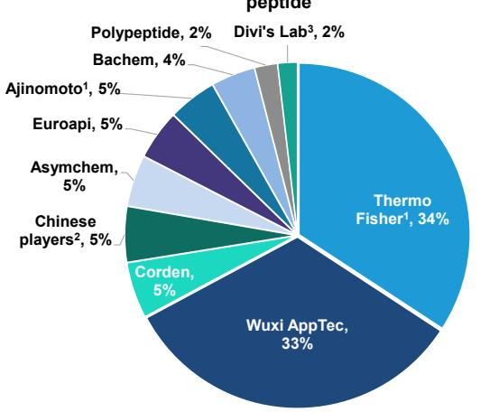  
注：1. CDMO业务收入；2. 中国参与者包括诺泰生物、圣诺生物、迈百瑞、九州药业和普洛药业；3. Divi's CDMO收入估计假设CDMO贡献总收入的35-40%。  
来源：公司披露，Bernstein分析与估计

图表4：收入趋势显示领先多肽参与者持续扩张，药明康德增长轨迹较强  
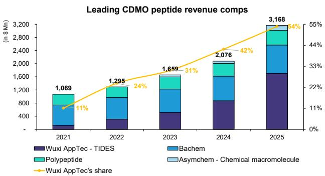  
注：* 未单独披露多肽收入时使用公司总收入  
来源：公司披露，Bernstein分析

图表5：药明康德和凯莱英显著超越全球同行，产能扩张推动多肽收入快速增长  
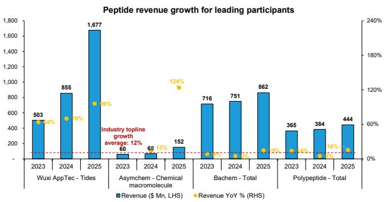  
来源：公司披露，Bernstein分析

## 参与者基准：规模、成本结构和技术

## 规模：尽管行业披露有限，药明康德处于自身稳固水平

由于公开披露有限，评估多肽生产规模仍具挑战性。在主要多肽CDMO中，只有药明康德和凯莱英以千升为单位披露了总多肽产能，2025年分别报告约100kL和45kL，并计划在2026年分别扩张至130kL和69kL。对于大多数其他参与者，产能必须从单个站点披露、已宣布的扩张、收入规模和行业调研中推断。更重要的是，我们认为以公吨为单位的多肽产量比以kL为单位的反应器体积是更好的衡量标准，因为生产力受多肽长度、负载、收率和批次配置的显著影响。在此基础上，药明康德自成一类，2025年估计产量约为58公吨，而大多数同行仍在个位数到低两位数公吨的范围内，突显了药明康德在GLP-1扩张周期中建立的显著规模优势（图表6）。

## 大批量能力仍是一个差异化因素

报告的商业批次大小因供应商而异，反映了技术平台、多肽复杂性和客户组合的差异。大多数领先的多肽CDMO的平均商业批次大小约为15-30公斤，只有少数参与者拥有持续执行更大规模活动的记录（图表7）。

## 中国产能扩张尚未全球化

以药明康德和凯莱英为首的中国参与者积极扩张多肽产能，现已跻身全球最大供应商之列。然而，与Bachem、PolyPeptide和Corden等西方同行（其生产网络分布在北美和欧洲）不同，中国领导者的多肽产能目前几乎全部集中在中国境内。虽然药明康德计划到2028年在新加坡增加多肽生产产能，但地理多元化目前仍然有限，这使得中国供应商更容易受到客户对供应链集中和地缘政治风险的担忧（图表8）。

图表6：全球多肽CDMO产能比较（以公吨计）  
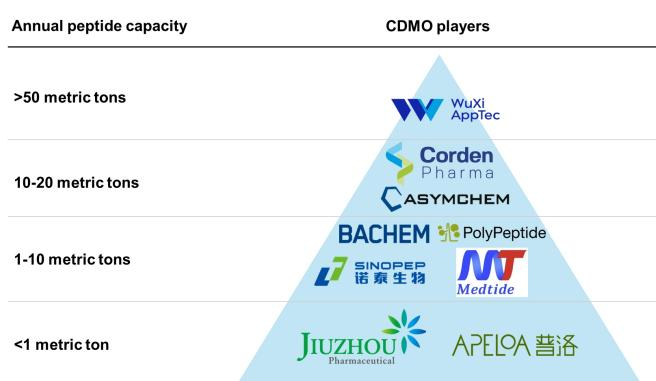  
注：凯莱英的年多肽产能基于其报告的反应器体积（kL）估算

图表7：多肽生产批次规模基准

<table><tr><td>公司</td><td>批次大小</td></tr><tr><td>药明康德</td><td>基于年产量估计平均批次大小25-30公斤1</td></tr><tr><td>凯莱英</td><td>每批约30公斤（SPPS）；>100公斤规模能力（LPPS）</td></tr><tr><td>CordenPharma</td><td>12-10,000升反应器；克级到每批400公斤</td></tr><tr><td>Bachem</td><td>商业多肽生产，批次容量>15公斤</td></tr><tr><td>PolyPeptide</td><td>未披露；估计与Bachem相当（>15公斤）</td></tr></table>

注：1. 基于2025年2000批次和58公吨估计多肽产量。未披露最大批次大小  
来源：公司披露，Bernstein分析与估计  
来源：公司披露，Bernstein分析与估计

图表8：全球领先CDMO的多肽生产与开发站点格局

<table><tr><td></td><td>美国</td><td>中国</td><td>世界其他地区</td></tr><tr><td rowspan="3">多肽产能（kL）</td><td>药明康德（TIDES）</td><td>100（FY25）130（FY26）</td><td>新加坡（FY28）</td></tr><tr><td>凯莱英</td><td>45（FY25）69（FY26）</td><td></td></tr><tr><td>Corden</td><td>17（FY25）~42（FY28）</td><td></td></tr><tr><td rowspan="5">站点分布</td><td>药明康德（TIDES）</td><td>10%</td><td>20%</td></tr><tr><td>凯莱英</td><td>14%</td><td>0%</td></tr><tr><td>Corden</td><td>33%</td><td>67%</td></tr><tr><td>Bachem</td><td>33%</td><td>67%</td></tr><tr><td>Polypeptide</td><td>33%</td><td>67%</td></tr></table>

来源：公司披露，Bernstein分析

## 不同的成本结构

尽管处于同一多肽价值链，领先多肽CDMO的盈利能力差异显著。药明康德在2025年以47%的毛利率和37%的息税前利润率脱颖而出，其销售成本占收入的53%，在同行中最低。值得注意的是，随着TIDES收入占比的提高，其集团层面的利润率随时间推移而改善。相比之下，欧洲专业多肽参与者的盈利能力明显较低：Bachem的息税前利润率约为22%，而PolyPeptide和EuroAPI在2025年仍接近盈亏平衡（图表9）。

药明康德是行业内最积极的产能建设者。多肽CDMO之间最大的战略差异化因素是资本部署。自2020年以来，药明康德的支出一直超过所有同行，从2020年的4.6亿美元增至2022年的约15亿美元，之后在2025年仍保持在8.31亿美元的高位。相比之下，2025年Bachem的资本支出约为4.08亿美元，凯莱英为1.91亿美元，PolyPeptide为1.24亿美元，EuroAPI为8900万美元（图表12）。这一多年投资周期使药明康德在GLP-1需求浪潮之前就位，并使该公司能够在代谢类多肽生产全球扩张时捕获增量外包需求中不成比例的份额。

ROIC差异显著——药明康德持续表现优异。资本支出强度和投入资本回报率在同行群体中也存在显著差异。历史上，Bachem和PolyPeptide的资本支出与销售额比率较高，为25-45%，而药明康德的比率在2021年达到约30%的峰值，随后在2025年下降至约12%，因为收入增长开始超过增量投资（图表13）。更重要的是，药明康德展示了同行中较强的ROIC复苏之一，ROIC从2021年的十几位百分比扩大到2025年的约38%（图表14），这得益于新建设施的快速利用（图表15）。相比之下，几位西方同行在最近的扩张周期中经历了ROIC下降或低迷，这突显了大规模多肽工厂投产后快速填满产能的重要性。

图表9：药明康德和凯莱英产生显著更高的息税前利润率，而多肽专业公司将更大比例的收入分配给生产成本。  
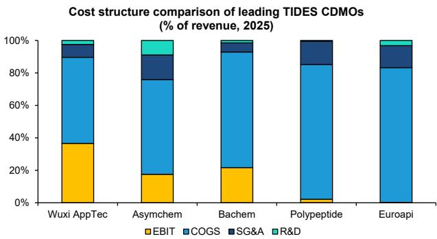

图表10：自2023年以来多肽合成仪产能扩张加速，推动药明康德产量阶跃式增长  
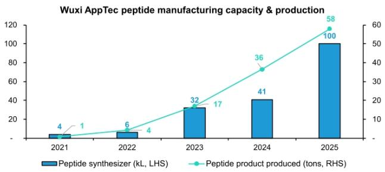  
来源：公司披露，Bernstein分析

来源：公司披露，Bernstein分析  
图表11：药明康德TIDES：快速收入扩张推动利润率提升  
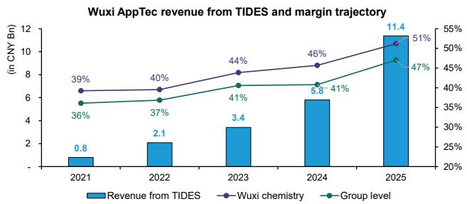  
来源：公司披露，Bernstein分析

图表12：相对值上，药明康德是多肽CDMO领域最大的资本支出者......  
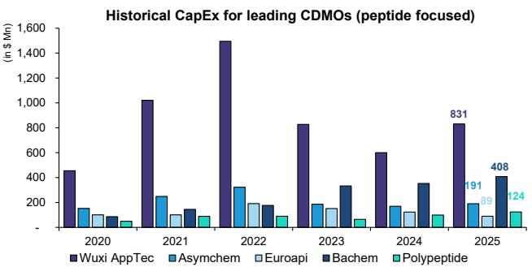  
来源：公司披露，Bernstein分析

图表13：......而按资本支出与销售额之比，Bachem是投资最密集的参与者

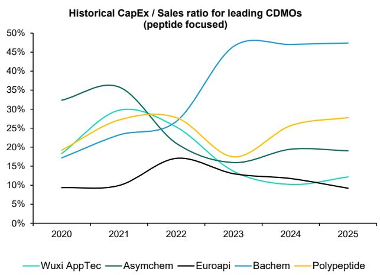  
来源：公司披露，Bernstein分析  
图表14：药明康德在ROIC方面领先同行，展示出卓越的资本效率

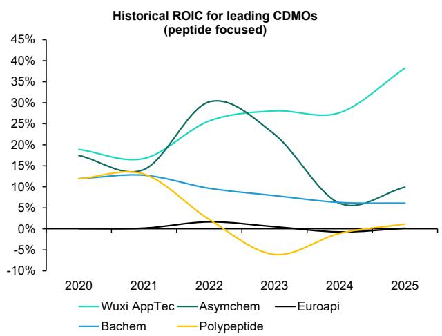  
来源：公司披露，Bernstein分析  
工厂爬坡期*（月）

图表15：药明康德更高的ROIC由更快的工厂爬坡和利用率/生产力提升驱动

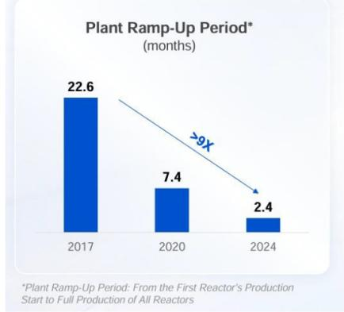  
API设备利用率持续提升

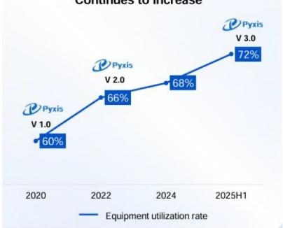

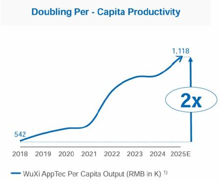  
来源：药明康德2025年读者日

## 技术广度与工艺效率

多种多肽模式：基础多肽模式如环肽和烃订书肽现已广泛适用于大多数领先多肽CDMO。在多肽偶联的广度上存在更大区别。虽然与小分子、脂质、碳水化合物和蛋白质等的多肽偶联更为常见，但药明康德和凯莱英已开发出与寡核苷酸和放射性核素等较新模式的多肽偶联物。随着药物研究中多靶点和跨模式方法的增长趋势，我们认为偶联技术是超越简单生产规模的重要差异化因素（图表16-图表17）。

物料与废物管理及可持续性：多肽生产是一个资源密集且高污染的过程。由于重复的偶联、脱保护、洗涤和纯化步骤，多肽合成产生的工艺质量强度（PMI）大约是传统小分子生产的50-100倍，导致大量溶剂消耗和废物产生。因此，领先供应商已投资于更绿色的化学、溶剂回收、工艺强化和改进的树脂技术以减少废物。在同行中，我们认为药明康德和Bachem是管理溶剂和废物的技术领导者（这并不意外，也反映在其高于同行的毛利率中），在商业规模上降低PMI的同时提高生产效率（图表18）。

更快的开发时间线是中国参与者的另一个优势。对于多肽开发者而言，上市速度和商业化速度已成为越来越重要的考虑因素。根据披露的时间线，中国参与者通常提供比西方同行更短的IND和NDA时间线（图表19）。

图表16：药明康德和凯莱英提供最广泛的多肽技术组合

<table><tr><td rowspan="2">公司</td><td colspan="4">多肽种类</td><td colspan="6">多肽偶联</td></tr><tr><td>环肽</td><td>烃订书肽</td><td>用于多肽/寡核苷酸的LNP制剂</td><td>CEPS与合成生物学</td><td>小分子/PEG</td><td>脂质/碳水化合物</td><td>蛋白质</td><td>寡核苷酸</td><td>放射性核素</td><td>抗体</td></tr><tr><td>药明康德</td><td>√</td><td>√</td><td>√</td><td>√</td><td>√</td><td>√</td><td>√</td><td>√</td><td>√</td><td>√</td></tr><tr><td>凯莱英</td><td>√</td><td>√</td><td>√</td><td>√</td><td>√</td><td>√</td><td>√</td><td>√</td><td>√</td><td>√</td></tr><tr><td>Corden</td><td>√</td><td>√</td><td>√</td><td></td><td>√</td><td>√</td><td></td><td></td><td></td><td></td></tr><tr><td>Bachem</td><td>√</td><td>√</td><td></td><td></td><td>√</td><td></td><td>√</td><td></td><td></td><td></td></tr><tr><td>Polypeptide</td><td>√</td><td>√</td><td></td><td></td><td></td><td>√</td><td>√</td><td></td><td></td><td></td></tr></table>

来源：公司披露，Bernstein分析

## 图表17：TIDES中的偶联药物模式及偶联管线扩张

药明康德TIDES管线中的偶联药物数量

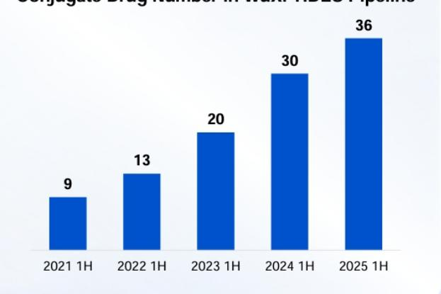  
来源：药明康德

图表18：多肽生产可持续性基准

<table><tr><td>类别/公司</td><td>PMI1/可持续性指标</td><td>备注</td></tr><tr><td>典型小分子原料药</td><td>PMI：约170-300</td><td>物料强度显著较低</td></tr><tr><td>典型多肽原料药</td><td>PMI：约13,000-14,000</td><td>多肽生产资源与溶剂强度显著更高</td></tr><tr><td rowspan="2">药明康德（TIDES）</td><td>溶剂优化</td><td>实施溶剂优化和回收计划，总溶剂使用量减少25%，用可持续替代品替代50%的DMF</td></tr><tr><td>PMI降至<3,659</td><td>与传统多肽生产工艺相比，PMI降低3-4倍</td></tr><tr><td rowspan="2">Bachem</td><td>有机溶剂使用量减少高达60%</td><td>利用绿色化学计划改善工艺可持续性</td></tr><tr><td>纯化溶剂消耗减少>30%</td><td>连续色谱的早期采用者，提高纯化效率</td></tr></table>

注：1. PMI（工艺质量强度）衡量每单位质量原料药生产所使用的原材料、试剂、溶剂和水的总质量  
来源：公司披露，Bernstein分析

图表19：全球领先CDMO的多肽IND与NDA交付时间线矩阵

<table><tr><td>公司</td><td>多肽到IND时间线</td><td>多肽到NDA时间线</td></tr><tr><td>药明康德</td><td>4 - 6个月</td><td>12 - 15个月</td></tr><tr><td>凯莱英</td><td>3 - 6个月</td><td>12 - 18个月</td></tr><tr><td>Corden</td><td>约11个月（含DP）</td><td>15 - 24个月</td></tr><tr><td>Bachem</td><td>6 - 9个月</td><td>18 - 24个月</td></tr><tr><td>PolyPeptide</td><td>6 - 9个月</td><td>18 - 24个月</td></tr></table>

来源：公司披露，Bernstein分析

## 多肽合成基础

## 合成法与重组法生产

多肽可以通过化学合成或重组生物工艺生产。重组生产使用工程微生物或哺乳动物细胞以生物学方式表达多肽，使其非常适合较长的肽链和类蛋白质分子，无需非天然氨基酸或化学修饰。相比之下，当今大多数商业上重要的多肽药物是通过化学方法生产的，通常使用固相肽合成（SPPS），这允许对序列修饰和偶联进行精确控制（图表20-图表21）。

## 司美格鲁肽：一种混合方法

司美格鲁肽代表了有史以来最成功的商业多肽之一，但其生产方式与大多数现代代谢类多肽不同。诺和诺德（由Justin Smith覆盖）使用一种混合工艺，其中多肽主链首先通过重组表达产生，然后进行化学修饰和偶联步骤。多肽前体通过生物学方式生成，随后连接到一条脂肪酸侧链上，该侧链可延长半衰期并实现每周一次给药。

## 替尔泊肽：SPPS和LPPS生产的典型案例

替尔泊肽是Mounjaro和Zepbound中的活性成分，它体现了当今大多数代谢类多肽的生产方式。该分子主要通过化学工艺生产，从固相肽合成（SPPS）开始，其中氨基酸逐步构建到树脂载体上。对于更Daiwa更复杂的多肽，生产商通常将SPPS与液相肽合成（LPPS）结合使用，其中分别合成的片段在最终偶联和纯化之前连接在一起。在替尔泊肽的案例中，四个多肽片段被合成、组装，随后用其特征性的脂肪酸链进行修饰，创造了一条高度可扩展的生产路线，现已被领先的多肽CDMO广泛采用（图表22-图表24）。

## 多肽生产价值链概述

多肽生产始于一个相对专业化的供应链，包括氨基酸、树脂和偶联试剂，这些是合成的基本构建块。这些材料通过SPPS或LPPS转化为多肽中间体，然后进行片段缩合和序列修饰（如脂化或订书化），用于更复杂的分子。所得粗肽随后必须经过裂解、脱保护、纯化和冻干，才能成为活性药物成分（API）。最后，API进入药品生产，通过制剂、无菌灌装和包装将分子转化为最终交付给患者的注射或口服药物（图表25）。

图表20：代表性商业化多肽药物及其生产——化学合成比重组生产更常用

<table><tr><td>品牌名</td><td>通用名</td><td>药物靶点</td><td>治疗适应症</td><td>主要生产方法</td></tr><tr><td>Ozempic / Wegovy</td><td>司美格鲁肽</td><td>GLP-1R</td><td>2型糖尿病，肥胖/体重管理</td><td>混合（重组主链+化学修饰）</td></tr><tr><td>Mounjaro / Zepbound</td><td>替尔泊肽</td><td>GIPR / GLP-1R（双激动剂）</td><td>2型糖尿病，肥胖/体重管理</td><td>化学（SPPS / LPPS混合）</td></tr><tr><td>Victoza / Saxenda</td><td>利拉鲁肽</td><td>GLP-1R</td><td>2型糖尿病，肥胖/体重管理</td><td>混合（重组主链+化学修饰）</td></tr><tr><td>Copaxone</td><td>醋酸格拉替雷</td><td>MHC II类分子（免疫调节剂）</td><td>复发型多发性硬化症（MS）</td><td>化学（溶液/固相聚合）</td></tr><tr><td>Trulicity</td><td>度拉糖肽</td><td>GLP-1R</td><td>2型糖尿病</td><td>重组DNA（哺乳动物细胞培养）</td></tr><tr><td>Sandostatin</td><td>奥曲肽</td><td>SSTR（生长抑素受体，主要为SSTR2/5）</td><td>肢端肥大症，严重腹泻/类癌综合征</td><td>化学（SPPS）</td></tr><tr><td>Lupron / Eligard</td
