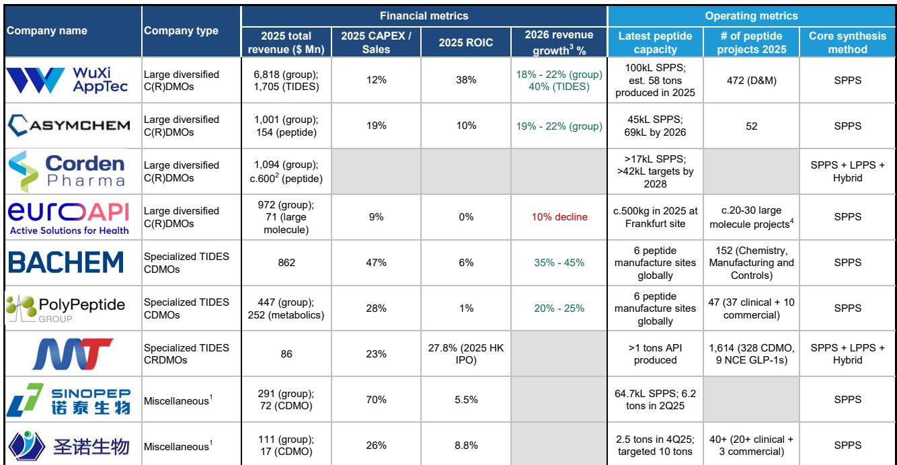
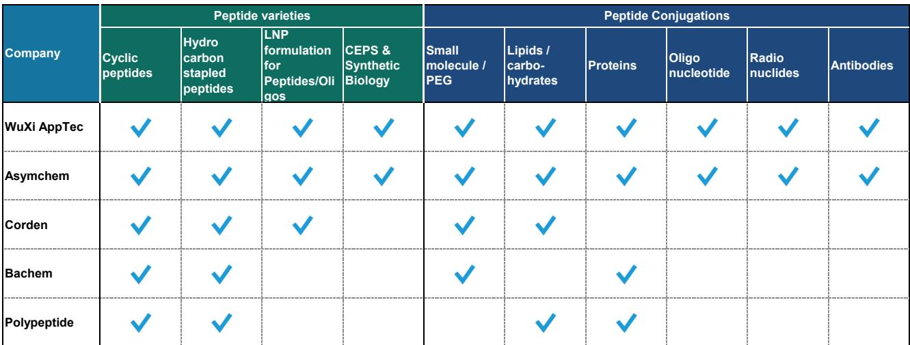
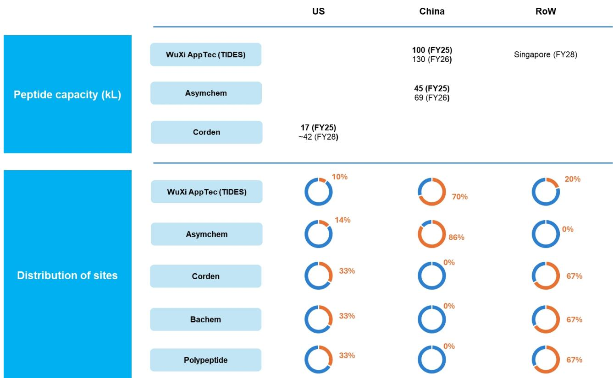

# 多肽CDMO行业格局重塑：规模成为竞争核心

过去五年，全球多肽CDMO市场经历了结构性变革，竞争格局的变化不仅是市场份额的重新分配，更是对行业成功要素的根本性重新定义。2021年至2025年间，前四大多肽CDMO的合计收入从约10亿美元增长至约30亿美元，主要驱动力来自GLP-1及其他代谢类多肽的需求。然而，几乎全部增长都被单一企业所捕获。在此期间，药明康德TIDES业务从1.2亿美元增长至17亿美元，市场份额从11%提升至54%。而曾经定义多肽外包领域的传统专业公司——Bachem、PolyPeptide、CordenPharma——仅实现了个位数至中位数的增长，其相对收入增幅相对于席卷行业的浪潮而言显得较为温和。

这并非周期性变化。GLP-1的繁荣并非会消退的需求高峰；它是多肽治疗药物可及市场的结构性扩张。收入数据揭示，行业重心已决定性地转向那些能够部署资本、建设产能并以工业规模执行交付的供应商。技术与专业知识仍然必要，但已不再是充分条件。对于市场中的每一位参与者——无论是选择生产合作伙伴的生物技术公司、评估CDMO敞口的观察者，还是决定资本配置方向的竞争者——问题都在于，其供应商或投资组合公司是否具备在新格局中竞争的规模。

过去五年的证据清晰明确。那些早期并积极投资于大规模多肽生产能力的公司，捕获了不成比例的市场份额。而那些未能这样做的公司，无论其技术背景如何，都已退居利基或次要地位。其影响远不止当前的GLP-1周期。随着多肽创新扩展到日益复杂的模式——偶联物、放射性核素标记多肽、多靶点激动剂——拥有最广泛技术平台、最深厚工艺开发经验以及能够同时处理临床和商业化规模生产的制造基础设施的供应商，将定义行业的下一个十年。

## 规模已成为首要区分因素，药明康德自成一级

多肽CDMO竞争中最关键的指标并非收入增长率或项目数量，而是以公吨计的生产产出。以千升计的反应器体积是最常披露的产能指标，但它是一个不完美的代理变量，因为生产率会随着多肽长度、负载效率、收率和批次配置而显著变化。以公吨计的产出则能捕捉到对商业化供应至关重要的实际吞吐量。在这一指标上，行业不仅呈现分层，而且被单一企业主导。

药明康德在2025年的多肽产出估计为58公吨。下一梯队——CordenPharma和Asymchem——在10至20公吨范围内。Bachem、PolyPeptide及其他中国专业企业通常在1至10公吨范围内。而大量区域性供应商的年产能仍低于1公吨。其含义十分明显：药明康德的生产规模大约是最近竞争对手的三到六倍，是大多数老牌专业企业的十倍以上。这不是渐进式的优势；这是一个无法快速弥合的结构性差距。

大批次能力进一步强化了这一规模优势。大多数领先的多肽CDMO平均商业化批次大小约为15至30公斤，只有少数企业在持续执行更大规模批次方面拥有经过验证的记录。根据其年产出和约2000个批次估算，药明康德平均批次大小约为25至30公斤，处于该范围的上限。值得注意的是，Asymchem已披露其使用液相多肽合成技术可实现每批次超过100公斤的能力，该技术对某些长链多肽具有优势。但总体而言，在商业化规模下处理大批次的能力仍然是少数供应商能够可信宣称的区分因素。

对生物技术公司的战略启示是明确的。当为具有重磅潜力的代谢多肽项目选择CDMO时，决策并非关于哪家供应商拥有最佳技术或最有经验的化学家，而是关于哪家供应商能够保证多吨规模的供应连续性、满足主要市场的监管合规要求，并具备随需求实现而灵活扩产的能力。能够可信地做出这一承诺的CDMO数量非常少，且正在减少。

## 成本结构因规模与产能利用率而显著分化，并非仅由地理位置决定

制药外包领域的一个常见假设是，中国CDMO因较低的劳动力和设施成本而享有结构性成本优势。虽然这在一定程度上正确，但利润率数据揭示了一幅更为细致的图景。药明康德在2025年实现了约47%的毛利率和37%的息税前利润率，远超即使是利润率最高的西方同行。Bachem已被视为西方多肽专业公司中的利润率领导者，其息税前利润率约为22%。PolyPeptide和EuroAPI则接近盈亏平衡。

这一差距不能仅由地理位置解释。药明康德的销售成本占收入比例为53%，是所有主要多肽CDMO中最低的。这种效率来自多个方面：由持续需求驱动的高产能利用率、原材料采购和溶剂回收的规模经济，以及减少浪费和提高收率的工艺开发能力。该公司也是行业内最积极的产能建设者，资本支出在2022年达到约15亿美元的峰值，随后在2025年下降至约8.31亿美元，因为收入增长开始超过投资。这一多年的投资周期使药明康德在GLP-1需求浪潮到来之前就已做好准备，并使其能够捕获不成比例的外包增量。

对于西方专业公司而言，挑战是结构性的。Bachem的资本支出与销售比率历史上在25%至45%之间，这意味着收入的很大一部分必须再投资，仅仅是为了维持和适度扩大产能。药明康德的这一比率在2021年接近30%的峰值，到2025年下降至约12%，反映了已建成产能基础所带来的运营杠杆。投入资本回报率也讲述了同样的故事：药明康德2025年38%的ROIC远超Bachem的6%和PolyPeptide的1%。这些并非周期性差异；它们反映了根本不同的商业模式。

对于评估CDMO敞口的观察者而言，其启示在于，利润率扩张并非随收入增长自动实现。它取决于产能投资时机与需求实现之间的关系。药明康德的利润率随时间推移而改善，恰是因为它在需求实现之前就已建成产能。那些现在匆忙建设产能的竞争者，将面临一段资本支出高企、ROIC低迷的时期，等待这些投资产生回报——如果它们能产生回报的话。大规模多肽生产的产能投资窗口可能正在关闭，因为GLP-1需求浪潮正在成熟，下一代多肽项目正转向更复杂、更低产量的模式。

## 技术差异化正从核心多肽合成转向偶联与速度

基础多肽能力，如固相多肽合成、环肽和订书肽，现已广泛适用于大多数领先供应商。技术门槛已被提高，差异化领域已转向相邻领域。偶联技术——多肽-寡核苷酸、多肽-放射性核素及其他先进偶联物——正日益成为竞争优势的构建基础。药明康德和Asymchem在这些领域提供最广泛的技术组合，而Bachem和CordenPharma在特定偶联平台上保持强势地位。

工艺效率和可持续性正成为另一个竞争轴心。药明康德和Bachem似乎在废物减少和溶剂回收方面领先，这不仅降低了环境影响，也降低了销售成本。随着围绕环境可持续性的监管审查日益严格，尤其是在欧洲，拥有经证实的绿色化学能力的CDMO可能获得某些客户项目的优先准入。

执行速度或许是最被低估的区分因素。中国CDMO通常比西方同行提供从新药临床试验申请到新药申请的更短时间线。这不仅仅是更快决策的结果；它反映了集成平台的优势，其中开发、放Daiwa生产在同一屋檐下协调进行，交接环节更少。对于争分夺秒将多肽疗法推向市场的新兴生物技术公司而言，将开发时间线缩短六个月，可能是在竞争性适应症中领先与跟随之间的差别。

对CDMO的战略启示是，技术竞赛已不再是关于拥有最好的合成化学。而是关于提供一个全面的平台，涵盖从早期发现支持到商业化生产的全过程，并具备集成的偶联能力、可持续性资质以及经证实的速度记录。仅在一两个维度上表现出色的公司，将发现自己在同质化细分市场中以价格竞争，而能够结合所有这些维度的公司，则将获得溢价定价和长期合作关系。

## 评估多肽CDMO合作伙伴与敞口的决策框架

对于选择CDMO合作伙伴的生物技术公司，或评估CDMO敞口的观察者而言，上述竞争动态可转化为一个包含四个维度的结构化决策框架。

第一，以公吨而非反应器体积评估生产规模。反应器体积是产能投入；公吨产出是实际能力的衡量。这一区别很重要，因为不同供应商的生产率差异很大。一个拥有100千升反应器容量但收率低、周期长的CDMO，其产出可能少于一个拥有50千升但工艺效率更优的竞争对手。要求披露产出数据，或如不可得，则根据批次大小、批次数以及所涉多肽类别的典型收率进行估算。

第二，评估产能投资的时机和轨迹。三到五年前大力投资的CDMO，很可能正以高利用率运行，资本支出强度下降，利润率改善。而当前处于重投资阶段的CDMO，将面临一段回报低迷的时期，并可能更积极地定价以填满新产能。最佳合作伙伴取决于发起方的时间线：对于即将商业化上市的项目，已建立规模的供应商更可取；对于仍处于早期临床开发的项目，产能正在扩张的供应商可能提供更好的长期契合。

第三，审视核心多肽合成之外的技术平台广度。该CDMO是否为发起方管线中最相关的模式提供了偶联能力？它是否在放射性核素标记、寡核苷酸偶联或多靶点激动剂格式方面有经验？下一代多肽疗法将比当前的GLP-1类似物更为复杂，而那些已投资于这些平台的CDMO将更有能力支持创新。

第四，考虑地理多元化和供应链韧性。中国CDMO目前几乎将其多肽生产产能全部集中在中国境内，海外扩张计划尚处于初期。西方CDMO的生产网络则分布在北美和欧洲。对于对美欧监管机构有重大敞口的发起方，或对地缘政治风险有担忧的发起方，地理多元化可能是一个关键因素。权衡在于，西方CDMO通常规模更小、成本更高，地理多元化的溢价必须与规模和速度的收益相权衡。

## 下一阶段竞争将青睐集成平台而非专业公司

多肽CDMO行业正进入一个阶段，过去十年定义竞争优势的因素——早期产能投资、激进的资本部署和上市速度——正让位于一组新的区分因素。GLP-1需求浪潮正在成熟，虽然代谢多肽仍将是一个庞大且增长的市场，但增量增长将越来越多地来自需要更复杂生产能力的下一代项目。

在这种环境下，定位最佳的供应商是那些将大规模生产与广泛技术平台、集成开发服务和全球监管专业知识相结合的供应商。药明康德目前在所有这些维度上都是明确的领导者，但其在中国的地理集中仍是一个竞争对手可能利用的弱点。Asymchem虽然规模小得多，但正进入一个快速增长阶段，拥有新建产能和不断扩大的技术组合，其2025年收入加速至124%的信号表明，它正在第二梯队中抢占份额。

对于传统专业公司——Bachem、PolyPeptide、CordenPharma——战略要务是整合或合作。它们的技术专长和监管记录仍然有价值，但如果它们继续以个位数至中位数的速度增长，而市场以更快的速度扩张，它们相对于中国CRDMO的规模劣势只会扩大。与大型制药公司合作、收购新兴技术平台，或与中国制造商成立合资企业，都是保持相关性的可行路径。

大量小型多肽CDMO面临最根本的挑战。由于缺乏建设大规模产能的资本、支持复杂模式的技术广度，或减轻供应链风险的地理多元化，这些公司将日益被局限于早期发现支持和少量临床供应。该业务的经济性与商业化生产根本不同，收入潜力有限。

多肽CDMO行业已被规模重新定义。那些早期认识到这一点并相应投资的公司，已建立起难以挑战的地位。对于其他所有人而言，问题不在于是否在规模上竞争，而在于如何在一个日益由规模定义的市场中找到可行的利基。

*仅供参考。部分内容可能基于源材料通过AI辅助生成、翻译、总结或编辑，可能存在遗漏或错误。请独立核实。本文不构成任何专业建议。*

仅供参考。部分内容可能基于源材料通过AI辅助生成、翻译、总结或编辑，可能存在遗漏或错误。请独立核实。本文不构成任何专业建议。

