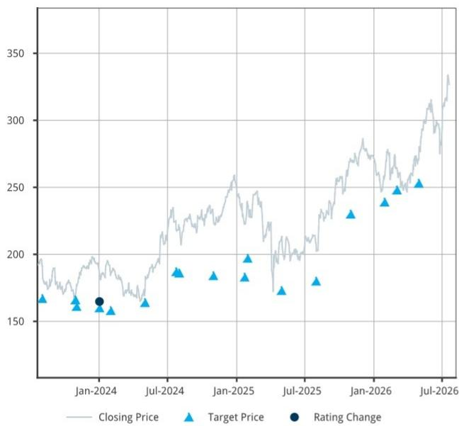
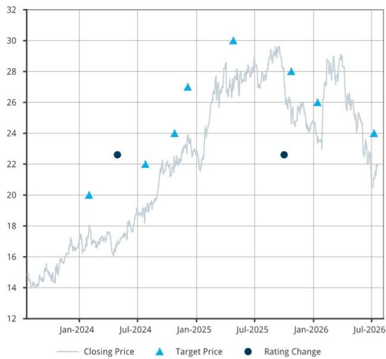

IT Hardware and Communications Equipment

# Read-through: AT&T Capex and iPhones

This morning AT&T reported Jun-Q (2Q26) earnings.

AT&T earnings have implications for companies within our coverage universe, specifically service provider capex-exposed companies (CIEN, CSCO, and GLW), as well as AAPL. For AT&T exposure, we estimate ~11% revenue for CIEN and LSD for overall GLW revenues (though we estimate roughly HSD of GLW's Optical revenues), and ~6% of iPhone units.

iPhones Unit Contribution from AT&T was roughly in-line with Street; 2Q26 capex came in above Street consensus: AT&T handset data points imply a unit contribution roughly meeting the Street expectations for AAPL iPhones with a tick down in the upgrade rate. 2Q26 capex came in at $5.7Bn vs. the Street expectation of $5.5Bn.

AT&T's handset and capex numbers:

- AT&T (T; covered by Kannan Venkateshwar) reported smartphone unit sales of 5.2M in Jun-Q, flat Y/Y.

- Upgrade rate moved down again to 3.2% in the Q (from 3.5% previous Q), down 10bps from a year ago and down 30bps sequentially, which we believe was largely due to faded enthusiasm around the carrier subsidies and the step-down in upgrade rate. We believe the telco reported upgrade rates are more important for this iPhone cycle as ASPs will likely increase by a decent amount.

Read-through for AAPL: We estimate AT&T sold roughly 3.4M iPhones in the quarter, flat Y/Y and down LSD sequentially. We think this implies in-line iPhones unit contribution for the quarter for AT&T, which we think is partially attributable to iPhone 17 line momentum, offset by a typically weaker Q2.

Capex read-through: 2Q26 capex came in above the Street at $5.7B, though the company maintained the capital investment outlook to be in the range of $23-24Bn annually for 2026, with the 2H capital investment being more back-end loaded. We view the reaffirmed full-year capex guide mostly neutral to our SP capex-exposed stocks in our coverage – CIEN, GLW, CSCO. Our sector continues to see a normalization in North America carrier activity. Similar to industry commentary, we expect telcos' ongoing fiber expansion to be lumpy for GLW, though we expect the recovery for SPs continuing in the back half. We continue to believe optical spend for capacity enhancements will be prioritized and expect CIEN's business with major US telcos to accelerate into next year.

BARC Capital Inc. and/or one of its affiliates does and seeks to do business with companies covered in its research reports. As a result, investors should be aware that the firm may have a conflict of interest that could affect the objectivity of this report. Investors should consider this report as only a single factor in making their investment decision.

IT Hardware and Communications Equipment
NEUTRAL

Please see analyst certifications and important disclosures beginning on page 3. Completed: 22-Jul-26, 14:17 GMT Released: 22-Jul-26, 14:21 GMT Restricted - External

IT Hardware and Communications Equipment

Tim Long
+1 212 526 4043
tim.long@BARC.com
BCI, US

Alyssa Shreves
+1 212 526 7570
alyssa.shreves@BARC.com
BCI, US

Mary Lenox  
+1 212 526 6277  
mary.lenox@BARC.com  
BCI, US

Clarisse Yu  
+1 212 526 7025
clarisse.yu@BARC.com
BCI, US

## AT&T Handset-Related Metrics

FIGURE 1. Handset Metrics

<table><tr><td>AT&amp;T metrics</td><td>1Q22</td><td>2Q22</td><td>3Q22</td><td>4Q22</td><td>1Q23</td><td>2Q23</td><td>3Q23</td><td>4Q23</td><td>1Q24</td><td>2Q24</td><td>3Q24</td><td>4Q24</td><td>1Q25</td><td>2Q25</td><td>3Q25</td><td>4Q25</td><td>1Q26</td><td>2Q26</td></tr><tr><td>Total smartphones</td><td>5.4</td><td>5.1</td><td>5.8</td><td>6.3</td><td>5.1</td><td>4.6</td><td>5.5</td><td>6.3</td><td>4.4</td><td>4.4</td><td>5.1</td><td>6.3</td><td>5.1</td><td>5.2</td><td>6.0</td><td>6.7</td><td>5.4</td><td>5.2</td></tr><tr><td>YoY change</td><td>5.9%</td><td>2.0%</td><td>3.6%</td><td>-4.5%</td><td>-5.6%</td><td>-9.8%</td><td>-5.2%</td><td>0.0%</td><td>-13.7%</td><td>-4.3%</td><td>-7.3%</td><td>0.0%</td><td>15.9%</td><td>18.2%</td><td>17.6%</td><td>6.3%</td><td>5.9%</td><td>0.0%</td></tr><tr><td>QoQ change</td><td>-18.2%</td><td>-5.6%</td><td>13.7%</td><td>8.6%</td><td>-19.0%</td><td>-9.8%</td><td>19.6%</td><td>14.5%</td><td>-30.2%</td><td>0.0%</td><td>15.9%</td><td>23.5%</td><td>-19.0%</td><td>2.0%</td><td>15.4%</td><td>11.7%</td><td>-19.4%</td><td>-3.7%</td></tr><tr><td>Postpaid subscribers</td><td>81.6</td><td>82.7</td><td>83.6</td><td>84.7</td><td>85.4</td><td>85.8</td><td>86.4</td><td>87.1</td><td>89.0</td><td>89.4</td><td>89.7</td><td>90.0</td><td>90.2</td><td>90.5</td><td>90.8</td><td>90.8</td><td>91.1</td><td>91.4</td></tr><tr><td>Smartphone % of subscribers</td><td>83.1%</td><td>83.0%</td><td>83.0%</td><td>82.9%</td><td>83.1%</td><td>83.7%</td><td>84.1%</td><td>84.3%</td><td>83.4%</td><td>83.9%</td><td>84.6%</td><td>85.2%</td><td>85.8%</td><td>86.4%</td><td>87.1%</td><td>87.9%</td><td>88.5%</td><td>89.0%</td></tr><tr><td>Smartphone subscribers</td><td>67.8</td><td>68.6</td><td>69.4</td><td>70.2</td><td>71.0</td><td>71.8</td><td>72.6</td><td>73.4</td><td>74.2</td><td>75.0</td><td>75.8</td><td>76.6</td><td>77.4</td><td>78.2</td><td>79.0</td><td>79.8</td><td>80.6</td><td>81.4</td></tr><tr><td>Upgrade rate</td><td>4.0%</td><td>3.6%</td><td>4.3%</td><td>4.8%</td><td>3.7%</td><td>3.1%</td><td>3.9%</td><td>4.7%</td><td>3.0%</td><td>2.9%</td><td>3.5%</td><td>4.6%</td><td>3.3%</td><td>3.3%</td><td>4.1%</td><td>4.7%</td><td>3.5%</td><td>3.2%</td></tr><tr><td>Upgrade units</td><td>3.3</td><td>2.9</td><td>3.6</td><td>4.0</td><td>3.1</td><td>2.6</td><td>3.3</td><td>4.1</td><td>2.6</td><td>2.6</td><td>3.1</td><td>4.1</td><td>3.0</td><td>3.0</td><td>3.7</td><td>4.3</td><td>3.2</td><td>2.9</td></tr><tr><td>iPhone units (estimates)</td><td>3.7</td><td>3.5</td><td>3.9</td><td>4.2</td><td>3.5</td><td>2.9</td><td>3.4</td><td>4.2</td><td>2.9</td><td>2.9</td><td>3.4</td><td>4.2</td><td>3.4</td><td>3.4</td><td>4.0</td><td>4.4</td><td>3.6</td><td>3.4</td></tr><tr><td>YoY change</td><td>20.0%</td><td>6.7%</td><td>5.1%</td><td>-7.3%</td><td>-5.3%</td><td>-15.1%</td><td>-13.5%</td><td>-1.5%</td><td>-16.5%</td><td>-1.4%</td><td>-1.3%</td><td>0.8%</td><td>15.9%</td><td>18.2%</td><td>17.6%</td><td>5.5%</td><td>5.9%</td><td>0.0%</td></tr><tr><td>QoQ change</td><td>-19.4%</td><td>-5.6%</td><td>13.7%</td><td>7.0%</td><td>-17.6%</td><td>-15.4%</td><td>15.8%</td><td>21.9%</td><td>-30.2%</td><td>0.0%</td><td>15.9%</td><td>24.5%</td><td>-19.7%</td><td>2.0%</td><td>15.4%</td><td>11.7%</td><td>-19.4%</td><td>-3.7%</td></tr></table>

Source: AT&T, BARC. Mn units.

## Analyst(s) Certification(s):

I, Tim Long, hereby certify (1) that the views expressed in this research report accurately reflect my personal views about any or all of the subject securities or issuers referred to in this research report and (2) no part of my compensation was, is or will be directly or indirectly related to the specific recommendations or views expressed in this research report.

## Important Disclosures:

BARC is produced by the Investment Bank of BARC Bank PLC and its affiliates (collectively and each individually, "BARC"). All authors contributing to this research report are Research Analysts unless otherwise indicated. The publication date at the top of the report reflects the local time where the report was produced and may differ from the release date provided in GMT.

## Availability of Disclosures:

Where any companies are the subject of this research report, for current important disclosures regarding those companies please refer to https://publicresearch.BARC.com or alternatively send a written request to: BARC Compliance, 745 Seventh Avenue, 13th Floor, New York, NY 10019 or call +1-212-526-1072.

The analysts responsible for preparing this research report have received compensation based upon various factors including the firm's total revenues, a portion of which is generated by investment banking activities, the profitability and revenues of the Markets business and the potential interest of the firm's investing clients in research with respect to the asset class covered by the analyst.

Research analysts employed outside the US by affiliates of BARC Capital Inc. are not registered/qualified as research analysts with FINRA. Such non-US research analysts may not be associated persons of BARC Capital Inc., which is a FINRA member, and therefore may not be subject to FINRA Rule 2241 restrictions on communications with a subject company, public appearances and trading securities held by a research analyst's account.

Analysts regularly conduct site visits to view the material operations of covered companies, but BARC policy prohibits them from accepting payment or reimbursement by any covered company of their travel expenses for such visits.

BARC Department produces various types of research including, but not limited to, fundamental analysis, equity-linked analysis, quantitative analysis, and trade ideas. Recommendations contained in one type of BARC may differ from those contained in other types of BARC, whether as a result of differing time horizons, methodologies, or otherwise.

In order to access BARC Statement regarding Research Dissemination Policies and Procedures, please refer to https:// publicresearch.BARC.com/S/RD.htm. In order to access BARC Conflict Management Policy Statement, please refer to: https://publicresearch.BARC.com/S/CM.htm.

## Materially Mentioned Stocks (Ticker, Date, Price)

AT&T (T, 21-Jul-2026, USD 22.26), Equal Weight/Neutral, A/CD/CE/D/E/J/K/L/M/N

Apple, Inc. (AAPL, 21-Jul-2026, USD 327.74), Underweight/Neutral, CD/CE/D/E/J/K/L/M/N

Ciena Corporation (CIEN, 21-Jul-2026, USD 408.73), Overweight/Neutral, CD/CE/J

Cisco Systems, Inc. (CSCO, 21-Jul-2026, USD 112.18), Equal Weight/Neutral, CD/CE/D/J/K/L/M

Corning Incorporated (GLW, 21-Jul-2026, USD 162.41), Equal Weight/Neutral, CD/CE/J

Unless otherwise indicated, prices are sourced from Bloomberg and reflect the closing price in the relevant trading market, which may not be the last available closing price at the time of publication.

## Disclosure Legend:

A: BARC Bank PLC and/or an affiliate has been lead manager or co-lead manager of a publicly disclosed offer of securities of the issuer in the previous 12 months.

B: An employee or non-executive director of BARC PLC is a director of this issuer.

CD: BARC Bank PLC and/or an affiliate is a market-maker in debt securities issued by this issuer.

CE: BARC Bank PLC and/or an affiliate is a market-maker in equity securities issued by this issuer.

CH: BARC Bank PLC and/or its group companies makes, or will make, a market in the securities (as defined under paragraph 16.2 (k) of the HK SFC Code of Conduct) in respect of this issuer.

D: BARC Bank PLC and/or an affiliate has received compensation for investment banking services from this issuer in the past 12 months.

E: BARC Bank PLC and/or an affiliate expects to receive or intends to seek compensation for investment banking services from this issuer within the next 3 months.

FA: BARC Bank PLC and/or an affiliate beneficially owns 1% or more of a class of equity securities of this issuer, as calculated in accordance with US regulations.

FB: BARC Bank PLC and/or an affiliate beneficially owns a long position of more than 0.5% of a class of equity securities of this issuer, as calculated in accordance with EU regulations.

FC: BARC Bank PLC and/or an affiliate beneficially owns a short position of more than 0.5% of a class of equity securities of this issuer, as calculated in accordance with EU regulations.

FD: BARC Bank PLC and/or an affiliate beneficially owns 1% or more of a class of equity securities of this issuer, as calculated in accordance with South Korean regulations.

FE: BARC Bank PLC and/or its group companies has financial interests in relation to this issuer and such interests aggregate to an amount equal to or more than 1% of this issuer's market capitalization, as calculated in accordance with HK regulations.

GD: One of the Research Analysts on the fundamental credit coverage team (and/or a member of his or her household) has a long position in the common equity securities of this issuer.

GE: One of the Research Analysts on the fundamental equity coverage team (and/or a member of his or her household) has a long position in the common equity securities of this issuer.

H: This issuer beneficially owns more than 5% of any class of common equity securities of BARC PLC.

I: BARC Bank PLC and/or an affiliate is party to an agreement with this issuer for the provision of financial services to BARC Bank PLC and/or an affiliate.

J: BARC Bank PLC and/or an affiliate is a liquidity provider and/or trades regularly in the securities of this issuer and/or in any related derivatives.

K: BARC Bank PLC and/or an affiliate has received non-investment banking related compensation (including compensation for brokerage services, if applicable) from this issuer within the past 12 months.

L: This issuer is, or during the past 12 months has been, an investment banking client of BARC Bank PLC and/or an affiliate.

M: This issuer is, or during the past 12 months has been, a non-investment banking client (securities related services) of BARC Bank PLC and/or an affiliate.

N: This issuer is, or during the past 12 months has been, a non-investment banking client (non-securities related services) of BARC Bank PLC and/or an affiliate.

O: Not in use.

P: Not in use.

Q: BARC Bank PLC and/or an affiliate is a Corporate Broker to this issuer.

R: Not in use.

S: This issuer is a Corporate Broker to BARC PLC.

T: BARC Bank PLC and/or an affiliate is providing investor engagement services to this issuer.

## Risk Disclosure(s)

Master limited partnerships (MLPs) are pass-through entities structured as publicly listed partnerships. For tax purposes, distributions to MLP unit holders may be treated as a return of principal. Investors should consult their own tax advisors before investing in MLP units.

## Disclosure(s) regarding Information Sources

Bloomberg® is a trademark and service mark of Bloomberg Finance L.P. and its affiliates (collectively “Bloomberg”) and the Bloomberg Indices are trademarks of Bloomberg. Bloomberg or Bloomberg’s licensors own all proprietary rights in the Bloomberg Indices. Bloomberg does not approve or endorse this material, or guarantee the accuracy or completeness of any information herein, or make any warranty, express or implied, as to the results to be obtained therefrom and, to the maximum extent allowed by law, Bloomberg shall have no liability or responsibility for injury or damages arising in connection therewith.

## Guide to the BARC Fundamental Equity Research Rating System:

Our coverage analysts use a relative rating system in which they rate stocks as Overweight, Equal Weight or Underweight (see definitions below) relative to other companies covered by the analyst or a team of analysts that are deemed to be in the same industry (the "industry coverage universe").

In addition to the stock rating, we provide industry views which rate the outlook for the industry coverage universe as Positive, Neutral or Negative (see definitions below). A rating system using terms such as buy, hold and sell is not the equivalent of our rating system. Investors should carefully read the entire research report including the definitions of all ratings and not infer its contents from ratings alone.

## Stock Rating

Overweight - The stock is expected to outperform the unweighted expected total return of the industry coverage universe over a 12-month investment horizon.

Equal Weight - The stock is expected to perform in line with the unweighted expected total return of the industry coverage universe over a 12-month investment horizon.

Underweight - The stock is expected to underperform the unweighted expected total return of the industry coverage universe over a 12-month investment horizon.

Rating Suspended - The rating and target price have been suspended temporarily due to market events that made coverage impracticable or to comply with applicable regulations and/or firm policies in certain circumstances including where the Investment Bank of BARC Bank PLC is acting in an advisory capacity in a merger or strategic transaction involving the company.

## Industry View

Positive - industry coverage universe fundamentals/valuations are improving.

Neutral - industry coverage universe fundamentals/valuations are steady, neither improving nor deteriorating.

Negative - industry coverage universe fundamentals/valuations are deteriorating.

Below is the list of companies that constitute the "industry coverage universe":

## IT Hardware and Communications Equipment

Apple, Inc. (AAPL)

Arista Networks, Inc. (ANET)

Axon Enterprise, Inc. (AXON)

Celestica Inc. (CLS)

Ciena Corporation (CIEN)

Cisco Systems, Inc. (CSCO)

Corning Incorporated (GLW)

Corsair Gaming, Inc. (CRSR)

Dell Technologies Inc. (DELL)

## BARC | IT Hardware and Communications Equipment

<table><tr><td>Everpure, Inc. (P)</td><td>F5, Inc. (FFIV)</td><td>Fabrinet (FN)</td></tr><tr><td>Flex Ltd (FLEX)</td><td>Garmin (GRMN)</td><td>Harmonic, Inc. (HLIT)</td></tr><tr><td>Hewlett Packard Enterprise Company (HPE)</td><td>HP Inc. (HPQ)</td><td>Jabil (JBL)</td></tr><tr><td>Keysight Technologies, Inc. (KEYS)</td><td>Logitech (LOGI)</td><td>Motorola Solutions, Inc. (MSI)</td></tr><tr><td>NetApp, Inc. (NTAP)</td><td>Nutanix, Inc (NTNX)</td><td>Super Micro (SMCI)</td></tr><tr><td>Ubiquiti, Inc. (UI)</td><td></td><td></td></tr></table>

## North America Cable, Satellite & Telecom Services

<table><tr><td>AT&amp;T (T)</td><td>BCE Inc. (BCE)</td><td>BCE Inc. (BCE.TO)</td></tr><tr><td>Charter Communications, Inc. (CHTR)</td><td>Comcast Corp. (CMCSA)</td><td>Optimum Communications Inc. (OPTU)</td></tr><tr><td>Rogers Communications Inc. (RCI)</td><td>Rogers Communications Inc. (RCI-B.TO)</td><td>T-Mobile US Inc. (TMUS)</td></tr><tr><td>Telus Corp. (T.TO)</td><td>Telus Corp. (TU)</td><td>Verizon Communications Inc. (VZ)</td></tr></table>

## Distribution of Ratings:

BARC Equity Research has 1792 companies under coverage.

51% have been assigned an Overweight rating which, for purposes of mandatory regulatory disclosures, is classified as a Buy rating; 46% of companies with this rating are investment banking clients of the Firm; 64% of the issuers with this rating have received financial services from the Firm.

34% have been assigned an Equal Weight rating which, for purposes of mandatory regulatory disclosures, is classified as a Hold rating; 39% of companies with this rating are investment banking clients of the Firm; 58% of the issuers with this rating have received financial services from the Firm.

14% have been assigned an Underweight rating which, for purposes of mandatory regulatory disclosures, is classified as a Sell rating; 32% of companies with this rating are investment banking clients of the Firm; 57% of the issuers with this rating have received financial services from the Firm.

## Guide to the BARC Price Target:

Each analyst has a single price target on the stocks that they cover. The price target represents that analyst's expectation of where the stock will trade in the next 12 months. Upside/downside scenarios, where provided, represent potential upside/potential downside to each analyst's price target over the same 12-month period.

## Types of investment recommendations produced by BARC Equity Research:

In addition to any ratings assigned under BARC' formal rating systems, this publication may contain investment recommendations in the form of trade ideas, thematic screens, scorecards or portfolio recommendations that have been produced by analysts within Equity Research. Any such investment recommendations shall remain open until they are subsequently amended, rebalanced or closed in a future research report.

BARC may also re-distribute equity research reports produced by third-party research providers that contain recommendations that differ from and/or conflict with those published by BARC' Equity Research Department.

## Disclosure of other investment recommendations produced by BARC Equity Research:

BARC Equity Research may have published other investment recommendations in respect of the same securities/instruments recommended in this research report during the preceding 12 months. To view all investment recommendations published by BARC Equity Research in the preceding 12 months please refer to https://live.barcap.com/go/research/Recommendations.

## Legal entities involved in producing BARC:

BARC Bank PLC (BARC, UK)

BARC Capital Inc. (BCI, US)

BARC Bank Ireland PLC, Frankfurt Branch (BBI, Frankfurt)

BARC Bank Ireland PLC, Paris Branch (BBI, Paris)

BARC Bank Ireland PLC, Milan Branch (BBI, Milan)

BARC Securities Japan Limited (BSJL, Japan)

BARC Bank PLC, Hong Kong Branch (BARC Bank, Hong Kong)

BARC Bank Mexico, S.A. (BBMX, Mexico)

BARC Capital Casa de Bolsa, S.A. de C.V. (BCCB, Mexico)

BARC Securities (India) Private Limited (BSIPL, India)

BARC Bank PLC, Singapore Branch (BARC Bank, Singapore)

BARC Bank PLC, DIFC Branch (BARC Bank, DIFC)

Restricted Distribution

This report is not meant for distribution into South Korea.

Apple, Inc. (AAPL / AAPL)  
Stock Rating: UNDERWEIGHT  
Industry View: NEUTRAL  
Closing Price: USD 327.74 (21-Jul-2026)

Rating and Price Target Chart (as of 21-Jul-2026)  
  
Source: LSEG Data & Analytics, Bloomberg, BARC Link to BARC Live for interactive charting

<table><tr><td>Publication Date</td><td>Closing Price*</td><td>Rating</td><td>Adjusted Price Target</td><td>Currency</td></tr><tr><td>30-Apr-2026</td><td>271.35</td><td></td><td>253.00</td><td>USD</td></tr><tr><td>03-Mar-2026</td><td>264.18</td><td></td><td>248.00</td><td>USD</td></tr><tr><td>29-Jan-2026</td><td>258.28</td><td></td><td>239.00</td><td>USD</td></tr><tr><td>31-Oct-2025</td><td>271.40</td><td></td><td>230.00</td><td>USD</td></tr><tr><td>31-Jul-2025</td><td>207.57</td><td></td><td>180.00</td><td>USD</td></tr><tr><td>30-Apr-2025</td><td>210.14</td><td></td><td>173.00</td><td>USD</td></tr><tr><td>30-Jan-2025</td><td>237.59</td><td></td><td>197.00</td><td>USD</td></tr><tr><td>22-Jan-2025</td><td>229.98</td><td></td><td>183.00</td><td>USD</td></tr><tr><td>31-Oct-2024</td><td>225.91</td><td></td><td>184.00</td><td>USD</td></tr><tr><td>01-Aug-2024</td><td>218.36</td><td></td><td>186.00</td><td>USD</td></tr><tr><td>24-Jul-2024</td><td>225.01</td><td></td><td>187.00</td><td>USD</td></tr><tr><td>02-May-2024</td><td>169.30</td><td></td><td>164.00</td><td>USD</td></tr><tr><td>01-Feb-2024</td><td>186.86</td><td></td><td>158.00</td><td>USD</td></tr><tr><td>02-Jan-2024</td><td>193.15</td><td>Underweight</td><td>160.00</td><td>USD</td></tr><tr><td>02-Nov-2023</td><td>177.57</td><td></td><td>161.00</td><td>USD</td></tr><tr><td>30-Oct-2023</td><td>168.22</td><td></td><td>166.00</td><td>USD</td></tr><tr><td>03-Aug-2023</td><td>191.17</td><td></td><td>167.00</td><td>USD</td></tr></table>

On 22-Jul-2023, prior to any intra-day change that may  
have been published, the rating for this security was Equal  
Weight, and the adjusted price target was 149.00 USD.  
Source: Bloomberg, BARC  
\*This is the closing price referenced in the publication, which may not be the last available closing price at the time of publication.  
Historical stock prices and price targets may have been  
adjusted for stock splits and dividends.  
CD: BARC Bank PLC and/or an affiliate is a market-maker in debt securities issued by Apple, Inc..  
CE: BARC Bank PLC and/or an affiliate is a market-maker in equity securities issued by Apple, Inc..  
D: BARC Bank PLC and/or an affiliate has received compensation for investment banking services from Apple, Inc. in the past 12 months.

E: BARC Bank PLC and/or an affiliate expects to receive or intends to seek compensation for investment banking services from Apple, Inc. within the next 3 months.

J: BARC Bank PLC and/or an affiliate is a liquidity provider and/or trades regularly in the securities by Apple, Inc. and/or in any related derivatives.
K: BARC Bank PLC and/or an affiliate has received non-investment banking related compensation (including compensation for brokerage services, if applicable) from Apple, Inc. within the past 12 months.

L: Apple, Inc. is, or during the past 12 months has been, an investment banking client of BARC Bank PLC and/or an affiliate.

M: Apple, Inc. is, or during the past 12 months has been, a non-investment banking client (securities related services) of BARC Bank PLC and/or an affiliate.

N: Apple, Inc. is, or during the past 12 months has been, a non-investment banking client (non-securities related services) of BARC Bank PLC and/or an affiliate.

Valuation Methodology: We rate AAPL Underweight with a price target of $253. iPhone 17 cycle has been strong, though we remain cautious on sustainability, as well as cautious on other hardware categories and do not expect impressive Services growth going forward. Our PT is based on a 25x multiple of CY27e EPS of $10.14. Our 25x P/E multiple remains below AAPL's 5-year historical multiple.

Risks which May Impede the Achievement of the BARC Valuation and Price Target: Upside risks: 1) Stronger iPhone growth. Apple market shares peaked several years ago, and the company has not had a hit phone in a few years. Better iPhone sales could propel earnings and multiples. 2) Better Installed base impact on Services and better Services pull-through from hardware. 3) More benign regulation across App Store and TAC.

## AT&T (T / T)

Stock Rating: EQUAL WEIGHT

Industry View: NEUTRAL

Closing Price: USD 22.26 (21-Jul-2026)

Rating and Price Target Chart (as of 21-Jul-2026)  
  
Source: LSEG Data & Analytics, Bloomberg, BARC Link to BARC Live for interactive charting

<table><tr><td>Publication Date</td><td>Closing Price*</td><td>Rating</td><td>Adjusted Price Target</td><td>Currency</td></tr><tr><td>08-Jul-2026</td><td>20.58</td><td></td><td>24.00 USD</td><td></td></tr><tr><td>13-Jan-2026</td><td>23.74</td><td></td><td>26.00 USD</td><td></td></tr><tr><td>23-Oct-2025</td><td>25.55</td><td></td><td>28.00 USD</td><td></td></tr><tr><td>01-Oct-2025</td><td>28.07</td><td>Equal Weight</td><td></td><td>USD</td></tr><tr><td>25-Apr-2025</td><td>27.53</td><td></td><td>30.00 USD</td><td></td></tr><tr><td>04-Dec-2024</td><td>23.74</td><td></td><td>27.00 USD</td><td></td></tr><tr><td>24-Oct-2024</td><td>22.49</td><td></td><td>24.00 USD</td><td></td></tr><tr><td>25-Jul-2024</td><td>19.16</td><td></td><td>22.00 USD</td><td></td></tr><tr><td>29-Apr-2024</td><td>16.75</td><td>Overweight</td><td></td><td>USD</td></tr><tr><td>31-Jan-2024</td><td>17.53</td><td></td><td>20.00 USD</td><td></td></tr></table>

On 22-Jul-2023, prior to any intra-day change that may have been published, the rating for this security was Equal Weight, and the adjusted price target was 17.00 USD.  
Source: Bloomberg, BARC  
\*This is the closing price referenced in the publication, which may not be the last available closing price at the time of publication.  
Historical stock prices
