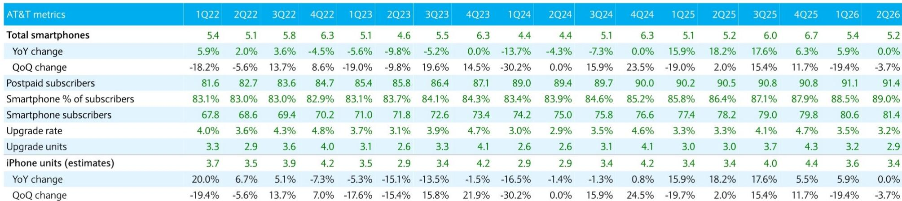
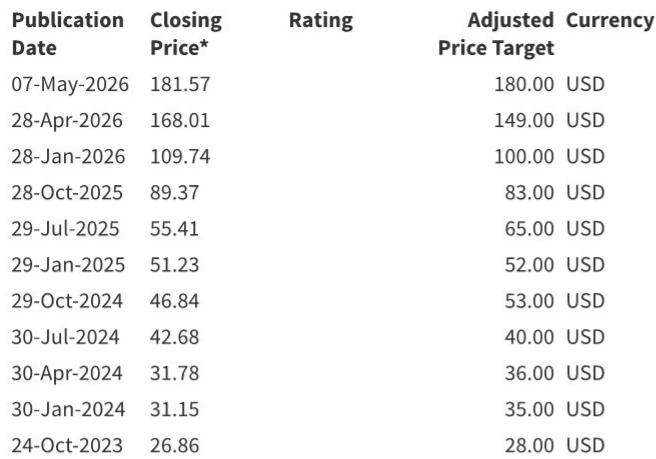

# BARC：IT硬件与通信设备-AT&T资本开支与iPhone销量启示

AT&T 在 7 月 22 日发布的 2026 财年第二季度财报，提供了两个对科技硬件供应链有直接参考意义的数据点：智能手机销量与资本开支。BARC在财报发布后的第一时间出具了快速解读报告，核心判断是：iPhone 在 AT&T 渠道的销量贡献基本符合市场预期，但升级率进一步走低；资本开支虽单季超预期，但全年指引维持不变，对光通信和网络设备供应商的影响偏中性。

这份报告的价值不在于给出一个方向性的结论，而在于它把运营商层面的微观数据，与苹果、Ciena、康宁等公司的业务节奏做了可量化的关联。对于跟踪北美电信设备周期和 iPhone 换机动能的研究者，这是一次难得的校准窗口。

## 1. AT&T 二季度智能手机销量持平，升级率降至 3.2%

AT&T 二季度智能手机总销量为 520 万部，同比持平。BARC估算其中 iPhone 销量约为 340 万部，同样同比持平，环比小幅下降。升级率从上一季度的 3.5% 降至 3.2%，同比下降 10 个基点，环比下降 30 个基点。

BARC认为，升级率持续走低的主要原因是运营商补贴吸引力的下降。这一趋势在 iPhone 17 系列周期中尤为关键，因为新机型的平均售价预计将有明显提升，而较低的升级率意味着苹果需要依靠更高的换机单价来维持收入增长。AT&T 的升级率数据，是观察美国市场 iPhone 换机意愿的一个前置指标。

> **KC评论：** 升级率连续两个季度下降，且处于历史低位，说明运营商补贴对用户的吸引力正在减弱。如果 iPhone 17 系列平均售价确实上升，苹果需要靠单价而非销量来拉动营收，这对供应链的出货量预期是一个需要谨慎对待的信号。

## 2. 二季度资本开支超预期，但全年指引未变

AT&T 二季度资本开支为 57 亿美元，高于市场预期的 55 亿美元。但公司维持 2026 年全年资本开支在 230 至 240 亿美元的区间不变，且表示下半年资本开支将更加集中在下半年。

BARC认为，全年指引不变对 Ciena、康宁、思科等供应商的影响偏中性。北美运营商活动正在经历正常化过程，光纤扩建的节奏对康宁而言仍会呈现不均衡的特征。报告同时指出，光通信领域的容量增强支出将继续被优先考虑，Ciena 与美国主要电信运营商的业务有望在明年加速。

这里的关键不是单季超预期，而是全年指引没有上调。这意味着二季度的超支可能只是节奏上的前移，而非总量扩张。对于依赖运营商资本开支节奏的供应商来说，下半年的订单能见度仍然需要进一步观察。

## 3. iPhone 销量贡献持平，但结构信号值得关注

BARC估算 AT&T 渠道的 iPhone 销量为 340 万部，同比持平，环比下降约 3.7%。报告认为这一表现基本符合市场预期，部分归因于 iPhone 17 系列的 momentum，但被二季度通常较弱的季节性所抵消。

从更长的时间序列看，AT&T 的 iPhone 销量在 2025 年经历了同比 15% 以上的增长后，2026 年上半年增速明显节奏变化。这与升级率下降的趋势一致，说明美国市场 iPhone 换机的高峰可能已经过去，后续增长更多依赖存量用户的自然替换和产品平均售价的提升。

对于苹果供应链的观察者而言，AT&T 的数据提供了一个独立于苹果官方出货量的验证维度。运营商渠道的销量和升级率，往往比季度财报更能提前反映终端需求的真实温度。

## 4. 北美电信设备周期进入正常化阶段

BARC在报告中多次提到“normalization”一词，这是理解当前北美电信设备周期的关键。经过过去几年的高速建设，北美运营商的资本开支正在从扩张期进入平稳期。AT&T 维持全年资本开支指引不变，正是这一趋势的体现。

对于光通信和网络设备供应商来说，这意味着收入增长的动力将从总量扩张转向结构性机会，例如光纤扩建、容量增强和特定客户的加速部署。BARC对 Ciena 的判断相对积极，认为其与美国主要电信运营商的业务有望在明年加速，但对康宁和思科的评价则更为中性。

> **KC评论：** “正常化”意味着北美电信设备市场的高增长阶段已经过去，供应商需要从存量竞争和特定技术升级中寻找增量。Ciena 在光传输领域的定位可能使其受益于容量增强支出，但整体行业增速节奏变化是大概率事件。

---

这份BARC报告的价值在于，它把 AT&T 这一单一运营商的季度数据，与苹果、Ciena、康宁等多家公司的业务逻辑做了清晰的关联。对于研究北美科技硬件供应链的人来说，升级率和资本开支指引是两个最值得持续跟踪的指标。

For informational purposes only. Portions may be generated,translated,summarized,or edited with AI assistance based on source materials and may contain omissions or errors. Please verify independently. This is not investment,legal,tax,accounting,or other professional advice.

For informational purposes only. Portions may be generated,translated,summarized,or edited with AI assistance based on source materials and may contain omissions or errors. Please verify independently. This is not investment,legal,tax,accounting,or other professional advice.

