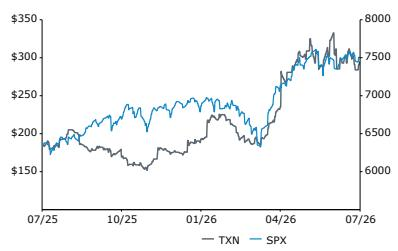
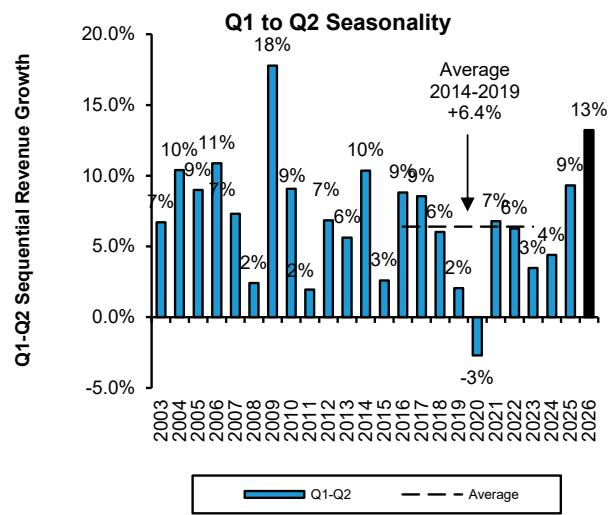
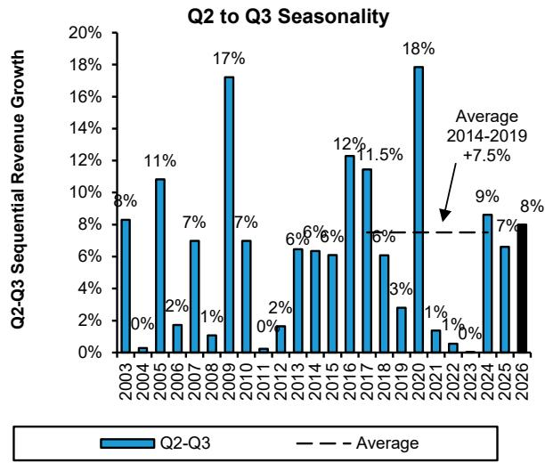
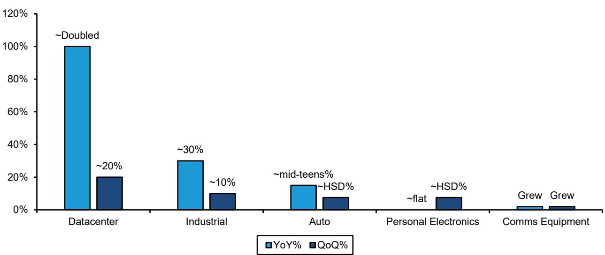
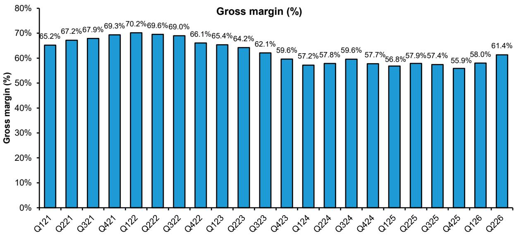

# Texas Instruments (TXN): Q226 Recap - The world is not enough?

Texas Instruments' Q2 results were strong ($5,463M/$2.14/61.4% vs Street at $5,234M/$1.93/59.5%, including a 5 cent benefit not in guidance) with continued industrial recovery and datacenter growth, and more positive auto performance. Industrial grew ~30% YoY and ~10% QoQ; Data center doubled Y/Y and rose~20% QoQ, and Automotive grew mid-teens % YoY and climbed HSD% QoQ. Personal electronics were flat YoY and were up HSD% QoQ, while communications equipment continued to grow YoY and QoQ. Gross margins at 61.4% were ~185bps above expectations on better revenues and loadings.

Q3 guidance was well above consensus ( $5.90B$ / $2.40$ /~62% vs Street $5.61B$ / $2.15$ /60.4%), seasonal to perhaps a touch above with similar drivers (industrial, datacenter, automotive etc, though with possibly weaker PE vs normal patterns). Capex was reiterated at in the $2$ - $3B$ range for the year, probably closer to the high end (vs ~ $4.6B$ in 2025).

This was another solid print from the company as industrial strength persists, datacenter accelerates, and automotive grows more positive, and results were pretty clean; the only issue is that a strong beat was likely already expected given those dynamics are fairly well known at this point. From here the questions will probably center around how much longer the industrial cycle can continue (we note this was the company's strongest Q2 QoQ growth since 2009), how long it will take datacenter (currently low double digit % of sales?) to become truly meaningful, what happens to PE into year-end, and whether or not pricing actions can help drive gross margins higher; given we are moving into the 2H we would (as always) also watch seasonality into Q4 (which still appears to be mis-modeled by consensus, something to watch into October).

Overall though we have few nitpicks to go after here and can see good things happening, though given valuation we prefer to look elsewhere in our space for now.

Raising estimates and rolling valuation horizon forward to avg FY27/28, PT raised from $250 to $290 (30x, unchanged, on avg FY27/28 EPS). We rate TXN MP.

## Observations

TXN (MP, $290): TXN shares feel fully valued in the current environment.

<table><tr><td>Reported EPS</td><td>F25A</td><td>F26E</td><td>F27E</td></tr><tr><td>TXN (USD)</td><td>5.45</td><td>8.33</td><td>9.16</td></tr><tr><td>OLD</td><td>--</td><td>7.62</td><td>8.22</td></tr></table>

Source: Bloomberg, Bernstein estimates and analysis.

<table><tr><td>Close Date</td><td>22 Jul 2026</td></tr><tr><td>TXN Close Price (USD)</td><td>294.19</td></tr><tr><td>Price Target (USD)</td><td>290.00</td></tr><tr><td>Upside/(Downside)</td><td>(1)%</td></tr><tr><td>52-Week Range</td><td>334.03/152.73</td></tr><tr><td>SPX</td><td>7,498.96</td></tr><tr><td>FYE</td><td>Dec</td></tr><tr><td>Div Yield</td><td>1.9%</td></tr><tr><td>Market Cap (USD) (M)</td><td>267,740</td></tr><tr><td>EV (USD) (M)</td><td>274,791</td></tr></table>

<table><tr><td>Financials</td><td>F25A</td><td>F26E</td><td>F27E</td><td>CAGR</td></tr><tr><td>EBIT (M)</td><td>5,710</td><td>8,737</td><td>9,764</td><td>--</td></tr><tr><td>FCF (M)</td><td>2,603</td><td>8,159</td><td>9,523</td><td>--</td></tr><tr><td>Revenues (M)</td><td>17,682</td><td>21,661</td><td>23,171</td><td>--</td></tr></table>

<table><tr><td>Performance</td><td>YTD</td><td>1M</td><td>6M</td><td>12M</td></tr><tr><td>Absolute (%)</td><td>69.6</td><td>(11.5)</td><td>50.9</td><td>36.9</td></tr><tr><td>SPX (%)</td><td>9.5</td><td>0.4</td><td>8.5</td><td>18.8</td></tr><tr><td>Relative (%)</td><td>60.0</td><td>(11.8)</td><td>42.4</td><td>18.0</td></tr></table>

Price Performance, 1YR  
Source: Bloomberg, Bernstein estimates and analysis.

<table><tr><td>Valuation Metrics</td><td>F25A</td><td>F26E</td><td>F27E</td></tr><tr><td>Reported P/E (x)</td><td>54.0</td><td>35.3</td><td>32.1</td></tr></table>

## DETAILS

For our updated TXN model please click here: TXN model.

Texas Instruments' Q2 results were strong ($5,463M/$2.14/61.4% vs Street at $5,234M/$1.93/59.5%, including a 5 cent benefit not in guidance) with continued industrial recovery and datacenter growth, and more positive auto performance. Industrial grew ~30% YoY and ~10% QoQ; Data center doubled Y/Y and rose~20% QoQ, and Automotive grew mid-teens% YoY and climbed HSD% QoQ. Personal electronics were flat YoY and were up HSD % QoQ, while communications equipment continued to grow YoY and QoQ. Gross margins at 61.4% were ~185bps above expectations on better revenues and loadings.

- Texas Instruments' results beat consensus on revenues and on EPS ($5,463M/$2.14 vs Street $5,234M/$1.93 and guidance $5,200M/$1.91) (Exhibit 1).

- Analog, Embedded and Other were all above expectations (Exhibit 2).

- Total revenue was up ~13% sequentially, better than typical seasonality (Exhibit 3) and grew ~23% YoY.

- Analog sales of $4,365M were up ~11% QoQ and up ~26% YoY (Exhibit 5). Operating margins for the segment were 45.6%, up ~390bps QoQ.

- Embedded Processing sales of $788M were up ~9% QoQ and up ~16% YoY (Exhibit 5). Segment operating margins came in at 21.3%, up ~440bps QoQ.

- Other Revenues of $310M grew ~74% QoQ and were down ~2% YoY (Exhibit 5). Operating margins were 48.4% for the quarter.

- On a sequential basis, Datacenter revenue was up ~20%, Industrial was up ~10%, Auto was up HSD %, Personal Electronics was up HSD%, and Comms equipment grew as well. On a YoY basis, Datacenter grew the fastest (doubled), followed by Industrial (>30%), Auto (mid-teens %), Comms equipment (positive growth), and PE (~flat) (Exhibit 6).

- Gross margins were 61.4% vs 58.0% last quarter (Exhibit 7), and were ~185bps above street expectations of 59.5% (Exhibit 8) due to higher revenue and loadings.

- Opex for the quarter came in at $1,025M (excluding acquisition expenses of $17M), higher than our estimate ($1,010M) and consensus ($1,006M).

Q3 guidance was well above consensus on revenues and EPS, with margins also above ($5.90B/$2.40/~62% vs Street $5.61B/$2.15/60.4%), seasonal to perhaps a touch above with similar drivers (industrial, datacenter, automotive etc, though with possibly weaker PE vs normal patterns). Capex was reiterated at in the $2-$3B range for the year, probably closer to the high end (vs ~$4.6B in 2025).

- TXN sees Q326 at $5.90B/$2.40, well above Street expectations on revenues and EPS with Street at $5,614M/$2.15 (Exhibit 9). Revenues are seen up ~8% sequentially, seasonal to perhaps a bit above (Exhibit 4).

- Gross margins appear implicitly guided at ~62% or so (Exhibit 10, Exhibit 11), above consensus (60.4%).

- Opex is expected to be flattish QoQ (suggesting ~$1,025M excluding acquisition charges, roughly in-line with consensus expectations of $1,016M).

- EPS was guided to $2.40 at the midpoint, above the Street at $2.15 on higher revenues and margins.

- Management suggested that while Q3 is typically driven by personal electronics, strength will be more broad-based this time with continued upside in Industrial, Data Center and Automotive; it sounded like personal electronics will grow less than usual (unsurprising given the current memory dynamics).

- Capex for the year was reiterated to land between $2B-$3B, with capex focus shifting to assembly and test equipment. Management noted capex could possibly skew to high-end of this range given the demand profile.

This was another solid print from the company as industrial strength persists, datacenter accelerates, and automotive grows more positive, and results were pretty clean; the only issue is that a strong beat was likely already expected given those dynamics are fairly well known at this point. From here the questions will probably center around how much longer the industrial cycle can continue (we note that this was the company's strongest Q2 QoQ growth since 2009), how long it will take datacenter (currently low double digit % of sales?) to become truly meaningful, what happens to PE into year-end, and whether or not pricing actions can help drive gross margins higher; given we are moving into the 2H we would (as always) also watch seasonality into Q4 (which still appears to be mis-modeled by consensus, something to watch into October). Overall though we have few nitpicks to go after here and can see good things happening, though given valuation we prefer to look elsewhere in our space for now.

- The analog recovery continues to pick up steam in industrial. Datacenter (power, etc), while not that big for the company (yet) remains (unsurprisingly) strong, doubling YoY in Q2 and accelerating from Q1 (where it rose 90% YoY). And automotive (which has been a touch squishier) seems to be growing more positive.

- From here questions will probably center around how much longer the industrial cycle (which has been going on for quite a few quarters) can persist (we note that this was the company's strongest Q2 QoQ growth since 2009...), how long it will take datacenter (we think currently low double-digit % of sales) to become truly meaningful, what happens to PE into year-end, and whether (or if) pricing can help to drive gross margins structurally higher (we note gross margins are likely going up a bit QoQ into Q3 but not a ton in the context of the sequential volume increase and supposed beginning of some pricing impact).

- Given we are moving into the 2H we would also (as always) call out a watch into Q4 seasonality, which once again may be mis-modeled by consensus; normal seasonal patterns into Q4 generally call for a high single to low double digit sequential decline (even an argument for lower PE exposure probably would not fully eliminate this), whereas consensus remains above this (something to watch into October) (Exhibit 12).

- Overall though we have few nitpicks to go after here, and can see good things happening as growth returns and FCF (and FCF/share) build to higher levels. Given valuations though (>30x our new 2027 EPS?) we prefer to look elsewhere for now (Exhibit 13).

## Other Tidbits:

- Inventories on the balance sheet were down $90M QoQ at $4,605M vs last quarter at $4,695M. Days of inventory came in at 196 vs. 209 last quarter (Exhibit 14). Inventory days are below their target range ("over 200 days").

- Cash return for the quarter totaled $1,322M, combining dividends of $1,295M and share repurchases of $27M (Exhibit 15, Exhibit 16), while free cash flow grew again sequentially to $2,738M vs $1,399M last quarter (Exhibit 17).

- Over the last 12 months the company has returned ~90% of FCF, which has come down over the last quarters with FCF improving as the company is now nearing the end of its multi-year capex cycle (Exhibit 18).

- Capex was $514M for the quarter, ~9% of revenue.

We update our model, raising estimates. We roll our valuation horizon forward from FY27 to the average of FY27/28. We raise our price target to $290 from $250 previously (30x, unchanged, on avg FY27/28 EPS) and maintain our Market-Perform rating.

• We update our model, raising estimates.

- Given we are halfway through the year, we roll our valuation horizon forward from FY27 to the average of FY27/28.

- We raise our FY2026 revenue estimate from $20.7B to $21.6B, FY2027 from $21.7B to $23.2B, and FY2028 from $22.8B to $24.3B.

- We raise our FY2026 GAAP diluted EPS estimate from $7.62 to $8.33, FY2027 from $8.22 to $9.16, and FY2028 from $9.05 to $9.94.

- We raise our price target from $250 (~30x, unchanged, on our FY27 GAAP diluted EPS of $8.22) to $290 (~30x on the average of our FY27/28 GAAP diluted EPS estimates of ~$9.55).

• We maintain our Market-Perform rating.

EXHIBIT 1: TXN Q2 results were above the high-end of the guidance and beat consensus both on top and bottom-line.

<table><tr><td>Q226</td><td>Prior Guidance</td><td>Actual</td><td>Consensus</td><td>Actual vs. Consensus</td><td>Bernstein</td><td>Actual vs. Bernstein</td></tr><tr><td>Revenue ($M)</td><td>$5,200</td><td>$5,463</td><td>$5,234</td><td>$229</td><td>$5,201</td><td>$262</td></tr><tr><td>EPS</td><td>$1.91</td><td>$2.14</td><td>$1.93</td><td>$0.21</td><td>$1.91</td><td>$0.23</td></tr></table>

Source: Company reports, Bloomberg, Bernstein estimates and analysis

EXHIBIT 2: All segments were above expectations

<table><tr><td>Q226 Actual vs Cons ($M)</td><td>Analog</td><td>Embedded</td><td>Other</td></tr><tr><td>Actual</td><td>$4,365</td><td>$788</td><td>$310</td></tr><tr><td>Consensus</td><td>$4,229</td><td>$775</td><td>$250</td></tr><tr><td>Difference</td><td>$136</td><td>$13</td><td>$60</td></tr><tr><td>Bernstein</td><td>$4,199</td><td>$752</td><td>$251</td></tr><tr><td>Difference</td><td>$166</td><td>$36</td><td>$59</td></tr></table>

Source: Company reports, Bloomberg, Bernstein estimates and analysis

EXHIBIT 3: Q2 revenues were up 13%, above seasonality (and the strongest since 2009)...  
  
Source: Company reports, Bernstein analysis

EXHIBIT 4: ... with Q3 guided up ~8% QoQ, roughly in-line to above typical seasonality  
  
Source: Company reports, Bernstein analysis

EXHIBIT 5: Analog and Embedded were both up YoY and up QoQ, while Other revenue was up sequentially and down slightly YoY

<table><tr><td>($MM)</td><td>Q122</td><td>Q222</td><td>Q322</td><td>Q422</td><td>Q123</td><td>Q223</td><td>Q323</td><td>Q423</td><td>Q124</td><td>Q224</td><td>Q324</td><td>Q424</td><td>Q125</td><td>Q225</td><td>Q325</td><td>Q425</td><td>Q126</td><td>Q226</td></tr><tr><td colspan="19">Analog</td></tr><tr><td>Revenue ($M)</td><td>$ 3,816</td><td>$ 3,992</td><td>$ 3,993</td><td>$ 3,558</td><td>$ 3,289</td><td>$ 3,278</td><td>$ 3,353</td><td>$ 3,120</td><td>$ 2,836</td><td>$ 2,928</td><td>$ 3,223</td><td>$ 3,174</td><td>$ 3,210</td><td>$ 3,452</td><td>$ 3,729</td><td>$ 3,615</td><td>$ 3,924</td><td>$ 4,365</td></tr><tr><td>QoQ Growth</td><td>2%</td><td>5%</td><td>0%</td><td>(11%)</td><td>(8%)</td><td>(0%)</td><td>2%</td><td>(7%)</td><td>(9%)</td><td>3%</td><td>10%</td><td>(2%)</td><td>1%</td><td>8%</td><td>8%</td><td>(3%)</td><td>9%</td><td>11%</td></tr><tr><td>YoY Growth</td><td>16%</td><td>15%</td><td>13%</td><td>(5%)</td><td>(14%)</td><td>(18%)</td><td>(16%)</td><td>(12%)</td><td>(14%)</td><td>(11%)</td><td>(4%)</td><td>2%</td><td>13%</td><td>18%</td><td>16%</td><td>14%</td><td>22%</td><td>26%</td></tr><tr><td>Operating Profit ($M)</td><td>$ 2,150</td><td>$ 2,226</td><td>$ 2,185</td><td>$ 1,798</td><td>$ 1,574</td><td>$ 1,463</td><td>$ 1,504</td><td>$ 1,280</td><td>$ 1,008</td><td>$ 1,047</td><td>$ 1,316</td><td>$ 1,237</td><td>$ 1,206</td><td>$ 1,325</td><td>$ 1,486</td><td>$ 1,395</td><td>$ 1,638</td><td>$ 1,992</td></tr><tr><td>Operating Margin</td><td>56.3%</td><td>55.8%</td><td>54.7%</td><td>50.5%</td><td>47.9%</td><td>44.6%</td><td>44.9%</td><td>41.0%</td><td>35.5%</td><td>35.8%</td><td>40.8%</td><td>39.0%</td><td>37.6%</td><td>38.4%</td><td>39.8%</td><td>38.6%</td><td>41.7%</td><td>45.6%</td></tr><tr><td colspan="19">Embedded Processing</td></tr><tr><td>Revenue ($M)</td><td>$ 782</td><td>$ 821</td><td>$ 821</td><td>$ 837</td><td>$ 832</td><td>$ 894</td><td>$ 890</td><td>$ 752</td><td>$ 652</td><td>$ 615</td><td>$ 653</td><td>$ 613</td><td>$ 647</td><td>$ 679</td><td>$ 709</td><td>$ 662</td><td>$ 723</td><td>$ 788</td></tr><tr><td>QoQ Growth</td><td>2%</td><td>5%</td><td>-</td><td>2%</td><td>(1%)</td><td>7%</td><td>(0%)</td><td>(16%)</td><td>(13%)</td><td>(6%)</td><td>6%</td><td>(6%)</td><td>6%</td><td>5%</td><td>4%</td><td>(7%)</td><td>9%</td><td>9%</td></tr><tr><td>YoY Growth</td><td>2%</td><td>5%</td><td>11%</td><td>10%</td><td>6%</td><td>9%</td><td>8%</td><td>(10%)</td><td>(22%)</td><td>(31%)</td><td>(27%)</td><td>(18%)</td><td>(1%)</td><td>10%</td><td>9%</td><td>8%</td><td>12%</td><td>16%</td></tr><tr><td>Operating Profit ($M)</td><td>$ 315</td><td>$ 324</td><td>$ 321</td><td>$ 293</td><td>$ 237</td><td>$ 318</td><td>$ 258</td><td>$ 195</td><td>$ 105</td><td>$ 80</td><td>$ 109</td><td>$ 58</td><td>$ 40</td><td>$ 85</td><td>$ 108</td><td>$ 71</td><td>$ 122</td><td>$ 168</td></tr><tr><td>Operating Margin</td><td>40.3%</td><td>39.5%</td><td>39.1%</td><td>35.0%</td><td>28.5%</td><td>35.6%</td><td>29.0%</td><td>25.9%</td><td>16.1%</td><td>13.0%</td><td>16.7%</td><td>9.5%</td><td>6.2%</td><td>12.5%</td><td>15.2%</td><td>10.7%</td><td>16.9%</td><td>21.3%</td></tr><tr><td colspan="19">Other</td></tr><tr><td>Revenue ($M)</td><td>$ 307</td><td>$ 399</td><td>$ 427</td><td>$ 275</td><td>$ 258</td><td>$ 359</td><td>$ 289</td><td>$ 205</td><td>$ 173</td><td>$ 279</td><td>$ 275</td><td>$ 220</td><td>$ 212</td><td>$ 317</td><td>$ 304</td><td>$ 146</td><td>$ 178</td><td>$ 310</td></tr><tr><td>QoQ Growth</td><td>(1%)</td><td>30%</td><td>7%</td><td>(36%)</td><td>(6%)</td><td>39%</td><td>(19%)</td><td>(29%)</td><td>(16%)</td><td>61%</td><td>(1%)</td><td>(20%)</td><td>(4%)</td><td>50%</td><td>(4%)</td><td>(52%)</td><td>22%</td><td>74%</td></tr><tr><td>YoY Growth</td><td>27%</td><td>19%</td><td>20%</td><td>(11%)</td><td>(16%)</td><td>(10%)</td><td>(32%)</td><td>(25%)</td><td>(33%)</td><td>(22%)</td><td>(5%)</td><td>7%</td><td>23%</td><td>14%</td><td>11%</td><td>(34%)</td><td>(16%)</td><td>(2%)</td></tr><tr><td>Operating Profit ($M)</td><td>$ 98</td><td>$ 173</td><td>$ 172</td><td>$ 85</td><td>$ 123</td><td>$ 191</td><td>$ 130</td><td>$ 58</td><td>$ 173</td><td>$ 121</td><td>$ 129</td><td>$ 82</td><td>$ 78</td><td>$ 153</td><td>$ 69</td><td>$ 7</td><td>$ 48</td><td>$ 150</td></tr><tr><td>Operating Margin</td><td>31.9%</td><td>43.4%</td><td>40.3%</td><td>30.9%</td><td>47.7%</td><td>53.2%</td><td>45.0%</td><td>28.3%</td><td>100.0%</td><td>43.4%</td><td>46.9%</td><td>37.3%</td><td>36.8%</td><td>48.3%</td><td>22.7%</td><td>4.8%</td><td>27.0%</td><td>48.4%</td></tr><tr><td colspan="19">Total</td></tr><tr><td>Revenue ($M)</td><td>$ 4,905</td><td>$ 5,212</td><td>$ 5,241</td><td>$ 4,670</td><td>$ 4,379</td><td>$ 4,531</td><td>$ 4,532</td><td>$ 4,077</td><td>$ 3,661</td><td>$ 3,822</td><td>$ 4,151</td><td>$ 4,007</td><td>$ 4,069</td><td>$ 4,448</td><td>$ 4,742</td><td>$ 4,423</td><td>$ 4,825</td><td>$ 5,463</td></tr><tr><td>QoQ Growth</td><td>2%</td><td>6%</td><td>1%</td><td>(11%)</td><td>(6%)</td><td>3%</td><td>0%</td><td>(10%)</td><td>(10%)</td><td>4%</td><td>9%</td><td>(3%)</td><td>2%</td><td>9%</td><td>7%</td><td>(7%)</td><td>9%</td><td>13%</td></tr><tr><td>YoY Growth</td><td>14%</td><td>14%</td><td>13%</td><td>(3%)</td><td>(11%)</td><td>(13%)</td><td>(14%)</td><td>(13%)</td><td>(16%)</td><td>(16%)</td><td>(8%)</td><td>(2%)</td><td>11%</td><td>16%</td><td>14%</td><td>10%</td><td>19%</td><td>23%</td></tr><tr><td>Operating Profit ($M)</td><td>$ 2,563</td><td>$ 2,723</td><td>$ 2,678</td><td>$ 2,176</td><td>$ 1,934</td><td>$ 1,972</td><td>$ 1,892</td><td>$ 1,533</td><td>$ 1,286</td><td>$ 1,248</td><td>$ 1,554</td><td>$ 1,377</td><td>$ 1,324</td><td>$ 1,563</td><td>$ 1,663</td><td>$ 1,473</td><td>$ 1,808</td><td>$ 2,310</td></tr><tr><td>Operating Margin</td><td>52.3%</td><td>52.2%</td><td>51.1%</td><td>46.6%</td><td>44.2%</td><td>43.5%</td><td>41.7%</td><td>37.6%</td><td>35.1%</td><td>32.7%</td><td>37.4%</td><td>34.4%</td><td>32.5%</td><td>35.1%</td><td>35.1%</td><td>33.3%</td><td>37.5%</td><td>42.3%</td></tr></table>

Source: Company reports, Bernstein analysis

EXHIBIT 6: Datacenter and Industrial grew the strongest in the quarter on a YoY basis  
YoY and QoQ growth by end market in 2Q26  
  
Source: Company reports, Bernstein analysis

EXHIBIT 7: Gross margins were up ~335bps QoQ...  
  
Source: Company reports, Bernstein analysis

EXHIBIT 8: ...and beat expectations by ~185bps

<table><tr><td rowspan="2"></td><td colspan="3">Actual</td></tr><tr><td>Consensus</td><td>Actual</td><td>Δ (bps)</td></tr><tr><td>Q415</td><td>57.6%</td><td>58.5%</td><td>90</td></tr><tr><td>Q116</td><td>58.4%</td><td>60.6%</td><td>220</td></tr><tr><td>Q216</td><td>60.4%</td><td>61.2%</td><td>76</td></tr><tr><td>Q316</td><td>61.7%</td><td>62.0%</td><td>30</td></tr><tr><td>Q416</td><td>61.6%</td><td>62.5%</td><td>87</td></tr><tr><td>Q117</td><td>62.2%</td><td>63.0%</td><td>76</td></tr><tr><td>Q217</td><td>63.3%</td><td>64.3%</td><td>100</td></tr><tr><td>Q317</td><td>64.1%</td><td>64.5%</td><td>40</td></tr><tr><td>Q417</td><td>65.1%</td><td>65.1%</td><td>-</td></tr><tr><td>Q118</td><td>64.3%</td><td>64.6%</td><td>28</td></tr><tr><td>Q218</td><td>64.8%</td><td>65.2%</td><td>35</td></tr><tr><td>Q318</td><td>65.4%</td><td>65.8%</td><td>41</td></tr><tr><td>Q419</td><td>64.5%</td><td>64.8%</td><td>30</td></tr><tr><td>Q119</td><td>63.4%</td><td>62.9%</td><td>(53)</td></tr><tr><td>Q219</td><td>63.4%</td><td>64.3%</td><td>96</td></tr><tr><td>Q319</td><td>64.8%</td><td>64.9%</td><td>6</td></tr><tr><td>Q419</td><td>62.6%</td><td>62.6%</td><td>(3)</td></tr><tr><td>Q120</td><td>61.8%</td><td>62.7%</td><td>93</td></tr><tr><td>Q220</td><td>61.4%</td><td>64.3%</td><td>286</td></tr><tr><td>Q320</td><td>64.4%</td><td>64.3%</td><td>(14)</td></tr><tr><td>Q420</
