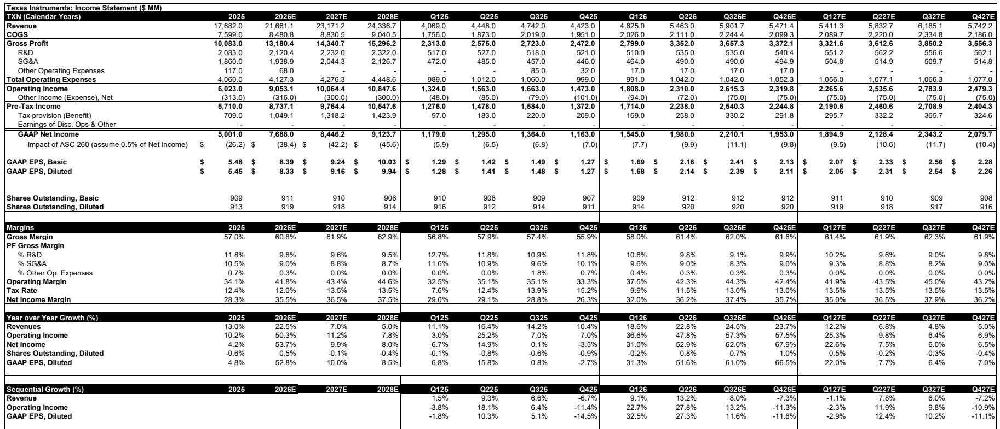
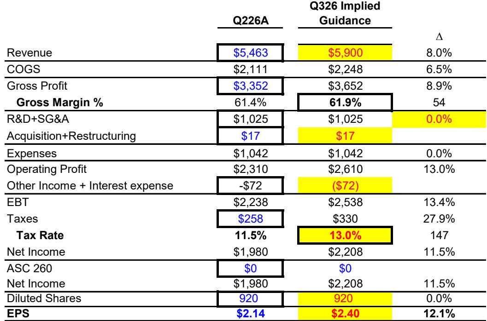

# Texas Instruments 的模拟业务复苏势头强劲，但估值已提前反映了增长潜力

Texas Instruments 第二季度业绩表现强劲，按历史标准衡量也相当出色——营收 54.63 亿美元，每股收益 2.14 美元，均大幅超出市场预期，毛利率较预期高出 185 个基点。工业营收同比增长约 30%，数据中心营收弹性较高，汽车业务实现中十几位数的增长。公司预计第三季度营收为 59.0 亿美元，远高于市场预期的 56.1 亿美元，毛利率接近 62%。这不仅仅是一个表现良好的季度；这是 Texas Instruments 自 2009 年以来较强劲的第二季度环比增长。

然而，该公司的报价是过去收益的 54 倍以上，是 2027 年预期收益的 32 倍以上。市场已经在为一个多年复苏周期定价，而这一复苏在当前业绩中仅部分可见。对于观察者而言，核心战略问题并非 Texas Instruments 是否执行得当——显然是的——而是工业周期性、数据中心规模扩张和毛利率提升所带来的剩余增长空间，是否足以支撑一个几乎不容有失的估值倍数。证据表明，答案是否定的，至少目前如此。

运营势头与估值之间的张力，在半导体研究领域构成了一个常见的难题。该公司几乎所有终端市场的基本面轨迹都在改善，随着资本支出周期见顶，自由现金流也在积累。但公司的报价已经反映了到 2028 年收益增长的最佳情景。观察者必须权衡，未来十二到十八个月是否会带来足够大的正向盈利惊喜以跨越估值障碍，或者更审慎的做法是等待更好的入场时机。

## 工业周期热度创十多年来新高，引发对可持续性的思考

Texas Instruments 第二季度工业营收同比增长约 30%，环比增长约 10%。这是该公司自 2009 年以来录得的较强劲的第二季度环比增长，而 2009 年正值全球宏观环境低谷之后。这一对比具有启发性。2009 年的复苏是由严重需求崩溃后的库存补货推动的。当前周期则有所不同——它反映了工厂自动化、楼宇控制和工业基础设施等终端市场需求的真实复苏——但环比加速的幅度值得审视。

工业终端市场以其周期性著称，常常经历急剧的拐点，随后进入平台期。该公司已连续多个季度报告工业增长，比较基数正变得越来越高。当一个周期产生十七年来较强劲的环比增长时，一个自然的问题是，还有多少加速空间。Texas Instruments 管理层在第三季度指引中并未暗示任何减速，但大数法则同样适用。每一个额外的增长百分点，都需要从一个已大幅复苏的基数上贡献更大的相对营收。

风险不在于工业需求转为负面，而在于改善速度从过去两个季度的异常步伐中放缓。市场对 2027 年和 2028 年的共识预期已经包含了该公司工业业务的持续增长。如果下半年环比增速放缓至更正常的个位数中段水平，公司当前的估值倍数将无法为减速提供缓冲。观察者应关注经销商库存和交货周期，将其作为判断周期是见顶还是仍在构建的领先指标。

## 数据中心营收增长迅速，但规模尚小，不足以显著影响整体利润率

第二季度数据中心营收同比增长一倍，较上一季度 90% 的同比增速有所加快。这一增长轨迹令人印象深刻，公司受益于人工智能基础设施中电源管理和信号链产品的需求。但相对规模仍然不大。数据中心营收目前占总销售额的百分比在低两位数，这意味着年化贡献约为 6 亿至 7 亿美元。

数据中心增长对 Texas Instruments 的战略重要性毋庸置疑。该公司正在高压电源解决方案和热管理领域赢得设计订单，这些产品支持 AI 服务器机架和网络设备。在三到五年的视野内，数据中心可能成为重要的营收驱动力。但对该板块毛利率和每股收益的短期影响，受限于其较小的基数。弹性较高一个小数字，在相对数值上仍然是一个小数字。

对于利润率扩张而言，更相关的动态是模拟产品内部的结构性转变，其中工业和汽车业务的利润率高于个人电子产品。数据中心产品，尤其是电源管理集成电路，往往面临竞争性的定价环境，限制了毛利率的上行空间。Texas Instruments 预计第三季度毛利率约为 62%，高于第二季度的 61.4%。这一改善是由更高的工厂利用率和更好的固定成本吸收驱动的，而非数据中心规模效应。在数据中心营收达到总销售额的 20% 或更多之前，其对整体利润率扩张的贡献充其量是增量式的。

## 毛利率复苏真实存在，但面临限制上行空间的结构性约束

第二季度毛利率环比提升 340 个基点，从 58.0% 升至 61.4%，第三季度指引暗示将再提升约 60 个基点至 62% 左右。复苏由两个因素驱动：营收增长提高了工厂利用率，以及管理层在财报电话会议中提到的定价行动的开始。两者都是积极的，但都不太可能将毛利率推回至该公司在 2021 年和 2022 年初达到的 65% 至 70% 的峰值水平。

结构性约束来自 Texas Instruments 庞大的资本支出计划，该计划在 2025 年总计约 46 亿美元，预计到 2026 年将下降至 20 亿至 30 亿美元。公司正在投资内部制造产能，特别是 300 毫米晶圆制造，这将长期降低单位成本，但需要高利用率才能产生有吸引力的回报。这些投资的折旧和摊销费用是一项固定成本，在产量达到每个新晶圆厂的盈亏平衡点之前，会压低报告的毛利率。

定价行动可以有所帮助，但模拟半导体市场竞争激烈，客户对定价纪律记忆犹新。Texas Instruments 历来在定价上采取审慎态度，更倾向于销量增长和市场份额提升，而非激进提价。当前的定价环境有利，因为供应链仍在从疫情时期的短缺中正常化，但提价窗口可能很窄。一旦客户认为交货周期正常化且替代供应充足，定价权就会减弱。到 2027 年的毛利率轨迹将更多地取决于销量增长和产品组合，而非定价杠杆。

## 观察者的决策框架：风险回报天平倾向于耐心

分析 Texas Instruments 的挑战在于，其运营故事引人入胜，但估值要求苛刻。一个严谨的决策框架必须权衡三个变量：盈利预期继续上升的概率、估值倍数扩张带来的潜在上行空间，以及如果周期比预期更早见顶的下行风险。

关于第一个变量，证据喜忧参半。第三季度指引远高于市场预期，表明近期预期将上调。但该公司自 2009 年以来较强劲的第二季度环比增长，也提高了未来业绩超预期的门槛。边际惊喜递减的规律适用。每个连续季度的强劲指引，都提高了下一季度必须超越的基准。

关于第二个变量，当前基于 2027 年收益的远期市盈率约为 32 倍，几乎没有留下倍数扩张的空间。该公司需要实现多年的中十几位数盈利增长，才能消化其当前的估值。从历史上看，Texas Instruments 因其模拟业务模式而享有高于半导体板块的溢价，但基于 2027 年收益的 32 倍市盈率意味着，市场已经在为一个可能需要两到三年才能完全实现的复苏定价。

关于第三个变量，下行风险是不对称的。如果工业周期见顶或数据中心增长放缓，公司报价可能重新定价至更正常的 25 至 28 倍远期收益，这意味着较当前水平下跌 15% 至 20%。随着资本支出下降，自由现金流回报表现正在改善，但 2026 年的每股自由现金流仍低于能够证明当前企业价值合理性的水平。

审慎的结论是，Texas Instruments 是一家具有清晰运营轨迹的优质公司，但风险回报方程并不支持在当前价位建立或增持头寸。鉴于基本面改善，已持有该公司的观察者可以合理维持头寸。考虑入场的观察者应等待报价回调或一段盘整期，使估值倍数更接近历史平均水平。六到十二个月后，该公司仍将执行良好，数据中心的机会将更加清晰可见。耐心并非否定研究结论；而是认识到市场已经消化了利好消息。

*仅供参考。部分内容可能基于源材料通过 AI 辅助生成、翻译、总结或编辑，可能存在遗漏或错误。请独立核实。本文不构成任何专业建议。*

仅供参考。部分内容可能基于源材料通过 AI 辅助生成、翻译、总结或编辑，可能存在遗漏或错误。请独立核实。本文不构成任何专业建议。

