# 全球数字资产研究

## 新兴AI基础设施：“第三方算力”趋势持续——交易活跃度与执行能力稳步提升

Gautam Chhugani

+91 226 842 1416

gautam.chhugani@bernsteinsg.com

Mahika Sapra

+91 226 842 1408

mahika.sapra@bernsteinsg.com

Sanskar Chindalia

+91 226 842 1445

sanskar.chindalia@bernsteinsg.com

Harsh Misra

+91 226 842 1457

harsh.misra@bernsteinsg.com

新兴AI基础设施相关公司（原数字资产矿企）近期持续获得市场关注，近几周内有多项新合作公布。根据我们的行业交易追踪，7月以来每周均有新交易达成，累计签约规模超过7.5GW，对应多年期合同总价值约1500亿美元。市场对于“第三方算力”模式的可持续性存在讨论，尤其是大型云厂商和AI实验室正在自建算力设施。我们认为，在当前数据中心建设面临一定政策讨论的背景下，“通电时间”和GW级电力管线（未来通电计划已排至2028-2030年）的价值更为突出——多数矿企的电力资源位于得克萨斯等州。此外，数字资产矿企在执行能力方面尚未获得充分认可：我们观察到，凭借多年在工程建设、劳动力管理和电力设备供应链方面的经验，这些企业正展现出按时交付的能力。我们对这一领域持积极看法，同时密切关注各管理团队在执行能力和客户关系维护方面的表现。

近期托管合作项目的基础设施开发商经济回报有所改善，主要体现在收入质量提升和高利润率结构（三净租赁模式）。WULF与Anthropic的合作尤为突出，每IT MW年均收入约240万美元，较行业平均水平（每IT MW约180万美元）提升约30%。CLSK和HUT的合作（约190万美元/MW）采用100%净营业收入利润率结构，基本实现收入全额转化为EBITDA。

除已签约订单外，矿企在数据中心建设面临政策挑战的背景下，展现出供应链管理、劳动力组织和社区关系维护的能力。WULF、GLXY和RIOT等企业已按时完成首批签约容量的通电。预计2026年下半年交付节奏将进一步加快：WULF将向Fluidstack交付378 IT MW，CORZ将向CoreWeave扩展至450 IT MW，CIFR将启动AWS和Fluidstack合同的分阶段交付。

IREN已将2026年预计年度经常性收入指引从37亿美元上调至超过40亿美元。其中85%已签约，IREN正就2026年和2027年全部扩建项目与客户进行积极沟通。对于IREN近期签订的AI云服务合同，我们估计定价较初期合同提升约20-25%。此外，IREN管理层表示，客户预付比例可达GPU资本支出的45%。除与微软和NVIDIA的长期合同外，IREN的云服务客户名单已扩展至Perplexity、Fluidstack、Fireworks、Figure AI（机器人领域）等。

## BERNSTEIN 代码表

<table><tr><td rowspan="2"></td><td colspan="4">2026年7月22日</td><td>TTM</td><td colspan="4">报告每股收益</td><td colspan="3">报告市盈率（倍）</td></tr><tr><td></td><td></td><td rowspan="2">收盘价</td><td rowspan="2">目标价</td><td rowspan="2">相对表现</td><td></td><td></td><td></td><td></td><td></td><td></td><td></td></tr><tr><td>代码</td><td>评级</td><td>货币</td><td>货币</td><td>2025A</td><td>2026E</td><td>2027E</td><td>2025A</td><td>2026E</td><td>2027E</td></tr><tr><td>IREN (IREN)</td><td>O</td><td>USD</td><td>41.28</td><td>100.00</td><td>98.5%</td><td>USD</td><td>0.41</td><td>(0.14)</td><td>(1.04)</td><td>100.7</td><td>(288.0)</td><td>(39.6)</td></tr><tr><td>WULF (TeraWulf)</td><td>O</td><td>USD</td><td>19.49</td><td>36.00</td><td>256.0%</td><td>USD</td><td>(1.66)</td><td>(1.66)</td><td>(0.71)</td><td>(11.7)</td><td>(11.8)</td><td>(27.3)</td></tr><tr><td>CIFR (Cipher)</td><td>O</td><td>USD</td><td>24.46</td><td>32.00</td><td>247.3%</td><td>USD</td><td>(2.15)</td><td>(1.13)</td><td>(0.53)</td><td>(11.4)</td><td>(21.6)</td><td>(46.2)</td></tr><tr><td>CORZ (Core Scientific)</td><td>O</td><td>USD</td><td>23.62</td><td>32.00</td><td>56.2%</td><td>USD</td><td>(0.88)</td><td>(0.92)</td><td>0.26</td><td>(26.8)</td><td>(25.6)</td><td>90.8</td></tr><tr><td>CLSK (Cleanspark)</td><td>O</td><td>USD</td><td>15.33</td><td>24.00</td><td>4.2%</td><td>USD</td><td>1.25</td><td>0.08</td><td>1.07</td><td>12.3</td><td>183.3</td><td>14.3</td></tr><tr><td>RIOT (Riot)</td><td>O</td><td>USD</td><td>23.38</td><td>30.00</td><td>44.2%</td><td>USD</td><td>(1.95)</td><td>1.36</td><td>(0.77)</td><td>(12.0)</td><td>17.1</td><td>(30.2)</td></tr><tr><td>MARA (MARA)</td><td>M</td><td>USD</td><td>12.41</td><td>17.00</td><td>(48.2)%</td><td>USD</td><td>(3.69)</td><td>3.29</td><td>(1.22)</td><td>(3.4)</td><td>3.8</td><td>(10.1)</td></tr><tr><td>SPX</td><td></td><td></td><td>7,498.96</td><td></td><td></td><td></td><td></td><td></td><td></td><td></td><td></td><td></td></tr></table>

O - 优于市场，M - 与市场同步，U - 弱于市场，NR - 未评级，CS - 暂停覆盖

来源：彭博、Bernstein估算与分析

## 研究启示

新兴AI基础设施公司凭借其规划的30GW电力组合和按时交付“通电基础设施”的运营能力，在解决“算力时效”问题方面处于有利位置。过去两年间，矿企已与大型云厂商、新型云服务商和AI芯片制造商签约7.5GW电力容量，涉及20余项合作，总价值超过1500亿美元。

我们对WULF（目标价36美元）、CIFR（目标价32美元）、CORZ（目标价32美元）、CLSK（目标价24美元）、RIOT（目标价30美元）给予优于市场评级，对MARA给予与市场同步评级（目标价17美元）。我们持续看好IREN作为垂直整合新型云服务商的发展方向，给予优于市场评级（目标价100美元）。

## 详细分析

数字资产矿企——规划电力组合（MW）  
图表1：数字资产矿企转型：交付约7.5GW电力，对应约1500亿美元签约收入  
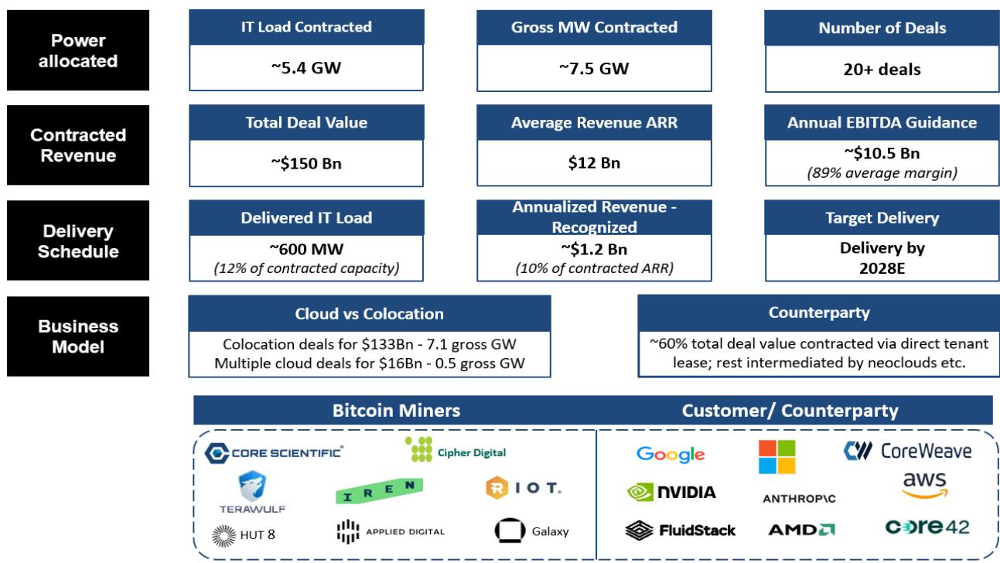  
CORZ、CIFR、WULF、IREN、RIOT、Google、MSFT、CRWV、Amazon、NVIDIA、AMD - 已覆盖；其余未覆盖
来源：公司文件、Bernstein分析

图表2：数字资产矿企的电力优势：在主要数据中心市场拥有约30GW规划电力  
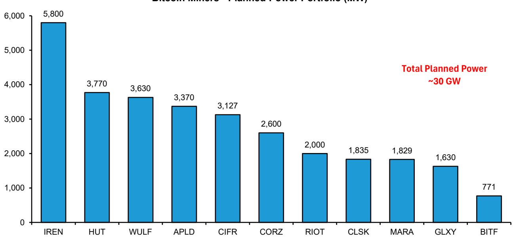  
注：HUT包含1.7GW整理版电力；CIFR排除500MW Milsing站点  
来源：公司文件、Bernstein分析

图表3：数字资产矿企——预计AI收入增长路径  
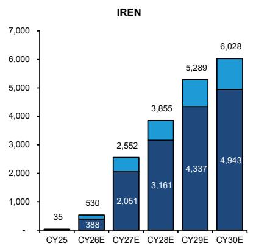

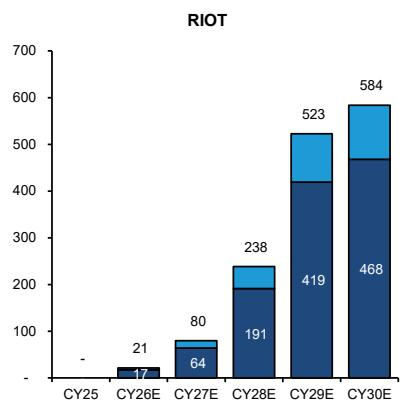

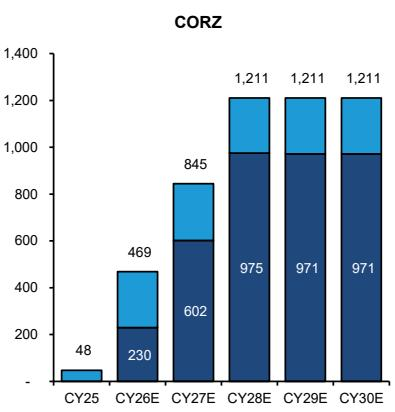

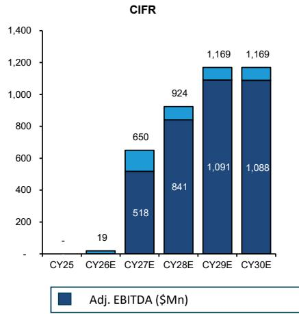  
净收入按直线法计算，不含电力成本转嫁  
来源：公司文件、Bernstein估算与分析

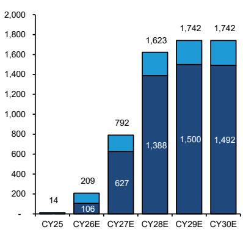

ERCOT大负荷并网排队（GW）

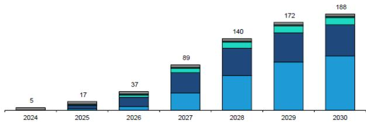

## 图表4：并网时间仍是持续优势

## 1 电网仍受容量限制，主要数据中心市场并网时间延长至4年

规划

包括预申请、范围界定和正式排队

研究

包括筛选研究、系统影响研究和设施研究

协议

包括输电服务协议、建设/设施协议、限电补充协议等

建模与遥测

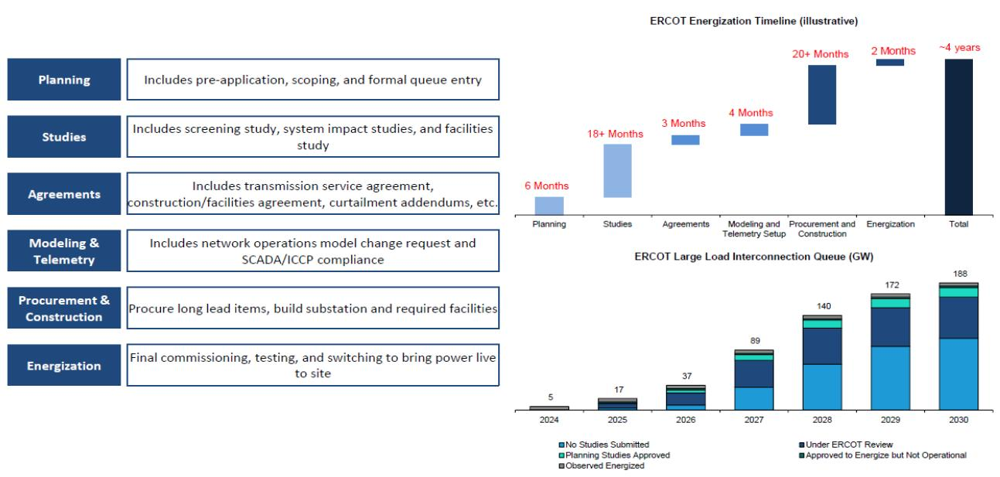

包括网络运营模型变更请求和SCADA/ICCP合规

采购与建设

采购长周期设备，建设变电站和必要设施

最终调试、测试和切换，实现现场通电

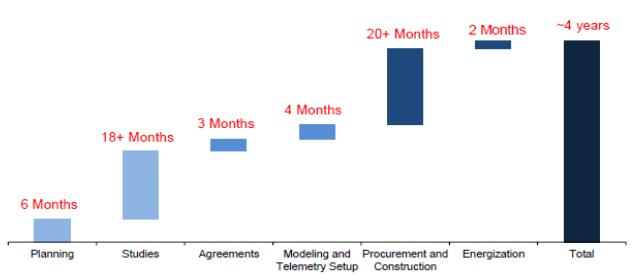

并网排队基于ERCOT 2025年7月状态更新  
来源：ERCOT、公司介绍、Bernstein分析

## 图表5：数据中心面临的政策与监管因素

## 2 美国各州数据中心面临的政策与监管因素

<table><tr><td></td><td>挑战类别</td><td>州</td></tr><tr><td></td><td>电网、费率支付者保护</td><td>威斯康星、马里兰、俄克拉荷马</td></tr><tr><td></td><td>环境/用水/气候</td><td>纽约、佛蒙特</td></tr><tr><td></td><td>税收激励与补贴审查</td><td>弗吉尼亚、南卡罗来纳、密歇根</td></tr><tr><td></td><td>分区/规划控制</td><td>佐治亚、南达科他、新罕布什尔</td></tr></table>

<table><tr><td>新进入者在TX面临的挑战</td><td>数字资产矿企的优势</td></tr><tr><td>ERCOT批次流程（主要挑战）：分批审批并网，排队位置、站点准备情况和满足成熟度里程碑的能力日益重要</td><td>预批准站点，以及对电力市场的长期理解和电网支持历史</td></tr><tr><td>电网容量、等待时间和“表后”解决方案：现有发电/输电承压，开发商正在寻找“表后”替代方案</td><td>传统电力合同和管理大负荷的经验。许多企业拥有多元化司法管辖区</td></tr><tr><td>用水、冷却、环境压力：州计划未考虑数据中心增量需求</td><td>矿机高密度冷却和用水方面的技术积累</td></tr><tr><td>地方政治阻力：针对大型、永久性超大规模园区</td><td>传统矿场位于郊区、工业区，已融入当地</td></tr></table>

各州问题仅为说明潜在监管挑战来源，并非详尽无遗。  
来源：Bernstein分析

## AI托管——订单增长、经济回报改善、执行按计划推进

新兴AI基础设施企业（原数字资产矿企）迄今已签约约7GW总电力，用于长期AI托管租赁，客户包括大型云厂商、新型云服务商、企业和高信用评级租户。根据我们追踪的标的，行业AI托管订单簿约为1350亿美元（不含扩展选项）。7月以来，矿企已通过3项托管租赁签约1.2GW总电力，合同总价值350亿美元。以下是近期合作的主要看点：

（一）新老客户交易势头强劲：我们的新兴AI基础设施企业（原数字资产矿企）持续与新老客户签署托管协议。我们认为，不断增长的新客户基础和与现有租户关系的深化，对成熟基础设施企业（如HUT、WULF）和新进入者（如CLSK）均有利。近期，WULF与Anthropic签署190亿美元合作，CLSK与一家全球科技公司签署66亿美元合作，HUT与现有高信用评级客户签署另一项98亿美元合作。重复合同是执行信誉和客户关系改善的有力信号。

（二）经济回报改善——三净结构、长期限：租赁结构正向基础设施型三净经济模式趋同。在三净租赁下，租户承担电力、运营成本、税费和保险，房东实际获得约100%的净营业收入利润率。2026年7月宣布的三项托管合作中，CLSK和HUT已获得三净租赁，WULF尚未披露与Anthropic合作的预期净营业收入利润率。此外，近期托管合作的基础期限为15-20年（行业初期合作为10-12年）。更长的合同期限限制了未来租金上涨空间，但也提高了未来收入可见性，降低了数据中心建设资本支出的风险。

（三）数字资产矿企持续指引每IT MW资本支出900-1200万美元：托管业务受益于轻资本结构。尽管供应链紧张和执行复杂，数字资产矿企迄今未出现成本超支。矿企对近期合作持续指引每IT MW资本支出900-1200万美元。此外，矿企已获得合同保护措施应对资本支出增加——例如，亚马逊（由Mark Shmulik覆盖）对Cipher的Stingray合作中，每IT MW超过1050万美元的资本支出由亚马逊补偿。

（四）融资利差改善：数字资产矿企支持的数据中心项目融资利差持续改善。矿企现直接向高信用评级租户提供容量，提升了数据中心资产的融资可行性。HUT的42.5亿美元投资级票据获Baa2评级，定价为T+165个基点（利率6.129%）。这是迄今数据中心建设融资中规模最大、定价最紧、评级最高的单一发起人投资级债券发行。

（五）交付按计划推进：执行和按时交付对于试图建立可扩展数据中心平台的数字资产矿企至关重要。矿企已达成初期交付里程碑——Galaxy（未覆盖）近期在Helios完成133 IT MW一期通电，WULF已向Core42交付60 IT MW等。我们预计2026年下半年交付节奏将加快：WULF将向Fluidstack交付378 IT MW，CORZ将向CoreWeave扩展至450 IT MW，CIFR将启动AWS和Fluidstack合同的分阶段交付。

## 近期托管合同——WULF、CLSK和HUT

## WULF

WULF宣布（链接）与Anthropic签署190亿美元AI合同，这是其第三个AI合作项目，客户阵容包括Core42（非上市）、Fluidstack（谷歌支持）和Anthropic（非上市）。WULF的AI订单簿现达270亿美元签约收入，对应约839 IT MW，合同期限10-20年。

WULF宣布与Anthropic签署190亿美元合作：WULF在Justified Data站点（肯塔基州）向Anthropic提供401 IT MW容量。WULF尚未披露利润率结构和资本支出细节，但合作主要条款包括：

- 合同期限：与Anthropic在肯塔基州Hawesville的Justified Data园区签署20年租赁协议，含两个5年续约选项，是新兴AI基础设施企业签署的期限最长的合作（同行仍以10-15年基础合同期限为主）。

- 收入质量：基础合同总收入约190亿美元，年均收入约9.5亿美元。假设3%年租金递增，基础租金（首年租金）较此前Lake Mariner的Fluidstack合作提升约10%。WULF持续受益于高效PUE建设（Justified Data合同PUE为1.2——总功率480 MW，IT功率401 MW）。

- 交付计划：WULF预计于2027年下半年向Anthropic交付首批容量，2028年初完成全部交付。

- 融资：该合作预计获得投资级信用支持，融资条件优于WULF此前通过新型云服务商租户/谷歌信用支持安排获得的间接大型云厂商敞口合作。

WULF宣布出售Abernathy合资公司股权，优先考虑资产负债表管理和全资拥有模式：WULF宣布出售Abernathy合资公司50.1%股权，简化会计处理，转向全资拥有、直接客户关系和完全运营控制的基础设施业务模式。Abernathy合资公司4.5亿美元股权投资以5.3亿美元出售给Fluidstack牵头的读者集团（回报率约18%）。WULF计划将资金重新投入全资拥有的AI基础设施建设。

我们持续看好WULF的电力管线：WULF在肯塔基、马里兰和纽约等主要数据中心市场控制3.6GW电力资产，分散了单一州政策变化或电网动态带来的电力管线风险。WULF利用现有电力和输电基础设施的棕地站点，以较低增量资本支出交付高性能计算容量。电力管线支持多年开发周期，Muskie和Morgantown设施各支持1GW园区。WULF目标是在现有电力资产全面开发后，每年交付250-500 MW关键IT负荷。

## CLSK

CleanSpark（CLSK）宣布（链接）其首个AI托管合同，客户为一家高信用评级、领先的全球科技公司（租户名称未披露）。该20年三净租赁合同在CLSK位于佐治亚州Sandersville的站点提供175 IT MW，合同总收入66亿美元。

CLSK AI托管合作公告要点：

（一）规模：CLSK在佐治亚州Sandersville设施向一家全球科技公司提供175 IT MW。此外，租户已签署意向书和整理版安排，覆盖CLSK整个得克萨斯州组合——885 MW规划电力，占地718英亩。

（二）合同期限：基础合同期限20年，含两个5年续约选项。更长的合同期限提高了未来收入可见性，降低了数据中心建设资本支出风险。

（三）收入与利润率结构：CLSK获得66亿美元合同，20年合同期内年均收入3.3亿美元。租赁采用三净结构，实际产生约100%的净营业收入利润率，收入全额转化为运营EBITDA。CLSK合同每IT MW年均收入约190万美元，而WULF 7月初与Anthropic的20年合作为240万美元。不过，我们认为这反映了CLSK首单定价，随着CLSK建立执行记录（如我们覆盖的CIFR和WULF所示），经济回报将改善。

（四）资本支出指引：CLSK指引每IT MW资本支出1000-1200万美元。鉴于租户为高信用评级全球科技公司，我们预计项目融资细节将很快公布。根据我们的分析，该合作产生约12%的无杠杆内部回报表现（图表8）。我们认为，基于当前项目融资市场动态（贷款价值比80-90%，债务成本6-7%），CLSK的AI合同可带来显著的股权内部回报表现。

（五）交付计划：首批交付预计于2027年第四季度开始（签约后15-18个月上市时间）。CLSK受益于该站点已有的数字资产挖矿基础设施。

## HUT

HUT8（未覆盖）已将其Beacon Point园区全面商业化，与同一高信用评级租户签署第二份租赁合同，价值98亿美元，提供352 IT MW（三净租赁），使现有签约容量弹性较高至704 IT MW（1 GW总功率）（链接）。HUT在Beacon Point和River Bend园区合计签约约949 IT MW，合同总价值约270亿美元，年净营业收入约17.5亿美元。近期合同要点：

（一）规模：Beacon Point站点现签约704 IT MW容量，对应其AEP得克萨斯州互联协议下1 GW（总功率）公用事业容量。现有租户扩大了与HUT的合作，通过第二份租赁将签约容量从352 IT MW弹性较高至704 IT MW。

（二）合同期限：合同基础期限15年，含三个5年续约选项。

（三）收入与利润率结构：Beacon Point二期合同价值98亿美元，15年租赁期内年收入约6.55亿美元。这相当于每IT MW约186万美元，低于WULF 7月初与Anthropic合同的240万美元。然而，重复合同证明了HUT作为新兴AI托管企业的信誉。

（四）资本支出指引：资本支出指引与首份合同相同，为每IT MW 900-1100万美元。

（五）交付计划：二期合同数据大厅首批交付预计于2028年第二季度，一期合作交付预计于2027年第三季度开始。由于全部1 GW已通过与AEP得克萨斯州的互联协议获得，交付无需新增公用事业容量。HUT披露，场地准备正在进行中，一期长周期设备已采购，初期通电按计划于2027年第一季度进行。

图表6：数字资产矿企——签约容量与AI订单簿

数字资产矿企——IT MW签约量  
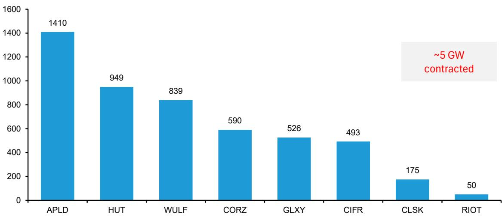

数字资产矿企——AI收入订单（十亿美元）  
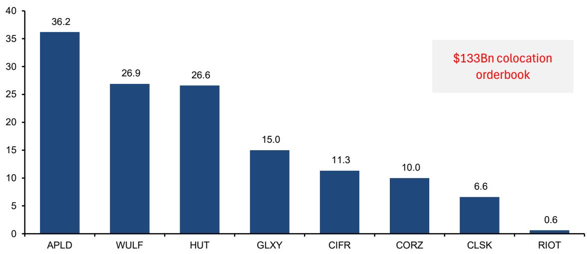  
截至2026年7月22日  
来源：公司文件、Bernstein分析

图表7：数字资产矿企——签约年收入与营业收入  
数字资产矿企——签约收入ARR（十亿美元）  
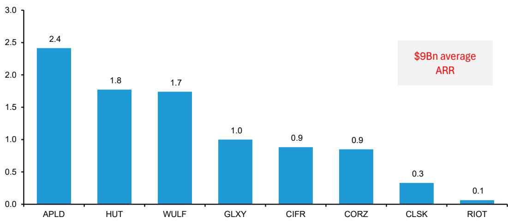

数字资产矿企——签约年净营业收入（十亿美元）与净营业收入利润率（%）  
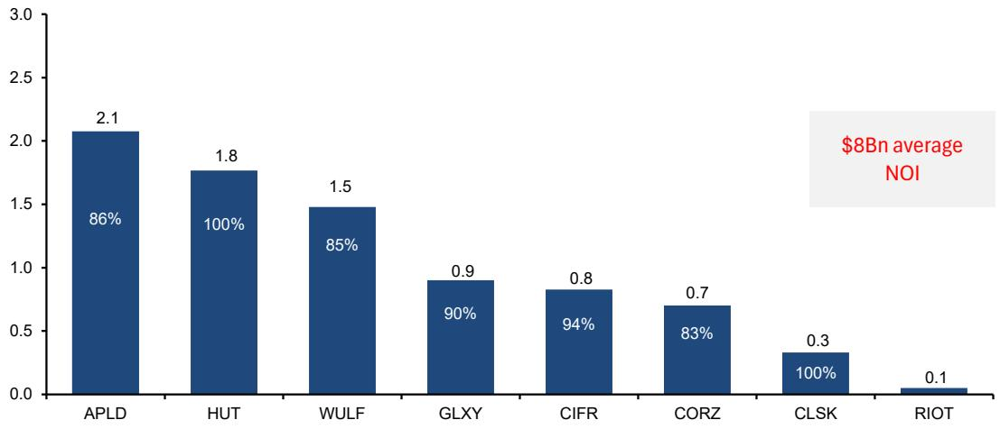  
假设WULF-Anthropic合作利润率85%，APLD混合利润率86%；数据截至2026年7月22日  
来源：公司文件、Bernstein分析

图表8：AI托管合作经济回报改善，无杠杆内部回报表现范围8-13%  
托管合作——估计无杠杆内部回报表现（%）  
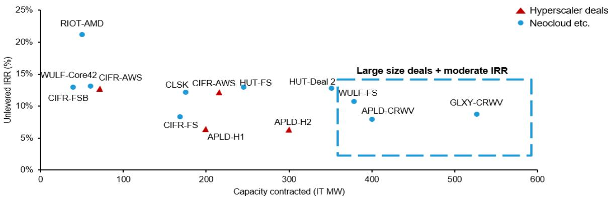

注：FS代表Fluidstack，H代表大型云厂商客户

<table><tr><td colspan="2">要点总结</td></tr><tr><td>规模与经济回报</td><td>大规模合作（300-500MW IT负荷）内部回报表现适中，介于8-12%，表明数字资产矿企倾向于确保更大合作规模，同时交易对手议价能力增强</td></tr><tr><td>交易对手</td><td>直接大型云厂商合作经济回报改善；HUT和CIFR的三净租赁结构带来超过12%的内部回报表现</td></tr><tr><td>改造与新建</td><td>较低的改造资本支出（如RIOT-AMD）或与客户的资本支出分摊安排（如CIFR-AWS）通过限制前期资本投入改善合作内部回报表现</td></tr></table>

图表9：数字资产矿企托管合作概览

<table><tr><td rowspan="2"></td><td colspan="2">概览</td><td colspan="3">规模</td><td colspan="3">收入与经济回报</td><td colspan="2">资本支出与交付</td></tr><tr><td>客户</td><td>地点</td><td>IT MW签约量</td><td>期限</td><td>合同收入</td><td>年均收入</td><td>每IT MW收入</td><td>NOI利润率</td><td>每IT MW资本支出</td><td>全面交付</td></tr><tr><td rowspan="3">CIFR</td><td>Fluidstack（谷歌）</td><td>得克萨斯州Barber Lake</td><td>207 MW</td><td>10年</td><td>38亿美元</td><td>3.8亿美元</td><td>180万美元/IT MW</td><td>86%</td><td>900-1100万美元</td><td>2027年第一季度</td></tr><tr><td>AWS</td><td>得克萨斯州Black Pearl</td><td>216 MW</td><td>15年</td><td>55亿美元</td><td>3.67亿美元</td><td>170万美元/IT MW</td><td>100%</td><td>950万美元</td><td>2027年第一季度</td></tr><tr><td>AWS</td><td>得克萨斯州Stingray</td><td>70 MW</td><td>15年</td><td>20亿美元</td><td>1.35亿美元</td><td>190万美元/IT MW</td><td>100%</td><td>1050万美元</td><td>2027年</td></tr><tr><td rowspan="3">WULF</td><td>Core42</td><td>纽约州Lake Mariner</td><td>60 MW</td><td>10年</td><td>10亿美元</td><td>1亿美元</td><td>170万美元/IT MW</td><td>85%</td><td>700-800万美元</td><td>2026年第一季度</td></tr><tr><td>Fluidstack（谷歌）</td><td>纽约州Lake Mariner</td><td>378 MW</td><td>10年</td><td>69亿美元</td><td>6.9亿美元</td><td>180万美元/IT MW</td><td>85%</td><td>800-1000万美元</td><td>2026年底</td></tr><tr><td>Anthropic</td><td>肯塔基州Justified Data</td><td>401 MW</td><td>20年</td><td>190亿美元</td><td>9.5亿美元</td><td>240万美元/IT MW</td><td>未披露</td><td>未披露</td><td>2028年</td></tr><tr><td rowspan="2">HUT</td><td>Fluidstack（谷歌）</td><td>路易斯安那州River Bend</td><td>245 MW</td><td>15年</td><td>70亿美元</td><td>4.67亿美元</td><td>190万美元/IT MW</td><td>约100%</td><td>900-1100万美元</td><td>2027年</td></tr><tr><td>高信用评级</td><td>得克萨斯州Beacon Point</td><td>704 MW</td><td>15年</td><td>196亿美元</td><td>13亿美元</td><td>190万美元/IT MW</td><td>约100%</td><td>900-1100万美元</td><td>2027年第三季度起</td></tr><tr><td rowspan="3">APLD</td><td>CoreWeave</td><td>北达科他州Polaris Forge 1</td><td>400 MW</td><td>15年</td><td>110亿美元</td><td>7.33亿美元</td><td>180万美元/IT MW</td><td>85-91%</td><td>1100-1300万美元</td><td>2027年上半年</td></tr><tr><td>大型云厂商1</td><td>北达科他州Polaris Forge 2</td><td>200 MW</td><td>15年</td><td>50亿美元</td><td>3.33亿美元</td><td>170万美元/IT MW</td><td>83-89%</td><td>1100-1300万美元</td><td>2027年上半年</td></tr><tr><td>大型云厂商2</td><td>Delta Forge 1&2 Polaris Forge 3</td><td>810 MW</td><td>15年</td><td>200亿美元</td><td>约13亿美元</td><td>170万美元/IT MW</td><td>82-88%*</td><td>1100-1300万美元*</td><td>2028年上半年+</td></tr><tr><td>CORZ</td><td>CoreWeave</td><td>TX、OK、GA、NC</td><td>590 MW</td><td>12年</td><td>100亿美元</td><td>8.5亿美元</td><td>140万美元/IT MW</td><td>80-85%</td><td>150万美元**</td><td>2027年初</td></tr><tr><td>CLSK</td><td>高信用评级</td><td>佐治亚州Sandersville</td><td>175 MW</td><td>20年</td><td>66亿美元</td><td>3.3亿美元</td><td>190万美元/IT MW</td><td>约100%</td><td>1000-1200万美元</td><td>2028年第一季度</td></tr><tr><td>GLXY</td><td>CoreWeave</td><td>得克萨斯州Helios</td><td>526 MW</td><td>15年</td><td>150亿美元</td><td>10亿美元</td><td>190万美元/IT MW</td><td>90%</td><td>1100-1300万美元一期</td><td>2028年</td></tr><tr><td>RIOT</td><td>AMD</td><td>得克萨斯州Rockdale</td><td>50 MW</td><td>10年</td><td>6亿美元</td><td>6400万美元</td><td>130万美元/IT MW</td><td>80%</td><td>350万美元</td><td>2027年第二季度</td></tr></table>

CORZ、IREN、CIFR、CLSK、WULF、RIOT、CRWV、AMD、AWS（亚马逊）、Google（Alphabet）由Bernstein覆盖，其余未覆盖；*APLD大型云厂商2合作利润率、资本支出基于初始合同披露细节；**CORZ资本支出较低因改造项目；数据截至2026年7月22日  
来源：公司文件、Bernstein分析

图表10：WULF活跃的并购策略支持2026-2030年高可见性电力管线  
WULF——电力容量增长（MW）  
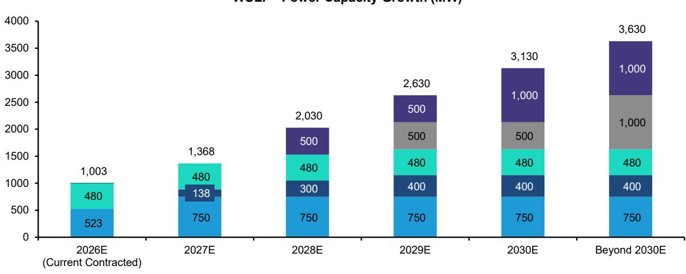  
■ 纽约州Lake Mariner ■ 纽约州Lake Hawkeye ■ 肯塔基州Justified Data ■ 马里兰州Chesapeake ■ 肯塔基州Muskie

WULF——活跃开发管线增长（MW）  
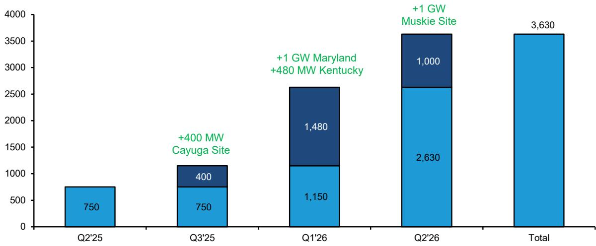  
来源：公司文件、Bernstein分析

WULF——签约MW（总功率）  
图表11：WULF AI订单簿：1003总MW签约，总收入约270亿美元  
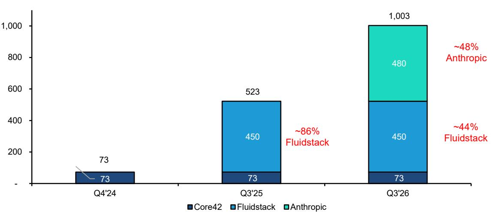

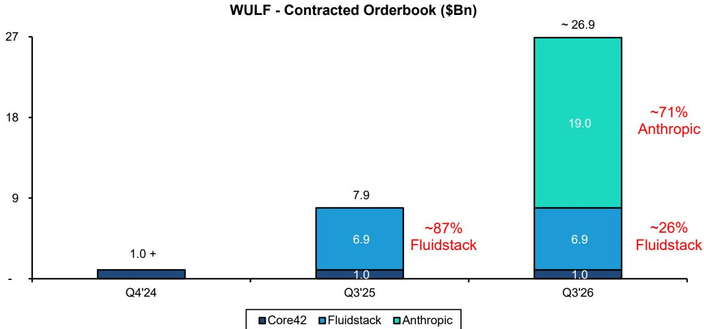  
来源：公司文件、Bernstein分析

## IREN：企业合同推动云服务ARR指引上调

IREN再次将2026年ARR目标从37亿美元上调至超过40亿美元，得益于近期与领先AI开发者签署的28亿美元多年期云服务合同。目标ARR的85%已签约（约34亿美元）。IREN正按计划建设480MW云服务容量，过去12个月从3MW增长至此。在纳入预计2027年初上量的NVIDIA合同后，IREN目标在540总MW基础上实现47亿美元云服务ARR。IREN客户现包括微软、NVIDIA、Perplexity（未覆盖）、Fluidstack（未覆盖）、Figure AI（未覆盖）、Together AI（未覆盖）、Fireworks AI（未覆盖）、Fal AI（未覆盖）、Hume AI（未覆盖）以及一家新的领先AI开发者（名称未披露）。

## 我们对28亿美元新AI云服务合同的看法

- 企业定价改善：根据IREN 2026财年第一季度更新，IREN已签约37亿美元ARR中的24亿美元（不含NVIDIA合同）。基于新合同经济回报，IREN将ARR指引上调约3亿美元，因此我们估计新合同定价提升约20-25%。

- 平均合同期限：加权平均合同期限约4年。调整5年期的微软和NVIDIA合同后，我们预计新企业合同平均期限约3年。在PUE为1.3（60总MW对应45 IT MW）的情况下，我们预计NVIDIA合同每IT MW年收入约1500万美元，GPU资本支出回收期不到2.5年。在40亿美元混合ARR基础上，IREN的GPU资本支出回收期约2.6年，
