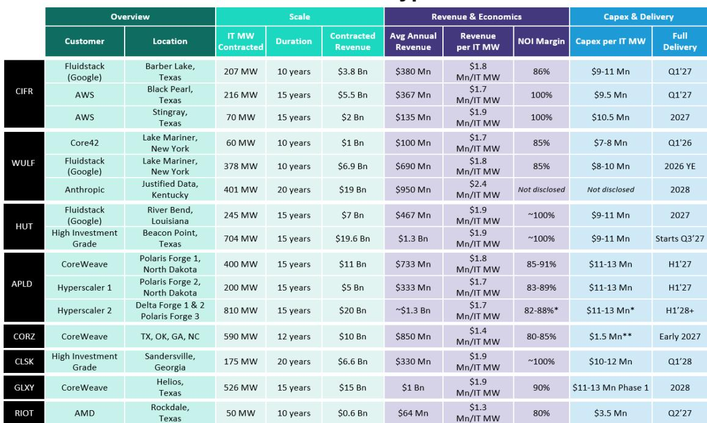
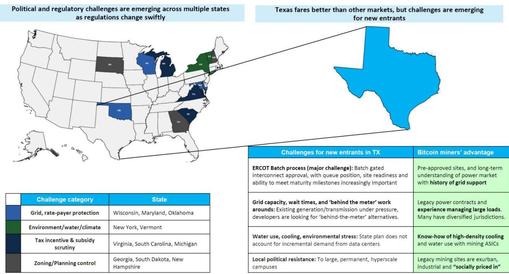

# 从比特币矿场到AI基础设施：那些正在转型的公司

在科技基础设施领域，最引人注目的战略转型已不再是假设，而是一个可衡量的趋势。一批曾以比特币挖矿闻名的公司，已通过20多笔交易，向超大规模云服务商、新型云服务商和AI芯片制造商提供了7.5吉瓦的电力容量，合同总价值超过1500亿美元。仅7月份，三项新的托管租赁协议就增加了1.2吉瓦的总电力和350亿美元的合同价值。这些数字并非乐观预测，而是已签署的协议，租户包括Anthropic、亚马逊云服务、CoreWeave、Fluidstack和微软。

对于观察者而言，核心问题是这种“第三方容量”模式是可持续的还是暂时的。一种观点认为，超大规模云服务商和AI实验室最终会自建数据中心，使中间商变得多余。但这种观点忽略了一个结构性现实。当前AI基础设施中最稀缺的资源不是芯片、不是资本，也不是工程人才，而是“通电时间”。在美国最大的数据中心市场ERCOT，电网互联排队时间从规划到通电已延长至四年。从弗吉尼亚到纽约再到佐治亚，各州对数据中心开发的政治反弹正在蔓延。在这种背景下，那些已经拥有预审批电力站点、具备现有电网互联能力、并展现出按时交付能力的企业，并非中间商，而是实现规模化发展的可行路径。

关键不在于这些公司能否与超大规模云服务商竞争，而在于超大规模云服务商和AI实验室需要它们，因为单靠自身无法解决“通电时间”问题。这些公司持有的30吉瓦规划电力容量，加上其执行记录，创造了一条多年发展路径，且越来越难以复制。新进入者的窗口正在关闭，而非打开。

## 近期托管交易显示，随着市场成熟，经济性正在改善而非压缩

一个常见的担忧是，随着超大规模云服务商获得谈判优势，第三方基础设施提供商将面临定价压力。但近期交易数据给出了相反的结论。TeraWulf与Anthropic的合同于7月初宣布，每IT兆瓦年均收入为240万美元，比行业平均每IT兆瓦180万美元提高了30%。合同期限为20年，附带两个五年续约选项，是新兴AI基础设施参与者签署的期限最长的交易。CleanSpark的首个托管合同与一家未公开的全球科技公司签署，每IT兆瓦收入为190万美元，采用三净租赁结构，几乎100%的收入转化为运营EBITDA。Hut 8与现有高投资级客户的最新交易同样采用了三净租赁结构。

模式很清晰。该领域的早期交易期限较短、收入回报表现较低、利润率结构较差。随着这些公司建立执行信誉，它们正在谈判更有利的条款。三净租赁结构下，租户承担电力、运营成本、税费和保险，实际上将这些公司转变为纯房东，运营费用风险为零。这不是大宗商品业务，而是一项基础设施业务，其单位经济性因供应稀缺和交付能力而不断改善。

改善不仅体现在收入回报表现上。随着租户从新型云服务商转向直接与超大规模云服务商和投资级对手方合作，融资利差正在收窄。Hut 8的42.5亿美元投资级票据，评级为Baa2，定价为国债加165个基点，是迄今为止单一发起人数据中心建设融资中规模最大、定价最紧、评级最高的投资级债券。随着合同质量提高，获得更廉价资本的渠道也在改善，形成了强化现有企业竞争优势的良性循环。

## 执行信誉是多数人低估的差异化因素

市场历来低估比特币矿商的运营能力，将其视为大宗商品开采者而非基础设施开发商。这种认知正在成为识别模式的观察者的机会。该群体中的多家公司已按时完成其合同容量的初始阶段通电。Galaxy Digital最近在Helios完成了133 IT兆瓦的一期工程。TeraWulf正向Core42提供60 IT兆瓦的计费服务。IREN已将其2026年年度经常性收入指引从37亿美元上调至超过40亿美元，其中85%已签订合同。

这一执行记录的意义在于其背景。更广泛的数据中心建设行业正面临供应链瓶颈、劳动力短缺和监管障碍带来的持续延误。比特币矿商带来了不同的技能组合。他们在管理自身挖矿业务的建设、劳动力和电力设备供应链方面拥有多年经验。他们了解如何应对ERCOT电网互联排队。他们与公用事业公司和当地社区有预先存在的关系。他们知道如何管理高密度冷却，这可以直接从挖矿ASIC转移到AI加速器。

交付速度预计将在2026年下半年加快。TeraWulf计划向Fluidstack交付378 IT兆瓦。Core Scientific正与CoreWeave合作扩展至450 IT兆瓦。Cipher Mining正开始分阶段交付其AWS和Fluidstack合同。每一次按时交付都在建立信誉，进而吸引更好的租户、更优的融资条件和更高的定价。持续执行的公司将脱颖而出，而市场尚未充分反映这一差异化。

## 决策框架：识别哪些公司会脱颖而出的四个标准

并非所有前矿商都能在这一转型中同样成功。市场已在执行、客户质量和资产负债表管理方面显示出分化。观察者应根据四个标准评估公司，这些标准决定了该领域的长期价值创造。

首先，电力管道质量和地理多样性比总兆瓦数更重要。一家在肯塔基、马里兰和纽约拥有3.6吉瓦容量的公司，比集中在一个州或电网区域的公司面临的监管风险更小。对数据中心的政治反弹是真实且不断增长的。威斯康星、马里兰和俄克拉荷马已对电网保护和用户成本表示担忧。纽约和佛蒙特提到了环境和用水问题。弗吉尼亚和南卡罗来纳已审查税收优惠。佐治亚、南达科他和新罕布什尔已收紧分区和规划控制。在多个司法管辖区拥有预审批站点的公司具有结构性对冲，而单一州玩家则缺乏这一点。

其次，客户质量和关系深度决定收入持久性。理想的租户组合包括直接与超大规模云服务商的关系、投资级信用和重复合同。重复合同是执行信誉的有力指标。TeraWulf现在有三项AI交易，客户名单包括Core42、Fluidstack和Anthropic。IREN的云客户现在包括Perplexity、Fluidstack、Fireworks和Figure AI，此外还有与微软和NVIDIA的长期合同。不断增长和多样化的客户群降低了集中度风险，并表明市场认可这些公司为可靠的基础设施合作伙伴。

第三，资产负债表管理和融资能力区分赢家与落后者。建设30吉瓦数据中心容量的资本需求巨大。能够以较窄利差获得投资级融资的公司将拥有更低的资本成本和更高的投入资本回报率。TeraWulf以5.3亿美元出售其在Abernathy合资企业50.1%的股权，从其4.5亿美元股权投资中获得18%的回报，展示了资本配置的纪律性。所得款项正重新部署到全资拥有的AI基础设施中，这提供了更好的经济性和完全运营控制。

第四，利润率结构和单位经济性揭示哪些商业模式真正可扩展。向100%净营业收入利润率的三净租赁转变是积极发展，但并非所有交易都相同。TeraWulf与Anthropic的交易每IT兆瓦240万美元、期限20年，在结构上优于CleanSpark的首笔交易每IT兆瓦190万美元。这一差距反映了随着执行记录而来的定价能力。能够在连续交易中展示单位经济性改善的公司正在建立复利优势。

## IREN的模式提供了垂直整合下一阶段的视角

IREN代表了该领域内一条独特的战略路径。与纯托管提供商不同，IREN正在构建一个垂直整合的新型云服务商，将基础设施所有权与直接AI云服务相结合。该公司将2026年年度经常性收入指引上调至超过40亿美元，其中85%已签订合同，反映了一种同时捕获基础设施利差和云服务利润率的商业模式。

细节很重要。IREN最近的AI云合同显示，与初始合同相比，定价提高了20%至25%。客户预付高达45%的GPU资本支出，这大大降低了IREN的营运资本需求并提高了投入资本回报率。客户群已扩展到微软和NVIDIA之外，包括Perplexity、Fluidstack、Fireworks和机器人公司Figure AI。这种多样化表明IREN的基础设施正在吸引更广泛的AI工作负载，而不仅仅是大型语言模型训练。

垂直整合模式承担更高的运营风险，但也带来更高的潜在回报。它需要GPU集群管理、网络和软件优化方面的深厚专业知识，这些能力超越了房地产开发。IREN获得预付款和定价改善的能力表明市场重视这种整合服务。对于愿意承担更高执行风险的观察者而言，垂直模式可能提供不对称的上行空间。对于寻求更可预测现金流的人而言，采用三净租赁的纯托管模式提供了更高的可见性。

两种模式的共同点是相同的结构性优势：通电时间和执行信誉。无论一家公司选择成为房东还是云服务提供商，基础都是一样的。那些已经获得电力、建立关系并按时交付的公司，将定义AI基础设施的下一个阶段。

*仅供参考。部分内容可能基于源材料通过AI辅助生成、翻译、总结或编辑，可能存在遗漏或错误。请独立核实。本文不构成专业建议。*

仅供参考。部分内容可能基于源材料通过AI辅助生成、翻译、总结或编辑，可能存在遗漏或错误。请独立核实。本文不构成专业建议。

