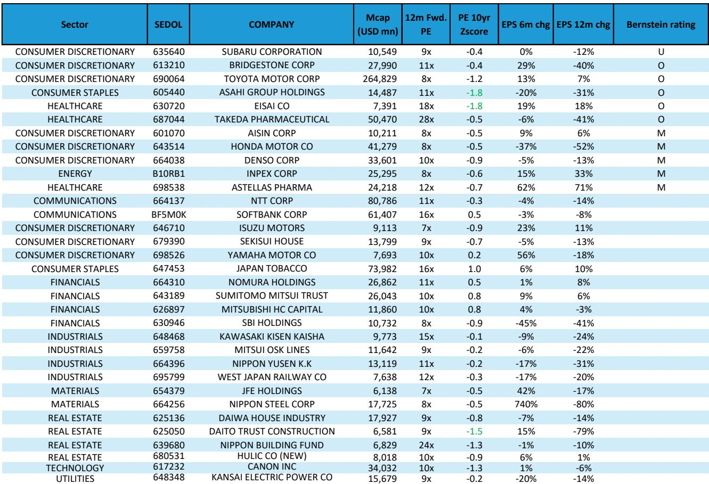
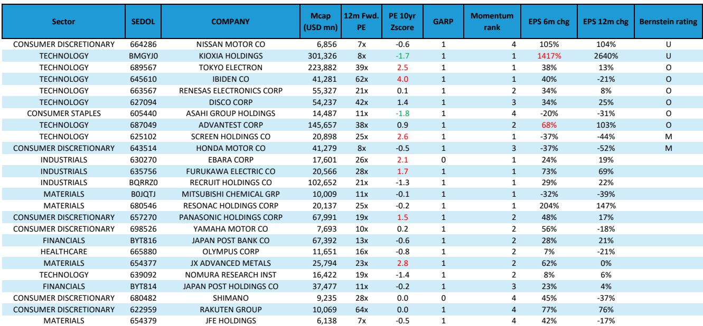
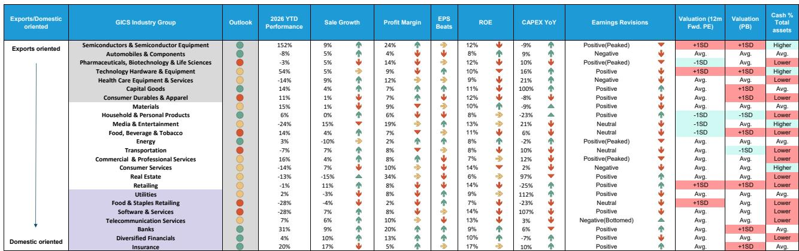

# 日本市场观察：估值、盈利与资金流向的协同效应

日本相关指数在2026年上半年表现活跃，MSCI日本指数上涨16%，日经225指数上涨29%。7月市场出现约6%的调整，估值已回落至十年均值水平。市场远期市盈率从2月的17倍降至14.9倍，此前市场关注的估值偏高问题已得到缓解。这并非市场动能耗尽，而是价格重新调整至一个基本面支撑——盈利上调、外资流入以及机会范围扩大——能够维持进一步表现的水平，且无需依赖投机性过热。

看好日本市场的逻辑建立在三个相互支撑的支柱上，这在主要市场中较为罕见。首先，盈利修正周期广泛且积极，几乎所有行业都出现净上调。其次，外资机构资金流入在该区域最为强劲，全球主动型基金对该市场的配置比例从1月的-1.6%收窄至5月的-0.48%，仍有进一步调整空间。第三，市场同时提供价值和成长机会，而非迫使读者在两者之间做出选择。7月的回调通过重置市场情绪和估值，进一步强化了这一逻辑。

值得关注的是，日本市场的机会已不再局限于AI相关领域。虽然半导体类股上半年上涨101%，但银行、保险、商业与专业服务等内需板块同样表现强劲。市场正在扩大，战略问题在于如何在这一出口与内需、价值与成长、大盘与新兴小盘机会的双引擎结构中布局。

## 盈利上调周期广泛且仍有空间，为市场提供自我强化的支撑

日本是除韩国和台湾外，相对少见经历广泛盈利上调周期的亚洲大型市场。这并非集中于少数AI相关个股的狭窄现象。医疗保健、材料、金融、科技和工业板块均出现加速上调。即使是日本市场的普通个股——不仅是大盘龙头——也处于净上调区间，这是一个结构性信号，表明企业盈利环境正在自下而上改善。

其影响是显著的。广泛的盈利上调周期降低了投资组合管理中的个股和单一行业集中风险。它也为应对宏观冲击提供了基本面缓冲。当多个行业的盈利被上调时，市场能够吸收估值压缩而不进入调整阶段。7月远期市盈率从17倍降至14.9倍的同时，盈利仍在继续上调，这意味着市场因正确的原因而变得更便宜：价格调整，而非盈利恶化。

有一个值得注意的警示。科技、金融和工业板块的盈利预期目前处于历史高位。如果这些行业未能实现高预期，将产生脆弱性。然而，医疗保健和材料板块的盈利上调周期仍在加速，尚未达到预期峰值。这为市场提供了轮动路径，而非广泛的盈利风险。

## 外资情绪支持但尚未过热，为持续流入留有空间

外资机构读者是2026年日本市场的主要需求驱动因素，年初至今净流入575亿美元。这是整个亚洲区域外资流入的最高水平。关键的是，全球主动型基金对该市场的配置仍低于MSCI ACWI IMI指数的基准。其配置比例已从-1.6%收窄至-0.48%，但尚未达到超配状态。这是自2009年以来的最低配置水平，但仍处于低配状态。

战略意义在于，边际买家尚未耗尽能力。如果全球主动型基金从低配转向标配或超配，增量资金可能相当可观。国内读者的情况则有所不同。日本散户读者年初至今已撤资50亿美元，国内机构净卖出400亿美元。这种外资买入与国内卖出的分化，是市场中的经典模式：本地读者持怀疑态度，而全球读者基于信念驱动。从历史看，当基本面得到盈利和估值支撑时，这种分化通常会朝着全球读者的方向解决。

近期，散户情绪似乎正在回归。如果国内读者开始重新入市，外资与国内买盘的结合可能形成强大的流动性支撑。风险在于，外资一直是边际驱动因素，全球风险偏好的任何逆转都可能使市场面临国内抛售压力。但盈利和估值背景降低了外资大幅流出的可能性。

## 出口与内需之争具有误导性；正确的框架是兼顾盈利动能与宏观支撑的杠铃策略

将日本市场简单划分为出口股和内需股的选择过于二元。上半年出口股大幅跑赢内需股——以美元计分别为35%和20%——受半导体和资本品推动。然而在7月，内需股以4%的涨幅跑赢出口股的-6%，原因是日元走强和AI交易出现动能消退。

基本面数据支持平衡策略而非方向性押注。内需股营收增长更强，为23%对出口股的12%，股息回报表现更高（2.2%对1.7%），回购回报表现更高（1.3%对0.5%），且估值更便宜，相对于出口股低于一个标准差。然而，出口股的净资产回报表现更高（11.2%对9.3%），盈利修正趋势也更好。

改变这一平衡的关键变量是日元。为出口股提供支撑的极端弱势日元阶段已基本过去。日元净空头头寸已达到2024年夏季以来的水平，交易员已开始为日元走强布局。市场定价日本央行10月加息概率为68%，12月为100%。日元走强和利率上升是内需板块的宏观支撑，而非出口股。

战略意义在于，读者应保持对两类股票的敞口，但随着宏观环境演变，可向内需股倾斜。出口股的盈利动能优势是真实的，但已越来越多地被定价。内需股的估值和宏观优势正从低迷基础改善，创造了不对称的上行空间。

## 行业评分卡指向从科技硬件和材料向银行、保险和资本品的轮动

行业评分卡从销售增长、利润率、盈利、净资产回报表现、资本支出、估值和资产负债表实力等维度评估行业，为行业配置提供前瞻性框架。目前评分卡显示，资本品、银行、多元化金融、保险、能源以及家庭与个人用品行业前景积极。制药、运输、食品饮料、食品与 staples 零售以及软件与服务行业前景偏弱。

最值得关注的是动能变化。汽车与零部件、银行和保险自上一季度以来保持强劲，仍处于积极区域。资本品、家庭与个人用品、能源和多元化金融从黄色改善为绿色。半导体从红色改善为绿色，考虑到该板块年初至今101%的涨幅，这一变化值得注意。然而，科技硬件与设备、医疗保健设备与服务、材料、商业与专业服务以及零售业已从绿色转为黄色或红色。

这种轮动模式表明，AI和科技硬件交易中的低垂果实已被摘取。下一阶段的表现可能来自基本面从较低基础改善的行业——银行和保险受益于加息周期和利润率改善，资本品受益于资本支出周期。评分卡还显示，半导体仍难以用此框架预测，这提醒我们AI主题可能需要单独的分析视角。

## 日本市场配置决策框架：以杠铃策略结合价值与成长，关注大盘同时留意小盘

数据中最具可操作性的见解是，价值和成长的杠铃策略仍是最优配置策略。上半年成长和动量因子领跑市场，而质量、低波动和小盘股落后。然而在7月，低波动、价值和高收益因子表现领先，而动量因子出现急剧消退。这种轮动与市场从狭窄的动量驱动上涨向更广泛、更基本面的上涨过渡是一致的。

决策框架应遵循三个步骤。第一，在成长股中，寻找动能可能增加的标的，而非直接持有动量敞口。那些同时具备价格动能和持续盈利上调的成长股，能够维持其领先地位。第二，在价值股中，认识到市场情绪已降至极度悲观水平，这在历史上标志着底部。价值股还受益于加息周期的宏观支撑，这有利于金融和其他利率敏感行业。第三，保持大盘股偏好，因为大盘股盈利支撑更强，但开始关注中小盘股中浮现的机会。

杠铃策略并非妥协。它是对日本市场同时提供两种不同回报驱动因素的认知：成长股的盈利动能和价值股的估值正常化。两者都得到宏观和资金环境的支撑。风险不在于持有错误的风格，而在于只持有一种风格而错过轮动。

*仅供参考。部分内容可能基于源材料通过AI辅助生成、翻译、总结或编辑，可能存在遗漏或错误。请独立核实。本文不构成任何专业建议。*

仅供参考。部分内容可能基于源材料通过AI辅助生成、翻译、总结或编辑，可能存在遗漏或错误。请独立核实。本文不构成任何专业建议。

