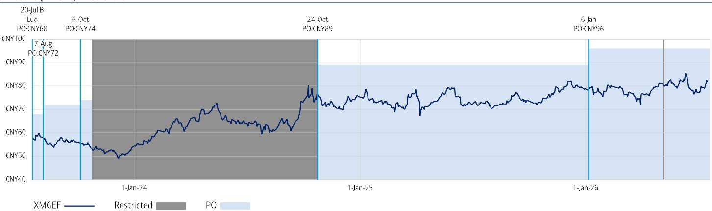
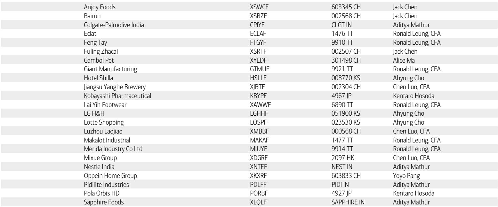
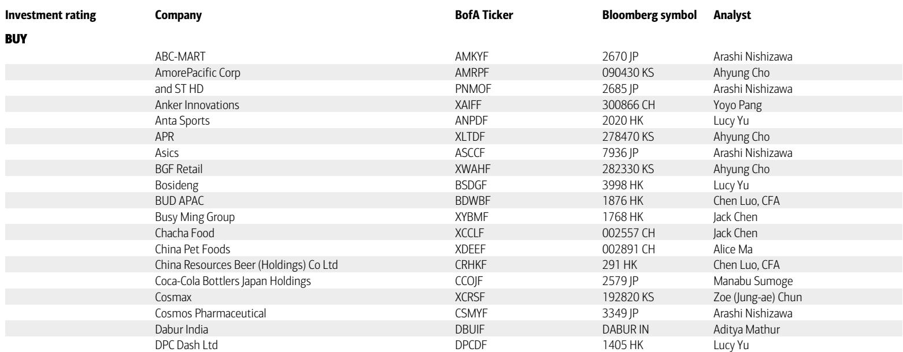

# BofA：美的集团业务与近期数据观察

BofA在7月发布的一份研报中，对美的集团（H/相关市场）给出了明确的判断：下半年展望正在改善。报告认为，尽管上半年收入增速可能落后于全年目标，但下半年存在追赶空间。支撑这一判断的因素包括国内与海外消费业务的基数效应、自有品牌持续增长，以及2B业务中储能和库卡机器人的相对强势。此外，报告还指出，公司持有的存储器研究可能在下半年产生可观的公允价值变动收益，这些收益在锁定期结束后有望通过特别分红等方式返还给股东。

## 1. 上半年节奏偏慢，下半年存在追赶空间

BofA预计美的2026财年收入增长在中等至高个位数区间，核心利润率基本稳定。但根据其测算，上半年实际运行节奏可能落后于全年指引。具体来看，国内2C业务一季度增长约低个位数，二季度可能转为低个位数下滑；海外2C业务一季度持平，二季度恢复至中等个位数增长。报告认为，下半年国内外业务均有望提速，主要原因是基数变低——上半年国内受以旧换新补贴拉动需求前置，海外则因贸易摩擦出现抢单，这些一次性因素消退后，下半年同比不确定性将明显减轻。同时，自有品牌（OBM）预计保持两位数增长，为海外业务提供额外支撑。

> **KC评论：** 这里的关键不是上半年数据本身，而是报告对“基数效应”的拆解。上半年海外抢单和国内补贴透支了部分需求，但这些是短期脉冲，下半年恢复正常节奏后，同比增速反而更容易改善。读者需要区分哪些是可持续的增长动力，哪些是一次性扰动。

## 2. 2B业务增速节奏变化，储能和库卡跑赢平均

美的2B业务（商业及工业解决方案）历史上保持超过10%的增长，但报告预计2026年增速将低于趋势水平，上半年约为中等个位数。影响因素主要来自工业解决方案板块中面向2C的零部件业务，以及智能建筑的高基数。但储能和库卡机器人两个子板块预计表现优于2B平均。这一结构分化值得关注：2B整体增速节奏变化并不意味着所有业务都同步走弱，部分高增长赛道仍在贡献增量。

## 3. 成本端不确定性缓解，利润率有望在下半年扩张

报告预计美的核心利润率将在下半年实现扩张。支撑这一判断的因素包括：塑料等原材料成本近期出现回调，以及公司对销售和管理费用的严格控制。上半年利润率可能受到成本端和外汇损失的压制，但下半年基数变低叠加成本改善，利润率修复的确定性相对较高。这一判断与收入端追赶的逻辑形成呼应——下半年不仅是收入加速期，也可能是利润弹性释放期。

## 4. 研究性收益提供股东回报的额外来源

报告特别提到，美的自二季度起将对其持有的存储器公司研究进行市值重估，预计二、三季度可能产生可观的公允价值变动收益。尽管部分收益可能被减值损失抵消，但整体仍有望贡献正收益。这些研究有一年锁定期，预计2027年到期后，美的可能将变现所得通过特别分红或其他方式返还给股东。结合公司当前接近100%的派息率（含回购），这一潜在收益为股东回报提供了额外的上行空间。

> **KC评论：** 研究性收益的兑现时间和金额仍有不确定性，但报告提供了一个清晰的逻辑链条：美的持有优质资产，锁定期结束后有变现动机，且公司历史上对股东回报较为积极。这一链条是否成立，取决于市场环境和公司决策，但至少为观察美的的回报潜力提供了一个可追踪的框架。

## 5. 一个可复用的观察框架：区分短期脉冲与结构性增长

这份报告提供了一个实用的分析框架：将公司增长拆解为短期脉冲（补贴、抢单、基数效应）和结构性增长（OBM、储能、库卡、股东回报机制）。短期脉冲影响同比增速的节奏，但不改变长期趋势；结构性增长则决定公司价值中枢。对于美的这类业务多元、全球布局的公司，读者需要分别跟踪2C和2B各子板块的驱动因素，而不是只看一个整体数字。报告对下半年展望的改善判断，正是建立在对这两类因素清晰区分的基础上。

For informational purposes only. Portions may be generated,translated,summarized,or edited with AI assistance based on source materials and may contain omissions or errors. Please verify independently. This is not investment,legal,tax,accounting,or other professional advice.

For informational purposes only. Portions may be generated,translated,summarized,or edited with AI assistance based on source materials and may contain omissions or errors. Please verify independently. This is not investment,legal,tax,accounting,or other professional advice.

