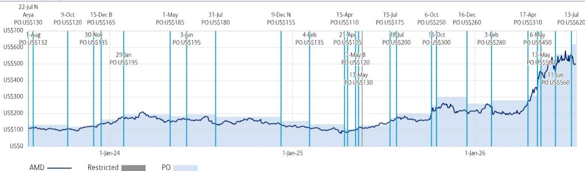
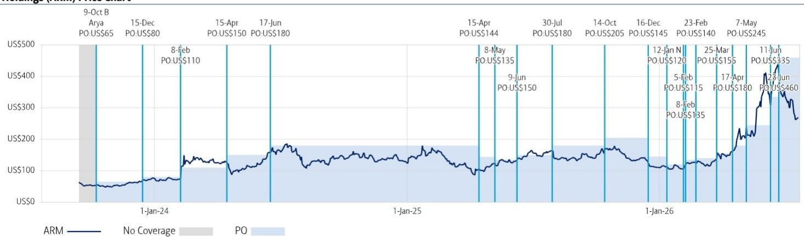
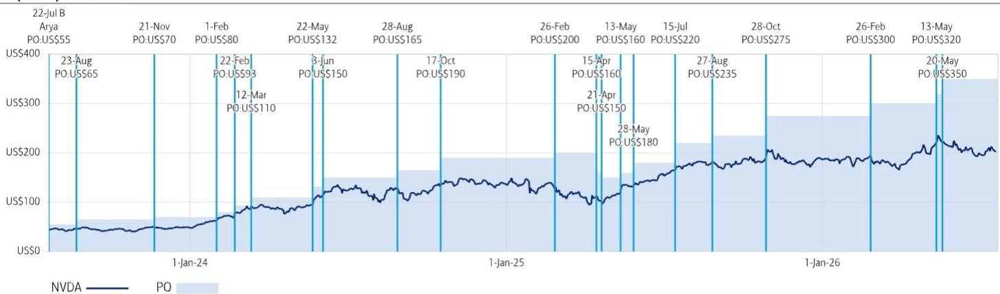

# BofA：AI、CPU技术与行业应用观察

NVIDIA在7月22日首次详细披露了其Vera CPU架构，并提出了一个评估AI基础设施的新框架：规模化下的最大单线程性能。与此同时，AMD将在本周四的AI 2026 Day上给出行业首次公开技术回应。这场讨论的背景是一个到2030年可能增长至1700亿美元的服务器CPU市场。

BofA这份报告的核心价值不在于比较两家公司的芯片参数，而在于它揭示了一个更根本的问题：代理式AI（agentic AI）的工作负载性质，将决定服务器CPU的设计哲学。NVIDIA认为AI推理越来越依赖CPU延迟和GPU利用率，因此单核性能是瓶颈。AMD则认为生产级AI更像分布式软件平台，并发工作流数量才是关键约束。

这两种判断指向了完全不同的芯片架构和产业生态路径。

## 1. NVIDIA的Vera架构强调单线程性能与协同设计

NVIDIA在报告中详细介绍了Vera CPU的技术参数：88个定制Olympus ARM核心、1.2TB/s内存带宽和3.4TB/s片上结构带宽。其核心论点是，代理式AI由重复的CPU-GPU循环构成，每个步骤（工具调用、代码执行、检索、编排）都依赖前一步完成。在这种框架下，更快的单核性能直接改善代理响应时间、GPU利用率和整体AI工厂产出。

NVIDIA还强调Vera与其他六个AI构建模块的“协同设计”，包括Rubin GPU、Groq LPX、Spectrum交换机和BlueField存储/网卡。这种垂直整合逻辑意味着，NVIDIA的竞争力不仅来自CPU本身，更来自整个AI基础设施的闭环优化。

> **KC评论：** NVIDIA选择单片计算芯片而非AMD已验证的chiplet架构，背后是对可扩展一致性的坚持。这不仅是技术路线之争，也关系到客户能否灵活组合不同供应商的芯片。

## 2. AMD以并发吞吐量作为核心衡量标准

AMD提出了不同的判断：生产级AI越来越像由数据库、API、向量存储、编排引擎、缓存和中间件组成的分布式软件平台。在这种环境中，主要约束是固定功耗范围内能维持的并发工作流数量。

AMD的估算显示，在100kW部署场景下，EPYC 9965（Turin）的机架级吞吐量约为NVIDIA Vera基准的2.4倍，而EPYC 6（Venice）预计可达3.3倍。这些数字直接挑战了NVIDIA“单核性能决定AI工厂效率”的前提。

BofA报告指出，AMD周四的活动重点可能不是基准测试对比，而是试图确立行业偏好的衡量指标。这本质上是在争夺AI基础设施的评价标准定义权。

## 3. x86与ARM的生态之争延伸至AI工作负载

这场讨论还延伸到了指令集架构层面。NVIDIA的立场隐含一个判断：如果微架构能提供更好的代理性能，指令集架构就变得次要。但AMD和英特尔很可能会反驳，认为代理式AI越来越多地与企业软件栈交叉，而x86在数据库、中间件、安全平台和企业应用方面拥有数十年的优化、验证和兼容性积累。

随着AI从模型推理扩展到企业工作流，软件生态的存量优势可能成为重要的差异化因素。这意味着，即使ARM在性能上接近或超越x86，企业客户在迁移时仍需考虑软件兼容性和迁移成本。

## 4. BofA认为关键问题是定义AI服务器的核心KPI

BofA分析师Vivek Arya团队认为，读者需要回答的核心问题是：代理式AI主要受限于“完成一个代理的时间”还是“每机架可运行的代理数量”。NVIDIA的框架根植于延迟、单线程进度和GPU利用率；AMD的框架根植于并发性、吞吐量和服务密度。

这两种框架将导致完全不同的芯片设计、系统架构和客户采购决策。如果行业最终采纳NVIDIA的指标，单核性能将成为CPU竞争的主战场，ARM架构可能加速渗透。如果AMD的指标成为主流，核心数量和能效比将更受重视，x86的生态优势可能持续更久。

BofA报告没有给出明确答案，但它提供了一个观察框架：关注行业是否开始形成统一的AI服务器CPU性能衡量标准，以及这个标准更偏向延迟还是吞吐量。

For informational purposes only. Portions may be generated,translated,summarized,or edited with AI assistance based on source materials and may contain omissions or errors. Please verify independently. This is not investment,legal,tax,accounting,or other professional advice.

For informational purposes only. Portions may be generated,translated,summarized,or edited with AI assistance based on source materials and may contain omissions or errors. Please verify independently. This is not investment,legal,tax,accounting,or other professional advice.

