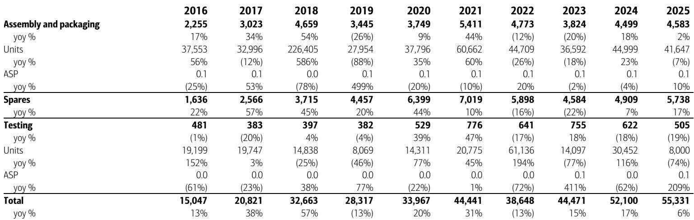
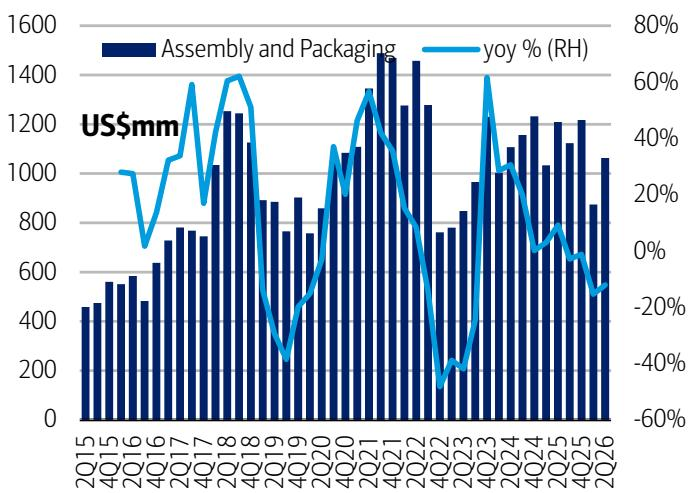
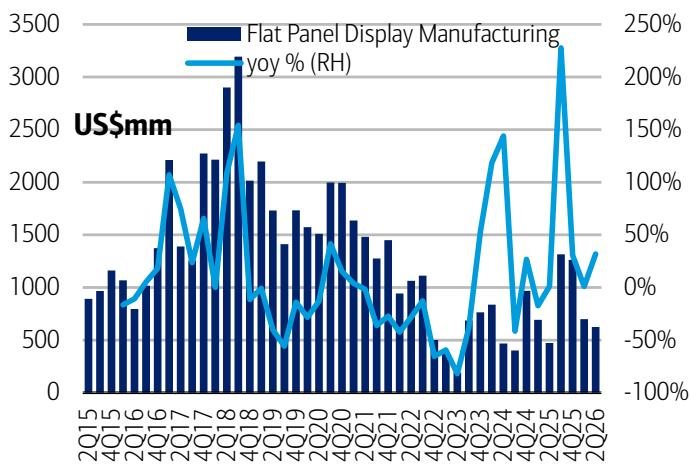

# 中国半导体设备进口并非回归常态，而是结构重组——这对全球设备市场格局意味着什么

2026年6月，中国半导体设备进口额为47亿美元。从表面看，这一数字似乎并不引人注目：同比仅下降1%，环比大幅增长45%。粗略解读可能让人认为市场趋于稳定。业界普遍认为，在经历了多年因地缘因素驱动的采购高峰后，中国半导体设备采购将在2026年回归常态。多数全球晶圆制造设备供应商也据此给出了预期——中国市场的收入将回到更可持续的水平。

然而，数据揭示了不同的图景。截至6月，年初至今的累计降幅为9%。但这一总量数字掩盖了更深层的结构性变化。中国并非简单地减少设备采购，而是在采购不同的设备、来自不同的产地、用于不同的目的。进口构成的变化，将直接影响哪些全球供应商能够受益，哪些将面临风险。所谓的“回归常态”论具有误导性。实际上正在发生的，是中国设备采购的重新配置，这将重塑全球半导体供应链的竞争格局。

## 光刻机进口环比激增184%，但构成显示战略重心正从尖端技术转移

6月最引人注目的单项数据是光刻机进口：8.42亿美元，环比增长184%，同比增长3%。此前5月光刻机进口同比下降2%。单月波动之大，足以让人怀疑是否存在集中交付的时间因素。事实上，2026年第二季度的数据揭示了更冷静的图景：光刻机进口同比下降13%，环比下降25%。

然而，单月激增之所以重要，在于其构成。6月，来自荷兰的光刻机占所有光刻机进口价值的95%，但仅占数量的41%。6月光刻机进口平均单价为1720万美元，远高于过去十二个月的平均值1360万美元。这与以下模式一致：中国继续接收高价值、较先进的光刻系统——很可能是出口管制下仍允许的深紫外（DUV）设备——而低价值系统的数量则在减少。

战略意图显而易见。中国正优先采购其仍能获得的最先进光刻设备，尽管年初至今前端设备进口同比下降10%。这不是回归常态，而是集中化。中国正利用其剩余的高端光刻设备获取渠道，作为应对瓶颈的储备策略，押注光刻将是本土化最难的环节，因此也是最需要囤积的。对于全球光刻设备供应商而言，这意味着只要出口政策允许发货，中国需求将保持波动但结构性高企。对于其他设备领域，情况则有所不同。

## 前端设备进口年初至今下降10%，但降幅集中在国产替代取得进展的领域

截至6月，前端设备进口年初至今总计155亿美元，同比下降10%。除热处理设备（增长13%）和沉积设备（持平）外，所有主要前端类别均出现下降。相对降幅最大的类别是光刻设备（下降18%）、刻蚀设备（下降19%）和其他前端设备（下降9%）。过程控制设备下降8%，离子注入设备下降4%。

刻蚀设备的下降尤其具有参考价值。6月刻蚀设备进口额为5.05亿美元，同比下降24%，年初至今下降19%，是主要前端类别中降幅最大的。这正是中国本土供应商取得最显著进展的领域。中国刻蚀设备制造商在成熟制程应用中已获得可观的市场份额，进口数据反映了这一现实。当一个国家在一年内将某类设备进口减少近五分之一，同时维持或增加整体晶圆厂投资时，最合理的解释是国内生产正在填补缺口。

相比之下，沉积设备进口年初至今持平，为41亿美元。这是一个混合信号。在整体进口下降的年份里，进口持平表明沉积设备仍是中国尚未实现同等国产替代的领域。沉积设备，特别是用于先进制程的原子层沉积系统，仍然难以复制。进口持平的趋势意味着，即使整体设备需求走弱，中国仍持续依赖外国供应商。

主导模式并非均匀放缓，而是一张替代地图。中国本土供应商拥有可靠替代品的领域，进口正在下降；而缺乏替代品的领域，进口则保持稳定或增长。对于全球设备公司而言，问题不再是中国的整体需求将如何变化，而是其哪些产品线可被替代，哪些不可替代。

## 后端设备进口呈现分化：引线键合机同比增长153%，预示向成熟封装产能转移

后端设备类别呈现更为分散的图景。6月组装与封装设备进口额为4.15亿美元，同比下降6%，但环比增长21%。在该类别中，引线键合机进口同比增长153%，环比增长33%。而贴装与键合设备同比下降9%。

引线键合机是一种成熟技术，用于传统封装应用，而非先进的异构集成或小芯片架构。引线键合机进口激增并非技术进步的信号，而是产能扩张的信号。中国正在为汽车、工业和消费类芯片建设大规模的成熟制程产能，这些芯片不需要尖端封装。这与中国半导体发展的整体战略方向一致：专注于市场广阔的中端领域实现自给自足，在该领域，产量和单位经济性比晶体管密度更为重要。

测试设备类别6月进口额为4600万美元，同比下降7%，年初至今下降12%。这是一个相对值较小的类别，但持续下降表明，测试设备仍是中国尚未优先推进进口替代的领域，可能是因为国内测试设备生态系统仍处于早期阶段。另一种可能是，这反映了中国晶圆厂转向内部测试，而这一变化未在海关数据中体现。

后端数据强化了核心观点：中国并未退出半导体设备投资，而是在进行再平衡。投资组合正从技术最先进的前端设备转向成熟制程产能和传统封装。对于专注于先进封装和测试的全球供应商而言，这是一个不利因素。而对于成熟制程前端设备和引线键合机的供应商而言，则是一个机遇。

## 进口来源地的地理变化证实：出口管制正在重塑供应链，而非阻断供应链

2026年上半年，日本占中国半导体设备进口的25%，高于历史水平。荷兰和日本合计占进口总值的38%。这种地理集中是出口管制制度的直接结果。中国买家正在将采购集中到少数仍可发货的供应商，同时减少对来自政策更严格地区的供应商的依赖。

这种转变并非中性。它在全球设备公司中创造了赢家和输家。随着中国买家寻求减少对单一来源的依赖，日本沉积、刻蚀和清洗设备供应商获得了市场份额。荷兰光刻设备供应商在其类别中保持主导地位，因为不存在替代选择。美国供应商面临最复杂的局面：他们受到政策约束，但也受益于其许多设备在特定工艺步骤中仍不可替代的事实。

地理数据还暗示了二阶效应。随着中国将进口集中到更少的供应商，这些供应商在定价和交货条款上获得了更大的议价能力。由于出口管制导致设备供应趋紧，中国买家可能正在为设备支付更高的价格。光刻设备平均单价数据支持了这一点：6月为1720万美元，远高于历史平均水平，即使考虑了产品组合因素。如果这种定价动态持续，将在一定程度上抵消受影响供应商的销量下降。

## 评估中国设备敞口的分析框架

对于评估半导体设备公司的观察者而言，6月进口数据支持一个基于三个问题的分析框架。

第一，该公司的产品线是否可被中国本土供应商替代？如果对于某个领域答案是肯定的，那么可以预期进口下降将持续甚至加速。刻蚀设备是最明显的例子。在中国拥有大量刻蚀设备收入的公司应假设，随着国内替代品的改进，这一收入流将继续收缩。

第二，该公司的产品线是否受到出口限制，从而限制了中国可以采购的范围？如果答案是肯定的，那么动态更为复杂。限制减少了总可寻址量，但也为仍可发货的设备创造了定价权。光刻设备是典型例子。先进系统的供应受限意味着，每台允许出口的设备都带有溢价。处于这种位置的公司应基于平均单价和利润率趋势来评估，而不仅仅是销量。

第三，该公司的中国敞口是否集中在成熟制程或传统封装设备？如果答案是肯定的，那么前景比整体进口下降所暗示的更为稳定。引线键合机、成熟沉积设备和热处理设备都受益于中国产能扩张。年初至今热处理设备进口增长13%是一个直接信号。服务于这一市场部分的公司，其中国收入可能比市场共识预期的表现更好。

这三个问题是互斥且穷尽的。每个有中国敞口的设备公司都可以归入这些类别之一，而不同类别的投资含义存在显著差异。

## 二阶影响：全球设备市场增长将日益依赖中国以外的需求，使世界其他地区更加重要

2025年，中国占全球晶圆制造设备支出的33.5%。如果中国的进口数据表明，在可替代领域正出现结构性向低销量转变，而在不可替代领域则集中支出，那么全球设备市场预测面临一个构成问题。来自中国追赶周期的轻松增长正在成熟。未来的设备市场增长将需要来自其他地区。

这对设备公司如何分配研发和销售资源具有影响。那些已经开始将地理敞口重新平衡到美国、欧洲和东南亚的公司将受益，这些地区的先进逻辑、存储和功率半导体产能建设正在加速。那些仍然过度依赖中国收入的公司，随着销量下降以及在存在中国替代品的领域竞争加剧，将面临利润率压力。

6月的进口数据只是一个月的海关申报。它存在噪音、波动，并可能被修正。但它揭示的模式在各个类别和地区之间是一致的。中国并未远离半导体设备，而是在走向不同的组合。全球设备行业需要相应调整其假设。

*仅供参考。部分内容可能基于原始资料通过AI辅助生成、翻译、总结或编辑，可能存在遗漏或错误。请独立核实。本文不构成任何专业建议。*

仅供参考。部分内容可能基于原始资料通过AI辅助生成、翻译、总结或编辑，可能存在遗漏或错误。请独立核实。本文不构成任何专业建议。

