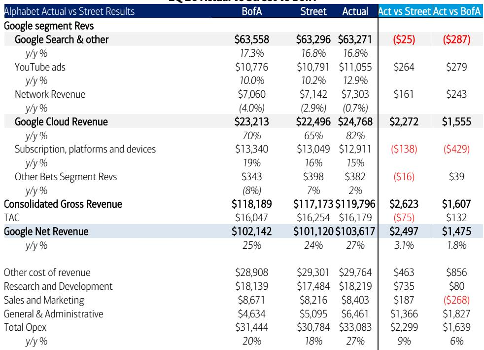
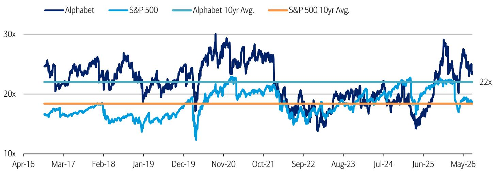
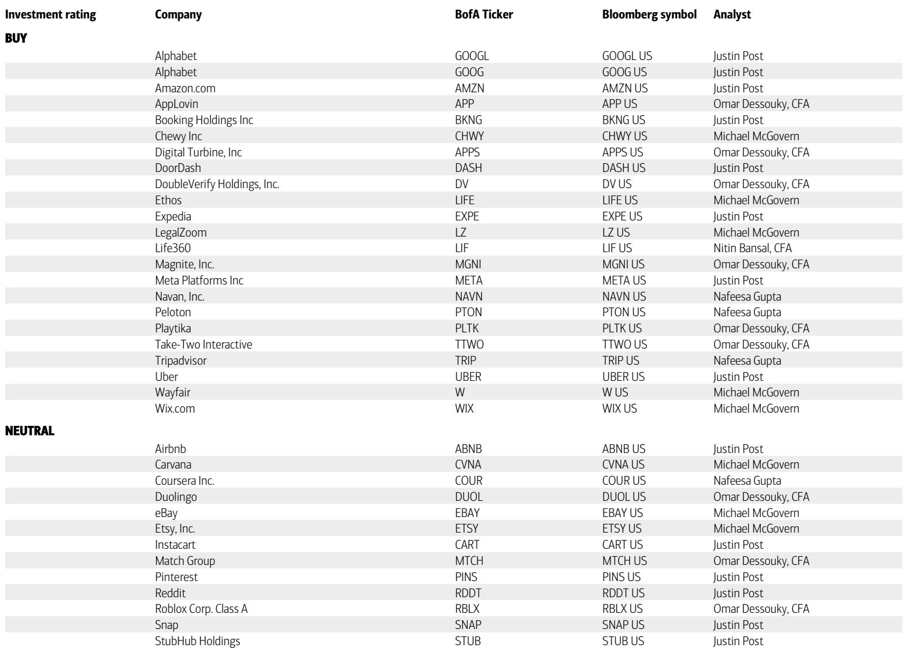

# Google Cloud的加速增长证明：更高的资本支出不是成本问题，而是收入倍增器

市场对资本支出上升的普遍担忧，在Alphabet 2026年第二季度业绩中遇到了最有力的反驳。虽然盘后股价约3%的下跌暗示读者对全年资本支出指引上调150亿美元至1950-2050亿美元区间感到不安，但底层数据讲述了一个截然不同的故事。云业务收入同比增长加速至82%，超出市场一致预期的65%，同时云业务运营利润率达到35.6%，高于华尔街预期的31.3%。更高支出计划与更强回报之间的张力并非矛盾，而是Alphabet当前的核心战略逻辑。产能部署并非回报的拖累，而是推动积压订单环比增加500亿美元、总承诺额达到5140亿美元的引擎。对于观察者而言，问题不再是Alphabet能否负担得起支出，而是他们是否低估了这种支出的复合效应。

第二季度也明确了近期AI变现逻辑的定位。搜索收入同比增长17%，符合预期，并未超出。这一结果暂时搁置了AI概览或Gemini整合会立即带来搜索广告超预期增长的观点，但并不否定长期逻辑。YouTube收入超出预期，在世界杯活动推动下增长13%，而市场预期为10%。然而，真正的故事在于，云业务已成为AI驱动收入加速的主要载体，数据现在支持基础设施投资与收入增长之间的直接因果关系。

## 5000亿美元积压订单缺口证明：产能限制而非需求不足，是云业务增长的约束条件

本季度最容易被忽视的数字可能是积压订单的环比增长。Google Cloud的剩余履约义务环比增加500亿美元，达到5140亿美元。将这个数字与全年150亿美元的增量资本支出相比，积压订单的增加额本身已是全年资本支出增幅的三倍以上。这并非Alphabet在投机性地建设产能。客户签约的速度快于Google建设基础设施来履约的速度。本季度客户实际消耗量超过承诺额50%以上，高于第一季度的45%。客户已签约与实际使用之间的差距表明，需求领先于供给，而非相反。

其含义直截了当：每一美元额外的资本支出都直接对应着已签约的收入。风险不在于Alphabet过度建设，而在于建设不足导致收入流失。积压订单数据还提供了大多数超大规模云服务商无法匹敌的未来收入可见性。至少，5140亿美元的积压订单意味着，仅凭现有合同，Google Cloud在未来八个季度将产生约2570亿美元的收入，这还不包括现货收入、超出承诺的消耗量以及新增交易。仅这一基线就代表着当前运行速度的显著加速。

## 云业务利润率在规模扩张中提升，反驳了AI基础设施投资破坏盈利能力的观点

怀疑者一直以来的担忧是，AI数据中心所需的巨额资本会压缩利润率，尤其是在Alphabet转向租赁第三方产能并大规模部署定制TPU的情况下。第二季度业绩直接挑战了这一假设。云业务运营利润率达到35.6%，环比上升270个基点，同比上升近15个百分点。这一利润率水平远高于华尔街预期的31.3%，表明Google的垂直整合战略正在产生结构性成本优势。

Gemini作为差异化基础模型与TPU作为定制芯片的结合，创造了一个Alphabet同时控制软件和硬件的技术栈。这种整合减少了对外部GPU供应商的依赖，降低了每次推理成本，并提高了云服务的毛利率。利润率表现还表明，仍处于早期阶段的外部TPU销售并未稀释盈利能力。相反，它们可能正在推动更高的综合利润率。公司整体运营利润率为39.3%，略低于华尔街预期的40.3%，但这一差距是由一次性的一般性行政法律成本造成的，而非云业务的任何结构性恶化。剔除云业务的核心服务利润率为41.8%，而预期为43.0%，同样反映了非经常性项目。最高增长板块的利润率轨迹正在改善，而非恶化。

## 搜索收入在AI竞争中的稳定表现是持久性的信号，而非失望

搜索收入同比增长17%，符合市场一致预期，与云业务的加速相比可能显得平淡。但这种解读忽略了战略背景。Alphabet所处的环境中，竞争性的AI原生平台正在吸引大量用户参与，生成式AI界面正在改变用户获取信息的方式。搜索收入增长率保持在15%左右，实际上已超过2023-2025年约14%的平均水平，这表明Google的核心业务并未被颠覆，而是在被补充。

AI概览、AI模式和Gemini整合正在扩展查询范围。随着模型改进，它们推动了更高的搜索使用量和查询量增长。广告商正在为AI原生格式中的高意图位置展开竞争，这支撑了定价。更好的意图理解正在提升商业查询的占比。在Marketing Live上宣布的新AI原生广告格式，正在以将此前不产生收入的查询变现的方式扩大广告加载量。中期催化剂路径包括Gemini 3.5 Pro的公开上线、代理搜索功能的推出、I/O大会上宣布的通用购物车，以及秋季Gemini 4的发布。这些催化剂均未反映在第二季度的搜索数据中。当前的收入轨迹是基线，而非天花板。

## 评估Alphabet研究逻辑的决策框架：以产能驱动增长为视角

对于评估当前估值是否充分反映机会的机构观察者而言，一个结构化的框架比简单的倍数比较更有用。该框架基于三个相互关联的变量：积压订单转化速度、规模扩张中的利润率轨迹，以及新AI界面的变现能力。

首先，积压订单转化速度。5140亿美元的积压订单代表随着产能上线将转化的递延收入。需要跟踪的关键指标是积压订单环比增长与增量资本支出的比率。第二季度，该比率超过3倍。如果未来两到三个季度保持在1倍以上，则确认需求继续超过供给，每一美元资本支出产生超过一美元的合同未来收入。如果该比率降至1倍以下，则表明产能正在赶上需求，这仍然是积极的，但会降低研究逻辑的紧迫性。

其次，规模扩张中的利润率轨迹。35.6%的云业务利润率已高于大多数分析师预期的近期峰值水平。问题在于，随着收入向积压订单所暗示的水平扩张，利润率能否维持或改善。定制TPU部署和Gemini整合的结构性优势表明，增量收入应带来较高的边际利润率。风险在于，以较高利率租赁产能可能暂时压缩利润率，但第二季度数据显示这种影响目前微乎其微。

第三，新AI界面的变现能力。17%的搜索收入增长尚未包含AI概览或代理搜索功能的实质性贡献。随着这些产品上线并开始产生广告收入，它们代表着当前预期的上行空间。Gemini应用的9.5亿月活跃用户代表着一个目前尚未变现的潜在广告界面。如果Alphabet以类似于搜索变现的方式向Gemini引入广告，这将代表一个高利润率的新收入来源。

应用这一框架，当前约22倍的2027年GAAP每股收益预期（15.01美元）的估值，与Alphabet的历史平均水平一致。但这一历史平均水平是在收入平均增长14%的时期形成的。当前展望显示2027年收入增长27%。一家以接近历史两倍速度增长、却以历史估值倍数交易的公司，并非被合理定价，而是被折价了。

## 产能投资周期已创造出一个自我强化的增长循环，竞争对手难以匹敌

第二季度最重要的结构性洞察是，Alphabet的产能投资并非一次性支出。它正在创造一个自我强化的循环。更多产能实现更快的积压订单转化。更快的转化带来更高的收入。更高的收入为额外的产能投资提供资金。而积压订单数据显示，每一批新产能被吸收的速度都快于前一批。新客户获取速度是去年的两倍以上。客户消耗量超过承诺额的速度正在加快。积压订单的增长速度快于为满足其而建设的产能。

这种动态创造了一个难以复制的竞争护城河。竞争对手不仅需要匹配Alphabet的资本承诺，还需要匹配其在TPU硬件上的垂直整合、在Gemini上的基础模型能力，以及在搜索、YouTube和Android上的消费者分发优势。这些资产的组合是独一无二的。市场可能将Alphabet定价为一家成熟的广告公司，附带云业务。数据表明，它正在定价一家为AI企业级应用建设基础设施层、并附带消费者AI分发网络的公司。

风险是真实存在的，不应被忽视。第三季度搜索业务的对比基数更高，可能导致增长放缓。社交媒体试验可能凸显YouTube上的内容审核问题。OpenAI正在加大其广告业务。竞争对手的高调模型发布可能改变叙事。机构资金流入AI首次公开募股可能导致资金从现有公司流出。但这些风险在很大程度上已反映在当前估值倍数中。来自云积压订单转化、新AI广告格式和Gemini变现的上行空间则尚未体现。

在约332美元的盘后价格下，Alphabet提供了一个风险回报特征：下行风险由核心搜索和广告业务（以17%的速度增长且利润率扩大）保护，上行空间则由云业务（正在加速、获取份额、并以远超资本成本的回报率产生资本回报）驱动。盘后交易中令市场不安的产能增加并非挥霍的信号。它是管理层看到市场尚未充分建模的需求的最有力信号。

*仅供参考。部分内容可能基于源材料通过AI辅助生成、翻译、总结或编辑，可能存在遗漏或错误。请独立核实。本文不构成任何专业建议。*

仅供参考。部分内容可能基于源材料通过AI辅助生成、翻译、总结或编辑，可能存在遗漏或错误。请独立核实。本文不构成任何专业建议。

