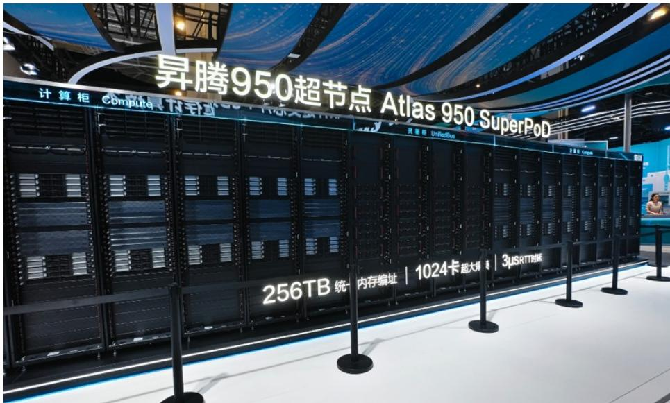
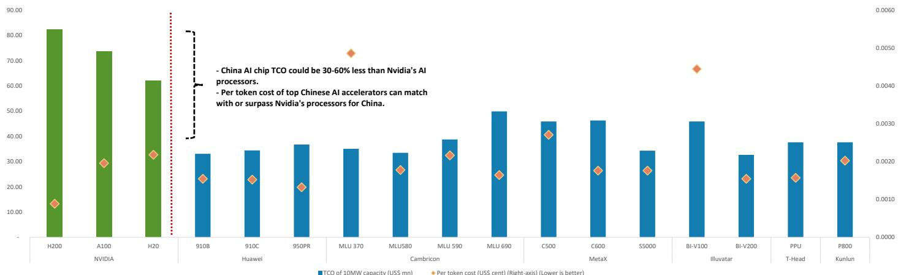
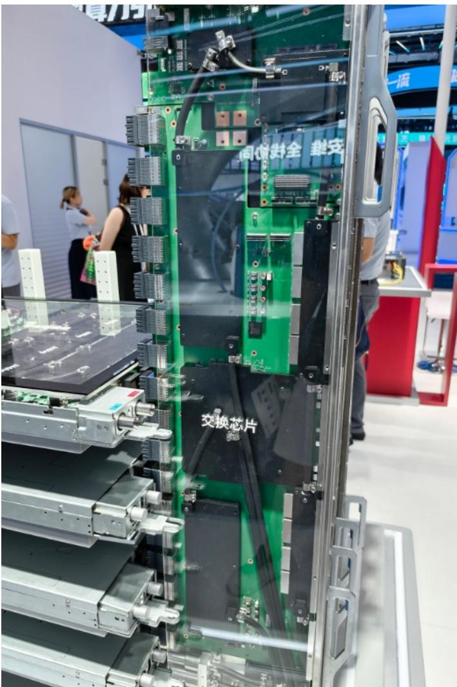

# 中国AI计算竞争已从芯片转向超节点——本土厂商在系统架构上展现优势

2026年世界人工智能大会（WAIC）上最值得关注的进展，并非新的加速器规格或基准测试分数，而是几乎所有本土AI GPU和ASIC厂商都展示了超节点（SuperPod）解决方案，而重大芯片发布几乎缺席。在WAIC 2025上，讨论焦点是华为的384-NPU CloudMatrix 384以及多家厂商的新一代加速器。仅一年后，竞争焦点已明显上移——从独立的芯片规格转向互连、内存共享、工作负载调度和全系统利用率。这一转变对哪些公司能在中国AI计算市场获得价值具有深远影响。

其逻辑很直接。中国AI GPU厂商在芯片层面面临长期约束：先进制程的获取受限。但正如WAIC 2026的展品所示，这些厂商正在系统层面——光网络、服务器机架设计和扩展架构——建立实质性优势。华为的Atlas 950超节点将扩展域从384个NPU扩展到1024个NPU，是最显著的例子。然而，这一模式已扩展至整个生态系统。几乎所有本土厂商都展示了64卡或128卡的扩展系统，这些系统采用专有的扩展技术，作为英伟达NVLink或AMD UALink的本土替代方案。

这并非关于追赶制程节点的故事。这是一个关于认识到AI计算的下一个前沿是系统级集成，而中国厂商已准备好在这一领域竞争的故事。对于研究者和策略制定者而言，问题不再是哪款芯片拥有最高的理论算力，而是哪家厂商能提供最高的有效系统利用率、最高效的互连以及最可靠的大模型训练基础设施。

## Atlas 950超节点重新定义本土大模型训练基础设施的上限

华为Atlas 950代表了本土AI计算集群规模的一次阶跃式提升。该系统通过16个计算柜连接1024颗下一代昇腾950DT NPU，每个计算柜容纳64颗NPU，并配备四个专用UnifiedBus互连柜，在整个超节点内提供全互联通信。性能数据令人瞩目：每个64-NPU计算柜可提供高达64 PFLOPS的FP8算力和128 PFLOPS的FP4算力，整个超节点的聚合性能约为1 EFLOPS FP8和2 EFLOPS FP4。内存容量也相应扩展，每个计算柜约6TB HBM，通过HBM加外部DRAM池化，总可寻址内存高达256TB。

其架构意义在于UnifiedBus 2.0，该协议在三个物理层上扩展了统一的通信和内存协议。在每个计算节点内，八颗NPU通过全网格拓扑连接。在机柜层面，八个节点通过Clos架构连接，采用全正交、无中板设计。在机柜之间，四个UnifiedBus互连柜提供光扩展网络。其结果是逻辑上的扁平架构：UnifiedBus不将机架和互连层视为独立的通信域，而是在整个超节点内提供统一寻址、内存语义和加载/存储操作。

其重要性不仅在于原始数据。随着集群规模增大，通信效率和容错能力成为决定有效计算利用率的主导因素。华为引入了光路保护，使得单链路故障不会中断系统运行。混合铜缆与光互连在短距离带宽和能效与长距离可扩展性之间取得了平衡。这些工程选择反映了一个清晰的战略认知：大模型训练的瓶颈已从单个加速器的吞吐量转向系统保持所有加速器高效运转的能力。

## 超节点生态蓬勃发展，但差异化将取决于软件和互连，而非加速器数量

如果说WAIC 2025是单个芯片的展示，那么WAIC 2026则表明整个本土生态系统已内化了系统级优先的理念。几乎所有本土AI GPU和ASIC厂商都展示了超节点解决方案，这些方案通常与服务器ODM和网络合作伙伴共同开发。64到128个加速器的扩展配置已变得越来越普遍。从八卡服务器到多机架扩展域的转变表明，厂商正在优先考虑集体通信效率、内存共享和系统级利用率。

然而，不同展位上出现相似或相同系统设计的现象揭示了一个重要细节。本土AI服务器生态系统已变得日益模块化：加速器厂商提供计算平台和软件栈，而ODM将服务器、互连、散热和电源基础设施集成到机架级或集群级解决方案中。这种模块化降低了超节点部署的门槛，但也压缩了硬件层面的差异化空间。当多家厂商展示几乎相同的ODM开发平台时，竞争优势转向互连性能、软件优化、容错能力和有效应用吞吐量。

机架级互连的架构多样性值得关注。包括华为和中兴在内的本土厂商越来越倾向于采用无中板的正交设计，这种设计消除了传统背板中使用的大型中央PCB。这降低了与高层数中板相关的制造和良率挑战，并缩短了某些电路路径。其代价是增加了机械和连接器设计的复杂性。哪种方法更优将取决于工程执行，而非单纯的架构偏好。

另一个相关观察涉及GPU与CPU的比例，在本土AI服务器配置中，这一比例仍集中在约4:1或8:1。这可能反映了当前的工作负载组合：智能体AI需求尚未大规模增长，许多部署仍集中在传统模型推理或选定的训练工作负载上。本土加速器目前每卡的计算性能也低于领先的海外产品，这意味着加速器吞吐量——而非主机CPU能力——通常是主要的系统瓶颈。随着智能体工作负载的扩展，需要更多的数据预处理、编排、检索和工具执行，对额外CPU资源的需求可能会上升，从而可能改变CPU与加速器的最优配置。研究者应关注这一转变，将其视为系统架构需求变化的领先指标。

## P/D分离释放异构推理效率，Attention/FFN分离代表下一个前沿

除了超节点硬件，WAIC 2026还突显了推理工作负载结构方面的一个重大架构转变。大模型推理包含两个特性截然不同的阶段。预填充阶段并行处理输入提示，生成初始KV缓存，主要受计算能力限制。解码阶段顺序生成后续令牌，重复访问模型权重和不断增长的KV缓存，因此对内存带宽、延迟和批处理调度更为敏感。在同一个加速器池上运行这两个阶段会导致资源争用和利用率不平衡，尤其是在模型规模、提示长度和并发请求增加的情况下。

P/D分离通过将预填充和解码放置在不同的加速器池上来解决这种不匹配问题。这使得运营者可以根据各自的工作负载特性配置和调度每个池，防止长时间的预填充请求中断对延迟敏感的解码任务。它还支持使用不同的加速器进行异构部署。WAIC上讨论的一种配置将约90%的本土加速器容量分配给预填充，10%的H2O容量分配给解码，据报道吞吐量提升了54%，P90首令牌延迟降低了64%。实际收益将取决于模型架构、工作负载模式、调度和互连性能，但方向性的改进是显著的。

Attention/FFN分离可能代表下一阶段，尽管WAIC上缺乏有意义的演示和基准测试结果。这种方法进一步将解码执行分为注意力节点和FFN节点：注意力节点反复访问不断增长的KV缓存，对HBM容量和带宽高度敏感；FFN节点使用相对固定的模型权重（或MoE模型中的选定专家）执行计算密集型操作。理论上，这可以为注意力节点配备高带宽、高容量的内存系统，为FFN节点配备更侧重计算的加速器。然而，两个池之间的频繁激活传输带来了大量的互连和同步要求，使得A/F分离在今天仍是一种新兴而非生产就绪的架构。研究者应关注这一发展，将其视为以内存为中心的加速器设计的潜在转折点。

## 评估本土AI计算生态的决策框架

WAIC 2026的启示可转化为一个战略框架，用于评估随着本土AI计算市场成熟，哪些公司能获得价值。该框架基于三个维度：扩展能力、工作负载优化和供应链韧性。

首先，扩展能力决定了哪些厂商能应对最大、最苛刻的训练工作负载。华为的Atlas 950凭借其1024-NPU域和UnifiedBus 2.0架构，在这一维度上明显领先。但扩展能力并不仅仅是加速器数量的函数。它取决于互连带宽、内存池化效率、容错能力和软件栈成熟度。能够展示大规模下高有效利用率——而不仅仅是理论峰值性能——的厂商将获得溢价定价和客户忠诚度。

其次，工作负载优化决定了哪些厂商能在多样化的部署场景中提供高性价比的推理。P/D分离已在重塑推理架构，提供灵活、异构部署选项的厂商将在推理工作负载激增时处于更有利的位置。沐曦的Tiangai 300系列体现了这一趋势，该系列支持预填充和解码推理，配备144GB HBM3E内存和约4TB/s的内存带宽。该公司声称，在包括DeepSeek V3.2和GLM 5.2在内的本土大语言模型上，其预填充和解码性能优于英伟达H100，这表明有针对性的推理优化可以弥补制程节点的劣势。

第三，供应链韧性决定了哪些厂商能可靠地扩大生产规模。这一维度有利于那些拥有多元化制造关系、能获取本土先进制程产能，以及涉足支持本土内存和逻辑扩张的半导体设备的公司。在此框架下，报告中的公司偏好保持一致：寒武纪、沐曦和海光信息因订单可见性强和供应链稳固而受到关注；中芯国际因先进制程产能扩张而受到关注；北方华创、中微公司、盛美上海和先进太平洋半导体则因半导体设备敞口而受到关注。

## 架构与先进封装提供超越制程缩放的替代路径

WAIC 2026上最具战略启发性的展品或许是最不寻常的。东方计算（Oriental Computing）这家私营公司展示了其DF1000，这是一款采用本土14nm级工艺制造的软件定义近内存3D AI芯片。该设计使用晶圆级混合键合将DRAM和逻辑芯片垂直堆叠，缩短了数据传输距离，并在不依赖领先制程演进的情况下解决了内存墙瓶颈。该公司声称内存带宽为6.4TB/s，BF16性能为520TFLOPS，而一个128卡集群已完成全功能稳定性验证。

该产品体现了一个更广泛的战略原则，该原则贯穿整个本土生态系统：当制程节点进步受限时，架构和先进封装成为提升性能的主要杠杆。华为的UnifiedBus 2.0、Atlas 950中的混合铜缆与光互连，以及多家厂商解决方案中出现的无中板正交设计，都反映了这一原则。对研究者的启示是明确的：在封装、互连和内存架构方面展现创新的公司，可能比那些仅仅迭代芯片规格的公司更有能力缩小性能差距。

DF1000还突显了成熟厂商与新兴参与者之间潜在的竞争动态。如果3D堆叠和近内存计算能够以制程节点成本的一小部分提供有竞争力的推理性能，那么AI加速器市场某些细分领域的进入门槛可能低于普遍预期。这不会威胁到华为在大模型训练基础设施中的地位，因为在该领域，扩展能力和软件生态系统至关重要。但它可能重塑推理优化加速器领域的竞争，尤其是在边缘和中端部署场景中。

*仅供参考。部分内容可能基于源材料通过AI辅助生成、翻译、总结或编辑，可能存在遗漏或错误。请独立核实。本文不构成专业建议。*

仅供参考。部分内容可能基于源材料通过AI辅助生成、翻译、总结或编辑，可能存在遗漏或错误。请独立核实。本文不构成专业建议。

