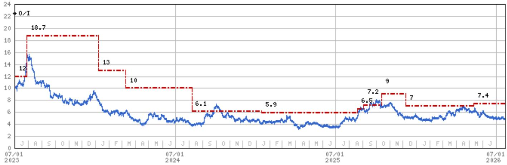
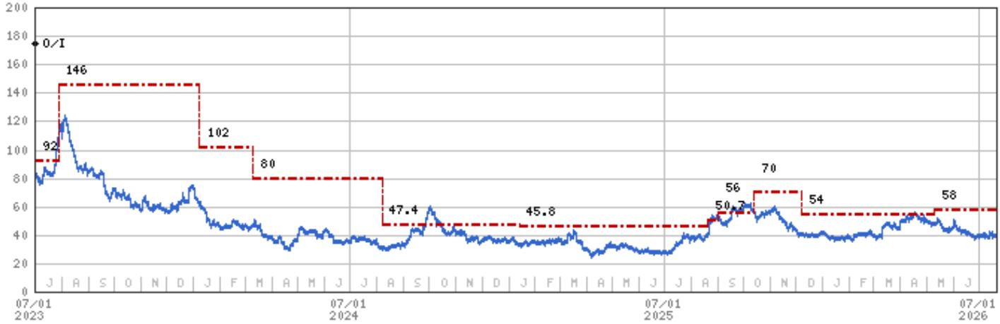
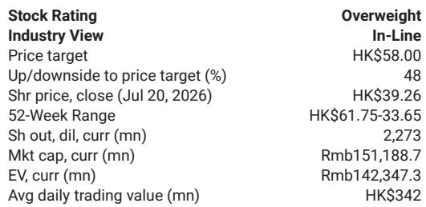

# NIO's Chip Spin-Out Is Quietly Reshaping the Company from a Cash-Burning EV Maker into a Vertically Integrated AI Silicon Platform

The narrative around NIO has long been dominated by one question: when will the cash burn stop? That framing is becoming obsolete. In June 2025, NIO spun out its chip division, GeniTech (Shenji), and by February 2026, the entity had already raised close to RMB 3 billion in external capital at a post-money valuation near RMB 8.3 billion. At the World Artificial Intelligence Conference (WAIC) in Shanghai in July 2026, GeniTech made its first standalone appearance—and the message was unequivocal. This is no longer a captive automotive chip supplier. Management presented Shenji as an all-domain, all-scenario silicon platform spanning intelligent assisted driving, embodied intelligence, and agent inference, claiming it is the only Chinese chipmaker operating across all three domains simultaneously.

For observers who have watched NIO build one of the industry's most expensive R&D operations, this pivot matters more than any single vehicle launch. GeniTech represents the monetization of a sunk cost that was previously viewed only as a drag on margins. The chip business is now a visible call option embedded inside the listed company, and its trajectory is beginning to separate NIO from the crowded field of Chinese EV manufacturers competing on price and volume alone.

## GeniTech's Expansion from Automotive Silicon to Embodied AI and Inference Workloads Unlocks a Far Larger Addressable Market Than Any Single Automaker Captive Program

The core strategic shift is not simply that NIO now makes its own chips. It is that GeniTech has migrated its silicon architecture from a single-application driving processor into a platform that addresses training and inference workloads for humanoid robots, driverless logistics, and high-compute edge terminals. This is precisely the kind of adjacency expansion that transforms a cost center into a growth franchise.

The product lineup tells the story clearly. The high-end NX9031X anchors assisted driving and already sits in every NIO and Onvo model, with cumulative shipments surpassing 300,000 units. This is the captive baseline that amortizes fixed R&D costs across a growing volume pool. But the midrange NX9031U, built on the same 5nm automotive-grade node, delivers up to 800 TOPS of equivalent compute under air cooling and now powers the new Ruidong embodied-intelligence development platform for robot perception and planning, intelligent computing, and advanced manufacturing. Alongside the NX9031C and NX6031 sensing chips, GeniTech also launched a distributed agent platform. The company is not merely scaling an existing design; it is systematically addressing three distinct compute verticals with a common architectural foundation.

The strategic logic is straightforward. A captive automotive chip supplier is limited by the production volume of its parent automaker. An AI silicon platform that serves autonomous driving, robotics, and inference markets benefits from multiple demand drivers that are not perfectly correlated. When automotive demand softens, robotics deployment cycles may accelerate, and vice versa. This diversification reduces the volatility of utilization rates across GeniTech's fabrication commitments and creates a more predictable path to scale economies.

## External Capital Inflows and Third-Party Licensing Confirm That GeniTech Is Becoming a Self-Funding R&D Engine Rather Than a Drain on NIO's Balance Sheet

The financial mechanics of this transformation deserve close attention. Since its spin-out in June 2025, GeniTech has attracted close to RMB 3 billion from external investors. The February 2026 valuation of approximately RMB 8.3 billion post-money implies that external investors see a viable standalone business with a clear path to revenue diversification beyond NIO's own vehicle production.

More concretely, GeniTech began licensing its NX9031 technology to a third-party automotive chip customer late in 2025. This adds a royalty revenue layer that is high-margin by nature, as the R&D costs have already been incurred. Every additional licensee generates incremental revenue with minimal incremental cost, improving the overall margin profile of the chip business. This is the classic silicon intellectual property model that has made companies like Arm Holdings so profitable, albeit at a different scale and application focus.

The implications for NIO's consolidated financials are material. In 2025, NIO reported negative EBITDA of approximately RMB 8 billion. The consensus estimates for 2026 project a sharp improvement to positive EBITDA of roughly RMB 2.6 billion, with further expansion to RMB 6 billion in 2027 and RMB 9.6 billion in 2028. The chip division's transition from a pure cost center to a revenue-generating entity with external capital support directly facilitates this trajectory. External funding covers a portion of the group's heavy R&D line that would otherwise have been absorbed by the automotive business, effectively reducing the cash burden on NIO's core operations and supporting management's 2026 profitability target.

The self-supply dynamic also improves automotive gross margins directly. A single NX9031 processor is rated at the compute of four Nvidia Orin processors. By displacing imported compute from global top-tier suppliers, NIO reduces its bill of materials per vehicle while simultaneously controlling its supply chain for a critical component. Every vehicle sold amortizes the fixed R&D base across a widening volume pool, creating a virtuous cycle in which higher automotive sales reduce per-unit chip costs, which in turn improves automotive margins.

## The Re-Rating Vector for NIO's Stock Shifts from Automotive Volume Uncertainty to Silicon Platform Optionality

The conventional thesis for NIO has been a bet on premium EV market share expansion, sub-brand execution with Onvo, and eventual operating leverage. The base case in a recent global investment bank report assumes a steady sales volume ramp-up, market share expansion in the premium new energy vehicle segment, profitability turning positive in 2027, and more aggressive sales network expansion. The bull case adds higher-than-expected orders, more rapid adoption of ADAS services, and acceleration of sales network expansion to achieve self-funding ahead of expectations. The bear case centers on weaker demand, lower average selling prices, and margin compression.

What the GeniTech development changes is the composition of the bull case. Previously, upside was almost entirely dependent on automotive execution. Now, an additional vector exists: the chip business as a standalone value driver. NIO retains approximately a 63% controlling stake in GeniTech, meaning that the chip business's value accretion flows directly to the listed company. As external customers grow and robotics revenue ramps, the chip division becomes an increasingly visible call option in addition to the automotive business.

This matters because the market has historically discounted NIO's R&D spending as a necessary but unmonetizable cost of competing in the EV space. The WAIC presentation directly challenges that assumption. If GeniTech can establish itself as a credible third-party AI silicon supplier across driving, robotics, and inference workloads, the market's valuation framework for NIO must expand to include a technology platform component. This is not a speculative pivot into unrelated businesses. It is the logical extension of a semiconductor design capability built for automotive-grade reliability into adjacent compute markets that share similar architectural requirements.

## A Decision Framework for Observers: How to Assess GeniTech's Progress Against Three Observable Milestones

For those trying to evaluate whether this narrative shift is real or merely a corporate rebranding exercise, three concrete milestones provide a useful monitoring framework. Each addresses a distinct dimension of the thesis: revenue diversification, margin improvement, and external validation.

First, track the ratio of external revenue to total GeniTech revenue. As long as the chip division's revenue is dominated by NIO's own vehicle production, the diversification argument remains unproven. The licensing deal announced in late 2025 is a positive signal, but observers should look for at least two additional external customers, ideally in different verticals, within the next 12 to 18 months. Robotics and inference customers would be particularly valuable because they demonstrate the platform's applicability beyond automotive.

Second, monitor the chip division's contribution to NIO's consolidated gross margin. The NX9031's compute advantage over four Nvidia Orin processors implies a significant cost savings per vehicle, but the magnitude of that savings depends on production volume and yield rates. As cumulative shipments scale beyond the current 300,000 units, the fixed-cost amortization benefit should become visible in the automotive segment's gross margin trajectory. A sustained improvement in automotive gross margins that cannot be explained by volume or pricing alone would be strong evidence that the self-supply strategy is working.

Third, watch for additional external capital rounds and their valuation trajectory. The February 2026 valuation of approximately RMB 8.3 billion provides a baseline. If GeniTech can raise additional capital at a higher valuation within the next 12 months, it would confirm that external investors see a growing addressable market and a credible execution path. Conversely, a down round or an inability to raise capital would indicate that the market views the platform claims with skepticism.

These three milestones are not exhaustive, but they are observable, quantifiable, and directly tied to the strategic thesis. They allow observers to distinguish between genuine platform creation and a narrative that outruns the underlying business reality.

## The Vertical Integration of AI Silicon into an EV Company Represents a Structural Advantage That Competitors Focused Solely on Automotive Volume Will Find Difficult to Replicate

The most important implication of the GeniTech story is not about NIO specifically. It is about the evolving competitive dynamics of the EV industry. The conventional wisdom has been that EV manufacturers compete on battery technology, manufacturing scale, software features, and brand. Silicon design has been viewed as a niche capability relevant only to the largest players.

GeniTech's trajectory suggests a different future. The ability to design and manufacture custom AI silicon for automotive applications creates a cost advantage that is difficult to replicate because it requires years of R&D investment, specialized talent, and the willingness to absorb losses before scale is achieved. Once that capability exists, extending it to adjacent compute markets is a natural progression because the core architectural expertise is transferable.

For NIO, this means that the company's competitive moat is no longer limited to its battery-swapping network, its premium brand positioning, or its in-house software stack. The chip business adds a layer of technological differentiation that is both defensible and monetizable. Competitors that rely entirely on off-the-shelf silicon from suppliers like Nvidia will face a structural cost disadvantage on a per-vehicle basis, and they will lack the ability to generate external revenue from their compute investments.

This is not to suggest that NIO's automotive execution risk has disappeared. The company still faces intense competition in the Chinese EV market, and the profitability timeline remains uncertain. But the GeniTech development changes the risk-reward calculus in a meaningful way. The downside case is still about weaker automotive sales and margin compression. The upside case, however, now includes a scenario in which the chip business becomes a significant standalone value driver, potentially worth more than the automotive business itself over time.

The WAIC 2026 debut was not a product launch. It was a strategic declaration. NIO is no longer just an EV maker with an expensive chip project. It is a vertically integrated AI silicon platform company that happens to also manufacture electric vehicles. That distinction matters for valuation, and it will matter even more as GeniTech's external revenue grows.

*For informational purposes only. Portions may be generated, translated, summarized, or edited with AI assistance based on source materials and may contain omissions or errors. Please verify independently. This is not professional advice.*

For informational purposes only. Portions may be generated, translated, summarized, or edited with AI assistance based on source materials and may contain omissions or errors. Please verify independently. This is not professional advice.

