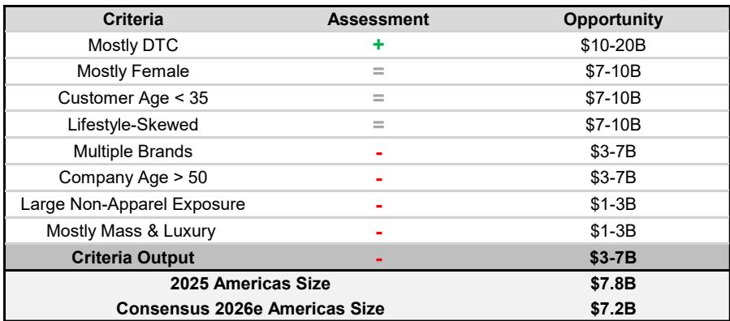
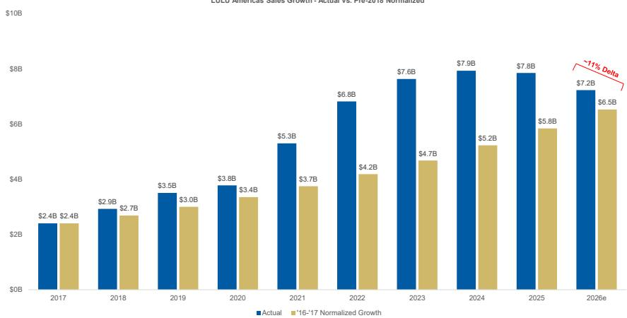
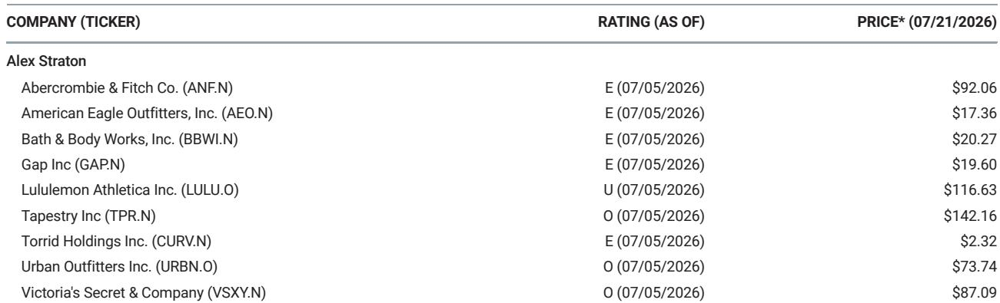

# MS：Lululemon美洲业务规模或需调整25%至60%

一份7月22日发布的MS研报，对Lululemon美洲业务的可持续规模提出了一个与市场共识差距明显的判断。报告通过三种独立框架交叉验证后认为，Lululemon当前约78亿美元的美洲业务体量，可能比其可持续收入基础高出25%至60%。这意味着新管理层可能不得不采取“调整以求增长”的策略，而这将引发新一轮盈利预期下修。

该报告的核心逻辑并不复杂：市场对Lululemon美洲业务复苏的深度和时长估计不足，同时对中国市场的增长潜力可能过于乐观。MS预计，Lululemon中期将呈现低个位数百分比的增长，每股盈利在10至11美元区间，低于市场普遍预期的约12美元。盈利预期下修的不确定性路径已经形成。

## 1. 三种独立框架指向同一结论：美洲业务规模偏高

第一种框架基于同行业绩轨迹对比。报告将Lululemon与全球运动服饰及多品牌专业零售商的增长历史进行对标，得出其美洲业务合理规模约为50亿美元；若与单一品牌时尚公司对比，这一数字则降至约30亿美元。综合来看，这一框架暗示Lululemon美洲业务比市场对2026年的预期低25%至60%。

第二种框架采用“正常化增长”模型。假设Lululemon美洲业务在疫情后保持疫情前约低双位数的复合增长率，而非疫情期间约25%的异常加速，那么当前业务规模约为65亿美元——仍比市场2026年预期低约10%。

第三种是MS自有的规模分析框架。该框架从直营占比、客户性别、品牌数量、公司历史等十个结构性维度评估软线品类企业的合理规模。应用结果显示，Lululemon美洲业务的特征最接近年收入30亿至70亿美元的同行，同样低于市场目前70亿美元以上的预期。

> **KC评论：** 三种方法得出的区间有重叠，但都指向一个方向——美洲业务规模偏高。读者可以关注的是，报告使用的“正常化增长”模型假设疫情前增速为低双位数，这一前提是否合理，以及疫情带来的品牌认知度提升是否具有持续性。

## 2. “调整以求增长”策略的可能性上升

三种框架的结论叠加，意味着Lululemon美洲业务在结构上大于其可持续水平。报告认为，这增加了新管理层采取“调整以求增长”策略的可能性。所谓“调整”，并非简单关店或裁员，而是主动调整业务规模，使其回归可持续的增长轨道。

这一判断的隐含含义是，市场目前对Lululemon美洲业务的复苏预期可能过于乐观。如果管理层确实需要执行调整策略，那么美洲业务的调整周期将比市场当前模型更长，盈利预期下修的不确定性也将持续。

## 3. 盈利预测与市场共识的差距

MS对Lululemon的盈利预测与市场共识存在系统性差异。报告预计，2027财年至2029财年，每股盈利分别为10.35美元、10.35美元和10.52美元，而市场共识分别为10.98美元、11.34美元和12.62美元。差距在2029财年最为明显，达到约2美元。

这种差距的来源，一方面是美洲业务收入假设的差异，另一方面是利润率路径的不同。报告假设中期息税前利润率调整至约13%，而市场可能预期利润率回升。如果美洲业务确实需要调整，利润率承压的时间可能更长。

## 4. 一个可复用的观察框架：规模分析的结构性维度

报告自有的规模分析框架提供了一个可供行业观察者参考的分析工具。该框架从十个维度评估软线品类企业的合理规模，包括：销售渠道结构（直营占比）、客户性别分布、客户年龄、品牌定位（生活方式还是功能性）、品牌数量、公司历史、非服装业务占比、价格带分布等。

每个维度对应不同的规模区间。例如，以直营为主的品牌可能达到100亿至200亿美元规模，而多品牌运营的公司通常只能达到30亿至70亿美元。Lululemon在“以直营为主”这一维度得分较高，但在“多品牌运营”和“公司历史超过50年”等维度得分较低，综合结果指向30亿至70亿美元区间。

这一框架的价值在于，它提供了一种结构化的方式来判断一个品牌的天花板，而非仅依赖线性外推或市场情绪。

> **KC评论：** 规模分析框架中最容易被忽略的是“公司历史”这一维度。报告认为，历史超过50年的公司通常拥有更成熟的管理体系和更稳定的供应链，因此能够支撑更大规模。Lululemon成立于1998年，相对年轻，在管理体系和供应链韧性上可能面临挑战。这一维度提醒读者，规模增长不仅是需求问题，更是组织能力的匹配问题。

For informational purposes only. Portions may be generated,translated,summarized,or edited with AI assistance based on source materials and may contain omissions or errors. Please verify independently. This is not investment,legal,tax,accounting,or other professional advice.

For informational purposes only. Portions may be generated,translated,summarized,or edited with AI assistance based on source materials and may contain omissions or errors. Please verify independently. This is not investment,legal,tax,accounting,or other professional advice.

