e = MS estimates

Salesforce, Inc. | North America

# 何时自我颠覆能带来回报？评级调整至中性

## 变化摘要

软件 | 美国

<table><tr><td>Salesforce, Inc. (CRM.N)</td><td>从超配 $287.00</td><td>至中性 $185.00</td></tr></table>

CRM正在积极进行自我颠覆，为智能体时代做准备，但强劲的Agentforce关键指标尚未推动内生增长出现拐点，因为传统产品组合的拖累依然存在。在没有显著增长拐点的情况下，公司报价可能维持区间震荡，使得风险回报在约19倍GAAP市盈率下趋于平衡。评级下调至中性。

## 核心要点

■ Agentforce关键指标正在改善，但AI动能尚未改变cRPO/内生收入增长曲线，因为传统资产（即Commerce、Tableau）仍在拖累
- 我们认为Salesforce正在向无头架构进行正确的智能体转型，但商业化仍处于早期阶段，这意味着转化为增长需要时间
- 利润率存在弹性空间，但短期内对Agentforce、Data 360和无头架构的再投入可能限制杠杆效应的实现，推迟自我改善的回报
- 在约19倍GAAP市盈率下，若无显著增长拐点，公司报价估值合理；平衡的风险回报支持中性评级，目标价下调至185美元

随着本报告的发布，Adam Wood将担任Salesforce（CRM）的主要覆盖分析师，给予中性评级和185美元目标价。

持久的护城河与正确的转型路径，但增长可见性有限。近期业绩对Salesforce而言是“双城记”，AI动能持续被订阅收入增长和前瞻性指标的持续变化所抵消（图表3）。这种脱节——强劲的智能体关键指标但内生增长指标未见拐点——导致了公司报价的倍数压缩，并使读者聚焦于一个关键问题：Agentforce和新的无头商业化举措何时能抵消投资组合中表现不佳领域（Commerce、Tableau）的结构性拖累，推动持续的订阅收入增长？通过我们的AI就绪框架重新评估覆盖范围，我们继续认为Salesforce拥有强大的护城河，并走在正确的转型路径上。重要的是，Salesforce是为数不多的、似乎正在积极尝试自我颠覆的大型SaaS企业之一——管理层没有仅仅捍卫传统的基于座位的用户界面，而是将数据、工作流和行动层从其传统应用界面中解耦。

<table><tr><td colspan="2">MS &amp; CO. LLC</td></tr><tr><td colspan="2">Adam Wood</td></tr><tr><td colspan="2">股票分析师</td></tr><tr><td>Adam.Wood@morganstanley.com</td><td>+1 212 761-3656</td></tr><tr><td colspan="2">Elizabeth Porter, CFA</td></tr><tr><td colspan="2">股票分析师</td></tr><tr><td>Elizabeth.E.Porter@morganstanley.com</td><td>+1 212 761-3632</td></tr><tr><td colspan="2">Kathleen A Keyser</td></tr><tr><td colspan="2">研究助理</td></tr><tr><td>Katie.Keyser@morganstanley.com</td><td>+1 212 761-0518</td></tr></table>

## Salesforce, Inc. (CRM.N, CRM UN)

<table><tr><td>股票评级</td><td>中性</td></tr><tr><td>行业观点</td><td>有吸引力</td></tr><tr><td>目标价</td><td>$185.00</td></tr><tr><td>收盘价 (2026年7月20日)</td><td>$173.79</td></tr><tr><td>当前市值 (百万)</td><td>$151,371</td></tr><tr><td>52周范围</td><td>$274.00-147.60</td></tr></table>

<table><tr><td>财年截止日</td><td>01/26</td><td>01/27e</td><td>01/28e</td><td>01/29e</td></tr><tr><td>每股收益 ($)**</td><td>12.52</td><td>14.12</td><td>16.01</td><td>18.37</td></tr><tr><td>先前每股收益 ($)**</td><td>-</td><td>-</td><td>15.97</td><td>18.01</td></tr><tr><td>市盈率</td><td>21.0</td><td>16.8</td><td>15.2</td><td>13.2</td></tr><tr><td>每股收益 ($)§</td><td>11.76</td><td>14.12</td><td>15.55</td><td>17.80</td></tr><tr><td>股息率 (%)</td><td>0.8</td><td>1.0</td><td>1.1</td><td>1.2</td></tr></table>

除非另有说明，所有指标均基于MS ModelWare框架

\*\* = 基于共识方法论

§ = 共识数据由Refinitiv Estimates提供

## 季度每股收益 ($)

<table><tr><td>季度</td><td>2026</td><td>2027e 先前</td><td>2027e 当前</td><td>2028e 先前</td><td>2028e 当前</td></tr><tr><td>Q1</td><td>2.58</td><td>-</td><td>3.88a</td><td>3.89</td><td>3.90</td></tr><tr><td>Q2</td><td>2.91</td><td>3.25</td><td>3.25</td><td>3.85</td><td>3.89</td></tr><tr><td>Q3</td><td>3.25</td><td>3.42</td><td>3.42</td><td>3.96</td><td>3.96</td></tr><tr><td>Q4</td><td>3.81</td><td>3.60</td><td>3.60</td><td>4.26</td><td>4.26</td></tr></table>

e = MS估计值, a = 公司实际报告数据

有关分析师认证和其他重要披露，请参阅本报告末尾的披露部分。

从战略角度看，我们认为这可能是正确的举措，因为在智能体世界中，Salesforce将越来越需要使其客户数据、上下文、权限和工作流层成为可商业化的表面。然而，鉴于商业化的早期阶段，我们缺乏维持先前超配评级所需的清晰度，尤其是在短期内Salesforce能否实现持续改善的增长前景，特别是考虑到传统业务部分将继续构成拖累。因此，尽管我们相信Salesforce正在为智能体世界的转型做好充分准备，但在证明其商业化能力方面仍有待验证，我们认为在没有显著增长拐点的情况下，公司报价将基本维持区间震荡，这支持我们将评级调整至中性。

## 基于三个关键点下调至中性：

1. AI关键指标正在改善，但对利润表影响甚微，因传统业务领域拖累整体内生增长。单独来看，Salesforce AI产品组合的数据点继续显示出动能，公司Agentforce的ARR增长加速至200%以上，规模已达10亿美元以上（图表1）。此外，公司在Token（2027年第一季度环比增长152%）和智能体工作单元（衡量针对这些Token完成的智能/工作量的指标，2027年第一季度环比增长111%）方面均看到增长加速，这支撑了其解决方案的采用势头。公司还提出，AWU的重度用户对Salesforce的支出增长明显快于非AI采用者，这开始为读者日提出的商业化情景提供支持（图表2）。尽管如此，上述动能向领先指标和/或整体营收的转化尚未实现，Salesforce已连续两个季度出现cRPO超预期幅度极小、CC cRPO增长/cRPO-based订单增长未见拐点（图表3），以及FY27内生收入增长持续减速至接近高个位数。我们认为这主要是整体投资组合内不同增长率的结果——具体来说，营销与商务以及集成与分析云表现较弱（图表4）。我们认为这些业务部分存在结构性压力，尤其是在Commerce领域，Shopify已成为快速的市场份额获取者/颠覆者；在Tableau领域，更轻量级的商业智能产品可能面临更大的AI颠覆风险。鉴于这些增长拖累的动态，我们不愿对4季度之后持续增长改善的情景下注，届时Informatica的收购将被周年化（因此成为内生部分），可能支撑公司对2027年下半年的加速预期。换句话说，尽管Agentforce显示出令人鼓舞的领先指标，但我们尚未有信心认为AI动能能够推动内生增长的持续加速，因为传统业务领域的持续拖累需要新兴、表现更好的业务持续强劲来抵消——这种组合转变可能需要时间。

图表1：Agentforce ARR在10亿美元以上规模加速增长  
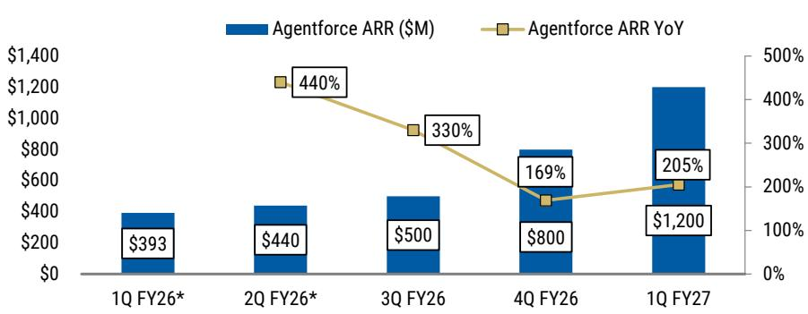  
来源：公司数据，MS。季度数据根据同比增速披露进行调整\*。

图表2：2025年读者日强调了随着客户在智能体旅程中成熟，ARR显著提升的机会  
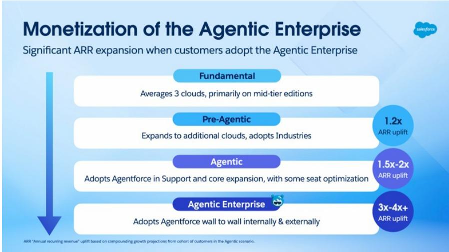  
来源：Salesforce 2025年读者日

图表3：内生CC cRPO增长基本稳定在窄幅区间，但未出现拐点  
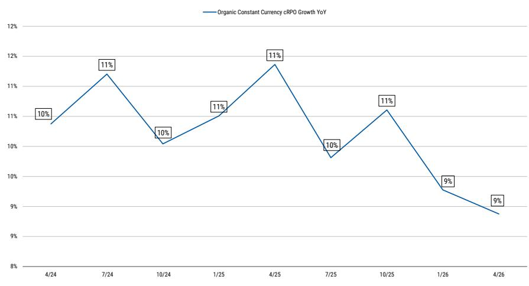  
来源：公司数据，MS

图表4：营销与商务以及集成与分析云（截至FY26约占收入的30%）拖累整体增长  
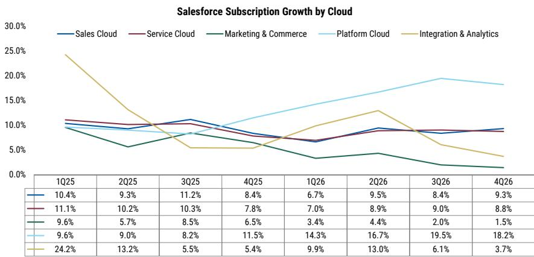  
来源：公司数据，MS。注：4Q26平台云已根据Informatica贡献进行调整

2. 相对护城河/转型路径优势，但转型仍然困难。在我们的AI就绪工作中，Salesforce在系统记录深度、企业分销、专有数据/上下文和领域专业知识等领域得分最高。也许更重要的是，我们认为Salesforce在愿意自我颠覆和转型其商业模式方面相对主动，而不是不惜一切代价捍卫基于座位的用户界面。值得注意的是，这家公司一再愿意扩展，有时甚至模糊其自身业务的边界——开创了SaaS转型，从销售领域扩展到前台办公的相邻领域，现在又从人类驱动的用户界面转向智能体。这体现在我们评分卡的“转型路径”部分，相对于其他大型SaaS同行（如Workday和Adobe），Salesforce的定位相对较强。随着价值从屏幕和座位转向成果和行动，Salesforce正试图将商业化层向技术栈下层移动，转向智能体在企业中推理和行动所需的数据、元数据、上下文、权限和工作流层。

虽然我们相信Informatica、MuleSoft、Data 360和Slack的融合为Salesforce构建企业智能体AI的控制平面提供了令人信服的理由，但我们承认战略正确性并不等同于增长拐点，而增长拐点是读者重新参与公司报价的关键。因此，Salesforce面临的困难仍然是将智能体活动转化为可预测的订阅增长，我们认为定价路径是最清晰的信号，表明现在下结论还为时过早。Salesforce已经多次改变其AI定价结构——从基于对话的Agentforce定价转向更灵活的企业协议、基于行动的构建和信用模式，因为客户追求可预测性和价值对齐。虽然我们的调查工作继续表明CIO们将Salesforce视为他们计划在部署企业AI时利用的关键合作伙伴（图表5），但在有效商业化转化为持续增长加速方面仍有待证明，我们认为这从Salesforce（以及更广泛的SaaS）相对于其他正在从AI中看到营收拐点的软件领域（基础设施、部分安全）更长的转型路径中得到了充分体现。

图表5：Salesforce护城河与转型路径评分  
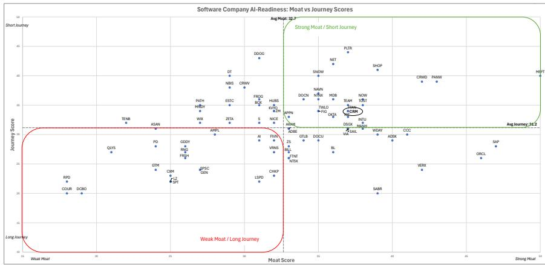  
来源：MS

图表6：CIO们继续将Salesforce视为构建AI应用的关键SaaS合作伙伴

2Q26：构建定制AI应用的首选供应商：当前 vs. 三年后  
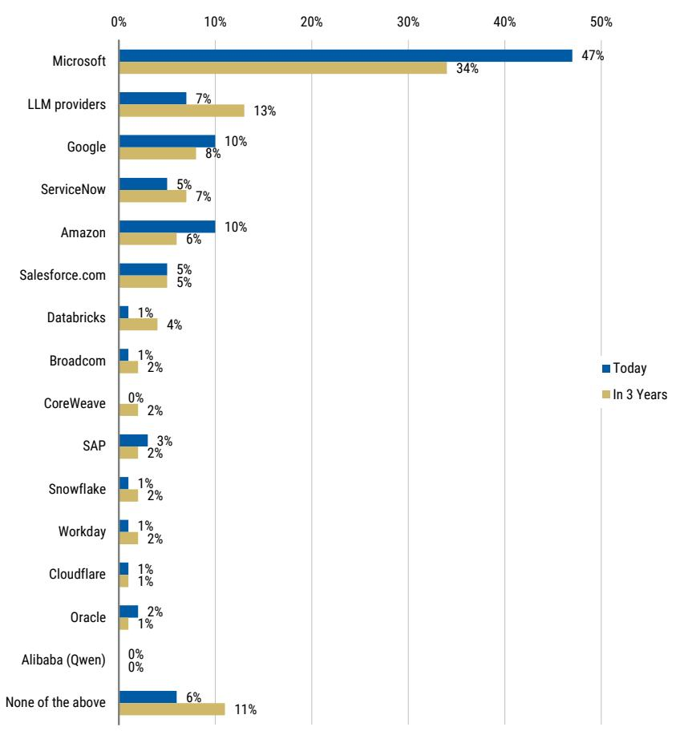  
来源：AlphaWise, MS

图表7：总体而言，最高的“转型路径”评分主要由传统基于座位的SaaS之外的供应商占据  
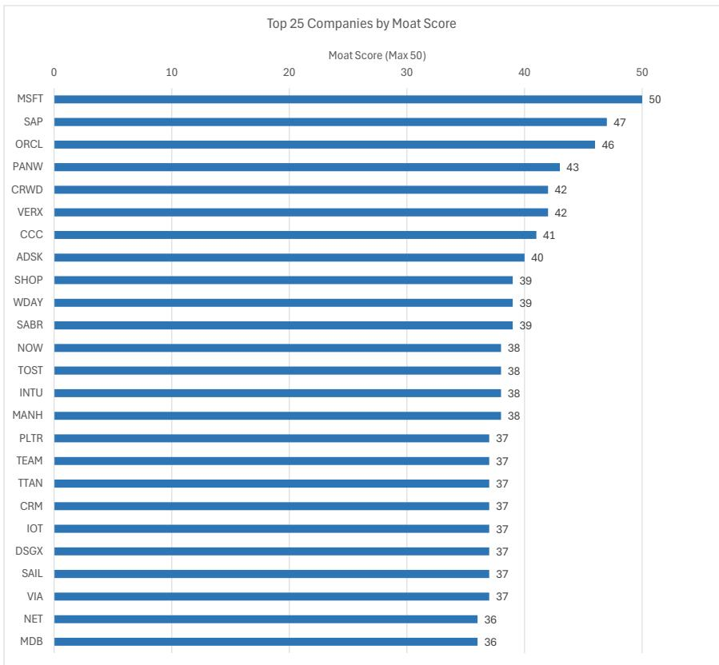  
来源：MS

## 3. 与同行相比，效率提升空间更大；但当前投入模式可能构成短期压力。

在我们的效率工作中，Salesforce的评分低于最精简的大型应用同行，CY25 GAAP毛利润/员工约为40.4万美元，而Intuit约为83.9万美元，Adobe约为68.4万美元（图表8）。在营业利润方面也有类似空间，Salesforce约为10.4万美元/员工，而Adobe约为28.1万美元/员工，Intuit约为28万美元/员工（图表9）。我们认为这支持了模型仍可变得更高效的观点——特别是在GTM生产力、支持强度以及更好地利用400亿美元以上的收入基础方面，其中销售与营销支出占收入的比例仍高于同行（图表10）。也就是说，管理层的评论继续指出，短期内将增量资金投向增长，因为他们希望扩大Agentforce、Data 360，并继续构建无头架构背后的商业化载体。因此，虽然存在自我改善的角度，但Salesforce目前选择在AI转型期间进行投入，而不是完全收获当前模型。然而，长期来看，公司到FY30的50法则框架实际上暗示了一条通往约40%非GAAP营业利润率的路径，而FY27的指引约为34.3%，表明在这一投入期之后，利润率有进一步改善的机会。

图表8：Salesforce毛利润/员工低于成熟SaaS同行Adobe和Intuit  
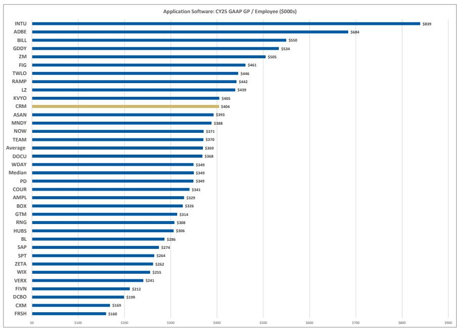  
来源：公司数据，MS

图表9：...营业利润/员工方面类似，表明投入周期后效率提升空间  
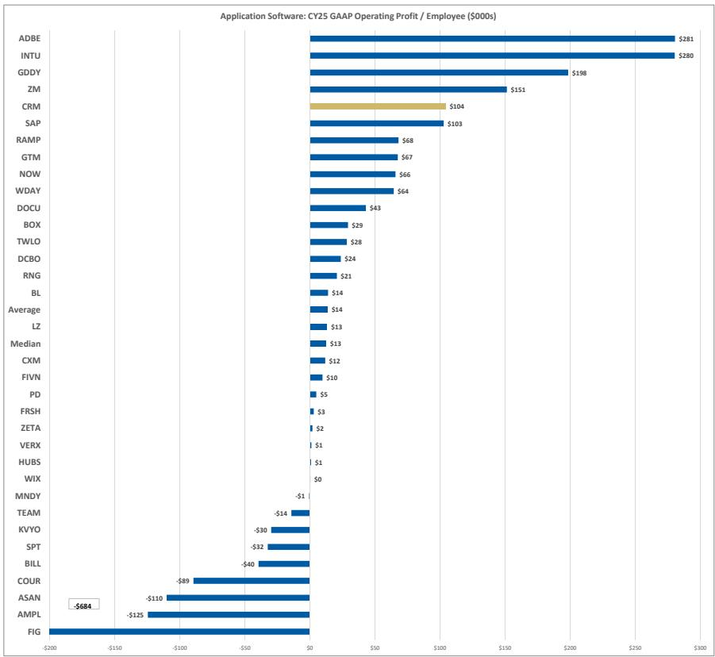  
来源：公司数据，MS

图表10：在SaaS同行中，Salesforce的销售与营销费用占收入的比例仍然较高，提供了潜在的运营杠杆机会  
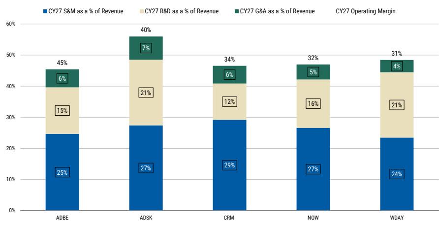  
来源：公司数据，MS

我们如何看待估值？CRM目前交易在约19倍GAAP收益，与增长相似的同行INTU（约13倍）、ADBE（约12倍）和SAP（约16倍）在相对基础上大致相当，但在增长调整基础上略高于同行（CRM约2.5倍 vs 组内约1.6倍）。因此，在没有显著增长拐点的情况下，风险回报感觉相对平衡。

图表11：CRM在GAAP市盈率基础上与成熟大型同行大致相当

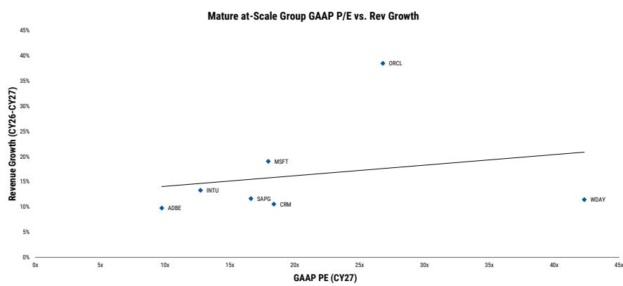  
来源：公司数据，MS

为什么不给予低配评级？我们认为Salesforce愿意自我颠覆（拥抱无头架构）表明其理解AI创新周期，以及传统成熟软件供应商将需要如何迭代其产品、定价模式和用户界面以从AI普及中受益。虽然投资组合中存在需要时间消化的传统部分，但相对而言，我们认为Salesforce的“转型路径”比SaaS的其他领域更为有利。具体来说，在我们的AI就绪工作中，Salesforce相对于Adobe等公司而言是一个更清晰的战略资产，在Adobe，AI对轻量级创意工作的替代可能更为显著，尤其是短期执行风险较高。与Workday相比，考虑到WDAY的报价在计入SBC后比CRM报价更贵，我们可能看到其倍数有更多下行风险。另一方面，我们中性评级（而非维持超配）的最大风险将是Salesforce较新的战略举措（Agentforce、无头架构）的商业化/增长快于预期，足以抵消表现不佳的领域，支持持续的增长重新加速。

目标价下调至185美元。我们将目标价从之前的287美元下调至185美元，因为我们现在对CY28自由现金流/股估计值约21美元应用10倍倍数（与成熟SaaS同行大致一致，之前为15倍）。以10%的加权平均资本成本折现回来，得到185美元的目标价，这意味着约21倍CY27 GAAP市盈率。

## 风险回报 – Salesforce, Inc. (CRM.N)

持久的护城河与正确的AI转型路径，但增长可见性有限

## 目标价 $185.00

基于对FY29e自由现金流/股约21美元应用10倍倍数，以约10%折现，加回每股净现金（13美元）。

共识目标价分布

来源：Refinitiv, MS

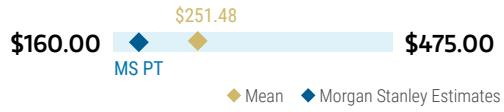

## 风险回报图与期权隐含概率（12个月）

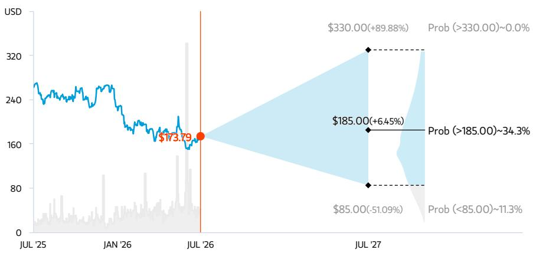  
关键：— 历史报价表现 ● 当前报价 ◆ 目标价

来源：Refinitiv, MS, MS Institutional Equities Division。我们牛市、基准和熊市情景的概率是使用截至2026年7月20日期权市场的隐含波动率数据估算的。所有数字均为近似风险中性概率，即报价在三个月或一年内达到情景价格以上的概率。在此查看期权概率方法论说明

## 中性评级论点

\- Salesforce在企业分销和系统记录实力方面拥有持久的护城河，而管理层愿意颠覆传统的基于座位的模式，使公司为以行动和成果为中心的智能体世界做好了充分准备
- 强劲的Agentforce采用率和AI活动被传统领域（特别是Commerce和Tableau）的持续拖累所抵消，使内生增长处于减速路径，限制了短期持续营收加速的可见性
- 利润率扩张提供了有意义的长期弹性空间，一旦当前投入周期缓和，有空间推动更大的杠杆效应，然而，在约18倍GAAP市盈率下，若无显著增长改善，公司报价看起来定价合理

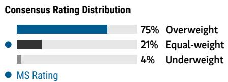  
来源：Refinitiv, MS

## 风险回报主题

<table><tr><td>颠覆：</td><td>负面</td></tr><tr><td>结构性增长：</td><td>正面</td></tr><tr><td>技术扩散：</td><td>正面</td></tr></table>

在此查看风险回报主题说明

## 牛市情景

## 14倍 FY29e 自由现金流 约240亿美元

$330.00

约15% FY26-29收入复合年增长率，得益于Agentforce和Data Cloud的快速采用以及续约率的提高，因为CRM成为客户更具战略意义的技术提供商。更高比例的高利润率续约业务推动FY29营业利润率至约39%。约20%的自由现金流增长复合年增长率支持CRM在FY28的14倍EV/自由现金流倍数，假设约10%折现率，得出远期12个月330美元估值。

## 基准情景

## 10倍 FY29e 自由现金流 约190亿美元

双位数收入复合年增长率，受益于近期并购。销售与服务云的稳定以及Agentforce和AI举措的持续增长支持FY26-29收入约10%的复合年增长率。随着FY29营业利润率增长至约36%，自由现金流受益。我们以10倍EV/自由现金流对FY28估值，以约10%加权平均资本成本折现。我们的目标价意味着约20倍GAAP每股收益，与类似增长概况的大型软件同行大致一致。

## $185.00 熊市情景

$85.00

## 6倍 FY29e 自由现金流 约150亿美元

竞争加剧和传统投资组合拖累增长。AI原生竞争对手创新更快，导致客户构建内部解决方案，增加客户流失，并在未来三年内将营收增长压力降至中个位数。尽管运营支出纪律加强，但增量投入限制了利润率扩张潜力，将FY29利润率扩张限制在约30年代中期。CRM在FY29以6倍EV/自由现金流交易，假设约10%折现率，得出远期12个月85美元估值。

## 风险回报 – Salesforce, Inc. (CRM.N)

## 关键收益输入

<table><tr><td>驱动因素</td><td>2026年1月</td><td>2027年1月e</td><td>2028年1月e</td><td>2029年1月e</td></tr><tr><td>总账单收入同比增速 (%)</td><td>13.8</td><td>7.3</td><td>0.0</td><td>0.0</td></tr><tr><td>当前剩余履约义务同比 (%)</td><td>16.2</td><td>11.4</td><td>0.0</td><td>0.0</td></tr><tr><td>当前RPO基础订单同比 (%)</td><td>14.6</td><td>7.9</td><td>0.0</td><td>0.0</td></tr><tr><td>营业利润率 % (%)</td><td>34.1</td><td>34.3</td><td>34.9</td><td>35.7</td></tr></table>

## 投资驱动因素

• 内生收入增长维持在接近高双位数复合年增长率

• 近期并购后平衡的收入增长和利润率框架

## 全球收入分布

<table><tr><td></td><td>0-10%</td></tr><tr><td colspan="2">亚太（除日本、中国大陆和印度）</td></tr><tr><td colspan="2">欧洲（除英国）</td></tr><tr><td colspan="2">印度</td></tr><tr><td colspan="2">日本</td></tr><tr><td colspan="2">拉丁美洲</td></tr><tr><td colspan="2">中东和非洲</td></tr><tr><td colspan="2">英国</td></tr><tr><td colspan="2">60-70%</td></tr></table>

来源：MS估计 在此查看区域层级说明

## MS ALPHA 模型

<table><tr><td>1/5最佳</td><td>24个月展望</td><td>3/5最多</td><td>3个月展望</td></tr></table>

- Gen AI产品/无头举措商业化快于预期且有效
- 宣布重大新成本削减举措
- 更大规模的股票回购授权及更快的回购部署
- Agentforce/无头举措未能稳定增长
• GenAI投入拖累利润率
- 企业利用替代平台，对新的CRM前台办公解决方案的需求被挤出

来源：Refinitiv, FactSet, MS；1为最受青睐的五分位，5为最不受青睐的五分位

## 目标价/评级风险

## 上行风险

## 下行风险

## 持仓情况

<table><tr><td>机构持有人，主动型占比</td><td>51%</td><td></td><td></td><td></td></tr><tr><td>对冲基金行业多空比</td><td>2.1x</td><td></td><td></td><td></td></tr><tr><td>对冲基金行业净敞口</td><td>29.5%</td><td></td><td></td><td></td></tr></table>

Refinitiv; MSPB Content。包括与MSPB持有的某些对冲基金敞口。信息可能与更广泛的市场趋势不一致或无法反映。多空比 = 多头敞口 / 空头敞口。行业占净总敞口百分比 = （对于特定行业：多头敞口 - 空头敞口）/（跨所有行业：多头敞口 - 空头敞口）。

MS估计 vs. 共识

<table><tr><td colspan="3">FY 2028年1月e</td></tr><tr><td rowspan="2">每股收益 ($)</td><td rowspan="2">14.12</td><td>16.01</td></tr><tr><td>15.55</td></tr><tr><td rowspan="2">销售额/收入 ($, 百万)</td><td rowspan="2">49,432</td><td>50,554</td></tr><tr><td>50,484</td></tr><tr><td rowspan="2">EBITDA ($, 百万)</td><td rowspan="2">19,331</td><td>20,973</td></tr><tr><td>20,960</td></tr></table>

◆ 均值 ◆ MS估计
来源：Refinitiv, MS

## 模型变更与财务数据

图表12：模型变更

<table><tr><td></td><td>FY25</td><td>Y/Y Δ</td><td>FY26</td><td>Y/Y Δ</td><td>4/26</td><td>7/26E</td><td>10/26E</td><td>1/27E</td><td>FY27E</td><td>Y/Y Δ</td><td>FY28E</td><td>Y/Y Δ</td><td>FY29E</td><td>Y/Y Δ</td></tr><tr><td>新订阅收入</td><td>35,679</td><td>9.7%</td><td>39,388</td><td>10.4%</td><td>10,593</td><td>10,762</td><td>10,970</td><td>11,761</td><td>44,087</td><td>11.9%</td><td>48,446</td><td>9.9%</td><td>53,507</td><td>10.4%</td></tr><tr><td>同比增速</td><td></td><td></td><td></td><td></td><td>13.9%</td><td>11.1%</td><td>12.8%</td><td>10.2%</td><td></td><td></td><td></td><td></td><td></td><td></td></tr><tr><td>旧订阅收入</td><td>35,679</td><td>9.7%</td><td>39,388</td><td>10.4%</td><td>10,593</td><td>10,762</td><td>10,970</td><td>11,761</td><td>44,087</td><td>11.9%</td><td>48,854</td><td>10.8%</td><td>53,594</td><td>9.7%</td></tr><tr><td>同比增速</td><td></td><td></td><td></td><td></td><td>13.9%</td><td>11.1%</td><td>12.8%</td><td>10.2%</td><td></td><td></td><td></td><td></td><td></td><td></td></tr><tr><td>% 变化</td><td>0%</td><td></td><td>0%</td><td></td><td>0%</td><td>0%</td><td>0%</td><td>0%</td><td>0%</td><td></td><td>-0.8%</td><td></td><td>-0.2%</td><td></td></tr><tr><td>新总收入</td><td>37,895</td><td>8.7%</td><td>41,525</td><td>9.6%</td><td>11,133</td><td>11,317</td><td>11,441</td><td>12,219</td><td>46,110</td><td>11.0%</td><td>50,554</td><td>9.6%</td><td>55,663</td><td>10.1%</td></tr><tr><td>同比增速</td><td></td><td></td><td></td><td></td><td>13.3%</td><td>10.6%</td><td>11.5%</td><td>9.1%</td><td></td><td></td><td></td><td></td><td></td><td></td></tr><tr><td>旧总收入</td><td>37,895</td><td>8.7%</td><td>41,525</td><td>9.6%</td><td>11,133</td><td>11,317</td><td>11,441</td><td>12,219</td><td>46,110</td><td>11.0%</td><td>50,983</td><td>10.6%</td><td>55,753</td><td>9.4%</td></tr><tr><td>% 变化</td><td>0%</td><td></td><td>0%</td><td></td><td>0%</td><td>0%</td><td>0%</td><td>0%</td><td>0%</td><td></td><td>-1%</td><td></td><td>0%</td><td></td></tr><tr><td>营业利润率</td><td>33.0%</td><td></td><td>34.1%</td><td></td><td>34.8%</td><td>34.0%</td><td>34.1%</td><td>34.2%</td><td>34.3%</td><td></td><td>34.9%</td><td></td><td>35.7%</td><td></td></tr><tr><td>营业利润率</td><td>33.0%</td><td></td><td>34.1%</td><td></td><td>34.8%</td><td>34.0%</td><td>34.1%</td><td>34.2%</td><td>34.3%</td><td></td><td>34.5%</td><td></td><td>35.0%</td><td></td></tr><tr><td>% 变化</td><td>0%</td><td></td><td>0%</td><td></td><td>0%</td><td>0%</td><td>0%</td><td>0%</td><td>0%</td><td></td><td></td><td></td><td></td><td></td></tr><tr><td>新非GAAP每股收益</td><td>10.19</td><td></td><td>12.52</td><td></td><td>3.88</td><td>3.25</td><td>3.42</td><td>3.60</td><td>14.12</td><td></td><td>16.01</td><td></td><td>18.37</td><td></td></tr><tr><td>旧非GAAP每股收益</td><td>10.19</td><td></td><td>12.52</td><td></td><td>3.88</td><td>3.25</td><td>3.42</td><td>3.60</td><td>14.12</td><td></td><td>15.97</td><td></td><td>18.01</td><td></td></tr><tr><td>每股收益增速</td><td></td><td></td><td></td><td></td><td></td><td></td><td></td><td></td><td></td><td></td><td>13%</td><td></td><td>15%</td><td></td></tr><tr><td>% 变化</td><td>0%</td><td></td><td>0%</td><td></td><td>0%</td><td>0%</td><td>0%</td><td>0%</td><td>0%</td><td></td><td>0%</td><td></td><td>2%</td><td></td></tr><tr><td>新总账单收入</td><td>39,635</td><td>8.6%</td><td>45,099</td><td>13.8%</td><td>7,179</td><td>10,081</td><td>9,129</td><td>22,016</td><td>48,405</td><td>7.3%</td><td>52,331</td><td>8.1%</td><td>57,148</td><td>9.2%</td></tr><tr><td>同比增速</td><td>8.6%</td><td></td><td>13.8%</td><td></td><td>4.3%</td><td>12.1%</td><td>4.9%</td><td>7.3%</td><td>7.3%</td><td></td><td>8.1%</td><td></td><td>9.2%</td><td></td></tr><tr><td>旧总账单收入</td><td>39,635</td><td>8.6%</td><td>45,099</td><td>13.8%</td><td>7,179</td><td>10,081</td><td>9,129</td><td>22,016</td><td>48,405</td><td>7.3%</td><td>53,013</td><td>9.5%</td><td>57,552</td><td>8.6%</td></tr><tr><td>同比增速</td><td>8.6%</td><td></td><td>13.8%</td><td></td><td>4.3%</td><td>12.1%</td><td>4.9%</td><td>7.3%</td><td>7.3%</td><td></td><td>9.5%</td><td></td><td>8.6%</td><td></td></tr><tr><td>% 变化</td><td>0%</td><td></td><td>0%</td><td></td><td>0%</td><td>0%</td><td>0%</td><td>0%</td><td>0%</td><td></td><td></td><td></td><td></td><td></td></tr><tr><td>新当前RPO</td><td></td><td></td><td></td><td></td><td>33,600</td><td>33,491</td><td>33,283</td><td>39,097</td><td></td><td></td><td></td><td></td><td></td><td></td></
