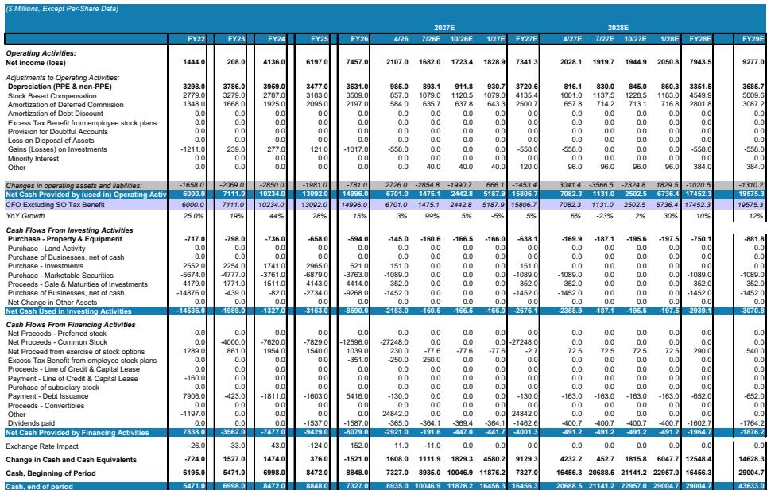
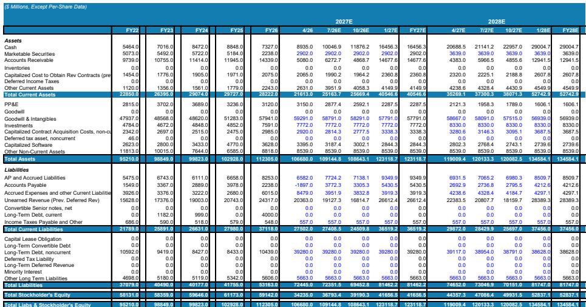
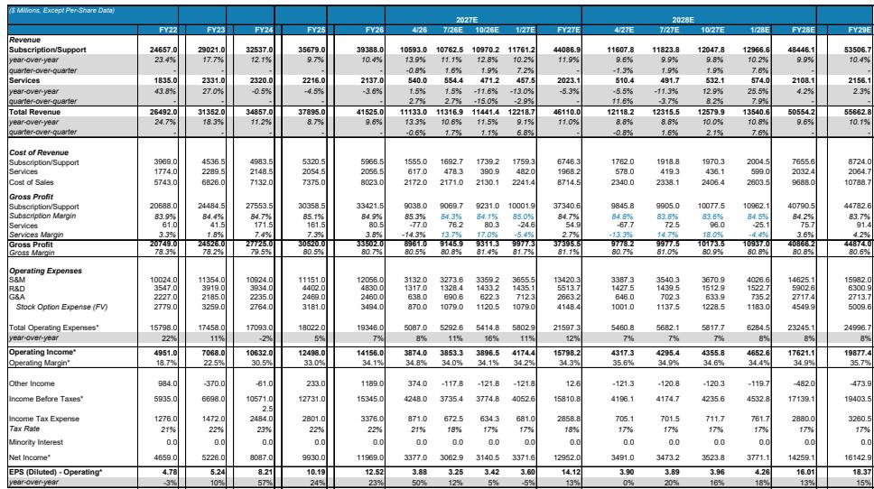

# MS：核心变化是业务与近期数据观察

Salesforce正在主动调整自身以迎接智能体时代，但这份MS研报的核心判断是：AI势头尚未转化为有机增长的明确拐点。Agentforce的年化经常性收入已突破10亿美元规模，增速超过200%，同时token消耗量环比增长152%，智能体工作单元环比增长111%。然而，这些亮眼的AI指标并未带动公司整体订阅收入增速回升。报告认为，核心原因在于传统业务板块——特别是Commerce和Tableau——的结构性影响仍在持续，而AI货币化仍处于早期阶段。

## 1. 传统业务影响抵消AI增长动能

报告指出，Salesforce的营销与商务云、集成与分析云合计约占公司FY26收入的30%，但这两个板块增长仍在调整。在Commerce领域，Shopify正在快速获取市场份额；在Tableau一侧，轻量级商业智能产品面临AI替代的不确定性。这些结构性因素导致公司连续两个季度cRPO（当前剩余履约义务）未能超预期，按固定汇率计算的cRPO增长和基于cRPO的订单增长均未出现拐点。报告认为，除非AI收入能够持续且足够强劲地抵消这些影响，否则有机增长难以出现可持续加速。

> **KC评论：** 这里的关键不是Agentforce不够好，而是它的体量还不足以覆盖传统业务的变化。读者需要关注的是，AI收入增速何时能够超过传统业务的变化速度，而非单纯看AI指标的相对值。

## 2. 主动调整的战略正确性与货币化难度并存

研报用“AI就绪度框架”评估Salesforce，认为其在系统记录深度、企业分销能力、专有数据和领域知识方面得分较高。更重要的是，管理层愿意主动调整自身——从SaaS转型、扩展到前台相邻领域，再到从人工驱动的用户界面转向智能体——而非固守传统的席位制UI。报告认为，在智能体时代，Salesforce需要将货币化层下移到数据、元数据、权限和工作流层，而非停留在应用界面层。

但战略正确不等于增长拐点。报告特别指出，Salesforce已经多次调整AI定价结构——从基于对话的Agentforce定价转向更灵活的企业协议、基于行动的定价和信用模式。这种频繁调整本身说明，客户仍在寻求可预测性和价值对齐，AI货币化路径尚未稳定。相比之下，基础设施软件和部分安全软件已经看到AI带来的收入加速，而SaaS整体仍在探索中。

## 3. 效率提升空间存在但短期研究优先

从运营效率看，Salesforce仍有改善空间。报告数据显示，公司每位员工的GAAP毛利润约为40.4万美元，远低于Intuit的83.9万美元和Adobe的68.4万美元；运营利润方面，Salesforce约为10.4万美元/人，而Adobe和Intuit均超过28万美元/人。销售与市场费用占收入比重在同类SaaS公司中仍偏高。

但管理层当前选择将增量资金投向Agentforce、Data 360和headless架构的规模化，而非立即追求利润最大化。公司FY30的Rule-of-50目标隐含约40%的非GAAP运营利润率，高于FY27指引的约34.3%。这意味着，一旦研究周期结束，利润率仍有提升空间，但短期来看，这种研究模式限制了利润释放。

## 4. 估值与不确定性收益比趋于平衡

核心变化是估值倍数从15倍FCF降至10倍FCF，与成熟SaaS同行基本一致。当前报价约173.79美元，对应约19倍GAAP市盈率，与Intuit（约13倍）、Adobe（约12倍）和SAP（约16倍）相比相对估值接近，但增长调整后略高于同行。

报告认为，在缺乏显著增长拐点的情况下，报价大概率维持区间震荡。节奏变化的不确定性方面，如果Agentforce和headless的货币化速度快于预期，足以抵消传统业务影响并推动增长重新加速，则当前判断可能偏保守。但基于现有数据，报告选择等待更明确的增长信号。

For informational purposes only. Portions may be generated,translated,summarized,or edited with AI assistance based on source materials and may contain omissions or errors. Please verify independently. This is not investment,legal,tax,accounting,or other professional advice.

For informational purposes only. Portions may be generated,translated,summarized,or edited with AI assistance based on source materials and may contain omissions or errors. Please verify independently. This is not investment,legal,tax,accounting,or other professional advice.

