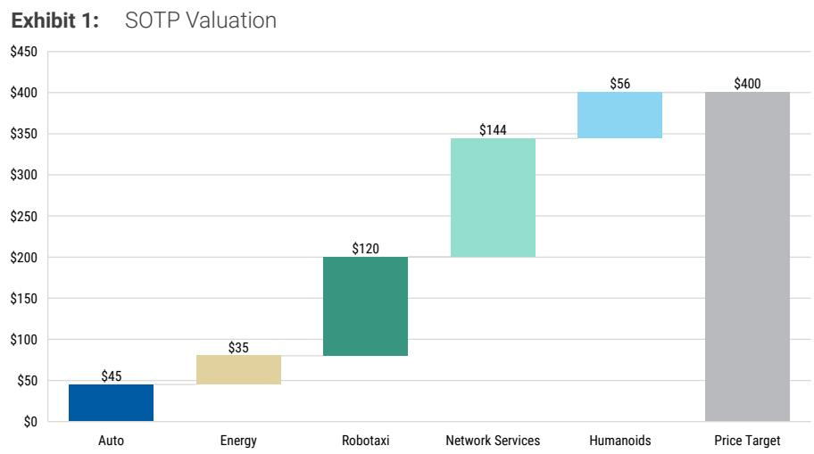
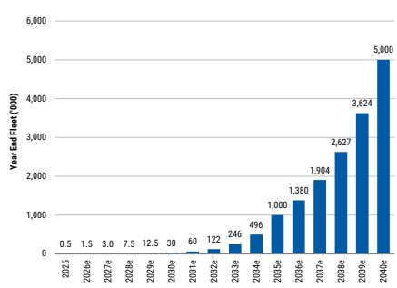
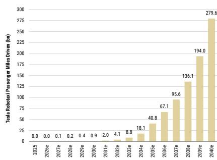
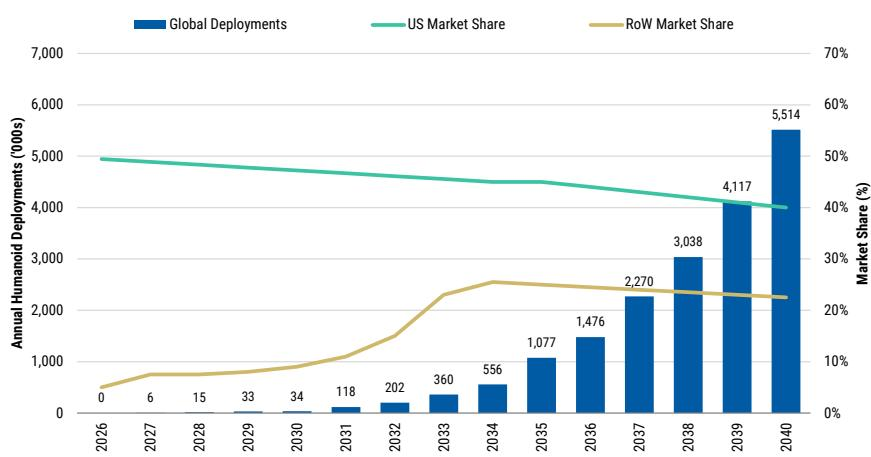
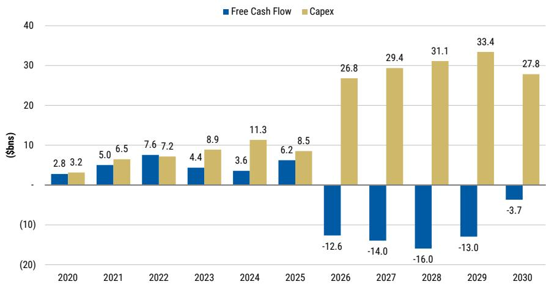
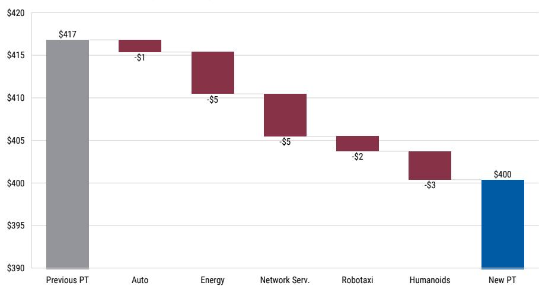

# The Road to ROI: Patience Required

<table><tr><td colspan="3">WHAT'S CHANGED</td></tr><tr><td>Tesla Inc (TSLA.O)</td><td>From</td><td>To</td></tr><tr><td>Price Target</td><td>$417.00</td><td>$400.00</td></tr></table>

We view Tesla's accelerating capex cycle as a necessary investment to secure leadership in autonomy & robotics. However, these investments push FCF further into negative territory, increasing focus on tangible Robotaxi & Optimus milestones. We lower our PT to \$400 reflecting elevated cash burn.

## Key Takeaways

■ TSLA remains positioned to lead in Physical AI, but the ROI on a heavy capex cycle requires patience and consistent execution.

FSD adoption was an upside surprise, with North America attach rates reaching 55% in the quarter, far surpassing our 25-30% estimate.

■ Robotaxi commentary was upbeat; we need density + larger sample of safety data within existing cities, not just geographic expansion.

■ Cybercab production is scaling, but software recalibration limits near-term fleet entry.

\- Optimus SOP is expected soon. Supply chain complexities elongate the initial ramp.

Nothing this quarter changes our thesis in a meaningful way. The capex step-up is a known trend, now confirmed and extended for the next 2-3 years, prolonging cash burn through the end of the decade on our estimates. We view this as a necessary investment to establish and defend a leadership position in autonomy and robotics. The open question remains the timing of when we actually see the ROI – specifically, a scaled robotaxi network that demonstrates increasing density and improving safety within existing cities, plus tangible progress commercializing Optimus. Absent consistent, transparent proof points, we'd expect the market's tolerance for incremental capex to narrow. We are lowering our price target to \$400 (from \$417) reflecting increasing capex and worsening cash burn through the end of the decade. Our long-term estimates are broadly unchanged.

<table><tr><td colspan="2">Andrew S Percoco</td></tr><tr><td colspan="2">Equity Analyst</td></tr><tr><td>Andrew.Percoco@morganstanley.com</td><td>+1 212 296-4322</td></tr><tr><td colspan="2">Daniela M Haigian</td></tr><tr><td colspan="2">Equity Analyst</td></tr><tr><td>Daniela.Haigian@morganstanley.com</td><td>+1 212 761-6071</td></tr><tr><td colspan="2">Jahvonte G Bain</td></tr><tr><td colspan="2">Research Associate</td></tr><tr><td>Jahvonte.Bain@morganstanley.com</td><td>+1 212 761-9231</td></tr><tr><td colspan="2">Katherine A Bennorth</td></tr><tr><td colspan="2">Research Associate</td></tr><tr><td>Katie.A.Bennorth@morganstanley.com</td><td>+1 212 761-3753</td></tr></table>

<table><tr><td>Stock Rating</td><td>Equal-weight</td></tr><tr><td>Industry View</td><td>In-Line</td></tr><tr><td>Price target</td><td>$400.00</td></tr><tr><td>Shr price, close (Jul 22, 2026)</td><td>$374.01</td></tr><tr><td>Mkt cap, curr (mm)</td><td>$1,323,247</td></tr><tr><td>52-Week Range</td><td>$498.83-297.82</td></tr></table>

<table><tr><td>Fiscal Year Ending</td><td>12/25</td><td>12/26e</td><td>12/27e</td><td>12/28e</td></tr><tr><td>EPS ($)**</td><td>1.67</td><td>1.70</td><td>2.07</td><td>2.69</td></tr><tr><td>Prior EPS ($)**</td><td>-</td><td>2.20</td><td>2.50</td><td>3.11</td></tr><tr><td>ModelWare EPS ($)</td><td>1.07</td><td>0.71</td><td>0.76</td><td>1.39</td></tr></table>

Unless otherwise noted, all metrics are based on MS ModelWare framework
\*\* = Based on consensus methodology
e = MS estimates

MS does and seeks to do business with companies covered in MS. As a result, investors should be aware that the firm may have a conflict of interest that could affect the objectivity of MS. Investors should consider MS as only a single factor in making their investment decision.

For analyst certification and other important disclosures, refer to the Disclosure Section, located at the end of this report.

  
Source: MS estimates

## What did we learn from the quarter?

\- Robotaxi: new unsupervised miles driven disclosure and growth target (DD% w/w growth through YE). Tesla disclosed a total of 380k cumulative unsupervised robotaxi miles driven to date (in TX/FL), vs. the company's disclosed cumulative 2.5mn paid robotaxi miles driven (across Texas, Florida, and the Bay Area). According to the company, no notable incidents were reported over those unsupervised miles, which is broadly consistent with the NHTSA data we track monthly. Weekly unsupervised miles have grown DD% w/w and are expected to continue at that pace through year-end. Notably, the robotaxi fleet is already operating early versions of v15 FSD software.

Exhibit 2: TSLA Robotaxi Fleet Size ('000)  
  
Exhibit 3: TSLA Robotaxi Passenger Miles (bn)  
Source: MS estimates

  
Source: MS estimates

\- Cybercab: Testing and validating v15 FSD on new chassis. Cybercab manufacturing targets are now aligned to the projected growth rate of unsupervised miles. Before Cybercabs can be deployed in the fleet, the company needs to accumulate driving data specific to the Cybercab's new vehicle chassis to calibrate the software.

\- FSD: 12.6bn miles traveled, 1.5mn active subs, 55% attach rate on NA deliveries in 2Q. TSLA disclosed a 55% attach rate of FSD on incremental volume in North America, well above our prior assumption of \~25-30%. This is a strong indicator that consumers are buying TSLA vehicles for FSD, which we've long written is a growing competitive moat. This updated disclosure and commentary supports our view that global attach rates will reach 40% by 2030 and 80% by 2040 (still subject to international regulatory approval). No update on unsupervised FSD, though the company discussed unsupervised robotaxi progress on v15, which is supportive of future rollout to passenger vehicles.

Exhibit 4: FSD Penetration  
  
Source: MS estimates

\- Optimus: SOP expected to start soon. Complexity of supply chain likely to weigh on pace of initial ramp. Management provided limited new commentary on production readiness during the call, and Musk again reiterated the challenge of building new supply chains that do not yet exist, designing a sufficiently dexterous robot ('human, and then superhuman dexterity'), and developing the tech that enables a humanoid robot to be able to perform generalized tasks (vs. pre-programmed or remote controlled). While we remain bullish on the Humanoid TAM longer term, we maintain our conservative adoption estimates through the end of the decade (see Exhibit 5).

Exhibit 5: Optimus Deployments  
  
Source: MS estimates

\- TeraFab: details imminent. Management flagged an upcoming TeraFab event. Recall, TeraFab is a collaboration between Tesla and SpaceX (covered by Adam Jonas). Based on prior commentary, the expectation is that the bulk of the associated capex will sit with SpaceX, though we await a more comprehensive update.

\- Energy. Normalizing for 1Q tariff benefits (\$200mn) and 2Q warranty charges (\$240mn), Energy gross margin fell \~300 bps q/q to 28% due to lower ASPs amid growing competition. Management expects robust growth to continue due to a healthy backlog and demand tied to the data center buildout and broader electrification. However, long-term gross margins are expected to compress to the low-to-mid 20% range. As such, we have lowered our 2030+ gross margin assumption by 150 bps to 23.5%. The company also reiterated its commitment to establishing fully vertically integrated solar manufacturing in the US (silicon refining through to the panel). Separately, management detailed a “megapod” design, pairing Tesla AI4 and x86 compute in a shippable enclosure that can be placed anywhere power is available — including at Tesla's Supercharger network (\~7 GW and growing). The concept effectively pairs distributed power with distributed inference and could add a further demand vector for Megapack over time.

Exhibit 6: ESS Deployments  
  
Source: MS estimates

\- CapEx. Management reiterated the 2026 CapEx guide of more than \$25bn and, notably, expects CapEx to increase over the next 2-3 years as Tesla expands the Robotaxi fleet, Optimus capacity, the semiconductor fab, solar manufacturing and AI compute - a step-up versus our prior assumption of a moderating CapEx profile. Beyond cash generated from operations and cash on hand, management noted it is opportunistically securing debt facilities that would provide capacity to borrow up to \$30bn to accelerate these investments.

Exhibit 7: Capital Expenditures and FCF  
  
Source: MS estimates

How our estimates are changing. We assume lower gross margins in auto and energy carry through the remainder of the year, while continued R&D growth adds further margin pressure. In total, our 2026 adj. EBITDA estimates decline by 7% with these changes. This also carries forward to 2027 where we expect Energy margins to remain under pressure and R&D to continue to grow as Tesla further invests in Optimus, semi manufacturing, etc. As a result, our 2027 adj. EBITDA estimate declines by 12%. The biggest change in our 2027 estimates is capex, where we now assume the company spends nearly \$30bn (vs. \$20bn previously). Our higher capex and lower EBITDA estimates drives a FCF burn of \~\$14bn in 2027 (vs. \$5bn previously).

## Changes to Valuation

\- Our Base Case PT of \$400. Our \$400 PT is comprised of 5 DCF-driven components: (1) \$45/share for core Tesla Auto business on \~8.5mm units in 2040, 8.4% exit EBIT margin (ex-FSD), 10.9% WACC, and 10x 2040 exit EBITDA multiple. (2) Network Services at \$144/share, 80% attach rate at \$240/month ARPU by 2040 (3) Tesla Mobility at \$120/share on DCF with \~5mn cars at \~\$1.33/mile by 2040. (4) Energy at \$35/share (16% 15yr rev CAGR and 17% terminal EBIT margin), and (5) Humanoids at \$56/share (50% probability discount).

\- Our Bull Case PT of \$821. For core auto, we assume TSLA is able to deliver \~12.5mm units by 2040 with \~13.5% EBIT margin (ex-FSD), implying \~\$82/share. TSLA Network Services valued at \$257/share, on 90% attach rate at \~\$250 Monthly ARPU by 2040. We value TSLA Mobility at \$201/share with 8.5mn fleet and 30% EBITDA margin in 2040. For Energy, \$82/share (21% 15yr rev CAGR and 21% terminal EBIT margin). Tesla Humanoids at \$199/share (0% probability discount).

\- Our Bear Case PT of \$130. Our \$130 bear case ascribes \$24/share for automotive which assumes \~6.0mn units by 2040 at a 3.4% EBIT margin (ex-FSD). Tesla Network Services at \$51/share (60% attach rate at \$200

Monthly ARPU by 2040). Other value is ascribed to Tesla Mobility at \$39/share on a 2mn car fleet and \~40% EBITDA margin by 2040, and Tesla Energy at \$16/share (\~15% 15 yr rev CAGR and 13% terminal EBIT margin). Humanoids at \$0/share.

For our Tesla deep-dive, see: Beyond the Wheel – Mapping Tesla's Journey into Physical AI.

Exhibit 8: SOTP Bridge: Changes to PT  
  
Source: MS estimates

Exhibit 9: Changes to Estimates

<table><tr><td rowspan="2">Income Statement ($MM)</td><td colspan="3">2026e</td><td colspan="3">2027e</td></tr><tr><td>New</td><td>Old</td><td>Δ</td><td>New</td><td>Old</td><td>Δ</td></tr><tr><td>Revenue</td><td></td><td></td><td></td><td></td><td></td><td></td></tr><tr><td>Auto</td><td>72,149</td><td>72,158</td><td>0.0%</td><td>78,496</td><td>77,732</td><td>1.0%</td></tr><tr><td>Energy + Services and Other</td><td>30,621</td><td>30,254</td><td>1.2%</td><td>40,572</td><td>39,854</td><td>1.8%</td></tr><tr><td>ZEV Credit</td><td>1,192</td><td>1,430</td><td>-16.7%</td><td>1,113</td><td>1,113</td><td>0.0%</td></tr><tr><td>Total Revenue</td><td>102,770</td><td>102,412</td><td>0.3%</td><td>119,068</td><td>117,586</td><td>1.3%</td></tr><tr><td>COGS</td><td></td><td></td><td></td><td></td><td></td><td></td></tr><tr><td>Auto</td><td>58,645</td><td>58,066</td><td>1.0%</td><td>63,847</td><td>62,941</td><td>1.4%</td></tr><tr><td>Energy + Services and Other</td><td>24,970</td><td>24,516</td><td>1.9%</td><td>33,740</td><td>32,695</td><td>3.2%</td></tr><tr><td>Gross Profit</td><td></td><td></td><td></td><td></td><td></td><td></td></tr><tr><td>Auto Gross Profit</td><td>13,504</td><td>14,092</td><td>-4.2%</td><td>14,650</td><td>14,791</td><td>-1.0%</td></tr><tr><td>% Gross Margin</td><td>18.7%</td><td>19.5%</td><td>-0.8%</td><td>18.7%</td><td>19.0%</td><td>-0.4%</td></tr><tr><td>% Gross Margin (ex. ZEV)</td><td>17.4%</td><td>17.9%</td><td>-0.6%</td><td>17.5%</td><td>17.9%</td><td>-0.4%</td></tr><tr><td>Energy + Services and Other Gross Profit</td><td>5,651</td><td>5,738</td><td>-1.5%</td><td>6,832</td><td>7,159</td><td>-4.6%</td></tr><tr><td>% Gross Margin</td><td>18.5%</td><td>19.0%</td><td>-0.5%</td><td>16.8%</td><td>18.0%</td><td>-1.1%</td></tr><tr><td>Total Gross Profit</td><td>19,155</td><td>19,830</td><td>-3.4%</td><td>21,481</td><td>21,950</td><td>-2.1%</td></tr><tr><td>% Gross Margin</td><td>18.6%</td><td>19.4%</td><td>-0.7%</td><td>18.0%</td><td>18.7%</td><td>-0.6%</td></tr><tr><td>R&amp;D</td><td>9,344</td><td>7,889</td><td>18.4%</td><td>10,278</td><td>8,442</td><td>21.8%</td></tr><tr><td>% of Sales</td><td>9.1%</td><td>7.7%</td><td>1.4%</td><td>8.6%</td><td>7.2%</td><td>1.5%</td></tr><tr><td>SG&amp;A</td><td>7,852</td><td>7,750</td><td>1.3%</td><td>8,335</td><td>7,937</td><td>5.0%</td></tr><tr><td>% of Sales</td><td>7.6%</td><td>7.6%</td><td>0.1%</td><td>7.0%</td><td>6.8%</td><td>0.2%</td></tr><tr><td>RX</td><td>0</td><td>0</td><td>0.0%</td><td>0</td><td>0</td><td>0.0%</td></tr><tr><td>Operating Income</td><td>1,960</td><td>4,191</td><td>-53.2%</td><td>2,869</td><td>5,572</td><td>-48.5%</td></tr><tr><td>% Margin</td><td>1.9%</td><td>4.1%</td><td>-2.2%</td><td>2.4%</td><td>4.7%</td><td>-2.3%</td></tr><tr><td>Adjusted EBITDA</td><td>15,084</td><td>16,181</td><td>-6.8%</td><td>15,717</td><td>17,784</td><td>-11.6%</td></tr><tr><td>% Margin</td><td>14.7%</td><td>15.8%</td><td>-1.1%</td><td>13.2%</td><td>15.1%</td><td>-1.9%</td></tr><tr><td>SBC</td><td>4,673</td><td>4,292</td><td>8.9%</td><td>4,653</td><td>4,095</td><td>13.6%</td></tr><tr><td>Interest Expense</td><td>(1,304)</td><td>(1,248)</td><td>4.5%</td><td>(826)</td><td>(991)</td><td>-16.7%</td></tr><tr><td>Other expense / (income), net</td><td>55</td><td>(535)</td><td>-110.3%</td><td>0</td><td>0</td><td>NA</td></tr><tr><td>Pre-Tax Earnings</td><td>3,319</td><td>4,904</td><td>-32.3%</td><td>3,694</td><td>6,563</td><td>-43.7%</td></tr><tr><td>Income Tax</td><td>772</td><td>1,316</td><td>-41.4%</td><td>948</td><td>1,694</td><td>-44.0%</td></tr><tr><td>% Tax Rate</td><td>23.2%</td><td>26.8%</td><td>-3.6%</td><td>25.7%</td><td>25.8%</td><td>-0.1%</td></tr><tr><td>Net loss contributable to NCI</td><td>(52)</td><td>(50)</td><td>4.0%</td><td>(55)</td><td>(53)</td><td>4.0%</td></tr><tr><td>Net Income</td><td>2,496</td><td>3,538</td><td>-29.5%</td><td>2,692</td><td>4,816</td><td>-44.1%</td></tr><tr><td>GAAP Diluted EPS</td><td>$0.71</td><td>$1.00</td><td>-29.4%</td><td>$0.76</td><td>$1.35</td><td>-44.1%</td></tr><tr><td>Non-GAAP Diluted EPS</td><td>$1.70</td><td>$2.20</td><td>-22.7%</td><td>$2.07</td><td>$2.50</td><td>-17.5%</td></tr><tr><td>Diluted Common Shares Outstanding</td><td>3,531</td><td>3,532</td><td>0.0%</td><td>3,556</td><td>3,558</td><td>-0.1%</td></tr><tr><td>Free Cash Flow</td><td>(12,427)</td><td>(11,432)</td><td>NA</td><td>(13,958)</td><td>(5,244)</td><td>NA</td></tr><tr><td>Capital Expenditures</td><td>26,805</td><td>26,777</td><td>0.1%</td><td>29,378</td><td>19,350</td><td>51.8%</td></tr></table>

Source: MS estimates

Exhibit 10: 2026 Forecast – MSe vs. Consensus

<table><tr><td></td><td colspan="3">2026</td></tr><tr><td></td><td>MSe</td><td>Cons</td><td>% Diff</td></tr><tr><td>Auto Deliveries</td><td>1,670,463</td><td>1,692,927</td><td>-1.3%</td></tr><tr><td>Model 3/Y</td><td>1,628,960</td><td>1,616,171</td><td>0.8%</td></tr><tr><td>Other</td><td>41,502</td><td>76,756</td><td>-45.9%</td></tr><tr><td>Revenue</td><td>102,770</td><td>104,299</td><td>-1.5%</td></tr><tr><td>Auto Gross Profit</td><td>13,504</td><td>13,630</td><td>-0.9%</td></tr><tr><td>% Margin (excl. Credits)</td><td>17.4%</td><td>17.8%</td><td></td></tr><tr><td>% Margin (incl. Credits)</td><td>18.7%</td><td>19.0%</td><td></td></tr><tr><td>Energy Gross Profit</td><td>4,015</td><td>5,017</td><td>-20.0%</td></tr><tr><td>% Margin</td><td>27.2%</td><td>31.2%</td><td></td></tr><tr><td>Services &amp; Other Gross Profit</td><td>1,636</td><td>1,494</td><td>9.5%</td></tr><tr><td>% Margin</td><td>10.3%</td><td>9.4%</td><td></td></tr><tr><td>Total Gross Profit</td><td>19,155</td><td>20,141</td><td>-4.9%</td></tr><tr><td>% Margin</td><td>18.6%</td><td>19.3%</td><td></td></tr><tr><td>Adj. EBITDA</td><td>15,084</td><td>15,524</td><td>-2.8%</td></tr><tr><td>% Margin</td><td>14.7%</td><td>14.9%</td><td></td></tr><tr><td>EPS</td><td>$1.70</td><td>$1.98</td><td>-14.0%</td></tr><tr><td>FCF</td><td>(12,427)</td><td>(9,616)</td><td>29.2%</td></tr></table>

Source: MS estimates, FactSet, Visible Alpha

Exhibit 11: 2Q26 Earnings Variance

<table><tr><td>Tesla Income Statement ($MM)</td><td>2Q26</td><td>Cons</td><td>MSe</td><td>% Difference vs. Cons</td><td>vs. MSe</td></tr><tr><td colspan="6">Revenue</td></tr><tr><td>Auto (inc credits)</td><td>20,516</td><td>19,078</td><td>21,010</td><td>7.5%</td><td>(2.4%)</td></tr><tr><td>Reg Credit</td><td>146</td><td>307</td><td>384</td><td></td><td></td></tr><tr><td>Energy</td><td>3,139</td><td>3,826</td><td>3,599</td><td>(18.0%)</td><td>(12.8%)</td></tr><tr><td>Services and Other</td><td>4,581</td><td>3,752</td><td>3,755</td><td>22.1%</td><td>22.0%</td></tr><tr><td>Total Revenue</td><td>28,236</td><td>26,714</td><td>28,363</td><td>5.7%</td><td>(0.4%)</td></tr><tr><td colspan="6">COGS</td></tr><tr><td>Auto</td><td>17,053</td><td>15,369</td><td>16,883</td><td></td><td></td></tr><tr><td>Energy</td><td>2,499</td><td>2,684</td><td>2,591</td><td></td><td></td></tr><tr><td>Services and Other</td><td>3,933</td><td>3,435</td><td>3,434</td><td></td><td></td></tr><tr><td colspan="6">Gross Profit</td></tr><tr><td>Auto</td><td>3,463</td><td>3,709</td><td>4,127</td><td>(6.6%)</td><td>(16.1%)</td></tr><tr><td>% Gross Margin (inc Credits)</td><td>16.9%</td><td>19.4%</td><td>19.6%</td><td></td><td></td></tr><tr><td>% Gross Margin (exc. Credits)</td><td>16.3%</td><td>18.0%</td><td>18.1%</td><td></td><td></td></tr><tr><td>Energy</td><td>640</td><td>1,142</td><td>1,008</td><td>(44.0%)</td><td>(36.5%)</td></tr><tr><td>% Gross Margin</td><td>20.4%</td><td>30.1%</td><td>28.0%</td><td></td><td></td></tr><tr><td>Services and Other</td><td>648</td><td>317</td><td>321</td><td>104.4%</td><td>101.9%</td></tr><tr><td>% Gross Margin</td><td>14.1%</td><td>8.2%</td><td>8.5%</td><td></td><td></td></tr><tr><td>Total Gross Profit</td><td>4,751</td><td>5,160</td><td>5,455</td><td>(7.9%)</td><td>(12.9%)</td></tr><tr><td>% Gross Margin</td><td>16.8%</td><td>19.3%</td><td>19.2%</td><td></td><td></td></tr><tr><td>R&amp;D</td><td>2,371</td><td>1,957</td><td>2,026</td><td>21.2%</td><td>17.0%</td></tr><tr><td>% of Sales</td><td>8.4%</td><td>7.3%</td><td>7.1%</td><td></td><td></td></tr><tr><td>SG&amp;A</td><td>1,982</td><td>1,802</td><td>1,985</td><td>10.0%</td><td>(0.2%)</td></tr><tr><td>Restructuring + Other Expenses</td><td>0</td><td>8</td><td>-</td><td></td><td></td></tr><tr><td>Operating Income</td><td>398</td><td>1,393</td><td>1,444</td><td>(71.4%)</td><td>(72.4%)</td></tr><tr><td>% Margin</td><td>1.4%</td><td>5.2%</td><td>5.1%</td><td></td><td></td></tr><tr><td>SBC</td><td>989</td><td>719</td><td>1,103</td><td>37.5%</td><td>(10.3%)</td></tr><tr><td>Net Interest Expense</td><td>(341)</td><td>(321)</td><td>(342)</td><td>6.3%</td><td>(0.3%)</td></tr><tr><td>Other (income) / expense, net</td><td>(590)</td><td>52</td><td>0</td><td></td><td></td></tr><tr><td>Pre-Tax Earnings</td><td>1,329</td><td>1,661</td><td>1,786</td><td>(20.0%)</td><td>(25.6%)</td></tr><tr><td>Income Tax</td><td>201</td><td>392</td><td>452</td><td>(48.7%)</td><td>(55.5%)</td></tr><tr><td>% Tax Rate</td><td>15.1%</td><td>23.6%</td><td>25.3%</td><td></td><td></td></tr><tr><td>Net (income) / loss attributable to NCI</td><td>14</td><td>16</td><td>12</td><td></td><td></td></tr><tr><td>GAAP Net Income</td><td>1,114</td><td>1,229</td><td>1,322</td><td>(9.4%)</td><td>(15.7%)</td></tr><tr><td>Adj Net Income</td><td>2,103</td><td>1,949</td><td>2,425</td><td>7.9%</td><td>(13.3%)</td></tr><tr><td>GAAP EPS Diluted</td><td>$0.32</td><td>$0.35</td><td>$0.37</td><td>(8.6%)</td><td>(14.6%)</td></tr><tr><td>Diluted Common Shares Outstanding</td><td>3,540</td><td>3,576</td><td>3,528</td><td></td><td>0.3%</td></tr><tr><td>Non-GAAP Dil. EPS</td><td>$0.33</td><td>$0.55</td><td>$0.69</td><td>(40.0%)</td><td>(52.0%)</td></tr><tr><td>FCF</td><td>(1,092)</td><td>(2,626)</td><td>(2,966)</td><td>NA</td><td>NA</td></tr><tr><td>Capital Expenditures</td><td>5,789</td><td>6,784</td><td>6,000</td><td>(14.7%)</td><td>(3.5%)</td></tr><tr><td>Cash, Cash Equivalents and Marketable Securities</td><td>43,524</td><td>41,543</td><td>41,777</td><td>4
