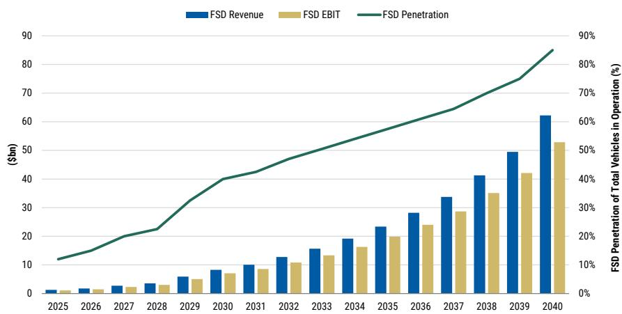
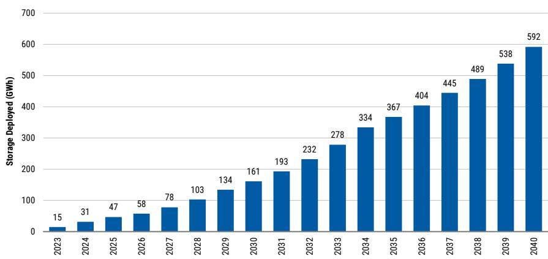

# MS：特斯拉北美研究回报路径与资本开支周期

特斯拉正在经历一个规模超出预期的资本开支扩张阶段。MS在最新报告中指出，管理层已明确未来2-3年资本开支将继续增长，而非此前市场预期的逐步回落。2026年资本开支指引超过250亿美元，2027年预计接近300亿美元，较此前预测的约200亿美元大幅上调。这一投入方向覆盖Robotaxi车队扩张、Optimus产能建设、半导体工厂、太阳能制造和AI算力，但自由现金流也因此进一步承压——2027年预计自由现金流消耗约140亿美元，而此前预测为50亿美元。

报告的核心判断是：这些研究在战略上必要，但ROI的实现需要时间和可验证的里程碑。市场对持续资本消耗的容忍度，将取决于Robotaxi能否在现有城市内展示出密度提升和安全数据积累，以及Optimus能否从实验室走向规模化生产。

## 1. FSD渗透率超预期，但Robotaxi商业化仍需密度与数据验证

FSD在北美新交付车辆中的选装率达到55%，远超MS此前估计的25-30%。这一数据表明，消费者购买特斯拉车辆的核心动机正在向自动驾驶功能倾斜。报告认为，这是特斯拉竞争护城河扩大的信号，并维持全球FSD渗透率在2030年达到40%、2040年达到80%的预测。

但Robotaxi的商业化进展仍处于早期验证阶段。特斯拉披露了累计38万英里的无人监督Robotaxi行驶里程，以及250万英里的付费Robotaxi行驶里程。公司称这些无人监督里程中未发生重大事故，这与MS跟踪的NHTSA数据基本一致。关键变量在于：每周无人监督里程正在以双位数百分比环比增长，公司预期这一增速将持续到年底。但报告强调，Robotaxi车队目前运行的是早期版本的v15 FSD软件，在Cybercab新底盘上的软件校准尚未完成，这意味着短期内车队规模扩张将受到限制。

> **KC评论：** 38万英里无人监督里程与250万英里付费里程之间的差距，反映出当前Robotaxi运营仍以安全员监督为主。真正需要关注的是每周无人监督里程的环比增速能否维持，以及v15软件在Cybercab上的验证进度——这两个指标决定了车队规模何时能进入指数级扩张阶段。

## 2. Optimus量产在即，但供应链复杂度制约初期爬坡速度

Optimus预计很快进入SOP（量产启动）阶段，但管理层在电话会上对供应链挑战给出了明确提醒。马斯克再次强调，构建尚不存在的供应链、设计具备足够灵活性的机械手、以及开发能执行通用任务的人形机器人技术，是当前三大核心难点。

报告维持对人形机器人长期市场空间的乐观判断，但对2020年代末之前的部署量保持保守估计。从供应链角度看，Optimus的初期爬坡速度可能低于市场预期，因为许多关键零部件需要定制化开发，而非从现有工业机器人供应链中直接采购。

## 3. 能源业务毛利率承压，但“Megapod”概念开辟新需求维度

能源业务在剔除一季度关税收益和二季度保修费用后，毛利率环比下降约300个基点至28%，主要原因是竞争加剧导致平均售价下降。管理层预计长期毛利率将压缩至20-25%区间，MS据此将2030年后的毛利率假设下调150个基点至23.5%。

值得关注的是，特斯拉披露了“Megapod”设计——将AI4计算与x86计算集成在一个可运输的机柜中，可部署在任何有电力的位置，包括特斯拉超充网络（约7GW且仍在增长）。这一概念将分布式电力与分布式推理相结合，可能为Megapack创造新的需求场景。报告认为，这不仅是储能业务的延伸，更是特斯拉将AI计算能力与能源基础设施进行系统级整合的尝试。

## 4. 资本开支周期延长，市场对ROI的耐心将面临考验

管理层已明确表示，未来2-3年资本开支将继续增长，而非此前市场预期的见顶回落。除了已披露的250亿美元2026年指引外，公司还在机会性地获取债务融资安排，提供高达300亿美元的借款能力以加速研究。这意味着，即使考虑运营现金流和在手现金，自由现金流在2027年底前仍将处于深度负值区间。

，主要反映更高的资本开支和更差的现金流状况。但报告同时指出，长期估值框架未发生根本变化——核心汽车业务、网络服务、出行服务、能源和人形机器人五个DCF模块的假设基本维持。当前估值的关键分歧点在于：市场愿意为这些远期期权支付多少溢价，以及管理层能否在接下来几个季度提供足够透明的进展证据。

> **KC评论：** 报告对资本开支的上调幅度（2027年从200亿到300亿美元）是估值调整的核心驱动。这不仅仅是数字变化，更意味着特斯拉的战略优先级从“盈利改善”转向“研究扩张”。对于关注特斯拉的读者而言，接下来需要跟踪的指标不再是季度交付量，而是Robotaxi每周无人监督里程增速、Cybercab软件验证进度，以及Optimus供应链的实质性突破。

For informational purposes only. Portions may be generated,translated,summarized,or edited with AI assistance based on source materials and may contain omissions or errors. Please verify independently. This is not investment,legal,tax,accounting,or other professional advice.

For informational purposes only. Portions may be generated,translated,summarized,or edited with AI assistance based on source materials and may contain omissions or errors. Please verify independently. This is not investment,legal,tax,accounting,or other professional advice.

