# 亚洲（除中国外）信贷增长观察：驱动因素与区域表现

随着非科技领域资本支出和出口的回升，劳动力市场状况的改善正在推动家庭贷款增长。

在资本支出持续扩张的背景下，亚洲（除中国外）的银行信贷增长保持强劲。

本报告将探讨哪些领域和地区正在推动亚洲（除中国外）信贷增长的加速。

图表1：亚洲（除中国外）信贷增长处于18年高位  
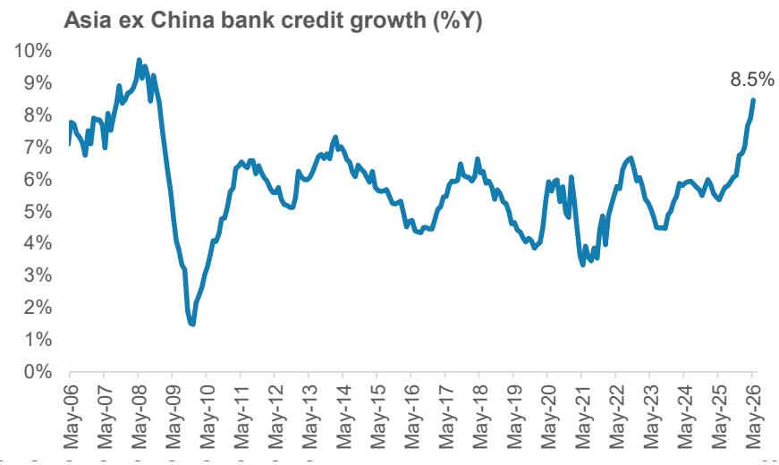  
来源：CEIC, Haver, MS，注：我们使用以美元计价的年度名义未偿还银行信贷进行加权计算亚洲（除中国外）总量。

## 详情

银行信贷仍是迄今为止最重要的宏观融资来源：在亚洲，考虑到公司债券和私募信贷市场尚未成熟，银行业仍然是信贷最重要的提供方之一。在新兴亚洲经济体中，银行和非银行金融公司占商业部门资源流动的60%以上。除内部积累外，宏观融资来源的顺序首先是银行及非银行金融部门的贷款，其次是股权融资（规模远小于前者），再次是规模更小的公司债券发行。

## 是什么推动了强劲的信贷需求？

自2000年代以来较强劲的信贷增长：截至5月26日，亚洲（除中国外）名义信贷增长加速至8.5%，为18年来的最高水平。按实际值计算（以GDP平减指数调整），亚洲（除中国外）的信贷增长也上升至6.3%，同样为18年高位。这种增长具有广泛基础，多个经济体的信贷增长均达到周期性高点。

我们认为有三个关键驱动因素支撑了这一加速：

1. 资本支出活动和贸易蓬勃发展——推动工业生产增长接近2000年代以来的高点：正如我们一直强调的，亚洲正进入自2000年代以来较强劲的工业周期。这得益于人工智能及相关数字基础设施、能源、国防和工业供应链等领域持续多年的资本支出增长。我们偏好的跟踪资本支出动能的高频指标——资本品进口增长——在5月继续加速至33%（3个月移动平均），为2004年以来最高。出口动能也从半导体出口进一步扩大，资本品和中间品也持续回升。反映出口和资本支出的强劲表现，亚洲名义工业生产在5月也达到18年高点12.5%。

2. 生产者价格指数上涨增加了营运资金需求：亚洲（除中国外）生产者价格指数已升至9.0%的四年高点，原油和更广泛的大宗商品价格上涨推高了商品类生产者价格指数。上游价格上涨和需求状况改善已开始传导至下游领域的出厂价格。反映这一趋势，亚洲（除中国外）非商品类生产者价格指数也升至4.3%的三年半高点。随着实际活动回升和通胀推高亚洲（除中国外）名义工业生产增长，价格压力反过来增加了整个供应链和终端用户的营运资金贷款需求。

3. 非科技领域资本支出和出口助力就业创造，消费信贷需求也在回升：我们此前曾指出，由于科技出口在总出口中占比较小且属于资本密集型，其对劳动力市场的正向溢出效应有限。然而，随着复苏范围扩大到非科技领域的资本支出和出口，我们开始看到整体就业创造有所提升，这正开始提振消费和消费信贷需求。事实上，随着亚洲（除中国外）零售销售增长近几个月有所改善，家庭贷款增长也有所上升，但仍处于历史区间内。

图表2：亚洲（除中国外）信贷增长加速至8.5%，为18年最高  
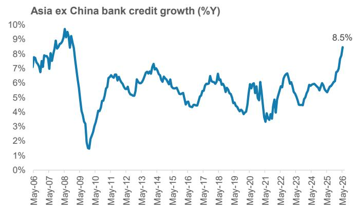  
来源：CEIC, Haver, MS，注：我们使用以美元计价的年度名义未偿还银行信贷进行加权计算亚洲（除中国外）总量。

图表3：与此同时，中国因其逆周期增长模式，杠杆率正在放缓  
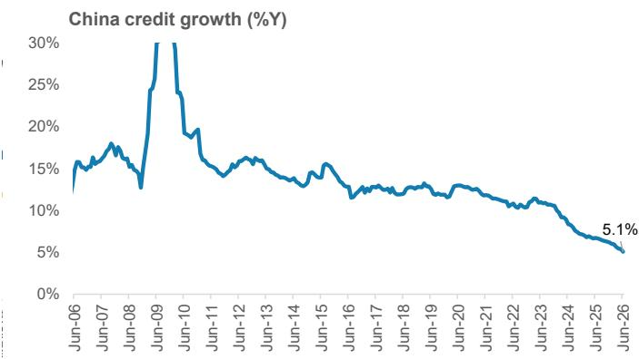  
图表4：实际银行信贷增长（以GDP平减指数调整）也处于2008年以来最高水平  
来源：CEIC, Haver, MS

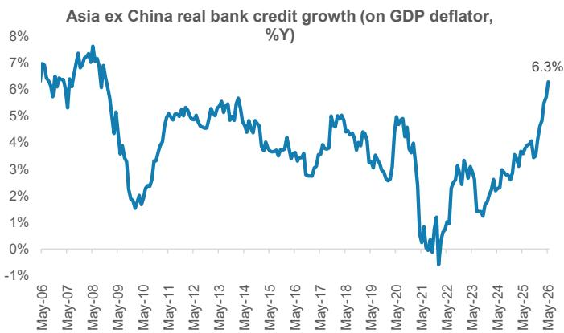

来源：CEIC, Haver, MS，注：实际信贷增长通过名义信贷增长经GDP平减指数调整计算。对于韩国和台湾，2025年平均GDP平减指数用于1-5月26日，因为已公布的1Q26平减指数受半导体价格大幅上涨影响显著提升。对于其余经济体，由于数据可得性问题，1Q26 GDP平减指数用于4月26日和5月26日。信贷增长以本币计算。我们使用以美元计价的年度名义未偿还银行信贷进行加权计算亚洲（除中国外）总量。

图表5：名义工业生产增长也升至2008年以来最高水平（剔除新冠基数效应），增加了企业信贷需求  
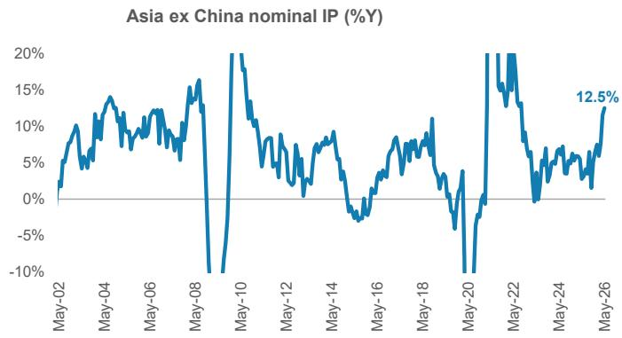  
来源：CEIC, Haver, MS，注：名义工业生产通过将生产者价格指数增长与实际工业生产增长相加计算。对于印度，使用批发价格指数。

## 哪些领域在增长？

企业部门信贷需求引领周期：就目前而言，本轮周期主要由资本支出驱动，企业信贷需求增速快于家庭贷款。企业贷款增长已加速至18年最高水平。这也因为银行信贷仍是亚洲企业部门最大的债务融资来源，公司债券市场尚不如美国成熟。根据经合组织的数据，亚洲经济体非金融企业的债务证券平均仅占总债务的14%。

图表6：银行信贷仍是亚洲企业部门最大的债务融资来源  
  
来源：OECD亚洲资本市场报告, MS

图表7：工业和资本支出超级周期推动企业部门信贷需求  
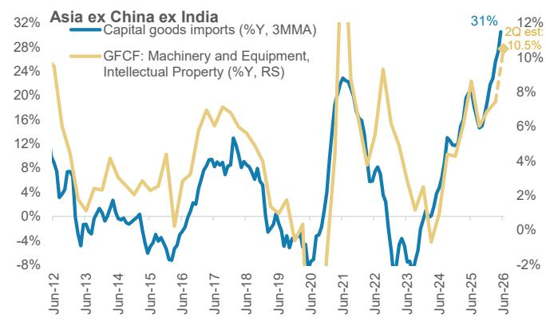  
来源：CEIC, Haver, MS估计

家庭贷款也在复苏：随着出口和资本支出周期对劳动力市场条件的正向溢出效应逐步显现，以及能源相关不利因素逐渐缓解，亚洲（除中国外）的消费动能近几个月显示出改善迹象——由印度、韩国、台湾以及一定程度上日本引领。亚洲（除中国外，不含印度）的零售销售年初至今平均增长4%，而2025年为2.8%；印度的车辆登记（消费代理指标）在6月继续录得两位数增长。因此，家庭贷款增长在2025年9月触底于5.6%，并逐步改善至5月26日的6.6%，但仍处于历史区间内。

图表8：家庭贷款也在复苏  
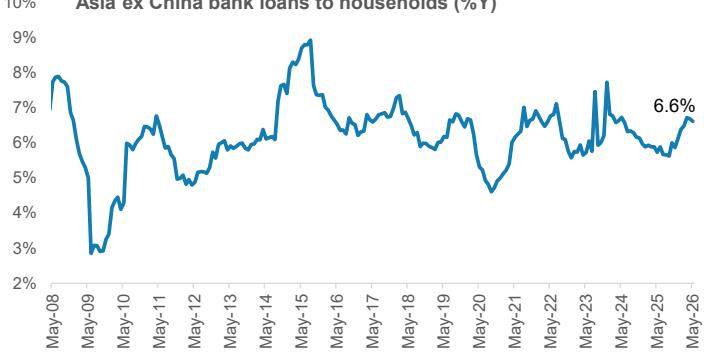  
来源：CEIC, Haver, MS

# 哪些亚洲（除中国外）经济体增长最为强劲？

亚洲（除中国外）广泛复苏：印度、日本、新加坡、香港、澳大利亚和台湾的贷款增长加速最为显著。韩国是一个例外，因为企业资本支出主要来自内部积累。泰国是该群体中相对少见信贷增长疲弱的经济体，原因是复苏不均衡，家庭继续去杠杆。

图表9：亚洲（除中国外）贷款增长广泛回升

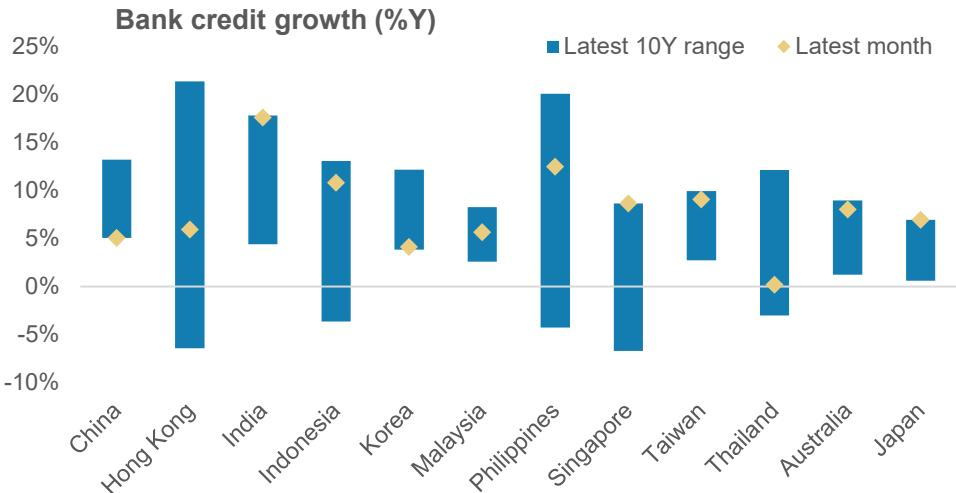  
来源：CEIC, Haver, MS

印度：自2025年下半年以来国内需求状况持续强劲、近几个月批发价格指数上升以及印度储备银行自2025年以来的监管放松措施，意味着信贷增长已加速至2009-2012年以来较强水平。增长在各领域具有广泛基础，但企业部门尤为突出——5月增长至18.3%，为2012年以来最高。家庭贷款增长也连续第四个月保持在15%以上，部分受益于印度储备银行监管放松背景下无担保个人贷款增长的复苏。此外，非银行金融公司零售贷款增长也加强至19.5%（2025年5月为14.9%）。我们预计整体信贷需求将保持强劲，受资本支出和出口增长支撑，家庭贷款增长将得到住房和可选消费强劲表现的支持。

日本：贷款增长已加速至1999年（有数据可查）以来7%的新高。其中，企业贷款增长在5月显著回升至8.4%，推高了整体贷款增长。展望未来，我们的日本金融业分析师Mia Nagasaka继续预计日本银行的贷款增长将改善，因为企业资本支出需求、供应链重建和数字化转型支出为资金需求提供了支撑。她预计健康的资产质量和充足的储备能力将使信贷成本保持在可控水平。

韩国：韩国的信贷增长保持温和。虽然资本支出增长强劲，但主要由现金流充裕的大型企业驱动，因此这些资本支出主要通过内部积累融资。在宏观层面，韩国强劲的出口增长将其经常账户盈余推高至GDP的9.1%，为1998年以来最高。我们的韩国金融业分析师Joon Seok指出，信贷增长将继续主要由企业部门驱动，因为家庭贷款增长将受到政策限制，该政策为家庭贷款设定了1.5%的年增长上限。

印度尼西亚：整体贷款增长自2025年7月触底以来一直在改善，但大体仍处于历史区间内。值得注意的是，推动贷款增长改善的关键因素是投资贷款。这反过来得到了向乡村合作社提供贷款的支持。换句话说，贷款增长是由政策推动而非私营部门驱动。与此同时，消费贷款增长在疲弱情绪下继续减速。鉴于缺乏私营资本支出周期、加息的传导效应以及流动性状况紧张，我们的印度尼西亚金融业分析师Selvie Jusman预计贷款增长将趋于稳定。

澳大利亚：整体贷款增长在5月强劲，达到8%，由企业贷款增长9.5%和家庭贷款增长6.7%驱动。然而，鉴于住房相关贷款在澳大利亚银行贷款总额中占比较大，住房市场前景对整体贷款增长有显著影响。在此背景下，我们的澳大利亚经济学家Chris Read认为，负扣税和资本利得税的变化从根本上改变了澳大利亚房地产的研究逻辑。他预计全国房价将下跌5-10%，原因是利率、税收和经济放缓带来的不利因素。由于住房信贷增长通常滞后房价约6个月，信贷增长应会延迟放缓。我们的澳大利亚银行分析师Richard Wiles预计，系统抵押贷款增长将在FY27放缓至3%，而目前为6%。

香港和新加坡：香港和新加坡的贷款增长也在回升，正如我们的香港和东盟金融业分析师Nick Lord所指出的，这得益于非居民或跨境贷款。多个领域的企业贷款持续保持正增长，证实了强劲的资本支出和贸易活动可能是关键驱动因素。在香港，我们的房地产分析师Praveen Choudhary认为市场复苏将持续并扩大到写字楼和零售领域。这也应有助于支撑2026年下半年的整体贷款增长。

图表10：国内需求持续强劲、批发价格指数上升以及印度储备银行的监管放松措施，意味着信贷增长已广泛加速至2009-2012年以来较强水平  
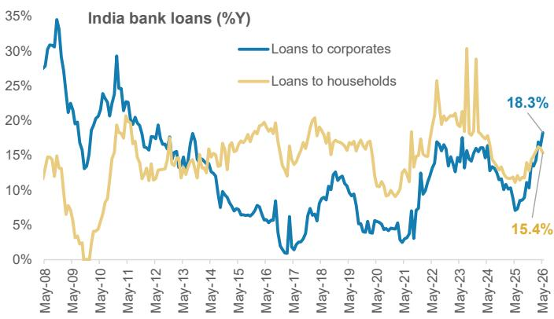  
来源：CEIC, Haver, MS

图表11：在日本，企业贷款增长在5月回升至8.4%，推高了整体贷款增长  
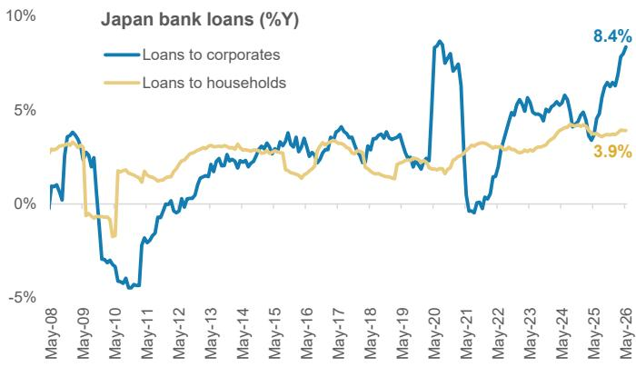  
来源：CEIC, Haver, MS

图表12：在韩国，企业贷款增长正在复苏，而家庭贷款增长受到1.5%年增长上限的约束  
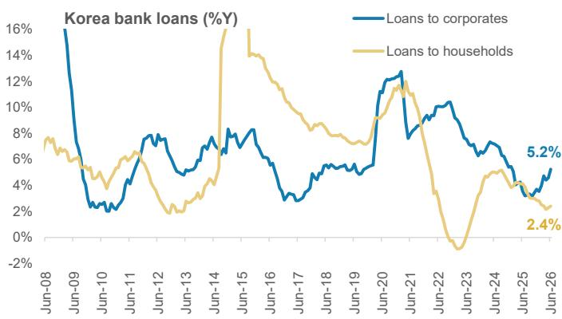  
来源：CEIC, Haver, MS

图表13：在印度尼西亚，贷款增长加速由政策指令而非私营部门需求驱动  
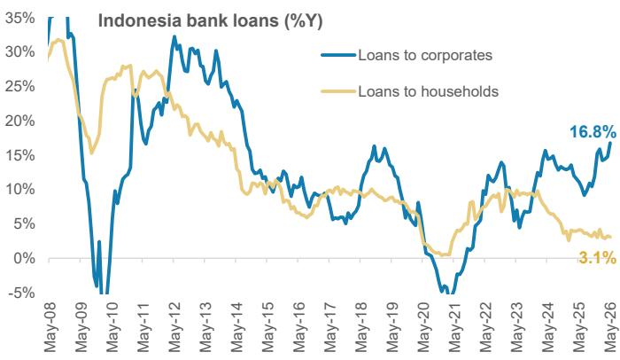  
来源：CEIC, Haver, MS

图表14：在澳大利亚，住房税收政策变化将继续对整体贷款增长产生影响  
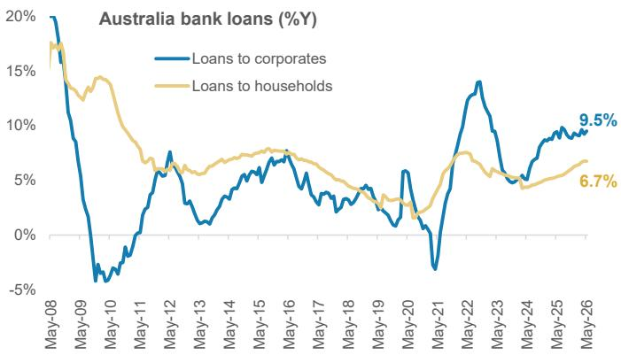  
来源：CEIC, Haver, MS

图表15：香港贷款增长更多由贸易融资和用于香港以外的贷款驱动  
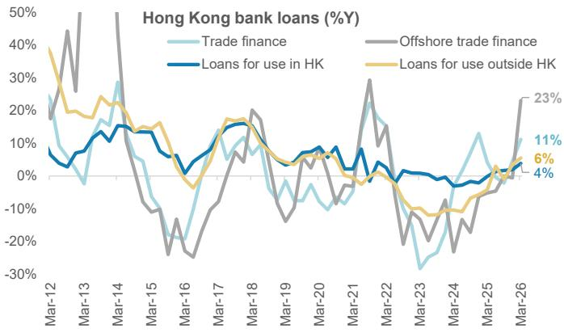  
来源：CEIC, Haver, MS

图表16：同样，对非居民的贷款是新加坡整体贷款增长的更大驱动力  
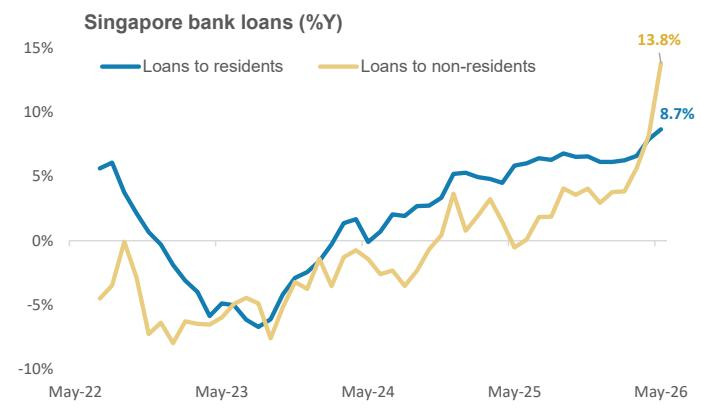  
来源：CEIC, Haver, MS

图表17：马来西亚企业信贷强劲增长  
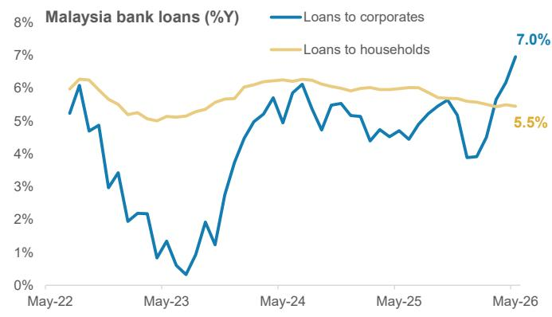  
来源：CEIC, Haver, MS

# 中国——信贷增长为何减速？

逆周期增长模式在发挥作用：多年来，中国一直以逆周期方式管理其增长模式，与出口趋势形成对比。此外，自新冠疫情以来公共债务以及总债务的显著上升意味着政策制定者希望利用出口强劲带来的机会退出政策刺激（即降低杠杆）。我们的中国金融业分析师Richard Xu指出，“向更可持续债务增长的转型仍在进行中”。

图表18：家庭部门引领贷款增长放缓，企业贷款随后放缓  
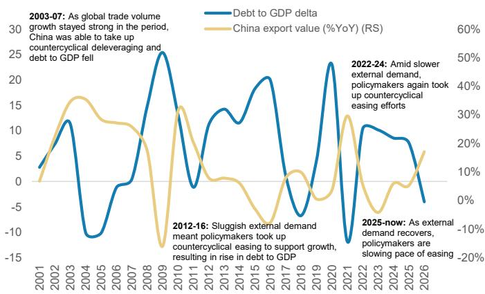  
来源：CEIC, Haver, MS

图表19：在中国，逆周期增长模式导致信贷增长放缓  
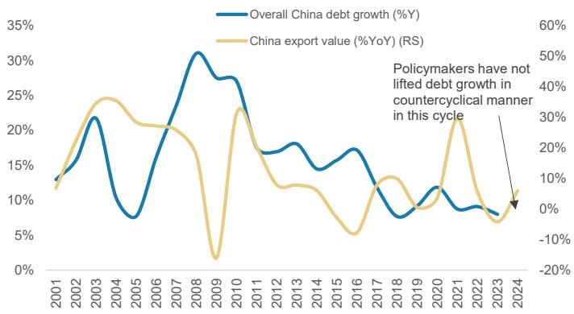  
来源：CEIC, Haver, MS

家庭部门引领放缓，企业部门紧随其后：中国整体贷款增长从2025年12月的6.2%进一步减速至2026年6月的5.1%。社会融资总额也反映了这一趋势，同期从8.5%减速至7.5%。在贷款内部，低迷的房地产市场意味着抵押贷款是最弱的领域。此外，鉴于通缩压力和工资增长动能不足，消费者也在削减非抵押零售贷款。最后，工业贷款增长表现优于家庭贷款增长。在此背景下，我们预计出口增长将保持强劲，而整体贷款增长可能保持缓慢但结构会发生变化。贷款增长中放缓的部分将与房地产领域相关，但对高增长领域——例如人工智能和能源——以及制造业新兴前沿领域的信贷增长将保持相对强劲。关于这一主题的更多内容，请参阅我们的中国首席经济学家Robin Xing撰写的《中国思考：政治局——政策偏好：科技资本支出优于消费》。

## 展望

多年资本支出超级周期将支撑信贷增长：我们预计整体信贷增长将保持强劲，受到当前资本支出超级周期动能的支撑。虽然实际活动将保持稳健，但我们预计名义信贷增长将自然放缓，因为生产者价格指数通胀可能会随着油价下行而走低。此外，我们也预计消费贷款将进一步回升，因为非科技领域资本支出和出口的复苏有助于支持就业创造。

## 披露部分

MS中的信息和意见由以下一家或多家机构编制或传播，并对其内容负责：MS Asia Limited、MS Asia (Singapore) Pte.（注册号199206298Z）、MS Asia (Singapore) Securities Pte Ltd（注册号200008434H，受新加坡金融管理局监管，应就与MS相关的任何事宜联系该机构）、MS Taiwan Limited、MS & Co International plc首尔分行、MS Australia Limited（ABN 67 003 734 576，持有澳大利亚金融服务牌照号233742）、MS Wealth Management Australia Pty Ltd（ABN 19 009 145 555，持有澳大利亚金融服务牌照号240813）、MS India Company Private Limited（公司识别号U22990MH1998PTC115305，受印度证券交易委员会监管，持有研究分析师、股票经纪人、商人银行家和存管参与人牌照，注册地址为Altimus, Level 39 & 40, Pandurang Budhkar Marg, Worli, Mumbai 400018, India；电话+91-22-61181000；合规官：Tejarshi Hardas先生，电话+91-22-61181000或电邮tejarshi.hardas@morganstanley.com；申诉官：Tejarshi Hardas先生，电话+91-22-61181000或电邮msic-compliance@morganstanley.com）及其关联公司（统称"MS"）。MS India Company Private Limited可能在提供研究服务时使用AI工具。本文所含所有建议均由合格研究分析师做出；有关重要披露、股价图表和本报告所涉公司的股权评级历史，请访问MS披露网站www.morganstanley.com/eqr/disclosures/webapp/generalresearch，或联系您的投资代表或MS，地址：1585 Broadway, (Attention: Research Management), New York, NY, 10036 USA。

有关本研究报告引用的任何建议、评级或目标价的估值方法和风险，请联系客户支持团队：美国/加拿大+1 800 303-2495；香港+852 2848-5999；拉丁美洲+1 718 754-5444（美国）；伦敦+44 (0)20-7425-8169；新加坡+65 6834-6860；悉尼+61 (0)2-9770-1505；东京+81 (0)3-6836-9000。或者您也可以联系您的投资代表或MS，地址：1585 Broadway, (Attention: Research Management), New York, NY 10036 USA。

## 全球研究冲突管理政策

MS已按照我们的冲突管理政策发布，该政策可在www.morganstanley.com/institutional/research/conflictpolicies查阅。该政策的葡萄牙语版本可在www.morganstanley.com.br找到。

## 重要披露

MS不担任市政顾问，本文所载意见或观点无意也不构成《多德-弗兰克华尔街改革和消费者保护法》第975条所指的建议。

MS不提供量身定制的研究交流。MS的编制未考虑接收者的具体情况和目标。MS建议读者独立评估特定投资和策略，并鼓励读者寻求财务顾问的建议。投资或策略的适当性取决于读者的具体情况和目标。MS讨论的证券、工具或策略可能不适合所有读者，某些读者可能没有资格购买或参与部分或全部内容。MS不构成购买或出售任何证券/工具或参与任何特定交易策略的要约或要约邀请。您的研究价值和收入可能因利率、汇率、违约率、提前还款率、证券/工具价格、市场指数、公司的运营或财务状况或其他因素的变化而波动。期权或其他证券/工具交易权利的行使可能存在时间限制。过往表现不一定是未来业绩的指引。对未来业绩的估计基于可能无法实现的假设。如有提供且除非另有说明，封面上的收盘价是主题公司证券/工具主要交易所的价格。

主要负责编制MS的固定收益研究分析师、策略师或经济学家的薪酬基于多种因素，包括研究的质量、准确性和价值，公司盈利能力或收入（包括固定收益交易和资本市场盈利能力或收入），客户反馈和竞争因素。固定收益研究分析师、策略师或经济学家的薪酬不与MS进行的投资银行或资本市场交易或特定交易台的盈利能力或收入挂钩。

除有关MS的信息外，MS基于公开信息。MS尽一切努力使用可靠、全面的信息，但我们不保证其准确或完整。我们没有义务在MS中的意见或信息发生变化时通知您，除非我们打算停止对主题公司的股权研究覆盖。MS中提出的事实和观点未经MS其他业务领域的专业人士审查，可能不反映他们所了解的信息，包括投资银行人员。

MS可能做出与本报告中的建议或观点不一致的投资决策。

致我们在台湾的读者或交易台湾证券/工具的读者：有关在台湾交易的证券/工具的信息由MS Taiwan Limited分发。此类信息仅供参考。读者应独立评估投资风险，并自行负责投资决策。未经MS明确书面同意，MS不得向公共媒体分发或由公共媒体引用或使用。属于台湾证券交易所推荐规定第7-1条范围内的非客户读者访问和/或接收MS时，不得将MS提供给任何第三方（包括但不限于关联方、关联公司和任何其他第三方）或从事任何可能产生或看似产生利益冲突的与MS相关的活动。有关不在台湾交易的证券/工具的信息仅供参考，不得解释为建议或招揽交易此类证券/工具。MSTL可能不为客户执行这些证券/工具的交易。

MS未根据中国法律注册，与此报告相关的研究在中国境外进行。MS不构成在中国出售任何证券的要约或要约邀请。中国读者应具有投资此类证券的相关资格，并应自行负责从相关政府机构获得所有必要的批准、许可、验证和/或注册。本报告或其任何部分均不旨在也不构成中国法律定义的证券投资咨询或顾问服务。此类信息仅供您参考。

MS在巴西由MS C.T.V.M. S.A.分发，地址为Av. Brigadeiro Faria Lima, 3600, 6th floor, São Paulo - SP, Brazil；受Comissão de Valores Mobiliários监管；在墨西哥由MS México, Casa de Bolsa, S.A. de C.V分发，受Comision Nacional Bancaria y de Valores监管，地址为Paseo de los Tamarindos 90, Torre 1, Col. Bosques de las Lomas Floor 29, 05120 Mexico City；在日本由MS MUFG Securities Co., Ltd.分发，对于商品相关研究报告，由MS Capital Group Japan Co., Ltd分发；在香港由MS Asia Limited（对其内容负责）和MS Bank Asia Limited分发；在新加坡由MS Asia (Singapore) Pte.（注册号199206298Z）和/或MS Asia (Singapore) Securities Pte Ltd（注册号200008434H，受新加坡金融管理局监管，应就与MS相关的任何事宜联系该机构）以及MS Bank Asia Limited新加坡分行（注册号T14FC0118）分发；在澳大利亚向《澳大利亚公司法》定义的"批发客户"由MS Australia Limited ABN 67 003 734 576分发，持有澳大利亚金融服务牌照号233742，对其内容负责；在澳大利亚向《澳大利亚公司法》定义的"批发客户"和"零售客户"由MS Wealth Management Australia Pty Ltd（ABN 19 009 145 555，持有澳大利亚金融服务牌照号240813）分发，对其内容负责；在韩国由MS & Co International plc首尔分行分发；在印度由MS India Company Private Limited分发（公司识别号U22990MH1998PTC115305，受印度证券交易委员会监管，持有研究分析师、股票经纪人、商人银行家和存管参与人牌照，注册地址为Altimus, Level 39 & 40, Pandurang Budhkar Marg, Worli, Mumbai 400018, India；电话+91-22-61181000；合规官：Tejarshi Hardas先生，电话+91-22-61181000或电邮tejarshi.hardas@morganstanley.com；申诉官：Tejarshi Hardas先生，电话+91-22-61181000或电邮msic-compliance@morganstanley.com）。MS India Company Private Limited可能在提供研究服务时使用AI工具。本文所含所有建议均由合格研究分析师做出；在加拿大由MS Canada Limited分发；在德国和欧洲经济区（如需要）由MS Europe S.E.分发，受德国联邦金融监管局监管，参考号14-9169；在美国由MS & Co. LLC分发，对其内容负责。MS & Co. International plc受审慎监管局授权并由金融行为监管局和审慎监管局监管，在英国分发其编制的研究以及其任何关联公司编制的研究，仅面向以下人士：(i) 属于《2000年金融服务和市场法（金融促进）2005年令》（经修订，"该令"）第19(5)条规定的投资专业人士；(ii) 属于该令第49(2)(a)至(d)条规定的高净值实体；或(iii) 可以合法地传达或促使其传达从事投资活动（根据修订后的《2000年金融服务和市场法》第21条的含义）的邀请或诱因的人士。RMB MS Proprietary Limited是JSE Limited和A2X (Pty) Ltd的成员。RMB MS Proprietary Limited是由MS International Holdings Inc.和RMB Investment Advisory (Proprietary) Limited（由FirstRand Limited全资拥有）各占50%股权的合资企业。MS中的信息由MS Saudi Arabia分发，受沙特阿拉伯王国资本市场管理局监管，仅面向专业读者。

MS中包含的商标和服务标记是其各自所有者的财产。第三方数据提供商不对其提供的数据的准确性、完整性或及时性做出任何保证或陈述，并且不对与此类数据相关的任何损害承担责任。全球行业分类标准由MSCI和S&P开发并为其专有财产。

未经MS书面同意，MS或其任何部分不得转载、出售或再分发。

MS中引用的指标和跟踪器不得用作或被视为欧盟法规2016/1011或任何其他类似框架下的基准。

MS中的信息由MS & Co. International plc（DIFC分行）传达，受迪拜金融服务管理局监管；或由MS & Co. International plc（ADGM分行）传达，受阿布扎比金融服务监管局监管，仅面向专业客户（由迪拜金融服务管理局或阿布扎比金融服务监管局定义）。本研究所涉及的金融产品或金融服务仅会提供给我们认为符合专业客户监管标准的客户。按投资领域划分的MS研究评级或建议的百分比分布可向您的销售代表索取。

MS中的信息由MS & Co. International plc（QFC分行）传达，受卡塔尔金融中心监管局监管，仅面向商业客户和市场对手方，不面向卡塔尔金融中心监管局定义的零售客户。

根据土耳其资本市场委员会的要求，此处提供的投资信息、评论和建议不属于投资咨询服务的范围。投资咨询服务仅由授权公司根据个人的风险和收益偏好提供。此处的评论和建议具有一般性质。这些意见可能不适合您的财务状况、风险和收益偏好。因此，仅依赖此处提供的信息做出投资决策可能不会产生符合您预期的结果。

印度证券交易委员会的注册和国家证券市场研究所的认证绝不保证中介机构的业绩或为读者提供任何回报保证。证券市场投资存在市场风险。投资前请仔细阅读所有相关文件。

## © 2026 MS
