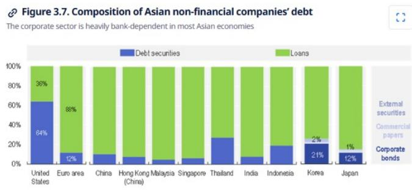

# 亚洲（除中国外）银行信贷规模升至18年高位，这并非周期性波动

自2000年代以来，亚洲（除中国外）较强劲的信贷增长并非暂时性现象。截至2026年5月，该地区名义银行信贷增速同比加快至8.5%，为18年来最高水平。按实际值计算（以GDP平减指数调整），信贷增速同比达到6.3%，同样创下18年新高。这一现象发生在该地区最大经济体中国主动放缓自身信贷扩张的背景下。这种分化是结构性的，而非季节性，要求任何关注亚洲市场的机构进行战略性重新评估。

推动这一加速增长的动力并非以往周期中常见的消费驱动型复苏。相反，当前的扩张建立在一个持续多年的资本支出超级周期之上，涵盖人工智能基础设施、能源、国防和工业供应链等领域。资本品进口——衡量资本支出动力的高频指标——在5月的三个月移动平均同比增速达到33%，为2004年以来最快。出口动力已从半导体扩展到资本品和中间品。亚洲（除中国外）的名义工业生产同比增速达到12.5%，同样为18年高位。

对于研究者和策略制定者而言，关键问题已不再是信贷增长是否在加速，而是哪些领域、地区和市场机制将维持这一动力，哪些可能减弱。答案在于理解当前同时运行的三个不同驱动因素。

## 资本支出超级周期是主要引擎，推动企业信贷需求升至18年高位

企业贷款增速已加快至18年来最快水平，这是当前周期中最重要的结构性变化。与以往由家庭信贷引领的复苏不同，当前的扩张由企业投资性借贷驱动。这一点之所以重要，是因为企业信贷比消费信贷波动性更小，且对银行资产负债表和经济产出的积极影响往往持续时间更长。

其机制较为直接。亚洲银行业仍是企业债务融资的主要来源。该地区的企业债券市场尚不成熟——根据经合组织数据，亚洲经济体中非金融企业的债务证券仅占总债务的14%。当公司需要为资本支出融资时，它们会求助于银行。而目前，大量公司正在这样做。

资本支出超级周期本身具有广泛基础。人工智能和数字基础设施支出是支柱之一。能源投资是另一支柱。国防支出和工业供应链重构进一步增添了动力。资本品进口数据证实，这并非狭隘的行业性繁荣，而是区域性的投资热潮。对于关注银行的研究者而言，这意味着在可预见的未来，除非全球需求急剧逆转或出现政策冲击，企业贷款组合将继续以高于趋势的速度扩张。

## 生产者价格指数上升正在创造第二个不那么明显的需求驱动因素：营运资金贷款

第二个驱动因素更为微妙，但同样强大。受石油和大宗商品价格上涨推动，亚洲（除中国外）的生产者价格指数同比涨幅已升至9.0%，为四年高位。关键的是，这种上游价格压力正在向下游领域传导。非大宗商品的生产者价格指数同比涨幅达到4.3%，为三年半高位。

与信贷需求的联系在于营运资金。当生产者价格上涨时，供应链上的公司需要更多融资来维持相同水平的实际活动。库存成本增加，应收账款名义值增长，现金流出与流入之间的差距扩大。这产生了对短期银行信贷的自然需求，这种需求在很大程度上独立于资本支出周期。

这意味着，即使实际工业生产增长趋于稳定或放缓，只要生产者价格指数保持在趋势水平之上，名义信贷需求就可能保持高位。这并非暂时的会计现象，而是对银行中介服务的真实需求，将持续到价格周期转向。对于信贷分析而言，风险不在于生产者价格指数下降，而在于其保持足够高的水平以维持营运资金需求，同时又不触发央行收紧政策，从而抑制更广泛的扩张。

## 复苏向非科技出口领域扩展，终于开始提振家庭信贷，但增幅仍在历史范围内

第三个驱动因素是最新出现的，也是最不确定的。在本轮周期的大部分时间里，科技出口主导了复苏叙事，但它们对就业的影响有限。科技出口是资本密集型的，在大多数亚洲经济体总出口中所占份额相对较小。对劳动力市场的溢出效应较弱。

这种情况正在改变。随着复苏向非科技资本支出和非科技出口领域扩展，就业创造正在回升。截至2026年5月，亚洲（除中国外，不含印度）的零售销售年初至今平均增长4%，高于2025年全年的2.8%。印度的车辆注册量（消费代理指标）在6月继续录得两位数增长。家庭贷款增速在2025年9月触底于5.6%，此后已回升至2026年5月的6.6%。

这里的要点是，家庭信贷正在复苏，但尚未繁荣。6.6%的增速仍在历史范围内。这不是一个消费主导的信贷周期，而是一个企业主导、消费滞后跟随的周期。对于关注银行的研究者而言，机会在于拥有强大企业贷款业务能力的机构。对于宏观策略师而言，风险在于家庭信贷加速过快，迫使央行收紧政策，但这一情景尚未在数据中显现。

## 决策框架：哪些经济体受益，哪些没有

信贷增长的区域差异与总体趋势同样重要。印度、日本、新加坡、香港、澳大利亚和台湾的增速最为显著。韩国是一个例外——企业资本支出强劲，但主要依靠内部资金，家庭贷款增长受到1.5%同比增速的政策上限约束。泰国是该集团中相对少见信贷增长疲弱的经济体，原因是家庭持续去杠杆。

对于决策者而言，框架应围绕三个变量构建：是否存在真正的私营部门资本支出周期、企业投资通过银行债务融资与内部现金流融资的程度，以及家庭贷款的政策环境。

印度在这三个变量上得分都很高。受持续的内需、批发价格通胀上升以及印度储备银行监管放松的推动，信贷增速已加快至2009-2012年以来的较强水平。5月企业贷款同比增长18.3%，为2012年以来最高。家庭贷款增速已连续四个月保持在15%以上。这是广泛的基础性增长，而非单一行业的故事。

日本得分也较高。贷款增速达到7%的新高，为至少1999年以来最快。5月企业贷款增长8.4%是主要驱动力，受到资本支出需求、供应链重建和数字化转型支出的支持。只要这些结构性趋势持续，前景依然积极。

新加坡和香港呈现出不同的模式。贷款增速正在回升，但驱动力是非居民或跨境贷款，而非内需。这使得信贷增长更依赖于全球贸易和资本流动，而非本地经济状况。这对贸易融资而言是积极信号，但对地缘政治和贸易政策变化的敏感性更高。

韩国和印度尼西亚是需要谨慎关注的案例。韩国强劲的出口表现产生了占GDP 9.1%的经常账户盈余，为1998年以来最高，但这减少了对外部融资和内部借贷的需求。企业资本支出由现金流而非银行贷款提供资金。家庭贷款受到政策的人为限制。结果是尽管经济活动强劲，但信贷增长疲软。印度尼西亚的贷款增速自2025年中期以来有所改善，但驱动力是向乡村合作社的政策导向贷款，而非私营部门需求。没有真正的私人资本支出周期，这种改善的可持续性存疑。

澳大利亚的前景因住房政策而变得复杂。对负扣税和资本利得的税收改革预计将导致全国房价下跌5-10%。住房信贷增长通常滞后于房价约六个月，因此抵押贷款放缓的可能性较大。系统抵押贷款增速预计将从目前的6%放缓至2027财年的3%。对于澳大利亚的银行而言，这是一个不利因素，将部分抵消企业贷款的强劲表现。

因此，决策框架并非押注亚洲（除中国外）作为一个整体，而是识别哪些经济体拥有真正的私营部门资本支出周期，哪些依赖政策驱动贷款，以及哪些面临来自住房或家庭去杠杆的结构性阻力。较强的机会在印度和日本。最需谨慎的立场应在韩国、印度尼西亚和澳大利亚与住房相关的贷款领域。

*仅供参考。部分内容可能基于源材料通过人工智能辅助生成、翻译、总结或编辑，可能存在遗漏或错误。请独立核实。本文不构成任何专业建议。*

仅供参考。部分内容可能基于源材料通过人工智能辅助生成、翻译、总结或编辑，可能存在遗漏或错误。请独立核实。本文不构成任何专业建议。

