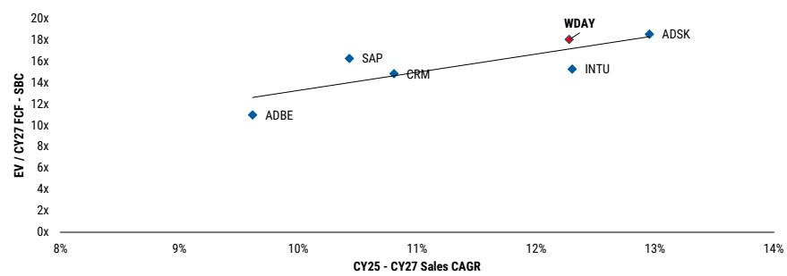
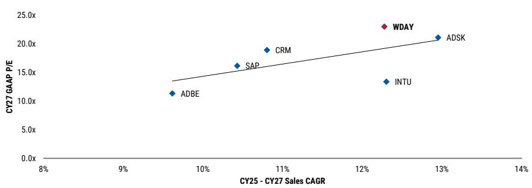
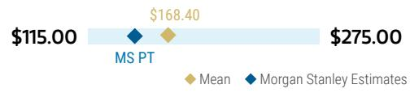
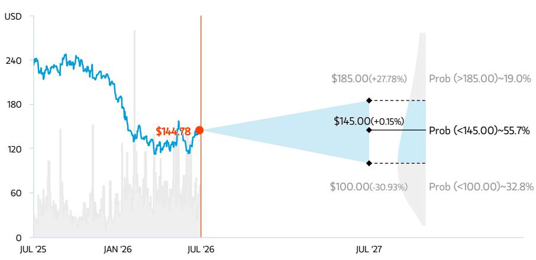
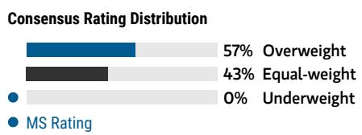
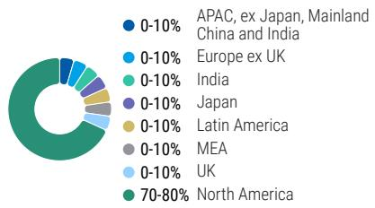
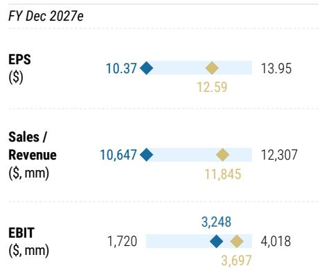

e = MS estimates

# 稳固护城河，但AI进程尚需时日；调整评级

<table><tr><td colspan="3">变化摘要</td></tr><tr><td>Workday Inc (WDAY.O)</td><td>原评级</td><td>现评级</td></tr><tr><td>评级</td><td>中性</td><td>低配</td></tr><tr><td>目标价</td><td>$185.00</td><td>$145.00</td></tr></table>

尽管WDAY在我们的护城河框架中得分较高，且后台存在巨大的自动化机会，但实现AI加速的进程仍需时间。在增长与利润率路径不确定、缺乏积极催化因素，以及基于CY27 GAAP市盈率23倍的情况下，我们认为其相对于同业存在更多下行空间。

## 核心要点

我们将Workday评级下调至低配，原因是AI货币化进程尚早，不足以抵消核心业务增长的放缓。

管理层此前提出的增长与利润率框架的退出，给盈利前景带来了更大的不确定性。

尽管Workday拥有强大的护城河，但我们预计，与我们所覆盖的其他公司相比，其由AI驱动的收入加速增长所需时间会更长。

■ 后台AI自动化是一个重要的机会，但合规与治理要求可能会减缓其采用速度。

基于CY27 GAAP市盈率23倍，我们认为Workday相对于具有类似增长特征的同业而言，估值偏高。

通过本报告，Adam Wood开始负责对WDAY的覆盖，给予低配评级，目标价为145美元。

## 基于三个关键点下调至低配：

1. AI货币化尚处于早期阶段，难以将其视为短期增长驱动力。最紧迫的问题是核心业务增长的持续放缓，这在很大程度上是由于HCM和FINS内部情况透明度有限，同时AI货币化仍处于试点阶段。HCM增长在FY26已放缓至13%，我们预计HCM的同比增长率将持续下降至FY28/CY27的9%。尽管FINS仍保持20%的较高增长，但FY28期间整体订阅收入12-13%的年复合增长率意味着Workday的整体市场份额基本持平（HCM份额下降，而FINS份额上升）。管理层自身也承认，FY27第一季度受益于第四季度交易的延迟，而FY27下半年新ACV增长的可持续性仍是关键考验。在采用范围超越试点和定向部署之前，我们和读者都很难将AI视为短期的增长加速器。

2. 先前的分析师日框架已不再适用，导致短期方向不明。读者此前所依据的先前中期运营框架现已明确被弃用。管理层指出，近期的利润率扩张速度将慢于此前沟通的水平，并表示将在下一次分析师日更新增长和“滑动比例”利润率框架。这恰恰在最不合适的时机给中期前景注入了显著的不确定性。FY27的GAAP运营利润率预计将比非GAAP利润率（30.5%）低约18-19个百分点，这一差距对于关注GAAP盈利能力的读者而言，始终是一个持续的隐忧。鉴于这一潜在的利润率框架变化，我们认为利润率/盈利预测相对于当前市场共识存在下行风险。缺乏清晰的框架也使得读者难以锚定预期。

3. 估值相对于增长相似的同业仍然偏高。运用我们新的分块估值框架，Workday的估值应基于EV/剔除股权激励后的自由现金流以及GAAP市盈率，与同样成熟且规模化的同业（CRM、INTU、SAP、ADBE、ADSK）进行比较。Workday目前交易于CY27 GAAP市盈率23倍，显著高于ADSK的20倍、CRM的18倍、SAP的16倍、INTU的13倍以及ADBE的11倍。在剔除股权激励后的自由现金流基础上，其估值也处于溢价状态。因此，我们认为Workday相对于同业存在估值倍数下行的风险。

强大的护城河，但前路漫长。尽管存在巨大的潜在市场机会、一流的客户留存率以及不断增长的产品组合，但我们看到过去几年市场对增长的预期持续恶化，导致读者担忧增长将持续承压。而现在随着AI的出现，Workday的定位和未来增长路径的不确定性进一步增加。运用我们行业洞察中的新“护城河与旅程”框架，我们最终认为Workday因其强大的护城河而定位良好，但从时间角度来看，AI开始推动有意义的增长加速仍需时日，因此相对而言，我们覆盖范围内目前存在更具吸引力的机会。

在护城河方面，Workday在我们覆盖的公司中护城河强度排名第9，原因在于：1）它是核心记录系统；2）具有监管/合规/法律引力；3）拥有专有数据/上下文。该平台每年为超过11,500家客户处理超过1万亿笔交易，其中包括超过65%的财富500强企业，以及8000万签约用户。这一专有数据集难以复制，并为Workday的AI模型提供了通用大语言模型无法比拟的特定场景优势。总收入留存率保持在97%，该平台在关键任务的人力资源和财务工作流程中的嵌入性，创造了企业软件中最高的转换成本之一。

AI的旅程需要时间。Workday的AI投资何时能转化为持久的收入加速增长，是读者争论的核心，我们认为我们覆盖范围内还有其他公司拥有比Workday更快的AI进程。虽然我们看好后台自动化这一唾手可得的机会——这是组织在数字化转型中历来忽视的领域——但人力资源和财务终端市场通常更为规避风险，我们预计在买家完全接受并规模化采用AI之前，需要更长的准备时间。

后台自动化机会真实存在，但时机受合规性制约。更具体地说，大多数组织的薪资、合规、财务结算和劳动力规划仍然高度依赖人工。我们已就后台自动化的巨大机会撰写了多份报告。Workday基于角色的智能体正是为这些工作流程量身定制的：招聘智能体可为招聘人员带来高达50%的生产力提升，并将招聘时间缩短40%；合同智能体可将合同执行时间缩短65%；自助服务智能体在早期部署中已将人力资源案例量减少25%，并将员工生产力提升20%。挑战在于，Workday所运营的市场（人力资源和财务）恰恰是合规性、可审计性和监管准确性至关重要的领域。这是一把双刃剑。一方面，它强化了Workday的护城河：定义关键流程（从人员管理到财务结算）中政策合规性和正确性的确定性业务流程逻辑，是只有Workday才能大规模提供的。另一方面，这意味着企业级的智能体部署需要一定程度的治理、测试和监管审批，这大大延长了决策周期。我们的渠道调研证实了这一点：客户正在沙盒中测试智能体，但对概率性输出和法律责任仍存在未解决的担忧。后台自动化浪潮即将到来，但合规和监管的门槛意味着它不是一个短期的催化剂。

图表1：Workday在护城河方面得分较高，但其在旅程时间上的位置更为延展

<table><tr><td colspan="3">软件公司AI就绪度：护城河 vs 旅程评分</td></tr><tr><td></td><td>平均分</td><td>平均护城河评分</td></tr><tr><td>MID</td><td>24.0</td><td>23.5</td></tr><tr><td>CMR</td><td>24.0</td><td>23.5</td></tr><tr><td>DOOR</td><td>24.0</td><td>23.5</td></tr><tr><td>COUR</td><td>24.0</td><td>23.5</td></tr><tr><td>DOOR</td><td>24.0</td><td>23.5</td></tr></table>

来源：MS

将目标价下调至140美元。鉴于软件行业当前的新格局，我们运用行业洞察中的新分块估值框架来调整Workday的目标价。鉴于Workday作为成熟规模化企业的定位，我们现在基于EV/剔除股权激励后的自由现金流对其进行估值，并参考其他成熟规模化同业（ADBE、ADSK、CRM、INTU、SAP）作为合适的估值对标。我们将目标价下调至145美元（此前为185美元），因为我们现对其CY27自由现金流预测应用17倍估值倍数（此前为21倍）。我们认为17倍CY27剔除股权激励后的自由现金流是合理的，因为这更接近同业水平。

图表2：Workday在EV/剔除股权激励后的自由现金流基础上估值偏高...

来源：MS

图表3：...在GAAP市盈率基础上同样如此

来源：MS

## 哪些因素可能让我们更乐观？

1. AI产品加速收入的证据。对看空观点最有力的反驳将是订阅收入的有机增长明显加速，表明公司切实参与了AI创新周期。虽然这可能需要一些时间才能实现，但持续披露AI ARR和Agentic ARR相关信息，可能有助于在预期整体收入拐点到来之前，建立读者对增长路径的信心。

2. 更清晰的披露框架。提高新客户、定价杠杆、交叉销售、AI ARR占总订阅收入的比例、企业vs.中端市场收入及相关增长率等方面的可见性，将有助于读者更好地理解增长特征并评估其可持续性。

3. 更具吸引力的入场点。剔除股权激励后的自由现金流和/或GAAP市盈率倍数处于低至中段十几倍的范围，相对于当前溢价的估值倍数，将代表一个更具吸引力的入场点。

模型调整

图表4：模型调整表

<table><tr><td></td><td>FY26</td><td>FY27E</td><td>FY28E</td><td>FY29E</td></tr><tr><td>新订阅收入</td><td>8,832.0</td><td>9,937.5</td><td>11,086.9</td><td>12,305.6</td></tr><tr><td>同比增长</td><td>14.4%</td><td>12.5%</td><td>11.6%</td><td>11.0%</td></tr><tr><td>旧订阅收入</td><td>8,832.0</td><td>9,937.5</td><td>11,244.3</td><td>12,694.8</td></tr><tr><td>同比增长</td><td>14.4%</td><td>12.5%</td><td>13.1%</td><td>12.9%</td></tr><tr><td>变化百分比</td><td>-</td><td>-</td><td>(1.4%)</td><td>(3.1%)</td></tr><tr><td>新总收入</td><td>9,552.0</td><td>10,647.5</td><td>11,772.3</td><td>12,962.3</td></tr><tr><td>同比增长</td><td>13.1%</td><td>11.5%</td><td>10.6%</td><td>10.1%</td></tr><tr><td>旧总收入</td><td>9,552.0</td><td>10,647.5</td><td>11,939.3</td><td>13,372.2</td></tr><tr><td>同比增长</td><td>13.1%</td><td>11.5%</td><td>12.1%</td><td>12.0%</td></tr><tr><td>变化百分比</td><td>-</td><td>-</td><td>(1.4%)</td><td>(3.1%)</td></tr><tr><td>新运营收入</td><td>2,823.0</td><td>3,247.8</td><td>3,750.3</td><td>4,362.8</td></tr><tr><td>新运营利润率</td><td>29.6%</td><td>30.5%</td><td>31.9%</td><td>33.7%</td></tr><tr><td>旧运营收入</td><td>2,823.0</td><td>3,247.8</td><td>4,010.9</td><td>4,734.5</td></tr><tr><td>旧运营利润率</td><td>29.6%</td><td>30.5%</td><td>33.6%</td><td>35.4%</td></tr><tr><td>变化百分比</td><td>-</td><td>-</td><td>(6.5%)</td><td>(7.9%)</td></tr><tr><td>利润率变化（基点）</td><td>0</td><td>0</td><td>-174</td><td>-175</td></tr><tr><td>新非GAAP每股收益</td><td>9.21</td><td>10.37</td><td>12.20</td><td>14.21</td></tr><tr><td>旧非GAAP每股收益</td><td>9.21</td><td>9.80</td><td>12.24</td><td>15.00</td></tr><tr><td>变化百分比</td><td>0.0%</td><td>5.8%</td><td>-0.3%</td><td>-5.3%</td></tr><tr><td>新运营现金流</td><td>2,939.0</td><td>3,459.8</td><td>4,056.1</td><td>4,641.8</td></tr><tr><td>新利润率</td><td>30.8%</td><td>32.5%</td><td>34.5%</td><td>35.8%</td></tr><tr><td>旧运营现金流</td><td>2,939.0</td><td>3,448.2</td><td>4,122.2</td><td>4,885.2</td></tr><tr><td>旧利润率</td><td>30.8%</td><td>32.4%</td><td>34.5%</td><td>36.5%</td></tr><tr><td>变化百分比</td><td>-</td><td>0.3%</td><td>(1.6%)</td><td>(5.0%)</td></tr><tr><td>利润率变化（基点）</td><td>0</td><td>11</td><td>-7</td><td>-72</td></tr></table>

来源：MS

## 风险回报 – Workday Inc (WDAY.O)

稳固护城河，但AI进程尚需时日

## 目标价 \$145.00

17倍基础情景CY27e剔除股权激励后的自由现金流，更接近成熟规模化同业水平。

市场共识目标价分布 来源：Refinitiv, MS

## 风险回报图及期权隐含概率（12个月）

关键：— 历史表现 ● 当前价格 ◆ 目标价

来源：Refinitiv, MS, MS Institutional Equities Division。我们的牛市、基础情景和熊市情景的概率是基于截至2026年7月17日期权市场的隐含波动率数据估算的。所有数字均为股票在三个月或一年时间内达到情景价格以上的近似风险中性概率。在此查看期权概率方法说明

## 低配评级逻辑

尽管存在巨大的潜在市场机会、一流的客户留存率以及不断增长的产品组合，但我们看到过去几年市场对增长的预期持续恶化，导致读者担忧增长将持续承压。而现在随着AI的出现，Workday的定位和未来增长路径的不确定性进一步增加。我们最终认为Workday因其强大的护城河而定位良好，但从时间角度来看，AI开始推动有意义的增长加速仍需时日，因此相对而言，我们覆盖范围内目前存在更具吸引力的机会。

来源：Refinitiv, MS

## 风险回报主题

颠覆性：负面
技术扩散：正面
在此查看风险回报主题说明

## 牛市情景

\$185.00

## 按12倍折现的牛市情景CY29e自由现金流44亿美元

## Workday的投资开始加速增长

订阅收入在CY24-CY29期间年复合增长率为14%，总收入达到134亿美元。强劲的收入增长有助于运营利润率在CY29年提升至约34%。WDAY按12倍我们的CY29自由现金流预测（44亿美元）交易，以约12%的折现率折现，对应23倍EV/CY27剔除股权激励后的自由现金流。

## 基础情景

\$145.00

## 按9倍折现的基础情景CY29e自由现金流44亿美元

Workday实现AI货币化的更长旅程延迟了订阅收入的拐点

订阅收入在CY29年前增长13%，总收入达到130亿美元。稳定的收入增长和不断扩大的订阅利润率推动运营利润率在CY29年达到约34%。WDAY按9倍我们的CY29自由现金流预测（44亿美元）交易，以约12%的折现率折现，对应17倍EV/CY27剔除股权激励后的自由现金流。

## 熊市情景

\$100.00

按7倍折现的熊市情景CY29e自由现金流39亿美元

传统供应商反击，HCM之外领域成功有限导致订阅收入减速

订阅收入在CY24-CY29期间年复合增长率为12%，总收入达到121亿美元。运营利润率在CY29年提升至约33%。WDAY按7倍我们的CY29自由现金流预测（39亿美元）交易，以约12%的折现率折现，对应15倍EV/CY27剔除股权激励后的自由现金流。

## 风险回报 – Workday Inc (WDAY.O)

## 关键盈利输入

<table><tr><td>驱动因素</td><td>2026年12月</td><td>2027年12月e</td><td>2028年12月e</td><td>2029年12月e</td></tr><tr><td>订阅账单同比增长 (%)</td><td>15.1</td><td>13.7</td><td>12.1</td><td>11.8</td></tr><tr><td>订阅收入同比增长 (%)</td><td>14.4</td><td>12.5</td><td>11.6</td><td>11.0</td></tr><tr><td>运营利润率 (%)</td><td>29.6</td><td>30.5</td><td>31.9</td><td>33.7</td></tr><tr><td>自由现金流同比增长 (%)</td><td>26.7</td><td>14.9</td><td>18.6</td><td>16.0</td></tr></table>

## 投资驱动因素

• AI采用与货币化

\- 中端市场拓展

\- 强劲的向上销售动力

\- 利润率扩张

## 全球收入分布

来源：MS Estimate
在此查看区域层级说明

## MS ALPHA模型

<table><tr><td>1/5最佳</td><td>24个月展望</td><td>3/5最佳</td><td>3个月展望</td></tr></table>

来源：Refinitiv, FactSet, MS；1为最受青睐的五分位，5为最不受青睐的五分位

## 目标价/评级的风险

## 上行风险

• AI产品采用加速

\- 更大的利润率扩张

## 下行风险

• 传统供应商守住其客户基础

\- 缺乏运营杠杆

• 增长持续减速

## 持仓情况

<table><tr><td>机构持有者，主动占比</td><td>51.3%</td><td></td><td></td><td></td></tr><tr><td>对冲基金行业多空比</td><td>2.1倍</td><td></td><td></td><td></td></tr><tr><td>对冲基金行业净敞口</td><td>29.5%</td><td></td><td></td><td></td></tr></table>

Refinitiv; MSPB Content。包含与MSPB持有的某些对冲基金敞口。信息可能与更广泛的市场趋势不一致或无法反映。多空比 = 多头敞口 / 空头敞口。行业占总净敞口百分比 = (对于特定行业：多头敞口 - 空头敞口) / (所有行业：多头敞口 - 空头敞口)。

## MS预测 vs. 市场共识

平均MS预测 来源：Refinitiv, MS

## 风险回报参考链接

1. 查看期权概率方法说明 - Options\_Probabilities\_Exhibit\_Link.pdf
2. 查看风险回报主题说明 - RR\_Themes\_Exhibit\_Link.pdf
3. 查看区域层级说明 - GEG\_Exhibit\_Link.pdf
4. 查看主题/敞口方法说明 - ESG\_Sustainable\_Solutions\_External\_Link.pdf
5. 查看HERS方法说明 - ESG\_HERS\_External\_Link.pdf

## 披露部分

MS中的信息和观点由MS & Co. LLC、MS C.T.V.M. S.A.、MS Mexico, Casa de Bolsa, S.A. de C.V.以及MS Canada Limited编制。在本披露部分中，“MS”包括MS & Co. LLC、MS C.T.V.M. S.A.、MS Mexico, Casa de Bolsa, S.A. de C.V.、MS Canada Limited及其必要时的关联公司。

有关本报告所涉及公司的重要披露、股价图表和股权评级历史，请访问MS披露网站 www.morganstanley.com/eqr/disclosures/webapp/generalresearch，或联系您的投资代表或MS，地址：1585 Broadway, (Attention: Research Management), New York, NY, 10036 USA。

有关本研究报告中所含任何推荐、评级或目标价的估值方法和风险，请联系客户支持团队：美国/加拿大 +1 800 303-2495；香港 +852 2848-5999；拉丁美洲 +1 718 754-5444 (美国)；伦敦 +44 (0)20-7425-8169；新加坡 +65 6834-6860；悉尼 +61 (0)2-9770-1505；东京 +81 (0)3-6836-9000。或者，您可以联系您的投资代表或MS，地址：1585 Broadway, (Attention: Research Management), New York, NY 10036 USA。

## 分析师认证

以下分析师特此证明，他们对本报告中讨论的公司及其证券的观点已准确表达，并且他们未曾且不会因表达本报告中的具体推荐或观点而直接或间接获得报酬：Chris Quintero; Adam Wood。

## 全球研究冲突管理政策

MS已根据我们的冲突管理政策发布，该政策可在 www.morganstanley.com/institutional/research/conflictpolicies 获取。该政策的葡萄牙语版本可在 www.morganstanley.com.br 找到。

## 关于标的公司的重要监管披露

以下分析师或策略师（或其家庭成员）持有以下证券（或相关衍生品）：Abhishek S Murli - CrowdStrike Holdings Inc(普通股或优先股), Microsoft(普通股或优先股), Palo Alto Networks Inc(普通股或优先股)。

截至2026年6月30日，MS实益拥有MS所覆盖的以下公司一类普通股证券的1%或以上：Adobe Inc., Akamai Technologies, Inc., Amplitude Inc., Appian Corp, Asana Inc, Atlassian Corporation PLC, Autodesk, BILL Holdings Inc, Blackline Inc, Box Inc, C3.ai, CCC Intelligent Solutions Holdings Inc, Check Point Software Technologies Ltd., Cloudflare Inc, CoreWeave, CrowdStrike Holdings Inc, Datadog, Inc., Descartes Systems Group Inc, DocuSign Inc, Elastic NV, Figma Inc, Five9 Inc, Fortinet Inc., Freshworks Inc, Gen Digital Inc., GitLab Inc, GoDaddy Inc, HubSpot, Inc., Intuit, Klaviyo, Inc, LegalZoom.com Inc, Lightspeed Commerce Inc., Liveramp Holdings Inc, Manhattan Associates Inc., Microsoft, monday.com Ltd, MongoDB Inc, Nebius Group NV, NICE Ltd., Okta, Inc., Oracle Corporation, PagerDuty, Inc., Palantir Technologies Inc., Palo Alto Networks Inc, Qualys Inc, Rapid7 Inc, RingCentral Inc, Sabre Corp, Salesforce, Inc., Samsara Inc, SentinelOne, Inc., ServiceNow Inc, ServiceTitan Inc, Shopify Inc, Snowflake Inc., Sprinklr Inc, Sprout Social Inc, SPS Commerce Inc, Tenable Holdings Inc, Toast, Inc., Twilio Inc, UiPath Inc, Vertex Inc., Wix.Com Ltd, Workday Inc, Zeta Global Holdings Corp, ZoomInfo Technologies Inc.

在过去12个月内，MS管理或联合管理了Akamai Technologies, Inc., Check Point Software Technologies Ltd., CoreWeave, DigitalOcean Holdings Inc, Figma Inc, Intuit, Navan Inc, Nebius Group NV, Netskope, Inc., Salesforce, Inc., ServiceNow Inc, Via Transportation Inc, Wix.Com Ltd的公开（或144A）证券发行。

在过去12个月内，MS已从Akamai Technologies, Inc., Autodesk, Blackline Inc, CCC Intelligent Solutions Holdings Inc, Check Point Software Technologies Ltd., CoreWeave, DigitalOcean Holdings Inc, Figma Inc, HubSpot, Inc., Intuit, Microsoft, Navan Inc, Nebius Group NV, Netskope, Inc., NICE Ltd., RingCentral Inc, Salesforce, Inc., ServiceNow Inc, Via Transportation Inc, Wix.Com Ltd, Workday Inc, Zeta Global Holdings Corp获得投资银行服务报酬。

在未来3个月内，MS预计将或打算寻求从Adobe Inc., Akamai Technologies, Inc., Amplitude Inc., Appian Corp, Asana Inc, Atlassian Corporation PLC, Autodesk, BILL Holdings Inc, Blackline Inc, Box Inc, C3.ai, CCC Intelligent Solutions Holdings Inc, Check Point Software Technologies Ltd., Cloudflare Inc, Commerce.com Inc., CoreWeave, Coursera, Inc., CrowdStrike Holdings Inc, Datadog, Inc., Descartes Systems Group Inc, DigitalOcean Holdings Inc, Docebo Inc., DocuSign Inc, Elastic NV, Figma Inc, Five9 Inc, Fortinet Inc., Freshworks Inc, Gen Digital Inc., GitLab Inc, GoDaddy Inc, HubSpot, Inc., Intuit, JFrog Ltd., Klaviyo, Inc, LegalZoom.com Inc, Lightspeed Commerce Inc., Liveramp Holdings Inc, Microsoft, monday.com Ltd, MongoDB Inc, Navan Inc, Nebius Group NV, Netskope, Inc., NICE Ltd., Okta, Inc., Oracle Corporation, PagerDuty, Inc., Palantir Technologies Inc., Palo Alto Networks Inc, Qualys Inc, Rapid7 Inc, RingCentral Inc, Sabre Corp, SailPoint Inc, Salesforce, Inc., Samsara Inc, SentinelOne, Inc., ServiceNow Inc, ServiceTitan Inc, Shopify Inc, Snowflake Inc., Sprinklr Inc, Sprout Social Inc, SPS Commerce Inc, Tenable Holdings Inc, Toast, Inc., Twilio Inc, UiPath Inc, Varonis Systems, Inc., Vertex Inc., Via Transportation Inc, Wix.Com Ltd, Workday Inc, Zeta Global Holdings Corp, Zoom Communications, Zscaler Inc获得投资银行服务报酬。

在过去12个月内，MS已从Adobe Inc., Akamai Technologies, Inc., Amplitude Inc., Asana Inc, Atlassian Corporation PLC, Autodesk, Blackline Inc, Box Inc, CCC Intelligent Solutions Holdings Inc, Check Point Software Technologies Ltd., Cloudflare Inc, CoreWeave, CrowdStrike Holdings Inc, DigitalOcean Holdings Inc, Docebo Inc., DocuSign Inc, Dynatrace Inc, Figma Inc, Five9 Inc, Freshworks Inc, Gen Digital Inc., GitLab Inc, HubSpot, Inc., Intuit, JFrog Ltd., Klaviyo, Inc, LegalZoom.com Inc, Microsoft, monday.com Ltd, MongoDB Inc, NICE Ltd., Oracle Corporation, Palantir Technologies Inc., Palo Alto Networks Inc, RingCentral Inc, Sabre Corp, SailPoint Inc, Salesforce, Inc., SentinelOne, Inc., ServiceNow Inc, ServiceTitan Inc, Snowflake Inc., Tenable Holdings Inc, Toast, Inc., UiPath Inc, Varonis Systems, Inc., Workday Inc, Zeta Global Holdings Corp, Zoom Communications, Zscaler Inc获得投资银行服务以外的产品和服务报酬。

在过去12个月内，MS已向或正在向以下公司提供投资银行服务，或与其存在投资银行客户关系：Adobe Inc., Akamai Technologies, Inc., Amplitude Inc., Appian Corp, Asana Inc, Atlassian Corporation PLC, Autodesk, BILL Holdings Inc, Blackline Inc, Box Inc, C3.ai, CCC Intelligent Solutions Holdings Inc, Check Point Software Technologies Ltd., Cloudflare Inc, Commerce.com Inc., CoreWeave, Coursera, Inc., CrowdStrike Holdings Inc, Datadog, Inc., Descartes Systems Group Inc, DigitalOcean Holdings Inc, Docebo Inc., DocuSign Inc, Elastic NV, Figma Inc, Five9 Inc, Fortinet Inc., Freshworks Inc, Gen Digital Inc., GitLab Inc, GoDaddy Inc, HubSpot, Inc., Intuit, JFrog Ltd., Klaviyo, Inc, LegalZoom.com Inc, Lightspeed Commerce Inc., Liveramp Holdings Inc, Microsoft, monday.com Ltd, MongoDB Inc, Navan Inc, Nebius Group NV, Netskope, Inc., NICE Ltd., Okta, Inc., Oracle Corporation, PagerDuty, Inc., Palantir Technologies Inc., Palo Alto Networks Inc, Qualys Inc, Rapid7 Inc, RingCentral Inc, Sabre Corp, SailPoint Inc, Salesforce, Inc., Samsara Inc, SentinelOne, Inc., ServiceNow Inc, ServiceTitan Inc, Shopify Inc, Snowflake Inc., Sprinklr Inc, Sprout Social Inc, SPS Commerce Inc, Tenable Holdings Inc, Toast, Inc., Twilio Inc, UiPath Inc, Varonis Systems, Inc., Vertex Inc., Via Transportation Inc, Wix.Com Ltd, Workday Inc, Zeta Global Holdings Corp, Zoom Communications, Zscaler Inc。

在过去12个月内，MS已向或正在向以下公司提供非投资银行、证券相关服务，和/或过去已签订协议提供服务或与其存在客户关系：Adobe Inc., Akamai Technologies, Inc., Amplitude Inc., Asana Inc, Atlassian Corporation PLC, Autodesk, Blackline Inc, Box Inc, CCC Intelligent Solutions Holdings Inc, Check Point Software Technologies Ltd., Cloudflare Inc, Commerce.com Inc., CoreWeave, CrowdStrike Holdings Inc, Datadog, Inc., DigitalOcean Holdings Inc, Docebo Inc., DocuSign Inc, Dynatrace Inc, Figma Inc, Five9 Inc, Fortinet Inc., Freshworks Inc, GenDigital Inc., GitLab Inc, GoDaddy Inc, HubSpot, Inc., Intuit, JFrog Ltd., Klaviyo, Inc, LegalZoom.com Inc, Microsoft, monday.com Ltd, MongoDB Inc, Nebius Group NV, NICE Ltd., Oracle Corporation, PagerDuty, Inc., Palantir Technologies Inc., Palo Alto Networks Inc, Qualys Inc, RingCentral Inc, Sabre Corp, SailPoint Inc, Salesforce, Inc., SentinelOne, Inc., ServiceNow Inc, ServiceTitan Inc, Shopify Inc, Snowflake Inc., Tenable Holdings Inc, Toast, Inc., Twilio Inc, UiPath Inc, Varonis Systems, Inc., Wix.Com Ltd, Workday Inc, Zeta Global Holdings Corp, Zoom Communications, Zscaler Inc。

MS的一名员工、董事或顾问是Elastic NV, Tenable Holdings Inc的董事。此人不是研究分析师或研究分析师的家庭成员。MS & Co. LLC 在Amplitude Inc., Appian Corp, Asana Inc, Autodesk, Blackline Inc, Box Inc, C3.ai, CCC Intelligent Solutions Holdings Inc, Check Point Software Technologies Ltd., Elastic NV, Five9 Inc, LegalZoom.com Inc, Liveramp Holdings Inc, Manhattan Associates Inc., PagerDuty, Inc., Qualys Inc, Rapid7 Inc, RingCentral Inc, Sprinklr Inc, Sprout Social Inc, SPS Commerce Inc, Twilio Inc, Varonis Systems, Inc., Vertex Inc., ZoomInfo Technologies Inc的证券中做市。

主要负责编制MS的股权研究分析师或策略师的薪酬基于多种因素，包括研究质量、读者客户反馈、选股能力、竞争因素、公司收入和整体投资银行收入。股权研究分析师或策略师的薪酬不与MS执行的投行或资本市场交易或特定交易台的盈利能力或收入挂钩。

MS及其关联公司与MS所涉及的公司/工具有业务往来，包括做市、提供流动性、基金管理、商业银行、信贷扩展、投资服务和投资银行。MS以自营方式向客户买卖MS所覆盖公司的证券/工具。MS可能持有本报告所讨论的公司债务或工具的头寸。MS可能作为自营交易商交易债务证券（或相关衍生品），这些证券是债务研究报告的主题。

上述某些披露也是为了遵守非美国司法管辖区的适用法规。

## 股票评级

MS使用相对评级系统，术语包括超配、中性、未评级或低配（见定义）。MS不对我们覆盖的股票分配买入、持有或报告评级。超配、中性、未评级和低配不等同于买入、持有和卖出。读者应仔细阅读MS中使用的所有评级的定义。此外，由于MS包含分析师观点的更完整信息，读者应仔细阅读完整的MS，而不应仅从评级中推断内容。无论如何，评级（或研究）不应被用作或依赖为研究交流。读者买卖股票的决定应取决于个人情况（例如读者现有持仓）和其他考虑因素。

## 全球股票评级分布

（截至2026年6月30日）

下文描述的股票评级适用于MS的基础股权研究，不适用于公司生产的债务研究。

仅为披露目的（根据FINRA要求），我们在超配、中性、未评级和低配评级旁边包含买入、持有和卖出的类别标题。MS不对我们覆盖的股票分配买入、持有或报告评级。超配、中性、未评级和低配不等同于买入、持有和卖出，而是代表推荐的相对权重（见定义）。为满足监管要求，我们将超配（我们最积极的股票评级）对应为买入推荐；我们将中性和未评级对应为持有，将低配对应为卖出推荐。

<table><tr><td></td><td colspan="2">覆盖范围</td><td colspan="3">投行客户 (IBC)</td><td colspan="2">其他重要投资服务客户 (MISC)</td></tr><tr><td>股票评级类别</td><td>数量</td><td>占总计百分比</td><td>数量</td><td>占IBC总计百分比</td><td>占评级类别百分比</td><td>数量</td><td>占其他MISC总计百分比</td></tr><tr><td>超配/买入</td><td>1544</td><td>42%</td><td>453</td><td>49%</td><td>29%</td><td>757</td><td>44%</td></tr><tr><td>中性/持有</td><td>1577</td><td>43%</td><td>390</td><td>42%</td><td>25%</td><td>769</td><td>44%</td></tr><tr><td>未评级/持有</td><td>3</td><td>0%</td><td>1</td><td>0%</td><td>33%</td><td>1</td><td>0%</td></tr><tr><td>低配/卖出</td><td>544</td><td>15%</td><td>89</td><td>10%</td><td>16%</td><td>204</td><td>12%</td></tr><tr><td>总计</td><td>3,668</td><td></td><td>933</td><td></td><td></td><td>1731</td><td></td></tr></table>

数据包括当前已分配评级的
