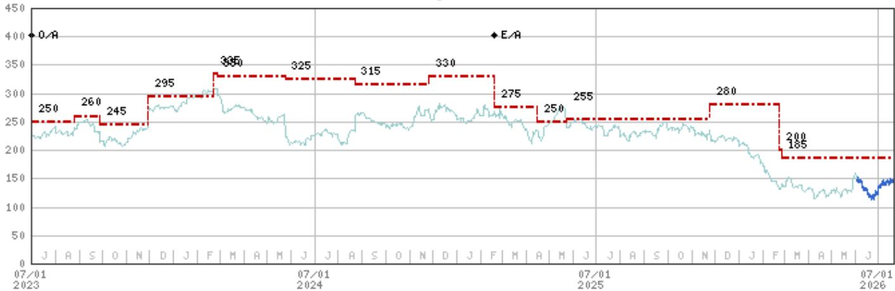
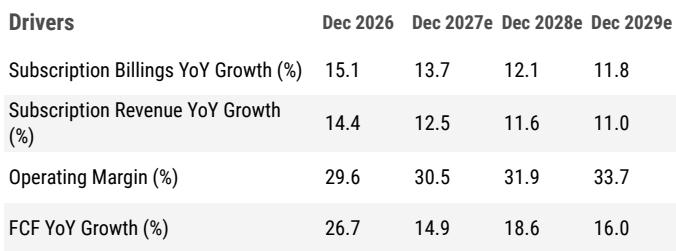
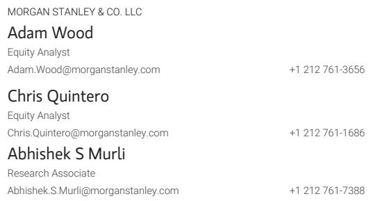

# Workday的AI前景与核心业务放缓：市场定价中的结构性张力

Workday的结构性优势与近期财务轨迹之间的分化从未如此明显。该公司在11,500家客户中每年处理超过1万亿笔交易，财富500强中有65%是其客户，并保持着97%的毛收入留存率。这些指标使Workday成为现存最根深蒂固的企业软件平台之一。然而，市场对其增长的预期近年来持续走低，管理层先前财务框架的退役，恰在市场最需要清晰度之时，注入了新的不确定性。

核心张力在于：Workday拥有企业软件中较强的竞争护城河之一，但其AI变现的进程将比行业其他公司花费更长的时间。以2027日历年GAAP市盈率23倍计算，该公司的报价相对于类似增长的成熟同行存在溢价，尽管其核心业务在放缓、利润率路径不明确，且缺乏短期催化剂来扭转趋势。下调至报告观点反映了一种判断：市场正在为AI加速定价，而公司自身的采用模式和终端市场动态尚无法支撑这一预期。

论点并非Workday是一家糟糕的公司。而是相对于同一研究范围内的其他选择，该报价已成为一个风险回报比不佳的标的。理解原因需要审视三个相互作用的压力：人力资本管理的结构性放缓、AI采用的合规时间线，以及曾锚定市场预期的运营框架退役后留下的真空。

## HCM增长放缓速度超出市场认知，AI尚无法填补缺口

最直接的担忧是Workday核心人力资本管理业务的持续疲软。HCM增长在2026财年已放缓至13%，且趋势指向2028财年进一步减速至9%。这并非周期性波动。它反映了HCM市场的结构性成熟，Workday的主导地位使其增量份额增长空间有限。该公司在HCM领域实际上正在失去份额，尽管在财务领域有所增长，这一动态使得整体订阅收入增长在2028财年前被锁定在12%至13%的复合年增长率。

人们很容易将AI代理视为解决方案。Workday的招聘代理已为招聘人员带来高达50%的效率提升，并将招聘时间缩短了40%。合同智能代理将合同执行时间缩短了高达65%。自助服务代理在早期部署中已将HR案例量减少了25%。这些都是真实的效率提升，而非假设性用例。但它们仍处于客户群中的试点阶段。渠道调研证实，企业正在沙盒环境中测试代理，但对概率性输出、法律责任和监管合规等问题仍存疑虑。在采用从试点转向规模化、可计费的部署之前，AI无法被视作短期增长加速器。

时间错配是关键洞察。Workday的护城河恰恰因那些拖慢其AI采用的合规要求而得到加强。使该平台不可或缺的监管引力，同样使企业级代理的推广成为一个跨季度、多利益相关方的过程。后台自动化机会真实且巨大，但它受合规约束，而非技术约束。那些在未来两到三年内定价AI主导的收入拐点的市场参与者，很可能会失望。

## 退役的运营框架在市场预期中制造了危险的真空

Workday决定退役其先前的中期运营框架，加剧了增长的不确定性。该框架曾作为市场模型的锚点，为利润率扩张和增长预期提供了可见路径。管理层现已明确表示，短期内利润率扩张的速度将慢于此前沟通，且更新后的框架要到下一次分析师日才会公布。

这创造了一个方向性模糊的时期。2027财年GAAP与非GAAP营业利润率之间的差距约为18至19个百分点，对于关注GAAP盈利能力的市场参与者而言，这是一个持续的悬而未决的问题。没有清晰的框架，市场共识估计将失去锚定。风险不仅在于利润率将低于预期，还在于缺乏可信的多年路线图将导致该报价向下重新定价，因为市场参与者会对不确定的收益应用更高的折现率。

报告中的模型变化强调了这一点。2028财年的营业利润率估计已下调174个基点，2029财年下调175个基点。现金流利润率同样受到压缩。这些并非微调。它们代表了对未来三年业务盈利能力的根本性重新评估。先前的框架曾引导市场参与者预期持续的利润率扩张。新的现实是，利润率改善将更加渐进，达到30%非GAAP利润率的路径将比之前建模的时间更长。

## Workday的报价相对于增长状况相似的同行存在溢价，创造了估值倍数压缩风险

关于估值的论点最为直接，但在关于护城河和AI潜力的叙事中，它往往最容易被忽视。Workday目前的报价对应2027日历年GAAP市盈率23倍。相比之下，Autodesk为20倍，Salesforce为18倍，SAP为16倍，Intuit为13倍，Adobe为11倍。在剔除股权激励的企业价值与自由现金流基础上，溢价同样显著。

传统的辩护理由是Workday的护城河证明了溢价的合理性。但护城河论点是一把双刃剑。强大的护城河应支撑收入可见性和利润率稳定性。当核心业务放缓且利润率路径变得不那么确定时，护城河溢价就更难合理化。市场实际上是在为AI变现的期权价值支付溢价，而采用数据尚不支持这一点。

估值倍数压缩是主要的下行风险。如果Workday的估值向同行平均水平（约15至16倍GAAP市盈率）收敛，该报价将面临显著的下行空间（剔除股权激励后的自由现金流倍数），这一倍数更符合成熟同行的水平。这并非困境估值。这是认识到，当Workday的增长率正趋近于同行平均水平，且其利润率轨迹变得不那么清晰时，它不应以增长溢价进行交易。

## 评估Workday相对于更广泛软件领域的研究决策框架

报告的分析有助于建立一个结构化框架，用于在企业软件领域做出相对研究决策。该框架包含三个维度：护城河强度、AI进程时间线，以及相对于增长的估值。

护城河强度是Workday的明显优势。该平台在关键任务HR和财务工作流程中的嵌入性、其超过1万亿笔交易的专有数据集以及97%的毛收入留存率，创造了企业软件中最高的转换成本之一。在这个维度上，Workday在研究范围内属于高质量梯队。

AI进程时间线是张力出现的地方。Workday在HR和财务领域运营，这是任何企业中合规最敏感的领域之二。同样的监管要求加强了护城河，但也拖慢了AI的采用。报告的框架将Workday归类为AI进程相对于监管较少的垂直领域同行更为漫长。这并不意味着AI机会更小。这意味着变现的时间线更长。

相对于增长的估值是结论变得可操作的地方。Workday的订阅收入以12%至13%的速度增长，且正在放缓。其同行群体尽管增长状况相当或更好，却以较低的倍数交易。核心业务放缓、利润率路径不确定以及溢价估值的组合，创造了一个不对称的风险状况。来自估值倍数压缩的下行风险，比来自尚未在规模上得到验证的AI驱动加速的上行潜力更有可能。

对于报告观点企业软件领域的市场参与者而言，该框架建议转向AI进程时间线更快或相对于增长估值更具吸引力的标的。对于Workday的持有者而言，该框架意味着该报价要么需要大幅向下重新定价才能变得有吸引力，要么需要明确的证据表明AI产品正在加速订阅收入增长，然后溢价才能被证明合理。

## 后台自动化浪潮真实存在，但不会挽救短期财务状况

忽视后台自动化机会将是一个错误。大多数组织的薪资、合规、财务结算和劳动力规划仍然高度依赖人工。报告明确将此识别为一个巨大且被低估的市场。Workday基于角色的代理正是为这些工作流程量身定制的，效率提升是可衡量的。

但采用时间线受合规而非技术支配。HR和财务领域的企业买家天生厌恶风险。对于涉及薪资准确性、法律合规和财务报告等流程，他们需要审计追踪、监管批准和确定性结果。概率性AI输出在缺乏广泛治理框架的情况下，与这些要求根本不相容。报告的渠道调研证实，客户正在试点代理，但尚未承诺进行规模化部署。

这为竞争格局创造了二阶影响。Workday的护城河因拖慢其AI采用的合规要求而得到加强。通用大语言模型无法复制Workday在政策合规和正确性方面的确定性业务流程逻辑。但另一方面，AI驱动收入加速的时间线将以年而非季度来衡量。那些在软件领域寻找AI短期催化剂的市场参与者，将需要将目光投向别处。

对Workday管理层而言，战略问题是公司能否在不损害支撑其护城河的合规和治理标准的情况下加速采用。答案并不显而易见。行动过快可能带来监管失误，损害信任。行动过慢则可能将AI叙事拱手让给相邻市场中更激进的竞争对手。报告的评估是，该公司将谨慎地应对这一权衡，而这正是该进程需要时间的原因。

*仅供参考。部分内容可能基于源材料通过AI辅助生成、翻译、总结或编辑，可能存在遗漏或错误。请独立核实。这不构成研究、法律、税务、会计或其他专业建议。*

仅供参考。部分内容可能基于源材料通过AI辅助生成、翻译、总结或编辑，可能存在遗漏或错误。请独立核实。这不构成研究、法律、税务、会计或其他专业建议。

