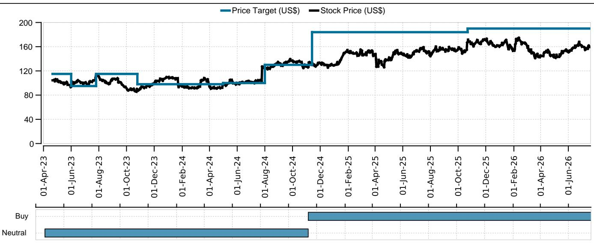
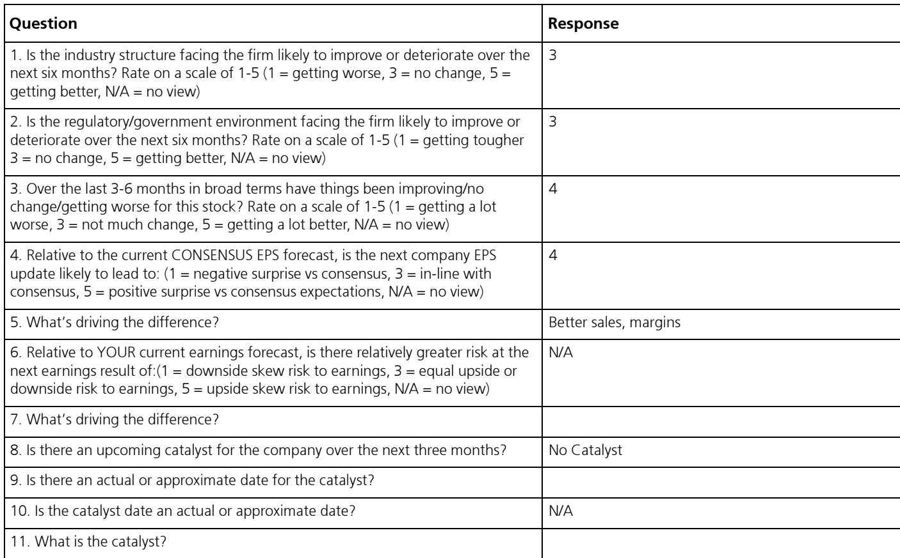
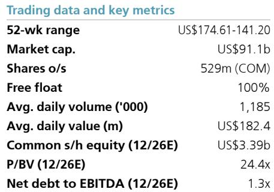

# 3M已到达一个市场共识尚未定价的转折点

3M报告第二季度有机销售增长5.4%，这是近五年来较强劲的季度表现，比市场共识预期高出约150个基点。这并非由低基数或暂时性利好驱动的单次超预期。这是管理层多年投资于新产品创新引擎开始产生成果的首个切实证据。公司有望在2027年前推出超过1000款新产品，仅今年就计划推出350多款。这一产品线，加上两到三年的产品成熟周期，表明当前季度标志着多年增长加速的开始，而非周期性峰值。

市场反应积极，但相对于正在发生的变化幅度而言，这一变动较为温和。3M的报价目前不到今年回报的20倍。这一倍数反映了市场对公司能否在整个周期中维持中等个位数有机增长的持续疑虑。然而，数据越来越支持这一论点。管理层将其2026年有机增长指引从3%上调至3.5%以上，并将每股回报指引从8.50至8.70美元上调至8.80至8.95美元。这些上调与第二季度每股回报2.40美元一同发布，该数字比共识预期高出7%，并意味着下半年约4.33美元的每股回报指引中包含了显著的保守性。管理层所传达的信号与市场所贴现的之间的差距，为愿意忽略PFAS诉讼遗留影响并专注于运营转型的观察者创造了重要机会。

我们的分析表明，市场对2027年每股回报的共识估计大约低了10%。我们已将本已是市场最高的估计从10.02美元上调至10.46美元，现在比共识数字9.49美元高出10%。这一修正并非基于激进的假设。它假设5%的有机增长、35%的核心增量利润率以及6亿美元的净生产力节省，部分被约3亿美元的高额投资和搁置成本所抵消。净结果是2027年运营利润同比增加8亿美元，大约是2026年预期利润改善的两倍。我们对这一前景有很高的信心，并预计随着轨迹变得更加清晰，共识估计将向上移动。

## 第二季度业绩标志着多年增长加速的开始，而非周期性峰值

重新定价的核心论点在于3M目前所产生增长的性质。第二季度5.4%的有机销售增长并非由单一终端市场或临时补库存周期驱动。管理层报告了通用工业、安全和数据中心终端市场的广泛强势，并得到强劲积压订单的支持。这种广度很重要，因为它降低了增长随着某个特定周期成熟而消退的风险。更重要的是，这种增长是由3M将产品推向市场的结构性转变所驱动的。

多年来，3M的新产品线被认为进展缓慢，创新需要太长时间才能转化为商业成果。管理层已投入巨资改变这一动态。结果是产品线现在有望在2027年前实现超过1000款新产品的推出，仅今年就预计推出350多款。这些并非渐进式的产品延伸。它们代表了重新加速公司有机增长引擎的深思熟虑策略。这些产品的典型成熟周期是两到三年，这意味着现在正在进行的推出将在2027年及以后对收入增长做出实质性贡献。这创造了一种自我强化的动态：随着新产品获得 traction，它们建立对产品线的信心，进而支持对未来创新的更高投入。

第二季度业绩提供了这一引擎正在运作的首个具体证据。有机销售比共识预期高出150个基点，是近五年来最大的。每股回报超出7%同样意义重大。这些不是一个增长杠杆已用尽的公司会有的数字。它们是一个长期周期投入开始产生复利效应的公司的数字。

## 2027年利润桥揭示了市场共识低估的回报能力阶梯式变化

理解3M回报轨迹最重要的分析工作是构建从2026年到2027年的利润桥。我们的预测显示，3M可以在2027年实现运营利润同比增加8亿美元，这大约是2026年预期改善的两倍。这不是对近期趋势的机械外推。它基于三个具体且相互加强的驱动因素。

首先，5%的有机增长（高于我们之前假设的4%）增加了约7亿美元的增量收入。这一假设得到加速的产品线和扩大的需求环境的支持。其次，35%的核心增量利润率意味着每增加一美元收入中约有35美分流入运营利润，考虑到公司的固定成本基础和运营杠杆，这一数字是可以实现的。第三，6亿美元的净生产力节省，部分被3亿美元的高额投资和搁置成本所抵消，提供了3亿美元的净顺风。这些因素的组合产生了8亿美元的利润改善。

这个利润桥的重要性不仅在于其规模，还在于其构成。改善是由营收增长和运营效率的组合驱动的，而非财务工程或一次性收益。这使其更具可持续性，也更有可能随着时间的推移反映在报价的倍数中。2027年隐含的每股回报10.46美元并非峰值。它是一个基础，随着产品线继续成熟和公司利润率结构持续改善，可以在此基础上构建进一步增长。

## 倍数扩张机会被低估，因为市场仍在贴现遗留风险

3M目前不到今年回报20倍的估值反映了相对于更广泛的工业板块的显著折价。工业精选板块SPDR基金（XLI）的交易价格约为远期回报的25倍。这一差距表明市场仍在为3M的遗留风险（主要是PFAS诉讼的遗留影响）赋予显著的折价。这种折价可以理解，但越来越不合理。

我们之前从23倍开始。然后我们每股扣除30美元作为对潜在PFAS现金支出的保守预留。这一扣除是刻意保守的。实际负债可能低得多，但我们宁愿在诉讼结果固有的不确定性面前谨慎行事。即使有这一扣除，目标价仍意味着比当前水平有超过25%的上行空间。如果实际PFAS负债被证明更低，上行空间可能显著更大。

倍数扩张的理由很简单。随着3M证明其可以在整个周期中维持中等个位数的有机增长，相对于XLI的折价应该会缩小。24倍的倍数仍然代表折价，但比当前19-20倍的折价要小。这种缩小并不依赖于PFAS负债的解决，尽管那肯定会加速这一过程。它是由公司增长状况的根本改善驱动的，这在报告的数字中已经可见，并且将越来越难以被市场忽视。

## 观察者的决策框架：关注产品线和利润桥，而非诉讼遗留影响

对于在当前水平评估3M的观察者来说，关键的分析任务是区分信号和噪音。PFAS诉讼是一个不确定性来源，但它也是一个众所周知且已被广泛讨论的风险。更重要的问题是，独立于诉讼结果，公司的运营轨迹是否支持更高的估值。

我们推荐的决策框架有三个组成部分。首先，跟踪新产品线。公司承诺到2027年推出超过1000款产品，今年超过350款。每个季度，观察者应监测推出速度是否在加快，以及早期阶段产品是否在市场中获得 traction。这是未来有机增长的领先指标。其次，监控利润桥。关键变量是有机增长、增量利润率和生产力节省。如果公司能够维持5%的有机增长和35%的增量利润率，2027年每股回报10.46美元的目标是可以实现的，并且可能是保守的。第三，将PFAS负债置于背景中。如果实际负债较低，报价的公允价值更高。如果较高，下行空间有限，因为市场已经贴现了显著的负债。

这个框架将焦点从已知的未知（诉讼）转移到可观察且正在改善的运营指标上。它还提供了重新评估论点的明确里程碑。如果产品线按预期交付，并且如果利润桥得以实现，无论诉讼时间表如何，报价的倍数都应该扩大。市场当前的怀疑态度为愿意忽略噪音并专注于基础业务转型的观察者创造了一个切入点。

## 2026年指引上调是一个指向进一步上行空间的保守信号

管理层决定上调2026年指引有两个原因具有指导意义。首先，它展示了对其轨迹的信心。新的有机增长指引从3%上调至3.5%以上，反映了需求可见性的切实改善。新的每股回报指引从8.50至8.70美元上调至8.80至8.95美元，意味着管理层预计2026年下半年将比上半年更强劲，即使上半年已经产生了4.54美元的强劲每股回报。隐含的下半年每股回报4.33美元表明保守性，因为它低于上半年建立的运行率。

其次，指引上调强化了第二季度业绩并非异常的论点。如果公司经历的是暂时的需求激增，管理层不太可能上调全年指引。他们这样做了，并且幅度可观，这一事实表明订单势头是广泛且可持续的。通用工业、安全和数据中心终端市场的持续强势，加上强劲的积压订单，为2026年下半年及进入2027年提供了坚实的基础。

下半年指引中嵌入的保守性也为进一步上调创造了路径。如果2026年下半年的表现与上半年一致，全年每股回报可能超过新指引范围的高端。这将为2027年利润桥的可实现性提供额外证据，并可能引发新一轮的共识估计上调。

*仅供参考。部分内容可能基于源材料通过AI辅助生成、翻译、总结或编辑，可能存在遗漏或错误。请独立核实。这不是专业建议。*

仅供参考。部分内容可能基于源材料通过AI辅助生成、翻译、总结或编辑，可能存在遗漏或错误。请独立核实。这不是专业建议。

