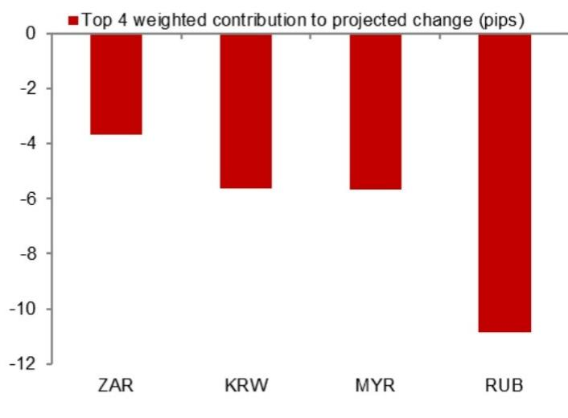
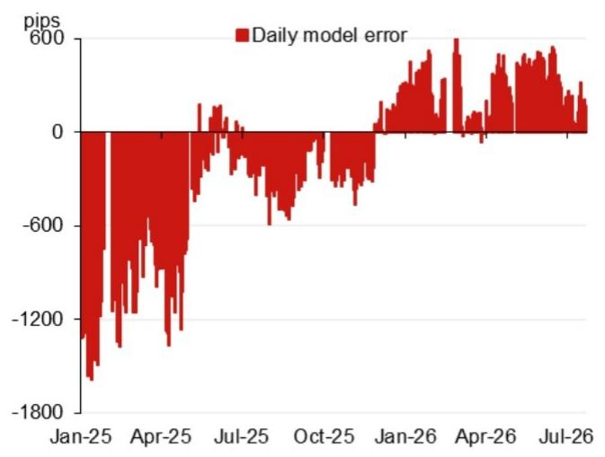

# 汇率观察模型

2026年7月23日

外汇 - 亚洲（除日本）

模型预测值：6.7716

模型预测值：6.7716，对比前次6.7933（较前次官方收盘价有所变化）。

含逆周期因子的模型预测值：6.7770（较前次定价有所变化）。

## 研究分析师

亚洲外汇策略
Craig Chan - NSL
craig.chan@NOM.com

Wee Choon Teo - NSL
weechoon.teo@NOM.com

Vicky Chen - NSL
vicky.chen1@NOM.com

Manthan Shingala - NSL
manthan.shingala1@NOM.com

图1：对预测变化贡献最大的前4个隔夜加权因素（不含逆周期因子）  
  
来源：NOM

图2：近期模型误差（不含逆周期因子调整）  
  
来源：Bloomberg, NOM

图3：每日汇率定价变化  
  
来源：Bloomberg, NOM

图4：事件日历

| 日期 | 事件 | 地点 | 备注 |
|------|------|------|------|
| 2026年7月下旬 | 政治局经济工作会议 | 中国 | 政治局通常每月召开一次会议，7月会议的通稿通常包含经济工作清单及高层优先事项的线索。 |
| 2026年8月中旬 | 央行2026年第二季度货币政策报告 | | |
| 2026年9月24日 | 主席对美国进行国事访问 | 美国华盛顿特区 | |
| 2026年9月下旬 | 央行货币政策委员会会议 | | |
| 2026年10月1-7日 | 国庆黄金周假期 | 中国 | |

来源：Bloomberg, NOM

## 附录A-1

本报告由NOM Singapore Ltd. (NSL) 编制。

关于NOM集团实体的详细信息，请参阅免责声明。

## 分析师认证

我们，Craig Chan、Wee Choon Teo、Vicky Chen和Manthan Shingala，特此证明：(1) 本研究报告中所表达的观点准确反映了我们个人对相关证券或发行人的看法；(2) 我们的薪酬中没有任何部分直接或间接与本研究报告中表达的具体建议或观点相关；(3) 我们的薪酬中没有任何部分与NOM Securities International, Inc.、NOM International plc或任何其他NOM集团公司执行的任何特定交易业务挂钩。

## 重要披露

## 研究报告在线获取及利益冲突披露

NOM集团研究报告可通过www.NOMnow.com/research、Bloomberg、Capital IQ、Factset、LSEG获取。

重要披露内容可访问http://go.NOMnow.com/research/m/Disclosures阅读，或向NOM Securities International, Inc.索取。如网站访问遇到问题，请发送邮件至grpsupport@NOM.com寻求帮助。

负责编制本报告的分析师的薪酬基于多种因素，包括公司的总收入，其中一部分来自相关业务活动。除非另有说明，本报告首页列出的非美国分析师未在FINRA规则下注册/具备研究分析师资格，可能不是NSI的关联人员，且可能不受FINRA规则2241关于与所覆盖公司沟通、公开露面及交易研究分析师账户持有证券的限制。

NOM Global Financial Products Inc. (NGFP)、NOM Derivative Products Inc. (NDP) 和 NOM International plc. (NIplc) 已在美国商品期货交易委员会和美国期货业协会注册为掉期交易商。NGFP、NDPI和NIplc通常从事掉期及其他衍生品交易，这些产品可能构成本报告的主题。

## 美国要求的额外披露

自营交易：NOM Securities International, Inc及其关联公司通常将作为自营交易商交易本研究报告所涉及的相关证券（或相关衍生品）。分析师与其他NOM Securities International, Inc.人员的互动：NOM Securities International, Inc及其关联公司的相关研究分析师定期与销售和交易部门人员互动，以获取其覆盖范围内的流动性和定价信息。

## 估值方法 - 相关研究

NOM的相关策略师通过提供交易建议来表达对证券价格和市场的看法。这些建议可以是相对价值建议、方向性交易建议、资产配置建议，或三者的结合。交易建议中包含的分析包括但不限于：

- 关于证券价格是否偏离其基本面的基础分析。
- 价格变动的定量分析。
- 技术因素，如监管变化、市场风险偏好的变化、意外的评级行动、一级市场活动及供需考量。

交易建议的时间框架是可变的。战术性想法的时间框架较短，通常少于三个月。战略性交易想法的时间框架较长，通常超过三个月。

根据欧盟市场滥用法规的要求，NOM全球相关研究发布的评级分布如下：

52%被赋予买入（或同等）评级；其中50%的发行人曾由NOM集团提供重要服务。
0%被赋予中性（或同等）评级。
48%被赋予卖出（或同等）评级；其中50%的发行人曾由NOM集团提供重要服务。
数据截至2026年6月30日。

## 免责声明

本出版物包含由第1页确定的NOM集团实体编制的内容，并可能包含一个或多个NOM集团实体的贡献，其员工及其各自隶属关系在第1页或本出版物其他地方注明。本文中使用的术语"NOM集团"指NOM Holdings, Inc.及其关联公司和子公司，包括：(a) NOM Securities Co., Ltd. ('NSC') 日本东京，(b) NOM Financial Products Europe GmbH ('NFPE') 德国，(c) NOM International plc ('NIplc') 英国，(d) NOM Securities International, Inc. ('NSI') 美国纽约，(e) NOM International (Hong Kong) Ltd. ('NIHK') 香港，(f) NOM Financial Investment (Korea) Co., Ltd. ('NFIK') 韩国，(g) NOM Singapore Ltd. ('NSL') 新加坡，(h) NOM Australia Ltd. ('NAL') 澳大利亚，(i) NOM Securities Malaysia Sdn. Bhd. ('NSM') 马来西亚，(j) NIHK台北分行 ('NITB') 台湾，(k) NOM Financial Advisory and Securities (India) Private Limited ('NFASL') 印度孟买，(l) NOM Fiduciary Research & Consulting Co., Ltd. ('NFRC') 日本东京，(m) NOM Orient International Securities Co., Ltd ("NOI")。

本材料：(I) 仅供您个人参考，我们不基于此材料寻求任何行动；(II) 不应被解释为在任何司法管辖区出售或招揽购买任何证券的要约；(III) 除与NOM集团相关的披露外，基于我们认为可靠的来源信息，但未经NOM集团独立核实。

除与NOM集团相关的披露外，NOM集团不对本文件的公平性、准确性、完整性、正确性、可靠性或适用于任何特定目的或适销性作出任何明示或暗示的保证、陈述或承诺，并且在法律和/或法规允许的最大范围内，不承担因使用本文件及相关数据而产生的任何责任。

本文所表达的意见或估计是截至原始发布日期当前的意见，本文所含信息（包括其中包含的意见和估计）如有变更，恕不另行通知。然而，NOM集团明确表示不承担更新或修订本文件的任何义务。

NOM集团及其高级职员、董事、员工和关联方，在适用法律和/或法规允许的范围内，可能以自营交易商、代理人或其他身份进行交易，或持有本文提及的发行人或证券的多头或空头头寸，或买卖其证券、商品或工具，或基于其的期权或其他衍生工具。

本文档可能包含从第三方获得的信息，包括但不限于信用评级机构的评级。NOM集团特此明确否认对从第三方获得的任何信息的原创性、公平性、准确性、完整性、正确性、适销性或适用于特定目的的所有陈述、保证或承诺。

读者应将本文档视为做出投资决策的单一因素，因此，本报告不应被视为识别或暗示与任何投资决策相关的所有直接或间接风险。NOM集团制作多种不同类型的研究产品，包括基础分析和定量分析等；一种研究产品中包含的建议可能与其他类型研究产品中的建议不同。

本文中呈现的数字可能涉及过往表现或基于过往表现的模拟，这些并非未来或可能表现的可靠指标。如果信息包含对未来表现和业务前景的预期、预测或指示，此类预测可能不是未来或可能表现的可靠指标。

对于相关研究：建议分为两类：战术性，通常持续最多三个月；或战略性，通常持续6-12个月。然而，交易建议可能会根据情况变化随时进行审查。

本文所述的证券可能尚未根据1933年美国证券法注册，在此情况下，除非已根据该法注册，或符合该法注册要求的豁免条件，否则不得在美国或向美国人士发售或出售。

本文件已获批准在英国作为投资研究由NIplc分发。NIplc由审慎监管局授权，并受金融行为监管局和审慎监管局监管。

本文件已获批准在欧洲经济区作为投资研究由NOM Financial Products Europe GmbH ("NFPE")分发。

本文件已获NIHK批准在香港分发，NIHK受香港证券及期货事务监察委员会监管。

本文件已获批准在澳大利亚由NAL分发。

本文件也已获批准在马来西亚由NSM分发。

在新加坡，本文件由NSL分发。

本文件未获批准在沙特阿拉伯王国、阿拉伯联合酋长国或卡塔尔国向特定人员以外的人士分发。

对于涉及台湾上市公司或由台湾研究分析师撰写的报告：本文件仅供参考。

本材料不得在印度尼西亚分发或传递给印度尼西亚共和国境内的个人或印度尼西亚公民。

本报告由NOM集团或其未在中国获得证券研究许可的子公司或关联公司编制。本研究报告未获批准在中国境内分发。

未经NOM集团成员事先书面同意，不得以任何形式复制、影印、复制或重复本材料的任何部分，或重新分发、重新发布或重新传播。

NOM集团通过其合规政策和程序管理研究制作中的利益冲突。

如需获取有关本文件所含任何研究交流所使用方法论或模型的更多信息，请联系NOM的研究分析师。

版权 © 2026 NOM Singapore Ltd., 新加坡。保留所有权利。
