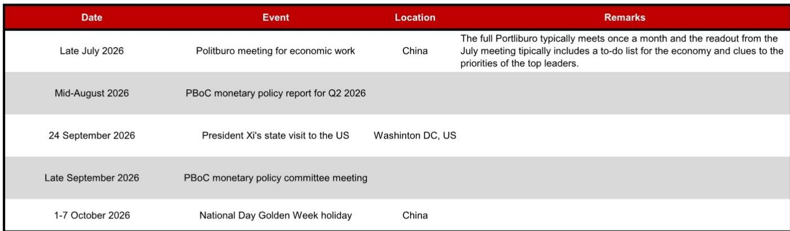
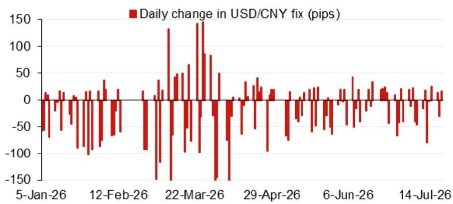

# 央行通过中间价释放信号：观察进入新阶段

中国央行近期释放了较为明确的信号，表明其愿意让人民币在自身节奏下进行双向波动。2026年7月23日，央行将美元/人民币中间价设定在6.7716，较前一日的6.7933下调217个基点，较前一交易日官方收盘价低24个基点。这并非技术性调整，而是一种策略性步骤，旨在结合更大的双向灵活性与对波动节奏的把握。不含逆周期因子的模型预测值为6.7716，含因子的预测值为6.7770，两者仅相差54个基点。这一狭窄差距本身就是一个值得关注的数据点：央行并未将逆周期因子作为强力制动器，而是依靠中间价机制本身来引导汇率在可控范围内变化。

时机的选择值得关注。这一调整发生在7月下旬重要会议召开前几天，该会议通常设定下半年的政策议程。央行似乎在提前释放信号，表明汇率管理是更广泛政策工具中的一环。对于市场参与者而言，这意味着需要更深入地理解中间价机制如何运作、逆周期因子何时被使用，以及央行对波动的实际容忍度。

## 中间价机制揭示央行政策立场的主动调整

剔除逆周期因子后的模型预测值为6.7716，这清晰地表明：央行对人民币合理价值的基础评估已出现明显下移。单日217个基点的变动并非随机波动，它反映了央行对均衡汇率看法的重新校准，驱动因素包括美元指数隔夜变动、交叉汇率变化以及国内宏观环境因素。报告图1中列出的前四大加权隔夜贡献是这一变动的机械驱动因素。但机械解释只是故事的一半。更重要的问题是，央行为何选择将中间价设定得如此接近模型预测值。

当央行将中间价设定在接近模型预测值且未进行大幅逆周期调整时，实际上是在认可市场的方向性压力。在以往人民币走弱阶段，央行常会加入较大逆周期因子以减缓波动节奏，有时会加入100至200个基点或更多。而此次逆周期因子仅增加了54个基点，使实际中间价达到6.7770。这是一个较小的缓冲，向市场表明央行对当前波动轨迹感到舒适，并不认为需要强力干预。这是一个政策选择，而非被动反应。

## 狭窄的逆周期因子信号显示对波动的更高容忍度

54个基点的逆周期调整是本次中间价中最值得关注的数据。它代表了央行的自主调节空间，是其在判断波动可能变得无序或过度时用来平衡市场力量的工具。较小的调整意味着央行认为当前不存在无序状况，实际上是在表明当前人民币的波动节奏在其舒适区内。这与2024年和2025年早期阶段有所不同，当时央行频繁使用较大的逆周期因子来稳定汇率。这一转变并非关于央行对人民币长期合理价值的看法变化，而是关于其短期政策优先级的调整。

什么发生了变化？国内宏观环境是最可能的答案。2026年上半年增长动能有所变化，房地产领域仍存在一定影响。人民币适度波动有助于为出口竞争力提供缓冲，通过提高进口价格帮助缓解通缩压力，并为央行提供更多货币政策操作空间。7月下旬的会议预计将推出更多观察措施，而更灵活的汇率是这些措施有效发挥作用的前提。如果央行人为维持人民币强势，可能引发投机行为并消耗储备。通过允许可控的波动，可以降低未来出现突然、不稳定变动的风险。

## 后续事件日程为人民币调整创造战略窗口

未来几周将有一系列重要事件，这些事件将影响人民币的走势。7月下旬的会议将设定经济议程。8月中旬央行的二季度货币政策报告将提供近期行动的详细依据。9月24日的国事访问引入了地缘政治维度。10月初的国庆黄金周假期则创造了交易的自然间歇期，这通常与央行的窗口指导期相吻合。

这一序列创造了一个清晰的战略窗口。央行可以利用会议与国事访问之间的时期，在相对平静的地缘政治日程中提前进行人民币调整。国事访问后，情况可能发生变化。如果访问产生贸易相关协议或避免竞争性波动的承诺，央行可能面临稳定汇率的压力。如果访问不顺利，央行可能加速调整作为应对措施。关键在于央行保留了选择权，并未承诺特定路径。但当前的中间价表明，央行在短期内倾向于人民币适度波动，同时保留在条件变化时收紧逆周期因子的选项。

## 围绕中间价进行观察的决策框架：解读信号，而非仅看数值

对于研究者和企业财务人员而言，中间价不仅仅是一个每日数字，它是央行关于其政策立场的信号。决策框架包含三个层面。第一，跟踪模型预测值与实际中间价之间的差距。差距扩大意味着央行在平衡波动；差距缩小意味着它在适应波动。第二，监测逆周期因子的规模。因子高于100个基点表明主动防御；因子低于50个基点表明容忍。第三，关注中间价变化的背景，特别是相对于政策事件的时间点。在重要会议前的大幅中间价变动比在平静期同样的变动更具意义。

将这一框架应用于当前情况，可以得出一个清晰的判断：央行目前处于适应模式。模型预测值与实际中间价高度一致，逆周期因子较小，且时机具有战略性。对于观察而言，这意味着在短期内人民币存在一定波动空间，但需设定明确的观察触发点。如果逆周期因子扩大到100个基点或更多，那就是央行转向防御模式的信号。在此之前，阻力最小的路径是当前方向。

第二层面的影响同样重要。人民币的波动将对亚洲其他货币产生溢出效应。韩元、新台币和泰铢最容易受到人民币波动带来的竞争压力。该地区的新兴市场央行将面临选择：要么允许本币同步波动，要么提高利率来防御。央行的举措可能引发亚洲地区的竞争性波动，这将进一步影响该地区的通胀前景，并增加对美联储调整自身政策立场的压力。

*仅供参考。部分内容可能基于源材料通过AI辅助生成、翻译、总结或编辑，可能存在遗漏或错误。请独立核实。本文不构成任何专业建议。*

仅供参考。部分内容可能基于源材料通过AI辅助生成、翻译、总结或编辑，可能存在遗漏或错误。请独立核实。本文不构成任何专业建议。

