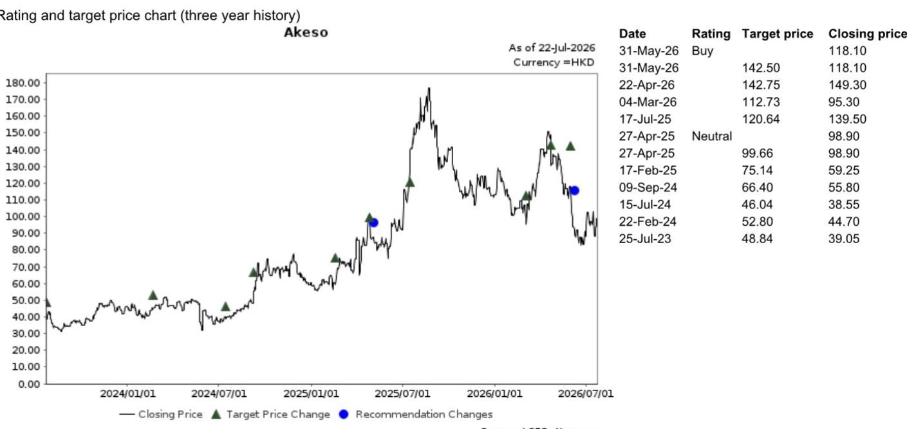

# A Single Data Point Just Shifted the Odds in One of Biotech's Most Watched NSCLC Trials

On July 22, 2026, Summit Therapeutics disclosed an additional analysis of the HARMONi study's overall survival data. The headline number—a hazard ratio of 0.76 for both the full intention-to-treat population and the Western patient subgroup—does not look dramatically different from the 0.79 reported in the primary analysis three months earlier. But the trajectory matters more than the level. The hazard ratio has now improved across two successive cuts, and the convergence between the global and Western subgroups has tightened from a 0.20 gap to near identity. For a study that failed its overall survival primary endpoint in April 2025, this is not an incremental update. It is a structural shift in the probability of regulatory approval.

The significance of this data release extends beyond the specific molecule under investigation. Ivonescimab, the bispecific antibody at the center of the HARMONi program, is already the subject of intense scrutiny because of its mechanism—a PD-1/VEGF dual-targeting approach that has shown differentiated efficacy in Asian-dominated trials. The question that has hung over the asset is whether those results would replicate in a Western population. The latest OS data from HARMONi provides the strongest signal yet that they do. The Western patient subgroup hazard ratio improved from 0.98 in the primary analysis to 0.84 in September 2025 and now to 0.76, with a median follow-up of 23.2 months. That is not noise. That is a trend.

For researchers and strategists tracking the non-small cell lung cancer landscape, this update carries three immediate implications. First, it increases the likelihood that the U.S. Food and Drug Administration will approve ivonescimab for second-line EGFR-mutant NSCLC after third-generation TKI failure, with a Prescription Drug User Fee Act action date of November 14, 2026. Second, it validates the broader thesis that bispecific antibodies targeting both PD-1 and VEGF can achieve efficacy that monoclonal combinations have not consistently delivered. Third, it forces a reassessment of the competitive dynamics in a segment of lung cancer where treatment options remain limited and where the standard of care has been slow to evolve.

The following analysis unpacks what the HARMONi OS data actually shows, why the improvement in the Western subgroup is the most important number in the release, and how decision-makers should incorporate this information into their assessment of the asset's commercial potential and regulatory pathway.

## The Hazard Ratio Improved Across Three Consecutive Analyses, and the Western Subgroup Converged with the Full Population

The HARMONi study's overall survival data has now been read three times. In the primary analysis conducted in April 2025, the hazard ratio for the full intention-to-treat population was 0.79, but the Western subgroup came in at 0.98—effectively flat. That disparity was the central reason the study did not meet its OS primary endpoint, even though progression-free survival was positive. By September 2025, a second analysis showed the full ITT HR had edged to 0.78, while the Western subgroup had improved to 0.84. The June 2026 analysis now shows both groups at 0.76.

The convergence is not merely statistical. It reflects a maturing survival curve in the Western cohort, which now has a median follow-up of 23.2 months compared with 9.2 months in the first analysis and 13.7 months in the second. Early data in smaller subgroups are often dominated by censoring and short follow-up, which can mask a treatment effect that takes time to emerge. With longer observation, the survival benefit in Western patients has become indistinguishable from the benefit seen in the Asian-majority full population.

This pattern has direct implications for regulatory review. The FDA evaluates not just whether a trial meets its primary endpoint but whether the data are consistent across important subgroups. A hazard ratio of 0.98 in Western patients would have been a major concern for an agency that weighs generalizability heavily. A hazard ratio of 0.76, with a 23-month median follow-up, removes that concern. The data now show that ivonescimab works as well in Western patients as it does in the overall trial population, and that the initial Western result was an artifact of immaturity, not a biological difference.

## The 0.76 Hazard Ratio Is Comparable to HARMONi-A, Which Means the Data Are Now Consistent Across Two Independent Studies

The most useful benchmark for interpreting the HARMONi OS data is not a historical standard from another drug class. It is the HARMONi-A study conducted by Akeso in China, which reported a hazard ratio of 0.74 for overall survival. The HARMONi and HARMONi-A trials share the same molecule—ivonescimab—but differ in geography, enrollment criteria, and standard-of-care comparators. HARMONi-A was a China-only study. HARMONi is a global study with a substantial Western enrollment.

The fact that the global study now shows a hazard ratio of 0.76, nearly identical to the 0.74 from the China-only study, provides powerful evidence that the treatment effect is not population-specific. It also reduces the risk that the HARMONi-A result was an outlier driven by regional differences in genetics, prior treatment patterns, or standard-of-care quality. When two independent trials produce nearly identical effect sizes for the same molecule, the probability that the result is real and generalizable increases substantially.

For a regulatory filing, this consistency is valuable. The FDA will have two datasets—one from a large global study and one from a China-focused study—that point to the same conclusion. The agency's willingness to accept data from China-only trials has been inconsistent, but the presence of a global trial with matching results removes the need to rely solely on the China data. The HARMONi study now stands on its own as a positive trial for overall survival, and the HARMONi-A data serve as a confirmatory signal rather than the primary evidence.

## The Western Subgroup Data Removes the Primary Regulatory Risk That Existed After the April 2025 Readout

After the April 2025 primary analysis, the most serious concern for the regulatory path was not the full ITT hazard ratio of 0.79. It was the Western subgroup result of 0.98. A drug that shows no survival benefit in the population that will constitute the majority of the U.S. commercial opportunity faces an uphill battle with the FDA, regardless of what the overall trial shows. The agency's Division of Oncology 2 has been explicit in recent years about its expectation that pivotal trials include adequate representation of the U.S. population and that subgroup analyses support the overall result.

The June 2026 analysis directly addresses that concern. The Western subgroup hazard ratio has moved from 0.98 to 0.76 over three analyses, and the confidence interval has narrowed with longer follow-up. The data now support the conclusion that Western patients derive the same magnitude of survival benefit as the overall population. That is the single most important change between the April 2025 readout and the current one.

It is worth noting that the study still has not formally met its OS primary endpoint in the traditional sense, because the primary analysis in April 2025 was negative. However, the FDA has flexibility in how it evaluates overall survival data, particularly when the prespecified analysis was conducted at an immature time point and subsequent analyses show consistent and improving results. The agency can consider the totality of the evidence, and the trajectory from 0.79 to 0.78 to 0.76, combined with the Western subgroup convergence, constitutes a compelling narrative. The November 2026 PDUFA date now looks more likely to result in approval than denial.

## Decision Framework: How to Assess the Probability of Regulatory Approval and Commercial Viability Based on This Update

For readers who need to translate this clinical data update into a structured decision, the following framework organizes the key variables that will determine whether ivonescimab reaches the U.S. market and, if so, how large the opportunity is.

**Variable 1: Regulatory probability.** Before the June 2026 analysis, the primary risk was the Western subgroup data. That risk has now been substantially reduced. The remaining regulatory questions are (a) whether the FDA will require a second confirmatory trial, (b) whether the agency will restrict the label to a specific line of therapy or biomarker-defined subpopulation, and (c) whether manufacturing or chemistry issues arise during the review. The base case should now assume approval, with a probability well above 50 percent. A conservative estimate would place it at 70 to 80 percent, up from perhaps 40 to 50 percent after the April 2025 readout.

**Variable 2: Commercial positioning.** If approved, ivonescimab would enter the second-line EGFR-mutant NSCLC market after third-generation TKI failure. This is a defined niche with limited competition. Osimertinib is the standard first-line therapy, and after progression, options include chemotherapy, platinum-based doublets, and, in some cases, immunotherapy combinations that have shown modest benefit. A drug that offers a 24 percent reduction in the risk of death compared with standard of care would have a clear value proposition. The key commercial risk is not efficacy but pricing and reimbursement, particularly given the presence of cheaper generic chemotherapy options.

**Variable 3: Competitive dynamics.** The broader PD-1/VEGF bispecific space is becoming more crowded, with multiple assets in development. However, ivonescimab has a first-mover advantage in this specific indication and in this specific geography. The HARMONi data, combined with HARMONi-A, represent the most mature dataset for a PD-1/VEGF bispecific in EGFR-mutant NSCLC. Later entrants will need to show either superior efficacy or a differentiated safety profile to challenge ivonescimab's position. The window for establishing market leadership is narrow, and the current data support the view that ivonescimab will enter as the standard of care in this segment.

**Variable 4: Financial implications.** The company currently trades at 3.7 times fiscal year 2035 sales of CNY 22.4 billion, according to the research report. That multiple reflects uncertainty about the regulatory outcome and the commercial ramp. If approval is granted in November 2026, the revenue trajectory will depend on launch execution, label breadth, and physician adoption. A conservative revenue scenario would assume gradual uptake over two to three years, with peak sales in the CNY 15 to 20 billion range. An optimistic scenario would assume faster adoption given the unmet need, with peak sales exceeding CNY 25 billion. The current valuation does not fully discount the upside from a positive regulatory decision, which suggests asymmetric risk-reward for those who believe the data are sufficient for approval.

## The Data Maturation Argument Is Now Supported by Three Consecutive Analyses, Making It Difficult to Dismiss as Random Variation

One of the most common critiques of early-stage survival data is that hazard ratios can fluctuate with additional follow-up. That critique is valid, but it applies most strongly when a single data cut is followed by a reversal. In the case of HARMONi, the hazard ratio has moved in the same direction—improving—across three separate analyses spaced over 14 months. The Western subgroup has improved even more dramatically, from 0.98 to 0.84 to 0.76. The pattern is monotonic and consistent.

Statistically, the probability of observing three consecutive improvements in the hazard ratio by chance alone is low, particularly when each improvement coincides with longer follow-up and narrower confidence intervals. The data are telling a coherent story: the treatment effect is real, it takes time to emerge, and it is not restricted to any single demographic group. The burden of proof has now shifted from the sponsor, who needed to show that the initial negative result was misleading, to skeptics, who would need to explain why three successive analyses all point in the same direction.

For institutional observers and pharmaceutical strategists, the implication is clear. The HARMONi OS data are no longer a question mark. They are a maturing dataset that supports a regulatory filing and, if approved, a significant commercial opportunity. The November 2026 PDUFA date will now be one of the most closely watched events in oncology, and the probability of a positive outcome has meaningfully increased.

*For informational purposes only. Portions may be generated, translated, summarized, or edited with AI assistance based on source materials and may contain omissions or errors. Please verify independently. This is not professional advice.*

For informational purposes only. Portions may be generated, translated, summarized, or edited with AI assistance based on source materials and may contain omissions or errors. Please verify independently. This is not professional advice.

