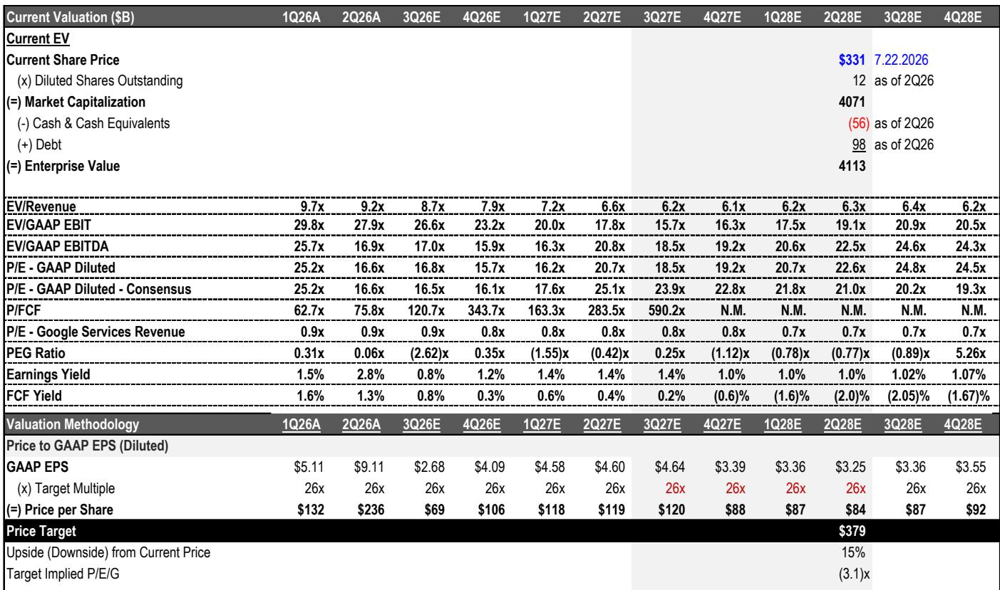
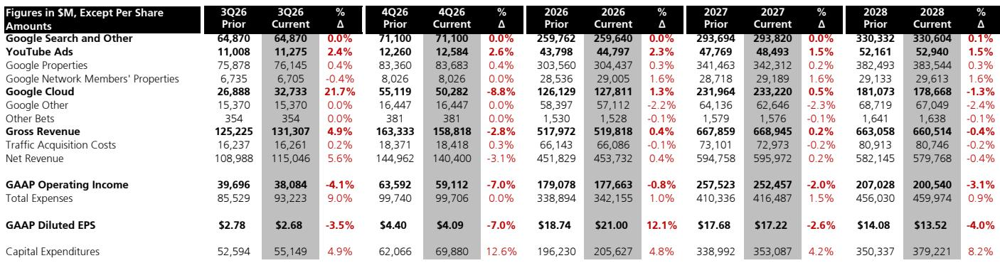
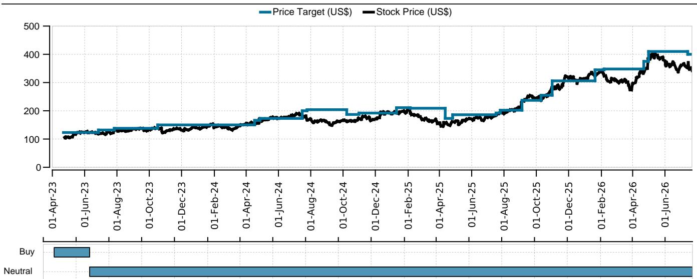

# UBS：Alphabet业务与近期数据观察

这份UBS在 2026 年 7 月发布的 Alphabet 财报点评，核心判断并非收入不及预期，而是“收入增长已被市场定价”。2Q26 总营收 1198 亿美元，略高于UBS预期的 1195 亿美元和共识预期的 1165 亿美元。但真正改变分析师 Stephen Ju 判断的，是成本端两个明确信号：2026 年资本支出指引上调至 1950-2050 亿美元（此前为 1800-1900 亿美元），以及招聘需求持续上升带来的股权激励支出高于预期。UBS因此将 2027 和 2028 年 GAAP 稀释每股收益预期分别下调 3% 和 4%。

这份报告值得关注的，不是 Alphabet 某个业务线的单季表现，而是UBS如何用“积压订单转化为收入的速度”和“资本支出强度”两个变量，重新评估公司未来两年的盈利路径。

## 1. 云业务积压订单超预期，但UBS此前已提前上调

2Q26 末 Google Cloud 积压订单达到约 5100 亿美元，高于UBS此前预测的 4820 亿美元，也高于 1Q26 末的约 4620 亿美元。按UBS假设的 50% 两年转化率，这意味着 Google Cloud Platform 在 2026/2027 年的收入可达 1275 亿美元，或云业务整体收入约 1470 亿美元，明显高于财报前市场共识的 2026 年约 950 亿美元和 2027 年约 1440 亿美元。

但UBS在 6 月发布的报告“从 AI 实验室、Meta 和 Vertex 堆积积压”中已经大幅上调了云业务增长预期。因此本次财报更多是调整季度间的收入节奏，而非改变全年预期。UBS对 2026、2027、2028 年云收入的预测仅从 1261 亿、2320 亿、1811 亿美元微调至 1278 亿、2322 亿、1787 亿美元。

> **KC评论：** 积压订单超预期本身是利好，但UBS的调整幅度很小，说明该机构认为市场对云业务的预期已经偏高。真正需要关注的不是积压订单的相对数字，而是这些订单能否以高于 50% 的转化率在两年内变成收入。

## 2. 搜索广告增速节奏变化，YouTube 受益于世界杯和中期选举

搜索业务同比增长 17%，略高于共识预期的 16%，但超预期幅度较前几个季度明显收窄。UBS指出，零售和资金垂直行业是主要驱动力，但考虑到此前已经上调过搜索收入预期，本次财报几乎没有留下进一步上调的空间。2026-2028 年搜索收入预测基本不变。

YouTube 广告收入 111 亿美元，高于共识预期的 108 亿美元。UBS认为世界杯赛事和客厅场景的可点击广告是主要推动力，且世界杯决赛在 7 月举行，3Q26 仍将受益。此外，美国中期选举相关政治广告支出预计将利好 2H26，UBS指出当前政治广告支出水平与 2024 年总统大选相当，因此对 YouTube 的预测高于历史中期选举水平。YouTube 2026 年收入预测从 438 亿美元上调至 448 亿美元。

## 3. 资本支出和人员成本构成 EPS 双重不确定性

这是UBS下调盈利预期的核心原因。2026 年资本支出指引从 1800-1900 亿美元上调至 1950-2050 亿美元，高于共识预期的 1865 亿美元。UBS同时上调了 2028 年资本支出预测，认为单位云收入的资本投入强度高于以往周期。折旧摊销的增加将直接推高总费用。

另一个被市场低估的因素是人员成本。UBS注意到股权激励支出高于预期，管理层也提到持续招聘需求。UBS将 2026、2027、2028 年总费用分别上调至 3422 亿、4165 亿、4600 亿美元，较此前预测增加约 33 亿、62 亿、40 亿美元。

> **KC评论：** 资本支出和人员成本是两笔不同的账。资本支出通过折旧摊销在未来数年分摊，而人员成本是当期费用。UBS同时上调这两项，意味着 Alphabet 的盈利改善路径比市场预期的更远。这也是为什么UBS认为当前估值处于“接近周期高点”的位置。

## 4. 估值框架：盈利下修不确定性大于上修空间

基于 26 倍市盈率（不变）和截至 2Q28 的 GAAP 稀释每股收益 14.64 美元（此前为 15.16 美元）。2026 年 GAAP 稀释每股收益预期从 18.74 美元上调至 21.00 美元，主要受 2Q26 股权回报表现（可能来自 SpaceX 和 Anthropic 的市值重估）推动。但剔除这部分非经常性收益后，2027 和 2028 年每股收益均呈下降趋势。

UBS在研究案例中列出了三个未解决因素：AI Overviews 的货币化路径尚不清晰（广告商反馈不一）、来自 Perplexity 和 OpenAI 等 GenAI 搜索产品的竞争不确定性加剧、以及短期内与 GenAI 建设相关的成本和研究可能进一步升级。

对于关注大型科技公司资本支出周期的读者，这份报告提供了一个可复用的观察框架：当一家公司的收入增长已被市场充分预期时，成本端的边际变化——尤其是资本支出强度和人员费用——将成为盈利预测修正的主要驱动力。UBS在报告中明确表示，对 Alphabet 自由现金流能否回到历史水平的疑问“没有更清晰的答案”，且担心 2027 年资本支出可能进一步上升。

For informational purposes only. Portions may be generated,translated,summarized,or edited with AI assistance based on source materials and may contain omissions or errors. Please verify independently. This is not investment,legal,tax,accounting,or other professional advice.

For informational purposes only. Portions may be generated,translated,summarized,or edited with AI assistance based on source materials and may contain omissions or errors. Please verify independently. This is not investment,legal,tax,accounting,or other professional advice.

