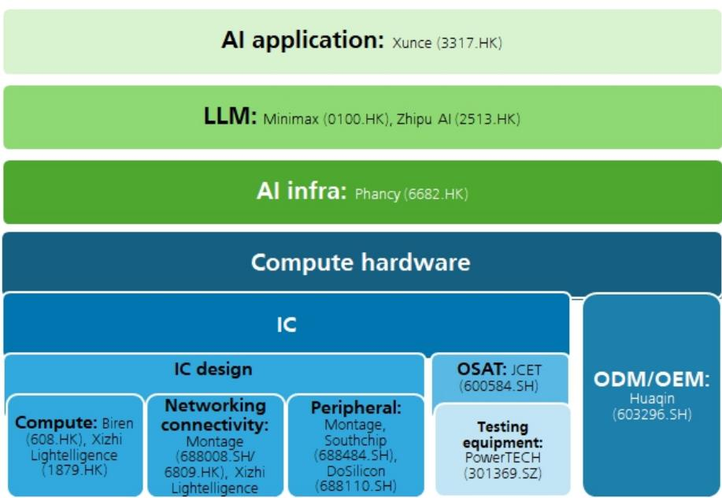
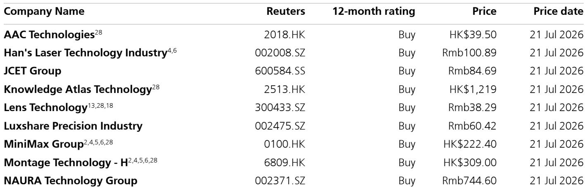

# UBS：中国科技-WAIC2026技术巡礼-超40家机构参与

2026年世界人工智能大会（WAIC）上周在上海闭幕。UBS在会前组织的科技供应链调研中，与12家涵盖大模型、GPU、网络芯片、模拟芯片、封测、ODM及半导体设备的公司进行了管理层交流。超过40家机构读者参与了此次调研，大会官方数据显示参展商超过1100家，参会人数超过40万。

一个值得关注的信号是，中国宣布成立世界人工智能合作组织（WAICO），涉及29个国家，并签署了AI治理倡议。中国与海外公司新签合同总额约30亿美元。这些动作叠加国内大模型和基础设施的快速迭代，使得UBS对2026年及以后中国主要AI科技供应链公司的增长前景更有信心。

## 1. 华为推出1024卡Atlas 950 SuperPod，国产算力集群进入千卡时代

华为在WAIC 2026展示了基于Ascend 950PR芯片的Atlas 950 SuperPod，采用1024卡互联架构，提供1 EFLOPS FP8和2 EFLOPS FP4算力，并实现256TB统一内存寻址。其TB级NPU互联和3微秒超低延迟，旨在解决万亿参数模型训练和推理中的通信瓶颈。华为透露，已有超过750套Ascend 384 SuperPod系统在互联网、电信、资金、医疗等多个行业部署。

其他国产算力厂商也展示了类似方案，包括中科曙光的Sugon 8000（支持10万卡互联）、沐曦的XiJing S600、中兴的OEX以及阿里巴巴基于真武M890的盘踞AL128。这表明国内AI算力基础设施正从单卡竞争转向系统级集群能力的全面比拼。

> **KC评论：** 华为将SuperPod路线图规划至2027年的Atlas 960（15488卡），说明国产算力集群的规模化路径已经清晰。对于关注国产替代的读者，关键不再是单卡性能对标，而是集群互联效率和生态成熟度。

## 2. 国产AI芯片公司需求强劲，但供应约束仍是短期瓶颈

UBS调研的多家AI加速器公司均表示，由于国内算力供应紧张，来自国内客户（包括云服务商）的需求持续走强。二线AI加速器供应商大多在开发对标H100/H200的芯片，并通过SuperPod技术弥补单卡性能差距。

网络芯片公司澜起科技指出，DDR5 Gen3/4内存接口芯片的贡献在2026年持续增长，Gen5芯片预计在2026年下半年开始出货。公司同时注意到客户对CXL/MRDIMM的需求正在上升。不过，上游封装材料（如BT基板和电子玻纤布）的供应紧张可能在短期内限制增长，澜起预计这一状况将从2026年下半年逐步缓解。

## 3. 先进封装研究加速，JCET宣布78亿元上海新厂计划

长电科技在调研中表示，当前周期与以往不同，由AI的结构性需求驱动。2026年第二季度产能利用率维持在80%，AI相关业务、晶圆级封装和凸块均已满载。公司近期宣布在上海研究78亿元建设先进封装工厂，聚焦2.5D封装，预计2028年完成建设，2029年投产。管理层认为，长电能从国内AI加速器放量和海外市场的溢出效应中受益，其AI电源管理芯片封装业务利润率高于公司平均水平。

## 4. 大模型公司收入增速超预期，算力租赁成本仍是利润变量

智谱在调研中透露，截至2026年7月，其年化经常性收入（ARR）已达10亿美元，提前完成内部年度目标。近期通过H股配售融资约310亿港元，将用于扩大算力规模。管理层表示，API价格提升和推理优化有助于改善利润率，但算力租赁成本的不确定性仍是关键变量——国内算力供应紧张导致租赁价格上涨。

MiniMax的ARR从2025年底的约1亿美元快速攀升至2026年一季度财报时的1.5亿美元，管理层对2026年底达到10亿美元目标保持信心。尽管最新旗舰模型M3参数量较M2.7接近弹性较高，但通过推理工程优化和集群运营精细化，毛利率仍可维持健康水平。

UBS在报告中指出，中国AI大模型和半导体供应链正处于快速迭代期，从芯片、网络、封装到系统级方案均有实质性进展。对于产业决策者而言，关注点应从单一技术指标转向生态协同和供应链韧性。

For informational purposes only. Portions may be generated,translated,summarized,or edited with AI assistance based on source materials and may contain omissions or errors. Please verify independently. This is not investment,legal,tax,accounting,or other professional advice.

