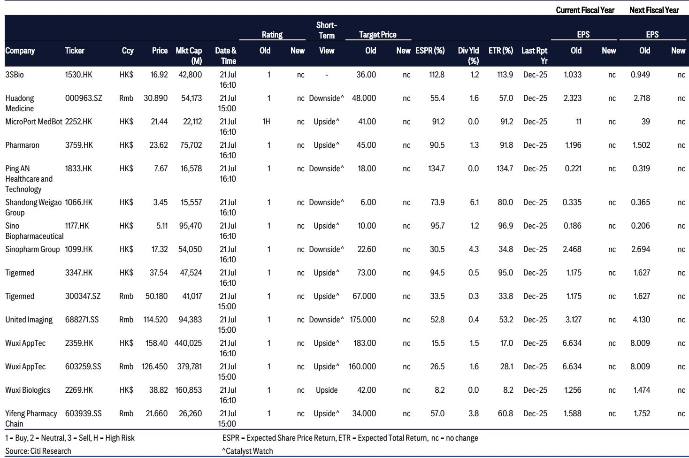
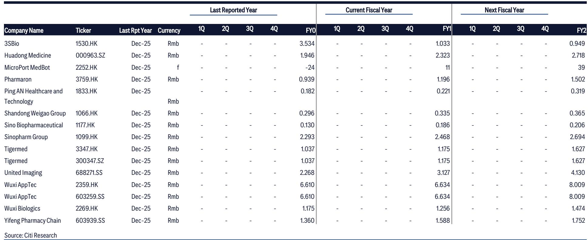
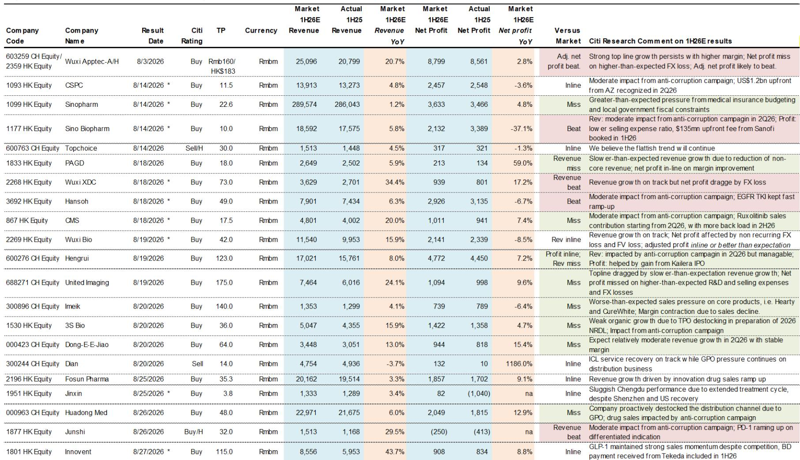

# 中国医疗健康行业上半年观察：企业间分化趋势或将进一步显现

2026年上半年，中国医疗健康行业正呈现出明显的分化格局——企业通过运营效率创造收入的能力，正逐渐被通过阶段性业务合作获取收入的能力所超越。根据某全球研究机构的详细前瞻分析，即将到来的业绩披露期将显示，领先的CRO/CDMO企业有望凭借强劲的订单积压增长交出超预期表现，而制药企业则越来越依赖对外授权首付款和IPO收益来掩盖其基础业务层面的挑战。这并非周期性的暂时调整，而是中国医疗健康领域价值创造方式的系统性重构。

趋势已清晰可见：受益于全球生物科技融资复苏及多年期合同服务积压的企业，其业务可见度正在提升。而那些依赖国内医院渠道销售的企业，则持续受到行业规范行动、医保预算严格管控以及地方财政约束的影响。面向消费者的细分领域——如医美、医疗服务及中药——整体仍显疲软，短期内缺乏明确的复苏催化剂。对于观察者而言，关键问题不在于行业是否会反弹，而在于哪些商业模式已将其收入驱动力从国内规模增长永久性地转向了基于交易或出口驱动的收入。

本次业绩周期的特别之处在于数据的细致程度。该报告覆盖了CRO/CDMO、制药/生物制药、医疗器械、流通、医疗服务、医美及中药等领域的20余家企业。预期结果的差异极为显著：部分企业预计在收入和利润上均能超预期，而另一些则可能双双不及预期。区分因素并非企业规模或品牌知名度，而是收入增长的结构性来源。本分析旨在将这种分化转化为一个观察行业的决策框架。

## 领先CRO/CDMO企业业绩超预期，因其收入与全球研发支出挂钩，而非国内医院流量

2026年上半年较强的业绩表现集中在CRO/CDMO细分领域，原因很简单：这些企业的收入来自全球制药和生物科技客户，其支出正在复苏，而非受制于仍面临压力的国内医院采购周期。药明康德预计将实现调整后净利润的超预期，得益于TIDES业务板块的强劲表现以及更广泛的融资复苏，这为其客户管线注入了新动力。管理层很可能在业绩发布后上调指引，表明对订单积压势头可持续性的信心。药明合联则有望凭借ADC/XDC领域的强劲势头实现收入超预期，这反映了特定治疗领域的顺风，与中国国内需求无关。

康龙化成的利润预告已确认其收入及调整后净利润符合预期，2026年上半年新订单同比增长超过30%。这一订单增长率是整个报告中最具说明力的指标。它表明，尽管地缘政治逆风持续存在，但对中国CRO/CDMO服务的结构性需求依然稳固。市场的关注点将从2026年上半年业绩转向2026及2027财年的指引，而订单可见性较强的企业将获得更高的市场定价。对于药明生物，收入预计符合预期，调整后利润保持稳定，尽管受到外汇和公允价值损失的拖累。泰格医药的收入也符合预期，毛利率持续扩张，但净利润将受到2026年第二季度公允价值损失的影响。

对组合构建的启示是明确的：拥有多年期合同积压且受益于全球生物科技融资周期的CRO/CDMO企业，在中国医疗健康领域提供了最可预测的业绩轨迹。困扰其他细分领域的行业规范行动、医保预算管控及消费支出疲软，在此并不适用。

## 能通过对外授权获得大额首付款的制药企业将超预期；依赖医院内生销售的企业将不及预期

2026年上半年的制药细分领域揭示了一种将在可预见的未来持续存在的基本分化。成功执行大型对外授权交易的企业有望超预期，而依赖医院渠道内生销售的企业则面临收入不及预期的局面。中国生物制药预计将超预期，得益于来自赛诺菲的1.35亿美元首付款。这一单笔交易改变了其业绩轨迹：公司能够在吸收行业规范行动对收入的温和影响的同时，凭借较低的销售费用率实现净利润超预期。翰森制药预计将凭借EGFR TKI的强劲放量超预期，这是一个独立于更广泛医院流量逆风的产品成功故事。君实生物预计将凭借PD-1的持续放量实现收入超预期，受益于已确立临床差异化优势的成熟产品。

与缺乏交易收入的企业对比鲜明。恒瑞医药可能因行业规范行动的影响超出预期而出现收入不及预期，但净利润受到Kailera IPO收益的缓冲。这同样是运营层面的挑战被一次性财务操作所掩盖的模式。华东医药因在集采压力下主动去库存分销渠道而不及预期。3S Bio可能因在2026年国家医保目录调整周期前进行TPO去库存而不及预期。CMS也可能不及预期。这些企业正承受国内逆风的全部冲击，而缺乏大额交易收入的缓冲。

战略启示在于，中国制药企业正日益分化为两个截然不同的群体：那些已建立全球交易能力的企业，和那些尚未建立的企业。前者可以利用首付款资助研发、维持利润率，并报告令市场满意的业绩。后者则完全暴露于国内定价压力、渠道去库存和监管不确定性之下。这并非暂时性分化，而是价值创造方式的永久性转变。观察者应优先关注那些在大型对外授权交易执行方面有可靠记录的企业，因为这一能力已成为制药细分领域最重要的区分因素。

## 医疗器械业绩表现不一，但增长引擎已永久性转向海外

医疗器械细分领域正经历一个过渡期，国内收入增长放缓速度快于预期，但海外势头依然强劲。联影医疗预计在收入和利润上均不及预期，国内收入增长慢于预期，加之研发和销售费用增加及外汇损失。这是一个警示案例：即使是技术能力强大的市场领导者，也无法完全摆脱国内逆风的影响。迈瑞医疗则预计符合预期，国内IVD引领增长，海外势头保持强劲。区别在于，迈瑞的海外收入基础已足够庞大，足以抵消国内市场的疲软。

微创医疗和微创机器人预计将交出符合预期的业绩，确认了基本面的好转。这些好转主要得益于成本优化和产品组合合理化，而非国内需求的复苏。威高股份可能因集采对收入和利润率的影响超出预期而不及预期，表明即使是成熟的国内企业也易受定价压力影响。

启示在于，医疗器械企业必须证明其海外收入增长率能够弥补国内增速的放缓。成功的企业将是那些在发达市场投资于监管审批、分销网络和品牌建设的企业。仍依赖中国医院采购周期的企业将面临持续的业绩压力。外汇损失是另一个额外逆风，将影响那些拥有大量人民币计价成本基础和美元计价收入的企业，但对于拥有真正海外规模的企业而言，这是一个可控的问题。

## 观察中国医疗健康行业业绩分化的决策框架

2026年上半年的业绩前瞻为构建一个结构化的观察框架提供了基础素材。第一个维度是收入来源：收入与全球研发支出（CRO/CDMO）或交易性收入（拥有对外授权的制药企业）挂钩的企业具有结构性优势。依赖国内医院渠道销售、医保报销或消费者可选消费的企业则处于结构性劣势。

第二个维度是业绩质量：由运营改善和订单积压增长驱动的调整后净利润超预期是可持续的。依赖一次性首付款、IPO收益或公允价值收益的业绩超预期则不然。观察者在评估市场定价时应淡化后者，聚焦前者。

第三个维度是业绩指引轨迹：在2026年上半年业绩后上调指引的企业，表明对其订单积压和管线充满信心。维持或下调指引的企业，则表明逆风并非暂时性。报告明确指出，市场关注点将转向CRO/CDMO的2026及2027财年展望，这意味着业绩指引是本次业绩期最重要的催化剂。

第四个维度是外汇和公允价值敞口：多家企业将因外汇损失或公允价值损失而报告净利润不及预期，即使调整后利润符合或超预期。观察者必须透过这些非经营性项目来评估基础业务轨迹。药明生物、泰格医药和药明合联均属此类：其运营表现稳健，但整体数字可能显得杂乱。

第五个维度是产品周期和管线成熟度：拥有近期上市且仍处于放量阶段产品（如翰森制药的EGFR TKI、君实生物的PD-1）的企业，能够穿越逆风实现增长。拥有成熟产品且面临国家医保目录调整周期压力（如3S Bio的TPO）或集采驱动去库存（如华东医药）的企业，则将面临挑战。

应用此框架，中国医疗健康领域最具吸引力的风险回报比存在于订单积压增长强劲且上调指引路径清晰的CRO/CDMO企业。最应避免的风险在于缺乏交易能力且完全暴露于国内医院渠道逆风的制药企业。拥有真正海外收入规模的医疗器械企业是选择性机会；缺乏这一条件的企业则可能成为价值陷阱。

仅供参考。部分内容可能基于源材料通过AI辅助生成、翻译、总结或编辑，可能存在遗漏或错误。请独立核实。本文不构成任何专业建议。

仅供参考。部分内容可能基于源材料通过AI辅助生成、翻译、总结或编辑，可能存在遗漏或错误。请独立核实。本文不构成任何专业建议。

